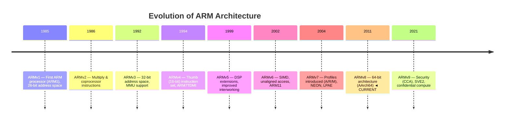
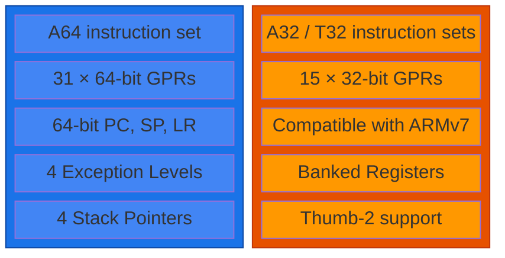
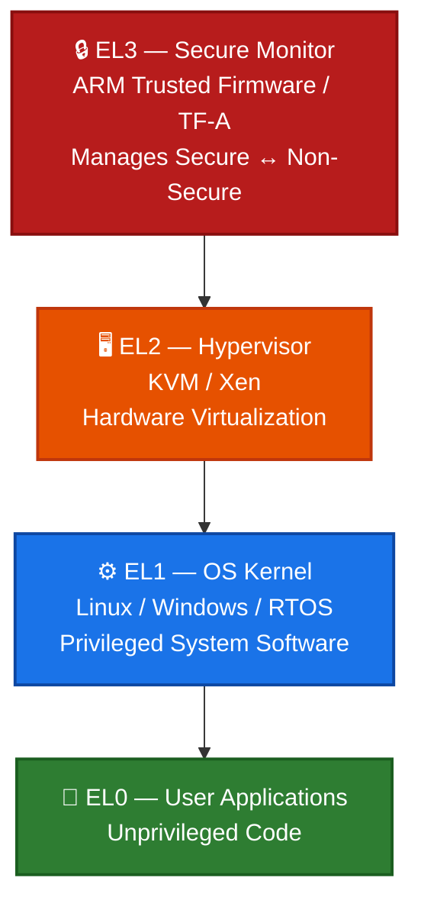
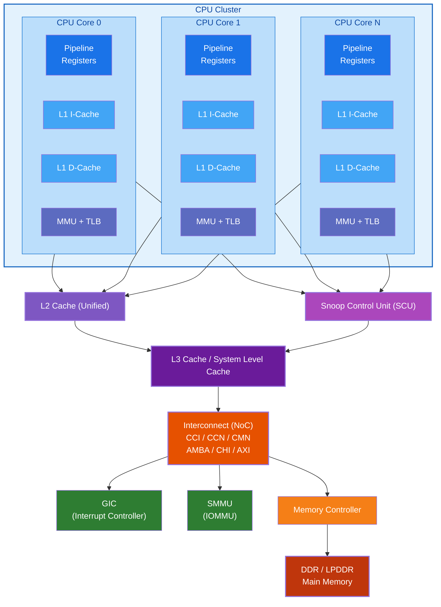

# ARMv8 Architecture — Complete Overview

## 1. What is ARM?

ARM (Advanced RISC Machines) is a family of Reduced Instruction Set Computing (RISC) architectures
for computer processors. ARM does not manufacture chips — it **licenses** the architecture and
core designs to other companies (Apple, Qualcomm, Samsung, etc.) who build the actual silicon.

### RISC vs CISC

| Feature | RISC (ARM) | CISC (x86) |
|---------|-----------|------------|
| Instruction Length | Fixed-length | Variable-length |
| Memory Access | Load/Store architecture | Memory-to-memory ops |
| Registers | Many general-purpose registers | Fewer registers |
| Execution | Simple instructions, 1 cycle | Complex multi-cycle |
| Hardware | Hardware is simpler | Hardware is complex |
| Compiler | Compiler does more work | Hardware does more |
| Power | Lower power consumption | Higher performance/W |

---

## 2. Evolution of ARM Architecture

---

## 3. ARMv8 Architecture Profiles

ARMv8 continues the three profile tradition from ARMv7:

### ARMv8-A (Application Profile)
- **Target**: Smartphones, tablets, servers, laptops
- **Features**: Full virtual memory (MMU), multiple exception levels, virtualization, security
- **Cores**: Cortex-A53, A55, A57, A72, A73, A75, A76, A77, A78, X1, X2, X3, X4
- **This documentation focuses on ARMv8-A**

### ARMv8-R (Real-Time Profile)
- **Target**: Automotive, industrial, storage controllers
- **Features**: Low-latency interrupt handling, optional MMU/MPU, deterministic behavior

### ARMv8-M (Microcontroller Profile)
- **Target**: IoT devices, sensors, embedded controllers
- **Features**: Simpler architecture, optional TrustZone-M, low power

---

## 4. ARMv8-A Key Architectural Features

### 4.1 Dual Execution States

ARMv8 defines **two execution states**:

> **Note:** Switching between states happens **ONLY** on exception entry/return.

### 4.2 Exception Levels (Privilege Model)

> ⬆️ **Highest Privilege (EL3)** → ⬇️ **Lowest Privilege (EL0)**

### 4.3 System Components Overview

---

## 5. ARMv8 Extensions (Versions)

ARMv8 has been extended over time:

| Version    | Year | Key Features                                              |
|------------|------|-----------------------------------------------------------|
| ARMv8.0-A  | 2011 | Base 64-bit architecture, AES/SHA crypto                  |
| ARMv8.1-A  | 2014 | Atomic instructions (LSE), VHE, PAN                      |
| ARMv8.2-A  | 2016 | FP16, Statistical profiling, SVE, RAS                     |
| ARMv8.3-A  | 2016 | Pointer authentication (PAC), nested virtualization       |
| ARMv8.4-A  | 2017 | Secure EL2, MPAM, Activity monitors                      |
| ARMv8.5-A  | 2018 | MTE (memory tagging), BTI (branch target identification)  |
| ARMv8.6-A  | 2019 | BFloat16, fine-grained traps, WFE enhancements            |
| ARMv8.7-A  | 2020 | PCIe/ACPI enhancements, WFI/WFE timeout                  |
| ARMv8.8-A  | 2021 | NMI support, HPMN0, TIDCP                                |
| ARMv8.9-A  | 2022 | Permission indirection, GCS (shadow stack)                |

---

## 6. Registers Quick Summary

### AArch64 Register File

**General Purpose Registers (31 × 64-bit):**

| 64-bit (Xn) | 32-bit (Wn) | Purpose |
|:---:|:---:|---|
| X0–X7 | W0–W7 | 🟦 Arguments & return values |
| X8 | W8 | 🟦 Indirect result location |
| X9–X15 | W9–W15 | 🟨 Temporary (caller-saved) |
| X16–X17 | W16–W17 | 🟧 Intra-procedure-call (IP0/IP1) |
| X18 | W18 | 🟧 Platform register |
| X19–X28 | W19–W28 | 🟩 Callee-saved |
| X29 | W29 | 🟪 Frame Pointer (FP) |
| X30 | W30 | 🟪 Link Register (LR) |
| SP | WSP | 🟥 Stack Pointer (per exception level) |
| PC | — | 🟥 Program Counter (not directly accessible) |
| XZR | WZR | ⬜ Zero Register (reads 0, writes discarded) |

> `Xn` = 64-bit view &nbsp;|&nbsp; `Wn` = lower 32-bit view of the same register

---

## 7. What Makes ARMv8 Special?

1. **Power Efficiency**: ARM achieves high performance-per-watt, enabling battery-powered devices
2. **Scalability**: Same architecture scales from embedded (Cortex-A35) to server (Neoverse N2/V2)
3. **Security Built-In**: TrustZone, PAC, MTE, BTI are architectural features, not bolted on
4. **Virtualization Native**: Hardware hypervisor support at EL2
5. **Backward Compatible**: AArch32 mode runs legacy ARMv7 code
6. **Ecosystem**: Massive software ecosystem (Linux, Android, iOS, Windows on ARM)

---

## Next Steps

Continue to **[01_CPU_Subsystem](../01_CPU_Subsystem/)** to learn about the core processing engine.
