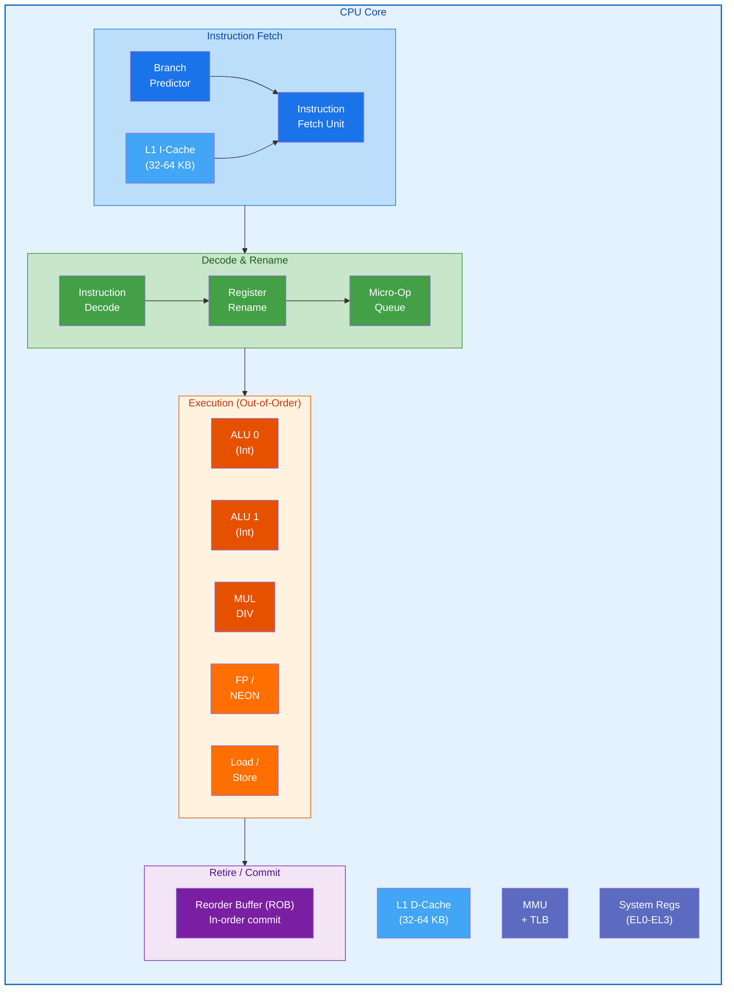
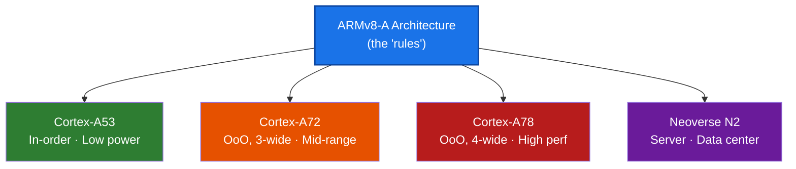

# CPU Subsystem — ARMv8-A

## Overview

The CPU subsystem is the heart of the ARMv8-A architecture. It encompasses the processing
elements (PEs) that execute instructions, manage privilege levels, handle exceptions,
and coordinate with the rest of the SoC.

## Documents in This Section

| # | Document | Description |
|---|----------|-------------|
| 1 | [Execution States](./01_Execution_States.md) | AArch64 vs AArch32, state transitions |
| 2 | [Exception Levels](./02_Exception_Levels.md) | EL0–EL3, privilege model, routing |
| 3 | [Registers](./03_Registers.md) | GPRs, system registers, special registers |
| 4 | [Instruction Set](./04_Instruction_Set.md) | A64 ISA, encoding, instruction categories |
| 5 | [Pipeline Architecture](./05_Pipeline.md) | In-order vs out-of-order, pipeline stages |
| 6 | [Branch Prediction](./06_Branch_Prediction.md) | BHT, BTB, RAS, speculative execution |

---

## Key Concepts

### What is a Processing Element (PE)?

A **Processing Element** is ARM's term for a CPU core — the hardware unit that fetches,
decodes, and executes instructions. A multi-core SoC contains multiple PEs, each with
its own register file, pipeline, L1 caches, and MMU.

### Microarchitecture vs Architecture

- **Architecture** (ISA): Defines WHAT the CPU can do — registers, instructions, behavior
- **Microarchitecture**: Defines HOW the CPU implements it — pipeline depth, cache sizes, etc.

ARMv8 is the **architecture**. Cortex-A53, Cortex-A72, Cortex-A78 are different
**microarchitectures** that implement ARMv8.

