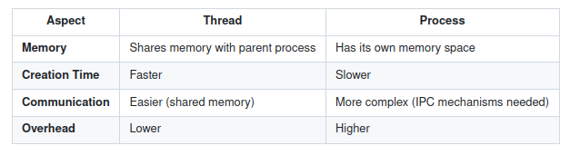

# Day 07: Deep Dive into Thread Concepts - Basic Understanding of Threads

## Table of Contents
1. Introduction
2. What Are Threads?
   - Definition
   - Characteristics of Threads
   - Threads vs Processes
3. Why Use Threads?
   - Benefits of Multithreading
   - Real-world Applications
4. Thread Lifecycle
   - States of a Thread
   - Transitions Between States
5. Thread Implementation Models
   - User-level Threads
   - Kernel-level Threads
6. Thread Libraries and Standards
   - POSIX Threads (Pthreads)
   - Windows Threads
7. Code Implementation
   - Creating and Managing Threads in C
   - Synchronization Between Threads
8. Performance Considerations
   - Thread Overhead
   - Optimizing Thread Usage
9. Sequence Diagram
10. Further Reading
11. Conclusion
12. References

---

## 1. Introduction

Threads are a fundamental concept in modern computing, enabling multitasking and parallelism within a single process. This article explores the basics of threads, their lifecycle, implementation models, and how they differ from processes. We'll also dive into practical examples using C and POSIX threads (Pthreads).

---

## 2. What Are Threads?

### Definition
A **thread** is the smallest unit of execution within a process. Threads share the same memory space and resources of the process they belong to but execute independently.

[](https://mermaid.live/edit#pako:eNp9kbFOAzEMhl_FylyEWDNUgsLAgEBtWVCWKHHvIi7OkTgSqOq743LHXdVKzRIn_v35T7xXLnlUWhX8qkgOH4Ntso2GQFZvMwcXeksMLzbQts1o_WVuuL-7TGxci752mA0NyZlys1yOZRpWsjMCn-DHnKgmhob10WRhWL29A4eIg3QSnCLvSwkNnSln6KR7-kZXpXegwrk6DonKFQcPXXKfkAieb1-vdF9jqREB_-CCPCfO36BhizkGkverhYoS2-BlHvtjiVHcophXWkKPO1s7NsrQQaS2ctr8kFNafONC5VSbVumd7Yqcau-FOA7zXyIj-UgpjqLDL5yHrIw)

### Characteristics of Threads
- **Shared Memory**: Threads within the same process share the same address space, including global variables, heap, and code.
- **Independent Execution**: Each thread has its own program counter, stack, and registers.
- **Lightweight**: Threads are more lightweight than processes because they share resources and require less overhead for creation and context switching.

### Threads vs Processes

---

## 3. Why Use Threads?

### Benefits of Multithreading
1. **Concurrency**: Threads allow multiple tasks to run simultaneously, improving responsiveness.
   - Example: A web server can handle multiple client requests using threads.
2. **Resource Sharing**: Threads share the same memory and resources, reducing duplication.
3. **Scalability**: Threads can take advantage of multi-core processors for parallel execution.
4. **Simplified Design**: Threads simplify the design of applications that perform multiple tasks.

### Real-world Applications
- **Web Servers**: Handle multiple client requests simultaneously.
- **GUI Applications**: Keep the interface responsive while performing background tasks.
- **Scientific Computing**: Perform parallel computations for faster results.

---

## 4. Thread Lifecycle

### States of a Thread
A thread goes through the following states during its lifecycle:
1. **New**: The thread is created but not yet started.
2. **Runnable**: The thread is ready to run but waiting for CPU time.
3. **Running**: The thread is actively executing instructions.
4. **Blocked/Waiting**: The thread is waiting for a resource or event.
5. **Terminated**: The thread has finished execution.

### Transitions Between States
- A thread transitions from **New** to **Runnable** when `pthread_create()` is called.
- It moves to **Running** when the scheduler assigns CPU time.
- It enters **Blocked** when waiting for I/O or synchronization.
- It transitions to **Terminated** when it completes execution or is explicitly stopped.

---

## 5. Thread Implementation Models

### User-level Threads
- Managed entirely in user space without kernel involvement.
- Advantages:
  - Faster creation and context switching.
  - No kernel overhead.
- Disadvantages:
  - Cannot take advantage of multiple CPUs.
  - Blocking system calls block the entire process.

### Kernel-level Threads
- Managed by the operating system kernel.
- Advantages:
  - Can run on multiple CPUs.
  - Blocking system calls do not block other threads.
- Disadvantages:
  - Higher overhead due to kernel involvement.

---

## 6. Thread Libraries and Standards

### POSIX Threads (Pthreads)
Pthreads is a widely used standard for thread programming in C. It provides APIs for:
- Thread creation and management
- Synchronization (mutexes, condition variables)
- Thread-specific data

### Windows Threads
Windows provides its own threading API, which includes functions like `CreateThread()` and synchronization primitives like `CriticalSection`.

---

## 7. Code Implementation

### Creating and Managing Threads in C
Here's an example of creating and managing threads using Pthreads:

```c
#include <pthread.h>
#include <stdio.h>
#include <stdlib.h>

void* thread_function(void* arg) {
    int thread_id = *(int*)arg;
    printf("Thread %d is running\n", thread_id);
    return NULL;
}

int main() {
    pthread_t threads[5];
    int thread_ids[5];

    for (int i = 0; i < 5; i++) {
        thread_ids[i] = i + 1;
        if (pthread_create(&threads[i], NULL, thread_function, &thread_ids[i]) != 0) {
            perror("Failed to create thread");
            exit(1);
        }
    }

    for (int i = 0; i < 5; i++) {
        pthread_join(threads[i], NULL);
    }

    printf("All threads have finished execution\n");
    return 0;
}
```

### Synchronization Between Threads
Threads often need to synchronize access to shared resources. Here's an example using a mutex:

```c
#include <pthread.h>
#include <stdio.h>
#include <stdlib.h>

pthread_mutex_t lock;
int shared_counter = 0;

void* increment_counter(void* arg) {
    for (int i = 0; i < 100000; i++) {
        pthread_mutex_lock(&lock);
        shared_counter++;
        pthread_mutex_unlock(&lock);
    }
    return NULL;
}

int main() {
    pthread_t threads[2];

    pthread_mutex_init(&lock, NULL);

    for (int i = 0; i < 2; i++) {
        if (pthread_create(&threads[i], NULL, increment_counter, NULL) != 0) {
            perror("Failed to create thread");
            exit(1);
        }
    }

    for (int i = 0; i < 2; i++) {
        pthread_join(threads[i], NULL);
    }

    pthread_mutex_destroy(&lock);

    printf("Final counter value: %d\n", shared_counter);
    return 0;
}
```

---

## 8. Performance Considerations

### Thread Overhead
- **Creation Time**: Threads are faster to create than processes but still incur some overhead.
- **Context Switching**: Switching between threads is faster than processes but still involves saving and restoring registers.

### Optimizing Thread Usage
1. **Minimize Synchronization**: Excessive locking can lead to contention and reduce performance.
2. **Use Thread Pools**: Reuse threads instead of creating and destroying them repeatedly.
3. **Avoid Oversubscription**: Do not create more threads than the number of CPU cores.

---

## 9. Further Reading

1. "Programming with POSIX Threads" by David R. Butenhof
2. "Modern Operating Systems" by Andrew S. Tanenbaum
3. Pthreads Documentation: https://man7.org/linux/man-pages/man7/pthreads.7.html
4. Intel Threading Building Blocks: https://www.intel.com/content/www/us/en/developer/tools/oneapi/threading-building-blocks.html

---

## 10. Conclusion

Threads are a powerful tool for achieving concurrency and parallelism in modern applications. By understanding their lifecycle, implementation models, and synchronization mechanisms, developers can build efficient and scalable multithreaded programs. While threads introduce some complexity, proper design and optimization can unlock their full potential.

---

## 11. References

1. Butenhof, D. R. (1997). Programming with POSIX Threads. Addison-Wesley.
2. Tanenbaum, A. S. (2014). Modern Operating Systems (4th ed.). Pearson.
3. Linux Programmer's Manual: https://man7.org/linux/man-pages/
4. Intel Corporation. (2021). Intel® 64 and IA-32 Architectures Software Developer's Manual.

---