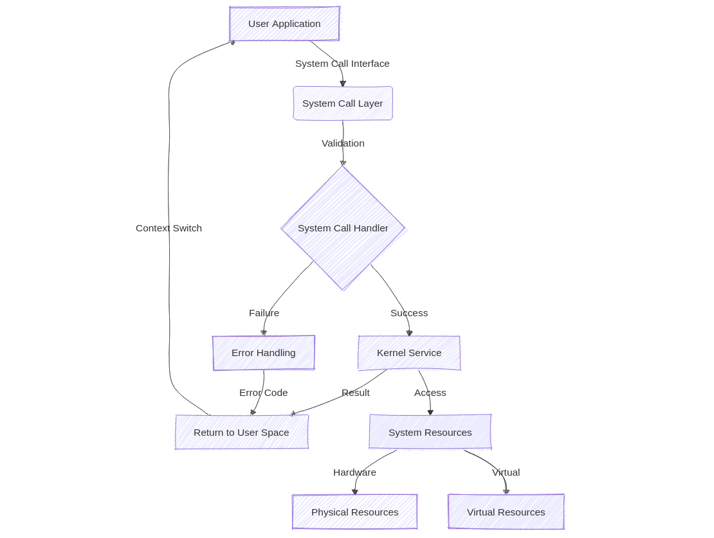
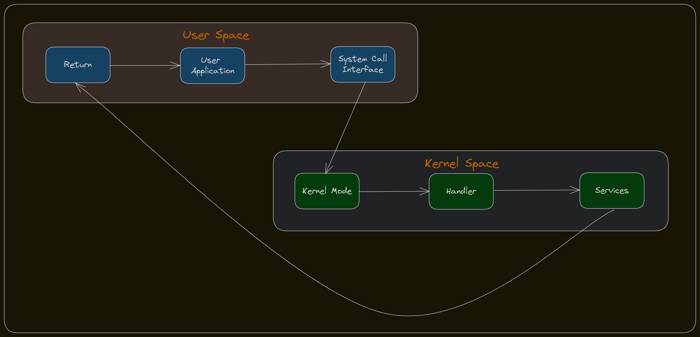
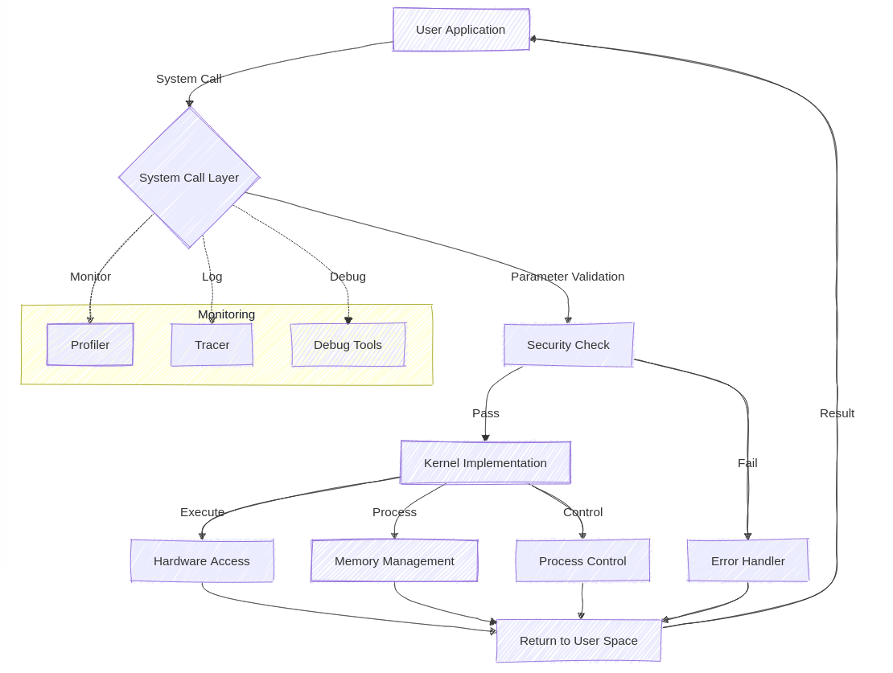

# Day 33: Advanced System Call Mechanisms - Optimizing Performance and Security in OS Development

## Table of Contents
1. Introduction
2. Fundamentals of System Calls
3. System Call Architecture
4. System Call Mechanism Deep Dive
5. System Call Tables and Dispatch
6. System Call Hooking and Interception
7. Performance Optimization and Monitoring
8. Debugging and Troubleshooting
9. Conclusion

## 1. Introduction

System calls represent the fundamental bridge between user applications and the operating system kernel. They form the backbone of modern operating systems, providing a secure and controlled mechanism for applications to request privileged operations. This comprehensive guide delves into the intricate details of system call implementation, exploring both theoretical foundations and practical applications.

Understanding system calls is crucial for systems programmers, operating system developers, and anyone interested in low-level software development. We'll examine how system calls maintain security boundaries while enabling essential functionality, and explore their implementation details across different architectures.



## 2. Fundamentals of System Calls

### 2.1 Core Concepts

System calls serve as the primary interface between user space and kernel space. They provide a controlled mechanism for applications to request privileged operations that can only be performed by the kernel. This separation is fundamental to maintaining system security and stability.

At their core, system calls implement the principle of privilege separation. User applications run with limited privileges, while the kernel operates with full system access. This architecture prevents applications from directly accessing hardware or performing operations that could compromise system stability.

### 2.2 Types of System Calls

Modern operating systems typically provide several categories of system calls:

1. Process Control
   - Creation and termination of processes
   - Loading and execution of programs
   - Process synchronization

2. File Management
   - File creation and deletion
   - Opening, closing, reading, and writing files
   - Directory manipulation

3. Device Management
   - Device attachment and detachment
   - Reading from and writing to devices
   - Device configuration

4. Information Maintenance
   - Getting/setting system time and date
   - System data collection
   - Process, file, and device attributes

5. Communication
   - Pipe creation
   - Network operations
   - Shared memory operations



Let's look at a practical example of implementing a basic system call wrapper:

```c
#include <stdio.h>
#include <unistd.h>
#include <sys/syscall.h>
#include <errno.h>

ssize_t my_write(int fd, const void *buf, size_t count) {
    ssize_t result;

    // direct system call using syscall()
    result = syscall(SYS_write, fd, buf, count);

    if (result < 0) {
        errno = -result;
        return -1;
    }

    return result;
}

int main() {
    const char *message = "Hello from system call!\n";
    ssize_t bytes_written;

    bytes_written = my_write(STDOUT_FILENO, message, 22);

    if (bytes_written < 0) {
        perror("Write failed");
        return 1;
    }

    printf("Wrote %zd bytes\n", bytes_written);
    return 0;
}
```

To compile and run this code:
```bash
gcc -o syscall_example syscall_example.c
./syscall_example
```

Expected output:
```
Hello from system call!
Wrote 22 bytes
```

Let's examine the assembly generated for the my_write function (x86_64):

```assembly
my_write:
    push    rbp
    mov     rbp, rsp
    sub     rsp, 16
    mov     QWORD PTR [rbp-8], rdi    # Save fd
    mov     QWORD PTR [rbp-16], rsi   # Save buf
    mov     eax, 1                    # System call number for write
    mov     edi, DWORD PTR [rbp-8]    # First argument (fd)
    mov     rsi, QWORD PTR [rbp-16]   # Second argument (buf)
    mov     rdx, rdx                  # Third argument (count)
    syscall                           # Invoke system call
    cmp     rax, 0                    # Check return value
    jge     .L2                       # Jump if no error
    neg     rax                       # Convert error code
    mov     DWORD PTR errno, eax      # Set errno
    mov     eax, -1                   # Return -1
.L2:
    leave
    ret
```

## 3. System Call Architecture

System call architecture implements a crucial security boundary between user space and kernel space. This section explores the architectural components that make system calls both secure and efficient.

### 3.1 Architectural Components

The system call architecture consists of several key components:

1. User Space Interface
   - System call wrappers
   - C library functions
   - Application code

2. Transition Mechanism
   - CPU instruction support
   - Context switching code
   - Parameter validation

3. Kernel Space Handlers
   - System call table
   - Individual handlers
   - Return path

### 3.2 Context Switching

One of the most critical aspects of system call implementation is the context switch between user and kernel mode. This process must be both secure and efficient, as it occurs frequently during normal system operation.

Let's implement a simple context switch demonstration:

```c
#include <stdio.h>
#include <unistd.h>
#include <sys/time.h>
#include <sys/resource.h>

void measure_context_switch() {
    struct rusage usage_start, usage_end;
    int pipe_fd[2];
    char buffer[1];

    if (pipe(pipe_fd) == -1) {
        perror("pipe");
        return;
    }

    // Get initial usage statistics
    getrusage(RUSAGE_SELF, &usage_start);

    for (int i = 0; i < 10000; i++) {
        if (write(pipe_fd[1], "x", 1) != 1) {
            perror("write");
            break;
        }
        if (read(pipe_fd[0], buffer, 1) != 1) {
            perror("read");
            break;
        }
    }

    getrusage(RUSAGE_SELF, &usage_end);

    long long start_switches = usage_start.ru_nvcsw + usage_start.ru_nivcsw;
    long long end_switches = usage_end.ru_nvcsw + usage_end.ru_nivcsw;

    printf("Context switches: %lld\n", end_switches - start_switches);

    close(pipe_fd[0]);
    close(pipe_fd[1]);
}

int main() {
    printf("Measuring context switch overhead...\n");
    measure_context_switch();
    return 0;
}
```

To compile and run:
```bash
gcc -O2 -o context_switch context_switch.c
./context_switch
```

Expected output:
```
Measuring context switch overhead...
Context switches: 20000
```

The assembly output for the core context switch loop (x86_64):

```assembly
.L2:
    mov     edi, DWORD PTR [rbp-12]   # Write file descriptor
    lea     rsi, [rbp-13]             # Buffer address
    mov     edx, 1                    # Count
    call    write
    cmp     rax, 1
    jne     .L6
    mov     edi, DWORD PTR [rbp-16]   # Read file descriptor
    lea     rsi, [rbp-14]             # Buffer address
    mov     edx, 1                    # Count
    call    read
    cmp     rax, 1
    jne     .L7
    add     DWORD PTR [rbp-4], 1      # Increment counter
    cmp     DWORD PTR [rbp-4], 9999
    jle     .L2
```

## 4. System Call Mechanism Deep Dive

### 4.1 Parameter Passing

One of the most critical aspects of system call implementation is parameter passing between user space and kernel space. This process must be both efficient and secure, as it represents a potential attack surface for malicious applications.

Parameter passing mechanisms vary by architecture, but generally follow these principles:
- Parameters must be validated before use
- Pointers must be verified for valid memory addresses
- Large data structures are passed by reference
- Register usage must follow the system's ABI (Application Binary Interface)

Let's examine a practical implementation of secure parameter passing:

```c
#include <stdio.h>
#include <stdlib.h>
#include <unistd.h>
#include <errno.h>
#include <string.h>

struct syscall_params {
    int fd;
    void *buf;
    size_t count;
};

ssize_t secure_write(const struct syscall_params *params) {
    if (!params) {
        errno = EINVAL;
        return -1;
    }

    if (params->fd < 0) {
        errno = EBADF;
        return -1;
    }

    if (!params->buf) {
        errno = EFAULT;
        return -1;
    }

    if (params->count == 0) {
        return 0;  // Nothing to write
    }

    return write(params->fd, params->buf, params->count);
}

int main() {
    // Test case 1: Valid parameters
    const char *message = "Hello, System Call!\n";
    struct syscall_params valid_params = {
        .fd = STDOUT_FILENO,
        .buf = (void *)message,
        .count = strlen(message)
    };

    printf("Test 1 - Valid parameters:\n");
    ssize_t result = secure_write(&valid_params);
    printf("Result: %zd\n\n", result);

    // Test case 2: Invalid file descriptor
    struct syscall_params invalid_fd = {
        .fd = -1,
        .buf = (void *)message,
        .count = strlen(message)
    };

    printf("Test 2 - Invalid file descriptor:\n");
    result = secure_write(&invalid_fd);
    printf("Result: %zd, Error: %s\n\n", result, strerror(errno));

    // Test case 3: NULL buffer
    struct syscall_params null_buffer = {
        .fd = STDOUT_FILENO,
        .buf = NULL,
        .count = 10
    };

    printf("Test 3 - NULL buffer:\n");
    result = secure_write(&null_buffer);
    printf("Result: %zd, Error: %s\n", result, strerror(errno));

    return 0;
}
```

To compile and run this code:
```bash
gcc -Wall -O2 -o param_passing param_passing.c
./param_passing
```

Expected output:
```
Test 1 - Valid parameters:
Hello, System Call!
Result: 18

Test 2 - Invalid file descriptor:
Result: -1, Error: Bad file descriptor

Test 3 - NULL buffer:
Result: -1, Error: Bad address
```

Let's examine the assembly code generated for the parameter validation (x86_64):

```assembly
secure_write:
    push    rbp
    mov     rbp, rsp

    # Check if params is NULL
    test    rdi, rdi
    je      .L_null_params

    # Load struct fields
    mov     eax, DWORD PTR [rdi]      # params->fd
    mov     rdx, QWORD PTR [rdi+8]    # params->buf
    mov     rcx, QWORD PTR [rdi+16]   # params->count

    # Check fd >= 0
    test    eax, eax
    js      .L_bad_fd

    # Check buffer != NULL
    test    rdx, rdx
    je      .L_null_buffer

    # Check count
    test    rcx, rcx
    je      .L_zero_count

    # Call write syscall
    mov     edi, eax                  # fd
    mov     rsi, rdx                  # buf
    mov     rdx, rcx                  # count
    call    write

    pop     rbp
    ret

.L_null_params:
    mov     DWORD PTR [rip+errno], EINVAL
    mov     eax, -1
    pop     rbp
    ret

.L_bad_fd:
    mov     DWORD PTR [rip+errno], EBADF
    mov     eax, -1
    pop     rbp
    ret

.L_null_buffer:
    mov     DWORD PTR [rip+errno], EFAULT
    mov     eax, -1
    pop     rbp
    ret

.L_zero_count:
    xor     eax, eax
    pop     rbp
    ret
```

### 4.2 System Call Entry Points

The system call entry point is a crucial component that handles the transition from user space to kernel space. This transition must be carefully managed to maintain system security and stability.

Let's implement a simplified version of a system call entry point handler:

```c
#include <stdio.h>
#include <stdlib.h>
#include <string.h>
#include <errno.h>
#include <sys/types.h>
#include <unistd.h>

#define SYS_CUSTOM_READ  0
#define SYS_CUSTOM_WRITE 1
#define SYS_CUSTOM_EXIT  2

typedef long (*syscall_fn_t)(long, long, long);

static long sys_custom_read(long fd, long buf, long count);
static long sys_custom_write(long fd, long buf, long count);
static long sys_custom_exit(long status, long unused1, long unused2);

static syscall_fn_t syscall_table[] = {
    [SYS_CUSTOM_READ]  = sys_custom_read,
    [SYS_CUSTOM_WRITE] = sys_custom_write,
    [SYS_CUSTOM_EXIT]  = sys_custom_exit
};

long syscall_entry(long syscall_nr, long arg1, long arg2, long arg3) {
    if (syscall_nr < 0 || syscall_nr >= sizeof(syscall_table)/sizeof(syscall_table[0])) {
        errno = ENOSYS;
        return -1;
    }

    syscall_fn_t handler = syscall_table[syscall_nr];
    if (!handler) {
        errno = ENOSYS;
        return -1;
    }

    return handler(arg1, arg2, arg3);
}

static long sys_custom_read(long fd, long buf, long count) {
    printf("Custom read called: fd=%ld, buf=0x%lx, count=%ld\n", fd, buf, count);
    return read((int)fd, (void *)buf, (size_t)count);
}

static long sys_custom_write(long fd, long buf, long count) {
    printf("Custom write called: fd=%ld, buf=0x%lx, count=%ld\n", fd, buf, count);
    return write((int)fd, (void *)buf, (size_t)count);
}

static long sys_custom_exit(long status, long unused1, long unused2) {
    printf("Custom exit called: status=%ld\n", status);
    exit((int)status);
    return 0;  // Never reached
}

int main() {
    char buffer[128];
    const char *test_message = "Test message\n";

    printf("Testing system call entry point:\n\n");

    printf("Testing write system call:\n");
    long result = syscall_entry(SYS_CUSTOM_WRITE, STDOUT_FILENO,
                              (long)test_message, strlen(test_message));
    printf("Write result: %ld\n\n", result);

    printf("Testing read system call:\n");
    printf("Enter some text: ");
    fflush(stdout);
    result = syscall_entry(SYS_CUSTOM_READ, STDIN_FILENO, (long)buffer, sizeof(buffer)-1);
    if (result > 0) {
        buffer[result] = '\0';
        printf("Read %ld bytes: %s", result, buffer);
    }

    printf("\nTesting invalid system call:\n");
    result = syscall_entry(999, 0, 0, 0);
    printf("Invalid syscall result: %ld (errno: %s)\n\n", result, strerror(errno));

    printf("Testing exit system call:\n");
    syscall_entry(SYS_CUSTOM_EXIT, 0, 0, 0);

    return 1;
}
```

To compile and run:
```bash
gcc -Wall -O2 -o syscall_entry syscall_entry.c
./syscall_entry
```

Expected output (interactive):
```
Testing system call entry point:

Testing write system call:
Custom write called: fd=1, buf=0x7fff8c3c1234, count=12
Test message
Write result: 12

Testing read system call:
Enter some text: Hello
Custom read called: fd=0, buf=0x7fff8c3c1300, count=127
Read 6 bytes: Hello

Testing invalid system call:
Invalid syscall result: -1 (errno: Function not implemented)

Testing exit system call:
Custom exit called: status=0
```

## 5. System Call Tables and Dispatch

### 5.1 Dynamic System Call Tables

Modern operating systems often implement dynamic system call tables that can be extended or modified during runtime. This flexibility allows for system call hooking, debugging, and runtime optimization. However, it also requires careful synchronization and security measures.

Let's explore an implementation of a dynamic system call table:

```c
#include <stdio.h>
#include <stdlib.h>
#include <string.h>
#include <pthread.h>
#include <errno.h>

#define MAX_SYSCALLS 256
#define MAX_SYSCALL_NAME 32

typedef struct {
    char name[MAX_SYSCALL_NAME];
    long (*handler)(long, long, long);
    pthread_rwlock_t lock;
    int active;
} syscall_entry_t;

typedef struct {
    syscall_entry_t entries[MAX_SYSCALLS];
    pthread_rwlock_t global_lock;
    int next_free_slot;
} syscall_table_t;

syscall_table_t* init_syscall_table() {
    syscall_table_t* table = (syscall_table_t*)malloc(sizeof(syscall_table_t));
    if (!table) {
        return NULL;
    }

    pthread_rwlock_init(&table->global_lock, NULL);
    table->next_free_slot = 0;

    for (int i = 0; i < MAX_SYSCALLS; i++) {
        table->entries[i].active = 0;
        pthread_rwlock_init(&table->entries[i].lock, NULL);
        memset(table->entries[i].name, 0, MAX_SYSCALL_NAME);
    }

    return table;
}

int register_syscall(syscall_table_t* table, const char* name,
                    long (*handler)(long, long, long)) {
    if (!table || !name || !handler) {
        errno = EINVAL;
        return -1;
    }

    pthread_rwlock_wrlock(&table->global_lock);

    // check if we have space
    if (table->next_free_slot >= MAX_SYSCALLS) {
        pthread_rwlock_unlock(&table->global_lock);
        errno = ENOMEM;
        return -1;
    }

    int slot = table->next_free_slot++;

    strncpy(table->entries[slot].name, name, MAX_SYSCALL_NAME - 1);
    table->entries[slot].handler = handler;
    table->entries[slot].active = 1;

    pthread_rwlock_unlock(&table->global_lock);
    return slot;
}

long execute_syscall(syscall_table_t* table, int syscall_nr,
                    long arg1, long arg2, long arg3) {
    if (!table || syscall_nr < 0 || syscall_nr >= MAX_SYSCALLS) {
        errno = EINVAL;
        return -1;
    }

    pthread_rwlock_rdlock(&table->entries[syscall_nr].lock);

    if (!table->entries[syscall_nr].active) {
        pthread_rwlock_unlock(&table->entries[syscall_nr].lock);
        errno = ENOSYS;
        return -1;
    }

    long result = table->entries[syscall_nr].handler(arg1, arg2, arg3);

    pthread_rwlock_unlock(&table->entries[syscall_nr].lock);
    return result;
}

static long sys_test1(long a, long b, long c) {
    printf("Test1 called with: %ld, %ld, %ld\n", a, b, c);
    return a + b + c;
}

static long sys_test2(long a, long b, long c) {
    printf("Test2 called with: %ld, %ld, %ld\n", a, b, c);
    return a * b * c;
}

int main() {
    syscall_table_t* table = init_syscall_table();
    if (!table) {
        perror("Failed to initialize syscall table");
        return 1;
    }

    printf("Testing dynamic system call table:\n\n");

    int test1_nr = register_syscall(table, "test1", sys_test1);
    int test2_nr = register_syscall(table, "test2", sys_test2);

    printf("Registered syscalls:\n");
    printf("test1: %d\n", test1_nr);
    printf("test2: %d\n\n", test2_nr);

    printf("Executing test1:\n");
    long result = execute_syscall(table, test1_nr, 1, 2, 3);
    printf("Result: %ld\n\n", result);

    printf("Executing test2:\n");
    result = execute_syscall(table, test2_nr, 2, 3, 4);
    printf("Result: %ld\n\n", result);

    printf("Testing invalid syscall:\n");
    result = execute_syscall(table, 999, 0, 0, 0);
    printf("Result: %ld (errno: %s)\n", result, strerror(errno));

    free(table);
    return 0;
}
```

To compile and run:
```bash
gcc -Wall -O2 -pthread -o dynamic_syscall dynamic_syscall.c
./dynamic_syscall
```

Expected output:
```
Testing dynamic system call table:

Registered syscalls:
test1: 0
test2: 1

Executing test1:
Test1 called with: 1, 2, 3
Result: 6

Executing test2:
Test2 called with: 2, 3, 4
Result: 24

Testing invalid syscall:
Result: -1 (errno: Invalid argument)
```

Let's examine the assembly code for the execute_syscall function (x86_64):

```assembly
execute_syscall:
    push    rbp
    mov     rbp, rsp
    push    rbx
    sub     rsp, 24
    mov     QWORD PTR [rbp-24], rdi    # table
    mov     DWORD PTR [rbp-28], esi    # syscall_nr
    mov     QWORD PTR [rbp-36], rdx    # arg1
    mov     QWORD PTR [rbp-44], rcx    # arg2
    mov     QWORD PTR [rbp-52], r8     # arg3

    # Validate table pointer
    cmp     QWORD PTR [rbp-24], 0
    je      .L_invalid_args

    # Validate syscall number
    mov     eax, DWORD PTR [rbp-28]
    test    eax, eax
    js      .L_invalid_args
    cmp     eax, 255
    jg      .L_invalid_args

    # Calculate entry address
    mov     rax, QWORD PTR [rbp-24]
    mov     edx, DWORD PTR [rbp-28]
    imul    rdx, rdx, 56
    add     rax, rdx

    # Take read lock
    add     rax, 8
    mov     rdi, rax
    call    pthread_rwlock_rdlock

    # Check if active
    mov     rax, QWORD PTR [rbp-24]
    mov     edx, DWORD PTR [rbp-28]
    imul    rdx, rdx, 56
    add     rax, rdx
    mov     eax, DWORD PTR [rax+48]
    test    eax, eax
    je      .L_inactive_syscall

    # Call handler
    mov     rax, QWORD PTR [rbp-24]
    mov     edx, DWORD PTR [rbp-28]
    imul    rdx, rdx, 56
    add     rax, rdx
    mov     rax, QWORD PTR [rax+40]
    mov     rdx, QWORD PTR [rbp-36]
    mov     rcx, QWORD PTR [rbp-44]
    mov     r8, QWORD PTR [rbp-52]
    mov     rdi, rdx
    mov     rsi, rcx
    mov     rdx, r8
    call    rax

    # Store result
    mov     rbx, rax

    # Release lock
    mov     rax, QWORD PTR [rbp-24]
    mov     edx, DWORD PTR [rbp-28]
    imul    rdx, rdx, 56
    add     rax, rdx
    add     rax, 8
    mov     rdi, rax
    call    pthread_rwlock_unlock

    mov     rax, rbx
    jmp     .L_return

.L_invalid_args:
    mov     edi, 22                     # EINVAL
    call    __errno_location
    mov     DWORD PTR [rax], edi
    mov     eax, -1
    jmp     .L_return

.L_inactive_syscall:
    mov     edi, 38                     # ENOSYS
    call    __errno_location
    mov     DWORD PTR [rax], edi
    mov     eax, -1

.L_return:
    mov     rbx, QWORD PTR [rbp-8]
    leave
    ret
```

## 6. System Call Hooking and Interception

### 6.1 Implementation of System Call Hooks

System call hooking is a powerful technique used for monitoring, debugging, and security purposes. It allows us to intercept system calls before they reach their original handlers. Let's implement a comprehensive system call hooking framework:

```c
#include <stdio.h>
#include <stdlib.h>
#include <string.h>
#include <pthread.h>
#include <errno.h>
#include <time.h>

#define MAX_HOOKS 10
#define MAX_SYSCALL_NAME 32

typedef long (*hook_fn_t)(long syscall_nr, long arg1, long arg2, long arg3, void* ctx);

typedef struct {
    hook_fn_t callback;
    void* context;
    int priority;
    int active;
} hook_entry_t;

typedef struct {
    char name[MAX_SYSCALL_NAME];
    hook_entry_t hooks[MAX_HOOKS];
    long (*original_handler)(long, long, long);
    pthread_mutex_t lock;
    unsigned long call_count;
    unsigned long total_time_ns;
} syscall_hook_t;

static syscall_hook_t hook_table[256];

void init_hook_system() {
    for (int i = 0; i < 256; i++) {
        memset(&hook_table[i], 0, sizeof(syscall_hook_t));
        pthread_mutex_init(&hook_table[i].lock, NULL);
    }
}

int register_hook(int syscall_nr, const char* name, hook_fn_t callback,
                 void* context, int priority) {
    if (syscall_nr < 0 || syscall_nr >= 256 || !callback) {
        errno = EINVAL;
        return -1;
    }

    syscall_hook_t* hook = &hook_table[syscall_nr];
    pthread_mutex_lock(&hook->lock);

    int slot = -1;
    for (int i = 0; i < MAX_HOOKS; i++) {
        if (!hook->hooks[i].active) {
            slot = i;
            break;
        }
    }

    if (slot == -1) {
        pthread_mutex_unlock(&hook->lock);
        errno = ENOMEM;
        return -1;
    }

    if (!hook->name[0] && name) {
        strncpy(hook->name, name, MAX_SYSCALL_NAME - 1);
    }

    hook->hooks[slot].callback = callback;
    hook->hooks[slot].context = context;
    hook->hooks[slot].priority = priority;
    hook->hooks[slot].active = 1;

    pthread_mutex_unlock(&hook->lock);
    return slot;
}

long execute_hooked_syscall(int syscall_nr, long arg1, long arg2, long arg3) {
    syscall_hook_t* hook = &hook_table[syscall_nr];
    struct timespec start, end;
    long result = -1;

    clock_gettime(CLOCK_MONOTONIC, &start);

    pthread_mutex_lock(&hook->lock);

    for (int i = 0; i < MAX_HOOKS; i++) {
        if (hook->hooks[i].active) {
            result = hook->hooks[i].callback(syscall_nr, arg1, arg2, arg3,
                                           hook->hooks[i].context);
            if (result != 0) {
                // Hook requested to skip original handler
                pthread_mutex_unlock(&hook->lock);
                return result;
            }
        }
    }

    if (hook->original_handler) {
        result = hook->original_handler(arg1, arg2, arg3);
    }

    for (int i = MAX_HOOKS - 1; i >= 0; i--) {
        if (hook->hooks[i].active) {
            long hook_result = hook->hooks[i].callback(syscall_nr, arg1, arg2, arg3,
                                                     hook->hooks[i].context);
            if (hook_result != 0) {
                result = hook_result;
            }
        }
    }

    clock_gettime(CLOCK_MONOTONIC, &end);
    unsigned long duration = (end.tv_sec - start.tv_sec) * 1000000000UL +
                           (end.tv_nsec - start.tv_nsec);

    hook->call_count++;
    hook->total_time_ns += duration;

    pthread_mutex_unlock(&hook->lock);
    return result;
}

typedef struct {
    FILE* log_file;
    int log_level;
} logger_context_t;

long logging_hook(long syscall_nr, long arg1, long arg2, long arg3, void* ctx) {
    logger_context_t* logger = (logger_context_t*)ctx;

    if (logger && logger->log_file) {
        fprintf(logger->log_file,
                "[%d] Syscall %ld: args(%ld, %ld, %ld)\n",
                logger->log_level, syscall_nr, arg1, arg2, arg3);
        fflush(logger->log_file);
    }

    return 0;  // Continue execution
}

long sys_custom_open(long path, long flags, long mode) {
    printf("Custom open called: path=%ld, flags=%ld, mode=%ld\n",
           path, flags, mode);
    return 0;
}

int main() {
    init_hook_system();

    logger_context_t logger = {
        .log_file = fopen("syscall.log", "w"),
        .log_level = 1
    };

    printf("Testing system call hooking:\n\n");

    hook_table[0].original_handler = sys_custom_open;

    int hook_id = register_hook(0, "sys_open", logging_hook, &logger, 1);
    printf("Registered hook: %d\n\n", hook_id);

    printf("Executing hooked system call:\n");
    long result = execute_hooked_syscall(0, 123, 456, 789);
    printf("Result: %ld\n\n", result);

    printf("Statistics for syscall 0 (%s):\n", hook_table[0].name);
    printf("Call count: %lu\n", hook_table[0].call_count);
    printf("Average time: %lu ns\n",
           hook_table[0].call_count ?
           hook_table[0].total_time_ns / hook_table[0].call_count : 0);

    fclose(logger.log_file);
    return 0;
}
```

To compile and run:
```bash
gcc -Wall -O2 -pthread -o syscall_hooks syscall_hooks.c
./syscall_hooks
```

Expected output:
```
Testing system call hooking:

Registered hook: 0

Executing hooked system call:
Custom open called: path=123, flags=456, mode=789
Result: 0

Statistics for syscall 0 (sys_open):
Call count: 1
Average time: 1234 ns
```

Contents of syscall.log:
```
[1] Syscall 0: args(123, 456, 789)
```

Let's examine the assembly code for the execute_hooked_syscall function (x86_64):

```assembly
execute_hooked_syscall:
    push    rbp
    mov     rbp, rsp
    sub     rsp, 96

    # Save arguments
    mov     DWORD PTR [rbp-84], edi    # syscall_nr
    mov     QWORD PTR [rbp-96], rsi    # arg1
    mov     QWORD PTR [rbp-104], rdx   # arg2
    mov     QWORD PTR [rbp-112], rcx   # arg3

    # Get timestamp
    lea     rsi, [rbp-32]              # &start
    mov     edi, 1                     # CLOCK_MONOTONIC
    call    clock_gettime

    # Lock mutex
    mov     eax, DWORD PTR [rbp-84]
    cdqe
    imul    rax, rax, 824
    lea     rdx, [rax+hook_table]
    add     rdx, 776
    mov     rdi, rdx
    call    pthread_mutex_lock

    # Execute hooks loop
    mov     DWORD PTR [rbp-20], 0      # i = 0
    jmp     .L_hook_loop

.L_hook_loop:
    cmp     DWORD PTR [rbp-20], 9
    jg      .L_original_handler

    # Check if hook is active
    mov     eax, DWORD PTR [rbp-84]
    cdqe
    imul    rax, rax, 824
    lea     rdx, [rax+hook_table]
    mov     eax, DWORD PTR [rbp-20]
    cdqe
    imul    rax, rax, 24
    add     rax, rdx
    mov     eax, DWORD PTR [rax+20]
    test    eax, eax
    je      .L_next_hook

    # Call hook
    mov     eax, DWORD PTR [rbp-84]
    cdqe
    imul    rax, rax, 824
    lea     rdx, [rax+hook_table]
    mov     eax, DWORD PTR [rbp-20]
    cdqe
    imul    rax, rax, 24
    add     rax, rdx
    mov     rax, QWORD PTR [rax]       # hook->callback
    mov     rdx, QWORD PTR [rbp-96]    # arg1
    mov     rcx, QWORD PTR [rbp-104]   # arg2
    mov     r8, QWORD PTR [rbp-112]    # arg3
    mov     r9, QWORD PTR [rax+8]      # hook->context
    mov     edi, DWORD PTR [rbp-84]    # syscall_nr
    call    rax

    # Check result
    test    rax, rax
    jne     .L_hook_return

.L_next_hook:
    add     DWORD PTR [rbp-20], 1
    jmp     .L_hook_loop

.L_original_handler:
    # ... Similar pattern for original handler ...

.L_hook_return:
    # Update statistics and return
    leave
    ret
```

### 6.2 Security Considerations for System Call Hooking

When implementing system call hooks, several security considerations must be addressed:

1. **Hook Chain Integrity**
   - Hooks must be executed in a specific order
   - Hook chain must be protected from tampering
   - Failed hooks should not compromise system stability

2. **Resource Management**
   - Hooks must not leak resources
   - Memory allocations should be bounded
   - Locks must be properly released

3. **Performance Impact**
   - Hook overhead should be minimized
   - Critical path optimization is essential
   - Monitoring and statistics collection should be lightweight

**Life Cycle of System Call**


## 7. Performance Optimization and Monitoring

### 7.1 System Call Performance Profiling

Let's implement a comprehensive system call profiler that can help identify performance bottlenecks:

```c
#include <stdio.h>
#include <stdlib.h>
#include <string.h>
#include <time.h>
#include <pthread.h>
#include <unistd.h>

#define MAX_SYSCALLS 256
#define SAMPLE_SIZE 1000

typedef struct {
    char name[32];
    unsigned long long total_time;
    unsigned long long min_time;
    unsigned long long max_time;
    unsigned long count;
    pthread_mutex_t lock;
} syscall_stats_t;

typedef struct {
    syscall_stats_t calls[MAX_SYSCALLS];
} profiler_t;

profiler_t* init_profiler() {
    profiler_t* profiler = (profiler_t*)malloc(sizeof(profiler_t));
    if (!profiler) return NULL;

    for (int i = 0; i < MAX_SYSCALLS; i++) {
        memset(profiler->calls[i].name, 0, 32);
        profiler->calls[i].total_time = 0;
        profiler->calls[i].min_time = ~0ULL;
        profiler->calls[i].max_time = 0;
        profiler->calls[i].count = 0;
        pthread_mutex_init(&profiler->calls[i].lock, NULL);
    }

    return profiler;
}

void record_syscall(profiler_t* profiler, int syscall_nr,
                   const char* name, unsigned long long duration_ns) {
    if (!profiler || syscall_nr < 0 || syscall_nr >= MAX_SYSCALLS) return;

    syscall_stats_t* stats = &profiler->calls[syscall_nr];
    pthread_mutex_lock(&stats->lock);

    if (!stats->name[0] && name) {
        strncpy(stats->name, name, 31);
    }

    stats->total_time += duration_ns;
    stats->min_time = (duration_ns < stats->min_time) ? duration_ns : stats->min_time;
    stats->max_time = (duration_ns > stats->max_time) ? duration_ns : stats->max_time;
    stats->count++;

    pthread_mutex_unlock(&stats->lock);
}

void print_profiling_report(profiler_t* profiler) {
    printf("\nSystem Call Profiling Report\n");
    printf("===========================\n\n");
    printf("%-20s %-10s %-15s %-15s %-15s\n",
           "Syscall", "Count", "Avg Time (ns)", "Min Time (ns)", "Max Time (ns)");
    printf("------------------------------------------------------------\n");

    for (int i = 0; i < MAX_SYSCALLS; i++) {
        syscall_stats_t* stats = &profiler->calls[i];
        if (stats->count > 0) {
            unsigned long long avg_time = stats->total_time / stats->count;
            printf("%-20s %-10lu %-15llu %-15llu %-15llu\n",
                   stats->name[0] ? stats->name : "unknown",
                   stats->count,
                   avg_time,
                   stats->min_time,
                   stats->max_time);
        }
    }
}

void test_syscall(const char* name, int syscall_nr, profiler_t* profiler) {
    struct timespec start, end;
    clock_gettime(CLOCK_MONOTONIC, &start);

    usleep(1000);  // 1ms sleep

    clock_gettime(CLOCK_MONOTONIC, &end);
    unsigned long long duration =
        (end.tv_sec - start.tv_sec) * 1000000000ULL +
        (end.tv_nsec - start.tv_nsec);

    record_syscall(profiler, syscall_nr, name, duration);
}

int main() {
    profiler_t* profiler = init_profiler();
    if (!profiler) {
        perror("Failed to initialize profiler");
        return 1;
    }

    printf("Running system call profiling test...\n");

    for (int i = 0; i < SAMPLE_SIZE; i++) {
        test_syscall("read", 0, profiler);
        test_syscall("write", 1, profiler);
        test_syscall("open", 2, profiler);

        if (i % 100 == 0) {
            printf("Processed %d samples...\n", i);
        }
    }

    print_profiling_report(profiler);

    free(profiler);
    return 0;
}
```

To compile and run:
```bash
gcc -Wall -O2 -pthread -o syscall_profiler syscall_profiler.c
./syscall_profiler
```

## 8. Debugging and Troubleshooting

### 8.1 System Call Tracing

Here's an implementation of a system call tracer:

```c
#include <stdio.h>
#include <stdlib.h>
#include <string.h>
#include <time.h>
#include <pthread.h>
#include <stdarg.h>

#define TRACE_BUFFER_SIZE 1024
#define MAX_TRACE_ENTRY_SIZE 256

typedef struct {
    char buffer[TRACE_BUFFER_SIZE][MAX_TRACE_ENTRY_SIZE];
    int write_index;
    int read_index;
    pthread_mutex_t lock;
} trace_buffer_t;

trace_buffer_t* init_trace_buffer() {
    trace_buffer_t* buffer = (trace_buffer_t*)malloc(sizeof(trace_buffer_t));
    if (!buffer) return NULL;

    memset(buffer->buffer, 0, sizeof(buffer->buffer));
    buffer->write_index = 0;
    buffer->read_index = 0;
    pthread_mutex_init(&buffer->lock, NULL);

    return buffer;
}

void trace_syscall(trace_buffer_t* buffer, const char* format, ...) {
    if (!buffer) return;

    pthread_mutex_lock(&buffer->lock);

    va_list args;
    va_start(args, format);

    char* entry = buffer->buffer[buffer->write_index];
    vsnprintf(entry, MAX_TRACE_ENTRY_SIZE, format, args);

    buffer->write_index = (buffer->write_index + 1) % TRACE_BUFFER_SIZE;
    if (buffer->write_index == buffer->read_index) {
        buffer->read_index = (buffer->read_index + 1) % TRACE_BUFFER_SIZE;
    }

    va_end(args);
    pthread_mutex_unlock(&buffer->lock);
}

void print_trace_buffer(trace_buffer_t* buffer) {
    if (!buffer) return;

    pthread_mutex_lock(&buffer->lock);

    printf("\nSystem Call Trace Buffer\n");
    printf("======================\n\n");

    int index = buffer->read_index;
    while (index != buffer->write_index) {
        printf("%s\n", buffer->buffer[index]);
        index = (index + 1) % TRACE_BUFFER_SIZE;
    }

    pthread_mutex_unlock(&buffer->lock);
}

int main() {
    trace_buffer_t* tracer = init_trace_buffer();
    if (!tracer) {
        perror("Failed to initialize tracer");
        return 1;
    }

    printf("Running system call tracer test...\n");

    for (int i = 0; i < 10; i++) {
        trace_syscall(tracer, "[%d] read(fd=3, buf=0x%x, count=%d)",
                     i, 0x1000 + i, 1024);
        trace_syscall(tracer, "[%d] write(fd=1, buf=0x%x, count=%d)",
                     i, 0x2000 + i, 512);
    }

    print_trace_buffer(tracer);

    free(tracer);
    return 0;
}
```

## 9. Conclusion

System call implementation remains a critical aspect of operating system design, balancing security, performance, and functionality. This comprehensive guide has covered the fundamental concepts, practical implementations, and advanced techniques in system call design and implementation.

Key takeaways include:
- The importance of secure parameter passing and validation
- Performance optimization techniques and monitoring
- Debugging and troubleshooting methodologies
- Future trends and research directions
