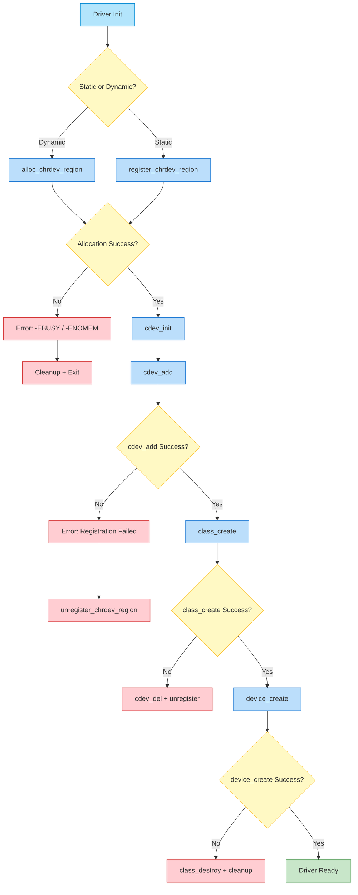
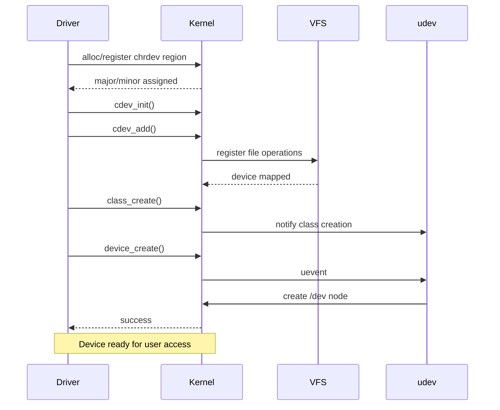
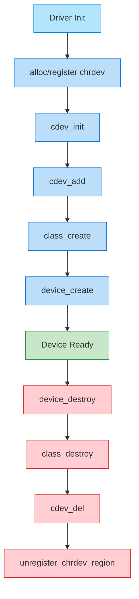
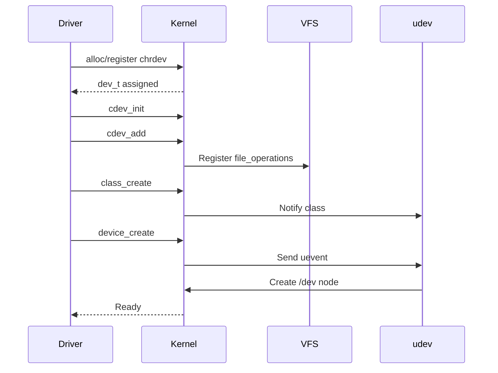

1. **Step-by-step explanation of the flow (from your diagram)**
2. **Fully colored Mermaid flowchart**
3. **Fully colored Mermaid sequence diagram**
4. **Deep working explanation (kernel internals)**
5. **Qualcomm-style system design Q&A (in-depth)**

---

# 🔢 1. Indexed Flow Explanation Char Driver (From Your Diagram)

## 1. Driver Initialization Starts

* Entry point: `module_init()` → driver probe/init
* Goal: Register a **character device** with the Linux kernel

---

## 2. Decide: Static vs Dynamic Device Number

### 🔹 Dynamic Allocation

* API: `alloc_chrdev_region()`
* Kernel:

  * Finds unused **major number**
  * Assigns minor numbers
  * Updates internal `chrdevs[]`

### 🔹 Static Allocation

* API: `register_chrdev_region()`
* Kernel:

  * Uses provided major/minor
  * Checks for conflicts
  * Registers if free

---

## 3. Allocation Result Check

### ❌ Failure

* Errors: `-EBUSY`, `-ENOMEM`
* Action:

  * Cleanup
  * Exit init → Driver load fails

### ✅ Success

* Continue to device setup

---

## 4. Initialize Character Device

* API: `cdev_init()`
* What happens:

  * Initializes `struct cdev`
  * Links `file_operations`
  * Prepares kernel object

---

## 5. Add Device to Kernel

* API: `cdev_add()`
* Kernel:

  * Adds device to `cdev_map`
  * Makes device accessible via VFS

### ❌ Failure

* Cleanup:

  * `unregister_chrdev_region()`
* Driver fails

---

## 6. Create Device Class

* API: `class_create()`
* Kernel:

  * Creates `/sys/class/<name>`
  * Enables **udev integration**

### ❌ Failure

* Cleanup:

  * `cdev_del()`
  * `unregister_chrdev_region()`

---

## 7. Create Device Node

* API: `device_create()`
* Kernel:

  * Creates `/dev/<name>`
  * Triggers **udev/devtmpfs**
  * Assigns permissions

### ❌ Failure

* Cleanup:

  * `class_destroy()`
  * `cdev_del()`
  * `unregister_chrdev_region()`

---

## 8. User Visible Effects

* `/proc/devices` → shows major number
* `/sys/class/<name>` → device metadata
* `/dev/<name>` → actual device file

✅ Driver is now **ready for use**

---

# 🎨 2. Fully Colored Mermaid Flowchart



---

# 🔁 3. Fully Colored Mermaid Sequence Diagram



---

# 🧠 4. Deep Explanation (How It Works Internally)

## 🔹 Key Kernel Structures

### 1. `dev_t`

* 32-bit value:

  * Major → driver ID
  * Minor → device instance

---

### 2. `struct cdev`

* Represents character device in kernel
* Contains:

  * `kobject`
  * `file_operations`

---

### 3. `file_operations`

Defines behavior for:

* `open()`
* `read()`
* `write()`
* `ioctl()`

---

## 🔹 What Happens During `open()`

1. User calls:

   ```
   fd = open("/dev/mydev", O_RDWR);
   ```
2. VFS:

   * Looks up inode
   * Extracts `major:minor`
3. Kernel:

   * Finds `cdev` in `cdev_map`
   * Calls:

     ```
     fops->open()
     ```

---

## 🔹 Data Flow

```
User App
   ↓
glibc
   ↓
syscall (read/write)
   ↓
VFS
   ↓
cdev_map lookup
   ↓
Driver (file_operations)
```

---

## 🔹 Why `class_create()` + `device_create()`?

Without them:

* No `/dev` entry
* Manual `mknod` required

With them:

* Automatic via **udev**
* Plug-and-play behavior

---

# 🧠 5. Qualcomm-Level System Design Q&A

These are **realistic interview-style deep questions**

---

## ❓ Q1: How would you design a scalable character driver?

### ✅ Answer:

* Use:

  * Dynamic minor allocation
  * IDA (ID allocator)
* Support multiple devices:

  ```
  struct device_context {
      int minor;
      spinlock_t lock;
      buffer;
  };
  ```
* Maintain array/map of devices

---

## ❓ Q2: How do you handle concurrency?

### ✅ Answer:

* Use:

  * `spinlock` → interrupt context
  * `mutex` → user context
* Avoid:

  * sleeping in atomic context

---

## ❓ Q3: How would you design zero-copy I/O?

### ✅ Answer:

* Use:

  * `mmap()` in driver
* Map kernel buffer to user space
* Avoid extra `copy_to_user()`

---

## ❓ Q4: How do you debug driver failures?

### ✅ Answer:

* Tools:

  * `dmesg`
  * `ftrace`
  * `perf`
* Add:

  * `printk(KERN_DEBUG)`
* Check:

  * return codes
  * resource leaks

---

## ❓ Q5: How would you design for high throughput (Qualcomm SoC)?

### ✅ Answer:

* Use:

  * DMA (Direct Memory Access)
* Avoid CPU copies
* Batch operations
* Use ring buffers

---

## ❓ Q6: Difference between `cdev` and `miscdevice`?

### ✅ Answer:

| Feature      | cdev   | miscdevice  |
| ------------ | ------ | ----------- |
| Flexibility  | High   | Low         |
| Setup        | Manual | Simplified  |
| Major number | Custom | Shared (10) |

---

## ❓ Q7: How does udev interact?

### ✅ Answer:

* Kernel sends **uevent**
* udev:

  * Listens via netlink
  * Creates `/dev` node

---

## ❓ Q8: How to handle hotplug devices?

### ✅ Answer:

* Use:

  * `device_create()` dynamically
* Handle:

  * probe/remove callbacks

---

## ❓ Q9: What happens if `cdev_add()` is skipped?

### ✅ Answer:

* Device exists in `/dev`
* But:

  * No file_operations mapping
  * open() fails

---

## ❓ Q10: Memory safety in drivers?

### ✅ Answer:

* Always:

  * validate user pointers
  * use `copy_from_user`
* Avoid:

  * direct dereferencing

---

Great — now let’s go **API-by-API**, fully structured, with:

* ✅ **Index-wise API flow**
* 🎯 **Why each API exists**
* ⚙️ **Impact on system/kernel**
* 🔄 **Execution sequence**
* 🎨 **Colored Mermaid diagrams**
* 🧠 **Brief but deep explanation per API**

---

# 🔢 1. Complete Indexed API Flow (High-Level Order)

1. `alloc_chrdev_region()` / `register_chrdev_region()`
2. `cdev_init()`
3. `cdev_add()`
4. `class_create()`
5. `device_create()`

Cleanup (reverse order):
6. `device_destroy()`
7. `class_destroy()`
8. `cdev_del()`
9. `unregister_chrdev_region()`

---

# 🎨 2. Full Colored API Flow Diagram



---

# 🔁 3. API-Level Sequence Diagram (Kernel Interaction)



---

# 🧠 4. Index-wise Deep API Explanation

---

## 🔹 1. `alloc_chrdev_region()`

### 📌 Purpose

* Dynamically allocate **major + minor numbers**

### ❓ Why it exists

* Avoid conflicts between drivers
* Kernel manages numbering safely

### ⚙️ Kernel Impact

* Updates:

  * `chrdevs[]` table
* Reserves namespace

### 🧠 Internal Behavior

* Searches free major
* Allocates range of minors

### ⚠️ If skipped

* Driver cannot be uniquely identified

---

## 🔹 2. `register_chrdev_region()`

### 📌 Purpose

* Register **manually chosen** major/minor

### ❓ Why it exists

* Needed for fixed hardware drivers

### ⚙️ Impact

* Can cause conflicts if reused

### ⚠️ Risk

* Wrong major → system instability

---

## 🔹 3. `cdev_init()`

### 📌 Purpose

* Initialize `struct cdev`

### ❓ Why it exists

* Links driver with file operations

### ⚙️ Kernel Impact

* Prepares kernel object (kobject)

### 🧠 Key Role

* Connects:

  ```
  device ↔ file_operations
  ```

---

## 🔹 4. `cdev_add()`

### 📌 Purpose

* Add device to kernel

### ❓ Why it exists

* Makes device **visible to VFS**

### ⚙️ Kernel Impact

* Inserts into:

  * `cdev_map`
* Enables syscall routing

### 🧠 Critical Step

Without this:

* `open()` fails

---

## 🔹 5. `class_create()`

### 📌 Purpose

* Create device class in sysfs

### ❓ Why it exists

* Enables automatic device node creation

### ⚙️ Kernel Impact

* Creates:

  ```
  /sys/class/<name>
  ```

### 🧠 Key Role

* Bridges kernel ↔ userspace (udev)

---

## 🔹 6. `device_create()`

### 📌 Purpose

* Create device node

### ❓ Why it exists

* Avoid manual `mknod`

### ⚙️ Kernel Impact

* Triggers:

  * uevent
  * udev rule execution

### 🧠 Result

Creates:

```
/dev/<device>
```

---

# 🔄 5. Cleanup APIs (Reverse Flow)

---

## 🔻 7. `device_destroy()`

* Removes `/dev` node
* Sends removal event

---

## 🔻 8. `class_destroy()`

* Removes `/sys/class/<name>`

---

## 🔻 9. `cdev_del()`

* Removes from `cdev_map`
* Stops VFS access

---

## 🔻 10. `unregister_chrdev_region()`

* Frees major/minor numbers
* Updates kernel registry

---

# 🔁 6. Full Lifecycle Flow (Colored)

```mermaid
flowchart LR
    A[User open()]:::user --> B[VFS lookup]:::kernel
    B --> C[cdev_map]:::kernel
    C --> D[file_operations]:::driver
    D --> E[Driver Logic]:::driver

    classDef user fill:#e1bee7,stroke:#8e24aa;
    classDef kernel fill:#bbdefb,stroke:#1976d2;
    classDef driver fill:#c8e6c9,stroke:#388e3c;
```

---

# ⚡ 7. System Impact Summary

| API                 | Impact               |
| ------------------- | -------------------- |
| alloc_chrdev_region | Resource allocation  |
| cdev_add            | Enables system calls |
| class_create        | Enables sysfs        |
| device_create       | Enables /dev         |
| cleanup APIs        | Prevent memory leaks |

---

# 🧠 8. Key Insights (Interview Gold)

* `cdev_add()` = **core activation point**
* `device_create()` = **user visibility**
* `class_create()` = **udev bridge**
* Cleanup order = **reverse of init**

---

 

 

