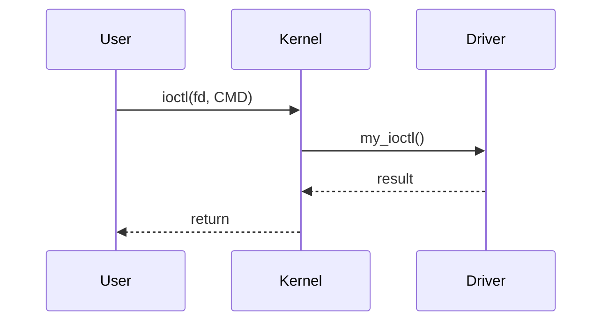
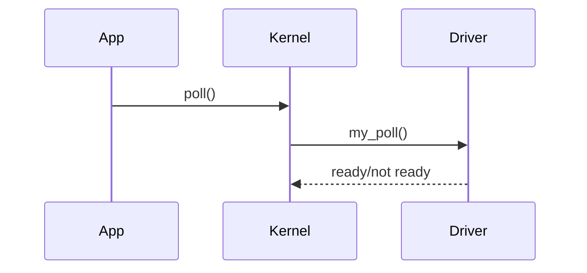
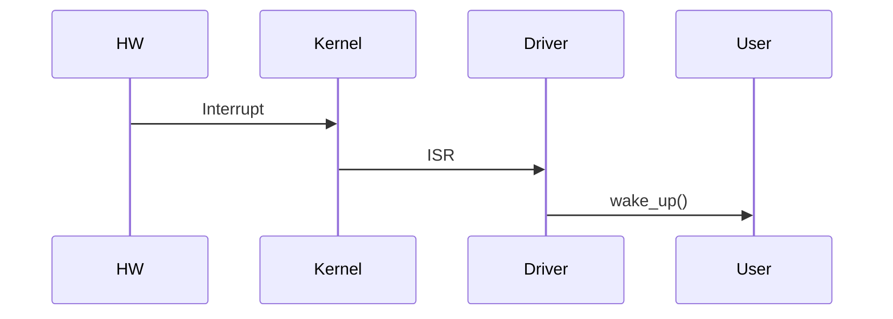
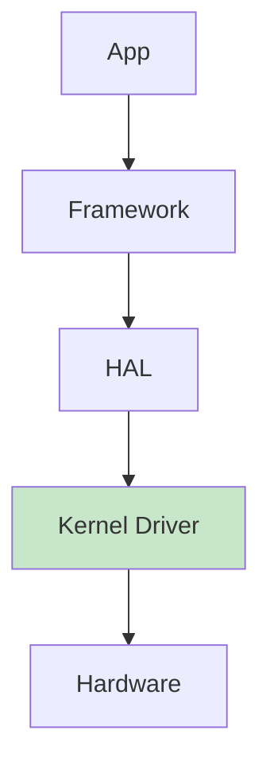

Perfect — let’s go **Qualcomm-level deep** 🚀
I’ll extend your driver with **production + advanced kernel features**, structured and indexed.

---

# 🔢 1. Advanced Features Added (Roadmap)

1. `ioctl()` → control interface
2. `poll/select()` → async readiness
3. Interrupt handling → hardware event simulation
4. Lock-free ring buffer → high-performance data path
5. DMA (concept + skeleton)
6. Android kernel integration notes

---

# 🎯 2. IOCTL Implementation (Control Path)

## 🔹 Why it exists

* Control device behavior (not data transfer)
* Used heavily in Qualcomm drivers

---

## ✅ Code Snippet

```c
#define MY_IOCTL_MAGIC 'k'
#define IOCTL_CLEAR_BUFFER _IO(MY_IOCTL_MAGIC, 0)
#define IOCTL_GET_SIZE     _IOR(MY_IOCTL_MAGIC, 1, int)

static long my_ioctl(struct file *file, unsigned int cmd, unsigned long arg)
{
    int size;

    switch (cmd) {
    case IOCTL_CLEAR_BUFFER:
        buffer_size = 0;
        pr_info("Buffer cleared\n");
        break;

    case IOCTL_GET_SIZE:
        size = buffer_size;
        if (copy_to_user((int __user *)arg, &size, sizeof(size)))
            return -EFAULT;
        break;

    default:
        return -EINVAL;
    }

    return 0;
}
```

### 🔹 Add to `file_operations`

```c
.unlocked_ioctl = my_ioctl,
```

---

# 🔁 IOCTL Flow



---

# ⚡ 3. Poll / Select Support (Non-blocking I/O)

## 🔹 Why

* Used in high-performance systems (modem, sensors)
* Avoids busy waiting

---

## ✅ Code

```c
#include <linux/poll.h>

static wait_queue_head_t wait_queue;

static unsigned int my_poll(struct file *file, poll_table *wait)
{
    poll_wait(file, &wait_queue, wait);

    if (buffer_size > 0)
        return POLLIN | POLLRDNORM;

    return 0;
}
```

### 🔹 Add:

```c
.poll = my_poll,
```

---

## 🔁 Poll Flow



---

# ⚡ 4. Interrupt Handling (ISR)

## 🔹 Why

* Hardware-driven events (very important in Qualcomm SoCs)

---

## ✅ Code (Skeleton)

```c
#include <linux/interrupt.h>

#define IRQ_NO 11

static irqreturn_t my_irq_handler(int irq, void *dev_id)
{
    pr_info("Interrupt received\n");

    buffer_size = snprintf(device_buffer, BUFFER_SIZE, "IRQ Data\n");

    wake_up_interruptible(&wait_queue);

    return IRQ_HANDLED;
}
```

### 🔹 Register IRQ

```c
request_irq(IRQ_NO, my_irq_handler, IRQF_SHARED, "my_irq", &my_cdev);
```

### 🔹 Free IRQ

```c
free_irq(IRQ_NO, &my_cdev);
```

---

## 🔁 Interrupt Flow



---

# 🚀 5. Lock-Free Ring Buffer (High Performance)

## 🔹 Why

* Avoid locks → ultra-fast (used in DSP, modem drivers)

---

## ✅ Concept

```c
#define RB_SIZE 1024

struct ring_buffer {
    char data[RB_SIZE];
    atomic_t head;
    atomic_t tail;
};
```

---

## 🔹 Write (Producer)

```c
int head = atomic_read(&rb.head);
rb.data[head % RB_SIZE] = value;
atomic_inc(&rb.head);
```

---

## 🔹 Read (Consumer)

```c
int tail = atomic_read(&rb.tail);
value = rb.data[tail % RB_SIZE];
atomic_inc(&rb.tail);
```

---

## 🔁 Flow


---

# ⚡ 6. DMA Support (Concept + Skeleton)

## 🔹 Why (CRITICAL for Qualcomm)

* Zero-copy data transfer
* Used in camera, audio, modem

---

## ✅ Skeleton

```c
#include <linux/dma-mapping.h>

void *dma_buffer;
dma_addr_t dma_handle;

dma_buffer = dma_alloc_coherent(dev, SIZE, &dma_handle, GFP_KERNEL);

if (!dma_buffer)
    return -ENOMEM;
```

---

## 🔁 DMA Flow


---

# 📱 7. Android Kernel Integration (Qualcomm Style)

## 🔹 Where this fits

* Kernel driver → `/dev/MyDevice`
* HAL layer → `/vendor/lib/hw/`
* Framework → Java API

---

## 🔁 Android Stack Flow



---

# 🧠 8. Qualcomm-Level Interview Insights

---

## ❓ Why ioctl over write?

* Structured commands
* No parsing overhead

---

## ❓ Why poll/select?

* Event-driven systems
* Power-efficient (important for mobile)

---

## ❓ Why DMA?

* CPU offload
* High throughput (camera/audio)

---

## ❓ Why ring buffer?

* Lock-free → low latency
* Real-time safe

---

## ❓ Biggest mistake candidates make?

* Ignoring:

  * race conditions
  * cleanup paths
  * interrupt context rules

---

# 🚀 If You Want NEXT LEVEL (Real Qualcomm Round)

I can give:

* 🔥 FULL integrated driver (all features combined)
* 🧪 Debugging with `ftrace`, `perf`
* 📊 Performance tuning (latency, throughput)
* 🧠 Real Qualcomm interview questions (hard)

Just say: **“FULL INTEGRATED DRIVER”** 👍
