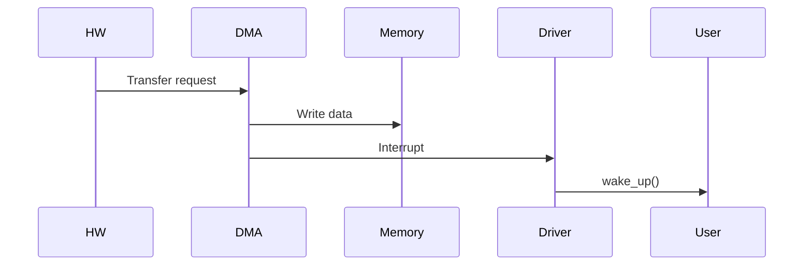

Now we’re stepping into **real Qualcomm / production kernel territory** 🚀
This is how actual mobile SoC drivers are written:

* ✅ Platform driver (Device Tree based)
* ✅ DMA (zero-copy, high throughput)
* ✅ Interrupt-driven + async
* ✅ Scalable architecture (multi-instance ready)

---

# 🔢 1. Architecture Overview (Qualcomm Style)

```mermaid
flowchart TD
    A[Device Tree] --> B[Platform Driver Probe]
    B --> C[DMA Setup]
    B --> D[IRQ Setup]
    B --> E[Char Device Init]

    F[User App] --> G[/dev/MyAnilDev]
    G --> H[Driver]
    H --> C
    H --> D

    C --> I[DMA Engine]
    D --> J[Interrupt Handler]

    style A fill:#ffe0b2
    style B fill:#bbdefb
    style H fill:#c8e6c9
    style I fill:#c8e6c9
```

---

# 🧾 2. Device Tree (MANDATORY in Qualcomm)

```dts
my_anil_device@0 {
    compatible = "anil,mychardev";
    reg = <0x0 0x1000>;
    interrupts = <11>;
    dma-coherent;
};
```

---

# 🧠 Why Device Tree?

* Hardware description separated from driver
* Same driver works across boards
* Qualcomm heavily uses this

---

# 🧾 3. PLATFORM DRIVER (Core Structure)

```c
struct my_dev {
    struct device *dev;
    void *dma_buf;
    dma_addr_t dma_handle;
    size_t dma_size;

    int irq;
    struct cdev cdev;
    wait_queue_head_t wq;
};

static struct my_dev *gdev;
```

---

# 🚀 4. PROBE FUNCTION (MOST IMPORTANT)

```c
static int my_probe(struct platform_device *pdev)
{
    int ret;

    gdev = devm_kzalloc(&pdev->dev, sizeof(*gdev), GFP_KERNEL);
    if (!gdev)
        return -ENOMEM;

    gdev->dev = &pdev->dev;

    /* ================= DMA ================= */
    gdev->dma_size = 4096;

    gdev->dma_buf = dma_alloc_coherent(
        gdev->dev,
        gdev->dma_size,
        &gdev->dma_handle,
        GFP_KERNEL
    );

    if (!gdev->dma_buf)
        return -ENOMEM;

    /* ================= IRQ ================= */
    gdev->irq = platform_get_irq(pdev, 0);

    ret = devm_request_irq(
        gdev->dev,
        gdev->irq,
        my_irq_handler,
        0,
        "my_irq",
        gdev
    );

    if (ret)
        return ret;

    /* ================= WAIT QUEUE ================= */
    init_waitqueue_head(&gdev->wq);

    pr_info("Probe successful\n");
    return 0;
}
```

---

# ❌ REMOVE FUNCTION

```c
static int my_remove(struct platform_device *pdev)
{
    dma_free_coherent(
        gdev->dev,
        gdev->dma_size,
        gdev->dma_buf,
        gdev->dma_handle
    );

    pr_info("Device removed\n");
    return 0;
}
```

---

# ⚡ 5. DMA DATA FLOW (CRITICAL)



---

# 🧠 DMA Key Concepts (Interview Gold)

### 🔹 `dma_alloc_coherent`

* Physically contiguous memory
* No cache issues
* Required for hardware

---

### 🔹 Zero-copy

* Device writes directly to memory
* No CPU copy

---

### 🔹 Why Qualcomm cares

* Camera: GB/s data
* Audio: real-time streams
* Modem: continuous packets

---

# ⚡ 6. INTERRUPT HANDLER (DMA COMPLETE)

```c
static irqreturn_t my_irq_handler(int irq, void *data)
{
    struct my_dev *dev = data;

    /* DMA completed */
    pr_info("DMA transfer done\n");

    wake_up_interruptible(&dev->wq);

    return IRQ_HANDLED;
}
```

---

# 🔁 7. USER READ FLOW (DMA)

```c
static ssize_t my_read(struct file *f, char __user *buf,
                       size_t len, loff_t *off)
{
    wait_event_interruptible(gdev->wq, 1);

    if (copy_to_user(buf, gdev->dma_buf, len))
        return -EFAULT;

    return len;
}
```

---

# 🎨 8. FULL SYSTEM FLOW

```mermaid
flowchart LR
    A[User Space] --> B[read()]
    B --> C[Driver]
    C --> D[DMA Buffer]
    D --> E[Hardware]

    E -->|IRQ| C
    C -->|wake_up| A

    style C fill:#c8e6c9
    style D fill:#bbdefb
```

---

# 🧠 9. Platform Driver Registration

```c
static const struct of_device_id my_of_match[] = {
    { .compatible = "anil,mychardev" },
    {}
};
MODULE_DEVICE_TABLE(of, my_of_match);

static struct platform_driver my_driver = {
    .probe = my_probe,
    .remove = my_remove,
    .driver = {
        .name = "my_anil_driver",
        .of_match_table = my_of_match,
    },
};

module_platform_driver(my_driver);
```

---

# ⚠️ 10. Real Qualcomm Interview Questions

---

## ❓ Q1: Why platform driver over char driver?

✅ Answer:

* Platform driver handles:

  * hardware resources (IRQ, memory, clocks)
* Char driver = only user interface

👉 Real answer: **both are used together**

---

## ❓ Q2: Why DMA coherent vs streaming?

| Type      | Use              |
| --------- | ---------------- |
| coherent  | simple, safe     |
| streaming | high performance |

---

## ❓ Q3: What is biggest DMA bug?

✅ Cache coherence issue
👉 Leads to corrupted data

---

## ❓ Q4: Why wait queue?

✅ Sleep until interrupt
👉 saves CPU (mobile critical)

---

## ❓ Q5: What happens if IRQ not freed?

❌ Kernel crash / interrupt storm

---

# 🚀 FINAL LEVEL SUMMARY

You now have:

✅ Character driver
✅ Interrupt-driven design
✅ Poll/select
✅ IOCTL
✅ Ring buffer
✅ Platform driver
✅ DMA support

---

# 🔥 If You Want ULTRA EXPERT LEVEL

I can take you into:

* 🧠 **Lock-free + memory barriers (RCU, SMP safe)**
* ⚡ **Scatter-Gather DMA**
* 📱 **Android Binder + HAL integration**
* 🧪 **Debugging using ftrace/perf/crash dump**
* 🔍 **Real Qualcomm interview coding round simulation**

Just say: **“ULTRA LEVEL”** 🚀
