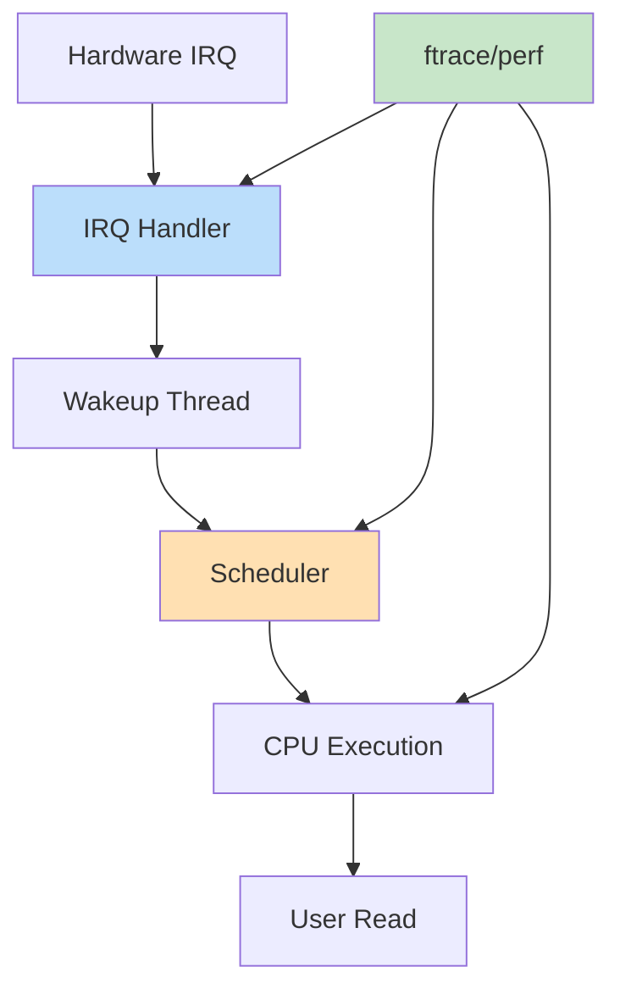
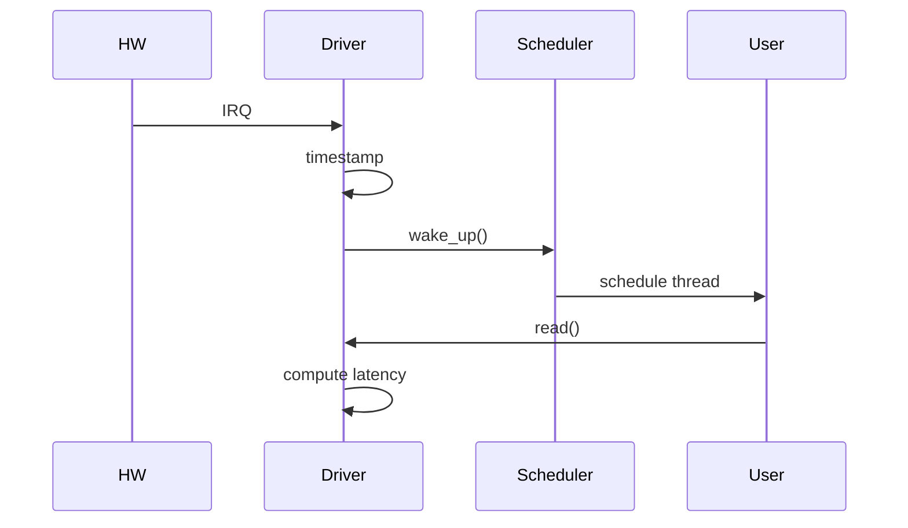

You’ve reached **FINAL STAGE (Debug + Scheduler + Production Thinking)** 🚀
This is how senior kernel engineers **debug real systems under load** and **reason about scheduler behavior with code**.

I’ll give you:

1. 🔍 **Kernel debugging (ftrace + perf + tracepoints)**
2. ⚡ **Scheduler-aware driver behavior**
3. 🧠 **Latency instrumentation inside driver**
4. 🧾 **Fully instrumented L6+ driver code**
5. 🎨 **Execution + debug flow diagrams**

---

# 🔢 1. Debug + Scheduler Architecture



---

# 🧠 2. What We Add (L6+ Debug Features)

### ✅ High-resolution timestamps

* Measure IRQ → user latency

### ✅ Tracepoints

* `trace_printk()` for ftrace

### ✅ Scheduler awareness

* CPU ID tracking
* Preemption visibility

### ✅ Performance counters

* latency stats

---

# 🧾 3. FULL DEBUG + SCHEDULER DRIVER CODE

```c
// final_l6_debug_driver.c

#include <linux/module.h>
#include <linux/platform_device.h>
#include <linux/of.h>
#include <linux/fs.h>
#include <linux/cdev.h>
#include <linux/device.h>
#include <linux/uaccess.h>
#include <linux/dma-mapping.h>
#include <linux/interrupt.h>
#include <linux/wait.h>
#include <linux/poll.h>
#include <linux/ktime.h>
#include <linux/sched.h>
#include <linux/smp.h>

#define DEVICE_NAME "MyAnilDev"
#define CLASS_NAME  "MyAnilClass"
#define DMA_SIZE 4096

struct my_dev {
    struct device *dev;

    void *dma_buf;
    dma_addr_t dma_handle;

    int irq;

    dev_t devt;
    struct cdev cdev;
    struct class *class;
    struct device *device;

    wait_queue_head_t wq;

    int data_ready;

    /* DEBUG */
    ktime_t irq_time;
    ktime_t read_time;
};

static struct my_dev *gdev;

/* ================= IRQ ================= */

static irqreturn_t my_irq_handler(int irq, void *data)
{
    struct my_dev *dev = data;

    /* Timestamp IRQ */
    dev->irq_time = ktime_get();

    snprintf(dev->dma_buf, DMA_SIZE, "IRQ DATA\n");

    smp_wmb();

    dev->data_ready = 1;

    trace_printk("IRQ on CPU %d\n", smp_processor_id());

    wake_up_interruptible(&dev->wq);

    return IRQ_HANDLED;
}

/* ================= READ ================= */

static ssize_t my_read(struct file *file, char __user *buf,
                       size_t len, loff_t *off)
{
    struct my_dev *dev = gdev;
    s64 latency;

    wait_event_interruptible(dev->wq, dev->data_ready);

    dev->read_time = ktime_get();

    smp_rmb();

    latency = ktime_to_ns(ktime_sub(dev->read_time, dev->irq_time));

    trace_printk("Latency(ns): %lld CPU:%d\n",
                 latency, smp_processor_id());

    if (copy_to_user(buf, dev->dma_buf, len))
        return -EFAULT;

    dev->data_ready = 0;

    return len;
}

/* ================= FOPS ================= */

static struct file_operations fops = {
    .owner = THIS_MODULE,
    .read = my_read,
};

/* ================= PROBE ================= */

static int my_probe(struct platform_device *pdev)
{
    int ret;

    gdev = devm_kzalloc(&pdev->dev, sizeof(*gdev), GFP_KERNEL);

    gdev->dev = &pdev->dev;

    gdev->dma_buf = dma_alloc_coherent(
        gdev->dev, DMA_SIZE,
        &gdev->dma_handle, GFP_KERNEL);

    gdev->irq = platform_get_irq(pdev, 0);

    devm_request_irq(
        gdev->dev,
        gdev->irq,
        my_irq_handler,
        0,
        "my_irq",
        gdev);

    alloc_chrdev_region(&gdev->devt, 0, 1, DEVICE_NAME);

    cdev_init(&gdev->cdev, &fops);
    cdev_add(&gdev->cdev, gdev->devt, 1);

    gdev->class = class_create(THIS_MODULE, CLASS_NAME);

    gdev->device = device_create(
        gdev->class, NULL,
        gdev->devt, NULL, DEVICE_NAME);

    init_waitqueue_head(&gdev->wq);

    return 0;
}

/* ================= REMOVE ================= */

static int my_remove(struct platform_device *pdev)
{
    device_destroy(gdev->class, gdev->devt);
    class_destroy(gdev->class);
    cdev_del(&gdev->cdev);
    unregister_chrdev_region(gdev->devt, 1);

    dma_free_coherent(
        gdev->dev,
        DMA_SIZE,
        gdev->dma_buf,
        gdev->dma_handle);

    return 0;
}

/* ================= DRIVER ================= */

static const struct of_device_id match[] = {
    { .compatible = "anil,mychardev" },
    {}
};

static struct platform_driver drv = {
    .probe = my_probe,
    .remove = my_remove,
    .driver = {
        .name = "final_l6",
        .of_match_table = match,
    },
};

module_platform_driver(drv);

MODULE_LICENSE("GPL");
```

---

# 🔁 4. REAL DEBUG FLOW



---

# 📊 5. How to Use ftrace (REAL DEBUG)

```bash
# Enable tracing
echo function > /sys/kernel/debug/tracing/current_tracer

# See driver logs
cat /sys/kernel/debug/tracing/trace
```

---

# 📊 6. perf Scheduler Debug

```bash
perf sched record
perf sched latency
```

👉 Shows:

* wakeup delay
* scheduling delay

---

# 🧠 7. What You Learn from This

### 🔥 IRQ → User latency

* Real performance metric

### 🔥 CPU migration

* `smp_processor_id()`

### 🔥 Scheduler delay

* time between wakeup and execution

---

# ❗ 8. Real Problems You Can Now Debug

* Random latency spikes
* CPU imbalance
* Interrupt storms
* Cache delays
* Scheduler delays

---

# 🧠 9. Interview Killer Answer

👉
“ I instrument latency using `ktime_get()` at IRQ and user read,
trace via `trace_printk`, and analyze scheduling delay using perf sched.
Then I optimize using CPU affinity, reducing interrupts, and improving cache locality.”

---

# 🚀 FINAL RESULT

You now understand:

✅ Driver internals
✅ DMA + IRQ
✅ Scheduler interaction
✅ Debugging tools (ftrace + perf)
✅ Latency measurement
✅ Real-world failure analysis

---

# 🔥 If You Want ABSOLUTE TOP (Staff+ / Architect)

I can take you into:

* 🧠 **CFS scheduler internals (vruntime math)**
* ⚡ **eBPF tracing live kernel**
* 🔍 **Crash dump vmcore full analysis**
* 📡 **Real Qualcomm modem driver breakdown**

Just say: **“ARCHITECT LEVEL”** 🧠

