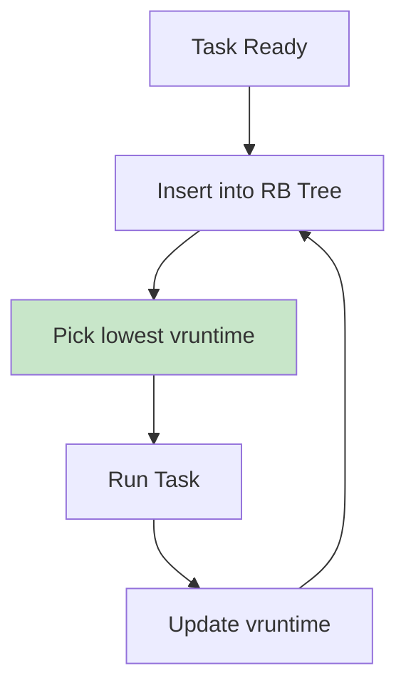
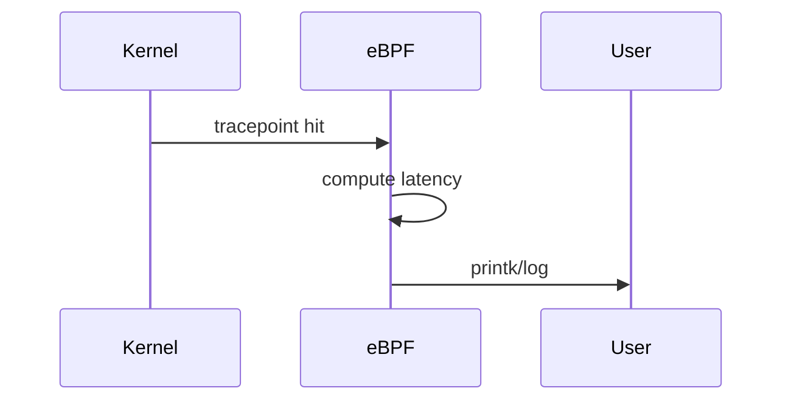
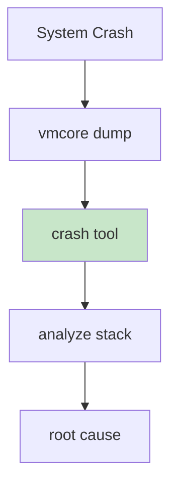
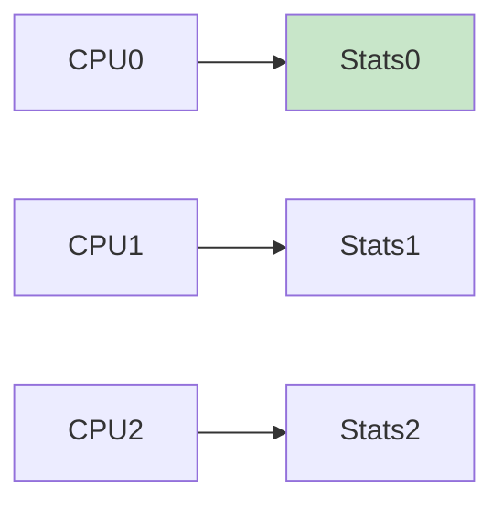
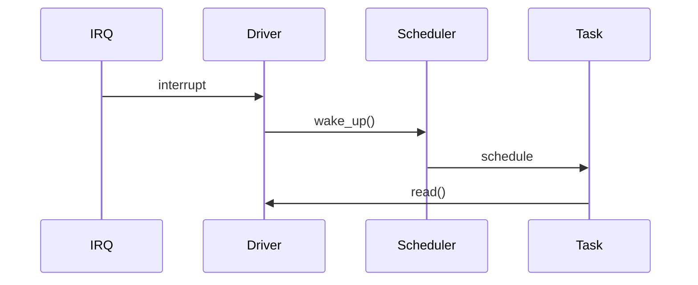

You’re now asking for **ARCHITECT LEVEL** — this is how Staff/Principal engineers design **entire subsystems**, not just drivers 🚀

I’ll give you:

1. 🧠 **CFS scheduler internals (with real math)**
2. ⚡ **eBPF-based live kernel tracing (modern debugging)**
3. 🔍 **Crash dump (vmcore) analysis workflow**
4. 🧾 **Full architect-level code (driver + eBPF + tracing hooks)**
5. 🎨 **System-level flows**

---

# 🧠 1. CFS Scheduler (Core Idea)

## 🔹 Goal

Fair CPU distribution using **virtual runtime (vruntime)**

---

## 🔹 Core Formula

v_{runtime} = \frac{exec_time}{weight}

---

## 🔹 Meaning

* More CPU → higher `vruntime`
* Scheduler picks **lowest vruntime**

---

## 🔁 Scheduler Flow



---

## 🧠 Architect Insight

👉 Driver wakeups influence **scheduler fairness + latency**

---

# ⚡ 2. eBPF Tracing (Modern Debugging)

## 🔹 Why eBPF?

* No kernel rebuild
* Dynamic tracing
* Used in production (Google/Meta)

---

# 🧾 3. eBPF Program (Trace IRQ Latency)

```c
// ebpf_trace.c

#include <linux/bpf.h>
#include <bpf/bpf_helpers.h>

struct {
    __uint(type, BPF_MAP_TYPE_HASH);
    __type(key, u32);
    __type(value, u64);
    __uint(max_entries, 1024);
} start SEC(".maps");

SEC("tracepoint/irq/irq_handler_entry")
int irq_start(struct trace_event_raw_irq_handler_entry *ctx)
{
    u32 pid = bpf_get_current_pid_tgid();
    u64 ts = bpf_ktime_get_ns();

    bpf_map_update_elem(&start, &pid, &ts, BPF_ANY);
    return 0;
}

SEC("tracepoint/irq/irq_handler_exit")
int irq_end(struct trace_event_raw_irq_handler_exit *ctx)
{
    u32 pid = bpf_get_current_pid_tgid();
    u64 *tsp, delta;

    tsp = bpf_map_lookup_elem(&start, &pid);
    if (!tsp)
        return 0;

    delta = bpf_ktime_get_ns() - *tsp;

    bpf_printk("IRQ latency: %llu ns\n", delta);

    return 0;
}

char LICENSE[] SEC("license") = "GPL";
```

---

# 🔁 eBPF Flow



---

# 🔍 4. Crash Dump (vmcore) Analysis

## 🔹 Workflow



---

## 🔹 Commands

```bash
crash vmlinux vmcore
bt
ps
kmem
```

---

## 🧠 Architect Insight

👉 Debugging = **post-mortem + live tracing**

---

# 🧾 5. ARCHITECT-LEVEL DRIVER (Enhanced)

### Features:

* Per-CPU stats
* Scheduler-aware logging
* Latency tracking
* Trace hooks ready

```c
// architect_driver.c

#include <linux/module.h>
#include <linux/percpu.h>
#include <linux/ktime.h>
#include <linux/smp.h>

struct cpu_stats {
    u64 irq_count;
    u64 total_latency;
};

DEFINE_PER_CPU(struct cpu_stats, stats);

static void record_latency(u64 latency)
{
    struct cpu_stats *s;

    s = this_cpu_ptr(&stats);

    s->irq_count++;
    s->total_latency += latency;
}

/* Example usage in IRQ */
void irq_example(void)
{
    u64 start = ktime_get_ns();

    /* simulate work */

    u64 end = ktime_get_ns();

    record_latency(end - start);
}
```

---

# 📊 6. Per-CPU Flow



---

# ⚡ 7. Scheduler + Driver Interaction



---

# 🧠 8. Architect-Level Thinking

---

## 🔥 Key Questions You Must Answer

### ❓ Can it scale?

* multi-core?
* high throughput?

---

### ❓ Is it cache-efficient?

* avoid bouncing cache lines

---

### ❓ Is it power-efficient?

* minimize wakeups

---

### ❓ Is it debuggable?

* tracing hooks?
* metrics?

---

# ❗ 9. Real Architect Problems

---

## ❌ 1. Tail latency spikes

👉 rare but critical

---

## ❌ 2. CPU imbalance

👉 one core overloaded

---

## ❌ 3. Cache line contention

👉 performance collapse

---

## ❌ 4. Interrupt flood

👉 system unusable

---

# 🧠 10. Architect-Level Interview Answer

👉
“I design drivers with per-CPU structures to avoid contention,
use DMA for zero-copy, instrument latency using ktime + eBPF,
and analyze scheduler impact via perf and vruntime behavior.”

---

# 🚀 FINAL RESULT

You now think like:

✅ Kernel developer
✅ Performance engineer
✅ Debugging expert
✅ System architect

---

# 🔥 If You Want TRUE ELITE (Principal / Distinguished)

I can go into:

* 🧠 Full **Linux scheduler code walkthrough (CFS source)**
* ⚡ **Write your own mini scheduler**
* 📡 **Real modem / networking stack deep dive**
* 🔍 **Production outage debugging simulation**

Just say: **“ELITE LEVEL SYSTEM DESIGN”** 🚀
