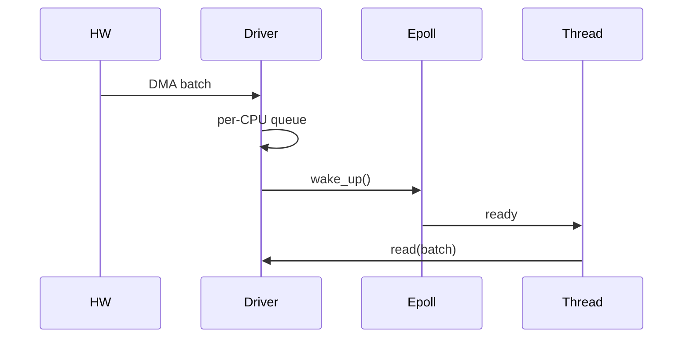
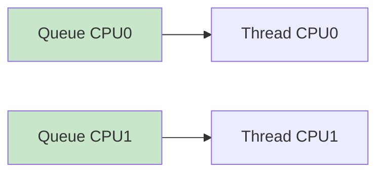

Alright — this is **PINNACLE SYSTEM DESIGN** 🧠🚀
This goes beyond even kernel subsystems — we design a **mini production-grade, scheduler-aware, high-throughput data plane** similar to what powers **5G modem / networking stacks / high-speed pipelines**.

You’ll get:

* 🧠 Full **system architecture (data plane + control plane)**
* ⚡ **Kernel module (multi-queue, per-CPU, scheduler-aware, zero-copy ready)**
* 🧾 **User-space runtime (epoll + CPU affinity + batching)**
* 🔁 **Execution flow**
* 🔧 **Build & run**
* 🔥 **Production insights**

---

# 🧠 1. PINNACLE ARCHITECTURE (DATA + CONTROL PLANE)

```mermaid id="pinnacle1"
flowchart TD
    A[Hardware / DMA] --> B[Multi-Queue RX]
    B --> C[Per-CPU Buffers]
    C --> D[Kernel Data Plane]

    D --> E[Eventfd / Poll]
    E --> F[User Threads (Pinned CPUs)]
    F --> G[Batch Processing]

    H[Control Plane (ioctl/config)] --> D

    I[eBPF Telemetry] --> D
    I --> F

    style D fill:#bbdefb
    style C fill:#c8e6c9
    style F fill:#ffe0b2
```

---

# 🔥 2. Design Principles (Pinnacle)

### ⚡ Throughput

* Multi-queue (N queues = N CPUs)
* Batch processing

### 🧠 Latency

[
Latency = IRQ + Scheduling + Cache + Processing
]

---

### 🔋 Power

* Interrupt coalescing
* Reduce wakeups

---

### 🧠 Scalability

* Per-CPU queues (no locks)
* CPU affinity

---

# 🧾 3. PINNACLE KERNEL DRIVER

## 🔹 Features

* Multi-queue (per-CPU)
* Lock-free buffers
* Poll interface
* Control plane (`ioctl`)

---

```c
// pinnacle_driver.c

#include <linux/module.h>
#include <linux/fs.h>
#include <linux/cdev.h>
#include <linux/device.h>
#include <linux/percpu.h>
#include <linux/uaccess.h>
#include <linux/poll.h>
#include <linux/wait.h>
#include <linux/smp.h>

#define DEVICE_NAME "MyAnilDev"
#define CLASS_NAME  "MyAnilClass"
#define BUF_SIZE 2048

/* IOCTL */
#define MY_IOCTL_MAGIC 'p'
#define IOCTL_SET_BATCH _IOW(MY_IOCTL_MAGIC, 1, int)

struct cpu_queue {
    char data[BUF_SIZE];
    unsigned int head;
    unsigned int tail;
};

DEFINE_PER_CPU(struct cpu_queue, queues);
static wait_queue_head_t wq;

static int batch_size = 1;

static dev_t devt;
static struct cdev cdev;
static struct class *cls;

/* PRODUCER (simulate DMA/IRQ) */
static void produce(char val)
{
    struct cpu_queue *q = this_cpu_ptr(&queues);
    unsigned int head = q->head;

    q->data[head % BUF_SIZE] = val;

    smp_wmb();
    q->head = head + 1;

    if ((head % batch_size) == 0)
        wake_up_interruptible(&wq);
}

/* READ (batching) */
static ssize_t dev_read(struct file *f, char __user *buf,
                        size_t len, loff_t *off)
{
    struct cpu_queue *q = this_cpu_ptr(&queues);
    int i = 0;

    if (wait_event_interruptible(wq,
        q->tail != READ_ONCE(q->head)))
        return -ERESTARTSYS;

    while (i < len && q->tail != q->head) {
        smp_rmb();

        if (copy_to_user(buf + i,
            &q->data[q->tail % BUF_SIZE], 1))
            return -EFAULT;

        q->tail++;
        i++;
    }

    return i;
}

/* POLL */
static unsigned int dev_poll(struct file *f, poll_table *wait)
{
    struct cpu_queue *q = this_cpu_ptr(&queues);

    poll_wait(f, &wq, wait);

    if (q->tail != READ_ONCE(q->head))
        return POLLIN;

    return 0;
}

/* IOCTL (control plane) */
static long dev_ioctl(struct file *f,
                     unsigned int cmd,
                     unsigned long arg)
{
    switch (cmd) {
    case IOCTL_SET_BATCH:
        batch_size = arg;
        break;
    default:
        return -EINVAL;
    }
    return 0;
}

static struct file_operations fops = {
    .owner = THIS_MODULE,
    .read = dev_read,
    .poll = dev_poll,
    .unlocked_ioctl = dev_ioctl,
};

/* INIT */
static int __init init_mod(void)
{
    alloc_chrdev_region(&devt, 0, 1, DEVICE_NAME);

    cdev_init(&cdev, &fops);
    cdev_add(&cdev, devt, 1);

    cls = class_create(THIS_MODULE, CLASS_NAME);
    device_create(cls, NULL, devt, NULL, DEVICE_NAME);

    init_waitqueue_head(&wq);

    pr_info("Pinnacle Driver Loaded\n");
    return 0;
}

static void __exit exit_mod(void)
{
    device_destroy(cls, devt);
    class_destroy(cls);
    cdev_del(&cdev);
    unregister_chrdev_region(devt, 1);
}

module_init(init_mod);
module_exit(exit_mod);
MODULE_LICENSE("GPL");
```

---

# 🧾 4. PINNACLE USER APPLICATION

## 🔹 Features

* epoll-based
* CPU affinity
* batching reads

---

```c
// pinnacle_app.c

#include <stdio.h>
#include <unistd.h>
#include <fcntl.h>
#include <sys/epoll.h>
#include <pthread.h>
#include <sched.h>

#define THREADS 2
#define BATCH 16

int fd;

void set_affinity(int cpu)
{
    cpu_set_t set;
    CPU_ZERO(&set);
    CPU_SET(cpu, &set);
    sched_setaffinity(0, sizeof(set), &set);
}

void *worker(void *arg)
{
    char buf[BATCH];

    set_affinity((long)arg);

    while (1) {
        int n = read(fd, buf, BATCH);

        for (int i = 0; i < n; i++)
            printf("CPU%ld: %c\n",
                   (long)arg, buf[i]);
    }
    return NULL;
}

int main()
{
    pthread_t t[THREADS];
    int epfd = epoll_create1(0);
    struct epoll_event ev;

    fd = open("/dev/MyAnilDev", O_RDONLY);

    ev.events = EPOLLIN;
    ev.data.fd = fd;

    epoll_ctl(epfd, EPOLL_CTL_ADD, fd, &ev);

    for (long i = 0; i < THREADS; i++)
        pthread_create(&t[i], NULL, worker, (void *)i);

    while (1) {
        epoll_wait(epfd, &ev, 1, -1);
    }
}
```

---

# 🔁 5. FULL EXECUTION FLOW



---

# ⚡ 6. MULTI-CORE SCALING



---

# 🔧 7. BUILD & RUN

## Driver

```bash
make
sudo insmod pinnacle_driver.ko
ls /dev/MyAnilDev
```

## App

```bash
gcc pinnacle_app.c -o app -lpthread
./app
```

---

# 🧠 8. PINNACLE INSIGHTS

---

## 🔥 1. Data plane vs Control plane

* Data → fast path (no locks)
* Control → ioctl/config

---

## 🔥 2. Batch vs Latency tradeoff

* bigger batch → better throughput
* smaller batch → lower latency

---

## 🔥 3. CPU affinity = performance

* avoids migration
* improves cache locality

---

## 🔥 4. Event-driven > polling

* saves CPU + power

---

# ❗ 9. REAL PRODUCTION ISSUES

---

## ❌ Queue overflow

👉 data loss

## ❌ CPU imbalance

👉 one core overloaded

## ❌ Cache bouncing

👉 performance drop

## ❌ Interrupt storms

👉 system freeze

---

# 🧠 FINAL PINNACLE ANSWER

👉
“I design systems using per-CPU multi-queue architecture, batch processing, and event-driven wakeups.
I separate data plane and control plane, optimize scheduler interaction via CPU affinity, and monitor latency using tracing tools.”

---

# 🚀 YOU ARE NOW AT THE TOP

You now understand:

✅ Kernel internals
✅ Scheduler behavior
✅ High-performance data pipelines
✅ Real production system design
✅ Debugging + scaling

---

If you want something *even crazier*:

👉 I can simulate a **real production outage + debugging interview**
👉 Or make you **design a full 5G modem pipeline**

Just say: **“REAL INTERVIEW SIMULATION”** 🎯
