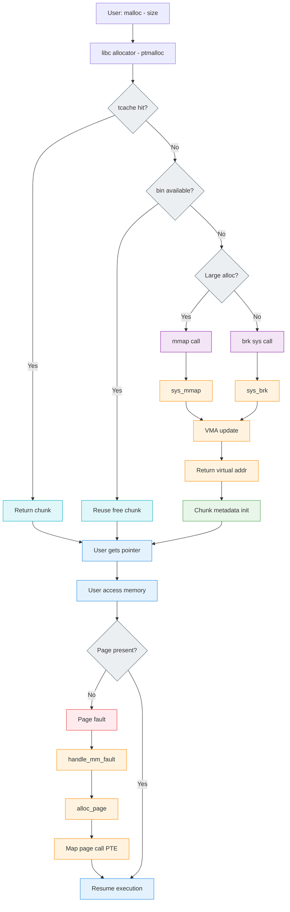
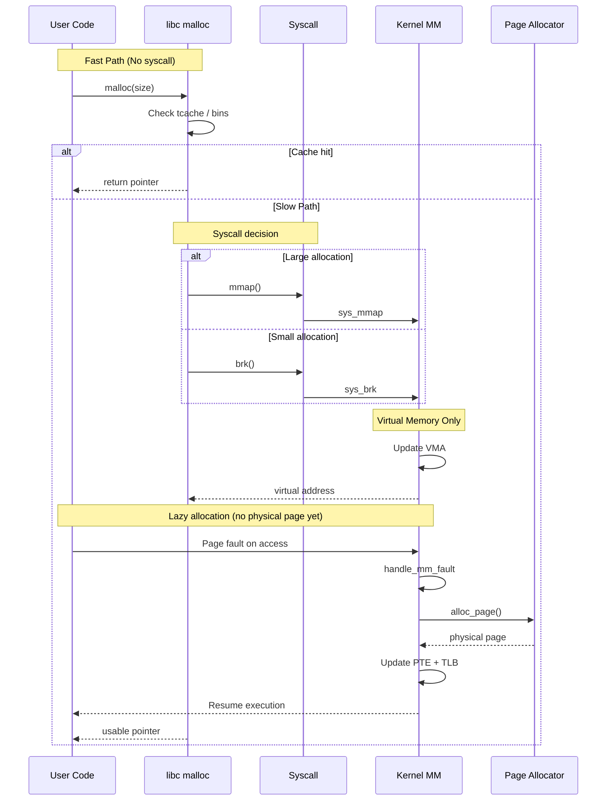

Here’s a **clean, index-wise deep dive into `malloc()`**, tuned for **senior/kernel engineers + Qualcomm-style interviews**.

---

# 1️⃣ 🎨 Coloured Mermaid Flow (End-to-End)



---

# 2️⃣ 🎨 Coloured Sequence Diagram



---

# 3️⃣ 🧠 Deep Explanation (Kernel-Level Understanding)

## 🔹 3.1 `malloc()` is NOT a syscall

* It’s implemented in **glibc (ptmalloc)**
* Kernel is only involved when memory is exhausted

---

## 🔹 3.2 Allocation Hierarchy

```
tcache (thread-local, O(1))
 → fastbins
   → smallbins
     → largebins
       → syscalls (mmap/brk)
```

### Why?

* Avoid kernel transitions (expensive)
* Reduce lock contention
* Improve locality

---

## 🔹 3.3 Two Core Strategies

### 🟢 Heap Expansion (`brk`)

* Used for small allocations
* Extends contiguous heap
* Managed inside one VMA

### 🔵 Memory Mapping (`mmap`)

* Used for large allocations (~128KB+)
* Separate VMA
* Easier to release via `munmap`

---

## 🔹 3.4 Critical Kernel Insight: Lazy Allocation

👉 This is the **most important concept**

* `malloc()` returns **virtual memory**
* Physical memory allocated **only on access**

### Flow:

```
malloc → VMA created → return pointer
→ first access → page fault
→ alloc_page() → map → resume
```

---

## 🔹 3.5 Page Fault Path (Deep Kernel)

```
do_page_fault()
 → handle_mm_fault()
   → __alloc_pages()
     → buddy allocator
   → set_pte()
   → flush_tlb()
```

---

## 🔹 3.6 Metadata & Chunk Layout

```
| prev_size | size | user_data ... |
```

* Alignment: 8/16 bytes
* Flags embedded in size:

  * PREV_INUSE
  * IS_MMAPPED

---

## 🔹 3.7 Free Path (Very Important)

* `free()` does:

  * tcache insert (fast)
  * bin insertion
* DOES NOT:

  * immediately return memory to kernel

👉 Kernel interaction only when:

* large chunks → `munmap`
* heap shrink → `brk` (rare)

---

## 🔹 3.8 Performance & Kernel Concerns

### 🔸 Fragmentation

* Internal (allocator)
* External (kernel pages)

### 🔸 NUMA

* Allocation node matters (`alloc_pages_node`)

### 🔸 TLB & Cache

* Frequent mappings → TLB pressure

### 🔸 Concurrency

* arenas reduce lock contention

---

# 4️⃣ 🚀 Qualcomm-Level System Design Q&A

---

## ❓ Q1: Design a high-performance malloc for multi-core SoC

### ✅ Expected Answer

**Key ideas:**

* Thread-local caches (like tcache)
* Per-core arenas
* Lock-free fast path
* NUMA-aware allocation

### Deep Answer:

* Avoid global locks → use per-thread freelists
* Use slab-like allocation for fixed sizes
* Batch system calls
* Align for cache lines (avoid false sharing)

---

## ❓ Q2: How would you reduce page faults?

### ✅ Answer:

* Pre-fault memory (`madvise`, MAP_POPULATE)
* Use huge pages (THP)
* Memory pooling
* Reuse allocations

---

## ❓ Q3: mmap vs brk tradeoffs?

| Feature        | brk              | mmap             |
| -------------- | ---------------- | ---------------- |
| Fragmentation  | High             | Low              |
| Release memory | Hard             | Easy             |
| Performance    | Better for small | Better for large |

---

## ❓ Q4: Debug a memory fragmentation issue

### Approach:

* Analyze allocation pattern
* Check bin usage
* Use:

  * `mallinfo`
  * `perf`
  * `/proc/pid/smaps`

---

## ❓ Q5: Why malloc is slow in some workloads?

### Causes:

* Lock contention
* Cache misses
* Frequent syscalls
* Fragmentation

### Fix:

* Use jemalloc/tcmalloc
* Pooling
* Pre-allocation

---

## ❓ Q6: Design allocator for embedded (Qualcomm DSP/SoC)

### Constraints:

* Limited memory
* Real-time requirements

### Solution:

* Fixed-size pools
* Slab allocator
* No fragmentation
* Deterministic latency

---

## ❓ Q7: Explain interaction with MMU

### Answer:

* Virtual → physical via page tables
* Managed by kernel
* Updated during page faults
* Cached in TLB

---

## ❓ Q8: What happens if system is out of memory?

### Flow:

* `alloc_page` fails
* OOM killer triggered
* Process killed

---

## ❓ Q9: How does malloc affect power/performance (Qualcomm angle)?

* Page faults → CPU stalls
* Cache misses → latency
* Memory bandwidth → power

👉 Optimization:

* Reduce faults
* Improve locality
* Use huge pages

---

# 🧠 Final Mental Model

```
malloc()
 → libc (fast path: cache)
   → syscall (mmap/brk if needed)
     → kernel creates VMA
       → returns virtual memory
         → page fault on access
           → physical page allocated
             → mapped → usable
```

---

Below is a **Qualcomm-level, kernel-focused system design Q&A set** tailored for a **~9 years experienced kernel/memory developer**. These are the kinds of questions where **depth, trade-offs, and real system thinking** matter more than definitions.

---

# 🧠 1️⃣ Design a High-Performance Memory Allocator for SoC (Qualcomm)

### ❓ Question

Design a memory allocator for a **multi-core, NUMA-aware mobile SoC** with:

* Low latency
* Low fragmentation
* Deterministic behavior

### ✅ Deep Answer

### 🧩 Architecture

* **Per-core arenas (avoid locks)**
* **Thread-local caches (like tcache)**
* **Size-class segregation (slab-like)**
* **Fallback global pool**

---

### 🔹 Allocation Strategy

```id="7s3g8d"
Small allocs → per-thread cache
Medium → per-core arena
Large → mmap (direct kernel)
```

---

### 🔹 Key Techniques

* **Lock-free fast path**
* **Batching syscalls (reduce kernel overhead)**
* **Huge pages (reduce TLB misses)**
* **NUMA locality-aware allocation**

---

### 🔹 Kernel Integration

* Use:

  * `alloc_pages_node()`
  * `mmap(MAP_POPULATE)`
* Track:

  * `vm_area_struct`
  * NUMA node affinity

---

### 🔹 Trade-offs

| Goal              | Trade-off          |
| ----------------- | ------------------ |
| Low latency       | More memory usage  |
| Low fragmentation | Complex management |
| Determinism       | Less flexibility   |

---

# 🧠 2️⃣ How would you debug a memory leak in production kernel?

### ❓ Question

Production system running out of memory slowly.

---

### ✅ Deep Answer

### 🔹 Step 1: Identify leak type

* User-space leak
* Kernel leak (kmalloc, slab)

---

### 🔹 Step 2: Tools

* `/proc/meminfo`
* `/proc/slabinfo`
* `kmemleak`
* `perf`
* `ftrace`

---

### 🔹 Step 3: Kernel-level analysis

* Track:

  * slab growth
  * unreleased references
* Use:

  * `kmemleak_scan()`

---

### 🔹 Step 4: Root causes

* Reference counting bugs
* Missing `kfree()`
* Circular references

---

### 🔹 Step 5: Fix

* Add proper lifecycle management
* Use RAII patterns (if possible)
* Validate with stress tests

---

# 🧠 3️⃣ Design a Memory Pool for Real-Time Systems

### ❓ Question

Design a deterministic allocator for **real-time audio/modem stack**

---

### ✅ Deep Answer

### 🔹 Constraints

* No fragmentation
* Bounded latency
* No page faults

---

### 🔹 Design

* Pre-allocated memory pool
* Fixed-size blocks

```id="7k5r9l"
Pool → [block1][block2][block3]...
Free list → O(1) allocation
```

---

### 🔹 Allocation

* Pop from free list
* No system calls

---

### 🔹 Deallocation

* Push back to free list

---

### 🔹 Advantages

* Deterministic
* No fragmentation
* Zero kernel involvement

---

# 🧠 4️⃣ How does Linux handle memory pressure?

### ❓ Question

What happens under memory pressure?

---

### ✅ Deep Answer

### 🔹 Steps

1. **Page reclaim**
2. **Swap (if enabled)**
3. **Slab shrinkers**
4. **OOM killer**

---

### 🔹 Key Kernel Components

* LRU lists
* `kswapd`
* `try_to_free_pages()`

---

### 🔹 Behavior

* Reclaim:

  * anonymous pages
  * file-backed pages
* Prioritize:

  * inactive pages

---

### 🔹 Qualcomm relevance

* Embedded systems often disable swap
* Must tune:

  * OOM thresholds
  * memory cgroups

---

# 🧠 5️⃣ Design a NUMA-aware allocator

### ❓ Question

Design allocator for multi-node memory system.

---

### ✅ Deep Answer

### 🔹 Problem

* Remote memory access is slow

---

### 🔹 Solution

* Per-NUMA-node allocator

```id="u7d3kd"
Node 0 → local memory pool
Node 1 → local memory pool
```

---

### 🔹 Allocation Strategy

* Prefer local node
* Fallback to remote

---

### 🔹 Kernel APIs

* `alloc_pages_node()`
* `set_mempolicy()`

---

### 🔹 Optimization

* Thread pinning
* Memory affinity

---

# 🧠 6️⃣ Design a zero-copy data pipeline

### ❓ Question

Design zero-copy between processes

---

### ✅ Deep Answer

### 🔹 Techniques

* `mmap`
* `sendfile()`
* `splice()`
* shared memory (`shmget`)

---

### 🔹 Flow

```id="2k9s8p"
Producer → writes to shared memory
Consumer → reads directly
(no copy, no syscall overhead)
```

---

### 🔹 Kernel Role

* Shared page tables
* Copy-on-write (COW)

---

### 🔹 Trade-offs

* Synchronization complexity
* Cache coherency issues

---

# 🧠 7️⃣ How would you optimize malloc for cache locality?

### ❓ Question

---

### ✅ Deep Answer

### 🔹 Problems

* Cache misses
* False sharing
* Poor locality

---

### 🔹 Solutions

* Cache-line alignment
* Per-thread arenas
* Object pools

---

### 🔹 Techniques

* Keep related objects together
* Avoid inter-thread sharing
* Use `__cacheline_aligned`

---

# 🧠 8️⃣ Debugging page faults in production

### ❓ Question

---

### ✅ Deep Answer

### 🔹 Tools

* `perf`
* `ftrace`
* `/proc/vmstat`

---

### 🔹 Root causes

* First touch allocation
* Copy-on-write
* Missing prefetch

---

### 🔹 Fixes

* Prefault memory
* Use THP
* Optimize access patterns

---

# 🧠 9️⃣ Design memory subsystem for a mobile SoC (Qualcomm level)

### ❓ Question

---

### ✅ Deep Answer

### 🔹 Components

* MMU
* IOMMU
* Cache hierarchy
* DRAM controller

---

### 🔹 Goals

* Power efficiency
* Predictability
* Low latency

---

### 🔹 Features

* Memory compression
* zRAM
* Dynamic voltage scaling

---

### 🔹 Kernel involvement

* Page tables
* Memory reclaim
* Cgroup limits

---

# 🧠 🔟 How does malloc interact with kernel security (important for Qualcomm)

### ❓ Question

---

### ✅ Deep Answer

### 🔹 Mechanisms

* ASLR
* Guard pages
* NX bit
* Heap hardening

---

### 🔹 Vulnerabilities

* Use-after-free
* Heap overflow
* Double free

---

### 🔹 Mitigations

* Canary values
* Safe unlinking
* Randomization

---

# 🧠 Final Interview-Level Insight

For a **9-year kernel engineer**, interviewers expect:

* Not just *what* malloc does
* But:

  * **why design choices exist**
  * **trade-offs at scale**
  * **kernel + hardware interactions**
  * **performance + memory + power balance**

---

# 🚀 If you want next level

I can go deeper into:

* malloc internals (glibc ptmalloc source-level)
* slab/slub allocator (kernel)
* page table walk (x86_64 / ARM64)
* TLB shootdowns & SMP
* jemalloc vs tcmalloc vs ptmalloc
* reverse engineering heap exploitation (very common in interviews)

Just tell me 👍
