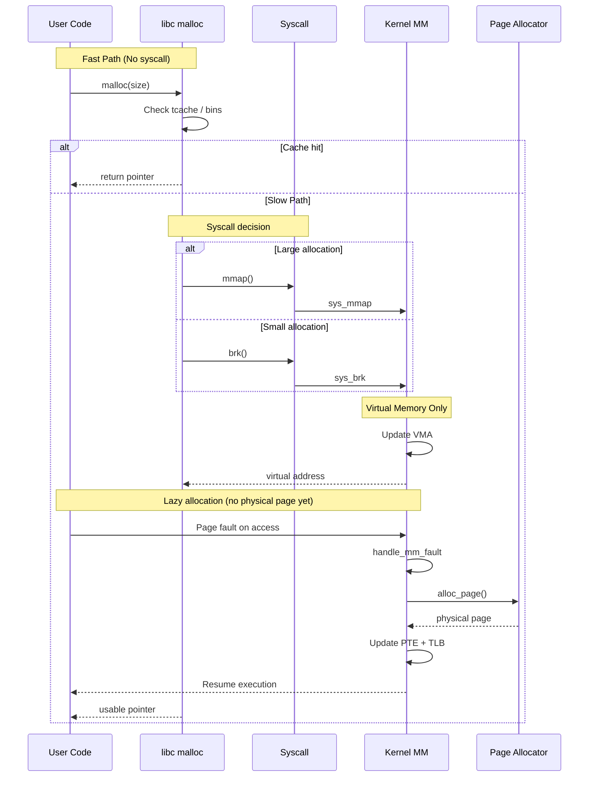

Here’s a **clean, index-wise deep dive into `malloc()`**, tuned for **senior/kernel engineers + Qualcomm-style interviews**.

---

# 1️⃣ 🎨 Coloured Mermaid Flow (End-to-End)

```mermaid
flowchart TD
    %% User Layer
    A[User: malloc(size)]:::user --> B[libc allocator]:::libc

    %% Fast path
    B --> C{tcache hit?}:::decision
    C -->|Yes| D[Return chunk]:::fast
    D --> Z[User gets pointer]:::user

    %% Slow path
    C -->|No| E{bin available?}:::decision
    E -->|Yes| F[Reuse free chunk]:::fast
    F --> Z

    %% Syscall decision
    E -->|No| G{Large alloc?}:::decision
    G -->|Yes| H[mmap()]:::syscall
    G -->|No| I[brk()]:::syscall

    %% Kernel path
    H --> J[sys_mmap]:::kernel
    I --> K[sys_brk]:::kernel

    J --> L[VMA update]:::kernel
    K --> L

    L --> M[Return virtual addr]:::kernel

    %% Back to user
    M --> N[Chunk metadata init]:::libc
    N --> Z

    %% Lazy allocation
    Z --> O[User access memory]:::user
    O --> P{Page present?}:::decision

    P -->|No| Q[Page fault]:::fault
    Q --> R[handle_mm_fault]:::kernel
    R --> S[alloc_page]:::kernel
    S --> T[Map page (PTE)]:::kernel
    T --> U[Resume execution]:::user

    P -->|Yes| U

    %% Styles
    classDef user fill:#E3F2FD,stroke:#1E88E5;
    classDef libc fill:#E8F5E9,stroke:#43A047;
    classDef kernel fill:#FFF3E0,stroke:#FB8C00;
    classDef syscall fill:#F3E5F5,stroke:#8E24AA;
    classDef decision fill:#ECEFF1,stroke:#546E7A;
    classDef fast fill:#E0F7FA,stroke:#00ACC1;
    classDef fault fill:#FFEBEE,stroke:#E53935;
```

---

# 2️⃣ 🎨 Coloured Sequence Diagram



---

# 3️⃣ 🧠 Deep Explanation (Kernel-Level Understanding)

## 🔹 3.1 `malloc()` is NOT a syscall

* It’s implemented in **glibc (ptmalloc)**
* Kernel is only involved when memory is exhausted

---

## 🔹 3.2 Allocation Hierarchy

```
tcache (thread-local, O(1))
 → fastbins
   → smallbins
     → largebins
       → syscalls (mmap/brk)
```

### Why?

* Avoid kernel transitions (expensive)
* Reduce lock contention
* Improve locality

---

## 🔹 3.3 Two Core Strategies

### 🟢 Heap Expansion (`brk`)

* Used for small allocations
* Extends contiguous heap
* Managed inside one VMA

### 🔵 Memory Mapping (`mmap`)

* Used for large allocations (~128KB+)
* Separate VMA
* Easier to release via `munmap`

---

## 🔹 3.4 Critical Kernel Insight: Lazy Allocation

👉 This is the **most important concept**

* `malloc()` returns **virtual memory**
* Physical memory allocated **only on access**

### Flow:

```
malloc → VMA created → return pointer
→ first access → page fault
→ alloc_page() → map → resume
```

---

## 🔹 3.5 Page Fault Path (Deep Kernel)

```
do_page_fault()
 → handle_mm_fault()
   → __alloc_pages()
     → buddy allocator
   → set_pte()
   → flush_tlb()
```

---

## 🔹 3.6 Metadata & Chunk Layout

```
| prev_size | size | user_data ... |
```

* Alignment: 8/16 bytes
* Flags embedded in size:

  * PREV_INUSE
  * IS_MMAPPED

---

## 🔹 3.7 Free Path (Very Important)

* `free()` does:

  * tcache insert (fast)
  * bin insertion
* DOES NOT:

  * immediately return memory to kernel

👉 Kernel interaction only when:

* large chunks → `munmap`
* heap shrink → `brk` (rare)

---

## 🔹 3.8 Performance & Kernel Concerns

### 🔸 Fragmentation

* Internal (allocator)
* External (kernel pages)

### 🔸 NUMA

* Allocation node matters (`alloc_pages_node`)

### 🔸 TLB & Cache

* Frequent mappings → TLB pressure

### 🔸 Concurrency

* arenas reduce lock contention

---

# 4️⃣ 🚀 Qualcomm-Level System Design Q&A

---

## ❓ Q1: Design a high-performance malloc for multi-core SoC

### ✅ Expected Answer

**Key ideas:**

* Thread-local caches (like tcache)
* Per-core arenas
* Lock-free fast path
* NUMA-aware allocation

### Deep Answer:

* Avoid global locks → use per-thread freelists
* Use slab-like allocation for fixed sizes
* Batch system calls
* Align for cache lines (avoid false sharing)

---

## ❓ Q2: How would you reduce page faults?

### ✅ Answer:

* Pre-fault memory (`madvise`, MAP_POPULATE)
* Use huge pages (THP)
* Memory pooling
* Reuse allocations

---

## ❓ Q3: mmap vs brk tradeoffs?

| Feature        | brk              | mmap             |
| -------------- | ---------------- | ---------------- |
| Fragmentation  | High             | Low              |
| Release memory | Hard             | Easy             |
| Performance    | Better for small | Better for large |

---

## ❓ Q4: Debug a memory fragmentation issue

### Approach:

* Analyze allocation pattern
* Check bin usage
* Use:

  * `mallinfo`
  * `perf`
  * `/proc/pid/smaps`

---

## ❓ Q5: Why malloc is slow in some workloads?

### Causes:

* Lock contention
* Cache misses
* Frequent syscalls
* Fragmentation

### Fix:

* Use jemalloc/tcmalloc
* Pooling
* Pre-allocation

---

## ❓ Q6: Design allocator for embedded (Qualcomm DSP/SoC)

### Constraints:

* Limited memory
* Real-time requirements

### Solution:

* Fixed-size pools
* Slab allocator
* No fragmentation
* Deterministic latency

---

## ❓ Q7: Explain interaction with MMU

### Answer:

* Virtual → physical via page tables
* Managed by kernel
* Updated during page faults
* Cached in TLB

---

## ❓ Q8: What happens if system is out of memory?

### Flow:

* `alloc_page` fails
* OOM killer triggered
* Process killed

---

## ❓ Q9: How does malloc affect power/performance (Qualcomm angle)?

* Page faults → CPU stalls
* Cache misses → latency
* Memory bandwidth → power

👉 Optimization:

* Reduce faults
* Improve locality
* Use huge pages

---

# 🧠 Final Mental Model

```
malloc()
 → libc (fast path: cache)
   → syscall (mmap/brk if needed)
     → kernel creates VMA
       → returns virtual memory
         → page fault on access
           → physical page allocated
             → mapped → usable
```

---

If you want next level (very likely asked in Qualcomm):

* slab vs slub vs buddy allocator (kernel side)
* jemalloc vs ptmalloc deep comparison
* full page table walk (CR3 → PML4 → PTE)
* tcache internals with exploitation angles

Just tell me 👍
