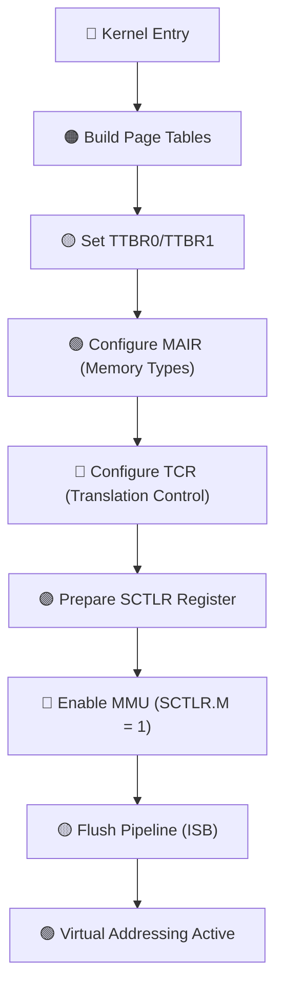
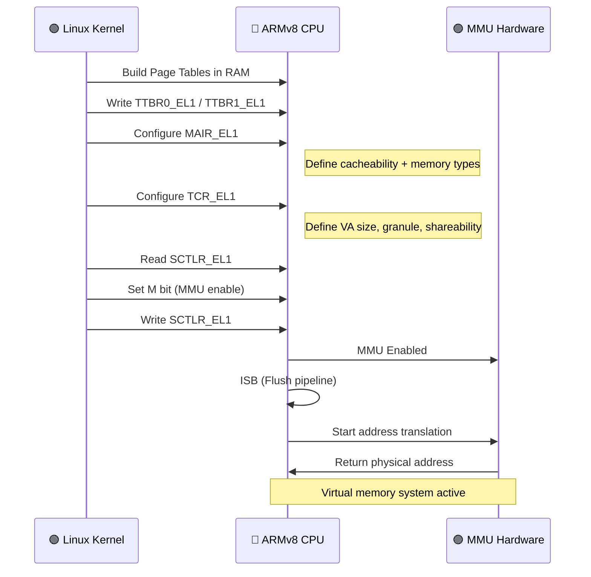
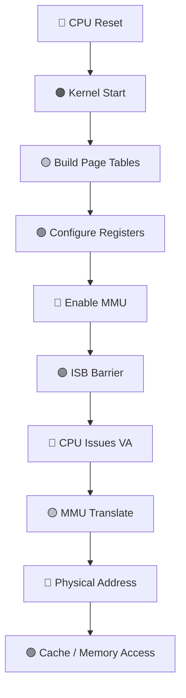
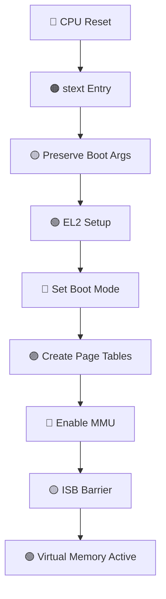
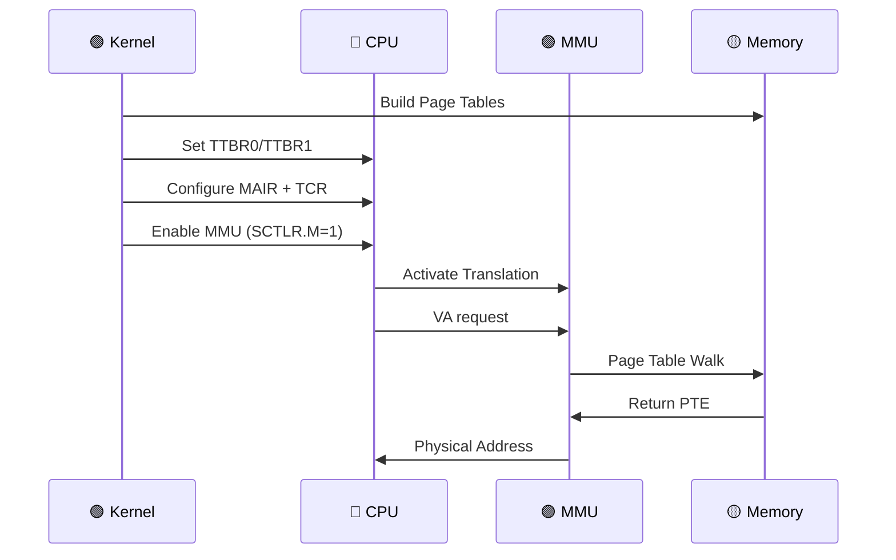
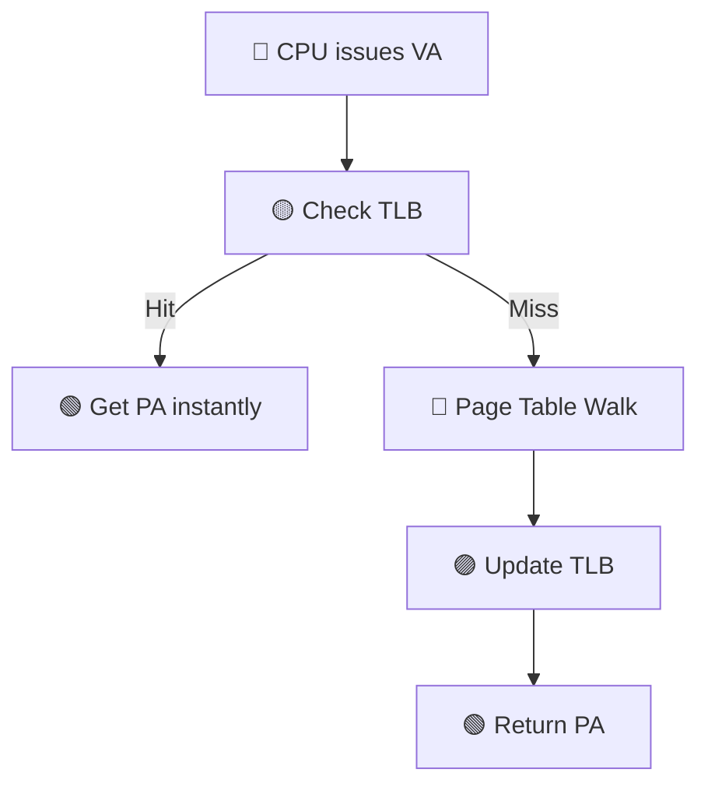
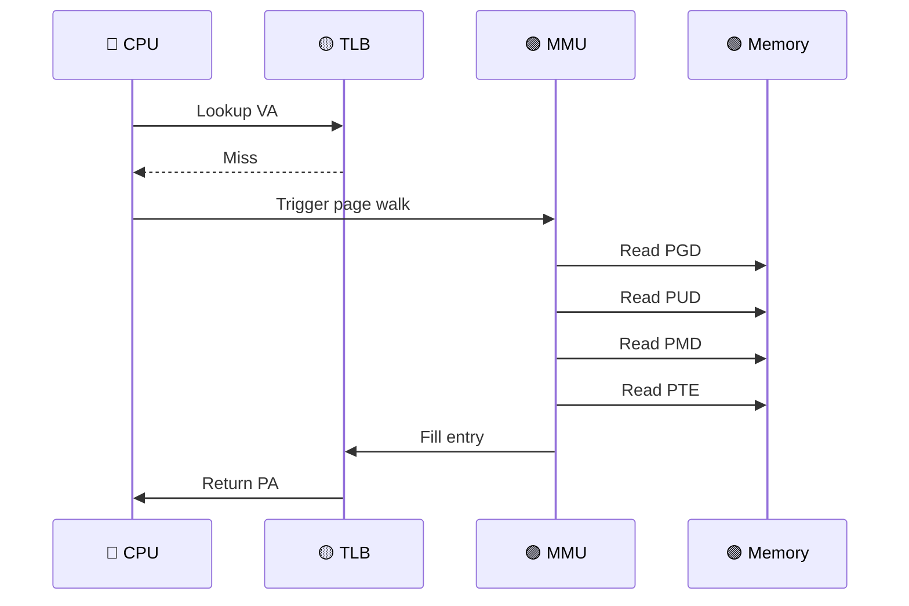
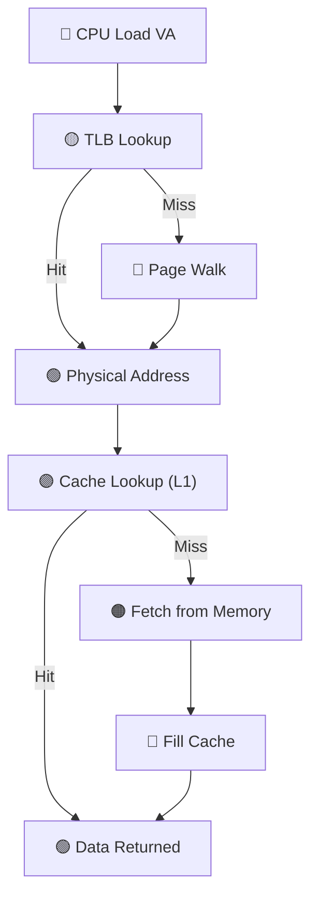
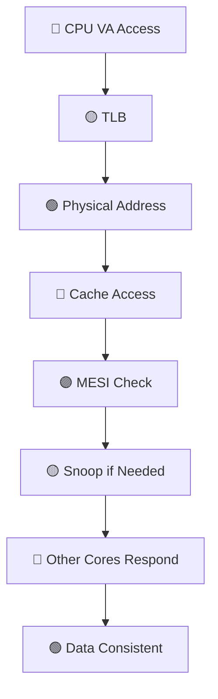
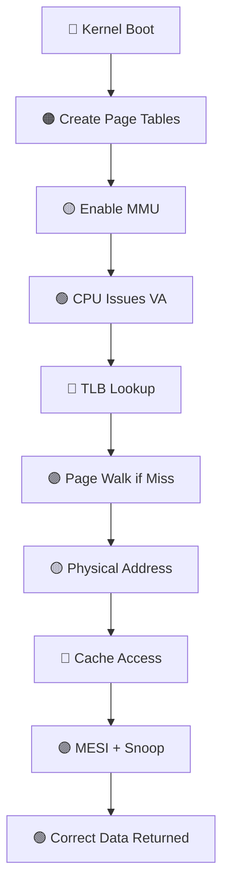

## 🧠 Q: How does Linux enable MMU in ARMv8?

### ✅ Short Answer

**Linux builds page tables, configures memory attributes and translation controls, then sets the `SCTLR_EL1` register to enable the MMU (bit `M=1`).**

---

# 📌 1. What “Enable MMU” Really Means

Enabling the MMU in **ARMv8** means:

* Virtual → Physical address translation starts
* Memory attributes (cacheable, shareable, device) take effect
* Cache + coherency behavior becomes *well-defined*

---

# 🧩 2. Step-by-Step (From Scratch)

### 🔹 Step 1: Kernel builds page tables

* Maps:

  * Kernel virtual address → physical memory
* Uses multi-level tables:

  * PGD → PUD → PMD → PTE

---

### 🔹 Step 2: Load translation base registers

```asm
msr ttbr0_el1, x0   // User space
msr ttbr1_el1, x1   // Kernel space
```

---

### 🔹 Step 3: Configure memory attributes

```asm
msr mair_el1, x2
```

Defines:

* Normal memory (cacheable)
* Device memory (non-cacheable)

---

### 🔹 Step 4: Configure translation control

```asm
msr tcr_el1, x3
```

Defines:

* Address size (48-bit VA etc.)
* Granule size (4KB)
* Shareability

---

### 🔹 Step 5: Enable MMU (Critical Step)

```asm
mrs x0, sctlr_el1
orr x0, x0, #(1 << 0)   // M = 1 (MMU enable)
msr sctlr_el1, x0
isb
```

---

# 🎨 3. Coloured Mermaid Flow (High-Level)



---

# 🔁 4. Coloured Sequence Diagram (Kernel ↔ CPU)



---

# 🔬 5. What Happens Internally (Deep View)

---

## 🔹 Before MMU Enable

* CPU uses:

  * **Physical addresses directly**
* No translation
* Cache behavior = limited / unsafe

---

## 🔹 After MMU Enable

When CPU executes:

```c
load x from virtual address VA
```

### Hardware flow:


---

# ⚙️ 6. Important Registers Summary

| Register  | Role                       |
| --------- | -------------------------- |
| TTBR0_EL1 | Base of user page tables   |
| TTBR1_EL1 | Base of kernel page tables |
| MAIR_EL1  | Memory attributes          |
| TCR_EL1   | Translation control        |
| SCTLR_EL1 | Enable MMU + Cache         |

---

# 🚨 7. Critical Rules (Interview Important)

---

## ❗ Rule 1: Page tables must exist first

Otherwise:

* MMU will fault immediately

---

## ❗ Rule 2: ISB is mandatory

```asm
isb
```

Ensures:

* CPU uses new MMU state immediately

---

## ❗ Rule 3: Memory must be identity-mapped during switch

Why?

* CPU is still executing instructions while MMU turns ON

---

# 🧠 8. Real Insight (What Interviewers Expect)

---

## ❓ What exactly triggers MMU?

👉 This instruction:

```asm
msr sctlr_el1, x0
```

* Bit `M=1` → MMU ON
* Immediately affects:

  * Address translation
  * Cache behavior
  * Memory attributes

---

# 🔥 9. End-to-End Flow (Full System)



---

# 🎯 10. Final Takeaways

✔ Linux enables MMU in **early boot (head.S / proc.S)**
✔ Core step = **set `SCTLR_EL1.M = 1`**
✔ Requires:

* Page tables
* Memory attributes
* Translation config

✔ After enable:

* All memory access goes through MMU
* Cache + coherency become fully functional

---

## 🚀 If you want deeper next step:

I can walk you through:

* Real Linux source (`head.S`) line-by-line
* Page table format (PGD/PUD/PMD/PTE)
* TLB + page walk + cache interaction

Just say 👍

Perfect — this is exactly the **deep system-level walkthrough** expected in high-end interviews. Let’s go step-by-step from **real Linux boot code → page tables → TLB → cache interaction**, all stitched together.

---

# 🧠 1. Real Linux ARMv8 Boot (`head.S`) — Line-by-Line

File: `arch/arm64/kernel/head.S`

---

## 🔹 Entry Point

```asm
stext:
    bl  preserve_boot_args
    bl  el2_setup
    bl  set_cpu_boot_mode_flag
    bl  __create_page_tables
    bl  __enable_mmu
```

---

## 🔍 What Each Line Does

### 🔸 `preserve_boot_args`

* Saves bootloader parameters (device tree, cmdline)

---

### 🔸 `el2_setup`

* Drops from EL2 → EL1 (if needed)
* Prepares CPU privilege level

---

### 🔸 `set_cpu_boot_mode_flag`

* Records boot mode (EL1/EL2)

---

### 🔸 `__create_page_tables` ⭐ IMPORTANT

👉 This is where **page tables are built**

---

### 🔸 `__enable_mmu` ⭐ CRITICAL

👉 This is where **MMU + cache actually turn ON**

---

# 🎨 2. Boot Flow (Coloured Mermaid)



---

# 🔄 3. Sequence: Kernel ↔ CPU ↔ MMU



---

# 🧩 4. Page Table Format (ARMv8)

ARMv8 uses **4-level page tables (48-bit VA)**

---

## 🔹 Levels

| Level | Name | Role            |
| ----- | ---- | --------------- |
| L0    | PGD  | Top-level       |
| L1    | PUD  | Upper directory |
| L2    | PMD  | Middle          |
| L3    | PTE  | Final mapping   |

---

## 🎨 Page Table Walk Diagram


---

## 🔬 Address Breakdown (48-bit VA)

```text
| PGD | PUD | PMD | PTE | Offset |
| 9b  | 9b  | 9b  | 9b  | 12b   |
```

---

# ⚙️ 5. What `__create_page_tables` Actually Does

Simplified logic:

```c
pgd = allocate();
pud = allocate();
pmd = allocate();
pte = allocate();

pgd[va_index] = pud;
pud[va_index] = pmd;
pmd[va_index] = pte;
pte[va_index] = physical_address | flags;
```

---

### Flags include:

* Cacheable
* Shareable
* Access permissions

---

# 🚀 6. TLB (Translation Lookaside Buffer)

---

## 🔹 What is TLB?

👉 A **cache of address translations**

---

## 🎨 TLB Flow



---

# 🔬 7. Page Walk (When TLB Miss Happens)

---



---

# 🧠 8. Cache + TLB + MMU Interaction

This is the **most important concept**

---

## 🔹 Full Memory Access Flow



---

# 🔥 9. Where Cache Coherency Fits Here

👉 After PA is resolved:

* Cache line is accessed
* MESI protocol applies
* Snoop may trigger

---

## 🔁 Combined Flow (Translation + Coherency)



---

# 🚨 10. Interview-Level Insights

---

## ❓ What is faster: TLB or Cache?

👉 TLB must hit **before cache**
Otherwise → no physical address

---

## ❓ Why TLB is critical?

* Page walk = **very expensive**
* TLB avoids 4 memory accesses

---

## ❓ What happens on context switch?

* TLB flush (or ASID used)
* Prevent stale mappings

---

## ❓ Where does coherency NOT apply?

* During page table walk:

  * Uses special attributes
  * Often treated as normal memory but carefully managed

---

# 🎯 11. End-to-End Mental Model

---



---

# 🧠 Final Takeaway

👉 Think in this exact order:

1. **Kernel builds mapping**
2. **MMU translates VA → PA**
3. **TLB caches translation**
4. **Cache stores data**
5. **MESI + snoop maintain correctness**

---

# 🚀 If you want next level (very high-end prep)

I can go deeper into:

* TLB shootdown (multi-core invalidation)
* Huge pages vs normal pages
* ARM hardware page walker internals
* Real bugs (stale TLB, cache aliasing)

Just tell me 👍
