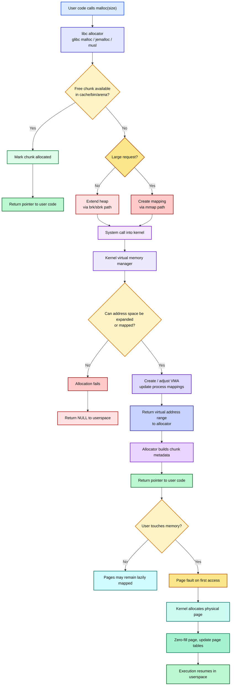
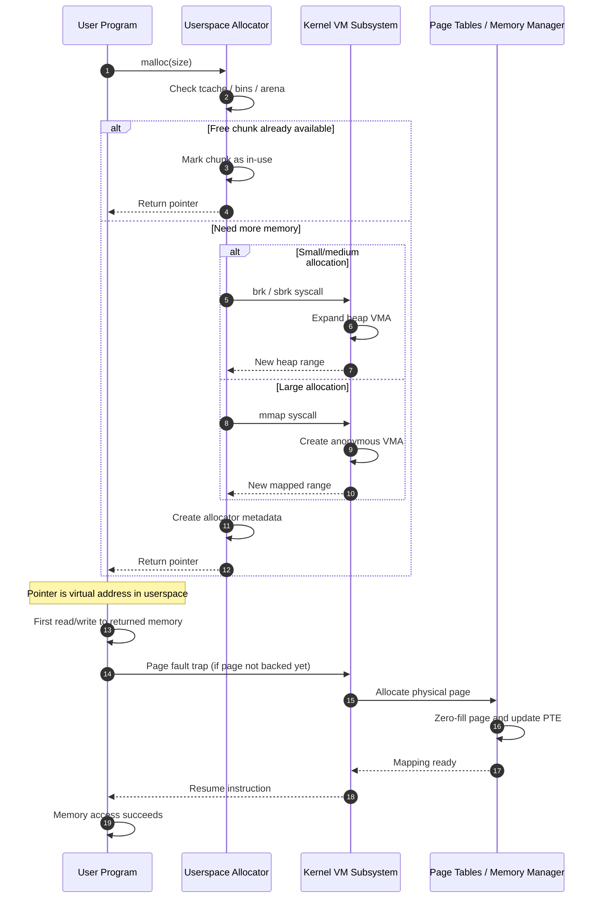

Here are two **colored Mermaid diagrams** showing the path of `malloc()` from **userspace → kernel space → back to userspace**.

### Flow diagram

---

### Sequence diagram

### What this captures

`malloc()` usually does **not** directly allocate physical RAM immediately. It often:

1. checks allocator-managed free memory first,
2. asks the kernel for more **virtual address space** with `brk` or `mmap` if needed,
3. returns a pointer to userspace,
4. and only when the program actually touches the page does the kernel often allocate the real physical page on demand.

If you want, I can also give you a **single polished architecture diagram** combining allocator internals, syscalls, page faults, and `free()` behavior.
