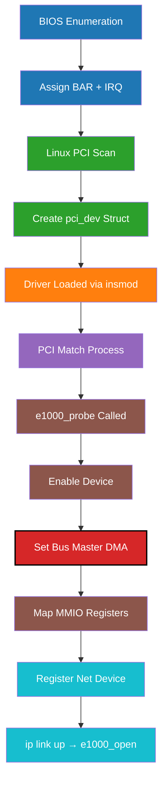
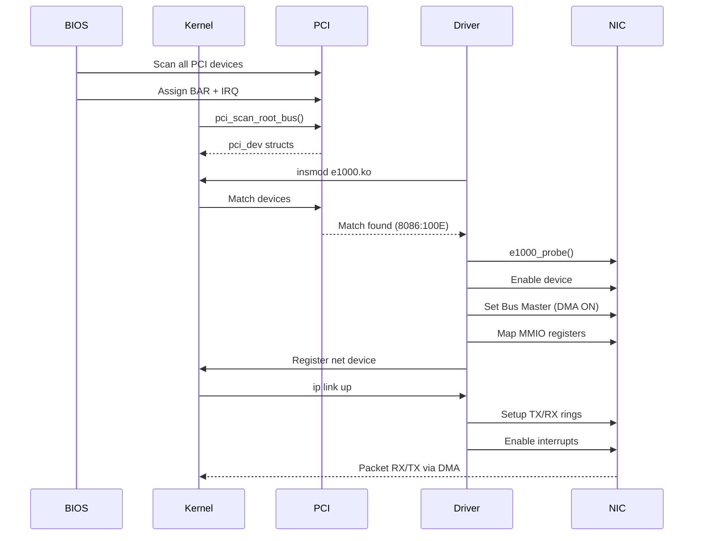

Here’s your content **cleanly reformatted into Markdown**, with **colored Mermaid diagrams** (flow + sequence) added for clarity.

---

# 🚀 How Linux Discovers Your Network Card

## e1000 Driver Registration Process

When you run:

```bash
insmod e1000.ko
```

a chain of events unfolds across **hardware, firmware, and kernel layers**.

---

# 🧱 LAYER 1: BIOS ENUMERATION (Power-On)

The BIOS scans every possible PCI address:

* `256 buses × 32 devices × 8 functions`

### Example Device:

**Intel 82540EM** → `Bus 0, Device 3, Function 0`

### Steps:

* Writes `0xFFFFFFFF` to BAR0
* Reads back: `0xFFFE0000`
* Calculates size:

  ```
  ~(0xFFFE0000) + 1 = 0x20000 (128 KB)
  ```
* Assigns:

  * Memory: `0xf0200000`
  * IRQ: `9`

👉 The NIC now responds at:

```
0xf0200000 – 0xf021FFFF
```

---

# 🧠 LAYER 2: KERNEL BOOT

Linux rescans PCI using:

```
pci_scan_root_bus()
```

### Kernel creates:

```c
struct pci_dev {
  .vendor = 0x8086,  // Intel
  .device = 0x100E,  // 82540EM
  .devfn  = 0x18,    // (3 << 3) | 0
  .irq    = 9,
  .resource[0] = {
    .start = 0xf0200000,
    .end   = 0xf021ffff,
    .flags = IORESOURCE_MEM,
  },
  .driver = NULL,    // ❗ No driver yet
}
```

---

# 🔌 LAYER 3: DRIVER REGISTRATION

The driver defines a match table:

```c
pci_device_id e1000_pci_tbl[] = {
  { PCI_VDEVICE(INTEL, 0x100E), board_82540 },
  ...
  { 0 }
};
```

### When module loads:

```
e1000_init_module()
 └─ pci_register_driver()
     └─ driver_register()
         └─ pci_bus_match()
```

---

# 🎯 LAYER 4: DEVICE MATCH

Kernel compares:

| Device           | Driver Table     |
| ---------------- | ---------------- |
| Vendor: `0x8086` | Vendor: `0x8086` |
| Device: `0x100E` | Device: `0x100E` |

✅ **MATCH FOUND**

👉 Triggers:

```
e1000_probe()
```

---

# ⚙️ LAYER 5: INSIDE `e1000_probe()`

### STEP 1: Enable Device

* BAR mask: `0x5` → `0b101`

  * BAR0 → MMIO
  * BAR2 → I/O fallback

---

### STEP 2: 🧨 Set Bus Master (CRITICAL)

* Enables **DMA**

| Without Bus Master | With Bus Master |
| ------------------ | --------------- |
| ❌ No DMA           | ✅ Full DMA      |
| ❌ No TX/RX         | ✅ Packet flow   |
| ❌ Dead NIC         | ✅ Active NIC    |

---

### STEP 3: Map Registers

```
Virtual:  0xffffc9000021FFFF
Physical: 0xf0200000 – 0xf021FFFF
```

---

### STEP 4–6:

* Allocate net device
* Reset hardware
* Read MAC address
* Register with networking stack

---

# 🔍 VERIFICATION

### PCI Config:

```bash
lspci -xxx -s 00:03.0
```

Output:

```
10: 00 00 20 f0 ...
```

👉 BAR0 = `0xf0200000` (little-endian)

---

### Driver Binding:

```bash
cat /sys/bus/pci/devices/0000:00:03.0/driver
```

Output:

```
../../drivers/e1000 ✅
```

---

# 🌐 INTERFACE ACTIVATION

```bash
ip link set enp0s3 up
```

Triggers:

```
e1000_open()
```

### Actions:

* Allocate TX/RX rings (DMA memory)
* Program NIC registers
* Register IRQ handler
* Enable interrupts
* Start packet flow 🚀

---

# 📊 FLOW DIAGRAM (Colored Mermaid)



---

# 🔄 SEQUENCE DIAGRAM (Colored)



---

# 📚 Summary

* BIOS → discovers & assigns resources
* Kernel → builds device model
* Driver → matches & binds
* Bus Master → enables DMA (critical)
* `e1000_open()` → starts packet flow

---

If you want, I can also add:

* 🔬 register-level diagrams (TX/RX rings)
* 🧠 memory layout visuals for DMA
* ⚡ deep dive into interrupt handling (MSI/MSI-X vs INTx)

Just tell me 👍
