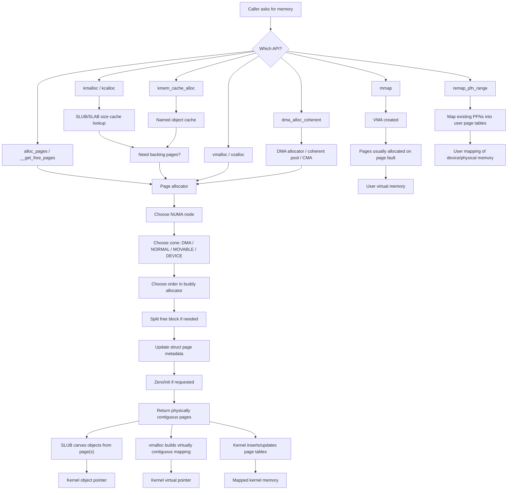
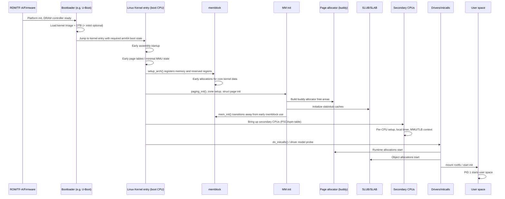
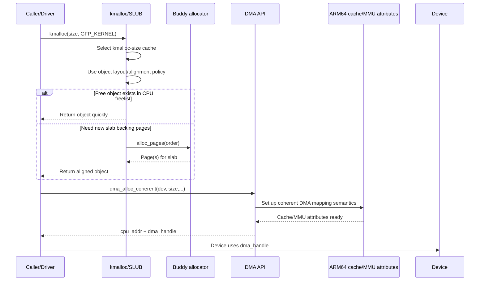
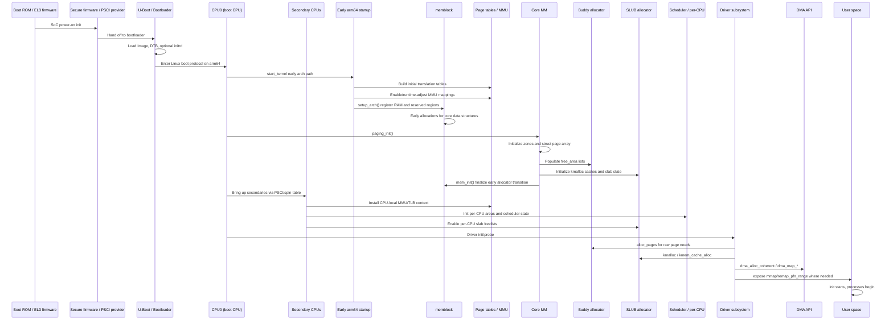

Below is a structured, deep explanation of the diagram and the related Linux kernel flow, with each requested question on top.

The image is essentially showing this idea: **user/kernel memory APIs at the top** eventually map into **real physical pages**, and underneath that the kernel relies on its **boot-time memory manager, buddy allocator, zones, per-page metadata, page lists, reclaim, and slab/SLUB caches**. On ARMv8 multi-core systems, the same story is true, but early boot, page-table setup, secondary CPU bring-up, cache/TLB behavior, and DMA coherency add extra steps. ([Linux Kernel Documentation][1])

---

# 01. Mermaid flow — how it works

## Question

**01_ Mermaid flow How it works**

## Answer

At a high level, the flow in your diagram is correct:

1. A caller asks for memory through some API such as `kmalloc()`, `kcalloc()`, `vmalloc()`, `alloc_pages()`, `dma_alloc_coherent()`, `get_free_page()`, `mmap()`, or `remap_pfn_range()`.

2. Linux chooses the right backend:

   * `kmalloc()` / `kcalloc()` usually go through **SLUB/SLAB caches** for small-to-medium kernel objects.
   * `alloc_pages()` goes to the **page allocator** directly.
   * `vmalloc()` allocates **physical pages** first, then creates a **virtually contiguous mapping** for them.
   * `dma_alloc_coherent()` uses the DMA allocator and may use device-specific coherent pools or CMA, depending on architecture and platform.
   * `mmap()` for userspace normally creates a VMA first and actual pages appear later on page fault, unless it is a special mapping.
   * `remap_pfn_range()` maps existing physical frames into userspace page tables without allocating normal anonymous pages. ([Linux Kernel Documentation][1])

3. The allocator then resolves the request into actual physical pages:

   * Select NUMA node and memory zone.
   * Find a suitable order in the buddy allocator.
   * Split larger blocks if needed.
   * Mark `struct page` metadata.
   * Zero if required (`kcalloc()`, `__GFP_ZERO`, anonymous pages, etc.).
   * Return either:

     * a direct kernel pointer,
     * a vmalloc virtual address,
     * or a userspace mapping via page tables. ([Linux Kernel Documentation][1])

4. If the request is small and object-oriented, the slab layer avoids page-level waste by sub-dividing pages into objects. If the request is page-granular or high-order, the buddy allocator is used more directly. ([Linux Kernel Documentation][1])

---

## Mermaid flowchart



---

## What each box in your image means

### `kmalloc(GFP_*)`

Best for small kernel allocations. Usually physically contiguous and backed by slab/SLUB caches; for larger sizes it may fall back to page allocations. It is generally recommended for smaller chunks, commonly around or below page-sized ranges depending on architecture and configuration. ([Linux Kernel Documentation][1])

### `kcalloc()`

Same idea as `kmalloc()`, but zero-initialized. Internally this is basically allocation plus zeroing semantics. ([Linux Kernel Documentation][1])

### `vmalloc()`

Gives a contiguous **virtual** range, but underlying physical pages may be scattered. Good when you need a large contiguous kernel address range but not contiguous RAM. ([Linux Kernel Documentation][1])

### `slab / slub caches`

These are object allocators for frequently used kernel objects or generic size-based `kmalloc-*` caches. They reduce fragmentation and improve reuse. ([Linux Kernel Documentation][2])

### `dma_alloc_coherent()`

Allocates memory suitable for DMA where CPU and device see a coherent view according to the DMA API. On some systems it comes from a special coherent pool or CMA area, and the mapping attributes matter a lot on ARM64. ([Linux Kernel Documentation][3])

### `alloc_pages(order)`

Directly requests `2^order` physically contiguous pages from the page allocator. This is the clean page-level interface. ([Linux Kernel Documentation][1])

### `get_free_page()`

Legacy single-page helper built on the page allocator path. Conceptually equivalent to order-0 page allocation helpers. ([Linux Kernel Documentation][1])

### `mmap()`

Userspace requests address space; kernel creates VMAs and often delays real allocation until page faults occur. ([Linux Kernel Documentation][1])

### `remap_pfn_range()`

Maps existing physical frames, often device memory or reserved memory, into a userspace VMA. This is not normal anonymous page allocation. ([Linux Kernel Documentation][3])

### `Buddy Allocator`

Core physical allocator managing free memory in blocks of powers of two. ([Kernel][4])

### `Memory Zones`

Zones partition memory based on hardware/allocator constraints such as DMA reachability or migratability. Linux documentation explicitly discusses zones and the allocation behavior around them. ([Linux Kernel Documentation][1])

### `NUMA Awareness`

Allocator tries local node first, then fallback policy if needed. ([Linux Kernel Documentation][1])

### `struct page[]`

Per-page metadata: refcounting, flags, mapping state, and allocator bookkeeping live here. ([Kernel][4])

### `Page Lists`, `Compaction/Reclaim`

These support fragmentation control and pressure recovery so higher-order allocations and long-term health of the system remain possible. ([Linux Kernel Documentation][1])

---

# 02. Sequence diagram — what actually happens during boot, and who initializes what

## Question

**02 Give sequence diagram how actually happens in boot or linux side while booting who will initialize**

## Answer

On ARM64, Linux boot begins with **firmware / bootloader** preparing RAM, loading the kernel image, passing a device tree, and entering the kernel with the required CPU state. The Linux kernel documentation for arm64 defines the boot contract: the bootloader sets up RAM visibility, provides the device tree, and transfers control to the kernel image entry point. ([Kernel][5])

After that, Linux initializes memory in phases:

1. **Bootloader / firmware phase**

   * RAM is discovered and initialized enough for kernel entry.
   * Device tree is provided.
   * Kernel image is placed and entered in the required state. ([Kernel][5])

2. **Early kernel phase**

   * Early assembly startup sets exception level assumptions, stack, and minimal CPU state.
   * Very early page tables are established so the kernel can run in the expected virtual layout.
   * `setup_arch()` handles architecture-specific setup.
   * **memblock** is used as the early allocator because the normal page allocator is not ready yet. Linux documentation explicitly says memblock is the boot-time allocator and that it is set up during architecture initialization and torn down later in `mem_init()`. ([Linux Kernel Documentation][6])

3. **Memory manager bring-up**

   * Physical memory regions are registered in memblock.
   * Reserved regions are carved out.
   * `struct page` array and zone structures are prepared.
   * The buddy allocator is initialized.
   * SLUB/SLAB is initialized after enough page allocator infrastructure exists. ([Linux Kernel Documentation][6])

4. **SMP bring-up**

   * Boot CPU continues initialization.
   * Secondary CPUs are released via PSCI or spin-table, depending on platform.
   * Each secondary CPU initializes per-CPU state, MMU context, and joins the scheduler. The arm64 ecosystem documents the spin-table model, and Linux arm64 boot documentation covers the bootloader/kernel handoff contract. ([Linux Kernel Documentation][7])

5. **Late init**

   * Initcalls run.
   * Drivers probe.
   * Userspace starts from PID 1. ([Linux Kernel Documentation][1])

---

## Boot sequence diagram



---

## Who initializes what

### Bootloader initializes

* Enough DRAM/platform state to let Linux run.
* Kernel image placement.
* Device tree handoff.
* Entry into kernel with arm64 boot requirements satisfied. ([Kernel][5])

### Linux early arch code initializes

* Initial page tables.
* Early exception vectors and minimal CPU execution environment.
* memblock registration of RAM and reserved areas through `setup_arch()`. ([Linux Kernel Documentation][6])

### Core MM initializes

* Zones.
* `struct page` metadata.
* Buddy allocator.
* SLUB/SLAB allocator.
* Vmmap/vmalloc infrastructure after core paging is usable. ([Linux Kernel Documentation][6])

### SMP code initializes

* Secondary CPU release.
* Per-CPU areas.
* Scheduler-ready CPU state. ([Linux Kernel Documentation][7])

---

# 03. Kernel code walk-through — where cache line is implemented and when called

## Question

**03 Flow of Kernel code walk through where exactly cache line implemented and when called.**

## Answer

This needs one careful clarification: **“cache line”** can mean two different things in kernel memory discussions.

1. **Allocator-side cache-line alignment and slab layout**
2. **CPU data-cache maintenance / coherency for DMA and ARM64 page attributes**

Your image touches both, but in different ways.

---

## 03.A Allocator-side cache-line alignment

In slab/SLUB, objects may be aligned for CPU cache efficiency and false-sharing reduction. The slab allocator organizes memory into object caches; each cache manages slabs that contain multiple equal-sized objects. Generic `kmalloc-*` caches are the size-based caches behind `kmalloc()`. ([Linux Kernel Documentation][2])

### Where it is conceptually implemented

* In **SLUB/SLAB cache creation and object layout logic**.
* In `kmalloc` cache definitions, object size classes, alignment rules, red-zoning/debug options, and per-CPU freelist handling.
* In named caches created with `kmem_cache_create()`, where alignment flags and object geometry are fixed when the cache is created. ([Linux Kernel Documentation][2])

### When it is called

* At allocator initialization time, when kmalloc caches are created.
* When a subsystem creates a dedicated cache like for `task_struct`, `inode`, `dentry`, etc.
* At allocation time, SLUB pulls an object from a slab whose object layout already obeys alignment/cache rules. ([Linux Kernel Documentation][2])

### Practical meaning

This is not “the CPU cache line controller code.” It is mainly:

* object alignment,
* per-CPU allocation fastpaths,
* reduced bouncing across cores,
* reduced false sharing.

---

## 03.B DMA/cache coherency side

On ARM64, CPU caches and device DMA visibility are critical. The DMA API distinguishes coherent allocations from streaming mappings. The documentation explains that `dma_alloc_coherent()` is for memory that remains coherent for both CPU and device, while streaming mappings use `dma_map_*` / `dma_unmap_*` and may require synchronization semantics. ([Linux Kernel Documentation][3])

### Where this is conceptually implemented

* In the **DMA API layer**.
* In architecture-specific DMA mapping code.
* In page-table memory attributes and cache maintenance helpers.
* On ARM64, coherent vs non-coherent device behavior is tied to platform/device capabilities and memory attributes. ([Linux Kernel Documentation][3])

### When it is called

* Driver calls `dma_alloc_coherent()` for descriptor rings, control blocks, shared buffers.
* Driver calls `dma_map_single()` / `dma_map_page()` for streaming DMA on regular memory.
* Sync operations occur on map/unmap or explicit sync calls for non-coherent paths.
* On page-table setup, mapping attributes determine whether the CPU sees the region as normal cacheable memory, device memory, or coherent DMA memory. ([Linux Kernel Documentation][3])

### Important distinction

* **SLUB cache** is an allocator data structure.
* **CPU cache line coherency** is a hardware/cache-maintenance concern.
* Your image’s phrase “cache-coherent” under `dma_alloc_coherent()` refers to the second meaning, not slab cache reuse. ([Linux Kernel Documentation][3])

---

## Call-path style walkthrough

### Case A: `kmalloc(128, GFP_KERNEL)`

```text
caller
  -> kmalloc()
     -> choose kmalloc size cache (e.g. kmalloc-128)
     -> slub fastpath:
          use per-cpu freelist if object available
        else slowpath:
          get partial slab or allocate new slab pages from buddy
     -> return aligned object pointer
```

What matters here:

* cache-line alignment may already be baked into the cache geometry,
* hot per-CPU freelist avoids lock traffic,
* backing pages ultimately come from the buddy allocator. ([Linux Kernel Documentation][1])

### Case B: `dma_alloc_coherent(dev, size, &dma_handle, gfp)`

```text
driver
  -> dma_alloc_coherent()
     -> generic DMA API / arch DMA backend
     -> choose coherent pool or suitable backing allocator/CMA
     -> create CPU mapping with coherent semantics
     -> return cpu_addr + dma_handle
```

What matters here:

* page attributes and DMA model are crucial,
* on ARM64 this is where coherency/cache behavior matters much more than in plain slab allocation. ([Linux Kernel Documentation][3])

---

## Mermaid sequence for “cache line” interpretation



---

# 04. Walk through all major functions in kernel code — importance and detail

## Question

**04 And walk though all functions in kernel code what are importance and info details.**

## Answer

I will cover the functions from your image plus the core lower-layer functions they rely on.

---

## 04.1 `kmalloc()`

### Purpose

General-purpose kernel allocation for physically contiguous memory in the kernel address space. Usually used for small or moderate allocations. ([Linux Kernel Documentation][1])

### Importance

* Fast.
* Common.
* Often served from SLUB size caches.
* Good default for kernel heap objects.

### Internally

* Selects the nearest size class.
* Uses kmalloc caches.
* Fast path can be per-CPU.
* If a new slab is needed, gets pages from buddy allocator. ([Linux Kernel Documentation][2])

### Use when

* Need kernel object/buffer.
* Need physical contiguity.
* Size is not huge.

### Avoid when

* Need very large virtually contiguous ranges: use `vmalloc()`/`kvmalloc()` pattern instead. ([Linux Kernel Documentation][1])

---

## 04.2 `kcalloc()`

### Purpose

Array allocation with zero initialization.

### Importance

Prevents uninitialized memory use and integer-overflow mistakes when used properly with count-and-size semantics.

### Internally

* Similar backend to `kmalloc()`
* Plus zeroing. ([Linux Kernel Documentation][1])

---

## 04.3 `kmem_cache_create()` / `kmem_cache_alloc()`

### Purpose

Create and allocate from a dedicated cache for one object type.

### Importance

* Better locality.
* Constructors possible.
* Good for heavily used kernel object types.

### Internally

* Cache geometry is fixed at creation.
* SLUB manages slabs for that object type.
* Pages come from buddy allocator when needed. ([Linux Kernel Documentation][2])

### Use when

* One object type is allocated frequently.
* Need tighter control than raw `kmalloc()`.

---

## 04.4 `alloc_pages(gfp, order)`

### Purpose

Request `2^order` contiguous base pages directly.

### Importance

This is the central page allocator interface beneath many higher-level allocators. ([Linux Kernel Documentation][1])

### Internally

* Select NUMA node.
* Select zone.
* Check free area list for target order.
* Split higher-order block if needed.
* Update page metadata.

### Use when

* Need raw pages.
* Need page-level control.
* Implementing other allocators.

---

## 04.5 `__get_free_page()` / `get_zeroed_page()`

### Purpose

Convenience wrappers for order-0 page allocation.

### Importance

Historical and still conceptually useful for single-page requests.

### Internally

* Thin wrapper over page allocator concepts.

---

## 04.6 `vmalloc()` / `vzalloc()`

### Purpose

Allocate virtually contiguous kernel memory.

### Importance

Very useful for large allocations where physical contiguity is not required. Linux docs explicitly recommend vmalloc-style allocations for large virtually contiguous regions. ([Linux Kernel Documentation][1])

### Internally

* Allocates underlying pages.
* Creates page-table mappings in the vmalloc region.
* TLB and page-table work are involved, so slower than `kmalloc()`.

### Use when

* Large buffer.
* Physical contiguity not needed.

### Avoid when

* DMA needs physical contiguity/coherent semantics.

---

## 04.7 `dma_alloc_coherent()`

### Purpose

Allocate DMA-safe coherent memory shared between CPU and device.

### Importance

Essential for descriptor rings and control structures. DMA docs explain this is the stable coherent allocation API for drivers. ([Linux Kernel Documentation][3])

### Internally

* Goes through DMA API backend.
* May use coherent pools, reserved regions, or CMA.
* Returns CPU-accessible pointer and device DMA address. ([GitHub][8])

### Use when

* Device and CPU must both access same buffer with coherent semantics.

### Avoid when

* General kernel heap only.

---

## 04.8 `mmap()`

### Purpose

Userspace requests a virtual memory region.

### Importance

Foundation of userspace address-space creation.

### Internally

* Kernel creates or modifies a VMA.
* Actual pages may be attached later on page fault.
* File-backed vs anonymous vs device-backed paths differ.

---

## 04.9 `remap_pfn_range()`

### Purpose

Map physical page frames directly into userspace.

### Importance

Common for drivers mapping device buffers or reserved memory.

### Internally

* Inserts PTEs for existing PFNs into a user VMA.
* Does not allocate normal anonymous pages for the mapping. ([Linux Kernel Documentation][3])

---

## 04.10 `setup_arch()`

### Purpose

Architecture-specific early setup.

### Importance

Linux documentation says memblock is set up in arch initialization such as `setup_arch()` and later torn down in `mem_init()`. ([Kernel][9])

### Internally

* Parse device tree / memory map.
* Register memory with memblock.
* Reserve kernel image and critical areas.

---

## 04.11 `paging_init()`

### Purpose

Establish full kernel paging structures and memory-management readiness.

### Importance

On arm64 this is central to constructing the runtime view of memory and mapping the kernel linear map. Source/docs show `paging_init()` in arm64 MMU code. ([GitHub][10])

### Internally

* Build mappings for kernel memory.
* Prepare virtual memory subsystem state.

---

## 04.12 `mem_init()`

### Purpose

Transition from boot-time allocator to runtime memory management.

### Importance

This is where the system stops relying on early boot allocation as primary infrastructure and fully enables the normal page allocator path. Linux boot-time MM docs explicitly mention the memblock lifecycle through `mem_init()`. ([Kernel][9])

---

## 04.13 Buddy allocator internals

### Core idea

Free memory is grouped by order:

* order 0 = 1 page
* order 1 = 2 pages
* order 2 = 4 pages
* and so on. ([Kernel][4])

### Why important

* Fast split/merge.
* Tracks physically contiguous ranges.
* Backbone for SLUB, vmalloc backing pages, and many subsystems.

### Weakness

* High-order allocations can fail under fragmentation.

---

## 04.14 SLUB/SLAB internals

### Core idea

Take one or more pages from buddy allocator, slice them into equal-size objects, and reuse them efficiently. ([Linux Kernel Documentation][2])

### Why important

* Avoids wasting whole pages on tiny objects.
* Improves locality and performance.
* Per-CPU fast paths are crucial on multicore.

---

## 04.15 Reclaim / compaction

### Purpose

Recover memory and reduce fragmentation.

### Importance

Needed when:

* free memory is low,
* higher-order allocations fail,
* system is fragmented.

### Internally

* reclaim frees pages,
* compaction migrates movable pages to create larger contiguous extents. ([Linux Kernel Documentation][1])

---

# 05. Complete sequence diagram with respect to ARMv8 multi-core and Linux kernel

## Question

**05 And give complete sequence diagram and all with respect to ARMV8 multiple cored and Linux Kernel**

## Answer

On ARMv8/AArch64 multicore systems, the memory story has extra architecture-specific layers:

1. Boot CPU enters kernel first.
2. Early MMU/page tables are created.
3. memblock handles early allocations.
4. Full MM init creates zones, `struct page`, buddy allocator, and slab allocator.
5. Secondary CPUs are brought up with PSCI or spin-table.
6. Per-CPU slab fastpaths become active.
7. Drivers start doing DMA, page allocations, vmalloc, and userspace mappings.
8. TLB/cache coherency and memory barriers matter much more because multiple cores are now running concurrently. ([Linux Kernel Documentation][7])

---

## ARMv8 multi-core boot-to-runtime sequence



---

## ARMv8 multicore memory behavior by phase

### Phase 1: before normal allocator exists

Only early mechanisms are safe. memblock is the allocator of record. A normal `kmalloc()`-heavy runtime world does not exist yet. ([Linux Kernel Documentation][6])

### Phase 2: after buddy comes up

Page-granular allocations are now available. High-order success depends on fragmentation and reserved memory layout. ([Kernel][4])

### Phase 3: after SLUB comes up

Small kernel allocations become cheap and scalable. On multicore systems, per-CPU freelists reduce contention. ([Linux Kernel Documentation][2])

### Phase 4: after secondary CPUs start

Now you have:

* concurrent allocations on many CPUs,
* lock contention considerations,
* cross-CPU cacheline bouncing concerns,
* TLB shootdowns and page-table synchronization effects.

This is why per-CPU slab structures and careful memory-barrier discipline are so important on ARMv8 SMP systems. The architecture boot docs and MM code context support this layered bring-up model. ([Linux Kernel Documentation][7])

---

## ARMv8-specific notes that matter in your diagram

### 1. Boot protocol matters

The bootloader must satisfy arm64 entry requirements before Linux takes over. ([Kernel][5])

### 2. Early allocator is memblock, not buddy

This is one of the most important points for interviews and design discussions. Buddy is a runtime allocator; memblock exists because buddy is not ready yet. ([Linux Kernel Documentation][6])

### 3. DMA coherency is architecture-sensitive

On ARM64 platforms, whether a device is coherent and how mappings are created is critical. `dma_alloc_coherent()` exists so drivers do not hand-roll cache maintenance rules. ([Linux Kernel Documentation][3])

### 4. `vmalloc()` costs more than `kmalloc()`

Because page-table setup and TLB behavior are involved, it is slower and should not replace `kmalloc()` blindly. ([Linux Kernel Documentation][1])

### 5. High-order allocations are fragile on long-running systems

Buddy can provide contiguous pages, but fragmentation makes large contiguous blocks harder over time; reclaim/compaction help but do not guarantee success. ([Linux Kernel Documentation][1])

---

# Final structured summary

## One-line view of the whole diagram

**Top-level APIs** choose a **memory allocation strategy**, which is then translated by Linux into **physical page management** through **memblock early in boot**, and later through **zones + buddy allocator + slab/SLUB + page tables + DMA mapping rules**. ([Linux Kernel Documentation][1])

## Best interview-ready explanation

* `kmalloc()` = fast kernel heap, usually physically contiguous, backed by SLUB caches.
* `vmalloc()` = virtually contiguous, physically scattered.
* `alloc_pages()` = raw buddy allocator interface.
* `dma_alloc_coherent()` = DMA-safe coherent shared buffer.
* `mmap()` = userspace virtual memory setup, often lazy page population.
* `remap_pfn_range()` = direct PFN-to-userspace mapping.
* During boot, **memblock** initializes memory management before buddy/SLUB exist.
* On ARMv8 SMP, CPU bring-up, page-table setup, per-CPU caches, TLB/cache coherency, and DMA attributes are the extra architecture-critical pieces. ([Linux Kernel Documentation][1])

If you want, I can turn this into a **clean interview-note PDF or DOCX** with colored Mermaid diagrams and kernel call-path blocks.

[1]: https://docs.kernel.org/core-api/memory-allocation.html?utm_source=chatgpt.com "Memory Allocation Guide"
[2]: https://docs.kernel.org/admin-guide/mm/slab.html?utm_source=chatgpt.com "Short users guide for the slab allocator"
[3]: https://docs.kernel.org/core-api/dma-api.html?utm_source=chatgpt.com "Dynamic DMA mapping using the generic device"
[4]: https://www.kernel.org/doc/gorman/html/understand/understand009.html?utm_source=chatgpt.com "Chapter 6 Physical Page Allocation"
[5]: https://www.kernel.org/doc/Documentation/arm64/booting.txt?utm_source=chatgpt.com "booting.txt"
[6]: https://docs.kernel.org/core-api/boot-time-mm.html?utm_source=chatgpt.com "Boot time memory management"
[7]: https://docs.kernel.org/arch/arm64/booting.html?utm_source=chatgpt.com "Booting AArch64 Linux"
[8]: https://github.com/torvalds/linux/blob/master/kernel/dma/coherent.c?utm_source=chatgpt.com "linux/kernel/dma/coherent.c at master"
[9]: https://www.kernel.org/doc/html/v5.0/core-api/boot-time-mm.html?utm_source=chatgpt.com "Boot time memory management"
[10]: https://github.com/torvalds/linux/blob/master/arch/arm64/mm/mmu.c?utm_source=chatgpt.com "linux/arch/arm64/mm/mmu.c at master"
