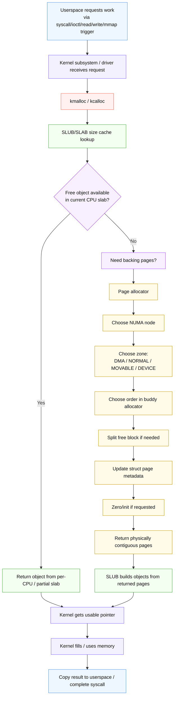
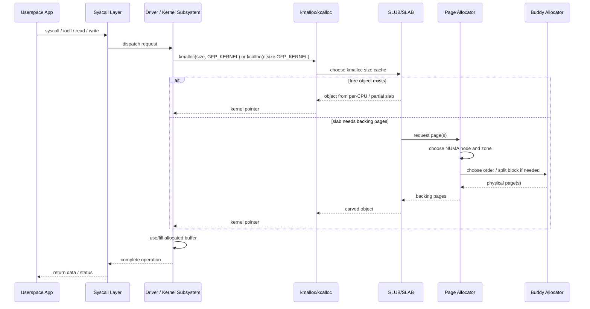
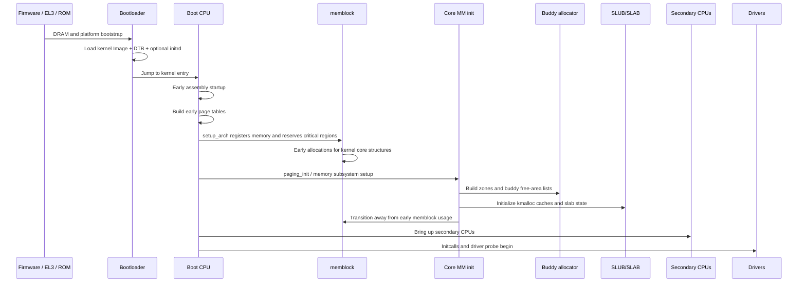
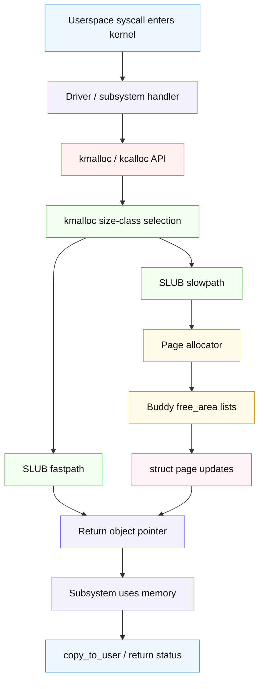
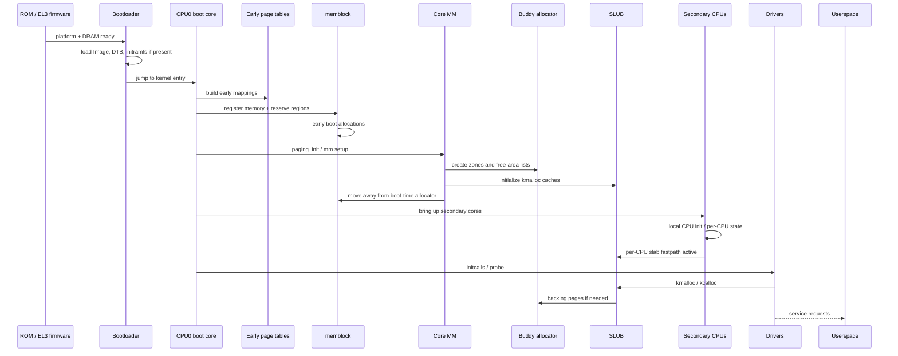
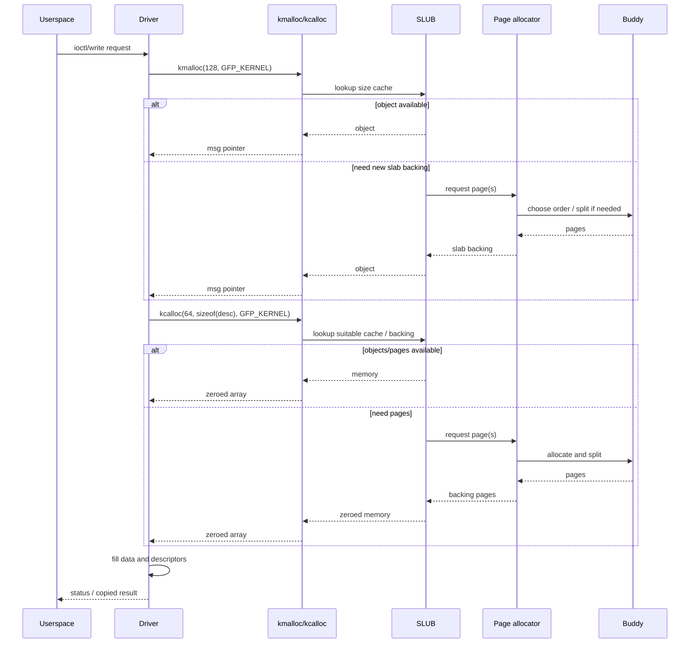
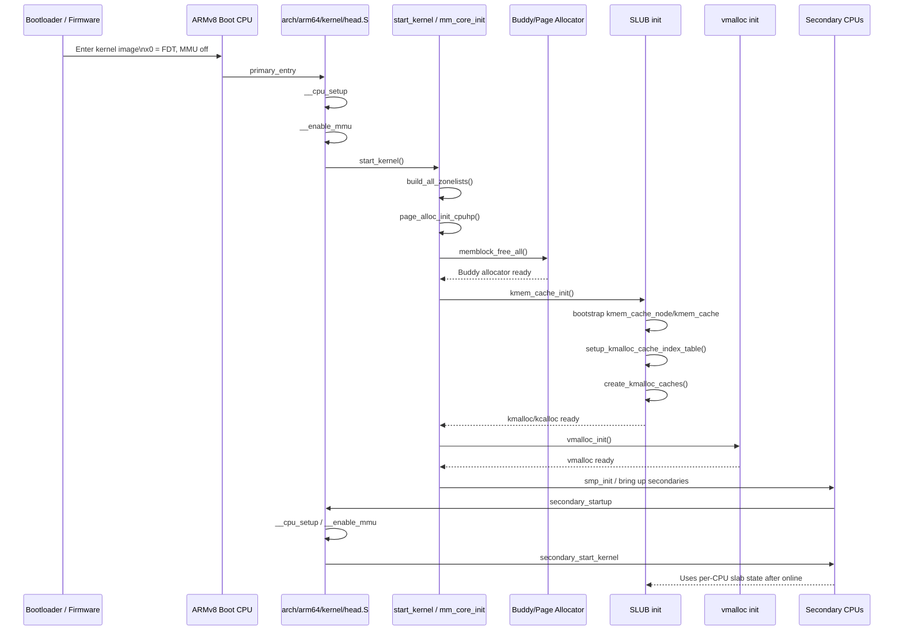
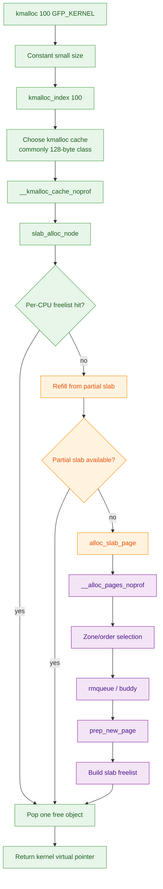
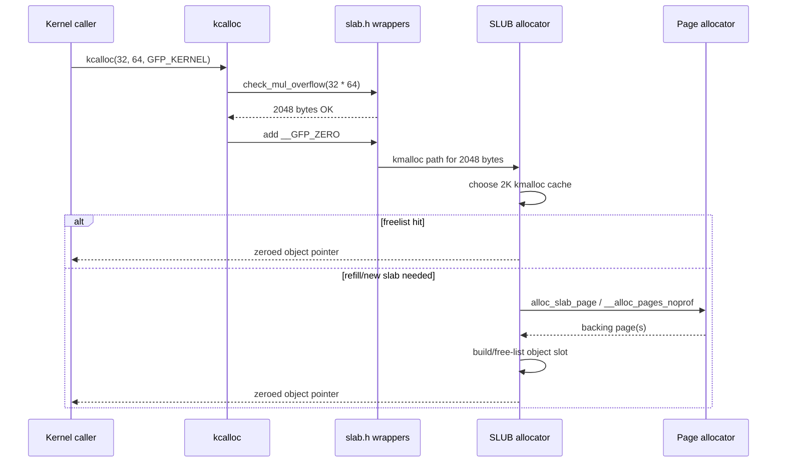
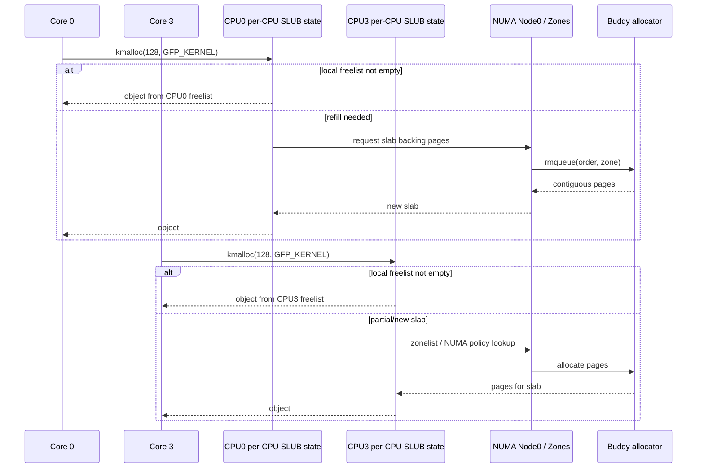

Below is a **deep, index-wise interview note** in the format you asked for, with the **question on top** for each section.

---

# Rough call flow first

## `kmalloc()` / `kcalloc()` rough call flow



### Very important clarification

`kmalloc()` and `kcalloc()` are **kernel-space allocators**. Userspace does **not** call them directly. Userspace reaches them only **indirectly** through a syscall, driver entry point, or kernel subsystem path. Linux’s memory allocation guide documents `kmalloc`, `kmem_cache_alloc`, `vmalloc`, and `alloc_pages` as kernel allocation APIs. ([Kernel Documentation][1])

---

# 01. Mermaid flow — how it works for `kmalloc()` / `kcalloc()` from userspace to kernel and back to userspace

## Question

**01_ Mermaid flow How it How it works for kmalloc/kcalloc from usersapce to kernel and back to userspace.**

## Answer

The full story is:

1. Userspace makes a syscall such as `open`, `read`, `write`, `ioctl`, `sendmsg`, `recvmsg`, or a driver-specific request.
2. Control enters the kernel through the syscall entry path.
3. A kernel subsystem or driver decides it needs memory.
4. It calls `kmalloc(size, flags)` or `kcalloc(n, size, flags)`.
5. The slab allocator path is checked first, because `kmalloc()` is usually backed by size-based slab caches.
6. If a suitable free object already exists in a per-CPU or partial slab, the allocation is very fast.
7. If not, slab needs new backing pages.
8. Those pages come from the page allocator, which chooses node, zone, and order, then splits larger buddy blocks if necessary.
9. `struct page` metadata is updated.
10. If zeroing is required, it happens before return.
11. The kernel gets the pointer, uses it, and later copies data back to userspace or completes the request.
12. Eventually `kfree()` returns the object to the slab cache; backing pages may later be returned to the buddy allocator. Linux documents that small kernel allocations go through `kmalloc`/`kmem_cache_alloc` families, while page-granular backing comes from the page allocator. ([Kernel Documentation][1])

## Deep flow explanation

### Stage A — userspace entry

Userspace never “calls `kmalloc()` directly.” It asks the kernel to do some work. Examples:

* `ioctl(fd, CMD_ALLOC, ...)`
* `write(fd, buf, len)`
* `read(fd, buf, len)`

The driver or kernel subsystem then decides to allocate memory.

### Stage B — `kmalloc()` vs `kcalloc()`

* `kmalloc(size, flags)` allocates a kernel buffer.
* `kcalloc(n, size, flags)` allocates an array and zeroes it. Linux memory-allocation docs describe `kmalloc` for small chunks and note zeroed variants are available. ([Kernel Documentation][1])

### Stage C — slab path

For small and medium allocations, `kmalloc()` typically maps the request to a size cache such as `kmalloc-64`, `kmalloc-128`, `kmalloc-256`, and so on. The slab allocator documentation explains that slab/SLUB maintains caches and supports per-slab/per-object behavior. ([Kernel Documentation][2])

### Stage D — if slab is empty

If the cache has no immediately available object, new slab backing pages are needed. Those pages come from the page allocator.

### Stage E — page allocator path

The page allocator chooses:

* NUMA node
* zone
* order in the buddy allocator

Then it may split a larger free block into smaller ones before handing pages upward. Linux memory-allocation docs and buddy/slab references describe this layered behavior. ([Kernel Documentation][1])

### Stage F — return path

After the kernel uses the allocated memory, it may:

* copy data to userspace with `copy_to_user()`
* copy request data from userspace with `copy_from_user()`
* or complete the syscall without direct copying if the request is stateful

### Stage G — free path

* `kfree(ptr)` returns an object to slab
* slab may later release empty pages back to the page allocator

---

## Mermaid sequence diagram



---

## Practical example 1 — `kmalloc()`

Suppose a character driver receives an `ioctl` asking it to store a 100-byte configuration blob.

### Path

* userspace issues `ioctl(fd, CMD_SET_CFG, user_buf)`
* driver executes:

  ```c
  cfg = kmalloc(100, GFP_KERNEL);
  copy_from_user(cfg, user_buf, 100);
  ```
* internally:

  * request maps to a `kmalloc-128` style cache class
  * if free object exists, allocation is immediate
  * if not, slab requests pages from page allocator
* driver uses buffer
* later:

  ```c
  kfree(cfg);
  ```

### Why `kmalloc()` here

Because the buffer is small, kernel-resident, and needs fast allocation. Linux recommends `kmalloc`/`kmem_cache_alloc` families for small chunks. ([Kernel Documentation][1])

---

## Practical example 2 — `kcalloc()`

Suppose a driver needs an array of 64 entries of a descriptor structure and wants them zero-initialized.

```c
desc = kcalloc(64, sizeof(*desc), GFP_KERNEL);
```

### Why `kcalloc()`

* safer for arrays
* zero-initialized
* avoids manual `memset()`
* clearer intent

### Internal behavior

Same broad slab/page-allocator story as `kmalloc()`, but the returned memory is zeroed before use. Linux provides zeroing variants for kernel allocation APIs. ([Kernel Documentation][1])

---

# 02. Sequence diagram — what happens during boot, and who initializes what

## Question

**02 Give sequence diagram how actually happnes in boot or linux side while booting who will initialize.**

## Answer

The most important boot-time truth is this:

**Early boot does not use the normal page allocator first.**
Linux uses **memblock** during early boot, because the normal kernel memory allocators are not ready yet. The Linux boot-time MM docs explicitly state that memblock manages memory during early boot while the usual allocators are not up and running. ([Kernel Documentation][3])

On ARM64, the bootloader must load the Image, pass a DTB, and enter the kernel in the required state. The ARM64 booting documentation describes this contract. ([Kernel Documentation][4])

## Boot sequence diagram



## Who initializes what

### Firmware / ROM / EL3

* powers on SoC
* basic platform state
* usually cooperates with trusted firmware on ARMv8 systems

### Bootloader

* loads kernel image
* passes device tree
* may pass initramfs
* jumps to kernel entry in the state required by ARM64 boot protocol. ([Kernel Documentation][4])

### Early kernel on boot CPU

* performs early assembly startup
* sets up preliminary page tables
* begins architecture setup

### `setup_arch()`

This is where architecture-specific initialization registers RAM and reserves special regions. Boot-time MM docs explain that architecture-specific init sets up early memory management, including memblock usage. ([Kernel Documentation][3])

### `memblock`

* tracks physical memory regions
* tracks reserved regions
* provides early allocations before buddy/slab exist. ([Kernel Documentation][3])

### `paging_init()` and core MM init

* establish kernel runtime mappings
* create zones
* initialize per-page metadata
* initialize the buddy allocator

### SLUB/SLAB init

After page allocator basics are ready, slab caches needed by `kmalloc()` become active. Linux slab docs describe slab as the object allocator used for caches and debugging options. ([Kernel Documentation][2])

### Secondary CPU bring-up

On ARM64 SMP systems, the boot CPU brings up secondary CPUs after core setup reaches a stable point. The ARM64 boot docs cover the platform boot protocol and SMP assumptions at entry. ([Kernel Documentation][4])

---

# 03. Flow of kernel code walk-through — where it is implemented and when it is called

## Question

**03 Flow of Kernel code walk through where exactly happening implemented and when called.**

## Answer

You asked specifically for the `kmalloc()`/`kcalloc()` path, so here is the conceptual kernel walk-through.

## High-level call stack



## Where each stage conceptually lives

### 1. Syscall / subsystem entry

This is not part of the allocator itself. It is the driver, VFS, net stack, block layer, or another kernel subsystem deciding that memory is needed.

### 2. `kmalloc()` / `kcalloc()`

These are the public kernel allocation APIs for small allocations. Linux documentation explicitly positions them among the core kernel allocators. ([Kernel Documentation][1])

### 3. Size-cache lookup

`kmalloc()` typically maps the requested size to a slab cache class. This is why `kmalloc(100)` does not create an exact 100-byte object class every time; it usually goes to a predefined cache size.

### 4. SLUB fastpath

If a free object already exists in the current CPU’s freelist or an available slab, allocation is very fast and avoids deeper page-allocation work.

### 5. SLUB slowpath

If no suitable object is ready, SLUB needs additional pages.

### 6. Page allocator

The page allocator picks node, zone, and order. Linux docs explicitly distinguish `alloc_pages()` as the direct page-allocation interface. ([Kernel Documentation][1])

### 7. Buddy allocator

The buddy allocator manages free page blocks in powers of two. It may split a larger free block to satisfy the request. Buddy/slab layering is described in kernel memory references and summarized in Linux docs. ([students.mimuw.edu.pl][5])

### 8. `struct page`

Per-page metadata is updated when pages move between allocator states. While the specific fields are internal kernel implementation detail, the page allocator and slab system rely on page metadata to track status and ownership. This is core MM architecture, reflected by Linux allocator layering docs. ([Kernel Documentation][1])

### 9. Return to caller

The subsystem gets a valid kernel pointer and uses it.

### 10. Return to userspace

Only after the subsystem finishes does userspace receive data or completion.

---

## When exactly is each stage called

### During boot

* memblock is used first
* normal `kmalloc()` operation is only fully available after slab/page allocator initialization is ready. ([Kernel Documentation][3])

### During runtime

* every kernel component may call `kmalloc()`/`kcalloc()`
* actual page allocator access happens only when slab cannot satisfy the request from already-available objects

---

# 04. Walk through all major functions — importance and details

## Question

**04 And walk though all functions in kernel code what are importance and info details.**

## Answer

Below is the structured function-by-function explanation.

---

## 04.1 `kmalloc(size, gfp)`

### Purpose

Allocate a small or moderate kernel buffer.

### Importance

This is the standard fast kernel heap allocator for many paths. Linux docs describe it as the API for small chunks. ([Kernel Documentation][1])

### Key behavior

* usually physically contiguous
* usually backed by slab caches
* fast for common object sizes

### Use case

Buffers, small structs, temporary kernel memory.

---

## 04.2 `kcalloc(n, size, gfp)`

### Purpose

Allocate an array and zero it.

### Importance

Safer for arrays, especially descriptor arrays and tables.

### Key behavior

* prevents stale/uninitialized contents
* semantically clearer than `kmalloc() + memset()`

### Use case

Array of structs, table entries, zeroed request slots.

---

## 04.3 `kmem_cache_create(...)`

### Purpose

Create a dedicated slab cache for one object type.

### Importance

Improves locality, reuse, and object-specific tuning.

### Use case

Frequent fixed-size objects like inodes, dentries, task-related structures, driver descriptors.

Linux slab docs explain slab caches and debugging support. ([Kernel Documentation][2])

---

## 04.4 `kmem_cache_alloc(cache, gfp)`

### Purpose

Allocate one object from a named cache.

### Importance

Preferred when one object type is allocated repeatedly and a dedicated cache exists.

---

## 04.5 `alloc_pages(gfp, order)`

### Purpose

Request raw pages directly from the page allocator.

### Importance

This is the lower-level page API underneath many higher allocators. Linux docs explicitly describe `alloc_pages` as direct page allocation. ([Kernel Documentation][1])

### Use case

When the caller wants pages instead of arbitrary objects.

---

## 04.6 `__get_free_pages()` / `get_zeroed_page()`

### Purpose

Convenience helpers around low-level page allocation.

### Importance

Useful for page-based callers that want one or more whole pages.

---

## 04.7 `vmalloc()` / `vzalloc()`

### Purpose

Allocate virtually contiguous kernel memory.

### Importance

Good for larger allocations that do not need physical contiguity. Linux docs explicitly separate `vmalloc` from `kmalloc`. ([Kernel Documentation][1])

### Difference from `kmalloc()`

* `kmalloc`: physical contiguity
* `vmalloc`: virtual contiguity only

---

## 04.8 `dma_alloc_coherent()`

### Purpose

Allocate DMA-safe coherent memory for devices.

### Importance

Essential for descriptor rings, control blocks, and device-shared buffers. Linux docs treat DMA allocation as a specialized API path. ([Kernel Documentation][1])

---

## 04.9 `mmap()`

### Purpose

Create a userspace virtual mapping.

### Importance

Foundation of userspace memory mappings and file/device mappings.

---

## 04.10 `remap_pfn_range()`

### Purpose

Map existing physical frame numbers into a userspace VMA.

### Importance

Common in drivers that expose device or reserved memory to userspace.

---

## 04.11 `setup_arch()`

### Purpose

Architecture-specific boot initialization.

### Importance

This is where early memory registration and reservations are established on the way to runtime MM. Boot-time MM docs describe architecture initialization as the stage where early memory management is prepared. ([Kernel Documentation][3])

---

## 04.12 `paging_init()`

### Purpose

Initialize runtime kernel paging structures and memory setup.

### Importance

Bridge between early boot memory setup and normal memory management.

---

## 04.13 `mem_init()`

### Purpose

Finalize the transition away from boot-time allocation mechanisms.

### Importance

This is where early allocation gives way to the normal runtime allocators. Boot-time MM docs describe memblock’s role through early init and transition. ([Kernel Documentation][3])

---

## 04.14 Buddy allocator

### Purpose

Manage free physical pages in power-of-two blocks.

### Importance

All page-based kernel memory allocation depends on it directly or indirectly. Buddy/slab references describe this design. ([students.mimuw.edu.pl][5])

### Core idea

* choose order
* split bigger block if needed
* merge on free when buddy is free

---

## 04.15 SLUB/SLAB

### Purpose

Efficient object allocation on top of pages.

### Importance

Reduces fragmentation and speeds up frequent object allocation. Linux slab docs cover slab debugging and slab behavior. ([Kernel Documentation][2])

### Core idea

Take pages from page allocator, carve them into objects, and reuse those objects efficiently.

---

# 05. Complete sequence diagram with ARMv8 multi-core and Linux kernel

## Question

**05 And give complete sequence diagram and all with respect to ARMV8 multiple cored and Linux Kernel**

## Answer

For ARMv8 multi-core, the important difference is that:

* one CPU boots first
* early page tables and early allocator come up there
* secondary CPUs are started later
* per-CPU fastpaths in slab become important
* cache/TLB synchronization matters much more on SMP

The ARM64 boot protocol requires the bootloader to enter the kernel correctly with DTB and platform state prepared. Early memory uses memblock until the normal allocators are initialized. ([Kernel Documentation][4])

## Complete ARMv8 SMP sequence



## ARMv8 SMP deep points

### 1. Boot CPU is special

Only one CPU starts the kernel’s core initialization. Others come later.

### 2. memblock is early; buddy is runtime

This is one of the most interview-important distinctions. Linux boot-time MM docs state memblock is for early boot when normal allocators are unavailable. ([Kernel Documentation][3])

### 3. Per-CPU slab behavior matters

On multicore systems, slab performance depends heavily on per-CPU caches/freelists to avoid lock contention.

### 4. NUMA and zones matter even more at scale

On larger systems, node locality and zone constraints affect allocation behavior and performance. Linux’s allocation guide documents NUMA-aware allocation behavior and GFP/zone-related allocation rules. ([Kernel Documentation][1])

---

# Practical example — `kmalloc()` and `kcalloc()` in one real driver-style scenario

## Example

A network-style or storage-style driver receives a request from userspace.

### Requirement A

Allocate one message buffer of 128 bytes.

```c
msg = kmalloc(128, GFP_KERNEL);
```

### Requirement B

Allocate an array of 64 zeroed descriptors.

```c
desc = kcalloc(64, sizeof(*desc), GFP_KERNEL);
```

## Colored flow diagram for the example

```mermaid
flowchart LR
    A[Userspace issues ioctl/write]:::user
    B[Driver entry handler]:::kernel
    C1[kmalloc 128]:::km
    C2[kcalloc 64 x struct desc]:::kc
    D[SLUB size cache lookup]:::slab
    E{Free object(s)<br/>available?}:::decision
    F[Return from slab]:::slab
    G[Request backing pages]:::page
    H[Choose node / zone / order]:::page
    I[Buddy split if needed]:::page
    J[Update page metadata]:::meta
    K[Zero for kcalloc path]:::zero
    L[Kernel receives pointer(s)]:::kernel
    M[Driver fills data / descriptors]:::kernel
    N[copy_to_user / complete request]:::user

    A --> B
    B --> C1 --> D
    B --> C2 --> D
    D --> E
    E -- yes --> F --> L
    E -- no --> G --> H --> I --> J --> K --> L
    L --> M --> N

    classDef user fill:#eef7ff,stroke:#4a90e2,color:#111;
    classDef kernel fill:#f4f1ff,stroke:#7b61ff,color:#111;
    classDef km fill:#fff1f0,stroke:#ff6b57,color:#111;
    classDef kc fill:#fff1f0,stroke:#d35400,color:#111;
    classDef slab fill:#f3fff0,stroke:#49a942,color:#111;
    classDef page fill:#fffbe8,stroke:#c79a00,color:#111;
    classDef meta fill:#fff3f8,stroke:#d14f8c,color:#111;
    classDef zero fill:#f0fbff,stroke:#00a0c6,color:#111;
    classDef decision fill:#f8f0ff,stroke:#a64dff,color:#111;
```

## Sequence diagram for the practical example



---

# Interview-ready final summary

## One-line explanation

`kmalloc()` and `kcalloc()` are **kernel object allocators**, usually served by **SLUB/SLAB caches**, which themselves obtain backing pages from the **page allocator**, which in turn uses the **buddy allocator** and zone/node rules to supply physical pages. Early boot uses **memblock**, not the normal runtime allocators. On ARMv8 SMP, secondary CPUs come up after core MM initialization, and per-CPU slab fastpaths become important for scalability. ([Kernel Documentation][1])

## Best 5 points to say in an interview

1. Userspace never directly calls `kmalloc()`; it reaches it indirectly through kernel code. ([Kernel Documentation][1])
2. `kmalloc()` is usually slab-backed; slab gets pages from the page allocator. ([Kernel Documentation][1])
3. The page allocator chooses NUMA node, zone, and buddy order, then splits blocks if needed. ([Kernel Documentation][1])
4. During boot, Linux uses memblock before buddy/slab are ready. ([Kernel Documentation][3])
5. On ARMv8 multi-core systems, boot CPU initializes core MM first, then secondary CPUs are brought up and per-CPU slab fastpaths help scaling. ([Kernel Documentation][4])

I can also turn this into a **clean PDF with real diagram boxes and arrows** instead of Mermaid text.

[1]: https://docs.kernel.org/core-api/memory-allocation.html?utm_source=chatgpt.com "Memory Allocation Guide"
[2]: https://docs.kernel.org/admin-guide/mm/slab.html?utm_source=chatgpt.com "Short users guide for the slab allocator"
[3]: https://docs.kernel.org/core-api/boot-time-mm.html?utm_source=chatgpt.com "Boot time memory management"
[4]: https://docs.kernel.org/arch/arm64/booting.html?utm_source=chatgpt.com "Booting AArch64 Linux"
[5]: https://students.mimuw.edu.pl/ZSO/Wyklady/06_memory2/BuddySlabAllocator.pdf?utm_source=chatgpt.com "Memory management Buddy allocator Slab allocator"


# Question

**How does `kmalloc()` / `kcalloc()` actually work in Linux (around the `v6.19.11` stable line), from the syscall-triggered kernel path, through SLUB/SLAB cache selection, page allocator, NUMA/zone/order choice, object initialization, and back to the caller — including boot-time initialization, code walkthrough, and ARMv8 multicore behavior?**

First, one important correction: **`kmalloc()` / `kcalloc()` are kernel-space allocators only.** A userspace process never receives a raw `kmalloc` pointer. Userspace enters the kernel through a syscall, ioctl, read/write, net path, driver callback, etc.; the kernel may allocate with `kmalloc` internally; then the kernel copies data back to userspace with mechanisms like `copy_to_user()` or returns a syscall result. The `kmalloc` address stays a kernel virtual address. Linux’s own docs describe `kmalloc` as the normal method for allocating **kernel memory** for small objects, while larger virtually contiguous allocations use `vmalloc`, and low-level page allocation uses `alloc_pages`. ([Kernel Documentation][1])

---

## 01. Mermaid flow — how `kmalloc` / `kcalloc` works

### 1.1 Big-picture call flow

```mermaid
flowchart TD
    U[Userspace action\nread/write/ioctl/syscall] --> S[Kernel entry\nsyscall/driver/fs/net handler]
    S --> A{Need dynamic kernel memory?}
    A -- no --> R[Finish work / return]
    A -- yes --> B[kmalloc / kcalloc / kzalloc]
    B --> C{Constant small size?}
    C -- yes --> D[Compute kmalloc index\npick kmalloc cache]
    C -- no --> E[__kmalloc_noprof]
    D --> F[slab_alloc_node]
    E --> G{size > KMALLOC_MAX_CACHE_SIZE?}
    G -- no --> F
    G -- yes --> H[Large alloc path\n__kmalloc_large_node_noprof]
    H --> I[alloc_pages / __alloc_pages_noprof]
    F --> J{Object available in per-CPU SLUB freelist?}
    J -- yes --> K[Take object fastpath]
    J -- no --> L[Slowpath / __slab_alloc_node / ___slab_alloc]
    L --> M{Need new slab page(s)?}
    M -- yes --> N[alloc_slab_page]
    N --> I
    M -- no --> O[Use partial slab]
    I --> P[prepare_alloc_pages]
    P --> Q[Choose NUMA node + zonelist]
    Q --> Z[Choose zone from GFP flags\nDMA / DMA32 / NORMAL / MOVABLE / DEVICE as applicable]
    Z --> AA[Choose order in buddy allocator]
    AA --> AB[rmqueue / split blocks if needed]
    AB --> AC[prep_new_page / struct page state]
    AC --> AD[Return page(s)]
    AD --> AE[Build slab metadata / freelist]
    AE --> AF[Return object pointer]
    K --> AF
    O --> AF
    AF --> AG{__GFP_ZERO or kcalloc?}
    AG -- yes --> AH[Zero/init object]
    AG -- no --> AI[Leave contents as allocator policy/debug rules dictate]
    AH --> AJ[Kernel uses object]
    AI --> AJ
    AJ --> AK[Optional copy_to_user / syscall result]
    AK --> R[Return to userspace]
    
    classDef user fill:#e3f2fd,stroke:#1e88e5,color:#0d47a1;
    classDef kernel fill:#e8f5e9,stroke:#43a047,color:#1b5e20;
    classDef alloc fill:#fff3e0,stroke:#fb8c00,color:#e65100;
    classDef page fill:#f3e5f5,stroke:#8e24aa,color:#4a148c;
    classDef result fill:#fce4ec,stroke:#d81b60,color:#880e4f;

    class U,R user;
    class S,A,AJ,AK kernel;
    class B,C,D,E,F,G,H,J,K,L,M,O,AE,AF,AG,AH,AI alloc;
    class I,P,Q,Z,AA,AB,AC,AD page;
```

That flow matches the current code structure: small allocations usually go through cache lookup in `include/linux/slab.h`, then into `slab_alloc_node()` / `__slab_alloc_node()` in `mm/slub.c`; large allocations bypass normal slab objects and go directly to page allocation with `alloc_pages`; and the page allocator runs `prepare_alloc_pages()`, `get_page_from_freelist()`, `rmqueue()`, and `prep_new_page()` before handing pages back. ([codebrowser.dev][2])

### 1.2 What `kcalloc()` changes

```mermaid
flowchart LR
    A[kcalloc(n, size, flags)] --> B[check_mul_overflow(n * size)]
    B -->|overflow| C[return NULL]
    B -->|ok| D[kmalloc_array / kmalloc]
    D --> E[flags |= __GFP_ZERO]
    E --> F[Normal kmalloc path]
    F --> G[Returned object is zero-filled]
    
    classDef step fill:#e8f5e9,stroke:#43a047,color:#1b5e20;
    classDef err fill:#ffebee,stroke:#e53935,color:#b71c1c;
    class A,B,D,E,F,G step;
    class C err;
```

`kcalloc` is fundamentally “overflow-safe array allocation + zeroing”: it checks `n * size` for overflow, then routes into the kmalloc path with `__GFP_ZERO`. In `include/linux/slab.h`, `kmalloc_array_noprof()` does the overflow check, and `kcalloc_node` is defined as `kmalloc_array_node(..., flags | __GFP_ZERO, ...)`; `kzalloc` similarly is just `kmalloc(..., flags | __GFP_ZERO)`. ([codebrowser.dev][2])

---

## 02. Boot-time sequence — who initializes this during Linux boot?

At boot, the memory allocator stack comes up in layers. On arm64, firmware/bootloader hands control to the kernel image with MMU off and the FDT pointer in `x0`; early assembly in `arch/arm64/kernel/head.S` sets up enough CPU state and page tables to transition into the normal kernel world. ([Kernel Documentation][3])

Then the core MM initialization path runs. In `mm/mm_init.c`, `mm_core_init()` builds zonelists, initializes page allocator CPU hotplug support, performs early memory setup, frees memblock-managed memory into the buddy allocator with `memblock_free_all()`, runs `mem_init()`, then calls `kmem_cache_init()`, and later `vmalloc_init()`. That is the critical point where the page allocator is already usable and SLUB kmalloc caches become fully initialized. ([codebrowser.dev][4])

In `mm/slub.c`, `kmem_cache_init()` bootstraps the slab allocator’s own metadata caches (`kmem_cache_node`, `kmem_cache`), then calls `setup_kmalloc_cache_index_table()` and `create_kmalloc_caches()`. In `mm/slab_common.c`, `create_kmalloc_caches()` walks all kmalloc cache types and creates the size classes, after which the code explicitly marks the slab state as usable. ([codebrowser.dev][5])

Also relevant: once the scheduler is fully up, `kernel_init_freeable()` in `init/main.c` sets `gfp_allowed_mask = __GFP_BITS_MASK`, meaning blocking/page-reclaim-capable allocations are allowed in the normal running kernel rather than the very early constrained boot environment. ([codebrowser.dev][6])

### 2.1 Boot sequence diagram



The code shows the boot CPU doing the allocator bring-up, and arm64 secondary CPUs entering via `secondary_startup` / `secondary_start_kernel` after their own MMU and CPU setup. The allocators are globally initialized by the boot CPU, while runtime allocation becomes per-CPU aware once other cores are online. ([codebrowser.dev][7])

---

## 03. Kernel code walk-through — where exactly does each stage happen?

## 3.1 API entry points

For the common fast inline front-end, `include/linux/slab.h` defines `kmalloc_noprof(size, flags)`. If the size is a compile-time constant and not too large, it computes a `kmalloc_index(size)` and directly chooses `kmalloc_caches[kmalloc_type(flags, _RET_IP_)][index]`, then calls `__kmalloc_cache_noprof(...)`. Otherwise it falls back to `__kmalloc_noprof(size, flags)`. ([codebrowser.dev][2])

`kmalloc_array_noprof(n, size, flags)` first checks multiplication overflow with `check_mul_overflow`, then calls `kmalloc_noprof(bytes, flags)`. `kzalloc_noprof(size, flags)` simply ORs in `__GFP_ZERO`. `kcalloc` is therefore not a separate allocator core; it is a wrapper over the same machinery. ([codebrowser.dev][2])

## 3.2 Small-object path in SLUB

The real small-object engine is in `mm/slub.c`. `__kmalloc_noprof()` calls `__do_kmalloc_node(size, ..., NUMA_NO_NODE, _RET_IP_)`. That function does three major things:

1. If `size > KMALLOC_MAX_CACHE_SIZE`, it jumps to the large allocation path.
2. If `size == 0`, it returns `ZERO_SIZE_PTR`.
3. Otherwise it chooses a cache with `kmalloc_slab(size, ...)`, then allocates an object from that cache through `slab_alloc_node()`. ([codebrowser.dev][8])

Inside `slab_alloc_node()`, SLUB first runs pre-allocation hooks, then attempts a fastpath allocation from the lockless per-CPU freelist. If that cannot satisfy the request, it drops into `__slab_alloc_node()`, which eventually reaches `___slab_alloc()` for the slower partial/new-slab path. ([codebrowser.dev][5])

## 3.3 When a new slab needs backing pages

Still in `mm/slub.c`, when the current CPU slab and partial lists cannot satisfy the request, SLUB allocates backing slab pages via `alloc_slab_page(flags, node, oo, allow_spin)`. If a higher order slab allocation fails, SLUB can retry with a lower order fallback before giving up. That is where your requested “Need backing pages?” and “Choose order in buddy allocator” branch becomes concrete. ([codebrowser.dev][5])

## 3.4 Large kmalloc path

For allocations above `KMALLOC_MAX_CACHE_SIZE`, `___kmalloc_large_node()` uses `alloc_pages*` semantics rather than ordinary slab objects. The code computes `order = get_order(size)`, allocates the pages, marks them as large kmalloc pages, and returns `page_address(page)` as the kernel virtual pointer. ([codebrowser.dev][8])

This is still **physically contiguous** memory. That is the key distinction from `vmalloc`, which Linux docs describe as building a **virtually contiguous** mapping that can sit on top of non-contiguous physical pages. ([Kernel Documentation][1])

## 3.5 Page allocator path

The page allocator lives in `mm/page_alloc.c`. The common route is:

* `__alloc_pages_noprof()`
* `__alloc_frozen_pages_noprof()`
* `prepare_alloc_pages(...)`
* `get_page_from_freelist(...)`
* if needed, `__alloc_pages_slowpath(...)`
* `rmqueue(...)`
* `prep_new_page(...)`
* `set_page_refcounted(...)` ([codebrowser.dev][9])

That directly maps to your rough flow: **page allocator → choose NUMA node → choose zone → choose order → split buddy block if needed → update `struct page` metadata → zero/init if requested → return contiguous pages**. ([codebrowser.dev][9])

---

## 04. Deep function-by-function walkthrough

## 4.1 `kmalloc_noprof()` — the front gate

This inline front-end is performance-critical. For compile-time constant sizes, it avoids extra logic and directly indexes the right kmalloc cache. This matters because a lot of kernel allocations are of fixed small sizes, and the inline path avoids expensive generic lookup. ([codebrowser.dev][2])

**Why important:** this is where the allocator decides “small cache allocation” versus “generic slow dispatch”.

## 4.2 `kmalloc_array_noprof()` / `kcalloc`

This function protects against integer overflow before allocation. Without it, `n * size` could wrap and lead to undersized allocation plus memory corruption. `kcalloc` then adds `__GFP_ZERO`, ensuring the returned buffer is zeroed. ([codebrowser.dev][2])

**Why important:** this is the safe array-allocation entry point.

## 4.3 `__do_kmalloc_node()`

This is the central kmalloc dispatcher in `mm/slub.c`. It handles:

* zero-size special case,
* large-vs-small split,
* cache selection via `kmalloc_slab(...)`,
* cache allocation via `slab_alloc_node(...)`,
* tracing and sanitizer hooks. ([codebrowser.dev][8])

**Why important:** this is the point where the request becomes either a slab object or a page-based large allocation.

## 4.4 `slab_alloc_node()`

This is the SLUB hot path. It performs pre-alloc hooks, optional KFENCE interception, and fastpath freelist pop from the per-CPU slab. If the fastpath fails, it moves to `__slab_alloc_node()`. ([codebrowser.dev][5])

**Why important:** this is why `kmalloc` is fast on multicore systems — most allocations avoid global locks and use per-CPU state.

## 4.5 `__slab_alloc_node()` / `___slab_alloc()`

These cover the slowpath: handling partial slabs, CPU slab refills, and creating a new slab when needed. ([codebrowser.dev][5])

**Why important:** this is where contention, refill, and fallback logic lives.

## 4.6 `alloc_slab_page()`

This function asks the page allocator for the slab’s backing pages. SLUB passes the desired order/object layout (`oo`), and may retry at a lower order if fragmentation prevents the preferred higher-order slab. ([codebrowser.dev][5])

**Why important:** this is the handoff from object allocator to page allocator.

## 4.7 `__kmalloc_large_noprof()` / `___kmalloc_large_node()`

Large kmalloc requests skip the normal slab bucket path. The code computes the buddy order with `get_order(size)`, allocates physically contiguous pages, marks them as large kmalloc, and returns their direct-mapped kernel virtual address. ([codebrowser.dev][8])

**Why important:** explains why big `kmalloc`s can fail under fragmentation even if total free memory exists.

## 4.8 `prepare_alloc_pages()`

In `mm/page_alloc.c`, this derives the allocation context: highest allowed zone index from GFP flags, preferred node, nodemask, migratetype, and related flags. ([codebrowser.dev][9])

**Why important:** this is the policy phase — “where is this allocation allowed to come from?”

## 4.9 `get_page_from_freelist()`

This walks the zonelist for the chosen NUMA node / fallback nodes and tries to allocate from zones that satisfy watermarks and policy. The first fast allocation attempt uses this before slowpath reclaim/compaction. ([codebrowser.dev][9])

**Why important:** this is the actual zone scan and fast page acquisition phase.

## 4.10 `rmqueue()`

`rmqueue()` removes pages from the chosen zone’s free areas / per-CPU page lists. That is where the buddy allocator hands out the requested order, potentially using PCP lists for some cases. ([codebrowser.dev][9])

**Why important:** this is the allocator’s “take block from free lists” point.

## 4.11 Buddy splitting

If the exact-order block is not already available, the buddy allocator splits a larger free block down to the requested order and updates free lists accordingly. In `page_alloc.c`, `expand()` is part of that process, and the surrounding code updates accounting/free lists when splitting. ([codebrowser.dev][10])

**Why important:** this is where external fragmentation starts to matter.

## 4.12 `prep_new_page()`

After the page is obtained, `prep_new_page()` runs `post_alloc_hook(page, order, gfp_flags)`, and if needed `prep_compound_page()` for higher-order compound allocations. This is where sanitizer/page-init logic hooks in and where allocation-time initialization is formalized. ([codebrowser.dev][9])

**Why important:** this is the “update `struct page` metadata + init/zero rules” stage.

## 4.13 `__alloc_pages_noprof()`

This wrapper calls the lower allocator and then does `set_page_refcounted(page)`. ([codebrowser.dev][9])

**Why important:** page lifetime becomes live and reference-counted here.

## 4.14 `create_kmalloc_caches()` and `kmem_cache_init()`

`create_kmalloc_caches()` builds the kmalloc size classes during boot, and `kmem_cache_init()` in SLUB bootstraps allocator metadata and creates those caches after the buddy allocator is available. ([codebrowser.dev][11])

**Why important:** without this boot phase, `kmalloc` has nowhere to dispatch small requests.

---

## 05. Mapping your rough flow to exact Linux behavior

Your rough list is conceptually correct. Here is the exact interpretation:

### 5.1 `Kmalloc/kcalloc`

These are kernel-space allocation APIs. `kcalloc` is “overflow-safe array allocation + zeroed result”. ([codebrowser.dev][2])

### 5.2 `SLUB/SLAB size cache lookup`

For constant small sizes, `include/linux/slab.h` computes an index and directly picks the right cache from `kmalloc_caches[...]`. On most modern kernels/configurations the active implementation is **SLUB**, so the runtime allocation path goes through `mm/slub.c`. ([codebrowser.dev][2])

### 5.3 `Need backing pages?`

Yes, if the per-CPU freelist / partial slabs do not already contain a free object. Then SLUB allocates backing pages for a new slab via `alloc_slab_page()`. ([codebrowser.dev][5])

### 5.4 `Page allocator`

That is `__alloc_pages_noprof()` and its internal path in `mm/page_alloc.c`. ([codebrowser.dev][9])

### 5.5 `Choose NUMA node`

The allocator carries a preferred node and nodemask. `kmalloc_node()` makes this explicit; generic `kmalloc()` often uses `NUMA_NO_NODE`, which means default policy/current CPU locality determines preference. The allocation context in `prepare_alloc_pages()` and zonelist building code implements this. ([codebrowser.dev][2])

### 5.6 `Choose zone: DMA / NORMAL / MOVABLE / DEVICE`

GFP flags constrain eligible zones. The docs explicitly say GFP flags tell the allocator what memory zones can be used, and `prepare_alloc_pages()` computes the highest usable zone via `gfp_zone(gfp_mask)`. GFP bit definitions include `__GFP_DMA`, `__GFP_DMA32`, and `__GFP_MOVABLE`. ([Kernel Documentation][1])

### 5.7 `Choose order in buddy allocator`

Large kmalloc uses `get_order(size)`. Slab backing pages also have an internal order/object count layout and may fall back to smaller order if needed. ([codebrowser.dev][8])

### 5.8 `Split free block if needed`

Yes — buddy allocator logic splits larger free blocks down to the target order. ([codebrowser.dev][10])

### 5.9 `Update struct page metadata`

Yes — `prep_new_page()`, reference counting, compound-page prep where applicable, and allocator hooks all do this. ([codebrowser.dev][9])

### 5.10 `Zero/init if requested`

Yes — `__GFP_ZERO`, `kzalloc`, and `kcalloc` trigger zeroing semantics; allocation hooks and sanitizers can also initialize metadata or poison state. ([codebrowser.dev][2])

### 5.11 `Return physically contiguous pages`

Yes for `alloc_pages` and large `kmalloc`; also slab backing pages are physically contiguous at the slab-page granularity. ([codebrowser.dev][8])

### 5.12 `vmalloc builds virtually contiguous mapping`

Correct. Linux docs explicitly distinguish small-object `kmalloc` from large **virtually contiguous** `vmalloc` mappings. ([Kernel Documentation][1])

### 5.13 `Kernel virtual pointer`

Correct. The allocator returns a kernel virtual address, not a userspace pointer. For large page-based kmalloc, the code returns `page_address(page)`; for slab it returns an object pointer within the slab’s kernel mapping. ([codebrowser.dev][8])

---

## 06. Practical example 1 — `kmalloc(100, GFP_KERNEL)`

Assume a driver does:

```c
buf = kmalloc(100, GFP_KERNEL);
```

### What typically happens

1. `kmalloc_noprof(100, GFP_KERNEL)` sees a small compile-time constant size.
2. It computes a kmalloc bucket index.
3. It picks the matching cache from `kmalloc_caches[...]` — commonly a bucket at least big enough for 100 bytes, often the 128-byte cache, though exact cache geometry depends on config/architecture.
4. `__kmalloc_cache_noprof(cache, GFP_KERNEL, 100)` calls `slab_alloc_node(...)`.
5. If the current CPU’s per-CPU freelist already has an object in that cache, allocation is almost just a freelist pop.
6. If not, SLUB refills from a partial slab or allocates backing slab pages via `alloc_slab_page()`, which in turn asks the buddy allocator for pages.
7. The returned kernel pointer points to one object slot inside the slab page(s).
8. The driver uses it; later `kfree(buf)` returns the object to the cache. ([codebrowser.dev][2])

### Flow diagram



---

## 07. Practical example 2 — `kcalloc(32, 64, GFP_KERNEL)`

Assume:

```c
arr = kcalloc(32, 64, GFP_KERNEL);
```

That is 2048 bytes total.

### What happens

1. `kcalloc` routes into `kmalloc_array` behavior.
2. Kernel checks for overflow: `32 * 64`.
3. Flags are changed to include `__GFP_ZERO`.
4. Total size 2048 is sent through kmalloc logic.
5. SLUB chooses the suitable kmalloc cache for 2048-byte objects.
6. Allocation occurs from per-CPU freelist, partial slab, or new slab pages.
7. Because `__GFP_ZERO` is set, the returned 2048-byte object is zero-initialized before the caller uses it. ([codebrowser.dev][2])

### Sequence diagram



---

## 08. ARMv8 multicore-specific walkthrough

On ARMv8/AArch64, boot starts on the primary CPU in `arch/arm64/kernel/head.S`. The primary CPU sets up early page tables, enables the MMU, and enters the generic kernel initialization path. Secondary CPUs later enter through `secondary_startup`, execute their own `__cpu_setup`, enable the MMU, and finally branch into `secondary_start_kernel`. ([codebrowser.dev][7])

For `kmalloc` itself, the architecture-specific difference is **not** that ARM64 has a different allocator algorithm; rather, the important runtime difference is **per-CPU fastpath locality**. SLUB maintains per-CPU slab state, so on a multicore ARMv8 system each core commonly allocates from its own CPU-local freelist. That reduces lock contention and improves cache locality. When a CPU-local freelist is empty, SLUB refills from partial slabs or allocates new slab pages, which may involve node-local page allocation depending on NUMA policy. ([codebrowser.dev][5])

### ARMv8 multicore runtime sequence diagram



### ARMv8-specific practical notes

* The **boot CPU** initializes buddy, slab, and vmalloc. Secondary CPUs do not independently reinitialize them. ([codebrowser.dev][4])
* Once online, each core benefits from **per-CPU SLUB fastpaths**. ([codebrowser.dev][5])
* On NUMA ARM64 systems, node preference and zonelists influence where backing pages come from. ([codebrowser.dev][9])
* Zone eligibility is still determined by GFP flags, not by “ARM64-ness”. ([Kernel Documentation][1])

---

## 09. Exact answer to “from userspace to kernel and back to userspace”

Here is the most accurate wording:

1. Userspace issues a syscall or triggers kernel work.
2. The kernel handler decides it needs internal memory.
3. It calls `kmalloc` / `kcalloc`.
4. The allocator returns a **kernel virtual pointer**.
5. The kernel uses that memory internally.
6. If data must go back to userspace, the kernel copies the contents through a userspace-safe API.
7. The kernel frees the allocation with `kfree`.

**The raw `kmalloc` pointer itself never goes back to userspace.** `kmalloc` memory is kernel memory. ([Kernel Documentation][1])

---

## 10. Condensed index-wise summary

### 10.1 Small `kmalloc`

`kmalloc` → cache index → `kmalloc_caches[...]` → `slab_alloc_node` → per-CPU freelist fastpath → maybe refill/new slab → maybe page allocator underneath → return kernel object. ([codebrowser.dev][2])

### 10.2 `kcalloc`

Overflow check → add `__GFP_ZERO` → same kmalloc/slub path → zeroed object returned. ([codebrowser.dev][2])

### 10.3 Large `kmalloc`

`size > KMALLOC_MAX_CACHE_SIZE` → `get_order(size)` → page allocator → physically contiguous pages → `page_address(page)`. ([codebrowser.dev][8])

### 10.4 Boot initialization

arm64 boot entry → `mm_core_init()` → buddy ready via `memblock_free_all()` → `kmem_cache_init()` → `create_kmalloc_caches()` → `vmalloc_init()`. ([codebrowser.dev][7])

### 10.5 NUMA / zone / order

`prepare_alloc_pages()` builds allocation context → zonelist walk → `rmqueue()` in chosen zone → buddy split if necessary → `prep_new_page()`. ([codebrowser.dev][9])

### 10.6 `vmalloc`

Different family: virtually contiguous mapping, not the same as normal small-object `kmalloc`. ([Kernel Documentation][1])

If you want, I can turn this into a **single polished architecture note with one master Mermaid diagram covering all five sections together**.

[1]: https://docs.kernel.org/core-api/memory-allocation.html?utm_source=chatgpt.com "Memory Allocation Guide"
[2]: https://codebrowser.dev/linux/linux/include/linux/slab.h.html "slab.h source code [linux/include/linux/slab.h] - Codebrowser "
[3]: https://docs.kernel.org/arch/arm64/booting.html?utm_source=chatgpt.com "Booting AArch64 Linux"
[4]: https://codebrowser.dev/linux/linux/mm/mm_init.c.html "mm_init.c source code [linux/mm/mm_init.c] - Codebrowser "
[5]: https://codebrowser.dev/linux/linux/mm/slub.c.html "slub.c source code [linux/mm/slub.c] - Codebrowser "
[6]: https://codebrowser.dev/linux/linux/init/main.c.html "main.c source code [linux/init/main.c] - Codebrowser "
[7]: https://codebrowser.dev/linux/linux/arch/arm64/kernel/head.S.html?utm_source=chatgpt.com "head.S source code [linux/arch/arm64/kernel ..."
[8]: https://codebrowser.dev/linux/linux/mm/slub.c.html?utm_source=chatgpt.com "slub.c source code [linux/mm/slub.c] - Codebrowser"
[9]: https://codebrowser.dev/linux/linux/mm/page_alloc.c.html "page_alloc.c source code [linux/mm/page_alloc.c] - Codebrowser "
[10]: https://codebrowser.dev/linux/linux/mm/page_alloc.c.html?utm_source=chatgpt.com "page_alloc.c source code [linux/mm ..."
[11]: https://codebrowser.dev/linux/linux/mm/slab_common.c.html "slab_common.c source code [linux/mm/slab_common.c] - Codebrowser "
