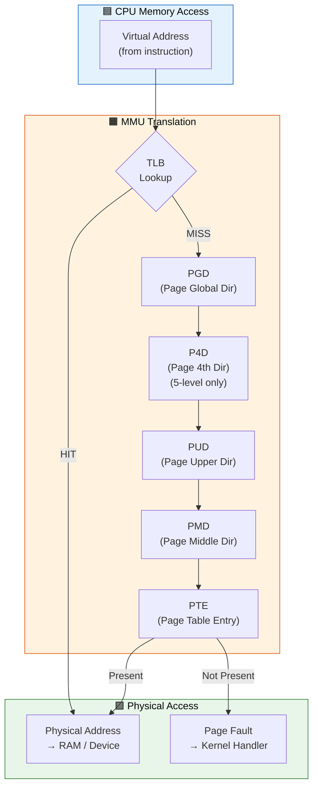
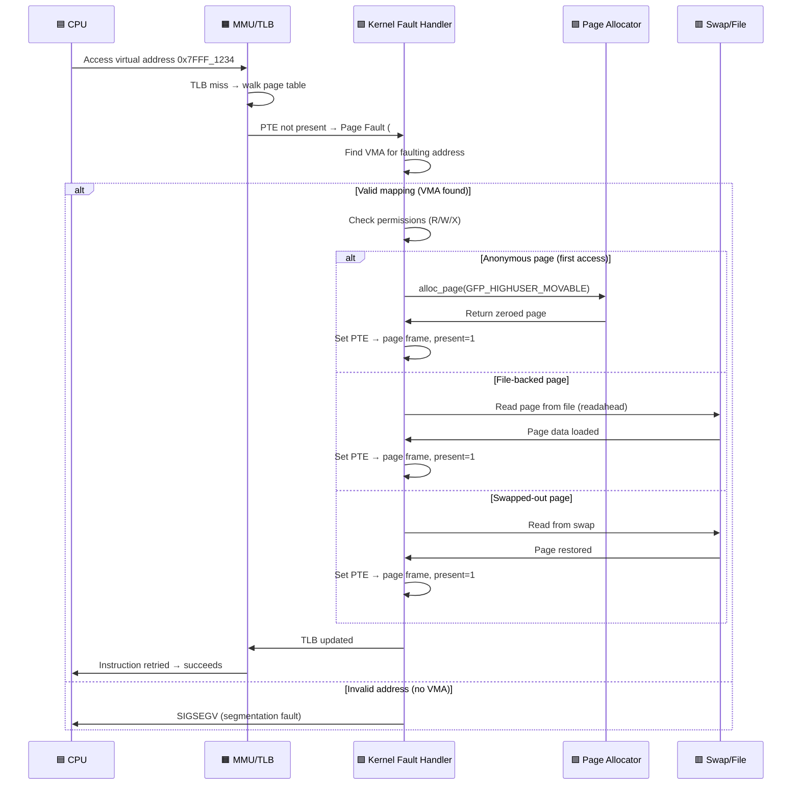

# Q1: Explain the Linux Kernel Virtual Memory Architecture and Paging Mechanism in Detail

## Interview Question
**"Walk me through the complete virtual memory architecture in the Linux kernel. How does the kernel manage virtual-to-physical address translation? Explain the multi-level page table structure, the role of the MMU, and how the kernel splits memory between user space and kernel space."**

---

## 1. Why Virtual Memory Exists

### The Problem Without Virtual Memory
In early systems, programs accessed physical RAM directly. This created critical problems:
- **No isolation**: One process could corrupt another's memory
- **No flexibility**: Programs had to be loaded at fixed addresses
- **No overcommit**: Total memory usage limited to physical RAM
- **Fragmentation**: Contiguous allocation led to external fragmentation

### The Virtual Memory Solution
Virtual memory provides each process with its own **virtual address space** — an illusion of a large, contiguous, private memory region. The hardware MMU (Memory Management Unit) translates virtual addresses to physical addresses transparently.

```
Process A sees:          Physical RAM:          Process B sees:
0x0000 - 0xFFFF   -->   Scattered pages   <--  0x0000 - 0xFFFF
(its own world)          in real memory         (its own world)
```

---

## 2. Virtual Address Space Layout

### 32-bit Architecture (ARM/x86)

```
0xFFFFFFFF ┌──────────────────────┐
           │   Kernel Space       │  1 GB (default 3G/1G split)
           │   (shared across     │
           │    all processes)     │
0xC0000000 ├──────────────────────┤  PAGE_OFFSET
           │                      │
           │   User Space         │  3 GB
           │   (per-process)      │
           │                      │
           │   Stack ↓            │
           │                      │
           │   mmap region        │
           │                      │
           │   Heap ↑ (brk)       │
           │   BSS                │
           │   Data               │
           │   Text (code)        │
0x00000000 └──────────────────────┘
```

### 64-bit Architecture (x86_64)

```
0xFFFFFFFFFFFFFFFF ┌──────────────────────┐
                   │  Kernel Space         │  128 TB
                   │  (direct mapping,     │
                   │   vmalloc, vmemmap,   │
                   │   kasan, modules)     │
0xFFFF800000000000 ├──────────────────────┤  Canonical hole boundary
                   │                      │
                   │  Non-canonical hole   │  (addresses trap on access)
                   │                      │
0x00007FFFFFFFFFFF ├──────────────────────┤
                   │  User Space           │  128 TB
                   │  (per-process)        │
0x0000000000000000 └──────────────────────┘
```

**Key point**: On x86_64, only 48 bits of virtual address are used (256 TB total), split into user and kernel halves separated by a non-canonical "hole."

### Kernel Space Layout (x86_64 detail)

```
0xFFFFFFFFFFFFFFFF ┌──────────────────────┐
                   │  Fixmap               │  Fixed compile-time mappings
0xFFFFFE0000000000 ├──────────────────────┤
                   │  vmemmap              │  struct page array
0xFFFFEA0000000000 ├──────────────────────┤
                   │  Virtual memory map   │
0xFFFFE90000000000 ├──────────────────────┤
                   │  KASAN shadow         │
0xFFFFE10000000000 ├──────────────────────┤
                   │  vmalloc/ioremap      │  Non-contiguous allocations
0xFFFFC90000000000 ├──────────────────────┤
                   │  Direct mapping       │  All physical RAM
                   │  (PAGE_OFFSET)        │  phys_to_virt() range
0xFFFF888000000000 ├──────────────────────┤
                   │  Guard hole / LDT     │
0xFFFF800000000000 └──────────────────────┘
```

---

## 3. Paging Fundamentals

### What is a Page?
A **page** is the smallest unit of memory management. On most architectures:
- **x86/x86_64**: 4 KB (4096 bytes) — `PAGE_SIZE`
- **ARM64**: 4 KB, 16 KB, or 64 KB (configurable)
- **PAGE_SHIFT**: Number of bits to shift (12 for 4KB)

```c
/* From include/asm-generic/page.h */
#define PAGE_SHIFT      12
#define PAGE_SIZE       (1UL << PAGE_SHIFT)    /* 4096 */
#define PAGE_MASK       (~(PAGE_SIZE - 1))     /* 0xFFFFF000 */
```

### Page Frame
A **page frame** is a physical page — a 4KB-aligned block of physical memory. Each page frame is described by a `struct page` in the kernel.

### Virtual Address Breakdown (4-level, x86_64)

```
63    48 47    39 38    30 29    21 20    12 11       0
┌───────┬────────┬────────┬────────┬────────┬──────────┐
│ Sign  │ PGD    │ PUD    │ PMD    │ PTE    │  Offset  │
│extend │ Index  │ Index  │ Index  │ Index  │ in page  │
│(16bit)│ (9bit) │ (9bit) │ (9bit) │ (9bit) │ (12bit)  │
└───────┴────────┴────────┴────────┴────────┴──────────┘
```

Each 9-bit index selects one of 512 entries in the respective table.

---

## 4. Multi-Level Page Tables

### Why Multi-Level?
A flat page table for a 48-bit address space would need 2^36 entries × 8 bytes = **512 GB** — absurd. Multi-level tables are sparse: only populated regions consume memory.

### The Four Levels (x86_64)

```
CR3 Register
    │
    ▼
┌─────────┐
│   PGD   │  Page Global Directory (512 entries, 4KB)
│ (pgd_t) │  One per process (in mm_struct->pgd)
└────┬────┘
     │ PGD index (bits 47-39)
     ▼
┌─────────┐
│   PUD   │  Page Upper Directory (512 entries, 4KB)
│ (pud_t) │
└────┬────┘
     │ PUD index (bits 38-30)
     ▼
┌─────────┐
│   PMD   │  Page Middle Directory (512 entries, 4KB)
│ (pmd_t) │
└────┬────┘
     │ PMD index (bits 29-21)
     ▼
┌─────────┐
│   PTE   │  Page Table Entry (512 entries, 4KB)
│ (pte_t) │
└────┬────┘
     │ PTE index (bits 20-12)
     ▼
┌─────────┐
│ Physical│  Actual 4KB page frame
│  Page   │  + offset (bits 11-0)
└─────────┘
```

### 5-Level Paging (x86_64, Linux 4.14+)
For servers needing >256 TB virtual address space, Linux supports 5-level paging:
- Adds **P4D** (Page 4th Directory) between PGD and PUD
- Extends virtual address to **57 bits** (128 PB)
- Enabled via `CONFIG_X86_5LEVEL`

### Page Table Entry Format (x86_64 PTE)

```
63  62     52 51          12 11  9  8  7  6  5  4  3  2  1  0
┌───┬────────┬──────────────┬─────┬──┬──┬──┬──┬──┬──┬──┬──┬──┐
│NX │ Avail  │ Physical     │Avail│ G│PAT│D │ A│PCD│PWT│U/S│R/W│ P│
│   │ (OS)   │ Frame Number │     │  │   │  │  │   │   │   │  │  │
└───┴────────┴──────────────┴─────┴──┴──┴──┴──┴───┴───┴───┴──┴──┘
```

| Bit | Name | Meaning |
|-----|------|---------|
| 0 | P (Present) | Page is in physical memory |
| 1 | R/W | 0 = read-only, 1 = read-write |
| 2 | U/S | 0 = supervisor only, 1 = user accessible |
| 5 | A (Accessed) | Set by MMU on any access |
| 6 | D (Dirty) | Set by MMU on write |
| 7 | PAT | Page Attribute Table index |
| 8 | G (Global) | Not flushed on CR3 switch (for kernel pages) |
| 63 | NX | No-execute (prevents code execution) |

---

## 5. Page Table Manipulation in Kernel Code

### Key Macros and Functions

```c
#include <linux/mm.h>
#include <asm/pgtable.h>

/* Walking page tables for a virtual address 'addr' */
pgd_t *pgd = pgd_offset(mm, addr);      /* Get PGD entry */
if (pgd_none(*pgd) || pgd_bad(*pgd))
    return -EFAULT;

p4d_t *p4d = p4d_offset(pgd, addr);     /* Get P4D entry (5-level) */
pud_t *pud = pud_offset(p4d, addr);     /* Get PUD entry */
if (pud_none(*pud) || pud_bad(*pud))
    return -EFAULT;

pmd_t *pmd = pmd_offset(pud, addr);     /* Get PMD entry */
if (pmd_none(*pmd) || pmd_bad(*pmd))
    return -EFAULT;

pte_t *pte = pte_offset_kernel(pmd, addr); /* Get PTE entry */
if (pte_none(*pte))
    return -EFAULT;

/* Extract physical page frame number */
unsigned long pfn = pte_pfn(*pte);
struct page *page = pfn_to_page(pfn);
```

### Creating/Modifying PTEs

```c
/* Set a PTE */
pte_t entry = pfn_pte(pfn, PAGE_KERNEL);   /* Create PTE from PFN + flags */
set_pte(pte_ptr, entry);                    /* Write PTE */

/* Modify protection */
pte_t new_pte = pte_mkwrite(old_pte);      /* Make writable */
pte_t new_pte = pte_wrprotect(old_pte);    /* Make read-only */
pte_t new_pte = pte_mkdirty(old_pte);      /* Mark dirty */
pte_t new_pte = pte_mkclean(old_pte);      /* Clear dirty */
pte_t new_pte = pte_mkyoung(old_pte);      /* Mark accessed */
```

---

## 6. The MMU and TLB

### How the MMU Translates Addresses

```
CPU issues virtual address
        │
        ▼
   ┌─────────┐
   │   TLB   │──── Hit ──→  Physical address (fast path, ~1 cycle)
   │ Lookup  │
   └────┬────┘
        │ Miss
        ▼
   ┌──────────┐
   │ Page Walk│  MMU walks the page table hierarchy in RAM
   │ (HW or  │  PGD → PUD → PMD → PTE → Physical Frame
   │  SW)    │  (~100-1000 cycles on TLB miss)
   └────┬────┘
        │
        ▼
   ┌──────────┐
   │ TLB Fill │  Cache the translation for future use
   └──────────┘
```

### TLB (Translation Lookaside Buffer)
The TLB is a small, fast cache inside the CPU that stores recent virtual→physical translations.

```
TLB Entry:
┌──────────────────┬──────────────────┬───────────┐
│ Virtual Page Num │ Physical Frame   │ Flags     │
│ + ASID/PCID     │ Number           │ (R/W/X/U) │
└──────────────────┴──────────────────┴───────────┘
```

### TLB Flushing in Linux

```c
/* Flush entire TLB (expensive — avoid in hot paths) */
flush_tlb_all();

/* Flush TLB for a specific mm (on context switch) */
flush_tlb_mm(mm);

/* Flush TLB for a specific range (preferred — surgical) */
flush_tlb_range(vma, start, end);

/* Flush single page */
flush_tlb_page(vma, addr);

/* Flush TLB on all CPUs for a range (IPI-based) */
flush_tlb_mm_range(mm, start, end, stride_shift, freed_tables);
```

**PCID (Process Context ID) / ASID (Address Space ID)**: Avoids flushing TLB on context switch. Each process gets a unique PCID; TLB entries are tagged with it. Linux uses PCID on x86_64 since kernel 4.14 (KPTI era).

---

## 7. Kernel vs User Space Address Translation

### Kernel Direct Mapping (Linear Mapping)

The kernel maps all physical memory into its virtual address space with a simple offset:

```c
/* For the direct-mapped region: */
#define __pa(vaddr)    ((unsigned long)(vaddr) - PAGE_OFFSET)
#define __va(paddr)    ((void *)((unsigned long)(paddr) + PAGE_OFFSET))

/* Example (x86_64): */
/* Physical 0x0000000000001000 → Virtual 0xFFFF888000001000 */
/* PAGE_OFFSET = 0xFFFF888000000000 */
```

This is a **compile-time constant offset** — no page table walk needed conceptually (though the MMU still uses page tables).

### User Space Translation
User space addresses require full page table walks. The kernel itself accesses user memory through special functions:

```c
/* Safe user-space access (handles page faults gracefully) */
unsigned long val;
if (get_user(val, user_ptr))      /* Read from user space */
    return -EFAULT;

if (put_user(val, user_ptr))      /* Write to user space */
    return -EFAULT;

if (copy_from_user(kbuf, ubuf, len))  /* Bulk copy from user */
    return -EFAULT;

if (copy_to_user(ubuf, kbuf, len))    /* Bulk copy to user */
    return -EFAULT;
```

**Why not dereference user pointers directly?**
1. The address might not be mapped → kernel oops
2. SMAP (Supervisor Mode Access Prevention) blocks it on modern CPUs
3. The user could pass a kernel address → security vulnerability

---

## 8. KPTI (Kernel Page Table Isolation)

Introduced to mitigate Meltdown (CVE-2017-5754):

```
WITHOUT KPTI:                       WITH KPTI:
User mode sees:                      User mode sees:
┌──────────────┐                     ┌──────────────┐
│ User pages   │                     │ User pages   │
│ Kernel pages │ ← attackable!       │ Minimal stub │ ← only entry/exit code
└──────────────┘                     └──────────────┘

Kernel mode sees:                    Kernel mode sees:
┌──────────────┐                     ┌──────────────┐
│ User pages   │                     │ User pages   │
│ Kernel pages │                     │ Kernel pages │ ← full kernel mapped
└──────────────┘                     └──────────────┘
```

Each process has **two** PGD page tables:
- `mm->pgd`: Full kernel+user mapping (used in kernel mode)
- A shadow PGD: Only user pages + minimal kernel entry stubs (used in user mode)

On syscall entry, CR3 is switched to the full PGD. On return to user space, CR3 switches back to the shadow PGD.

---

## 9. struct page — The Page Descriptor

Every physical page frame is described by a `struct page`:

```c
struct page {
    unsigned long flags;        /* PG_locked, PG_dirty, PG_slab, etc. */

    union {
        struct {                /* Page cache / anonymous pages */
            struct list_head lru;
            struct address_space *mapping;
            pgoff_t index;
            unsigned long private;
        };
        struct {                /* Slab allocator */
            struct kmem_cache *slab_cache;
            void *freelist;
            union {
                unsigned long counters;
                struct {
                    unsigned inuse:16;
                    unsigned objects:15;
                    unsigned frozen:1;
                };
            };
        };
        struct {                /* Compound pages (huge pages) */
            unsigned long compound_head;
            unsigned char compound_dtor;
            unsigned char compound_order;
            atomic_t compound_mapcount;
        };
        /* ... more unions for various use cases */
    };

    atomic_t _refcount;         /* Reference count */
    atomic_t _mapcount;         /* Number of PTEs mapping this page */
    /* ... */
};
```

Key page flags (from `include/linux/page-flags.h`):
- `PG_locked` — Page is locked for I/O
- `PG_dirty` — Page modified, needs writeback
- `PG_lru` — Page is on an LRU list
- `PG_active` — Page is on the active LRU list
- `PG_slab` — Page is managed by slab allocator
- `PG_reserved` — Page cannot be swapped out
- `PG_compound` — Part of a compound (huge) page

---

## 10. Practical Driver Relevance

### When Drivers Touch Page Tables

```c
/* 1. ioremap — maps device MMIO into kernel virtual space */
void __iomem *base = ioremap(phys_addr, size);
/* Creates new page table entries in vmalloc region */

/* 2. remap_pfn_range — maps physical pages into user VMA */
static int my_mmap(struct file *f, struct vm_area_struct *vma)
{
    unsigned long pfn = phys_addr >> PAGE_SHIFT;
    return remap_pfn_range(vma, vma->vm_start, pfn,
                           vma->vm_end - vma->vm_start,
                           vma->vm_page_prot);
}

/* 3. vm_insert_page — insert a single kernel page into user VMA */
struct page *page = alloc_page(GFP_KERNEL);
vm_insert_page(vma, user_addr, page);

/* 4. vmalloc_to_pfn — get PFN of vmalloc'd page */
unsigned long pfn = vmalloc_to_pfn(vmalloc_addr);
```

---

## 11. Common Interview Follow-ups

**Q: What happens when CONFIG_HIGHMEM is enabled (32-bit)?**
On 32-bit with >896MB RAM, not all physical memory fits in the direct mapping. Pages above 896MB are in ZONE_HIGHMEM and must be temporarily mapped via `kmap()` / `kmap_atomic()` before kernel access.

**Q: How does fork() handle page tables?**
`fork()` → `copy_mm()` → `dup_mmap()` → `copy_page_range()`. All PTEs are copied but marked read-only (COW). Physical pages are shared until a write triggers a page fault.

**Q: What is the cost of a TLB miss?**
~7-100 cycles on x86_64 with hardware page walk. On architectures with software-managed TLB (some MIPS, older SPARC), a TLB miss triggers a trap and the kernel walks tables in software — much more expensive.

**Q: Explain ASLR from kernel perspective**
Address Space Layout Randomization randomizes the base addresses of stack, mmap region, heap, and executable. Implemented in `arch/x86/mm/mmap.c` via `arch_mmap_rnd()` and `randomize_stack_top()`. Controlled by `/proc/sys/kernel/randomize_va_space`.

---

## 12. Key Source Files to Study

| File | Purpose |
|------|---------|
| `arch/x86/include/asm/pgtable_types.h` | Page table type definitions |
| `arch/x86/include/asm/pgtable.h` | Page table manipulation macros |
| `arch/x86/mm/init.c` | Kernel page table initialization |
| `arch/x86/mm/fault.c` | Page fault handler |
| `mm/memory.c` | Core page table operations |
| `mm/mmap.c` | Virtual memory area management |
| `include/linux/mm_types.h` | `mm_struct`, `vm_area_struct`, `struct page` |
| `arch/x86/mm/tlb.c` | TLB flush implementation |
| `arch/x86/mm/pti.c` | KPTI (page table isolation) |

---

## Summary Cheat Sheet

| Concept | 32-bit | 64-bit (4-level) | 64-bit (5-level) |
|---------|--------|-------------------|-------------------|
| Virtual bits | 32 | 48 | 57 |
| Page table levels | 2-3 | 4 | 5 |
| User space | 3 GB | 128 TB | 64 PB |
| Kernel space | 1 GB | 128 TB | 64 PB |
| PAGE_OFFSET | 0xC0000000 | 0xFFFF888000000000 | varies |
| Page size | 4 KB | 4 KB | 4 KB |
| PTE entries/table | 1024 | 512 | 512 |

---

## Mermaid Diagrams

### Virtual Address Translation Flow



### Page Fault Handling Sequence


