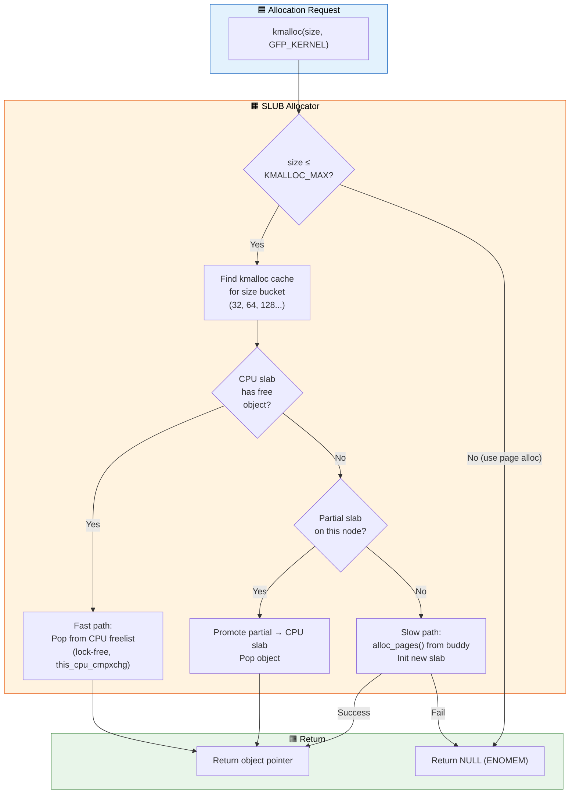
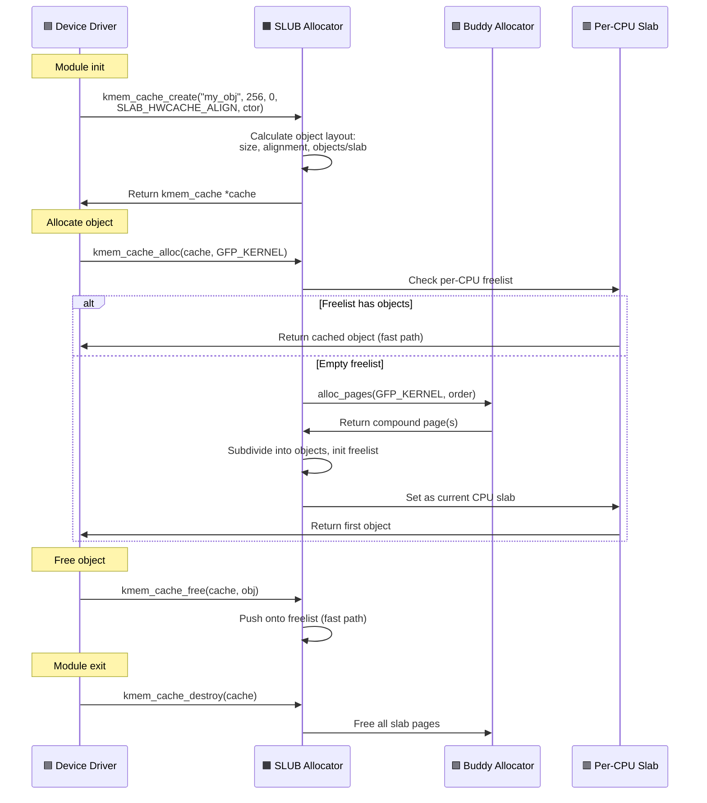

# Q2: Explain the Slab Allocator in Linux Kernel — kmalloc, kmem_cache, SLUB

## Interview Question
**"Explain the slab allocation mechanism in the Linux kernel. How does kmalloc() work internally? What are slab, slub, and slob? How would you create a custom slab cache in a device driver and when would you do so?"**

---

## 1. The Problem: Why Not Just Use the Page Allocator?

The page allocator (buddy system) allocates memory in units of pages (4KB). But kernel subsystems frequently need small objects — 32 bytes, 128 bytes, 512 bytes. Using a full page for a 64-byte structure wastes 98.4% of the memory.

```
Need: 64 bytes           Page allocator gives: 4096 bytes
┌────┐                   ┌──────────────────────────────────────┐
│ 64B│                   │         4096 bytes                    │
└────┘                   │ ██ (64 used) ░░░░░░░░░░░ (4032 wasted) │
                         └──────────────────────────────────────┘
                         → 98.4% internal fragmentation!
```

**Additional problems:**
- Constructing/destructing complex objects repeatedly is expensive
- No caching of frequently used object types
- No CPU-local caching for hot paths

---

## 2. The Slab Concept

The slab allocator sits **between** the page allocator and kernel consumers:

```
┌──────────────────┐
│  Kernel Consumer  │  kmalloc(128, GFP_KERNEL)
│  (driver, fs...) │
└────────┬─────────┘
         │
         ▼
┌──────────────────┐
│  Slab Allocator   │  Manages caches of fixed-size objects
│  (SLUB/SLAB/SLOB)│  Subdivides pages into objects
└────────┬─────────┘
         │
         ▼
┌──────────────────┐
│  Page Allocator   │  alloc_pages() — buddy system
│  (Buddy System)   │  Allocates whole pages
└──────────────────┘
```

### Core Idea
1. Pre-allocate pages for objects of specific sizes
2. Subdivide each page (slab) into multiple same-sized objects
3. Maintain free lists for fast allocation/deallocation
4. Cache recently freed objects for reuse (hot cache)

---

## 3. Three Slab Implementations

Linux has had three slab allocator implementations:

| Feature | SLAB | SLUB (default) | SLOB |
|---------|------|----------------|------|
| Introduced | 1996 (Linux 2.0) | 2007 (Linux 2.6.22) | 2006 |
| Complexity | High | Medium | Low |
| Memory overhead | High (per-slab metadata) | Low (embedded metadata) | Minimal |
| Target | General purpose | General purpose (default) | Embedded/tiny systems |
| Per-CPU caching | Array-based | Page-based (freelist) | None |
| Status (6.x) | Removed (6.5) | **Default** | CONFIG_SLOB (deprecated 6.2) |

**SLUB** is the default and only maintained implementation since Linux 6.5.

---

## 4. SLUB Architecture Deep Dive

### Key Data Structures

```c
struct kmem_cache {
    /* Per-CPU data — the fast path */
    struct kmem_cache_cpu __percpu *cpu_slab;

    /* Object geometry */
    unsigned int size;          /* Object size including metadata */
    unsigned int object_size;   /* Actual usable object size */
    unsigned int offset;        /* Free pointer offset within object */
    unsigned int min_partial;   /* Min partial slabs to keep */

    /* Allocation order */
    struct kmem_cache_order_objects oo;  /* Preferred order+objects */
    struct kmem_cache_order_objects min; /* Minimum order+objects */

    gfp_t allocflags;          /* GFP flags for page allocation */
    int refcount;              /* Reference count */
    const char *name;          /* Cache name (visible in /proc/slabinfo) */
    struct list_head list;     /* Linked into slab_caches list */

    /* Per-node partial lists */
    struct kmem_cache_node *node[MAX_NUMNODES];

    /* ... flags, useroffset, usersize for hardening ... */
};
```

### Per-CPU Slab

```c
struct kmem_cache_cpu {
    void **freelist;           /* Pointer to next free object */
    unsigned long tid;         /* Globally unique transaction ID */
    struct slab *slab;         /* The slab page currently in use */
#ifdef CONFIG_SLUB_CPU_PARTIAL
    struct slab *partial;      /* Per-CPU partial slab list */
#endif
};
```

### Per-Node Data

```c
struct kmem_cache_node {
    spinlock_t list_lock;
    unsigned long nr_partial;  /* Number of partial slabs */
    struct list_head partial;  /* List of partially-used slabs */
};
```

### SLUB Memory Layout

```
One slab (1 or more pages):
┌──────┬──────┬──────┬──────┬──────┬──────┬──────┬──────┐
│ Obj0 │ Obj1 │ Obj2 │ Obj3 │ Obj4 │ Obj5 │ Obj6 │ Obj7 │
│(used)│(FREE)│(used)│(FREE)│(used)│(FREE)│(used)│(FREE)│
└──────┴──┬───┴──────┴──┬───┴──────┴──┬───┴──────┴──┬───┘
          │             │             │             │
     freelist ────→ Obj1 ──→ Obj3 ──→ Obj5 ──→ Obj7 ──→ NULL

Metadata stored IN the struct slab (which overlays struct page):
- slab->freelist: first free object
- slab->objects: total objects in slab
- slab->inuse: number of allocated objects
```

### How SLUB Stores Free Pointers

```
Object Layout (default):
┌────────────────────────────────────────┐
│ Object data area                       │
│ [actual payload: object_size bytes]    │
│                                        │
│ ┌──────────────────┐                   │
│ │ Free Pointer     │ ← offset within object
│ │ (when free)      │   (points to next free object)
│ └──────────────────┘                   │
│ [padding to alignment]                 │
└────────────────────────────────────────┘

When allocated: free pointer area is overwritten by user data
When freed: free pointer is written back
```

With `CONFIG_SLAB_FREELIST_HARDENED`, free pointers are XOR-encrypted to prevent heap exploitation.

---

## 5. SLUB Allocation Fast Path

```c
/* Simplified __slab_alloc flow */
static __always_inline void *slab_alloc_node(struct kmem_cache *s,
                                              gfp_t gfpflags, int node)
{
    struct kmem_cache_cpu *c;
    void *object;

    /* FAST PATH: Get object from per-CPU freelist */
    c = this_cpu_ptr(s->cpu_slab);
    object = c->freelist;

    if (likely(object)) {
        /* Pop from freelist — single pointer update, no locks! */
        c->freelist = get_freepointer(s, object);
        c->tid = next_tid(c->tid);
        return object;
    }

    /* SLOW PATH: Need to refill */
    return __slab_alloc(s, gfpflags, node, c);
}
```

### Slow Path

```
SLOW PATH flow:
1. Try per-CPU partial slab list
   └── Found? → Activate it, use its freelist → return
2. Try per-node partial slab list (takes list_lock)
   └── Found? → Move to per-CPU, use freelist → return
3. Allocate new slab from page allocator
   └── alloc_pages(order) → Initialize freelist → return first object
```

```
┌────────────────────┐
│  slab_alloc()       │
│  Fast: per-CPU      │ ← no lock, ~20ns
│  freelist           │
└────────┬───────────┘
         │ empty
         ▼
┌────────────────────┐
│  per-CPU partial    │ ← no lock, ~40ns
│  slab list          │
└────────┬───────────┘
         │ empty
         ▼
┌────────────────────┐
│  per-node partial   │ ← spinlock, ~100ns
│  slab list          │
└────────┬───────────┘
         │ empty
         ▼
┌────────────────────┐
│  alloc_pages()      │ ← zone lock, ~500ns+
│  new slab           │
└────────────────────┘
```

---

## 6. kmalloc — The General Purpose Allocator

### How kmalloc Works

`kmalloc()` uses a set of **pre-created general-purpose slab caches** of power-of-2 sizes:

```c
/* The kmalloc size classes (approximate): */
kmalloc-8        kmalloc-16       kmalloc-32       kmalloc-64
kmalloc-96       kmalloc-128      kmalloc-192      kmalloc-256
kmalloc-512      kmalloc-1024     kmalloc-2048     kmalloc-4096
kmalloc-8192     kmalloc-16384    kmalloc-32768    ...
```

```c
void *kmalloc(size_t size, gfp_t flags)
{
    /* Compile-time constant size? Use optimal cache directly */
    if (__builtin_constant_p(size)) {
        unsigned int index = kmalloc_index(size);
        return kmem_cache_alloc(kmalloc_caches[kmalloc_type(flags)][index],
                                flags);
    }
    /* Runtime size — lookup cache at runtime */
    return __kmalloc(size, flags);
}
```

### kmalloc Size → Cache Mapping

```c
/* For a 100-byte allocation: */
kmalloc(100, GFP_KERNEL);
    → kmalloc_index(100) = 7  (next power-of-2 bucket)
    → kmalloc_caches[KMALLOC_NORMAL][7]
    → "kmalloc-128" cache
    → 28 bytes wasted (internal fragmentation)
```

### kmalloc Variants

```c
/* Standard — may sleep */
void *p = kmalloc(size, GFP_KERNEL);

/* Zero-initialized */
void *p = kzalloc(size, GFP_KERNEL);

/* Array allocation (checks overflow) */
void *p = kmalloc_array(n, element_size, GFP_KERNEL);
void *p = kcalloc(n, element_size, GFP_KERNEL);  /* zeroed */

/* Node-specific */
void *p = kmalloc_node(size, GFP_KERNEL, node_id);

/* Resize */
void *p = krealloc(old_ptr, new_size, GFP_KERNEL);

/* Free */
kfree(p);

/* Maximum kmalloc size */
/* Typically limited to 2 pages of order: KMALLOC_MAX_SIZE */
/* Usually 8KB to 32MB depending on config */
```

---

## 7. Creating Custom Slab Caches

### When to Use a Custom Cache

Use `kmem_cache_create()` when:
1. You allocate/free the **same struct** very frequently
2. You need a **constructor** for initialization
3. You want to reduce fragmentation by grouping same-type objects
4. You want debugging/accounting per object type

### Driver Example

```c
#include <linux/slab.h>

struct my_device_command {
    u32 opcode;
    u32 flags;
    dma_addr_t dma_handle;
    void *buffer;
    struct list_head list;
    u8 data[64];
};

static struct kmem_cache *cmd_cache;

/* Module init */
static int __init my_driver_init(void)
{
    cmd_cache = kmem_cache_create(
        "my_driver_cmd",                    /* Name (shows in /proc/slabinfo) */
        sizeof(struct my_device_command),   /* Object size */
        0,                                  /* Alignment (0 = default) */
        SLAB_HWCACHE_ALIGN | SLAB_PANIC,   /* Flags */
        NULL                                /* Constructor (optional) */
    );
    if (!cmd_cache)
        return -ENOMEM;

    return 0;
}

/* Allocate an object */
struct my_device_command *cmd;
cmd = kmem_cache_alloc(cmd_cache, GFP_KERNEL);
if (!cmd)
    return -ENOMEM;

/* Use the object... */

/* Free the object */
kmem_cache_free(cmd_cache, cmd);

/* Module exit */
static void __exit my_driver_exit(void)
{
    kmem_cache_destroy(cmd_cache);
}
```

### With Constructor

```c
static void cmd_constructor(void *ptr)
{
    struct my_device_command *cmd = ptr;
    memset(cmd, 0, sizeof(*cmd));
    INIT_LIST_HEAD(&cmd->list);
    cmd->opcode = CMD_NOP;
}

cmd_cache = kmem_cache_create("my_driver_cmd",
                               sizeof(struct my_device_command),
                               0,
                               SLAB_HWCACHE_ALIGN,
                               cmd_constructor);
```

### Cache Creation Flags

```c
#define SLAB_HWCACHE_ALIGN   0x00002000  /* Align to cache line */
#define SLAB_PANIC           0x00040000  /* Panic on failure */
#define SLAB_RECLAIM_ACCOUNT 0x00020000  /* Account as reclaimable */
#define SLAB_MEM_SPREAD      0x00100000  /* Spread across nodes */
#define SLAB_TYPESAFE_BY_RCU 0x00080000  /* Free via RCU (see below) */
#define SLAB_POISON          0x00000800  /* Debug: poison freed objects */
#define SLAB_RED_ZONE        0x00000400  /* Debug: red zone around objects */
#define SLAB_ACCOUNT         0x04000000  /* Account to memcg */
```

---

## 8. SLAB_TYPESAFE_BY_RCU — Deep Dive

This flag is tricky and commonly asked:

```c
/* WITHOUT SLAB_TYPESAFE_BY_RCU: */
/* After rcu_read_lock(), the object might be freed + memory returned to page allocator */
/* Accessing it → use-after-free → kernel oops */

/* WITH SLAB_TYPESAFE_BY_RCU: */
/* The slab page itself is not returned to page allocator during RCU grace period */
/* The object memory remains valid (but might be reused for a NEW object) */
/* You must re-validate the object after acquiring a reference */

struct my_obj *obj;
rcu_read_lock();
obj = rcu_dereference(global_ptr);
if (obj) {
    /* Object memory is safe to touch, but might have been freed + reallocated */
    spin_lock(&obj->lock);
    if (obj->state == VALID) {  /* Re-validate! */
        /* Safe to use */
    }
    spin_unlock(&obj->lock);
}
rcu_read_unlock();
```

---

## 9. SLUB Debugging

### Runtime Debugging via Boot Parameters

```bash
# Enable all SLUB debugging for all caches:
slub_debug=FPZU

# Enable for specific cache:
slub_debug=FZ,kmalloc-64

# Flags:
# F - Sanity checks (freelist corruption)
# P - Poisoning (fill freed objects with 0x6b, alloc with 0x5a)
# Z - Red zoning (guard bytes around objects)
# U - User tracking (store allocation/free call stacks)
# T - Trace (log all alloc/free events)
```

### Poison Patterns

```
Freshly allocated (debug mode):  0x5a5a5a5a
Freshly freed (debug mode):      0x6b6b6b6b
Red zone (guard bytes):          0xcc
Object padding:                  0x5c

If you see 0x6b6b6b6b in data → using freed memory
If you see corrupted red zone → buffer overflow
```

### /proc/slabinfo

```bash
$ cat /proc/slabinfo
# name            <active_objs> <num_objs> <objsize> <objperslab> <pagesperslab>
kmalloc-256           2048       2048      256        16          1
kmalloc-128           4096       4096      128        32          1
task_struct            428        450     6784         4          8
dentry                85467     86400      192        21          1
inode_cache           42056     42300      608        26          4
```

### /sys/kernel/slab/

```bash
$ ls /sys/kernel/slab/kmalloc-128/
align           objs_per_slab      red_zone
alloc_calls     objects            sanity_checks
cache_dma       order              shrink
cpu_partial     partial            slab_size
cpu_slabs       poison             slabs
ctor            reclaim_account    store_user
destroy_by_rcu  aliases            total_objects
free_calls      hwcache_align      trace
min_partial     object_size        validate
```

---

## 10. kmalloc vs Other Allocators — When to Use What

```
Size needed:

< 1 byte to ~4KB    → kmalloc() / kzalloc()
                      ✓ Fast, physically contiguous
                      ✓ Per-CPU fast path

> 4KB to ~128KB     → kmalloc() still works (multi-page slabs)
                      But might fail under memory pressure

> 128KB             → vmalloc() or kvmalloc()
                      vmalloc: virtually contiguous, not physical
                      kvmalloc: tries kmalloc first, falls back to vmalloc

Page-aligned        → alloc_pages() / __get_free_pages()
                      Direct page allocator access

Fixed-size objects  → kmem_cache_create() + kmem_cache_alloc()
(high frequency)      Much lower fragmentation and faster
```

---

## 11. Bulk Allocation API (SLUB)

```c
/* Allocate multiple objects at once — amortizes overhead */
int kmem_cache_alloc_bulk(struct kmem_cache *s, gfp_t flags,
                          size_t nr, void **p);

/* Free multiple objects at once */
void kmem_cache_free_bulk(struct kmem_cache *s, size_t nr, void **p);

/* Example: */
#define BATCH_SIZE 16
void *objects[BATCH_SIZE];
int allocated = kmem_cache_alloc_bulk(cmd_cache, GFP_KERNEL,
                                       BATCH_SIZE, objects);
if (allocated < BATCH_SIZE) {
    /* Handle partial allocation */
    kmem_cache_free_bulk(cmd_cache, allocated, objects);
    return -ENOMEM;
}
/* Use objects[0] through objects[BATCH_SIZE-1] */
```

---

## 12. Memory Accounting and Cgroups

```c
/* SLAB_ACCOUNT flag makes allocations charged to memory cgroup */
cache = kmem_cache_create("my_cache", size, 0,
                           SLAB_ACCOUNT, NULL);

/* This is important for containers — prevents one container from
   consuming unlimited kernel memory through slab allocations */
```

---

## 13. Common Interview Follow-ups

**Q: What's the maximum size kmalloc can allocate?**
Defined by `KMALLOC_MAX_SIZE`. Typically `2^(MAX_ORDER-1) * PAGE_SIZE` = 4MB on most configs, but can be up to 32MB. Beyond this, use vmalloc.

**Q: Can you use kmalloc in interrupt context?**
Yes, with `GFP_ATOMIC`. This uses the per-CPU freelist (no sleeping). If the freelist is empty, it tries to allocate pages with `GFP_ATOMIC` which uses emergency reserves.

**Q: What happens if you kfree() twice?**
Double-free. With SLUB debug enabled, it catches this (freelist corruption check). Without debug, it corrupts the freelist → eventual kernel crash or security vulnerability.

**Q: How does SLUB handle NUMA?**
Each NUMA node has its own partial slab list (`kmem_cache_node`). Allocations prefer the local node. Objects freed on a different node than where they were allocated go to that node's partial list ("remote free").

**Q: Difference between kmem_cache_destroy and kmem_cache_shrink?**
- `kmem_cache_destroy()`: Frees all slabs and removes the cache entirely. All objects must be freed first!
- `kmem_cache_shrink()`: Frees empty slabs but keeps the cache active. Used to reclaim memory.

---

## 14. Key Source Files

| File | Purpose |
|------|---------|
| `mm/slub.c` | SLUB allocator implementation |
| `mm/slab_common.c` | Common slab infrastructure |
| `include/linux/slab.h` | kmalloc/slab API |
| `include/linux/slub_def.h` | SLUB-specific structures |
| `mm/slab.h` | Internal slab header |
| `mm/kasan/` | KASAN integration with slab |

---

## Mermaid Diagrams

### SLUB Allocation Flow



### kmem_cache Lifecycle Sequence


