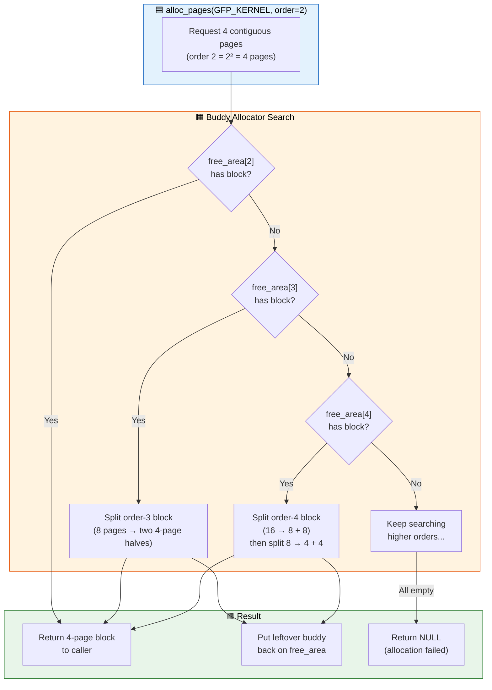
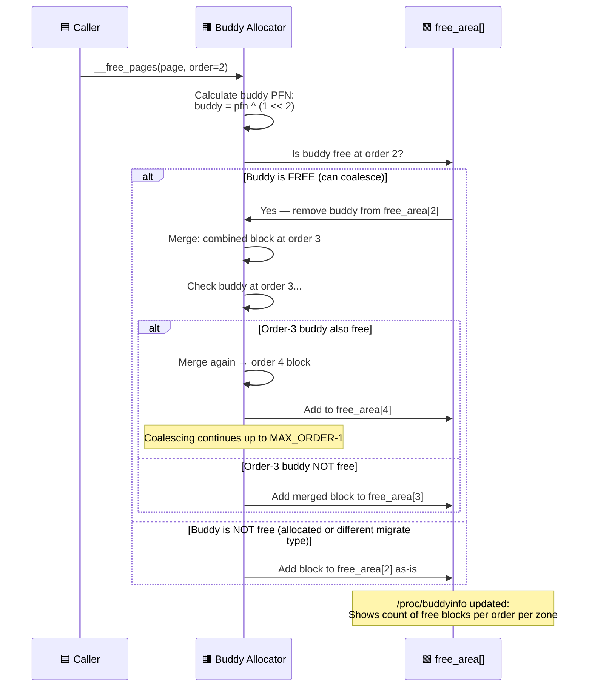

# Q3: Explain the Buddy System Page Allocator in Linux Kernel

## Interview Question
**"Describe the buddy system page allocator in the Linux kernel. How does it work internally? How does it handle fragmentation? Walk me through alloc_pages() and __free_pages(). What are allocation orders and how does page splitting/coalescing work?"**

---

## 1. The Page Allocator's Role

The page allocator is the **lowest-level memory allocator** in the Linux kernel. Everything else builds on top of it:

```
┌────────────────────────────────────────┐
│  kmalloc / vmalloc / User pages / DMA  │  Consumers
└────────────────┬───────────────────────┘
                 │
┌────────────────▼───────────────────────┐
│         Slab Allocator (SLUB)          │  Sub-page objects
└────────────────┬───────────────────────┘
                 │
┌────────────────▼───────────────────────┐
│       Page Allocator (Buddy System)    │  ← THIS
└────────────────┬───────────────────────┘
                 │
┌────────────────▼───────────────────────┐
│           Physical Memory (RAM)         │  Hardware
└────────────────────────────────────────┘
```

The page allocator manages **all physical page frames** and allocates groups of contiguous pages in powers of 2.

---

## 2. Buddy System Algorithm

### Core Principle
Memory is divided into blocks of 2^order contiguous pages. When a block is freed, the allocator checks if its "buddy" (adjacent block of same size) is also free. If so, they merge into a block of twice the size. This recursively coalesces upward.

### Order
```
Order 0  → 2^0 = 1 page    = 4 KB
Order 1  → 2^1 = 2 pages   = 8 KB
Order 2  → 2^2 = 4 pages   = 16 KB
Order 3  → 2^3 = 8 pages   = 32 KB
...
Order 10 → 2^10 = 1024 pages = 4 MB  (MAX_ORDER - 1)
```

`MAX_ORDER` is typically 11, so the largest contiguous allocation is 2^10 = 1024 pages = 4 MB.

### Buddy Relationship

Two blocks are **buddies** if:
1. They are the same size (same order)
2. They are aligned to a boundary of 2 × their size
3. They were originally split from the same parent block

```
Address calculation:
buddy_pfn = pfn ^ (1 << order)

Example (order 2, 4-page blocks):
Block at PFN 0x100 → buddy at PFN 0x100 ^ 0x4 = 0x104
Block at PFN 0x104 → buddy at PFN 0x104 ^ 0x4 = 0x100
```

---

## 3. Free Area Data Structure

```c
/* Per-zone free area structure */
struct zone {
    /* ... */
    struct free_area free_area[MAX_ORDER];  /* One per order (0-10) */
    /* ... */
};

struct free_area {
    struct list_head free_list[MIGRATE_TYPES];  /* Separate lists per migrate type */
    unsigned long nr_free;                       /* Number of free blocks */
};
```

### Visual Representation

```
Zone (e.g., ZONE_NORMAL):

free_area[0] (order 0, 4KB blocks):
  UNMOVABLE:  ○→○→○→○→NULL    (4 free single pages)
  MOVABLE:    ○→○→NULL         (2 free single pages)
  RECLAIMABLE: NULL             (0 free)

free_area[1] (order 1, 8KB blocks):
  UNMOVABLE:  ○→○→NULL         (2 free 2-page blocks)
  MOVABLE:    ○→NULL            (1 free 2-page block)

free_area[2] (order 2, 16KB blocks):
  UNMOVABLE:  ○→NULL            (1 free 4-page block)
  MOVABLE:    ○→○→NULL          (2 free 4-page blocks)

...

free_area[10] (order 10, 4MB blocks):
  UNMOVABLE:  NULL
  MOVABLE:    ○→NULL            (1 free 1024-page block)
```

---

## 4. Allocation: alloc_pages() Walk-Through

### API

```c
/* Allocate 2^order contiguous pages */
struct page *alloc_pages(gfp_t gfp_mask, unsigned int order);

/* Get the virtual address directly */
unsigned long __get_free_pages(gfp_t gfp_mask, unsigned int order);

/* Single page shortcuts */
struct page *alloc_page(gfp_t gfp_mask);                /* order 0 */
unsigned long __get_free_page(gfp_t gfp_mask);           /* order 0, returns addr */
unsigned long get_zeroed_page(gfp_t gfp_mask);           /* order 0, zeroed */
```

### Allocation Algorithm

```
Request: alloc_pages(GFP_KERNEL, 2)  → Need 4 contiguous pages

Step 1: Look at free_area[2] (order 2)
        └── Block available? → YES → Remove from list → Return it ✓

Step 2: If free_area[2] is empty, look at free_area[3] (order 3)
        └── Block available? → YES → Split it:
            ┌──────────────────────────────────────┐
            │ 8-page block (order 3)                │
            ├──────────────────┬───────────────────┤
            │ First half (4pg) │ Second half (4pg)  │
            │ → RETURN THIS    │ → Add to free[2]   │
            └──────────────────┴───────────────────┘

Step 3: If free_area[3] is empty, look at free_area[4] (order 4)
        └── Split 16-page block:
            16 pages → split → 8 pages (→ free[3]) + 8 pages
                                                     → split → 4 pages (RETURN) + 4 pages (→ free[2])

Step 4: Continue up to MAX_ORDER-1. If all empty → allocation fails.
```

### Code Path (Simplified)

```c
struct page *alloc_pages(gfp_t gfp, unsigned int order)
{
    return __alloc_pages(gfp, order, preferred_nid, NULL);
}

struct page *__alloc_pages(gfp_t gfp, unsigned int order,
                           int preferred_nid, nodemask_t *nmask)
{
    struct page *page;

    /* Fast path: try to allocate from preferred zone */
    page = get_page_from_freelist(gfp, order, alloc_flags, &ac);
    if (likely(page))
        return page;

    /* Slow path: reclaim, compact, OOM */
    return __alloc_pages_slowpath(gfp, order, &ac);
}

/* The actual buddy allocation */
static struct page *__rmqueue(struct zone *zone, unsigned int order,
                              int migratetype)
{
    struct page *page;

    /* Try exact order first, then split larger blocks */
    for (int current_order = order; current_order < MAX_ORDER; current_order++) {
        struct free_area *area = &zone->free_area[current_order];

        page = list_first_entry_or_null(&area->free_list[migratetype],
                                         struct page, buddy_list);
        if (!page)
            continue;

        /* Found a block! Remove from free list */
        list_del(&page->buddy_list);
        area->nr_free--;

        /* Split if we got a larger block */
        expand(zone, page, order, current_order, migratetype);

        return page;
    }
    return NULL;
}
```

### The expand() Function — Splitting

```c
static void expand(struct zone *zone, struct page *page,
                   int low, int high, int migratetype)
{
    unsigned long size = 1 << high;

    while (high > low) {
        high--;
        size >>= 1;

        /* Add the buddy (upper half) to the lower order free list */
        struct page *buddy = &page[size];
        list_add(&buddy->buddy_list,
                 &zone->free_area[high].free_list[migratetype]);
        zone->free_area[high].nr_free++;
        set_buddy_order(buddy, high);
    }
}
```

**Visual example — splitting order 3 for an order 1 request:**

```
Before: Order 3 block [AAAAAAAA] (8 pages)

Split 1 (order 3 → 2):
[AAAA][BBBB]     B goes to free_area[2]

Split 2 (order 2 → 1):
[AA][CC][BBBB]   C goes to free_area[1]

Return [AA] (order 1, 2 pages)

Free lists modified:
  free_area[2]: gained [BBBB]
  free_area[1]: gained [CC]
  free_area[3]: lost original [AAAAAAAA]
```

---

## 5. Deallocation: __free_pages() Walk-Through

### API

```c
void __free_pages(struct page *page, unsigned int order);
void free_pages(unsigned long addr, unsigned int order);

/* Single page */
void __free_page(struct page *page);
void free_page(unsigned long addr);
```

### Coalescing Algorithm

```c
static void __free_one_page(struct page *page, unsigned long pfn,
                            struct zone *zone, unsigned int order,
                            int migratetype)
{
    unsigned long buddy_pfn;
    struct page *buddy;

    while (order < MAX_ORDER - 1) {
        /* Find buddy */
        buddy_pfn = pfn ^ (1 << order);
        buddy = pfn_to_page(buddy_pfn);

        /* Check if buddy is free AND same order */
        if (!page_is_buddy(page, buddy, order))
            break;  /* Buddy not free — stop coalescing */

        /* Remove buddy from its free list */
        list_del(&buddy->buddy_list);
        zone->free_area[order].nr_free--;

        /* Merge: use lower PFN as the combined block */
        if (buddy_pfn < pfn) {
            page = buddy;
            pfn = buddy_pfn;
        }

        order++;  /* Double the block size, try again */
    }

    /* Add merged block to appropriate free list */
    list_add(&page->buddy_list,
             &zone->free_area[order].free_list[migratetype]);
    zone->free_area[order].nr_free++;
    set_buddy_order(page, order);
}
```

**Visual example — freeing and coalescing:**

```
Before free:
PFN: [0][1][2][3][4][5][6][7]
     [U][F][U][F][U][U][F][F]     U=used, F=free
     free_area[0]: pages 1,3
     free_area[1]: pages 6-7

Free page 2 (PFN=2, order 0):
  Step 1: buddy of PFN 2 at order 0 = PFN 3 → FREE! Merge → order 1 block [2,3]
  Step 2: buddy of PFN 2 at order 1 = PFN 0 → NOT FREE (used) → Stop
  → Add [2,3] to free_area[1]

Free page 0 (PFN=0, order 0):
  Step 1: buddy of PFN 0 at order 0 = PFN 1 → FREE! Merge → order 1 block [0,1]
  Step 2: buddy of PFN 0 at order 1 = PFN 2 → Was freed above! Merge → order 2 block [0,1,2,3]
  Step 3: buddy of PFN 0 at order 2 = PFN 4 → NOT FREE → Stop
  → Add [0,1,2,3] to free_area[2]
```

---

## 6. Migration Types and Anti-Fragmentation

### The Fragmentation Problem

Without grouping, the buddy allocator suffers from **external fragmentation**: even with enough total free pages, large contiguous blocks are unavailable because long-lived allocations are scattered throughout.

### Migration Types

```c
enum migratetype {
    MIGRATE_UNMOVABLE,      /* Kernel structures, page tables — can't be moved */
    MIGRATE_MOVABLE,        /* User pages — can be migrated/compacted */
    MIGRATE_RECLAIMABLE,    /* Page cache, slab caches — can be reclaimed */
    MIGRATE_PCPTYPES,       /* Number of types on per-cpu lists */
    MIGRATE_HIGHATOMIC,     /* High-order atomic reserves */
    MIGRATE_CMA,            /* Contiguous Memory Allocator */
    MIGRATE_ISOLATE,        /* Isolated for compaction/hotplug */
};
```

### Pageblock Grouping

```
Physical memory divided into pageblocks (typically 2MB on x86_64):

┌──────────────┬──────────────┬──────────────┬──────────────┐
│ MOVABLE      │ UNMOVABLE    │ RECLAIMABLE  │ MOVABLE      │
│ pageblock    │ pageblock    │ pageblock    │ pageblock    │
│ (user pages) │ (kernel)     │ (cache)      │ (user pages) │
└──────────────┴──────────────┴──────────────┴──────────────┘

Each pageblock has a migrate type stored in the pageblock_flags bitmap.
Allocations go to free lists of matching migrate type.
```

### Fallback List

When a migrate type's free list is empty, it steals from others:

```c
/* Fallback order for migration types */
static int fallbacks[MIGRATE_TYPES][3] = {
    [MIGRATE_UNMOVABLE]   = { MIGRATE_RECLAIMABLE, MIGRATE_MOVABLE,   MIGRATE_TYPES },
    [MIGRATE_MOVABLE]     = { MIGRATE_RECLAIMABLE, MIGRATE_UNMOVABLE, MIGRATE_TYPES },
    [MIGRATE_RECLAIMABLE] = { MIGRATE_UNMOVABLE,   MIGRATE_MOVABLE,   MIGRATE_TYPES },
};
```

---

## 7. Per-CPU Page Cache (PCP / pcplist)

For single-page (order 0) allocations, going to the zone's free list every time is expensive (requires zone lock). The **per-CPU page cache** provides lock-free fast-path allocation:

```c
struct per_cpu_pages {
    int count;              /* Number of pages in the list */
    int high;               /* High watermark — refill if above */
    int high_min;
    int high_max;
    int batch;              /* Chunk size for refill/drain */
    short free_count;
    short free_factor;
    struct list_head lists[NR_PCP_LISTS]; /* Per-migrate-type lists */
};
```

```
Allocation flow for order 0:

┌──────────────┐
│ alloc_page() │
└──────┬───────┘
       ▼
┌────────────────┐
│ Per-CPU cache  │ ← No lock needed! (preempt disable only)
│ (hot pages)    │
└──────┬─────────┘
       │ empty?
       ▼
┌────────────────┐
│ Refill batch   │ ← Take zone->lock, grab 'batch' pages
│ from zone      │    typically 31 pages at once
└────────────────┘

Free flow for order 0:

┌──────────────┐
│ free_page()  │
└──────┬───────┘
       ▼
┌────────────────┐
│ Per-CPU cache  │ ← Add to front (hot)
│ (return here)  │
└──────┬─────────┘
       │ count > high?
       ▼
┌────────────────┐
│ Drain batch    │ ← Return 'batch' cold pages to zone free list
│ to zone        │
└────────────────┘
```

---

## 8. Slow Path: alloc_pages_slowpath

When the fast path fails:

```
__alloc_pages_slowpath():
│
├── 1. Wake up kswapd (background reclaim)
│     → kswapd scans LRU lists, reclaims pages
│
├── 2. Try allocation again with relaxed watermarks
│     → Use min watermark instead of low
│
├── 3. Direct reclaim (synchronous)
│     → Current process reclaims pages itself
│     → Scans inactive LRU, writes dirty pages, frees cached
│
├── 4. Memory compaction
│     → Moves pages to create contiguous free blocks
│     → Critical for higher-order allocations
│
├── 5. Try allocation again
│     → After reclaim/compaction freed pages
│
├── 6. OOM killer (last resort)
│     → Select and kill a process to free memory
│     → Then retry allocation
│
└── 7. Return NULL if __GFP_NOFAIL not set
```

---

## 9. Watermarks

Each zone has three watermark levels controlling allocation behavior:

```c
struct zone {
    unsigned long _watermark[NR_WMARK];  /* min, low, high */
    /* ... */
};

enum zone_watermarks {
    WMARK_MIN,     /* Below this → allocation fails for normal requests */
    WMARK_LOW,     /* Below this → wake kswapd */
    WMARK_HIGH,    /* Above this → kswapd sleeps */
};
```

```
Pages free
    │
    │  ████████████████████ WMARK_HIGH ← kswapd stops reclaiming
    │  ▒▒▒▒▒▒▒▒▒▒▒▒▒▒▒▒▒▒
    │  ▒▒▒▒▒▒▒▒▒▒▒▒▒▒▒▒▒▒ WMARK_LOW  ← kswapd starts reclaiming
    │  ░░░░░░░░░░░░░░░░░░░░
    │  ░░░░░░░░░░░░░░░░░░░░ WMARK_MIN  ← normal allocs fail, only GFP_ATOMIC/PF_MEMALLOC
    │  ▓▓▓▓▓▓▓▓▓▓▓▓▓▓▓▓▓▓
    │  (emergency reserves)
    0
```

Tunable via `/proc/sys/vm/min_free_kbytes`.

---

## 10. Memory Compaction

Compaction creates contiguous free blocks by moving MOVABLE pages:

```
Before compaction:
PFN: [M][F][U][M][F][M][M][F][U][M][F][F][M][F][M][F]
     M=movable  U=unmovable  F=free

Scanner from left (migration scanner) → finds movable pages
Scanner from right (free scanner) ← finds free pages

After compaction:
PFN: [M][M][U][M][M][M][M][F][U][F][F][F][F][F][F][F]
     ← Pages packed left                Contiguous free →
```

```c
/* Trigger compaction */
echo 1 > /proc/sys/vm/compact_memory       /* System-wide */
echo 1 > /sys/devices/system/node/node0/compact  /* Per-node */

/* Or it happens automatically when high-order allocation fails */
```

---

## 11. /proc/buddyinfo

```bash
$ cat /proc/buddyinfo
Node 0, zone      DMA      1      1      0      0      2      1      1      0      1      1      3
Node 0, zone    DMA32   2451  18782  10076   4397   2189   1079    508    251    125     63      5
Node 0, zone   Normal  42613  31897  17243   7806   3141   1098    350    108     38     12      1

# Columns = order 0, 1, 2, ..., 10
# Values = number of free blocks of that order
#
# Node 0, zone Normal:
#   42613 free order-0 blocks (single pages)
#   31897 free order-1 blocks (2-page blocks)
#   ...
#   1 free order-10 block (1024-page block = 4MB)
```

**Reading buddyinfo**: Low numbers at high orders means fragmentation — even if total free memory is high, large contiguous allocations will fail.

---

## 12. Practical Driver Considerations

```c
/* In device drivers, prefer: */

/* Order 0 — always succeeds if memory available */
struct page *page = alloc_page(GFP_KERNEL);

/* Higher orders — may fail! Always check */
struct page *pages = alloc_pages(GFP_KERNEL, 3);  /* 8 pages */
if (!pages) {
    /* Fallback: use vmalloc or scatter-gather */
}

/* For DMA buffers needing physical contiguity:
   Use CMA (Contiguous Memory Allocator) instead of high-order alloc_pages
   → dma_alloc_coherent() which uses CMA internally */

/* NEVER assume high-order allocations succeed */
/* For buffers > order 2 (16KB), consider:
   - vmalloc + scatter-gather DMA
   - CMA via dma_alloc_coherent
   - Compound pages / huge pages */
```

---

## 13. Common Interview Follow-ups

**Q: Why is MAX_ORDER typically 11?**
Trade-off between memory overhead (larger MAX_ORDER = more buddy bitmap entries) and maximum contiguous allocation size. 2^10 pages = 4MB which covers most kernel needs. For larger contiguous allocations, use CMA.

**Q: What is the difference between `alloc_pages` and `__get_free_pages`?**
`alloc_pages()` returns `struct page *`. `__get_free_pages()` returns the kernel virtual address (calls `page_address(alloc_pages(...))`). `__get_free_pages` only works for pages in the direct mapping (not highmem).

**Q: Can you allocate pages from interrupt context?**
Yes, with `GFP_ATOMIC`. It won't sleep, uses emergency reserves, but may fail more easily.

**Q: What is CMA and how does it relate to the buddy system?**
CMA (Contiguous Memory Allocator) reserves large contiguous regions at boot. These regions are in `MIGRATE_CMA` pageblocks—usable as movable pages normally, but reclaimable when a driver needs the contiguous block. Used by `dma_alloc_coherent()`.

**Q: How does the kernel handle memory hot-plug?**
Pages are onlined/offlined via `online_pages()` / `offline_pages()`. The buddy allocator adds/removes page blocks. Only MOVABLE zones can be offlined (all pages must be migrated first).

---

## 14. Key Source Files

| File | Purpose |
|------|---------|
| `mm/page_alloc.c` | Core buddy allocator (alloc_pages, free_pages) |
| `include/linux/gfp.h` | GFP flags definitions |
| `mm/compaction.c` | Memory compaction |
| `mm/vmscan.c` | Page reclamation (kswapd, direct reclaim) |
| `mm/page-writeback.c` | Dirty page writeback |
| `include/linux/mmzone.h` | Zone and free_area structures |
| `mm/cma.c` | Contiguous Memory Allocator |
| `mm/internal.h` | Internal allocator helpers |

---

## Mermaid Diagrams

### Buddy System Allocation Flow



### Page Free and Coalescing Sequence


