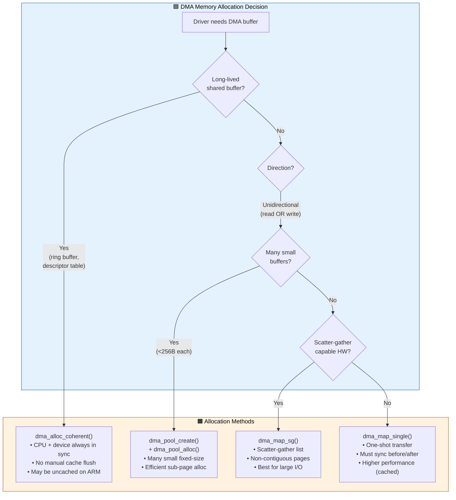
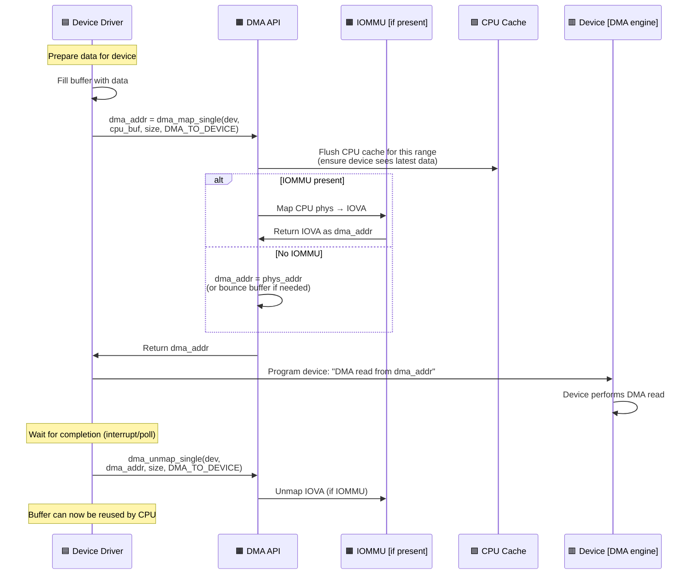

# Q5: DMA Memory Management in Linux Kernel

## Interview Question
**"Explain DMA memory management in the Linux kernel. What are the differences between coherent and streaming DMA mappings? How does the DMA API work? What is an IOMMU and how does it affect DMA? How do you handle DMA in a device driver on systems with and without an IOMMU?"**

---

## 1. What is DMA?

**Direct Memory Access (DMA)** allows hardware devices to transfer data to/from system memory without CPU involvement:

```
WITHOUT DMA (PIO - Programmed I/O):
CPU reads from device → CPU writes to RAM → CPU reads from device → ...
CPU is 100% busy during transfer

WITH DMA:
CPU sets up DMA descriptor → Device reads/writes RAM directly → CPU gets interrupt
CPU is free during transfer!
```

### The DMA Problem

```
CPU Address                Device Address
(Virtual)                  (Bus/DMA)
   │                           │
   ▼                           ▼
┌──────┐                  ┌──────┐
│ MMU  │                  │IOMMU │ (if present)
└──┬───┘                  └──┬───┘
   │                         │
   ▼                         ▼
┌──────────────────────────────────┐
│        Physical Memory           │
└──────────────────────────────────┘

Problem 1: Device needs PHYSICAL (or DMA/bus) addresses, not virtual
Problem 2: CPU cache may not be coherent with device DMA
Problem 3: Device may only address lower 32/24 bits of memory
Problem 4: Some memory may not be DMA-accessible
```

---

## 2. DMA Addresses vs Physical vs Virtual

```c
/* Three different address types: */

unsigned long vaddr;           /* Kernel virtual address */
phys_addr_t  paddr;            /* CPU physical address */
dma_addr_t   dma_handle;       /* Device-visible DMA address */

/* Relationships: */
vaddr = (unsigned long)__va(paddr);     /* Only for linear map */
paddr = __pa(vaddr);                     /* Only for linear map */

/* dma_handle may equal paddr (no IOMMU) or may be different (with IOMMU) */
```

### Without IOMMU

```
dma_handle == physical address
Device directly addresses physical RAM
```

### With IOMMU (SMMU on ARM, VT-d on Intel)

```
dma_handle = IOVA (I/O Virtual Address)
IOMMU translates IOVA → physical address

Device → IOVA → IOMMU → Physical RAM

Benefits:
- Scatter-gather: non-contiguous physical pages look contiguous to device
- Protection: device can only access mapped regions
- Address width: 32-bit device can access memory above 4GB
```

---

## 3. The DMA API

### Setting DMA Mask

```c
#include <linux/dma-mapping.h>

static int my_probe(struct pci_dev *pdev, const struct pci_device_id *id)
{
    /* Tell the kernel what addresses the device can handle */

    /* For a device that can address 64-bit DMA: */
    if (dma_set_mask_and_coherent(&pdev->dev, DMA_BIT_MASK(64))) {
        /* Fallback to 32-bit */
        if (dma_set_mask_and_coherent(&pdev->dev, DMA_BIT_MASK(32))) {
            dev_err(&pdev->dev, "No suitable DMA config\n");
            return -EIO;
        }
    }

    /* dma_set_mask: for streaming mappings */
    /* dma_set_coherent_mask: for coherent allocations */
    /* dma_set_mask_and_coherent: sets both at once */
}
```

---

## 4. Coherent DMA Mapping (Consistent)

### What is it?
A coherent mapping provides memory that is simultaneously accessible by both CPU and device without explicit cache management. The memory is typically uncached or uses hardware cache coherence.

```c
/* Allocate coherent DMA buffer */
void *dma_alloc_coherent(struct device *dev,
                          size_t size,
                          dma_addr_t *dma_handle,  /* OUT: device address */
                          gfp_t gfp);

/* Free coherent DMA buffer */
void dma_free_coherent(struct device *dev,
                        size_t size,
                        void *cpu_addr,
                        dma_addr_t dma_handle);
```

### Example: Ring Buffer for Device Commands

```c
struct my_device {
    struct device *dev;
    void *ring_buf;              /* CPU virtual address */
    dma_addr_t ring_dma;         /* DMA address for device */
    size_t ring_size;
};

static int my_probe(struct platform_device *pdev)
{
    struct my_device *mydev;

    mydev->ring_size = 4096;
    mydev->ring_buf = dma_alloc_coherent(mydev->dev,
                                          mydev->ring_size,
                                          &mydev->ring_dma,
                                          GFP_KERNEL);
    if (!mydev->ring_buf)
        return -ENOMEM;

    /* Now:
       CPU accesses via:   mydev->ring_buf[i] = value;
       Device accesses via: mydev->ring_dma (write to device register)
       No cache flushes needed! */

    /* Tell device where the ring buffer is */
    writel(lower_32_bits(mydev->ring_dma), base + DMA_RING_BASE_LO);
    writel(upper_32_bits(mydev->ring_dma), base + DMA_RING_BASE_HI);

    return 0;
}

static int my_remove(struct platform_device *pdev)
{
    dma_free_coherent(mydev->dev, mydev->ring_size,
                      mydev->ring_buf, mydev->ring_dma);
    return 0;
}
```

### Properties of Coherent Mappings

```
✓ No explicit cache flush/invalidate needed
✓ CPU and device always see the same data
✗ Slower CPU access (uncached on non-coherent platforms like older ARM)
✗ Uses CMA or dedicated DMA zone
✗ Should be long-lived (allocation overhead)

Best for: Descriptor rings, command queues, status registers
```

---

## 5. Streaming DMA Mapping

### What is it?
Streaming mappings are for **one-time or periodic data transfers**. CPU must explicitly synchronize (cache flush/invalidate) before and after device access. More efficient than coherent mappings for data buffers.

### DMA Direction

```c
enum dma_data_direction {
    DMA_BIDIRECTIONAL = 0,  /* CPU and device read/write */
    DMA_TO_DEVICE     = 1,  /* CPU writes, device reads (e.g., TX packet) */
    DMA_FROM_DEVICE   = 2,  /* Device writes, CPU reads (e.g., RX packet) */
    DMA_NONE          = 3,  /* For debugging */
};
```

### Single-Buffer Mapping

```c
/* Map a kernel buffer for DMA */
dma_addr_t dma_map_single(struct device *dev,
                           void *cpu_addr,
                           size_t size,
                           enum dma_data_direction dir);

/* Unmap after DMA complete */
void dma_unmap_single(struct device *dev,
                       dma_addr_t dma_handle,
                       size_t size,
                       enum dma_data_direction dir);

/* Check mapping success */
int dma_mapping_error(struct device *dev, dma_addr_t dma_handle);
```

### Example: Network Driver TX Path

```c
static int my_net_xmit(struct sk_buff *skb, struct net_device *ndev)
{
    struct my_priv *priv = netdev_priv(ndev);
    dma_addr_t dma_handle;

    /* 1. Map the packet data for DMA */
    dma_handle = dma_map_single(priv->dev,
                                 skb->data,
                                 skb->len,
                                 DMA_TO_DEVICE);
    if (dma_mapping_error(priv->dev, dma_handle)) {
        dev_kfree_skb(skb);
        return NETDEV_TX_OK;
    }

    /* 2. Between map and unmap, CPU must NOT touch the buffer!
          Ownership transferred to device */

    /* 3. Set up DMA descriptor */
    priv->tx_ring[idx].buf_addr = dma_handle;
    priv->tx_ring[idx].len = skb->len;
    priv->tx_ring[idx].skb = skb;

    /* 4. Kick the DMA engine */
    writel(idx, priv->base + TX_TAIL);

    return NETDEV_TX_OK;
}

/* In TX completion interrupt handler: */
static void my_tx_complete(struct my_priv *priv, int idx)
{
    /* 5. Unmap after DMA is done */
    dma_unmap_single(priv->dev,
                      priv->tx_ring[idx].buf_addr,
                      priv->tx_ring[idx].len,
                      DMA_TO_DEVICE);

    /* 6. Now CPU can touch the buffer again */
    dev_kfree_skb(priv->tx_ring[idx].skb);
}
```

### Example: Network Driver RX Path

```c
/* Pre-allocate RX buffers during init */
static int my_alloc_rx_buf(struct my_priv *priv, int idx)
{
    void *buf = kmalloc(BUF_SIZE, GFP_KERNEL);
    dma_addr_t dma;

    dma = dma_map_single(priv->dev, buf, BUF_SIZE, DMA_FROM_DEVICE);
    if (dma_mapping_error(priv->dev, dma)) {
        kfree(buf);
        return -ENOMEM;
    }

    priv->rx_ring[idx].buf = buf;
    priv->rx_ring[idx].dma = dma;
    priv->rx_ring[idx].desc->buf_addr = dma;

    return 0;
}

/* RX interrupt handler */
static void my_rx_handler(struct my_priv *priv, int idx)
{
    unsigned int len = priv->rx_ring[idx].desc->pkt_len;

    /* Unmap — transfers ownership back to CPU */
    dma_unmap_single(priv->dev,
                      priv->rx_ring[idx].dma,
                      BUF_SIZE,
                      DMA_FROM_DEVICE);

    /* Now CPU can read the received data */
    process_packet(priv->rx_ring[idx].buf, len);

    /* Allocate a new buffer for this slot */
    my_alloc_rx_buf(priv, idx);
}
```

---

## 6. DMA Sync Operations (Partial Transfers)

If you need to access a buffer between DMA operations without unmapping:

```c
/* CPU wants to read device-written data (without unmapping) */
dma_sync_single_for_cpu(dev, dma_handle, size, DMA_FROM_DEVICE);
/* CPU can now read the buffer */

/* Hand buffer back to device */
dma_sync_single_for_device(dev, dma_handle, size, DMA_FROM_DEVICE);
/* Device can now DMA into the buffer again */

/* What sync actually does on non-coherent systems:
   for_cpu + DMA_FROM_DEVICE → cache invalidate (discard stale cache)
   for_device + DMA_TO_DEVICE → cache flush (write cache to RAM)
*/
```

### DMA Ownership Rules

```
Timeline:

dma_map_single()          dma_sync_for_cpu()        dma_sync_for_device()     dma_unmap_single()
      │                          │                          │                        │
      │◄── Device owns ────────►│◄── CPU owns ────────────►│◄── Device owns ───────►│
      │    CPU must NOT touch    │    Device must NOT DMA   │    CPU must NOT touch  │
```

---

## 7. Scatter-Gather DMA

For data spread across multiple non-contiguous pages:

```c
#include <linux/scatterlist.h>

/* Allocate scatterlist */
struct scatterlist sg[MAX_SEGMENTS];
sg_init_table(sg, nents);

/* Fill entries */
for (i = 0; i < nents; i++)
    sg_set_buf(&sg[i], buffers[i], lengths[i]);

/* Map all entries for DMA */
int mapped = dma_map_sg(dev, sg, nents, DMA_TO_DEVICE);
if (mapped == 0)
    return -ENOMEM;

/* Now iterate over mapped entries */
struct scatterlist *s;
for_each_sg(sg, s, mapped, i) {
    dma_addr_t addr = sg_dma_address(s);
    unsigned int len = sg_dma_len(s);

    /* Program DMA descriptor with addr and len */
    desc[i].buf_addr = addr;
    desc[i].buf_len = len;
}

/* After DMA completes */
dma_unmap_sg(dev, sg, nents, DMA_TO_DEVICE);
```

### IOMMU Coalescing

```
Without IOMMU:
  sg[0]: phys 0x10000, len 4K → DMA desc 0
  sg[1]: phys 0x50000, len 4K → DMA desc 1
  sg[2]: phys 0x30000, len 4K → DMA desc 2
  dma_map_sg returns 3 (each entry separate)

With IOMMU:
  IOMMU maps all three pages to IOVA 0xA0000-0xA2FFF (contiguous!)
  sg[0]: dma 0xA0000, len 12K → SINGLE DMA desc!
  dma_map_sg may return 1 (coalesced by IOMMU)
```

---

## 8. DMA Pool

For many small, short-lived DMA allocations (smaller than a page):

```c
#include <linux/dmapool.h>

struct dma_pool *pool;

/* Create pool during probe */
pool = dma_pool_create("my_descriptors",  /* name */
                        dev,               /* device */
                        64,                /* allocation size */
                        64,                /* alignment */
                        0);                /* boundary (0 = no constraint) */

/* Allocate from pool */
dma_addr_t dma_handle;
void *desc = dma_pool_alloc(pool, GFP_KERNEL, &dma_handle);

/* Free to pool */
dma_pool_free(pool, desc, dma_handle);

/* Destroy pool during remove */
dma_pool_destroy(pool);

/* dma_pool is the DMA equivalent of kmem_cache:
   - Sub-page granularity coherent allocations
   - Prevents internal fragmentation
   - Common for DMA descriptor rings */
```

---

## 9. DMA Page Mapping

For mapping specific struct pages:

```c
/* Map a single page for DMA */
dma_addr_t dma_map_page(struct device *dev,
                         struct page *page,
                         size_t offset,         /* Offset within page */
                         size_t size,
                         enum dma_data_direction dir);

void dma_unmap_page(struct device *dev,
                     dma_addr_t dma_handle,
                     size_t size,
                     enum dma_data_direction dir);

/* Use this when you have struct page* instead of void* */
/* Common with skb fragments in network drivers:
   skb_frag_page(frag) gives you a struct page* */
```

---

## 10. IOMMU Deep Dive

### IOMMU Architecture

```
                ┌─────────────┐
    CPU ───────►│  System MMU  │───► Physical Memory
                │  (CPU MMU)   │
                └─────────────┘

                ┌─────────────┐
    Device ────►│   IOMMU      │───► Physical Memory
    (PCIe)      │ (SMMU/VT-d) │
                └─────────────┘

IOMMU provides:
1. Address translation: Device IOVA → Physical Address
2. Memory protection: Device can only access mapped regions
3. Address aggregation: Scatter-gather → contiguous DMA address
```

### IOMMU Page Tables

```
Similar to CPU page tables:

Device issues IOVA
      │
      ▼
┌──────────┐
│ IO-PGD   │ Root entry (per device/domain)
└────┬─────┘
     ▼
┌──────────┐
│ IO-PTE   │ Maps IOVA → physical page frame
└────┬─────┘
     ▼
Physical Page
```

### IOMMU Domains

```c
/* Each device (or group of devices) has an IOMMU domain */
/* The Linux DMA API handles this transparently */

/* Direct use (for VFIO, GPU drivers): */
struct iommu_domain *domain = iommu_domain_alloc(bus);
iommu_attach_device(domain, dev);
iommu_map(domain, iova, paddr, size, prot);
iommu_unmap(domain, iova, size);
```

### DMA API Behavior With/Without IOMMU

```
Without IOMMU (direct mapping, swiotlb):
  dma_map_single() → dma_handle = physical address
                     (or bounce buffer if device can't reach phys addr)

With IOMMU:
  dma_map_single() → Allocates IOVA
                    → Creates IOMMU mapping (IOVA → phys)
                    → dma_handle = IOVA (not physical!)
```

---

## 11. Bounce Buffers (SWIOTLB)

When a device can only address 32-bit but physical memory is above 4GB, and there's no IOMMU:

```
Problem:
  Device can DMA to 0x00000000 - 0xFFFFFFFF only
  Buffer at physical 0x200000000 → device can't reach it!

Solution: SWIOTLB (Software I/O TLB)
  1. Allocate bounce buffer in low memory
  2. Copy data to bounce buffer
  3. Give bounce buffer address to device
  4. After DMA, copy data back

┌──────────────────────┐
│ Original buffer       │  Physical 0x200000000 (above 4GB)
│ (CPU uses this)       │
└──────────┬───────────┘
           │ memcpy
           ▼
┌──────────────────────┐
│ Bounce buffer         │  Physical 0x10000000 (below 4GB)
│ (Device DMAs here)    │
└──────────────────────┘
```

```c
/* SWIOTLB is transparent — the DMA API uses it automatically */
/* Boot parameter: swiotlb=65536 (sets size in 2KB slabs) */

/* You can check if bounce buffering occurred: */
/* Performance impact — try to avoid by using 64-bit DMA mask */
```

---

## 12. CMA (Contiguous Memory Allocator)

```c
/* CMA reserves contiguous physical memory at boot for DMA use */
/* Used by dma_alloc_coherent on systems without IOMMU */

/* Boot parameter: */
/* cma=64M   — reserve 64MB for CMA */

/* Device tree: */
reserved-memory {
    #address-cells = <2>;
    #size-cells = <2>;
    ranges;

    my_cma: linux,cma {
        compatible = "shared-dma-pool";
        reusable;
        size = <0 0x4000000>;  /* 64MB */
        linux,cma-default;
    };
};

/* CMA region is used as MOVABLE pages when not needed for DMA */
/* When dma_alloc_coherent needs it, movable pages are migrated out */
```

---

## 13. Common Interview Follow-ups

**Q: Why can't you use kmalloc'd memory directly for DMA?**
You can — `dma_map_single()` maps any kernel virtual address. But you must check `dma_mapping_error()` and handle bounce buffering. The issue is that `kmalloc` doesn't guarantee the memory is in a DMA-accessible region or meets alignment requirements. For guaranteed DMA-accessible memory, use `dma_alloc_coherent()`.

**Q: What is the difference between `dma_alloc_coherent` and `dma_alloc_wc`?**
`dma_alloc_coherent` → uncached (UC) or hardware-coherent; correct for DMA descriptors. `dma_alloc_wc` → write-combining; better for large data buffers (frame buffers) where CPU writes in bursts.

**Q: How does DMA work with user-space buffers (e.g., RDMA)?**
Use `get_user_pages()` / `pin_user_pages()` to pin user pages in memory, then `dma_map_sg()` on the resulting page array. Must unpin with `unpin_user_pages()` after DMA completes.

**Q: What is DMA fence?**
A synchronization primitive for GPU/display DMA operations. Signals when a DMA operation is complete. Part of the `dma_fence` framework used by DRM/KMS drivers.

**Q: Coherent vs streaming — performance difference?**
On ARM without hardware cache coherence: coherent = uncached (slow CPU access). Streaming = cached + explicit flushes (fast CPU access, but flush overhead). On x86 with hardware coherence: minimal difference. Always profile for your platform.

---

## 14. Key Source Files

| File | Purpose |
|------|---------|
| `kernel/dma/mapping.c` | Core DMA mapping API |
| `kernel/dma/direct.c` | Direct (no IOMMU) DMA |
| `kernel/dma/swiotlb.c` | Bounce buffer implementation |
| `kernel/dma/pool.c` | DMA pool |
| `include/linux/dma-mapping.h` | DMA API header |
| `include/linux/dma-direction.h` | DMA direction enum |
| `drivers/iommu/` | IOMMU drivers (arm-smmu, intel-iommu) |
| `kernel/dma/contiguous.c` | CMA integration |
| `mm/cma.c` | CMA core |

---

## Mermaid Diagrams

### DMA Allocation Decision Flow



### Streaming DMA Lifecycle Sequence


