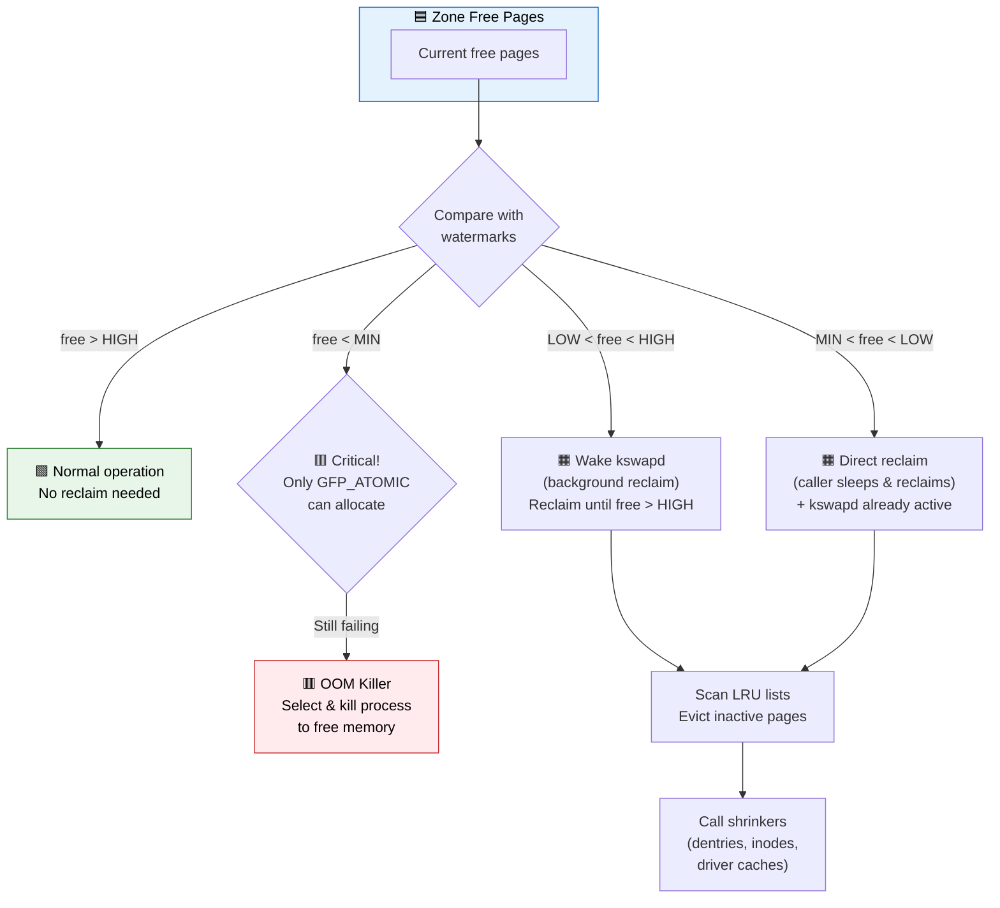
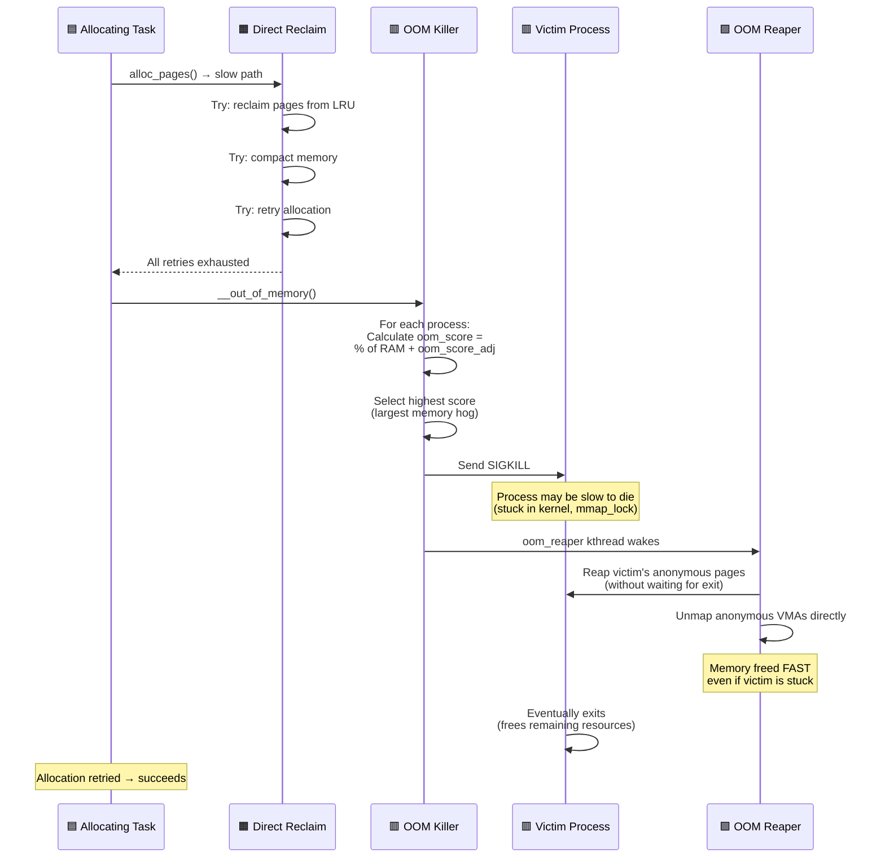

# Q7: OOM Killer and Memory Reclamation in Linux Kernel

## Interview Question
**"Explain the Linux kernel's memory reclamation mechanisms. How does kswapd work? What is direct reclaim? How does the OOM killer select which process to kill? How do watermarks control reclamation? How does a device driver interact with or get affected by the OOM killer?"**

---

## 1. Overview of Memory Pressure Response

```
Available memory decreasing...

WMARK_HIGH ──── Normal operation, no action
    │
WMARK_LOW  ──── kswapd wakes up (background reclaim)
    │
WMARK_MIN  ──── Direct reclaim (allocating process reclaims)
    │
    0      ──── OOM Killer (last resort — kill a process)

┌──────────────────────────────────────────────────────────────┐
│                Memory Reclaim Hierarchy                      │
├──────────────────────────────────────────────────────────────┤
│ 1. kswapd (background, asynchronous)                         │
│    → Scans LRU lists, reclaims cold pages                    │
│                                                              │
│ 2. Direct reclaim (synchronous, in allocator)                │
│    → Allocating process itself reclaims pages                │
│    → Blocks the process until memory is freed                │
│                                                              │
│ 3. Memory compaction                                          │
│    → Moves pages to create contiguous blocks                 │
│    → For higher-order allocations                            │
│                                                              │
│ 4. OOM Killer (emergency)                                    │
│    → Select and kill a process                               │
│    → Free its entire address space                           │
└──────────────────────────────────────────────────────────────┘
```

---

## 2. LRU Lists — The Reclaim Foundation

### Page Categories

```c
/* Every user-space page is on one of these LRU lists */
enum lru_list {
    LRU_INACTIVE_ANON = 0,  /* Anonymous pages (heap, stack), inactive */
    LRU_ACTIVE_ANON   = 1,  /* Anonymous pages, recently accessed */
    LRU_INACTIVE_FILE = 2,  /* File-backed pages (page cache), inactive */
    LRU_ACTIVE_FILE   = 3,  /* File-backed pages, recently accessed */
    LRU_UNEVICTABLE   = 4,  /* Cannot be reclaimed (mlock'd, ramdisk) */
    NR_LRU_LISTS       = 5,
};
```

### Two-List LRU Strategy

```
Active List (hot pages)              Inactive List (cold pages, reclaim candidates)
┌───┬───┬───┬───┬───┬───┐           ┌───┬───┬───┬───┬───┬───┐
│ H │ G │ F │ E │ D │ C │           │ B │ A │ Z │ Y │ X │ W │
└───┴───┴───┴───┴───┴───┘           └───┴───┴───┴───┴───┴───┘
  New ──────────→ Old                  Promoted ◄──── Reclaimed
                   │                      ▲                │
                   │     Demoted          │                ▼
                   └──────────────────────┘          Page freed
                                                     or written back

Active → Inactive: Page not accessed (Accessed bit clear)
Inactive → Active: Page accessed again (promotion, second chance)
Inactive → Free:   Page reclaimed (if clean) or written back then freed
```

### Page Accessed Tracking

```
1. MMU sets the Accessed bit in PTE when page is touched
2. kswapd/reclaim scans pages:
   - Accessed bit SET → clear it, page gets "second chance"
   - Accessed bit CLEAR → page is cold, candidate for reclaim
3. This implements a "clock" / "second chance" algorithm
```

---

## 3. kswapd — Background Reclamation

```c
/* kswapd is a per-NUMA-node kernel thread */
/* One kswapd per node: kswapd0, kswapd1, ... */

static int kswapd(void *p)
{
    pg_data_t *pgdat = (pg_data_t *)p;

    while (!kthread_should_stop()) {
        /* Sleep until watermarks are crossed */
        wait_event_interruptible(pgdat->kswapd_wait,
                                  !sleeping_prematurely(...));

        /* Balance zones — reclaim until WMARK_HIGH reached */
        balance_pgdat(pgdat, order, highest_zoneidx);
    }
    return 0;
}
```

### kswapd Reclaim Flow

```
kswapd wakes (free pages < WMARK_LOW)
│
├─→ shrink_node()
│   ├─→ shrink_lruvec()
│   │   ├─→ shrink_list(INACTIVE_ANON)  → Swap out anonymous pages
│   │   ├─→ shrink_list(INACTIVE_FILE)  → Reclaim clean file pages
│   │   │                                  Write back dirty file pages
│   │   ├─→ shrink_active_list()        → Demote inactive-looking active pages
│   │   └─→ (repeat until sc->nr_to_reclaim satisfied)
│   │
│   └─→ shrink_slab()                   → Call shrinker callbacks
│       ├─→ inode cache shrinker
│       ├─→ dentry cache shrinker
│       ├─→ Driver-registered shrinkers
│       └─→ ...
│
└─→ Sleep if WMARK_HIGH achieved
```

---

## 4. Direct Reclaim

When allocation fails and kswapd hasn't freed enough:

```c
/* Inside __alloc_pages_slowpath: */

/* 1. Wake kswapd */
wakeup_kswapd(zone, gfp_mask, order);

/* 2. Try with kswapd running */
page = get_page_from_freelist(gfp_mask, order, ...);
if (page) return page;

/* 3. Direct reclaim — this process reclaims pages itself */
did_some_progress = try_to_free_pages(zonelist, order, gfp_mask);

/* 4. Try again after reclaim */
page = get_page_from_freelist(gfp_mask, order, ...);
if (page) return page;

/* 5. Compaction (for high-order allocations) */
compact_result = try_to_compact_pages(gfp_mask, order, ...);

/* 6. Try again after compaction */
page = get_page_from_freelist(gfp_mask, order, ...);
if (page) return page;

/* 7. OOM kill */
page = __alloc_pages_may_oom(gfp_mask, order, ...);
```

### What Can Be Reclaimed

```
Reclaimable:
├── File-backed pages (page cache)
│   ├── Clean → Just drop them (backed by file on disk)
│   └── Dirty → Write back to disk, then drop
├── Anonymous pages (heap, stack)
│   └── Swap out to swap device/file
├── Slab caches (via shrinker API)
│   ├── Dentries
│   ├── Inodes
│   └── Driver caches (if registered)
└── Buffer heads, tmpfs pages, etc.

NOT Reclaimable:
├── Kernel code and data
├── Pages with PG_reserved
├── mlock()'d pages (LRU_UNEVICTABLE)
├── Page tables
├── Per-CPU caches
└── Kernel stacks
```

---

## 5. The Shrinker Interface

Drivers and subsystems can register shrinkers to release memory under pressure:

```c
#include <linux/shrinker.h>

struct shrinker {
    unsigned long (*count_objects)(struct shrinker *,
                                   struct shrink_control *sc);
    unsigned long (*scan_objects)(struct shrinker *,
                                  struct shrink_control *sc);
    long batch;
    int seeks;                  /* Cost of recreating an object (relative) */
    unsigned flags;
    struct list_head list;
    /* ... */
};

struct shrink_control {
    gfp_t gfp_mask;
    int nid;                    /* NUMA node to shrink */
    unsigned long nr_to_scan;   /* Number of objects to scan */
    unsigned long nr_scanned;   /* Objects actually scanned */
    struct mem_cgroup *memcg;
};
```

### Driver Shrinker Example

```c
static unsigned long my_cache_count(struct shrinker *shrink,
                                     struct shrink_control *sc)
{
    /* Return number of freeable objects */
    return atomic_long_read(&my_cached_objects);
}

static unsigned long my_cache_scan(struct shrinker *shrink,
                                    struct shrink_control *sc)
{
    unsigned long freed = 0;
    unsigned long to_scan = sc->nr_to_scan;

    while (to_scan-- > 0 && !list_empty(&my_lru_list)) {
        struct my_object *obj = list_last_entry(&my_lru_list,
                                                 struct my_object, lru);
        list_del(&obj->lru);
        my_free_object(obj);
        freed++;
        atomic_long_dec(&my_cached_objects);
    }

    return freed;
}

static struct shrinker *my_shrinker;

static int __init my_init(void)
{
    my_shrinker = shrinker_alloc(0, "my_driver_cache");
    if (!my_shrinker)
        return -ENOMEM;

    my_shrinker->count_objects = my_cache_count;
    my_shrinker->scan_objects = my_cache_scan;
    my_shrinker->seeks = DEFAULT_SEEKS;  /* Cost of recreation */

    shrinker_register(my_shrinker);
    return 0;
}

static void __exit my_exit(void)
{
    shrinker_free(my_shrinker);
}
```

---

## 6. OOM Killer — The Last Resort

### When is OOM Triggered?

```
Conditions for OOM:
1. Allocation cannot be satisfied
2. Direct reclaim made no progress
3. Compaction made no progress
4. All zones tried (across all allowed nodes)
5. The GFP flags don't prevent OOM (__GFP_NORETRY or __GFP_RETRY_MAYFAIL prevent it)
```

### OOM Score Calculation

```c
/* From mm/oom_kill.c */
unsigned long oom_badness(struct task_struct *p, unsigned long totalpages)
{
    long points;
    long adj;

    /* Base score = RSS + swap usage + page table pages */
    points = get_mm_rss(p->mm) +        /* Resident pages */
             get_mm_counter(p->mm, MM_SWAPENTS) +
             mm_pgtables_bytes(p->mm) / PAGE_SIZE;

    /* Apply oom_score_adj (-1000 to +1000) */
    adj = (long)p->signal->oom_score_adj;

    if (adj == OOM_SCORE_ADJ_MIN)         /* -1000 = never kill */
        return ULONG_MAX;                  /* (practically immune) */

    /* Adjust proportionally */
    adj *= totalpages / 1000;
    points += adj;

    return points > 0 ? points : 1;
}
```

### OOM Score Adjustment

```bash
# View OOM score (higher = more likely to be killed)
cat /proc/<pid>/oom_score

# Adjust OOM score (-1000 to 1000)
echo -1000 > /proc/<pid>/oom_score_adj    # Never kill (e.g., init, critical daemon)
echo  1000 > /proc/<pid>/oom_score_adj    # Kill first
echo     0 > /proc/<pid>/oom_score_adj    # Default

# Or via systemd:
# OOMScoreAdjust=-900
```

### OOM Kill Process

```
out_of_memory()
│
├── 1. Check oom_killer_disabled (disabled during suspend)
│
├── 2. Check for oom_group (cgroup-based OOM)
│
├── 3. Select victim: select_bad_process()
│   ├── Iterate all processes
│   ├── Skip kernel threads, init (pid 1), oom_score_adj=-1000
│   ├── Calculate oom_badness() for each
│   └── Pick highest score
│
├── 4. oom_kill_process(victim)
│   ├── Send SIGKILL to victim and all its threads
│   ├── Set TIF_MEMDIE flag (gives victim access to reserves)
│   ├── Mark victim's mm with MMF_OOM_SKIP
│   └── Wake up OOM reaper
│
└── 5. OOM reaper kernel thread
    ├── Unmaps the victim's page tables (fast memory release)
    └── Doesn't wait for process exit (handles stuck procs)
```

### OOM Reaper (Linux 4.6+)

```
Problem: Killed process might be stuck (holding mmap_lock, in D state)
         Memory not freed → system stays in OOM → more kills

Solution: OOM reaper (kernel thread)
  → Directly tears down victim's page tables
  → Frees anonymous pages immediately  
  → Doesn't need the process to actually exit
  → Handles zombie/stuck processes gracefully
```

---

## 7. Memory Cgroups and OOM

```
With cgroups v2, OOM can be per-cgroup:

/sys/fs/cgroup/my_container/memory.max = 512M

When this container exceeds 512M:
  → OOM kills within the cgroup only
  → Does NOT affect other containers
  → memory.oom.group = 1 → kills entire cgroup
```

```c
/* In kernel: mem_cgroup_oom() is called before global OOM */
/* It tries to reclaim within the cgroup first */
/* Only if that fails, it OOM-kills within the cgroup */
```

---

## 8. Preventing OOM in Drivers

### GFP Flags That Affect OOM Behavior

```c
/* These flags control whether OOM killer is invoked: */

GFP_KERNEL              /* May trigger OOM killer — default */
__GFP_NORETRY           /* Don't retry hard, don't invoke OOM */
__GFP_RETRY_MAYFAIL     /* Retry harder, but don't OOM-kill */
__GFP_NOFAIL            /* NEVER fail — infinite retry, no OOM */
                         /* WARNING: can deadlock! Use very carefully */

/* Examples: */
/* Safe — won't trigger OOM */
buf = kmalloc(size, GFP_KERNEL | __GFP_NORETRY | __GFP_NOWARN);
if (!buf)
    return -ENOMEM;  /* Graceful failure */

/* Will loop forever until memory is available */
buf = kmalloc(size, GFP_KERNEL | __GFP_NOFAIL);
/* NOTE: Only use for tiny, critical allocations where failure
   would cause worse problems than waiting */
```

### Driver Best Practices

```c
/* 1. Use kvmalloc for large allocations */
buf = kvmalloc(large_size, GFP_KERNEL);
/* Falls back to vmalloc — less pressure on buddy allocator */

/* 2. Register a shrinker if you cache data */
/* See Section 5 above */

/* 3. Avoid __GFP_NOFAIL — almost never needed in drivers */

/* 4. Handle allocation failures gracefully */
page = alloc_page(GFP_KERNEL);
if (!page) {
    dev_err(dev, "allocation failed, deferring work\n");
    return -ENOMEM;  /* Caller can retry or fail gracefully */
}

/* 5. Free memory proactively when device is idle */
/* Don't hoard cached buffers */
```

---

## 9. Overcommit and /proc/sys/vm

```bash
# Overcommit mode
/proc/sys/vm/overcommit_memory
  0 = Heuristic (default) — kernel guesses if allocation is reasonable
  1 = Always overcommit    — never fail malloc (dangerous)
  2 = Never overcommit     — strict accounting (commit_limit based)

# Overcommit ratio (for mode 2)
/proc/sys/vm/overcommit_ratio = 50  # default
# commit_limit = swap + RAM * (overcommit_ratio / 100)

# Min free kbytes — controls watermarks
/proc/sys/vm/min_free_kbytes = 67584
# Higher = more aggressive kswapd, fewer direct reclaims

# Swappiness — tendency to swap vs reclaim file pages
/proc/sys/vm/swappiness = 60  # default
# 0 = avoid swapping, 100 = freely swap anonymous pages
# 200 = (with zswap) maximum swap pressure

# Dirty page tunables
/proc/sys/vm/dirty_ratio = 20          # % of RAM for dirty pages (per-process writeback)
/proc/sys/vm/dirty_background_ratio = 10 # % of RAM → start background writeback

# VFS cache pressure
/proc/sys/vm/vfs_cache_pressure = 100  # default
# Higher = more aggressively reclaim dentry/inode caches
```

---

## 10. Multi-Generation LRU (MGLRU)

Since Linux 6.1, the default reclaim algorithm is MGLRU:

```
Traditional LRU: 2 lists (active / inactive)
MGLRU: Multiple generations (4 by default)

Generation 0 (youngest, most recently accessed)
Generation 1
Generation 2
Generation 3 (oldest, reclaim candidates)

Benefits:
- Better page aging accuracy
- Less CPU overhead (batch page table scanning)
- Reduces direct reclaim and OOM events
- Configurable via /sys/kernel/mm/lru_gen/

┌────────────────────────────────────────────────────┐
│ Gen 0 │ Gen 1 │ Gen 2 │ Gen 3 → Reclaim candidates │
│ (hot) │       │       │ (cold) → Free these first   │
└────────────────────────────────────────────────────┘
  New allocations go to Gen 0
  Pages age: Gen 0 → Gen 1 → Gen 2 → Gen 3 → Freed
  Accessed pages get promoted back to Gen 0
```

---

## 11. Common Interview Follow-ups

**Q: How does `mlock()` interact with OOM?**
`mlock()` moves pages to `LRU_UNEVICTABLE`. These pages are never reclaimed. But the process is still subject to OOM killing (mlock doesn't prevent being selected as OOM victim). `mlockall(MCL_CURRENT | MCL_FUTURE)` locks all pages.

**Q: What happens if the OOM victim is blocked in kernel?**
The OOM reaper (since 4.6) handles this by directly unmapping the victim's page tables without waiting for the process to reach a safe point.

**Q: How does OOM interact with cgroups in containers?**
Each memory cgroup has its own OOM scope. The OOM killer picks victims within the cgroup first. `memory.oom.group=1` kills all processes in the cgroup together. Global OOM only happens if the root cgroup is out of memory.

**Q: Can a kernel driver cause OOM?**
Yes. If a driver leaks kernel memory (kmalloc without kfree), it reduces available memory. Kernel memory is mostly unreclaimable, so it directly reduces what's available for user processes, triggering OOM.

**Q: What is PSI (Pressure Stall Information)?**
`/proc/pressure/memory` shows how much time is spent in memory pressure states. Used by systemd-oomd as an alternative to the traditional OOM killer — it can act earlier based on sustained pressure rather than waiting for absolute exhaustion.

---

## 12. Key Source Files

| File | Purpose |
|------|---------|
| `mm/vmscan.c` | kswapd, direct reclaim, LRU scanning |
| `mm/oom_kill.c` | OOM killer logic |
| `mm/page_alloc.c` | Watermark checks, slow path |
| `mm/workingset.c` | Working set detection (refault distance) |
| `mm/swap.c` | LRU list management |
| `mm/compaction.c` | Memory compaction |
| `mm/shrinker.c` | Shrinker infrastructure |
| `include/linux/mmzone.h` | Zone watermarks, LRU enums |
| `mm/memcontrol.c` | Memory cgroup (memcg) |
| `mm/multi_gen_lru.c` | MGLRU implementation |

---

## Mermaid Diagrams

### Memory Reclaim Watermark Flow



### OOM Kill Sequence


