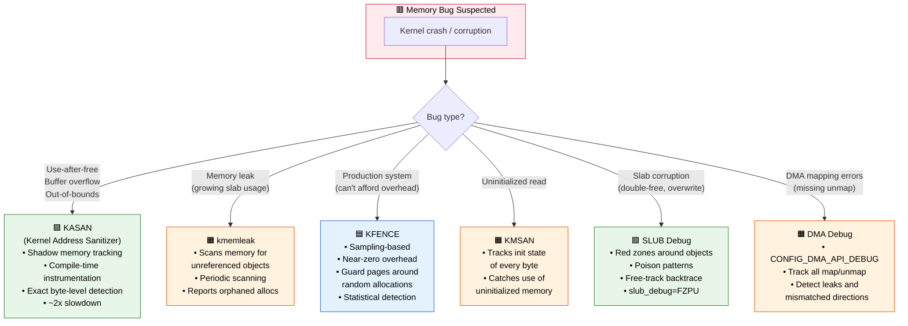
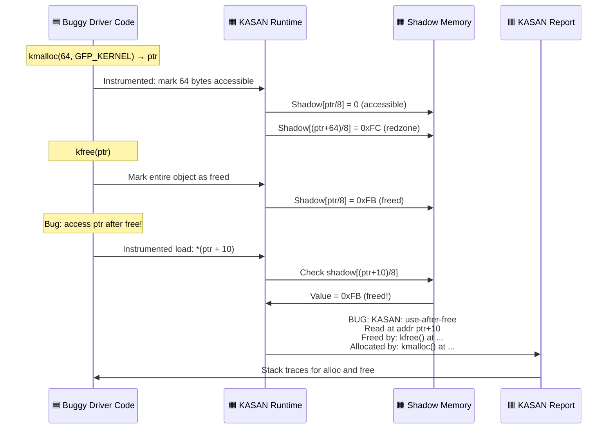

# Q8: Kernel Memory Debugging Tools — KASAN, KFENCE, kmemleak, SLUB Debug

## Interview Question
**"What tools and techniques are available in the Linux kernel for debugging memory issues? Explain KASAN, KFENCE, kmemleak, and SLUB debugging. How would you track down a use-after-free or a memory leak in a device driver?"**

---

## 1. Overview of Memory Bugs

```
┌────────────────────────────────────────────────────────────────┐
│               Common Kernel Memory Bugs                        │
├────────────────────────────────────────────────────────────────┤
│ Use-After-Free    │ Accessing memory after kfree()             │
│ Buffer Overflow   │ Writing past allocation boundary            │
│ Buffer Underflow  │ Writing before allocation start             │
│ Double Free       │ Calling kfree() twice on same pointer      │
│ Memory Leak       │ Allocating without corresponding free      │
│ Stack Overflow    │ Exceeding kernel stack (usually 8-16KB)    │
│ Wild Pointer      │ Dereferencing uninitialized/garbage pointer│
│ Invalid Free      │ Freeing non-heap pointer                   │
│ Out-of-Bounds     │ Array index beyond allocated size          │
└────────────────────────────────────────────────────────────────┘
```

### Detection Tools Matrix

```
┌──────────────┬──────┬────────┬──────┬───────────┬──────┐
│ Bug Type     │KASAN │KFENCE  │SLUB  │ kmemleak  │KMSAN │
│              │      │        │Debug │           │      │
├──────────────┼──────┼────────┼──────┼───────────┼──────┤
│ Use-after-free│ ✓   │ ✓      │ ✓    │           │      │
│ Out-of-bounds│ ✓    │ ✓      │ ✓    │           │      │
│ Double free  │ ✓    │ ✓      │ ✓    │           │      │
│ Memory leak  │      │        │      │ ✓         │      │
│ Uninit read  │      │        │      │           │ ✓    │
│ Stack OOB    │ ✓    │        │      │           │      │
│ Global OOB   │ ✓    │        │      │           │      │
│ Overhead     │High  │ Low    │ Med  │ Med       │ High │
│ Production   │ No   │ ✓      │ No   │ No        │ No   │
└──────────────┴──────┴────────┴──────┴───────────┴──────┘
```

---

## 2. KASAN (Kernel Address Sanitizer)

### What is KASAN?
KASAN detects use-after-free, out-of-bounds, and similar bugs by maintaining a **shadow memory** map that tracks which bytes are valid to access.

### How KASAN Works

```
For every 8 bytes of kernel memory, KASAN uses 1 byte of shadow memory:

Kernel memory:   [8 bytes][8 bytes][8 bytes][8 bytes]...
Shadow memory:   [1 byte] [1 byte] [1 byte] [1 byte]...

Shadow byte values:
  0x00 = All 8 bytes accessible
  0x01-0x07 = Only first N bytes accessible (partial)
  0xFx = Not accessible (poisoned):
    0xFA = Freed memory (use-after-free detection)
    0xFB = Out-of-bounds (red zone)
    0xFC = Stack left scope
    0xFD = Stack right red zone
    0xFE = Global red zone
    0xFF = Generic invalid
```

### Memory Layout with KASAN

```
Without KASAN:
┌────────────────────────────────────────┐
│ [obj1 = 24 bytes]  [obj2 = 24 bytes]  │
└────────────────────────────────────────┘

With KASAN:
┌────────────────────────────────────────────────────────────┐
│ [obj1 = 24B] [red zone 8B] [obj2 = 24B] [red zone 8B]    │
└────────────────────────────────────────────────────────────┘
Shadow: [00 00 00] [FB] [00 00 00] [FB]

After kfree(obj1):
┌────────────────────────────────────────────────────────────┐
│ [FREED  24B] [red zone 8B] [obj2 = 24B] [red zone 8B]    │
└────────────────────────────────────────────────────────────┘
Shadow: [FA FA FA] [FB] [00 00 00] [FB]

Access to obj1 now → KASAN reports use-after-free!
```

### Enabling KASAN

```bash
# Kernel config
CONFIG_KASAN=y
CONFIG_KASAN_GENERIC=y      # Software KASAN (compiler instrumented)
# OR
CONFIG_KASAN_SW_TAGS=y       # Tag-based (ARM64 only, lower overhead)
# OR
CONFIG_KASAN_HW_TAGS=y       # Hardware tag-based (ARM64 MTE)

CONFIG_KASAN_INLINE=y        # Inline checks (faster but bigger binary)
# OR
CONFIG_KASAN_OUTLINE=y       # Function call checks (smaller binary)

# Boot parameter
kasan.mode=on                # Enable (default)
kasan.mode=off               # Disable
kasan.stacktrace=on          # Enable stack traces (default)
```

### KASAN Report Example

```
==================================================================
BUG: KASAN: slab-use-after-free in my_driver_function+0x42/0x80
Write of size 4 at addr ffff888012345678 by task modprobe/1234

CPU: 2 PID: 1234 Comm: modprobe Not tainted 6.5.0 #1
Call Trace:
 dump_stack_lvl+0x56/0x80
 print_report+0xcf/0x620
 kasan_report+0xb5/0xe0
 my_driver_function+0x42/0x80     ← Bug is HERE
 my_driver_probe+0x1a/0x30
 ...

Allocated by task 1234:
 kasan_save_stack+0x22/0x50
 kmalloc_trace+0x25/0x90
 my_driver_alloc+0x20/0x60        ← Originally allocated HERE
 ...

Freed by task 1234:
 kasan_save_stack+0x22/0x50
 kasan_save_free_info+0x2b/0x50
 __kasan_slab_free+0x107/0x140
 kfree+0xb0/0x300
 my_driver_cleanup+0x18/0x40      ← Freed HERE
 ...

The buggy address belongs to the object at ffff888012345660
 which belongs to the cache kmalloc-64 of size 64
The buggy address is located 24 bytes inside of
 freed 64-byte region [ffff888012345660, ffff8880123456a0)
==================================================================
```

### KASAN Overhead

```
Memory overhead: ~1/8 of total memory (shadow memory)
                 + red zones around each allocation
CPU overhead:    50-100% slowdown (every memory access is instrumented)
Code size:       2-3x increase

→ Development/testing only. NOT for production.
```

---

## 3. KFENCE (Kernel Electric Fence)

### What is KFENCE?
KFENCE is a **low-overhead sampling-based** memory error detector, designed for **production** use. It detects the same bugs as KASAN but only for a small subset of allocations.

### How KFENCE Works

```
KFENCE pool at boot (default 512KB):
┌─────────┬───────┬─────────┬───────┬─────────┬───────┐
│ Guard   │ Obj   │ Guard   │ Obj   │ Guard   │ Obj   │
│ Page    │ Page  │ Page    │ Page  │ Page    │ Page  │
│(unmapped)│      │(unmapped)│      │(unmapped)│      │
└─────────┴───────┴─────────┴───────┴─────────┴───────┘

Every ~100ms (configurable), one kmalloc/kmem_cache allocation
is redirected to the KFENCE pool instead of the normal slab.

Guard pages are UNMAPPED → any access = immediate page fault!

Object placement:
Right-aligned (detect overflow):
┌────────────┬──────────────────────┐
│ Guard page │ ···free··· [OBJECT]  │ ← overflow hits guard →  PAGE FAULT
└────────────┴──────────────────────┘

Left-aligned (detect underflow):
┌──────────────────────┬────────────┐
│ [OBJECT] ···free···  │ Guard page │ ← underflow hits guard → PAGE FAULT
└──────────────────────┴────────────┘
```

### Enabling KFENCE

```bash
CONFIG_KFENCE=y

# Boot parameters
kfence.sample_interval=100    # Check every 100ms (default)
kfence.num_objects=255        # Number of objects in pool (default)

# Runtime
echo 50 > /sys/module/kfence/parameters/sample_interval
```

### KFENCE Report Example

```
==================================================================
BUG: KFENCE: out-of-bounds read in my_func+0x28/0x50

Out-of-bounds read at 0xffff8880a0001040 (4 bytes right of
kfence-#72):
  my_func+0x28/0x50
  my_probe+0x38/0x60

kfence-#72: 0xffff8880a0001000-0xffff888a0001003f, size=64, cache=kmalloc-64

Allocated by task 1234 on cpu 2 at 123.456s:
  kmalloc_trace+0x15/0x90
  my_alloc_func+0x18/0x30
==================================================================
```

### KFENCE vs KASAN

```
                   KASAN              KFENCE
Overhead:          50-100% CPU        <1% CPU
Memory:            1/8 total RAM      ~512KB fixed pool
Coverage:          ALL allocations    ~1 per 100ms sample
Detection:         Deterministic      Probabilistic
Use:               Development        Production!
```

---

## 4. kmemleak — Kernel Memory Leak Detector

### How kmemleak Works

```
kmemleak tracks all kmalloc/vmalloc allocations and periodically
scans kernel memory for references to those allocations.

Allocation:
  kmalloc(64) → returns 0xffff888012345000
  kmemleak records: {ptr=0xffff888012345000, size=64, stack=...}

Periodic scan (every 10 minutes by default):
  1. Mark all tracked allocations as "unreferenced"
  2. Scan all kernel memory (data, stack, registers)
  3. If a pointer value matching an allocation address is found,
     mark that allocation as "referenced"
  4. After scan: any still "unreferenced" allocations = POTENTIAL LEAK

It's a conservative garbage collector — may have false positives
(e.g., pointer stored in encoded form, XOR'd, or in device memory)
```

### Enabling kmemleak

```bash
CONFIG_DEBUG_KMEMLEAK=y
CONFIG_DEBUG_KMEMLEAK_DEFAULT_OFF=n  # Enable by default

# Mount debugfs
mount -t debugfs nodev /sys/kernel/debug/

# Trigger a scan
echo scan > /sys/kernel/debug/kmemleak

# Read results
cat /sys/kernel/debug/kmemleak

# Clear results
echo clear > /sys/kernel/debug/kmemleak

# Set scan interval (seconds)
echo scan=60 > /sys/kernel/debug/kmemleak
```

### kmemleak Report Example

```
unreferenced object 0xffff888012340000 (size 1024):
  comm "modprobe", pid 1234, jiffies 4294894652 (age 300.500s)
  hex dump (first 32 bytes):
    00 00 00 00 00 00 00 00  00 00 00 00 00 00 00 00  ................
    00 00 00 00 00 00 00 00  00 00 00 00 00 00 00 00  ................
  backtrace:
    [<00000000a1b2c3d4>] kmalloc_trace+0x25/0x90
    [<00000000e5f6a7b8>] my_driver_init+0x40/0x100 [my_driver]
    [<00000000c9d0e1f2>] do_one_initcall+0x80/0x2a0
    ...
```

### kmemleak API for Drivers

```c
#include <linux/kmemleak.h>

/* Tell kmemleak to NOT track this allocation (no false positive) */
kmemleak_not_leak(ptr);

/* Tell kmemleak to ignore this allocation entirely */
kmemleak_ignore(ptr);

/* Manually notify kmemleak about an allocation */
kmemleak_alloc(ptr, size, min_count, gfp);

/* Manually notify about free */
kmemleak_free(ptr);

/* Mark memory as containing no pointers (don't scan it) */
kmemleak_no_scan(ptr);
```

---

## 5. SLUB Debugging

### Boot Parameters

```bash
# Enable all SLUB debugging
slub_debug=FPZU

# Enable for specific cache
slub_debug=FZ,kmalloc-128

# Flags:
# F = Consistency checks (sanity / free list integrity)
# P = Poisoning (detect use-after-free)
# Z = Red zoning (detect buffer overflow)
# U = User tracking (allocation callsites)
# T = Trace all allocations and frees
# A = Toggle failslab (fault injection)
```

### Poisoning

```
After kmalloc (debug mode):
┌──────────────────────────────────┐
│ 0x5a 0x5a 0x5a 0x5a 0x5a ...    │  ← User data area (uninitialized marker)
├──────────────────────────────────┤
│ 0xbb 0xbb 0xbb 0xbb 0xbb ...    │  ← Red zone (overflow detector)
└──────────────────────────────────┘

After kfree (debug mode):
┌──────────────────────────────────┐
│ 0x6b 0x6b 0x6b 0x6b 0x6b ...    │  ← Poison value (detect UAF)
├──────────────────────────────────┤
│ 0xbb 0xbb 0xbb 0xbb 0xbb ...    │  ← Red zone (should be untouched)
└──────────────────────────────────┘

On next alloc of this slot:
  Check poison bytes → if any are NOT 0x6b → USE AFTER FREE!
  Check red zone → if any are NOT 0xbb → BUFFER OVERFLOW!
```

### /sys/kernel/slab/ Interface

```bash
# Per-cache debugging info
ls /sys/kernel/slab/kmalloc-256/
alloc_calls    # Show allocation callsites
free_calls     # Show free callsites
validate       # Trigger validation of all objects
shrink         # Free empty slabs
poison         # Enable/disable poisoning
red_zone       # Enable/disable red zones
trace          # Enable/disable tracing
```

---

## 6. KMSAN (Kernel Memory Sanitizer)

Detects use of uninitialized kernel memory:

```bash
CONFIG_KMSAN=y  # Linux 6.1+

# KMSAN tracks every byte of memory:
# "initialized" or "uninitialized"

# Example bug:
struct my_struct *obj = kmalloc(sizeof(*obj), GFP_KERNEL);
/* obj fields are UNINITIALIZED */
if (obj->flags & MY_FLAG)  /* ← KMSAN catches this! */
    ...

# Fix:
struct my_struct *obj = kzalloc(sizeof(*obj), GFP_KERNEL);
/* All fields zeroed — safe */
```

---

## 7. Stack Overflow Detection

### VMAP_STACK (Default on x86_64)

```bash
CONFIG_VMAP_STACK=y  # Default since Linux 4.9 (x86_64)

# Each kernel stack is vmalloc'd with guard pages:
┌─────────────┐
│ Guard page   │ ← Unmapped! Stack overflow = page fault = caught!
├─────────────┤
│              │
│ Stack        │ 8KB or 16KB (CONFIG_THREAD_SIZE)
│ (grows down) │
│              │
├─────────────┤
│ Guard page   │ ← Also unmapped
└─────────────┘
```

### Stack Depth Checking

```c
/* Check remaining stack space */
void check_stack_usage(void)
{
    unsigned long sp;

    asm volatile("mov %%rsp, %0" : "=r" (sp));

    unsigned long stack_end = (unsigned long)end_of_stack(current);
    unsigned long used = stack_end + THREAD_SIZE - sp;
    unsigned long remain = sp - stack_end;

    pr_info("Stack: %lu used, %lu remaining\n", used, remain);
}

/* CONFIG_STACK_TRACER: trace maximum stack depth */
/* /sys/kernel/debug/tracing/stack_max_size */
/* /sys/kernel/debug/tracing/stack_trace */
```

---

## 8. Debug Tools Quick Reference

### Practical Debugging Workflow

```
Step 1: Reproduce the bug

Step 2: Choose the right tool:
  ┌─────────────────────┬───────────────────────────┐
  │ Symptom             │ Tool                       │
  ├─────────────────────┼───────────────────────────┤
  │ Random crash/oops   │ KASAN (build & reproduce)  │
  │ Slab corruption msg │ slub_debug=FPZU            │
  │ Suspected leak      │ kmemleak                   │
  │ Production crash    │ KFENCE (always on)         │
  │ Uninit memory read  │ KMSAN                      │
  │ Stack overflow      │ VMAP_STACK + stack tracer   │
  │ DMA corruption      │ DMA debug (CONFIG_DMA_API_DEBUG) │
  └─────────────────────┴───────────────────────────┘

Step 3: Read the report:
  - Allocation stack trace → where was memory allocated?
  - Free stack trace → where was it freed?
  - Bug location → where is the bad access?

Step 4: Fix the bug
```

### Fault Injection

```bash
# CONFIG_FAILSLAB=y — randomly fail slab allocations
echo Y > /sys/kernel/debug/failslab/task-filter
echo 10 > /sys/kernel/debug/failslab/probability
echo 1 > /sys/kernel/debug/failslab/times

# Or via slub_debug:
slub_debug=A,my_driver_cache

# Tests that your driver handles -ENOMEM correctly
```

### CONFIG_DEBUG_PAGEALLOC

```bash
CONFIG_DEBUG_PAGEALLOC=y

# Unmaps freed pages from kernel address space
# Any access to freed page → immediate page fault
# Very high overhead — development only
# Boot param: debug_pagealloc=on
```

### CONFIG_DMA_API_DEBUG

```bash
CONFIG_DMA_API_DEBUG=y

# Detects:
# - DMA mapping leaks (map without unmap)
# - Double unmapping
# - Accessing DMA buffer after unmap
# - Wrong DMA direction
# Boot param: dma_debug=on
# Check: /sys/kernel/debug/dma-api/
```

---

## 9. Common Interview Follow-ups

**Q: You see a random kernel oops in a driver — what's your debugging approach?**
1. Enable KASAN, reproduce → get exact bug report with alloc/free stacks
2. If can't reproduce with KASAN, enable KFENCE in production
3. Check `slub_debug=FPZU` for slab corruption details
4. Use `addr2line` to decode instruction pointers from oops
5. Check `/proc/slabinfo` for suspicious cache growth (leak sign)

**Q: How do you detect a slow memory leak in a driver?**
1. Enable kmemleak, load driver, exercise it, trigger scan
2. Monitor `/proc/slabinfo` — watch for growing object counts
3. Use `/sys/kernel/slab/<cache>/alloc_calls` to find hot allocation sites
4. `echo scan > /sys/kernel/debug/kmemleak && cat /sys/kernel/debug/kmemleak`

**Q: KASAN vs Valgrind?**
KASAN runs inside the kernel, instrumenting kernel code. Valgrind runs in user space, instrumenting user binaries. You can't use Valgrind for kernel/driver code. They serve the same purpose but for different domains.

**Q: Can you run KASAN and KFENCE together?**
KFENCE is automatically disabled when KASAN is enabled (KASAN provides comprehensive coverage making KFENCE redundant).

**Q: What is the performance impact of kmemleak?**
5-15% CPU overhead for scanning. Memory overhead: tracking metadata per allocation. Not recommended for production. Scan frequency is tunable.

---

## 10. Key Source Files

| File | Purpose |
|------|---------|
| `mm/kasan/` | KASAN implementation |
| `mm/kfence/` | KFENCE implementation |
| `mm/kmemleak.c` | kmemleak implementation |
| `mm/slub.c` | SLUB debug features |
| `mm/kmsan/` | KMSAN implementation |
| `mm/debug.c` | Page debug infrastructure |
| `kernel/dma/debug.c` | DMA API debug |
| `lib/stackdepot.c` | Stack trace storage (used by KASAN/KFENCE) |
| `include/linux/kasan.h` | KASAN API |
| `include/linux/kfence.h` | KFENCE API |
| `include/linux/kmemleak.h` | kmemleak API |

---

## Mermaid Diagrams

### Kernel Memory Debug Tool Selection Flow



### KASAN Detection Sequence


