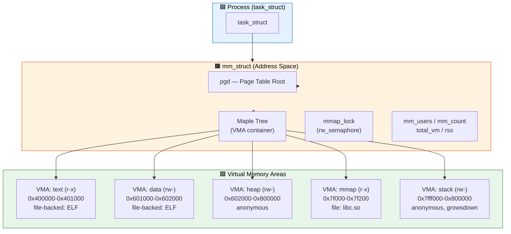
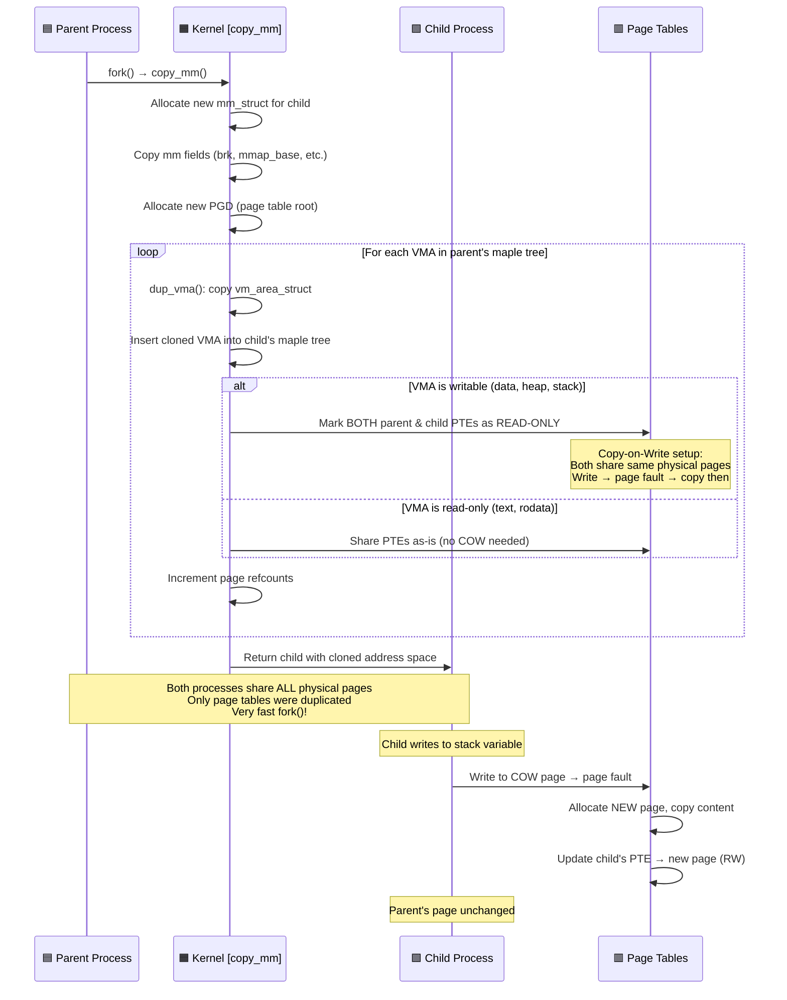

# Q10: Process Address Space — mm_struct, VMA, and the Maple Tree

## Interview Question
**"Explain the process address space management in the Linux kernel. Walk through mm_struct, vm_area_struct, and how the kernel manages a process's virtual memory regions. How did the transition from red-black tree to maple tree happen? How does fork() duplicate the address space?"**

---

## 1. Process Address Space Overview

Each process has its own **virtual address space** managed by `mm_struct`:

```
task_struct (process descriptor)
    │
    └─→ mm_struct (address space descriptor)
            │
            ├─→ pgd (page table root — PGD)
            │
            ├─→ Maple Tree of VMAs
            │   ├── VMA: [0x400000 - 0x401000] r-x  (text / code)
            │   ├── VMA: [0x601000 - 0x602000] rw-  (data)
            │   ├── VMA: [0x602000 - 0x623000] rw-  (heap / brk)
            │   ├── VMA: [0x7f1000 - 0x7f3000] r-x  (libc.so text)
            │   ├── VMA: [0x7f3000 - 0x7f4000] rw-  (libc.so data)
            │   ├── VMA: [0x7ff000 - 0x800000] rw-  (stack)
            │   └── ...
            │
            ├─→ mmap_lock (rw_semaphore protecting VMAs)
            │
            └─→ Memory counters (RSS, total_vm, etc.)
```

---

## 2. mm_struct — The Address Space Descriptor

```c
struct mm_struct {
    struct {
        /* VMA management */
        struct maple_tree mm_mt;     /* Maple tree of VMAs (since 6.1) */
        unsigned long mmap_base;     /* Base for mmap region */

        unsigned long task_size;     /* User-space size limit */
        pgd_t *pgd;                 /* Page Global Directory (page table root) */

        /* Reference counting */
        atomic_t mm_users;           /* Number of threads using this mm */
        atomic_t mm_count;           /* Reference count (users + kernel refs) */

        int map_count;               /* Number of VMAs */
        struct rw_semaphore mmap_lock; /* Protects VMA tree and page tables */

        /* Memory statistics */
        unsigned long total_vm;      /* Total pages mapped */
        unsigned long locked_vm;     /* mlock'd pages */
        unsigned long pinned_vm;     /* Pinned pages (RDMA, GPU) */
        unsigned long data_vm;       /* Data + stack pages */
        unsigned long exec_vm;       /* Executable pages */
        unsigned long stack_vm;      /* Stack pages */

        unsigned long start_code, end_code;    /* Text segment */
        unsigned long start_data, end_data;    /* Data segment */
        unsigned long start_brk, brk;          /* Heap (brk) */
        unsigned long start_stack;              /* Stack start */
        unsigned long arg_start, arg_end;       /* argv */
        unsigned long env_start, env_end;       /* envp */

        /* ... core dump, ABI, NUMA, etc. */
    };

    unsigned long flags;              /* MMF_* flags */
    /* ... cpumask, NUMA stats, uprobes, etc. */
};
```

### When Kernel Threads Share mm

```c
/* Kernel threads have no user-space address space */
current->mm = NULL;       /* No mm_struct */
current->active_mm = borrowed_mm;  /* Borrows previous process's mm
                                       for TLB efficiency */

/* This is why you can't access user-space memory from kernel threads:
   no mm → no user page tables → no user addresses */
```

---

## 3. vm_area_struct (VMA) — Memory Region Descriptor

```c
struct vm_area_struct {
    /* Address range */
    unsigned long vm_start;          /* First byte */
    unsigned long vm_end;            /* Last byte + 1 */

    /* Owning mm */
    struct mm_struct *vm_mm;

    /* Protection and flags */
    pgprot_t vm_page_prot;           /* PTEs protection bits */
    unsigned long vm_flags;          /* VM_READ, VM_WRITE, VM_EXEC, VM_SHARED, etc. */

    /* Callbacks for fault handling, mmap, etc. */
    const struct vm_operations_struct *vm_ops;

    /* File backing (NULL for anonymous) */
    unsigned long vm_pgoff;          /* Offset in file (in PAGE_SIZE units) */
    struct file *vm_file;            /* Backing file (or NULL) */

    /* Private data (used by drivers) */
    void *vm_private_data;

    /* RCU for lockless VMA lookup */
    /* Maple tree integration */
    /* ... */
};
```

### VMA Flags

```c
#define VM_READ         0x00000001   /* Readable */
#define VM_WRITE        0x00000002   /* Writable */
#define VM_EXEC         0x00000004   /* Executable */
#define VM_SHARED       0x00000008   /* Shared mapping (vs private/COW) */

#define VM_MAYREAD      0x00000010   /* Can mprotect to readable */
#define VM_MAYWRITE     0x00000020   /* Can mprotect to writable */
#define VM_MAYEXEC      0x00000040   /* Can mprotect to executable */
#define VM_MAYSHARE     0x00000080   /* Can mprotect to shared */

#define VM_GROWSDOWN    0x00000100   /* Stack grows down */
#define VM_GROWSUP      0x00000200   /* Stack grows up (on some archs) */

#define VM_DONTEXPAND   0x00000400   /* Cannot mremap to expand */
#define VM_DONTDUMP     0x04000000   /* Not in core dump */
#define VM_DONTCOPY     0x00020000   /* Don't copy on fork */

#define VM_IO           0x00004000   /* Memory-mapped I/O */
#define VM_PFNMAP       0x00000400   /* PFN-mapped (not struct page backed) */

#define VM_LOCKED       0x00002000   /* mlock'd */
#define VM_HUGETLB      0x00400000   /* Huge TLB page */
```

---

## 4. Maple Tree (Linux 6.1+)

### Evolution of VMA Storage

```
Linux ≤ 2.6: Linked list + AVL tree
Linux 2.6 → 6.0: Linked list + Red-Black tree
Linux 6.1+: Maple tree (no more linked list!)
```

### Why Maple Tree?

```
Red-Black tree issues:
  - Requires a separate linked list for sequential traversal → 2 data structures
  - Larger cache footprint (linked list + tree pointers per VMA)
  - Fine-grained locking is complex 

Maple tree advantages:
  - B-tree variant optimized for ranges (VMA address ranges)
  - No separate linked list needed
  - Better cache locality (multiple entries per node)
  - Supports RCU-safe reads → lockless VMA lookup (speculative page faults)
  - Single data structure for both search and iteration
```

### Maple Tree Structure

```
Maple tree node: Up to 16 entries per node (B-tree style)

         ┌─────────────────────────────────┐
         │ [key1|key2|key3|...|key15]      │ Internal node
         │ [ptr1|ptr2|ptr3|...|ptr16]      │
         └───────────────────────────┬─┬───┘
                                   ╱     ╲
              ┌──────────────────┐   ┌──────────────────┐
              │ Leaf: ← VMAs →   │   │ Leaf: ← VMAs →   │
              │ [vma1][vma2]     │   │ [vma3][vma4]     │
              └──────────────────┘   └──────────────────┘

Keys are address ranges → efficient range lookup
O(log N) lookup, insert, delete — like RB-tree
But much better cache behavior — fewer cache misses
```

### VMA Lookup API

```c
/* Find VMA containing addr or the next VMA after addr */
struct vm_area_struct *find_vma(struct mm_struct *mm, unsigned long addr);

/* Find VMA containing addr (exact match required) */
struct vm_area_struct *vma_lookup(struct mm_struct *mm, unsigned long addr);

/* Iterate all VMAs */
struct vm_area_struct *vma;
VMA_ITERATOR(vmi, mm, 0);  /* Initialize iterator starting at addr 0 */
for_each_vma(vmi, vma) {
    pr_info("VMA: %lx-%lx flags=%lx\n",
            vma->vm_start, vma->vm_end, vma->vm_flags);
}

/* Find VMA for address range intersection */
struct vm_area_struct *find_vma_intersection(struct mm_struct *mm,
                                              unsigned long start,
                                              unsigned long end);
```

---

## 5. mmap_lock — Protecting the Address Space

```c
/* mmap_lock is a rw_semaphore protecting:
   - The maple tree of VMAs
   - Page table modifications
   - RSS counters */

/* Read lock (concurrent reads OK) — used by page fault handler */
mmap_read_lock(mm);
vma = find_vma(mm, addr);
/* ... access VMA ... */
mmap_read_unlock(mm);

/* Write lock (exclusive) — used by mmap, munmap, mprotect */
mmap_write_lock(mm);
/* ... modify VMAs ... */
mmap_write_unlock(mm);

/* Try-lock variants (for non-blocking contexts) */
if (mmap_read_trylock(mm)) {
    /* Got the lock */
    mmap_read_unlock(mm);
}
```

### Per-VMA Locks (Linux 6.4+)

```
Problem: mmap_lock is a huge contention point
         Page faults on different VMAs still serialize

Solution: Per-VMA locks
  - Each VMA gets its own lock
  - Page fault handler tries VMA lock first (fast path)
  - Falls back to mmap_lock only if needed

Page fault fast path:
  1. RCU read → find VMA in maple tree (lockless)
  2. vma_start_read(vma) → lock just this VMA
  3. Handle page fault
  4. vma_end_read(vma)
  → Multiple faults on different VMAs run in parallel!
```

---

## 6. /proc/<pid>/maps — Reading the Address Space

```bash
$ cat /proc/self/maps
# address                perms offset  dev    inode   pathname
00400000-00401000         r--p 00000000 08:01 1234567 /usr/bin/cat
00401000-00413000         r-xp 00001000 08:01 1234567 /usr/bin/cat
00413000-00418000         r--p 00013000 08:01 1234567 /usr/bin/cat
00418000-00419000         r--p 00017000 08:01 1234567 /usr/bin/cat
00419000-0041a000         rw-p 00018000 08:01 1234567 /usr/bin/cat
0041a000-0043b000         rw-p 00000000 00:00 0       [heap]
7f1e00000000-7f1e00025000 rw-p 00000000 00:00 0       
7f1e40000000-7f1e40189000 r--p 00000000 08:01 2345678 /usr/lib/libc.so.6
7f1e40189000-7f1e402ff000 r-xp 00189000 08:01 2345678 /usr/lib/libc.so.6
7ffc12340000-7ffc12361000 rw-p 00000000 00:00 0       [stack]
7ffc123fe000-7ffc12402000 r--p 00000000 00:00 0       [vvar]
7ffc12402000-7ffc12404000 r-xp 00000000 00:00 0       [vdso]

# Columns: addr range, permissions (r/w/x, p=private s=shared),
#          file offset, device, inode, path
```

### /proc/<pid>/smaps — Detailed RSS

```bash
$ cat /proc/self/smaps
00400000-00401000 r--p 00000000 08:01 1234567 /usr/bin/cat
Size:                  4 kB     ← Virtual size
KernelPageSize:        4 kB
MMUPageSize:           4 kB
Rss:                   4 kB     ← Resident (in RAM)
Pss:                   4 kB     ← Proportional share (shared/num_sharers)
Shared_Clean:          4 kB
Shared_Dirty:          0 kB
Private_Clean:         0 kB
Private_Dirty:         0 kB
Referenced:            4 kB
Anonymous:             0 kB
LazyFree:              0 kB
AnonHugePages:         0 kB
Swap:                  0 kB
Locked:                0 kB
```

---

## 7. fork() and Address Space Duplication

### Copy-on-Write (COW) Fork

```c
/* fork() path: */
do_fork() / kernel_clone()
    → copy_mm()
        → dup_mm()
            → allocate new mm_struct
            → dup_mmap()
                → Iterate all parent VMAs
                → For each VMA:
                    1. Copy the VMA struct
                    2. copy_page_range() → copy page table entries
                    3. Mark both parent AND child PTEs as READ-ONLY
                    4. Physical pages are SHARED (refcount++)
            → copy pgd (allocate new page tables)
```

```
Before fork:
Parent mm:
  VMA[0x1000-0x2000] rw → PTE points to page frame 0xABC (writable)

After fork:
Parent mm:
  VMA[0x1000-0x2000] rw → PTE points to page frame 0xABC (READ-ONLY!)
Child mm:
  VMA[0x1000-0x2000] rw → PTE points to page frame 0xABC (READ-ONLY!)

Page 0xABC: _mapcount = 2, _refcount = 2

On write (either process):
  → Page fault (PTE is read-only but VMA says writable)
  → COW handler:
    1. Allocate new page
    2. Copy contents
    3. Update PTE to point to new page (writable)
    4. Decrement old page refcount
```

---

## 8. Key Operations on the Address Space

### brk() — Heap Management

```c
/* sys_brk expands/contracts the heap VMA */
SYSCALL_DEFINE1(brk, unsigned long, brk)
{
    /* Find the heap VMA (identified by mm->start_brk) */
    /* If brk > current brk: expand VMA (do_brk_flags) */
    /* If brk < current brk: shrink VMA (do_munmap) */
    /* Pages are NOT allocated until accessed (demand paging) */
}
```

### mmap() — Create New Mapping

```c
SYSCALL_DEFINE6(mmap, ...)
{
    /* get_unmapped_area: find free virtual address range */
    /* create VMA */
    /* if file-backed: call f_op->mmap (driver hook) */
    /* insert VMA into maple tree */
}
```

### mprotect() — Change Permissions

```c
SYSCALL_DEFINE3(mprotect, unsigned long, start, size_t, len, unsigned long, prot)
{
    /* Find VMA(s) covering [start, start+len) */
    /* May need to split VMAs at boundaries */
    /* Update vm_flags and vm_page_prot */
    /* Walk page tables, update PTE protection bits */
    /* Flush TLB for affected range */
}
```

### VMA Splitting and Merging

```
mprotect on partial VMA:

Before:
  [VMA: 0x1000-0x5000, rw-]

mprotect(0x2000, 0x1000, PROT_READ):

After:
  [VMA: 0x1000-0x2000, rw-]  ← original start
  [VMA: 0x2000-0x3000, r--]  ← modified middle
  [VMA: 0x3000-0x5000, rw-]  ← original end

Adjacent VMAs with identical properties are merged automatically.
```

---

## 9. Kernel Access to Process Address Space

```c
/* From driver/kernel code — accessing user memory safely */

/* Simple read/write */
get_user(val, user_ptr);           /* Read one value */
put_user(val, user_ptr);           /* Write one value */

/* Block copy */
copy_from_user(kernel_buf, user_buf, len);
copy_to_user(user_buf, kernel_buf, len);

/* Accessing another process's address space */
int access_process_vm(struct task_struct *tsk,
                      unsigned long addr,
                      void *buf, int len,
                      unsigned int gup_flags);

/* Pinning user pages for DMA */
long pin_user_pages(unsigned long start, unsigned long nr_pages,
                    unsigned int gup_flags,
                    struct page **pages);
```

---

## 10. Common Interview Follow-ups

**Q: What is the difference between mm_users and mm_count?**
`mm_users`: number of threads (task_structs) sharing this mm. When it drops to 0, the address space is torn down. `mm_count`: includes mm_users + kernel references (e.g., lazy TLB). When mm_count drops to 0, the mm_struct itself is freed.

**Q: How does execve() affect the address space?**
`execve()` → `exec_mmap()` → replaces the entire mm_struct. Old VMAs are removed, page tables freed. New VMAs are created for the ELF segments of the new program. PGD is replaced.

**Q: What is the vDSO?**
The vDSO (virtual Dynamic Shared Object) is a small shared library mapped by the kernel into every process's address space. It provides fast syscalls (like `gettimeofday`) that can run entirely in user space without a real syscall transition.

**Q: How do kernel threads access user memory?**
They can't directly — kernel threads have `current->mm = NULL`. They must use `kthread_use_mm()` / `kthread_unuse_mm()` to temporarily adopt a process's mm, or use `access_process_vm()`.

---

## 11. Key Source Files

| File | Purpose |
|------|---------|
| `include/linux/mm_types.h` | mm_struct, vm_area_struct |
| `mm/mmap.c` | mmap, munmap, VMA manipulation |
| `mm/memory.c` | Page table ops, copy_to_user internals |
| `kernel/fork.c` | copy_mm, dup_mmap |
| `lib/maple_tree.c` | Maple tree implementation |
| `include/linux/maple_tree.h` | Maple tree API |
| `fs/proc/task_mmu.c` | /proc/<pid>/maps, smaps |
| `mm/mprotect.c` | mprotect implementation |
| `mm/mremap.c` | mremap implementation |

---

## Mermaid Diagrams

### Process Address Space Architecture



### fork() Address Space Duplication Sequence


