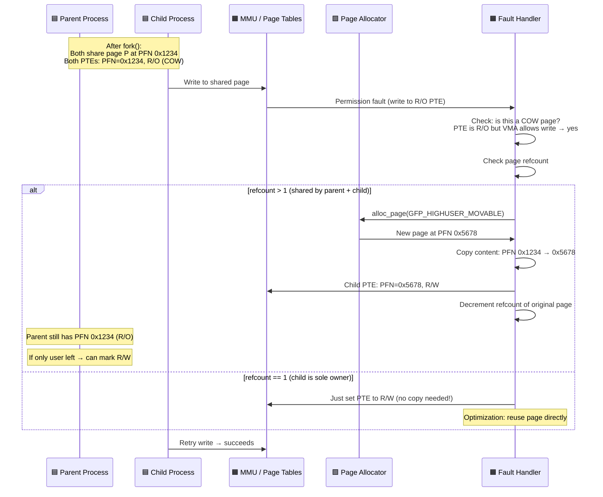

# Q12: Page Faults, Copy-on-Write, and Demand Paging

## Interview Question
**"Walk through the page fault handling mechanism in the Linux kernel. What are the different types of page faults? How does Copy-on-Write (COW) work? Explain demand paging and how it relates to memory overcommit. How does the kernel distinguish between a valid page fault and a segmentation fault?"**

---

## 1. What is a Page Fault?

A page fault is a CPU exception triggered when a process accesses a virtual address and the MMU cannot translate it. The kernel's page fault handler determines the action:

```
CPU accesses virtual address
        │
        ▼
   ┌─────────┐
   │   TLB   │──── Hit ──→  Physical address (no fault)
   │ Lookup  │
   └────┬────┘
        │ Miss
        ▼
   ┌──────────┐
   │ Page Walk│──── PTE Present ──→ Fill TLB, continue (soft miss)
   │          │
   └────┬─────┘
        │ PTE NOT present (or permission denied)
        ▼
   ┌──────────┐
   │PAGE FAULT│  ← CPU exception!
   │ Handler  │  → Kernel decides what to do
   └──────────┘
```

---

## 2. Page Fault Types

```
┌──────────────────────────────────────────────────────────────────┐
│                     Page Fault Types                              │
├──────────────┬───────────────────────────────────────────────────┤
│ Minor Fault  │ Page is in memory but PTE not set up              │
│              │ → Just create PTE mapping (no disk I/O)           │
│              │ Example: first access to anonymous page           │
├──────────────┼───────────────────────────────────────────────────┤
│ Major Fault  │ Page is NOT in memory — need disk I/O             │
│              │ → Read from file/swap → expensive!                │
│              │ Example: page was swapped out                     │
├──────────────┼───────────────────────────────────────────────────┤
│ COW Fault    │ Write to read-only page that should be writable   │
│              │ → Copy page, update PTE (after fork or mmap)      │
├──────────────┼───────────────────────────────────────────────────┤
│ Invalid Fault│ Access to unmapped address or permission violation │
│              │ → SIGSEGV (segfault) or kernel oops               │
└──────────────┴───────────────────────────────────────────────────┘
```

---

## 3. Page Fault Handler — Complete Walk-Through

### Architecture Entry Point

```c
/* x86_64: arch/x86/mm/fault.c */
DEFINE_IDTENTRY_RAW_ERRORCODE(exc_page_fault)
{
    unsigned long address = read_cr2();  /* Faulting address from CR2 */
    unsigned long error_code = regs->orig_ax;

    handle_page_fault(regs, error_code, address);
}

/* Error code bits (x86): */
/* Bit 0 (P):   0 = non-present page, 1 = protection violation */
/* Bit 1 (W/R): 0 = read access, 1 = write access */
/* Bit 2 (U/S): 0 = kernel mode, 1 = user mode */
/* Bit 3 (RSVD): reserved bit set in PTE */
/* Bit 4 (I/D): 1 = instruction fetch (NX violation) */
```

### Main Fault Handler Flow

```
handle_page_fault(address, error_code)
│
├── Kernel-space fault (address >= TASK_SIZE)?
│   └── Handle kernel fault:
│       ├── vmalloc fault? → Copy PGD entry from init_mm → fixed
│       ├── Spurious fault? → PTE now present → return
│       └── Bad fault → kernel oops / panic
│
└── User-space fault:
    │
    ├── 1. mmap_read_lock(mm) or try per-VMA lock
    │
    ├── 2. find_vma(mm, address)
    │   ├── VMA found and address is inside VMA → handle_mm_fault()
    │   ├── VMA not found → bad_area (SIGSEGV)
    │   ├── Address below VMA → check VM_GROWSDOWN (stack growth)
    │   │   ├── Stack can grow → expand_stack() → handle_mm_fault()
    │   │   └── Stack cannot grow → bad_area (SIGSEGV)
    │   └── Permission mismatch → bad_area_access_error (SIGSEGV)
    │
    ├── 3. handle_mm_fault(vma, address, flags)
    │   └── Walk page table levels, creating entries as needed
    │       └── handle_pte_fault()
    │
    └── 4. mmap_read_unlock(mm)
```

### handle_pte_fault — The Core Decision

```c
static vm_fault_t handle_pte_fault(struct vm_fault *vmf)
{
    pte_t entry = vmf->orig_pte;

    if (!pte_present(entry)) {
        /* PTE exists but page not present */

        if (pte_none(entry)) {
            /* PTE is completely empty — first access */
            if (vma_is_anonymous(vmf->vma))
                return do_anonymous_page(vmf);      /* NEW anonymous page */
            else
                return do_fault(vmf);                /* File-backed fault */
        }

        /* PTE has swap entry */
        return do_swap_page(vmf);                    /* Swap in page from disk */
    }

    /* PTE is present — permission fault */

    if (vmf->flags & FAULT_FLAG_WRITE) {
        if (!pte_write(entry)) {
            /* Write to read-only PTE where VMA allows write */
            return do_wp_page(vmf);                  /* COW! */
        }
        /* Set dirty bit */
        entry = pte_mkdirty(entry);
    }

    /* Set accessed bit */
    entry = pte_mkyoung(entry);
    /* Update PTE */

    return 0;
}
```

---

## 4. Demand Paging — Lazy Allocation

### How Demand Paging Works

```
User calls: malloc(1MB) / mmap(1MB, MAP_ANONYMOUS)

Step 1: Kernel creates VMA for 1MB range
        NO physical pages allocated!
        NO page table entries created!
        VMA just says "this range is valid"

                              Virtual Space:
                              ┌──────────────────┐
                              │ VMA: 0x1000-0x101000 │
                              │ (VMA exists, zero PTEs) │
                              └──────────────────┘

Step 2: User accesses first page (0x1000)
        → PAGE FAULT (PTE is empty)
        → do_anonymous_page():
          1. Allocate one physical page
          2. Zero it (for security!)
          3. Create PTE mapping

                              ┌──────────────────┐
                              │ [Page 0: MAPPED] │
                              │ [Page 1: empty  ] │ ← not yet accessed
                              │ [Page 2: empty  ] │
                              │ ...              │
                              └──────────────────┘

Step 3: User accesses page 5
        → Another PAGE FAULT → allocate and map page 5 only

Step 4: Pages 1,2,3,4 are NEVER allocated if never accessed!
```

### The Zero Page Optimization

```c
/* For READ faults on anonymous memory: */
static vm_fault_t do_anonymous_page(struct vm_fault *vmf)
{
    /* READ access to uninitialized anonymous page */
    if (!(vmf->flags & FAULT_FLAG_WRITE)) {
        /* Map the ZERO PAGE — a single shared read-only page of zeros */
        /* ALL processes share this ONE physical page for zero-reads */
        pte = mk_pte(ZERO_PAGE(vmf->address), vma->vm_page_prot);
        set_pte_at(mm, vmf->address, vmf->pte, pte);
        return 0;
        /* No page allocation at all! */
    }

    /* WRITE access — must allocate a real page */
    struct page *page = alloc_zeroed_user_highpage(vma, vmf->address);
    /* ... map it writable ... */
}
```

---

## 5. Copy-on-Write (COW)

### After fork()

```
Parent Process (PID 100):              Child Process (PID 101):
┌──────────────────────┐              ┌──────────────────────┐
│ VMA [0x1000] rw-     │              │ VMA [0x1000] rw-     │
│ PTE → page A (R/O!)  │              │ PTE → page A (R/O!)  │
└──────────┬───────────┘              └──────────┬───────────┘
           │                                      │
           └──────────────┬───────────────────────┘
                          │
                    ┌─────▼─────┐
                    │  Page A    │  _mapcount=2, _refcount=2
                    │  (physical)│
                    └───────────┘

Both PTEs are READ-ONLY even though VMA says read-write!
This sets up the COW trap.
```

### COW Write Fault

```c
/* When parent or child writes to the page: */
static vm_fault_t do_wp_page(struct vm_fault *vmf)
{
    struct page *old_page = vmf->page;

    /* Is this page shared? */
    if (page_count(old_page) > 1) {
        /* YES — must copy */

        /* 1. Allocate new page */
        struct page *new_page = alloc_page(GFP_HIGHUSER_MOVABLE);

        /* 2. Copy entire 4KB page */
        copy_user_highpage(new_page, old_page, vmf->address, vma);

        /* 3. Update PTE to point to new page (writable) */
        entry = mk_pte(new_page, vma->vm_page_prot);
        entry = pte_mkwrite(pte_mkdirty(entry));
        set_pte_at(mm, vmf->address, vmf->pte, entry);

        /* 4. Decrement old page refcount */
        put_page(old_page);

        return VM_FAULT_WRITE;
    }

    /* Page is not shared — just make it writable (reuse) */
    entry = pte_mkwrite(pte_mkdirty(vmf->orig_pte));
    set_pte_at(mm, vmf->address, vmf->pte, entry);
    return VM_FAULT_WRITE;
}
```

```
After COW (child wrote to page):

Parent:                                Child:
┌──────────────────────┐              ┌──────────────────────┐
│ PTE → page A (R/O)   │              │ PTE → page B (R/W)   │
└──────────┬───────────┘              └──────────┬───────────┘
           │                                      │
     ┌─────▼─────┐                         ┌─────▼─────┐
     │  Page A    │ _mapcount=1             │  Page B    │ _mapcount=1
     │  (original)│                         │  (COPY)    │
     └───────────┘                         └───────────┘
```

### COW for Private File Mappings

```c
/* mmap with MAP_PRIVATE (e.g., shared libraries): */
fd = open("/usr/lib/libc.so.6", O_RDONLY);
addr = mmap(NULL, size, PROT_READ | PROT_WRITE, MAP_PRIVATE, fd, 0);

/* Pages are initially mapped read-only from page cache */
/* On write:
   1. COW fault
   2. Copy page from file-backed page cache to anonymous page
   3. New page is process-private
   4. Changes are NOT written back to the file */
```

---

## 6. File-Backed Page Faults

```c
static vm_fault_t do_fault(struct vm_fault *vmf)
{
    if (!(vmf->flags & FAULT_FLAG_WRITE))
        return do_read_fault(vmf);      /* Read from file */
    if (!(vmf->vma->vm_flags & VM_SHARED))
        return do_cow_fault(vmf);       /* Private write → COW */
    return do_shared_fault(vmf);        /* Shared write */
}

static vm_fault_t do_read_fault(struct vm_fault *vmf)
{
    /* 1. Call vma->vm_ops->fault() to get the page */
    /*    For regular files: filemap_fault() */
    /*    → Check page cache */
    /*    → If not cached: read from disk (MAJOR fault) */
    /*    → If cached: just map it (minor fault) */

    /* 2. Create PTE mapping (read-only for private, r/w for shared) */

    /* 3. Also pre-map nearby pages (readahead) */
    do_fault_around(vmf);  /* map_pages callback */
}
```

### Page Cache Integration

```
Page fault on file offset 0x5000:

1. Check page cache: find_get_page(mapping, index=5)
   ├── Found in cache → Minor fault (fast, ~1μs)
   └── Not in cache → Major fault:
       ├── Allocate page
       ├── Submit I/O: read_folio(file, page)
       ├── Wait for I/O completion (~5-15ms for HDD, ~100μs for SSD)
       ├── Add to page cache
       └── Map into process page tables
```

---

## 7. Swap Page Faults

```c
static vm_fault_t do_swap_page(struct vm_fault *vmf)
{
    swp_entry_t entry = pte_to_swp_entry(vmf->orig_pte);
    struct page *page;

    /* 1. Look up in swap cache */
    page = lookup_swap_cache(entry, ...);

    if (!page) {
        /* 2. Not in swap cache — read from swap device */
        page = swapin_readahead(entry, ...);  /* Major fault! */
        /* This reads the page from swap partition/file */
    }

    /* 3. Map the page back into the process */
    pte = mk_pte(page, vma->vm_page_prot);
    if (vmf->flags & FAULT_FLAG_WRITE)
        pte = pte_mkwrite(pte_mkdirty(pte));

    set_pte_at(mm, vmf->address, vmf->pte, pte);

    /* 4. Free the swap slot */
    swap_free(entry);

    return VM_FAULT_MAJOR;
}
```

---

## 8. Stack Growth

```
Stack VMA: [0x7fff00000000 - 0x7fff00100000] rw-p  VM_GROWSDOWN
           Stack grows downward ↓

Access to 0x7ffeffffff0 (below VMA start):
  → find_vma finds the stack VMA
  → Address is BELOW vm_start
  → Check VM_GROWSDOWN flag → YES
  → expand_stack():
    1. Check stack rlimit (RLIMIT_STACK, default 8MB)
    2. Extend vm_start downward
    3. Allocate page table entries
    4. Page fault handled normally (demand paging)
  → Stack VMA now: [0x7ffefff00000 - 0x7fff00100000]
```

---

## 9. Segmentation Fault Conditions

```
Legitimate page fault → kernel handles → process continues
Invalid access → kernel sends SIGSEGV → process crashed (segfault)

When does SIGSEGV happen?

1. Address is not in ANY VMA:
   find_vma(mm, addr) returns NULL or addr < vma->vm_start
   (and not a stack growth case)

2. Permission violation:
   - Write to VMA without VM_WRITE
   - Execute from VMA without VM_EXEC
   - User access to kernel address (addr >= TASK_SIZE)

3. Stack overflow:
   - Stack growth would exceed RLIMIT_STACK
   - Stack would collide with another VMA

4. Protection key violation (x86 MPK):
   - Access violates memory protection key settings
```

---

## 10. userfaultfd — User-Space Page Fault Handling

```c
/* userfaultfd allows a user-space handler to control page faults */
/* Used for: live migration, record-replay, custom memory management */

int uffd = syscall(__NR_userfaultfd, O_CLOEXEC | O_NONBLOCK);

/* Register memory range for userfaultfd handling */
struct uffdio_register reg = {
    .range = { .start = addr, .len = size },
    .mode = UFFDIO_REGISTER_MODE_MISSING,  /* Handle missing pages */
};
ioctl(uffd, UFFDIO_REGISTER, &reg);

/* Fault handling thread: */
while (1) {
    struct uffd_msg msg;
    read(uffd, &msg, sizeof(msg));  /* Blocks until page fault */

    /* Resolve the fault by providing a page */
    struct uffdio_copy copy = {
        .dst = msg.arg.pagefault.address,
        .src = (unsigned long)my_page_data,
        .len = PAGE_SIZE,
    };
    ioctl(uffd, UFFDIO_COPY, &copy);  /* Wakes faulting thread */
}
```

---

## 11. Page Fault Performance Counters

```bash
# Per-process fault counts
cat /proc/<pid>/stat | awk '{print "minor:", $10, "major:", $12}'

# System-wide
cat /proc/vmstat | grep pgfault
pgfault 12345678        # Total page faults
pgmajfault 5678         # Major faults (I/O needed)

# perf — detailed fault profiling
perf stat -e page-faults,major-faults,minor-faults ./my_program
```

---

## 12. Common Interview Follow-ups

**Q: What is a "spurious" page fault?**
On SMP, between the time CPU faults and the kernel checks the PTE, another CPU might have already fixed the PTE (e.g., during TLB shootdown). The kernel re-checks and finds the PTE is now valid → just return.

**Q: How does fork + exec optimize COW?**
`fork()` sets up COW for all pages. If `exec()` is called immediately (common in shell), the child replaces its entire address space. COW pages are never written, so NO copies made. This is why `fork` + `exec` is efficient despite copying the whole address space.

**Q: What is the Dirty COW vulnerability (CVE-2016-5753)?**
A race condition in the COW path: a thread could `mmap` a file read-only, then race the COW handler with `madvise(MADV_DONTNEED)` to write to the original file-backed page instead of a COW copy, bypassing file permissions.

**Q: Can a driver cause page faults?**
Yes — if a driver dereferences a user-space pointer directly (without `copy_from_user`), it will page-fault. On systems with SMAP (x86) or PAN (ARM), this causes a kernel oops because kernel code can't access user addresses directly. This is a bug.

---

## 13. Key Source Files

| File | Purpose |
|------|---------|
| `mm/memory.c` | Core page fault handler, COW, demand paging |
| `arch/x86/mm/fault.c` | x86 page fault entry point |
| `arch/arm64/mm/fault.c` | ARM64 page fault entry point |
| `mm/filemap.c` | File-backed page fault (filemap_fault) |
| `mm/swap_state.c` | Swap page fault |
| `mm/swapfile.c` | Swap device management |
| `mm/mmap.c` | VMA management, stack growth |
| `mm/userfaultfd.c` | userfaultfd implementation |
| `include/linux/mm.h` | vm_fault, fault flags |

---

## Mermaid Diagrams

### Page Fault Handler Decision Flow

```mermaid
flowchart TB
    subgraph Entry["🟥 Page Fault Triggered"]
        PF["CPU exception: #PF\nerror_code + fault_addr"]
    end

    PF --> Q1{"Fault in\nkernel space?"}

    Q1 -->|"Yes"| Q2{"In vmalloc range?\n(fixup needed)"}
    Q2 -->|"Yes"| VMFIX["Sync vmalloc PTE\nfrom init_mm"]
    Q2 -->|"No"| OOPS["Kernel Oops!\n(bug in kernel code)"]

    Q1 -->|"No (user space)"| Q3{"Find VMA for\nfault address"}
    Q3 -->|"No VMA found"| SIGSEGV["SIGSEGV\n(invalid address)"]
    Q3 -->|"VMA found"| Q4{"Permission\ncheck ok?"}
    Q4 -->|"No (write to R/O\nnon-COW)"| SIGSEGV

    Q4 -->|"Yes"| Q5{"PTE present?"}

    Q5 -->|"Present\n(permission fault)"| COW["🟧 Copy-on-Write\nAllocate new page\nCopy + remap RW"]

    Q5 -->|"Not present"| Q6{"PTE value?"}

    Q6 -->|"Zero\n(never accessed)"| DEMAND["🟩 Demand Paging\nAllocate zeroed page\nSet PTE present"]
    Q6 -->|"Swap entry"| SWAPIN["🟧 Swap-In\nRead from swap\nSet PTE present"]
    Q6 -->|"File mapping"| FILEIN["🟩 File Fault\nRead page from disk\n(filemap_fault)"]

    style Entry fill:#ffebee,stroke:#c62828,color:#000
    style COW fill:#fff3e0,stroke:#e65100,color:#000
    style DEMAND fill:#e8f5e9,stroke:#2e7d32,color:#000
    style SWAPIN fill:#fff3e0,stroke:#e65100,color:#000
    style FILEIN fill:#e8f5e9,stroke:#2e7d32,color:#000
    style SIGSEGV fill:#ffebee,stroke:#c62828,color:#000
```



### Copy-on-Write Sequence


