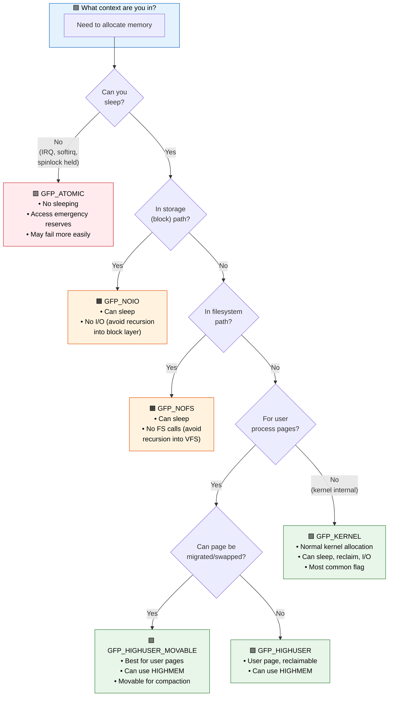
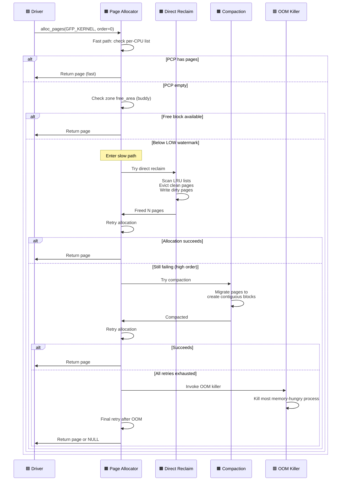

# Q13: GFP Flags and Allocation Contexts in Linux Kernel

## Interview Question
**"Explain the GFP flag system in Linux kernel memory allocation. What are the differences between GFP_KERNEL, GFP_ATOMIC, GFP_DMA, and other flags? How does the allocation context (process, interrupt, softirq) determine which flags you can use? What happens when you use the wrong GFP flags?"**

---

## 1. What are GFP Flags?

**GFP** stands for **Get Free Pages**. GFP flags tell the memory allocator:
1. **Where** to allocate from (which memory zones)
2. **How** to allocate (can we sleep? reclaim? retry? OOM-kill?)
3. **What** modifiers to apply (zero memory? account to cgroup?)

```c
void *ptr = kmalloc(size, GFP_KERNEL);
                           ↑
                    GFP flags control behavior
```

---

## 2. GFP Flag Architecture

### Layered Flag Structure

```c
/* GFP flags are composed of three layers: */

/* Layer 1: Zone modifiers — WHERE to allocate */
#define __GFP_DMA        (1 << 0)   /* Zone DMA (0-16MB on x86) */
#define __GFP_HIGHMEM    (1 << 1)   /* Zone HIGHMEM (>896MB on 32-bit) */
#define __GFP_DMA32      (1 << 2)   /* Zone DMA32 (0-4GB on 64-bit) */
#define __GFP_MOVABLE    (1 << 3)   /* Movable migration type */

/* Layer 2: Action modifiers — HOW to allocate */
#define __GFP_RECLAIMABLE (1 << 4)  /* Reclaimable migration type */
#define __GFP_HIGH        (1 << 5)  /* High priority — use emergency reserves */
#define __GFP_IO          (1 << 6)  /* Can start I/O (for writeback) */
#define __GFP_FS          (1 << 7)  /* Can call filesystem code */
#define __GFP_ZERO        (1 << 8)  /* Zero the allocation */
#define __GFP_DIRECT_RECLAIM (1 << 9)  /* Can directly reclaim pages */
#define __GFP_KSWAPD_RECLAIM (1 << 10) /* Can wake kswapd */
#define __GFP_NOWARN      (1 << 11) /* Don't print allocation failure warning */
#define __GFP_RETRY_MAYFAIL (1 << 12) /* Retry but may fail */
#define __GFP_NOFAIL      (1 << 13) /* NEVER fail (infinite retry) */
#define __GFP_NORETRY     (1 << 14) /* Don't retry, fail fast */
#define __GFP_COMP        (1 << 15) /* Create compound page */
#define __GFP_NOMEMALLOC  (1 << 16) /* Don't use emergency reserves */
#define __GFP_HARDWALL    (1 << 17) /* Respect cpuset memory policy */
#define __GFP_ACCOUNT     (1 << 18) /* Account to kmemcg */

/* Layer 3: Composite flags — pre-built combinations */
#define __GFP_RECLAIM  (__GFP_DIRECT_RECLAIM | __GFP_KSWAPD_RECLAIM)
```

---

## 3. Common GFP Flag Combinations

### The Big Three

```c
/* GFP_KERNEL — default for process context */
#define GFP_KERNEL  (__GFP_RECLAIM | __GFP_IO | __GFP_FS)
/*
  ✓ Can sleep (wait for memory)
  ✓ Can reclaim memory (shrink caches, swap out)
  ✓ Can start disk I/O (write dirty pages)
  ✓ Can call filesystem (for writeback)
  ✓ Can trigger OOM killer
  ✗ CANNOT use in interrupt or atomic context!
*/

/* GFP_ATOMIC — for interrupt context / holding spinlocks */
#define GFP_ATOMIC  (__GFP_HIGH | __GFP_KSWAPD_RECLAIM)
/*
  ✗ CANNOT sleep
  ✗ CANNOT do direct reclaim
  ✓ Can use emergency memory reserves (__GFP_HIGH)
  ✓ Can wake kswapd (asynchronous)
  → Higher failure rate than GFP_KERNEL
  → Use only when you truly cannot sleep
*/

/* GFP_NOIO — for I/O subsystem code */
#define GFP_NOIO   (__GFP_RECLAIM)
/*
  ✓ Can sleep
  ✓ Can reclaim (but not via I/O)
  ✗ CANNOT start I/O (would deadlock if called from I/O path)
  ✗ CANNOT call filesystem
  → Use in block I/O code paths
*/
```

### Other Important Combinations

```c
/* GFP_NOFS — for filesystem code */
#define GFP_NOFS   (__GFP_RECLAIM | __GFP_IO)
/*
  ✓ Can sleep
  ✓ Can do I/O (but not filesystem calls)
  ✗ CANNOT call filesystem (would deadlock if in FS path)
  → Use in filesystem implementations
*/

/* GFP_USER — for user-space pages */
#define GFP_USER   (GFP_KERNEL | __GFP_HARDWALL | __GFP_MOVABLE)
/*
  Like GFP_KERNEL but:
  ✓ Respects cpuset constraints
  ✓ Movable migration type (can be compacted/migrated)
  → For pages visible to user space
*/

/* GFP_HIGHUSER_MOVABLE — for general user pages */
#define GFP_HIGHUSER_MOVABLE  (GFP_USER | __GFP_HIGHMEM)
/*
  ✓ Can use highmem (32-bit)
  ✓ Movable
  → Default for user-space anonymous pages
*/

/* GFP_DMA — for ISA DMA devices */
#define GFP_DMA    (__GFP_DMA)
/*
  Allocate from ZONE_DMA (0-16MB on x86)
  Usually combined: GFP_KERNEL | GFP_DMA
*/

/* GFP_DMA32 — for 32-bit DMA devices */
#define GFP_DMA32  (__GFP_DMA32)
/*
  Allocate from ZONE_DMA32 (0-4GB on x86_64)
  Usually combined: GFP_KERNEL | GFP_DMA32
*/

/* GFP_TRANSHUGE — for transparent huge pages */
#define GFP_TRANSHUGE  (GFP_HIGHUSER_MOVABLE | __GFP_COMP | __GFP_NOMEMALLOC | \
                        __GFP_NORETRY | __GFP_NOWARN)
/*
  ✓ User-space, movable, compound
  ✗ Don't retry hard (it's OK to fail — fallback to 4KB)
  ✗ Don't use emergency reserves
*/
```

---

## 4. Context-Based Flag Selection

```
┌──────────────────────┬────────────────────────────────────────┐
│ Context              │ Allowed GFP Flags                      │
├──────────────────────┼────────────────────────────────────────┤
│ Process context      │ GFP_KERNEL (or GFP_USER, GFP_NOIO...) │
│ (syscall, workqueue) │ ✓ Can sleep                            │
├──────────────────────┼────────────────────────────────────────┤
│ Softirq / Tasklet    │ GFP_ATOMIC                             │
│                      │ ✗ Cannot sleep                          │
├──────────────────────┼────────────────────────────────────────┤
│ Hardware IRQ         │ GFP_ATOMIC                             │
│ (interrupt handler)  │ ✗ Cannot sleep                          │
├──────────────────────┼────────────────────────────────────────┤
│ Holding spinlock     │ GFP_ATOMIC                             │
│                      │ ✗ Cannot sleep (would deadlock)         │
├──────────────────────┼────────────────────────────────────────┤
│ Block I/O path       │ GFP_NOIO                               │
│                      │ ✗ Cannot start I/O (deadlock)           │
├──────────────────────┼────────────────────────────────────────┤
│ Filesystem path      │ GFP_NOFS                               │
│                      │ ✗ Cannot call FS (deadlock)             │
├──────────────────────┼────────────────────────────────────────┤
│ Memory reclaim path  │ GFP_ATOMIC or custom                   │
│ (shrinker callback)  │ ✗ Cannot reclaim (infinite recursion)   │
└──────────────────────┴────────────────────────────────────────┘
```

---

## 5. What Happens With Wrong GFP Flags

### Bug: GFP_KERNEL in Interrupt Context

```c
/* In interrupt handler: */
irqreturn_t my_irq_handler(int irq, void *dev_id)
{
    void *buf = kmalloc(256, GFP_KERNEL);  /* ← BUG! */
    /* GFP_KERNEL may sleep (direct reclaim)
       → sleeping in interrupt → kernel WARNING:
       "BUG: sleeping function called from invalid context" */

    /* CORRECT: */
    void *buf = kmalloc(256, GFP_ATOMIC);
}
```

### Bug: GFP_KERNEL While Holding Spinlock

```c
spin_lock(&my_lock);
void *p = kmalloc(100, GFP_KERNEL);  /* ← BUG! */
/* If kmalloc sleeps → scheduler runs → another CPU takes spinlock
   → DEADLOCK! */

/* Lock dependency checker (lockdep) will catch this */

/* CORRECT: */
spin_lock(&my_lock);
void *p = kmalloc(100, GFP_ATOMIC);  /* Won't sleep */
spin_unlock(&my_lock);

/* BETTER: Allocate before taking the lock */
void *p = kmalloc(100, GFP_KERNEL);
spin_lock(&my_lock);
/* use p */
spin_unlock(&my_lock);
```

---

## 6. Retry and Failure Behavior

```c
/* __GFP_NORETRY — Fail quickly */
ptr = kmalloc(size, GFP_KERNEL | __GFP_NORETRY | __GFP_NOWARN);
/*
  Try once with reclaim
  If fails → return NULL immediately
  Don't invoke OOM killer
  Good for: optional allocations with fallback
*/

/* __GFP_RETRY_MAYFAIL — Try harder but may fail */
ptr = kmalloc(size, GFP_KERNEL | __GFP_RETRY_MAYFAIL);
/*
  Retry with reclaim and compaction
  May fail for high-order allocations
  Don't invoke OOM killer
  Good for: allocations where failure is handled gracefully
*/

/* __GFP_NOFAIL — Never fail (dangerous!) */
ptr = kmalloc(size, GFP_KERNEL | __GFP_NOFAIL);
/*
  INFINITE retry
  Will loop forever until memory is available
  May invoke OOM killer
  Can cause livelock!
  Good for: NOTHING in drivers! Kernel-internal only.
  Use only for tiny allocations where failure would be worse
*/
```

### Decision Tree for Driver Developers

```
Can you sleep?
├── NO → GFP_ATOMIC
│        (check return value — may fail!)
│
└── YES
    ├── In block I/O path? → GFP_NOIO
    ├── In filesystem path? → GFP_NOFS
    └── Normal process context? → GFP_KERNEL
        │
        Is failure acceptable?
        ├── YES → GFP_KERNEL | __GFP_NORETRY | __GFP_NOWARN
        │         (for optional/fallback allocations)
        │
        ├── MAYBE → GFP_KERNEL | __GFP_RETRY_MAYFAIL
        │           (try hard but don't deadlock)
        │
        └── NO → GFP_KERNEL
                  (standard behavior, may OOM-kill)
                  (NEVER use __GFP_NOFAIL in drivers!)
```

---

## 7. Memalloc Scope APIs (Modern Approach)

Since Linux 5.0+, instead of manually juggling __GFP_IO and __GFP_FS:

```c
/* Block I/O path — prevent I/O recursion */
unsigned int flags = memalloc_noio_save();
/* All allocations in this scope are automatically GFP_NOIO */
ptr = kmalloc(size, GFP_KERNEL);  /* Actually GFP_NOIO! */
memalloc_noio_restore(flags);

/* Filesystem path — prevent FS recursion */
unsigned int flags = memalloc_nofs_save();
/* All allocations in this scope are automatically GFP_NOFS */
ptr = kmalloc(size, GFP_KERNEL);  /* Actually GFP_NOFS! */
memalloc_nofs_restore(flags);

/* This is cleaner because:
   - Called functions don't need to know they're in I/O/FS context
   - Prevents bugs where a called function uses wrong GFP */
```

---

## 8. GFP Flags in Driver Examples

### Network Driver (Mixed Contexts)

```c
/* Probe (process context) */
static int my_probe(struct pci_dev *pdev, ...)
{
    /* GFP_KERNEL — can sleep, no restrictions */
    dev->ring = dma_alloc_coherent(dev, size, &dma, GFP_KERNEL);
    dev->priv = kzalloc(sizeof(*dev->priv), GFP_KERNEL);
}

/* NAPI poll (softirq context) */
static int my_poll(struct napi_struct *napi, int budget)
{
    /* GFP_ATOMIC — in softirq, cannot sleep */
    struct sk_buff *skb = netdev_alloc_skb(dev, len);  /* uses GFP_ATOMIC */
}

/* TX path (may hold spinlock) */
static netdev_tx_t my_xmit(struct sk_buff *skb, struct net_device *dev)
{
    /* Called with netif_tx_lock held on some paths */
    /* Cannot sleep! */
}

/* Timer callback (softirq) */
static void my_timer(struct timer_list *t)
{
    /* GFP_ATOMIC only */
    buf = kmalloc(64, GFP_ATOMIC);
}
```

### Block Driver

```c
/* Request handling (block I/O context) */
static blk_status_t my_queue_rq(struct blk_mq_hw_ctx *hctx,
                                 const struct blk_mq_queue_data *bd)
{
    /* GFP_NOIO — in block I/O path, I/O recursion risk */
    cmd = kmalloc(sizeof(*cmd), GFP_NOIO);
}
```

---

## 9. Checking GFP Context at Runtime

```c
/* The kernel checks allocation context automatically: */

/* In kmalloc → __alloc_pages: */
if (WARN_ON_ONCE((gfp_flags & __GFP_DIRECT_RECLAIM) && !preemptible()))
    /* WARNING: trying to sleep in atomic context! */

/* CONFIG_DEBUG_ATOMIC_SLEEP catches: */
/* "BUG: sleeping function called from invalid context at mm/page_alloc.c:XXX"
   "in_atomic(): 1, irqs_disabled(): 0, non_block: 0, pid: 1234"
   Call trace showing where the bad allocation happened */
```

---

## 10. Common Interview Follow-ups

**Q: What's the difference between GFP_KERNEL and GFP_USER?**
`GFP_USER` adds `__GFP_HARDWALL` (respect cpuset) and `__GFP_MOVABLE` (pages can be migrated/compacted). Use `GFP_USER` for pages that will be mapped into user-space address space.

**Q: What does __GFP_ZERO do with SLUB?**
SLUB allocates from its freelist (pre-sized object). `__GFP_ZERO` tells it to `memset(obj, 0, size)` after allocation. Use `kzalloc()` instead of `kmalloc() + __GFP_ZERO`.

**Q: Can GFP_ATOMIC allocations fail?**
Yes! GFP_ATOMIC uses emergency reserves but won't reclaim or wait. In heavy memory pressure, it fails. Always check the return value.

**Q: What happens if I use GFP_KERNEL in a work queue?**
It's fine! Work queues run in process context (kernel thread). They can sleep. `GFP_KERNEL` is correct.

**Q: How does the DMA subsystem interact with GFP flags?**
`dma_alloc_coherent(dev, size, &handle, GFP_KERNEL)` — the DMA layer internally adds zone restrictions based on the device's DMA mask. If the device is 32-bit DMA, it adds `__GFP_DMA32`.

---

## 11. Key Source Files

| File | Purpose |
|------|---------|
| `include/linux/gfp_types.h` | GFP flag definitions |
| `include/linux/gfp.h` | GFP helper functions |
| `mm/page_alloc.c` | Allocation logic based on GFP flags |
| `mm/vmscan.c` | Reclaim based on GFP flags |
| `mm/internal.h` | gfp_to_alloc_flags conversion |
| `include/linux/sched/mm.h` | memalloc_noio_save, memalloc_nofs_save |

---

## Mermaid Diagrams

### GFP Flag Selection Decision Flow



### GFP_KERNEL Allocation Retry Sequence


