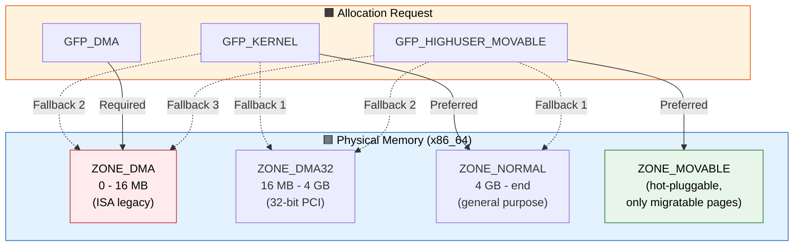
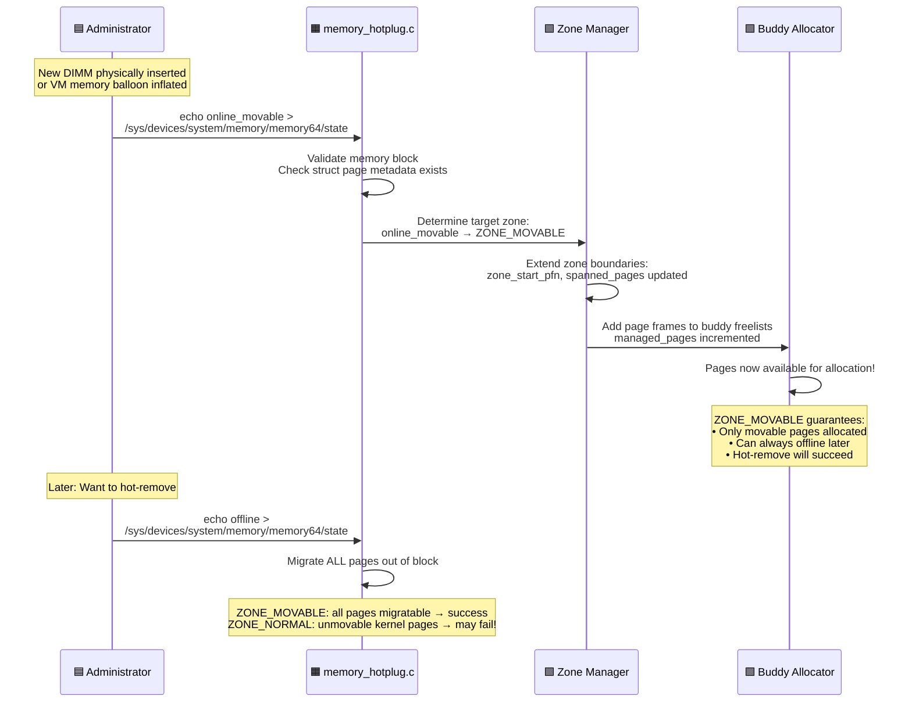

# Q14: Memory Zones — DMA, DMA32, Normal, HighMem, Movable

## Interview Question
**"Explain the memory zone architecture in the Linux kernel. Why do zones like ZONE_DMA, ZONE_DMA32, ZONE_NORMAL, and ZONE_HIGHMEM exist? How does the allocator choose which zone to use? What is ZONE_MOVABLE and how does it relate to memory hot-plug?"**

---

## 1. Why Memory Zones Exist

Physical memory isn't all the same — hardware constraints create regions with different properties:

```
Physical Address Space (x86_64):
0x00000000 ┌──────────────────────┐
           │  ZONE_DMA            │  0 - 16 MB
           │  ISA DMA devices     │  (legacy 24-bit DMA)
0x01000000 ├──────────────────────┤
           │  ZONE_DMA32          │  16 MB - 4 GB
           │  32-bit DMA devices  │  (PCI devices with 32-bit addr)
0x100000000├──────────────────────┤
           │  ZONE_NORMAL         │  4 GB - end of RAM
           │  General purpose     │  (most allocations come from here)
           │                      │
           │                      │
0xNNNNNNNNN└──────────────────────┘  End of physical RAM

On 32-bit (x86):
0x00000000 ┌──────────────────────┐
           │  ZONE_DMA            │  0 - 16 MB
0x01000000 ├──────────────────────┤
           │  ZONE_NORMAL         │  16 MB - 896 MB
           │  (direct mapped)     │
0x38000000 ├──────────────────────┤
           │  ZONE_HIGHMEM        │  896 MB - end of RAM
           │  (NOT directly mapped│   Need kmap() to access
           │   in kernel space)   │
           │                      │
0xNNNNNNNN └──────────────────────┘
```

---

## 2. Zone Details

### ZONE_DMA (0 - 16MB)

```
Purpose: For ancient ISA DMA controllers with 24-bit (16MB) address limit

History:
  - ISA bus DMA could only address lower 16MB
  - Sound cards, floppy controllers, old network cards
  - Still exists for compatibility

Usage:
  kmalloc(size, GFP_KERNEL | GFP_DMA);
  alloc_pages(GFP_DMA, order);

Availability:
  - x86/x86_64: 0-16MB
  - ARM: Depends on platform (often not present)
  - Can be disabled: CONFIG_ZONE_DMA=n
```

### ZONE_DMA32 (16MB - 4GB)

```
Purpose: For PCI/PCIe devices with 32-bit DMA address limitation

History:
  - Many older PCI devices only have 32-bit DMA addresses
  - On 64-bit systems, RAM above 4GB is unreachable by these devices
  - ZONE_DMA32 ensures memory below 4GB for these devices

Usage:
  kmalloc(size, GFP_KERNEL | __GFP_DMA32);
  dma_alloc_coherent() adds __GFP_DMA32 based on device DMA mask

On 32-bit systems: ZONE_DMA32 does NOT exist (all memory is below 4GB)
```

### ZONE_NORMAL (Most RAM)

```
On 32-bit:   16MB → 896MB (limited by direct mapping space)
On 64-bit:   4GB → end of RAM

Purpose: General-purpose allocations
  - kmalloc
  - Page cache
  - User process pages (if not DMA-constrained)

Properties:
  - Directly mapped into kernel virtual space
  - No special restrictions
  - Preferred zone for most allocations
```

### ZONE_HIGHMEM (32-bit only, > 896MB)

```
Problem on 32-bit:
  Kernel address space: 0xC0000000 - 0xFFFFFFFF (1GB)
  Direct mapping range: 0xC0000000 - 0xF8000000 (896MB)
  Other kernel regions (vmalloc, fixmap, etc.) take remaining space

  If RAM > 896MB → extra RAM is in ZONE_HIGHMEM
  These pages have NO permanent kernel virtual address!

Accessing highmem pages:
  struct page *page = alloc_pages(GFP_HIGHUSER, 0);
  void *addr = kmap(page);         /* Temporarily map into kernel */
  /* Use addr */
  kunmap(page);                     /* Unmap */

  /* Or atomic (doesn't sleep, per-CPU fixmaps): */
  void *addr = kmap_atomic(page);   /* Deprecated → kmap_local_page() */
  /* Use addr */
  kunmap_atomic(addr);

  /* Modern API: */
  void *addr = kmap_local_page(page);
  kunmap_local(addr);

On 64-bit: ZONE_HIGHMEM does NOT exist (all RAM directly mapped)
```

### ZONE_MOVABLE

```
Purpose: Contains only MOVABLE pages that can be migrated

Created by:
  - Boot parameter: kernelcore=X (first X bytes are non-movable, rest is MOVABLE)
  - Boot parameter: movablecore=Y (last Y bytes are MOVABLE)
  - Memory hotplug onlining: online_movable

Properties:
  - Only MIGRATE_MOVABLE allocations allowed
  - Pages can always be migrated → perfect for hot-unplug
  - Improves compaction success (guaranteed contiguous free blocks possible)
  - Used by CMA overlay

Use cases:
  - Memory hot-remove (can always offline MOVABLE zones)
  - Better huge page allocation (can always compact)
  - Virtualization (balloon driver)
```

### ZONE_DEVICE (Special Hardware)

```
Purpose: For special memory devices accessible via DAX

Examples:
  - Persistent memory (PMEM/NVDIMM)
  - GPU memory (HMM — Heterogeneous Memory Management)
  - CXL-attached memory

Properties:
  - Has struct page metadata but may not be "normal" RAM
  - Supports direct mapping (DAX — no page cache)
  - Pages may have special reference counting
  - Created via devm_memremap_pages()
```

---

## 3. Zone Data Structures

```c
struct zone {
    /* Watermarks controlling reclaim */
    unsigned long _watermark[NR_WMARK];   /* min, low, high */
    unsigned long watermark_boost;

    unsigned long nr_reserved_highatomic;

    /* Free page management */
    struct free_area free_area[MAX_ORDER]; /* Buddy allocator free lists */

    /* Per-CPU page caches for order-0 allocations */
    struct per_cpu_pages __percpu *per_cpu_pageset;

    /* Zone statistics */
    atomic_long_t vm_stat[NR_VM_ZONE_STAT_ITEMS];

    /* Zone properties */
    const char *name;                      /* "DMA", "DMA32", "Normal", etc. */
    unsigned long zone_start_pfn;          /* First PFN in this zone */
    unsigned long spanned_pages;           /* Total including holes */
    unsigned long present_pages;           /* Actually present (no holes) */
    unsigned long managed_pages;           /* Pages managed by buddy allocator */

    int node;                              /* NUMA node this zone belongs to */
    struct pglist_data *zone_pgdat;        /* Node this zone belongs to */
    /* ... */
};
```

### Zone within NUMA Node

```
NUMA Node 0:                           NUMA Node 1:
┌─────────────────────┐               ┌─────────────────────┐
│ ZONE_DMA    (16MB)  │               │                     │
├─────────────────────┤               │ ZONE_NORMAL (64GB)  │
│ ZONE_DMA32  (4GB)   │               │                     │
├─────────────────────┤               │                     │
│ ZONE_NORMAL (60GB)  │               │                     │
├─────────────────────┤               ├─────────────────────┤
│ ZONE_MOVABLE (4GB)  │               │ ZONE_MOVABLE (4GB)  │
└─────────────────────┘               └─────────────────────┘

pg_data_t (per-node):
  pgdat->node_zones[ZONE_DMA]
  pgdat->node_zones[ZONE_DMA32]
  pgdat->node_zones[ZONE_NORMAL]
  pgdat->node_zones[ZONE_MOVABLE]
```

---

## 4. Zone Selection: Zonelist and Fallback

### Zonelist

When allocating memory, the kernel uses a **zonelist** — an ordered list of zones to try:

```c
/* For GFP_KERNEL allocation on NUMA node 0: */
zonelist order (highest to lowest):
  1. Node 0, ZONE_NORMAL     ← Preferred
  2. Node 0, ZONE_DMA32      ← Fallback
  3. Node 0, ZONE_DMA        ← Last resort local
  4. Node 1, ZONE_NORMAL     ← Remote NUMA node
  5. Node 1, ZONE_DMA32
  ...

/* For GFP_DMA allocation: */
zonelist order:
  1. Node 0, ZONE_DMA         ← Only DMA zone
  2. Node 1, ZONE_DMA         ← Remote DMA zone

/* For GFP_HIGHUSER_MOVABLE: */
zonelist order:
  1. Node 0, ZONE_MOVABLE     ← Preferred
  2. Node 0, ZONE_NORMAL      ← Fallback
  3. Node 0, ZONE_DMA32
  4. Node 0, ZONE_DMA
  ...
```

### Zone Fallback Rule

```
Higher zone → can fallback to lower zone (not vice versa!)

GFP_KERNEL (preferred ZONE_NORMAL):
  NORMAL → DMA32 → DMA      (fallback chain)
  Never goes to HIGHMEM!

GFP_HIGHUSER (preferred highest zone):
  HIGHMEM → NORMAL → DMA32 → DMA (fallback chain)

GFP_DMA (require ZONE_DMA):
  DMA only, no fallback
```

---

## 5. /proc/zoneinfo — Zone Status

```bash
$ cat /proc/zoneinfo
Node 0, zone      DMA
  pages free     3968
        boost    0
        min      8
        low      10
        high     12
        spanned  4095
        present  3998
        managed  3840
    pagesets
        cpu: 0
            count: 0
            high:  0
            batch: 1
    vm stats threshold: 4
        nr_free_pages 3968
        nr_zone_inactive_anon 0
        nr_zone_active_anon 0
        nr_zone_inactive_file 0
        nr_zone_active_file 0
        ...

Node 0, zone    DMA32
  pages free     423450
        boost    0
        min      3517
        low      4396
        high     5275
        spanned  1044480
        present  782288
        managed  763920
    ...

Node 0, zone   Normal
  pages free     5893210
        boost    0
        min      37284
        low      46605
        high     55926
        spanned  14680064
        present  14680064
        managed  14287360
    ...
```

---

## 6. Zone Impact on Device Drivers

### DMA Zone Selection

```c
/* Old ISA device (24-bit DMA): */
dma_set_mask(&dev, DMA_BIT_MASK(24));
/* Allocations will be constrained to ZONE_DMA (0-16MB) */

/* 32-bit PCI device: */
dma_set_mask(&dev, DMA_BIT_MASK(32));
/* Allocations from ZONE_DMA32 (0-4GB) */

/* 64-bit PCIe device: */
dma_set_mask(&dev, DMA_BIT_MASK(64));
/* Can use any zone — no constraint */

/* The DMA API (dma_alloc_coherent) handles zone selection automatically
   based on the device's DMA mask */
```

### Why Zone Pressure Matters for Drivers

```
Scenario: Network card with 32-bit DMA
  - All DMA buffers come from ZONE_DMA32 (below 4GB)
  - System has 128GB RAM but only 4GB in DMA32
  - Heavy network traffic → DMA32 zone under pressure
  - Other kernel allocations (GFP_KERNEL) steal DMA32 pages

Result: Network buffer allocation fails!

Solutions:
  1. Use 64-bit DMA mask → access all memory
  2. Use IOMMU → remap any physical address to 32-bit DMA address
  3. SWIOTLB bounce buffers (automatic fallback)
  4. Reserve buffers during init (when memory is available)
```

---

## 7. Memory Hot-plug and Zones

```
Initial state:
Node 0: [DMA32: 4GB] [Normal: 60GB]

Add 64GB DIMM:
Node 0: [DMA32: 4GB] [Normal: 60GB] [New memory: 64GB: ???]

How to online new memory:
echo online > /sys/devices/system/memory/memoryN/state
  → Added to ZONE_NORMAL (default)

echo online_movable > /sys/devices/system/memory/memoryN/state
  → Added to ZONE_MOVABLE (can be hot-removed later)

For hot-remove to succeed:
  - All pages in the block must be migratable
  - ZONE_MOVABLE guarantees this
  - ZONE_NORMAL pages might include unmovable kernel allocations
  - Those blocks can NEVER be offlined → hot-remove fails!
```

---

## 8. Lowmem Reserve

Each zone has a **lowmem reserve** — pages reserved to prevent lower zones from being completely exhausted by higher-zone fallback:

```
Without lowmem reserve:
  GFP_HIGHUSER_MOVABLE falls back to ZONE_NORMAL → exhausts it
  → GFP_KERNEL allocations fail because NORMAL is empty!

With lowmem reserve:
  ZONE_NORMAL keeps N pages reserved
  Fallback from HIGHMEM can only use (free - reserved) pages
  → GFP_KERNEL still has pages available

Tunable: /proc/sys/vm/lowmem_reserve_ratio
  Default: 256 256 32 0 0
  Meaning: For each higher zone, 1/Nth of lower zone is reserved
```

---

## 9. Common Interview Follow-ups

**Q: Does a 64-bit system have ZONE_HIGHMEM?**
No. On 64-bit, the kernel can directly map all physical memory in the linear region. ZONE_HIGHMEM only exists on 32-bit systems where the kernel virtual address space (1GB) can't cover all physical RAM.

**Q: Can a user-space allocation come from ZONE_DMA?**
Yes, through fallback. If ZONE_NORMAL and ZONE_DMA32 are exhausted, the allocator falls back to ZONE_DMA. This is undesirable (wastes precious DMA-capable memory), so the kernel tries hard to avoid it via watermarks and lowmem reserve.

**Q: What happens if ZONE_DMA is exhausted?**
Allocations requiring GFP_DMA will fail (return NULL). This is why it's critical to set proper DMA masks — use 64-bit DMA if the device supports it, avoiding unnecessary ZONE_DMA pressure.

**Q: How does ZONE_MOVABLE help with fragmentation?**
ZONE_MOVABLE only allows movable pages. All pages can be migrated/compacted. This guarantees that large contiguous free blocks can always be created by compaction, unlike ZONE_NORMAL where unmovable kernel allocations create permanent fragmentation.

**Q: Where do page tables come from?**
Page tables are allocated from ZONE_NORMAL (or ZONE_DMA32 on 64-bit) — they must be in the direct mapping so the kernel can access them. They are UNMOVABLE and cannot be reclaimed. Heavy fork/mmap usage creates lots of unmovable page table pages.

---

## 10. Key Source Files

| File | Purpose |
|------|---------|
| `include/linux/mmzone.h` | zone, pglist_data, free_area structures |
| `mm/page_alloc.c` | Zone-based allocation, zonelists, watermarks |
| `mm/memory_hotplug.c` | Memory hot-add/remove, zone online |
| `arch/x86/mm/init.c` | Zone initialization (x86) |
| `mm/mm_init.c` | Zone init, memmap, free_area_init |
| `include/linux/gfp.h` | Zone modifiers in GFP flags |
| `fs/proc/vmcore.c` | /proc/zoneinfo |

---

## Mermaid Diagrams

### Zone Architecture and Fallback Flow



### Memory Hot-plug Zone Online Sequence


