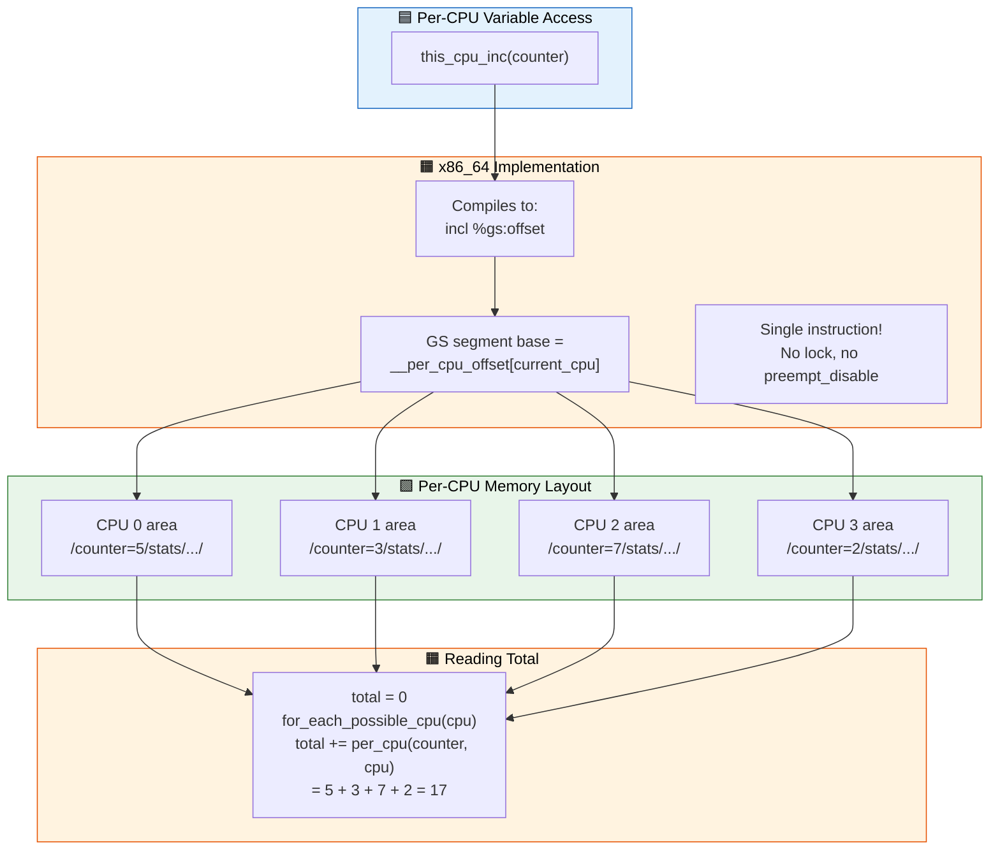
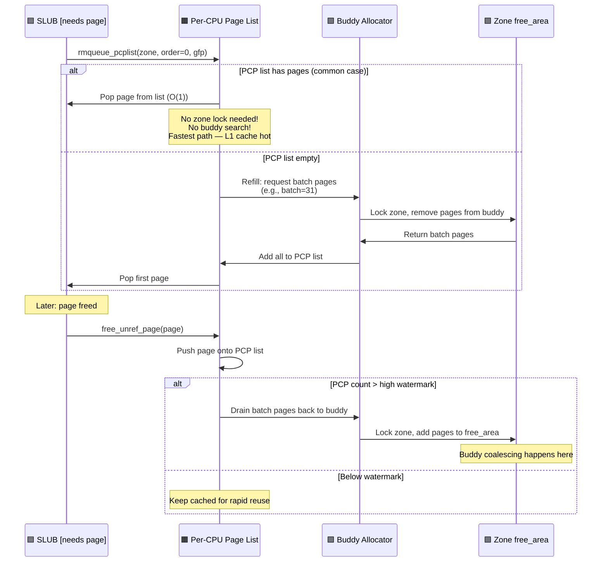

# Q15: Per-CPU Variables and Per-CPU Memory

## Interview Question
**"Explain per-CPU variables in the Linux kernel. How does the per-CPU allocator work internally? Why are per-CPU variables important for scalability? How do PCP (per-CPU page) caches relate to the page allocator? What are the preemption/migration concerns when accessing per-CPU data?"**

---

## 1. The Problem: Cache Line Bouncing

```
Without per-CPU variables (shared global counter):

CPU 0                CPU 1                CPU 2                CPU 3
  │                    │                    │                    │
  ├─ inc counter ─┐    │                    │                    │
  │               │    │                    │                    │
  │     ┌─────────▼────▼────────────────────┤────────────────────┤
  │     │ counter (single cache line)       │                    │
  │     │ MESI: Modified → Shared → Invalid → Modified → ...    │
  │     └─────────┬────┬────────────────────┤────────────────────┤
  │               │    ├─ inc counter ──────┘                    │
  │               │    │                    ├─ inc counter ──────┘
  │               │    │                    │
  Read: ~100+ cycles (cache miss each time due to cache line bouncing)

With per-CPU variables:

CPU 0          CPU 1          CPU 2          CPU 3
  │              │              │              │
  ├─ inc ──┐     ├─ inc ──┐     ├─ inc ──┐     ├─ inc ──┐
  │   ┌────▼──┐  │   ┌────▼──┐  │   ┌────▼──┐  │   ┌────▼──┐
  │   │ cnt_0 │  │   │ cnt_1 │  │   │ cnt_2 │  │   │ cnt_3 │
  │   │(local)│  │   │(local)│  │   │(local)│  │   │(local)│
  │   └───────┘  │   └───────┘  │   └───────┘  │   └───────┘
  Read: ~1-4 cycles (L1 cache hit, no sharing, no locks needed)
  
  Total = cnt_0 + cnt_1 + cnt_2 + cnt_3  (summed when needed)
```

---

## 2. Declaring and Using Per-CPU Variables

### Static Per-CPU Variables

```c
#include <linux/percpu.h>

/* Declaration (creates one copy per CPU) */
DEFINE_PER_CPU(int, my_counter);
DEFINE_PER_CPU(struct my_struct, my_data);

/* With initial value */
DEFINE_PER_CPU(unsigned long, stats) = 0;

/* Read-mostly (placed in separate cache line section) */
DEFINE_PER_CPU_READ_MOSTLY(int, cpu_type);

/* Aligned to cache line */
DEFINE_PER_CPU_ALIGNED(struct stats, net_stats);

/* First chunk — available very early in boot */
DEFINE_PER_CPU_FIRST(struct task_struct *, idle_task);
```

### Accessing Per-CPU Variables

```c
/* get_cpu() disables preemption and returns current CPU */
int cpu = get_cpu();
per_cpu(my_counter, cpu)++;      /* Access specific CPU's copy */
put_cpu();                        /* Re-enable preemption */

/* this_cpu_* operations (preferred, implicitly disable preemption for
   the single read-modify-write) */
this_cpu_inc(my_counter);         /* Atomic per-CPU increment */
this_cpu_dec(my_counter);
this_cpu_add(my_counter, 5);
this_cpu_write(my_counter, 42);
int val = this_cpu_read(my_counter);

/* Raw variants (caller must ensure no preemption/migration) */
raw_cpu_inc(my_counter);          /* No preemption check */

/* Read another CPU's value (for summing) */
int remote_val = per_cpu(my_counter, other_cpu);

/* Sum across all CPUs */
int total = 0;
int cpu;
for_each_possible_cpu(cpu)
    total += per_cpu(my_counter, cpu);
```

---

## 3. How Per-CPU Memory Layout Works

### Compile-Time Layout

```
During compilation, per-CPU variables go to special ELF sections:
  .data..percpu           — regular per-CPU data
  .data..percpu..read_mostly — read-mostly data
  .data..percpu..shared_aligned — cache-line aligned

Linker script (vmlinux.lds) groups them into one block:
  __per_cpu_start = .;
  .data..percpu : {
      *(.data..percpu..first)
      *(.data..percpu..page_aligned)
      *(.data..percpu..read_mostly)
      *(.data..percpu..shared_aligned)
      *(.data..percpu)
  }
  __per_cpu_end = .;
```

### Runtime Memory Arrangement

```
The per-CPU section is a "template" — copied once per CPU:

Template:   [......per-CPU data block......]
               |size| = __per_cpu_end - __per_cpu_start

Runtime allocation (early boot — setup_per_cpu_areas()):

  ┌──────────────────────────────────────────────────────────────┐
  │ CPU 0 copy       │ CPU 1 copy       │ CPU 2 copy       │...│
  │ [template copy]  │ [template copy]  │ [template copy]  │   │
  └──────────────────────────────────────────────────────────────┘
  
  __per_cpu_offset[0] = base address of CPU 0 copy
  __per_cpu_offset[1] = base address of CPU 1 copy
  __per_cpu_offset[2] = base address of CPU 2 copy

Address calculation:
  &per_cpu(var, cpu) = &var_template + __per_cpu_offset[cpu]

  On x86_64: gs: segment register points to current CPU's per-CPU area
    this_cpu_read(var) → gs:(var_offset)   /* Single instruction! */
```

### Segment Register Optimization (x86_64)

```c
/*
 * On x86_64, the GS segment base is set to the current CPU's
 * per-CPU area base during CPU initialization:
 *
 * wrmsrl(MSR_GS_BASE, __per_cpu_offset[cpu]);
 *
 * this_cpu_read(var) compiles to a single instruction:
 *   mov %gs:offset_of_var, %reg
 *
 * No index lookup, no addition — hardware does it!
 *
 * On ARM64: TPIDR_EL1 register serves similar purpose
 */
```

---

## 4. Dynamic Per-CPU Allocation

```c
#include <linux/percpu.h>

/* Allocate dynamic per-CPU memory */
void __percpu *ptr;
ptr = alloc_percpu(struct my_struct);    /* GFP_KERNEL */
ptr = alloc_percpu_gfp(struct my_struct, GFP_KERNEL);
ptr = __alloc_percpu(size, align);       /* Custom alignment */
ptr = __alloc_percpu_gfp(size, align, gfp);

if (!ptr)
    return -ENOMEM;

/* Access */
struct my_struct *local = get_cpu_ptr(ptr);
local->field = value;
put_cpu_ptr(ptr);

/* Or with this_cpu_ptr */
struct my_struct *local = this_cpu_ptr(ptr);

/* Free */
free_percpu(ptr);
```

### Per-CPU Allocator Internals

```
The per-CPU allocator manages memory in "chunks":

First chunk (special):
  - Created at boot by setup_per_cpu_areas()
  - Contains static per-CPU variables
  - May use embedding, page remapping, or large page strategy
  - Architecture-dependent layout

Subsequent chunks (dynamic alloc_percpu):
  ┌─────────────────────────────────────────────────┐
  │                  Chunk metadata                   │
  │  pcpu_chunk: {                                   │
  │    base_addr,                                    │
  │    free_bytes,                                   │
  │    contig_bits,   /* Bitmap of free/used areas */ │
  │    alloc_map,     /* Allocation bitmap */         │
  │  }                                               │
  └─────────────────────────────────────────────────┘
       │
       ▼
  ┌──────────┬──────────┬──────────┬──────────┐
  │  CPU 0   │  CPU 1   │  CPU 2   │  CPU 3   │  (Regions)
  │┌────────┐│┌────────┐│┌────────┐│┌────────┐│
  ││alloc A ││││alloc A ││││alloc A ││││alloc A ││
  │├────────┤│├────────┤│├────────┤│├────────┤│
  ││free    ││││free    ││││free    ││││free    ││
  │├────────┤│├────────┤│├────────┤│├────────┤│
  ││alloc B ││││alloc B ││││alloc B ││││alloc B ││
  │└────────┘│└────────┘│└────────┘│└────────┘│
  └──────────┴──────────┴──────────┴──────────┘

  Same offset in each CPU's region → same variable
  Different offset → different variable
```

---

## 5. Per-CPU Page Lists (PCP — Per-CPU Pages)

The buddy allocator uses per-CPU page caches for fast single-page allocations:

```c
struct per_cpu_pages {
    spinlock_t lock;           /* Protects this PCP */
    int count;                 /* Number of pages cached */
    int high;                  /* High watermark */
    int high_min;
    int high_max;
    int batch;                 /* Number of pages to add/remove at once */
    short free_count;          /* Number on free_count list */
    short free_factor;
    struct list_head lists[NR_PCP_LISTS]; /* Per-migratetype lists */
};
```

### PCP Flow

```
Single page allocation (order-0):

Application → kmalloc(128) → slab → needs new page → alloc_pages(GFP_KERNEL, 0)
                                                           │
                                                           ▼
                                                    ┌──────────────┐
                                                    │ Check PCP    │
                                                    │ rmqueue_pcplist()
                                                    └──────┬───────┘
                                                           │
                                          ┌────────────────┤
                                          │ PCP has pages?  │
                                          │                 │
                                       YES│              NO │
                                          │                 │
                                          ▼                 ▼
                                    ┌──────────┐    ┌──────────────┐
                                    │ Return    │    │ Refill PCP   │
                                    │ page from │    │ from buddy   │
                                    │ PCP list  │    │ (batch pages)│
                                    │ O(1) fast │    │              │
                                    └──────────┘    └──────────────┘

Single page free:

free_pages(page, 0) → free_unref_page()
                           │
                           ▼
                   ┌──────────────┐
                   │ Add to PCP   │
                   │ free list    │
                   └──────┬───────┘
                          │
               ┌──────────┤
               │ count > high?
               │          │
            NO │       YES│
               │          │
               ▼          ▼
         ┌─────────┐ ┌────────────┐
         │ Done    │ │ Drain batch│
         │(cached) │ │ pages back │
         │         │ │ to buddy   │
         └─────────┘ └────────────┘

Benefits:
  - No zone lock for most order-0 alloc/free
  - No buddy algorithm overhead for single pages
  - Hot pages (recently freed) reused quickly → better cache behavior
  - Per-CPU → no contention between CPUs
```

---

## 6. Preemption and Migration Concerns

```c
/* WRONG — CPU migration can happen between read and write: */
x = this_cpu_read(my_var);     /* Read on CPU 0 */
/* ← preempted, migrated to CPU 1 → */
this_cpu_write(my_var, x + 1); /* Write on CPU 1! Wrong CPU's variable! */

/* CORRECT — disable preemption around compound operations: */
preempt_disable();
x = this_cpu_read(my_var);
this_cpu_write(my_var, x + 1);
preempt_enable();

/* CORRECT — single this_cpu_* operations are safe: */
this_cpu_inc(my_var);  
/* On x86_64: compiles to: incl %gs:offset — single instruction, safe */

/* CORRECT — get_cpu()/put_cpu(): */
int cpu = get_cpu();           /* disables preemption */
per_cpu(my_var, cpu) = 42;
put_cpu();                     /* enables preemption */
```

### Safe patterns

```c
/* Single read-modify-write: always safe */
this_cpu_inc(counter);
this_cpu_add(counter, delta);

/* Multiple operations on same variable: protect */
preempt_disable();
old = this_cpu_read(counter);
this_cpu_write(counter, old + 1);
preempt_enable();

/* IRQ context: use this_cpu_* (IRQs on same CPU access same variable) */
/* If both process and IRQ handler access same per-CPU var: */
local_irq_save(flags);
this_cpu_add(irq_counter, 1);
local_irq_restore(flags);

/* In driver's NAPI poll (softirq, no preemption): */
this_cpu_inc(net_stats.rx_packets);  /* Safe — softirq context */
```

---

## 7. Per-CPU and NUMA Awareness

```c
/* Per-CPU areas allocated on the CPU's local NUMA node */
/* setup_per_cpu_areas() → pcpu_alloc_alloc_info() */

/*
 * On NUMA systems:
 *
 * Node 0 Memory:              Node 1 Memory:
 * ┌──────────────────┐        ┌──────────────────┐
 * │ CPU 0 percpu area│        │ CPU 2 percpu area│
 * │ CPU 1 percpu area│        │ CPU 3 percpu area│
 * │                  │        │                  │
 * └──────────────────┘        └──────────────────┘
 *
 * Each CPU's per-CPU memory lives on its LOCAL node
 * → Access is always node-local → fastest memory
 */

/* Manual NUMA-aware per-CPU allocation */
ptr = __alloc_percpu_gfp(size, align, GFP_KERNEL);
/* Internally allocates pages on each CPU's local node */
```

---

## 8. Per-CPU in Device Drivers

### Network Driver Statistics

```c
struct my_net_stats {
    u64 rx_packets;
    u64 rx_bytes;
    u64 tx_packets;
    u64 tx_bytes;
};

struct my_net_priv {
    struct my_net_stats __percpu *stats;
    /* ... */
};

static int my_net_probe(struct platform_device *pdev)
{
    struct my_net_priv *priv;
    struct net_device *ndev;

    ndev = alloc_etherdev(sizeof(*priv));
    priv = netdev_priv(ndev);

    priv->stats = alloc_percpu(struct my_net_stats);
    if (!priv->stats) {
        free_netdev(ndev);
        return -ENOMEM;
    }
    /* ... */
}

/* In RX path (NAPI poll — softirq context, preemption disabled): */
static int my_net_rx(struct my_net_priv *priv, int budget)
{
    struct my_net_stats *stats = this_cpu_ptr(priv->stats);

    while (budget--) {
        /* Process packet */
        stats->rx_packets++;
        stats->rx_bytes += skb->len;
    }
}

/* Reporting total stats: */
static void my_net_get_stats64(struct net_device *ndev,
                                struct rtnl_link_stats64 *s)
{
    struct my_net_priv *priv = netdev_priv(ndev);
    int cpu;

    for_each_possible_cpu(cpu) {
        struct my_net_stats *stats = per_cpu_ptr(priv->stats, cpu);
        s->rx_packets += stats->rx_packets;
        s->rx_bytes   += stats->rx_bytes;
        s->tx_packets += stats->tx_packets;
        s->tx_bytes   += stats->tx_bytes;
    }
}

static void my_net_remove(struct platform_device *pdev)
{
    free_percpu(priv->stats);
    free_netdev(ndev);
}
```

### IRQ Counters in Driver

```c
static DEFINE_PER_CPU(unsigned long, irq_count);

static irqreturn_t my_irq_handler(int irq, void *dev_id)
{
    this_cpu_inc(irq_count);  /* Safe — IRQ context, no preemption */
    /* Handle interrupt */
    return IRQ_HANDLED;
}

/* In debugfs show function: */
static int stats_show(struct seq_file *m, void *v)
{
    int cpu;
    unsigned long total = 0;

    for_each_online_cpu(cpu) {
        unsigned long count = per_cpu(irq_count, cpu);
        seq_printf(m, "CPU%d: %lu\n", cpu, count);
        total += count;
    }
    seq_printf(m, "Total: %lu\n", total);
    return 0;
}
```

---

## 9. Per-CPU vs Alternatives

```
┌─────────────────────┬──────────────────┬───────────────────────────┐
│ Mechanism           │ Overhead         │ When to Use               │
├─────────────────────┼──────────────────┼───────────────────────────┤
│ Per-CPU variable    │ Lowest           │ Counters, statistics,     │
│                     │ No lock, L1 hit  │ per-CPU caches, hot paths │
├─────────────────────┼──────────────────┼───────────────────────────┤
│ atomic_t            │ Low              │ Simple shared counters,   │
│                     │ Cache bouncing   │ reference counts          │
├─────────────────────┼──────────────────┼───────────────────────────┤
│ spinlock + global   │ Medium           │ Complex shared state,     │
│                     │ Contention       │ linked lists              │
├─────────────────────┼──────────────────┼───────────────────────────┤
│ Per-CPU + seqcount  │ Low read,        │ Statistics with rare      │
│                     │ Medium write     │ consistent reads          │
├─────────────────────┼──────────────────┼───────────────────────────┤
│ local_t             │ Lowest           │ NMI/IRQ-safe counters     │
│                     │ Single CPU only  │ (rarely needed)           │
└─────────────────────┴──────────────────┴───────────────────────────┘
```

---

## 10. Common Interview Follow-ups

**Q: What is `this_cpu_cmpxchg` and when would you use it?**
It performs a compare-and-exchange on the current CPU's per-CPU variable. Useful for implementing per-CPU free lists or lock-free per-CPU algorithms where a single RMW operation isn't sufficient.

**Q: Can you access another CPU's per-CPU variable?**
Yes, using `per_cpu(var, cpu_id)` or `per_cpu_ptr(ptr, cpu_id)`. This is safe for read (e.g., summing stats) but writing another CPU's variable risks races. Use it only for aggregation.

**Q: What's `for_each_possible_cpu` vs `for_each_online_cpu`?**
- `for_each_possible_cpu`: iterates over all CPUs that could exist (including currently offline but hot-pluggable). Use when summing per-CPU counters (they might have accumulated data before going offline).
- `for_each_online_cpu`: Only currently online CPUs. Use when sending IPC or scheduling work.

**Q: How does CPU hotplug affect per-CPU variables?**
Per-CPU memory is allocated for all *possible* CPUs at boot. When a CPU goes offline, its per-CPU data remains valid but isn't updated. Register CPU hotplug callbacks (`cpuhp_setup_state()`) if you need to drain or migrate per-CPU data.

**Q: What is the memory overhead of per-CPU variables?**
Each DEFINE_PER_CPU creates `nr_possible_cpus` copies. On a system with 256 possible CPUs, a 64-byte per-CPU structure uses 16KB. Dynamic `alloc_percpu` has additional metadata overhead from the pcpu chunk allocator.

---

## 11. Key Source Files

| File | Purpose |
|------|---------|
| `include/linux/percpu.h` | Per-CPU API: DEFINE_PER_CPU, this_cpu_*, alloc_percpu |
| `include/linux/percpu-defs.h` | Macro definitions for per-CPU variables |
| `mm/percpu.c` | Per-CPU chunk allocator (pcpu_alloc, pcpu_free) |
| `arch/x86/kernel/setup_percpu.c` | x86 per-CPU area setup, GS base |
| `arch/x86/include/asm/percpu.h` | x86 this_cpu_* implementation (GS segment) |
| `mm/page_alloc.c` | Per-CPU page lists (PCP), rmqueue_pcplist |
| `include/linux/mmzone.h` | struct per_cpu_pages definition |
| `include/linux/cpuhotplug.h` | CPU hotplug state machine for per-CPU cleanup |

---

## Mermaid Diagrams

### Per-CPU Variable Access Flow



### PCP (Per-CPU Pages) Allocation Sequence


