# NVIDIA — System Design Interview: Linux Kernel Memory Management

## Target Role: Senior Linux Kernel / GPU Driver Engineer (9+ years)

These questions focus on **NVIDIA GPU driver** memory management challenges — unified memory, GPU page faults, BAR mapping, IOMMU interactions, pinned memory, GEM/TTM buffer management, and multi-GPU coherency.

---

## Q1: NVIDIA Unified Memory Architecture — How Does GPU Page Faulting Work?

### Interview Question
**"Explain NVIDIA's Unified Virtual Memory (UVM) architecture. How do GPU page faults work at the kernel driver level? How does the kernel migrate pages between CPU and GPU memory? What role does the Linux kernel's HMM (Heterogeneous Memory Management) play?"**

### Deep Answer

NVIDIA Unified Memory allows CPU and GPU to share a single virtual address pointer (`cudaMallocManaged`). Under the hood, pages migrate between CPU RAM and GPU VRAM on demand.

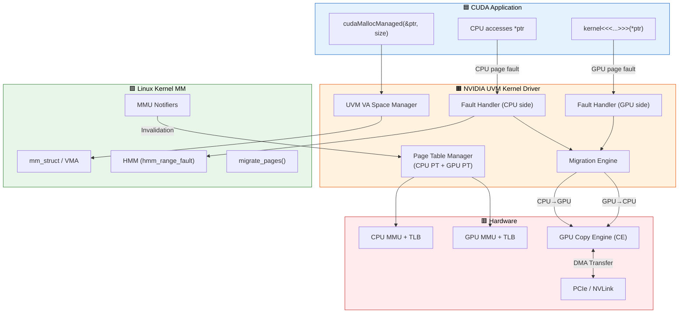

### GPU Page Fault Sequence

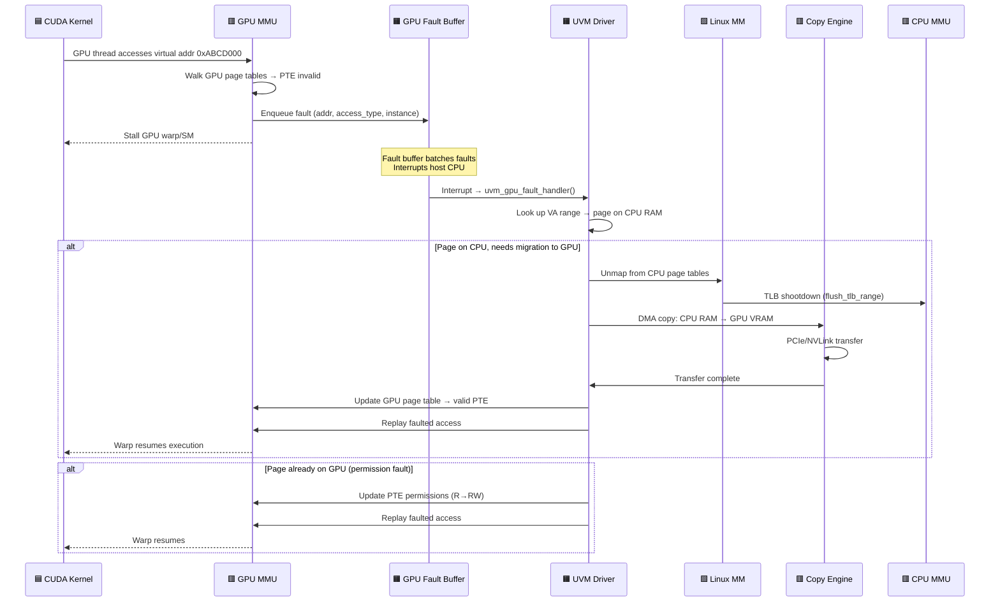

### Key Kernel Interactions

```c
/* NVIDIA UVM driver registers MMU notifier with Linux kernel */
struct mmu_notifier_ops uvm_mmu_notifier_ops = {
    .invalidate_range_start = uvm_mmu_notifier_invalidate_range_start,
    .invalidate_range_end   = uvm_mmu_notifier_invalidate_range_end,
};

/* When CPU page tables change (munmap, COW, migration),
   Linux notifies UVM → UVM invalidates GPU page tables */

/* HMM mirror for tracking CPU page table state */
struct hmm_mirror {
    struct mmu_notifier notifier;
    /* UVM uses this to get CPU→physical mappings */
};
```

---

## Q2: GPU BAR Memory Mapping and PCIe Address Space

### Interview Question
**"Explain how the GPU's BAR (Base Address Register) regions are mapped into the kernel. How does a driver map GPU VRAM into user-space? What are BAR1, BAR2 in NVIDIA GPUs and how does remap_pfn_range work for GPU memory?"**

### Deep Answer

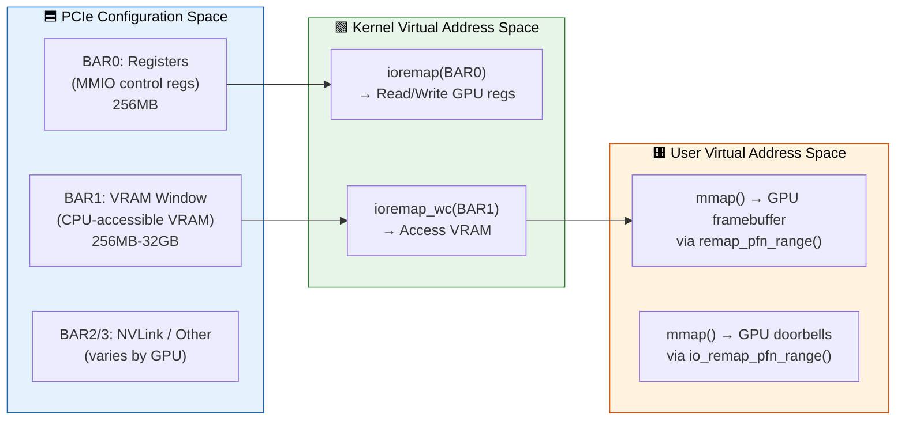

### BAR Mapping Sequence

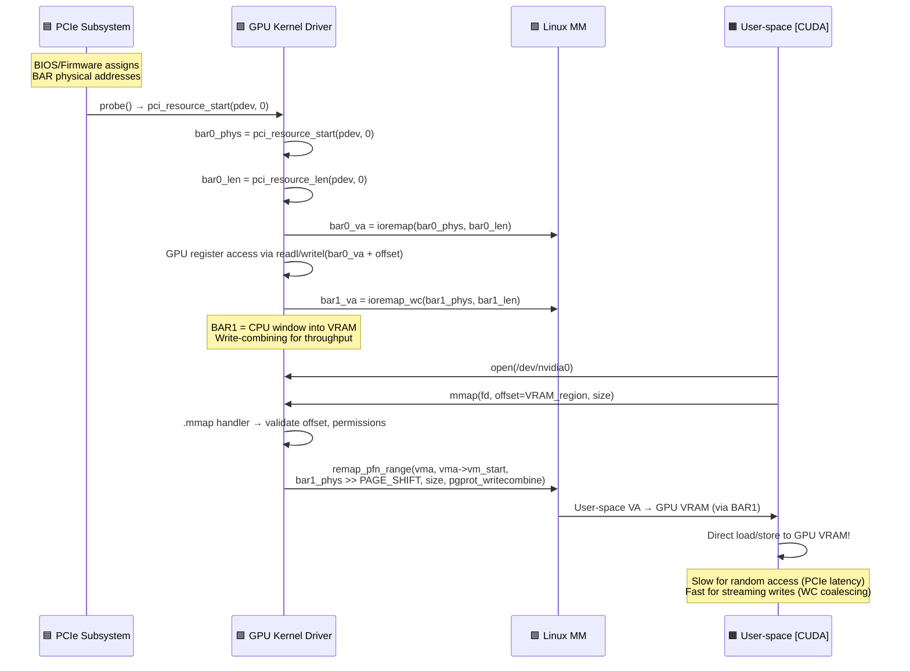

### Resizable BAR (ReBAR)

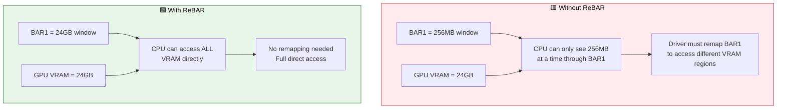

---

## Q3: DRM/GEM and TTM Buffer Object Management

### Interview Question
**"Explain how NVIDIA's kernel driver manages GPU buffer objects. How does TTM (Translation Table Manager) or GEM work? How are GPU buffers allocated, pinned, mapped, and migrated? Explain the relationship between GEM handles, GEM objects, and the underlying physical memory."**

### Deep Answer

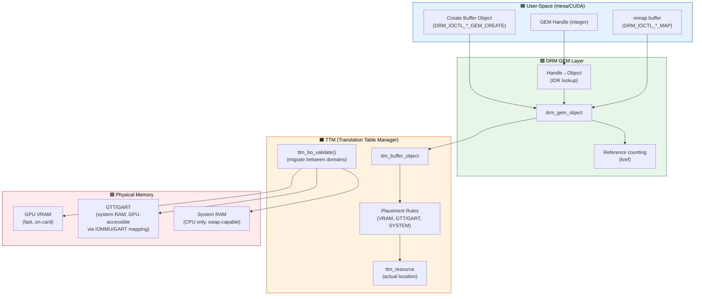

### Buffer Object Lifecycle

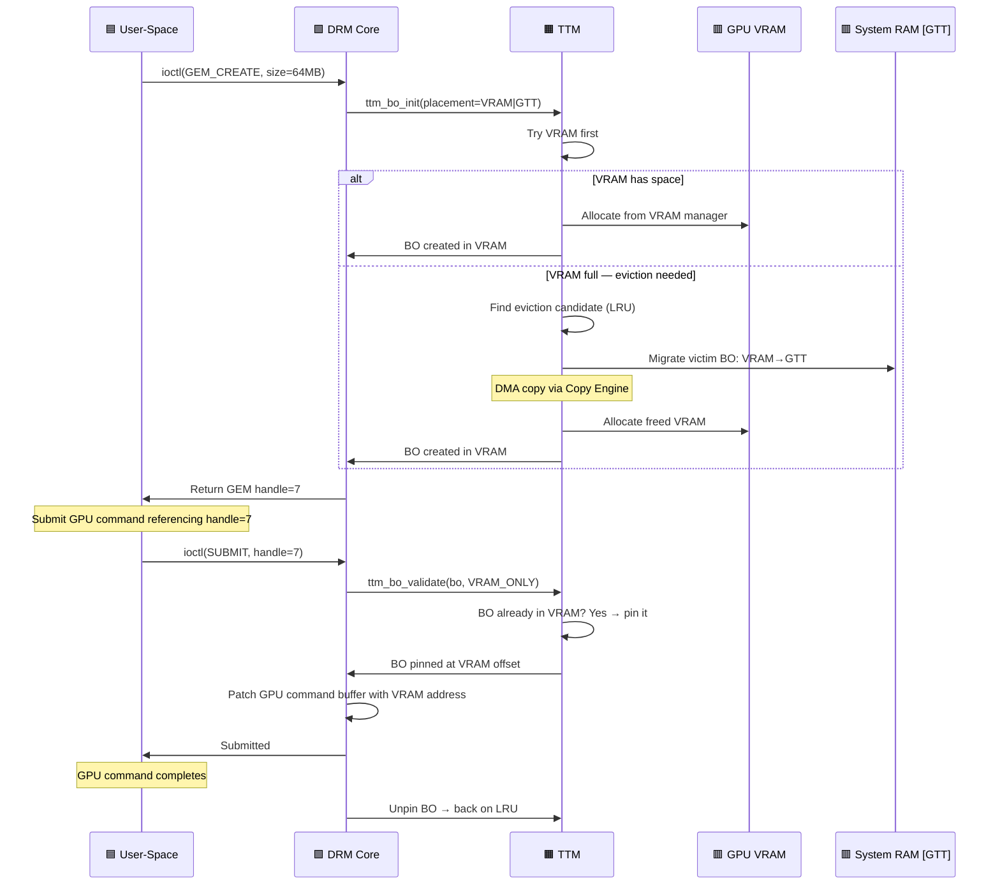

---

## Q4: Multi-GPU Memory and NVLink Topology

### Interview Question
**"In a multi-GPU system (DGX with 8 GPUs connected via NVLink), how does memory management work? How does peer-to-peer (P2P) GPU memory access work at the kernel level? How does NUMA awareness affect GPU memory allocation?"**

### Deep Answer

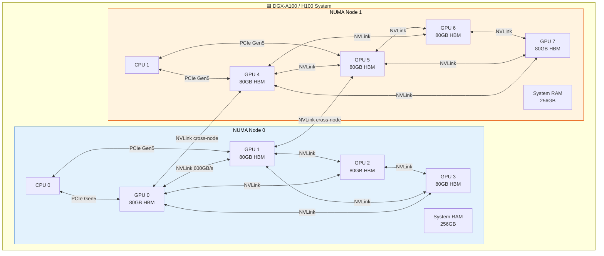

### P2P Memory Access Sequence

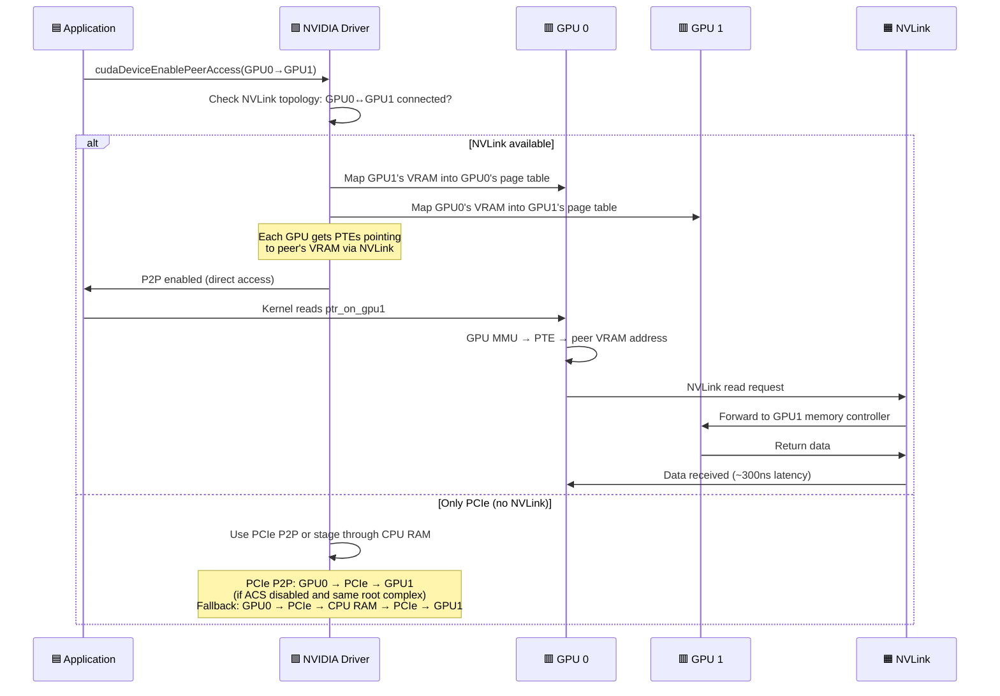

---

## Q5: GPU Memory Pinning and RDMA (GPUDirect)

### Interview Question
**"Explain GPUDirect RDMA at the kernel level. How does a network adapter (InfiniBand HCA) directly DMA into GPU VRAM? What are the memory pinning requirements? How does nvidia_p2p_get_pages work?"**

### Deep Answer

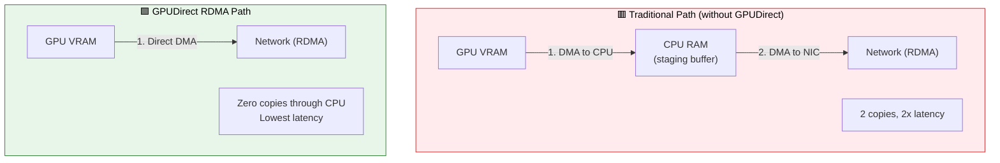

### GPUDirect RDMA Kernel Flow

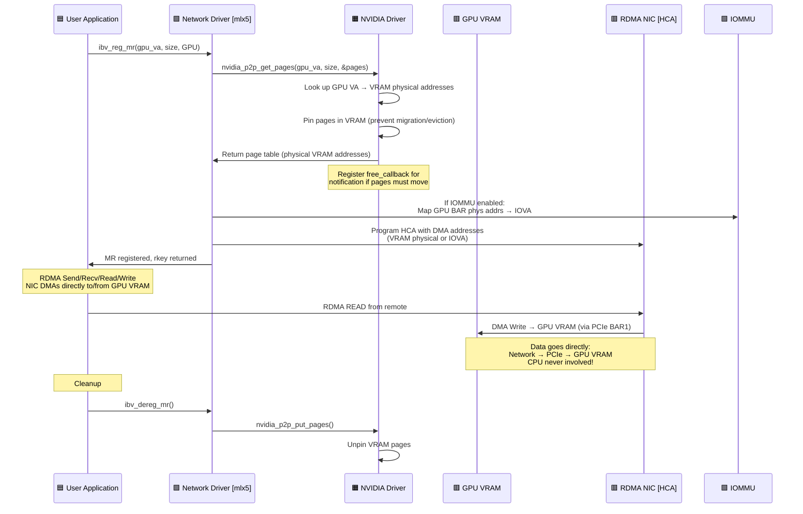

---

## Q6: NVIDIA GPU IOMMU Integration (SMMU on ARM, VT-d on x86)

### Interview Question
**"How does the GPU interact with the system IOMMU? What challenges arise with GPU DMA through an IOMMU? How do NVIDIA drivers handle IOMMU-backed DMA for compute and display workloads?"**

### Deep Answer

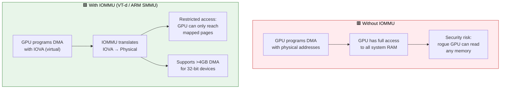

### IOMMU DMA Mapping Sequence

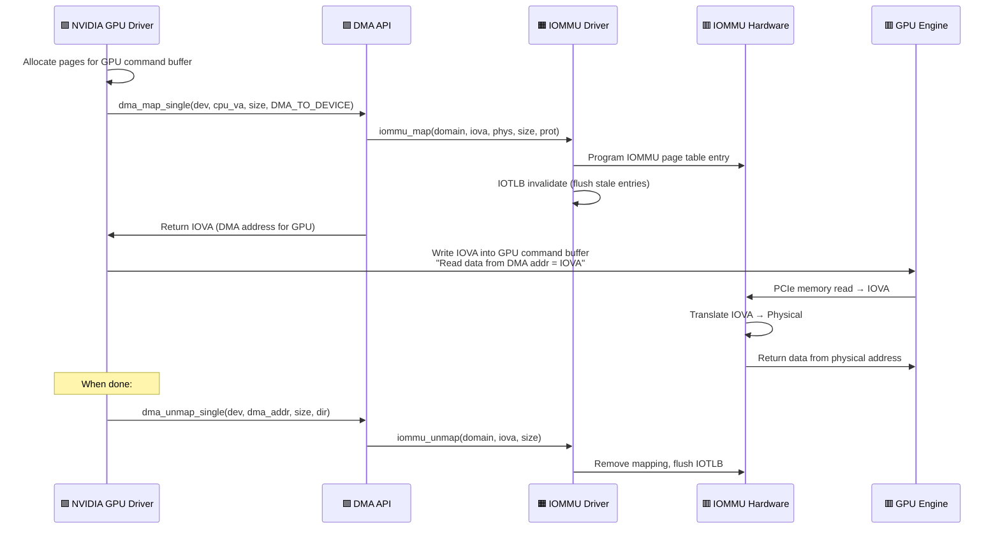

---

## Q7: Kernel Memory Allocation Patterns in GPU Drivers

### Interview Question
**"Walk through the memory allocation patterns used in a GPU kernel driver. When do you use kmalloc vs vmalloc vs CMA vs DMA allocators? How do you handle allocation failures in the GPU probe path vs runtime?"**

### Deep Answer

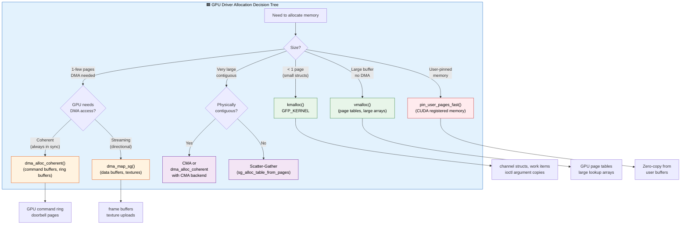

### GPU Driver Probe Memory Allocation Sequence

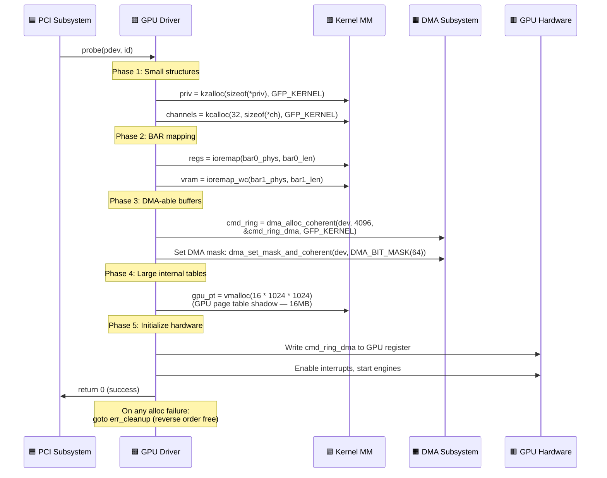

---

## Q8: GPU Memory Overcommit and Eviction

### Interview Question
**"When GPU VRAM is full, how does the NVIDIA driver handle new allocations? Explain the GPU memory eviction policy — LRU, priority levels, and the interaction between compute and display buffers."**

### Deep Answer

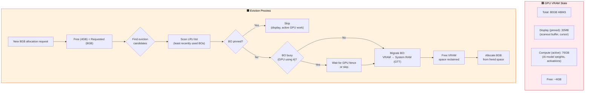

### Eviction Sequence Detail

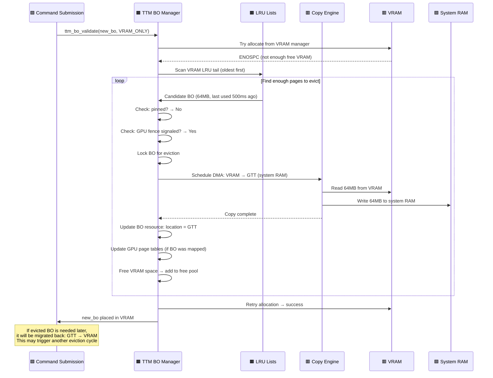

---

## Q9: GPU Page Table and Virtual Address Space Management

### Interview Question
**"NVIDIA GPUs have their own MMU and page tables separate from the CPU. How are GPU page tables managed in the kernel driver? How does GPU virtual address space allocation work? How are GPU page table updates synchronized with command execution?"**

### Deep Answer

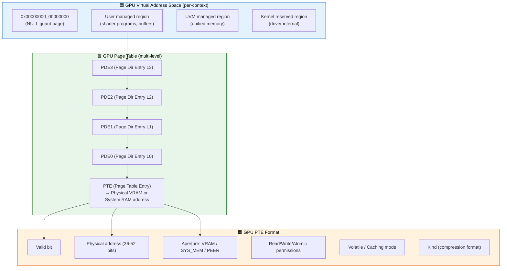

### GPU Page Table Update Sequence

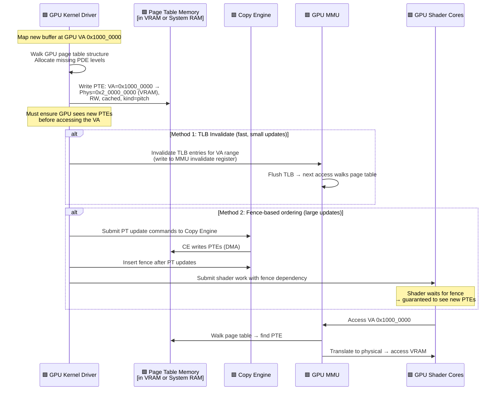

---

## Q10: CUDA cudaHostAlloc (Pinned Memory) Kernel Internals

### Interview Question
**"What happens in the kernel when a CUDA application calls `cudaHostAlloc()` with `cudaHostAllocMapped`? How is pinned memory implemented? What are the performance implications and dangers of excessive pinning?"**

### Deep Answer

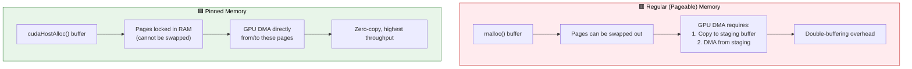

### cudaHostAlloc Kernel Sequence

```mermaid
sequenceDiagram
    participant APP as 🟦 CUDA Application
    participant CUDA_RT as 🟧 CUDA Runtime
    participant NV_UMD as 🟧 NVIDIA User-Mode Driver
    participant KERNEL as 🟩 Linux Kernel
    participant NV_KMD as 🟩 NVIDIA Kernel Driver
    participant GPU as 🟥 GPU

    APP->>CUDA_RT: cudaHostAlloc(&ptr, 256MB,<br/>cudaHostAllocMapped)

    CUDA_RT->>NV_UMD: Allocate pinned host memory

    NV_UMD->>KERNEL: mmap(NULL, 256MB, PROT_RW,<br/>MAP_PRIVATE|MAP_ANONYMOUS, -1, 0)
    KERNEL->>NV_UMD: User VA = 0x7f0000000000

    NV_UMD->>NV_KMD: ioctl(nvidia_fd, PIN_MEMORY,<br/>{va=0x7f..., size=256MB})

    NV_KMD->>KERNEL: pin_user_pages_fast(va, npages,<br/>FOLL_WRITE, pages[])
    Note over KERNEL: Fault in all pages<br/>Mark pages as pinned<br/>(elevated refcount)

    KERNEL->>NV_KMD: 65536 pages pinned

    NV_KMD->>NV_KMD: Build DMA mapping for GPU:<br/>dma_map_sg(dev, sgt, nents, BIDIR)

    NV_KMD->>GPU: Map into GPU page table<br/>(PTE → system RAM via PCIe)

    NV_KMD->>NV_UMD: GPU VA = 0x200000000

    NV_UMD->>APP: ptr = 0x7f0000000000<br/>(CPU VA = GPU VA transparent via UVM)

    Note over APP: CPU writes to *ptr<br/>GPU kernel reads same data<br/>Zero-copy!

    Note over APP: Dangers of excessive pinning:
    Note over KERNEL: • 256MB locked = cannot be swapped<br/>• Reduces available RAM for page cache<br/>• Too much pinning → OOM!<br/>• ulimit -l controls per-user limit<br/>• vm.max_map_count may be hit
```

---

## Common NVIDIA Interview Follow-ups

### Memory-Related

| Question | Key Points |
|----------|------------|
| **ECC and GPU memory** | HBM has ECC; driver handles correctable/uncorrectable errors via interrupt; uncorrectable → page retirement |
| **GPU memory compression** | Hardware delta-color/lossless compression; managed by MMU kind bits in PTEs; 2-4x bandwidth savings |
| **NVSwitch vs NVLink** | NVLink = point-to-point; NVSwitch = all-to-all fabric; enables GPUDirect across 8+ GPUs |
| **CUDA Managed Memory prefetch** | `cudaMemPrefetchAsync()` → triggers proactive migration; avoids page fault latency |
| **GPU memory fragmentation** | VRAM has same buddy fragmentation issues; TTM handles compaction by migrating BOs |

---

## Key Source Files

| Component | Source |
|-----------|--------|
| DRM/TTM framework | `drivers/gpu/drm/ttm/` |
| DRM GEM helpers | `drivers/gpu/drm/drm_gem.c` |
| HMM (Heterogeneous Memory) | `mm/hmm.c`, `include/linux/hmm.h` |
| MMU notifiers | `mm/mmu_notifier.c` |
| IOMMU core | `drivers/iommu/iommu.c` |
| DMA mapping core | `kernel/dma/mapping.c` |
| pin_user_pages | `mm/gup.c` |
| Nouveau (open NVIDIA) | `drivers/gpu/drm/nouveau/` |
| NVIDIA open-gpu-kernel | `github.com/NVIDIA/open-gpu-kernel-modules` |
