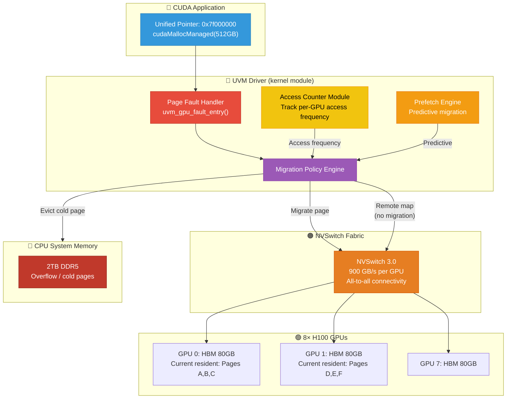
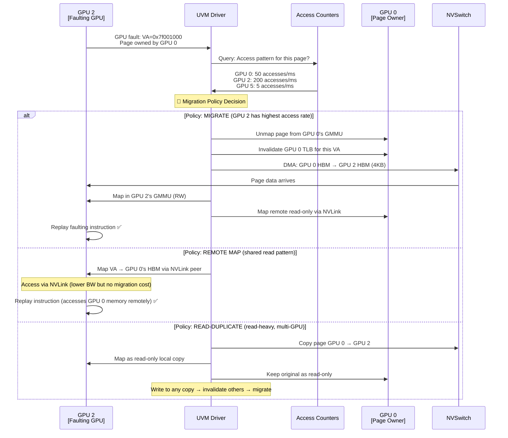
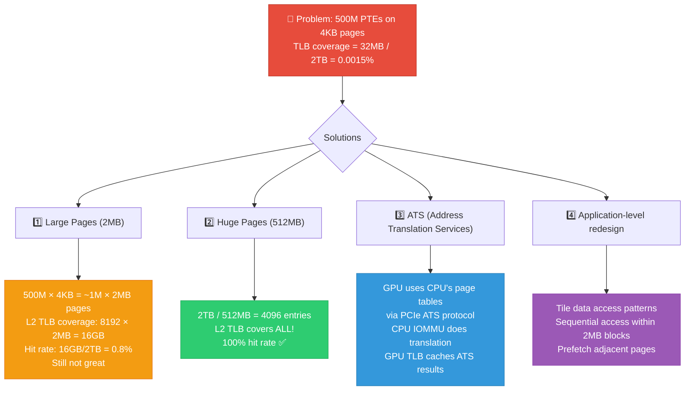
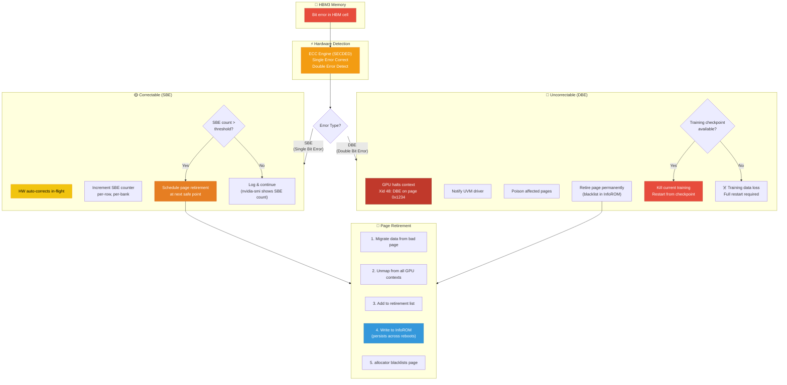
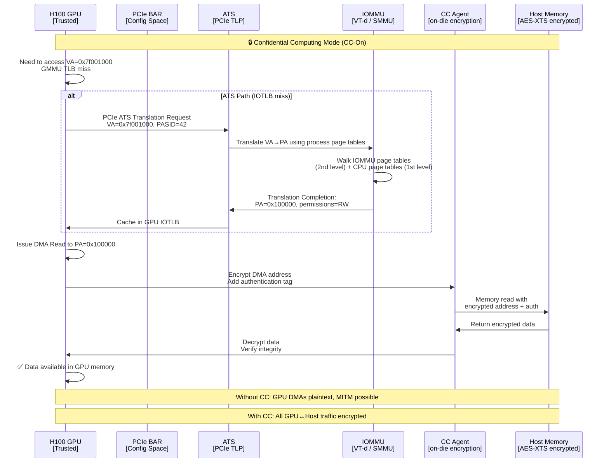
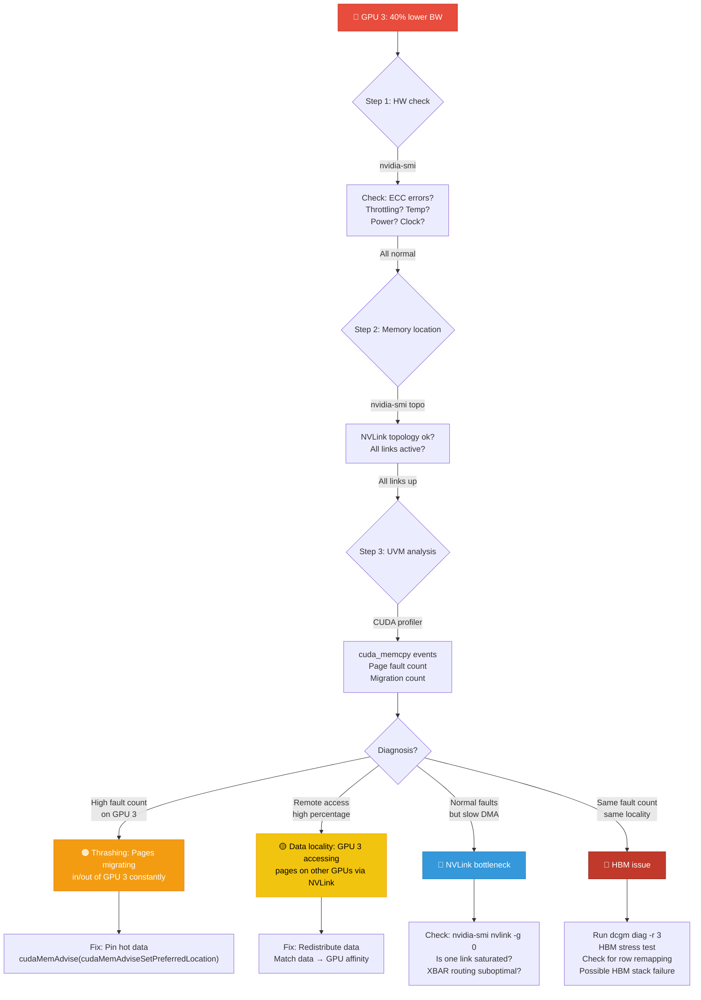
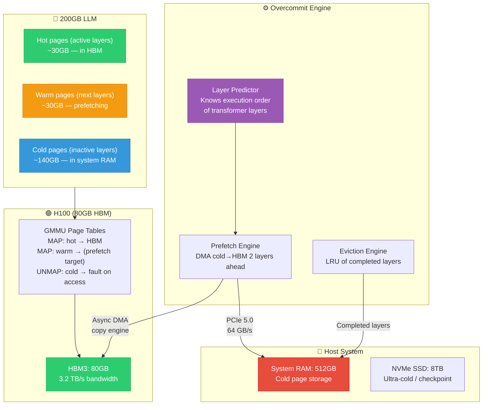
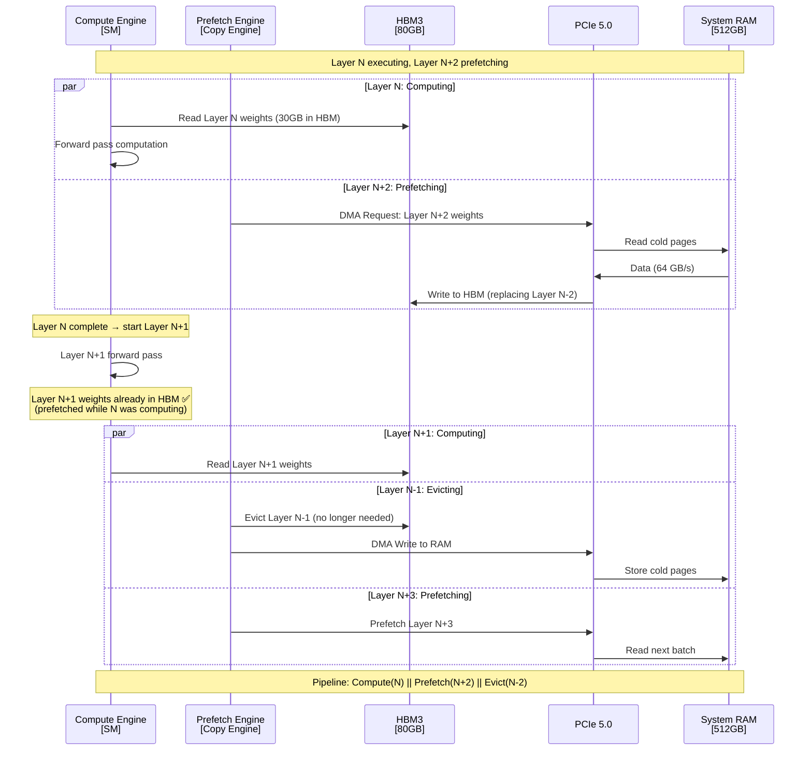

# 20 — NVIDIA: 15-Year Experience System Design Deep Interview — Memory Management

> **Target**: Principal/Staff/Distinguished Engineer interviews at NVIDIA (GPU Systems, CUDA, Drive, Tegra, DGX)
> **Level**: 15+ years — You are expected to design subsystems, debug silicon-level issues, and articulate tradeoffs for production GPU systems.

---

## 📌 Interview Focus Areas

| Domain | What NVIDIA Expects at 15yr Level |
|--------|----------------------------------|
| **UVM (Unified Virtual Memory)** | Design the page fault handler, migration policy, prefetch heuristics |
| **Multi-GPU Memory Coherence** | NVLink/NVSwitch memory model, XBAR coherency, ATS/PRI |
| **GPU IOMMU/SMMU Integration** | End-to-end DMA path, ATS (Address Translation Services), PASID |
| **DGX Memory Topology** | NUMA-aware GPU allocation, HBM bandwidth, NVSwitch routing decisions |
| **CUDA Memory Hierarchy** | Shared memory bank conflicts, L2 persistence, memory coalescing |
| **TLB Hierarchy & Shootdown** | GPU TLB design, GMMU invalidation cost, TLB coverage for HBM |
| **Memory Overcommit & ECC** | GPU memory oversubscription, ECC error handling, page retirement |
| **PCIe BAR & Resizable BAR** | BAR sizing strategy, SAR (System Address Remapping), ACS |

---

## 🎨 System Design 1: Design UVM Page Migration Policy for Multi-GPU DGX

### Context
A DGX H100 has 8×H100 GPUs, each with 80GB HBM3, connected via NVSwitch. A single CUDA application uses Unified Memory (`cudaMallocManaged`) spanning all GPUs. You must design the page migration policy engine.

### Design Diagram



### Migration Decision Sequence



### Deep Q&A

---

#### ❓ Q1: Design the access counter mechanism for UVM migration decisions. How would you avoid thrashing between GPUs?

**A:** The access counter system must solve: "Which GPU should own this page?"

**Hardware Component — GPU Access Counters:**
```
Each GPU has per-VA-range access counters in the GMMU:
- MOMC (MIMC) counters: Track accesses from local (remote) SM
- Counter granularity: configurable (64KB, 2MB, etc.)
- When counter exceeds threshold → generate interrupt to UVM driver
```

**Software Policy Engine:**
```c
struct uvm_page_migration_state {
    u64 va;
    u32 owner_gpu;                    /* Current page owner */
    u32 access_count[MAX_GPUS];       /* Per-GPU access frequency */
    ktime_t last_migration;           /* When was this page last moved */
    u32 migration_count;              /* Total migrations for this page */
    enum { STABLE, BOUNCING, NEW } state;
};

int uvm_should_migrate(struct uvm_page_migration_state *pms, 
                        int faulting_gpu)
{
    /* Anti-thrashing: exponential backoff */
    if (pms->state == BOUNCING) {
        ktime_t cooldown = ktime_set(0, 
            min(100 * NSEC_PER_MSEC * (1 << pms->migration_count), 
                10 * NSEC_PER_SEC));
        if (ktime_before(ktime_get(), 
                         ktime_add(pms->last_migration, cooldown)))
            return POLICY_REMOTE_MAP;  /* Don't migrate — too recent */
    }
    
    /* Majority access rule: migrate only if faulting GPU 
     * has 2x more accesses than current owner */
    if (pms->access_count[faulting_gpu] > 
        2 * pms->access_count[pms->owner_gpu]) {
        
        if (pms->migration_count > 5)
            pms->state = BOUNCING;
        
        pms->migration_count++;
        pms->last_migration = ktime_get();
        return POLICY_MIGRATE;
    }
    
    return POLICY_REMOTE_MAP;
}
```

**Anti-thrashing strategies:**
1. **Hysteresis**: Only migrate if access count exceeds 2× owner's count
2. **Cooldown timer**: After migration, prevent re-migration for exponentially increasing time
3. **Read-duplication**: For read-shared pages, replicate instead of migrating
4. **Pinning**: After N thrashes, pin the page to the "center of gravity" GPU (weighted by access counts)
5. **Batch migration**: Group nearby pages → amortize TLB invalidation cost

---

#### ❓ Q2: An H100 GPU has a 48-bit virtual address space with a 2-level GMMU. A workload with 500M page table entries causes severe GPU TLB pressure. How do you solve this?

**A:** This is a real production problem in LLM training with large KV caches.

**Problem Analysis:**
```
H100 GMMU TLB hierarchy:
- L1 TLB: ~512 entries per SM (132 SMs) — covers ~2MB per SM (4KB pages)
- L2 TLB: ~8192 entries shared — covers ~32MB
- Page Table Walker (PTW) cache: partial PDE caching

500M PTEs × 4KB pages = 2TB virtual mapping
L2 TLB coverage: 32MB → 0.0015% hit rate if random access → CATASTROPHIC
```

**Solution Architecture:**



**Implementation — Huge Page Promotion in UVM:**
```c
/* UVM big page allocation — drivers/gpu/drm/nouveau/nvkm/subdev/mmu/ */
int uvm_promote_to_huge_page(struct uvm_va_range *range, u64 va)
{
    /* Check: are all 128 × 4KB pages in this 512KB region 
     * owned by the same GPU? */
    int owner = get_page_owner(va & ~(SZ_512K - 1));
    for (int i = 0; i < 128; i++) {
        if (get_page_owner(va + i * PAGE_SIZE) != owner)
            return -EAGAIN;  /* Mixed ownership — can't promote */
    }
    
    /* Promote: replace 128 PTEs with 1 big PTE */
    uvm_unmap_range(range, va & ~(SZ_512K - 1), SZ_512K);
    uvm_map_big_page(range, va & ~(SZ_512K - 1), SZ_512K, owner);
    
    /* Invalidate old TLB entries */
    uvm_tlb_batch_invalidate(owner, va & ~(SZ_512K - 1), SZ_512K);
    
    return 0;
}
```

**NVIDIA-specific considerations:**
- H100 GMMU supports 4KB, 64KB, and 2MB page sizes
- `cuMemAllocAsync` with pools → reduces page table churn
- For LLM: KV cache should use 2MB pages, model weights should use largest possible

---

#### ❓ Q3: Design the ECC error handling and page retirement flow for HBM on a DGX system running 24/7 AI training.

**A:** This is critical for DGX reliability. A single uncorrected ECC error can corrupt a multi-week training run.



**Page Retirement Implementation:**

```c
/* Simplified GPU page retirement flow */
struct gpu_page_retire_info {
    u64 gpu_phys_addr;
    u32 bank, row, col;
    u32 sbe_count;
    u32 dbe_count;
    enum { PENDING, RETIRED, FAILED } state;
    bool persisted_to_inforom;
};

int gpu_retire_page(struct gpu_device *gpu, u64 phys_addr, 
                     enum retire_reason reason)
{
    struct gpu_page_retire_info *info;
    
    /* 1. Check if page is currently in use */
    if (gpu_page_in_use(gpu, phys_addr)) {
        /* Cannot retire immediately — schedule for later */
        list_add(&info->pending_list, &gpu->pending_retirements);
        /* Will be retired when current contexts release it */
        return -EBUSY;
    }
    
    /* 2. If page has live data, migrate first */
    if (gpu_page_has_data(gpu, phys_addr)) {
        u64 new_page = gpu_alloc_replacement_page(gpu);
        gpu_dma_copy(gpu, new_page, phys_addr, PAGE_SIZE);
        gpu_remap_all_contexts(gpu, phys_addr, new_page);
    }
    
    /* 3. Blacklist in allocator */
    gpu_allocator_blacklist(gpu, phys_addr, PAGE_SIZE);
    
    /* 4. Persist to InfoROM (survives reboot) */
    inforom_write_retired_page(gpu->inforom, phys_addr, reason);
    info->persisted_to_inforom = true;
    
    /* 5. Update nvidia-smi counters */
    gpu->retired_pages_sbe += (reason == RETIRE_SBE);
    gpu->retired_pages_dbe += (reason == RETIRE_DBE);
    
    pr_info("GPU %d: Retired page 0x%llx (reason=%s, total=%d)\n",
            gpu->id, phys_addr, 
            reason == RETIRE_SBE ? "SBE" : "DBE",
            gpu->retired_pages_sbe + gpu->retired_pages_dbe);
    
    return 0;
}
```

**DGX Fleet Management:**
```bash
# Monitor ECC on DGX
nvidia-smi --query-gpu=ecc.errors.corrected.volatile.total,\
ecc.errors.uncorrected.volatile.total,\
retired_pages.sbe,retired_pages.dbe \
--format=csv

# Alert thresholds for fleet:
# SBE > 10 in 24hr → schedule maintenance
# DBE > 0 → immediate page retirement
# Retired pages > 50 → GPU replacement recommended
# Row remapping exhausted → GPU EOL
```

---

#### ❓ Q4: Design the PCIe ATS (Address Translation Services) integration for GPU DMA on a Confidential Computing (CC) platform where the GPU must access encrypted host memory.

**A:** This is cutting-edge — NVIDIA's Confidential Computing for H100 (CC-on mode).



**Key Design Decisions:**

1. **PASID (Process Address Space ID)**: Each CUDA context gets a unique PASID. The IOMMU uses PASID to select the correct page tables → per-process GPU isolation.

2. **ATS vs Static Mapping**: 
   - Without ATS: Driver must pin all GPU-accessible memory, program IOMMU IOTLB statically
   - With ATS: GPU can fault on-demand, IOMMU translates using CPU page tables → true shared virtual memory

3. **Bounce buffers eliminated**: GPU directly accesses user-space VA → no `copy_to_user / copy_from_user` for GPU data

4. **CC encryption overhead**: ~5-10% bandwidth reduction due to AES-XTS encryption on the memory link. Trade-off: security vs performance.

---

#### ❓ Q5: You're debugging a multi-GPU training job where GPU 3 shows 40% lower memory bandwidth than other GPUs. The application uses UVM. Walk through your debugging approach.

**A:**



**Step-by-step commands:**

```bash
# 1. Hardware health
nvidia-smi -q -d MEMORY,ECC,PERFORMANCE,TEMPERATURE -i 3

# 2. NVLink topology and bandwidth
nvidia-smi topo -m
nvidia-smi nvlink -s -i 3   # per-link stats
nvidia-smi nvlink -g 0 -i 3  # link utilization

# 3. UVM statistics
cat /proc/driver/nvidia/gpus/0000:41:00.0/information
# UVM: page_fault_count, migration_count, bytes_migrated

# 4. CUDA profiler
nsys profile --trace=cuda,nvtx,osrt ./training_app
# Look for: cudaMemcpyPeer, UVM faults, migration events

# 5. Memory bandwidth test (isolated)
./bandwidthTest --device=3 --mode=shmoo
# Compare against GPU 0 baseline

# 6. DCGM diagnostic
dcgm diag -r 3 -j  # Level 3: includes memory stress test
# Reports: HBM bandwidth per stack, ECC, row remapping status

# 7. If HBM row remapping:
nvidia-smi --query-remapped-rows=gpu_uuid,remapped_rows.correctable,\
remapped_rows.uncorrectable,remapped_rows.pending,\
remapped_rows.failure --format=csv
```

**Root cause hierarchy (in order of likelihood):**
1. UVM page thrashing (most common in multi-GPU training)
2. Suboptimal data partitioning → remote memory access overhead
3. NVLink degradation (rare but happens — link training failure)
4. HBM thermal throttling (GPU 3 in center of 8-GPU tray = hottest)
5. HBM stack failure/row remapping exhaustion

---

#### ❓ Q6: Design a GPU memory overcommit system that allows a 200GB model to run on an 80GB H100 GPU.

**A:** This is **GPU memory virtualization** — essential for large models.



**Execution Timeline:**



**Key design considerations:**
1. **Double buffering**: Always have N and N+1 layers in HBM while prefetching N+2
2. **PCIe bandwidth budget**: 64 GB/s PCIe 5 × 16 → 30GB layer takes ~0.5s to transfer
3. **Compute must exceed transfer time**: If layer computes in < 0.5s, we're PCIe bandwidth bound → reduce model parallelism
4. **Activation checkpointing**: Don't store activations — recompute during backward pass → saves 50%+ HBM
5. **KV cache management**: KV cache grows per-token → may need separate eviction policy

---

#### ❓ Q7: NVLink vs PCIe for multi-GPU memory access — when does the kernel driver choose each path, and what are the latency/bandwidth tradeoffs?

**A:**

| Property | NVLink 4.0 (H100) | PCIe 5.0 x16 | Decision Factor |
|----------|-------------------|--------------|-----------------|
| **Bandwidth** | 900 GB/s (bidirectional) | 64 GB/s (bidirectional) | 14× faster on NVLink |
| **Latency** | ~1-2μs | ~3-5μs | 2-3× lower on NVLink |
| **Topology** | All-to-all via NVSwitch | Point-to-point or switch | NVLink: any GPU to any GPU |
| **Peer access** | Direct GMMU mapping | Via system memory (or P2P) | NVLink: true peer, no copy |
| **Coherence** | GMMU-based consistency | No HW coherence | NVLink can do atomic ops |
| **CPU involvement** | None (GPU-to-GPU direct) | CPU may mediate | NVLink: zero-copy, no CPU |

**Driver decision logic:**
```c
int uvm_select_transfer_path(int src_gpu, int dst_gpu, size_t size)
{
    struct gpu_topology *topo = get_topology();
    
    /* Check NVLink peer connectivity */
    if (topo->nvlink_connected[src_gpu][dst_gpu]) {
        int bw = topo->nvlink_bw[src_gpu][dst_gpu]; /* GB/s */
        
        /* For large transfers: always NVLink */
        if (size > 64 * 1024)  /* > 64KB */
            return PATH_NVLINK_DMA;
        
        /* For small transfers: NVLink still wins on latency */
        return PATH_NVLINK_DMA;
    }
    
    /* No NVLink: use PCIe peer-to-peer if supported */
    if (pcie_p2p_supported(src_gpu, dst_gpu) && 
        same_pcie_switch(src_gpu, dst_gpu))
        return PATH_PCIE_P2P;
    
    /* Worst case: stage through system memory */
    return PATH_SYSTEM_MEMORY_STAGING;
}
```

---

[← Previous: 19 — Qualcomm System Design Part 2](19_Qualcomm_System_Design_Part2.md) | [Next: 21 — Qualcomm 15yr Deep →](21_Qualcomm_15yr_System_Design_Deep_Interview.md)
