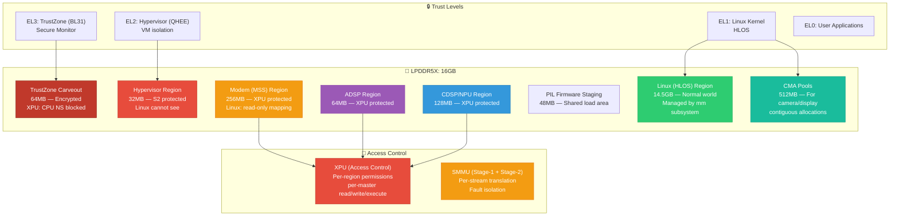
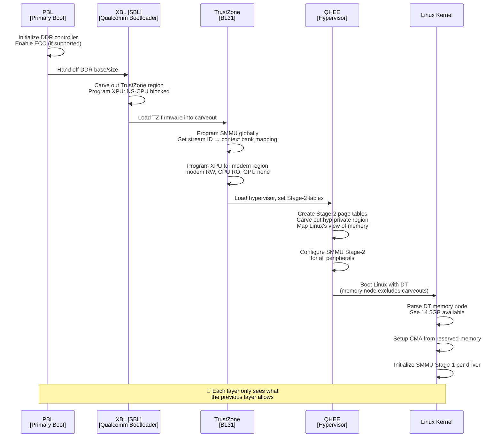
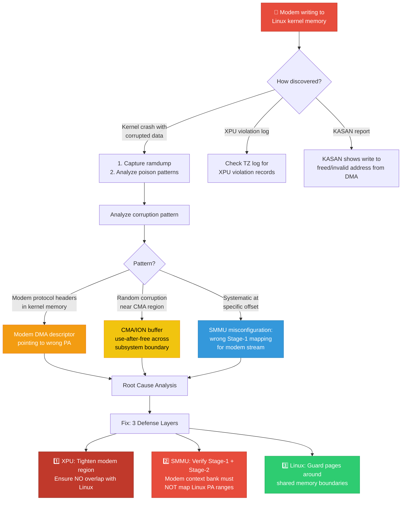
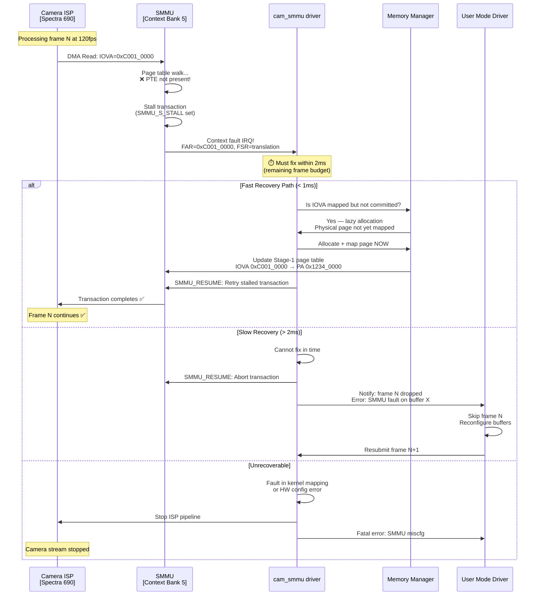
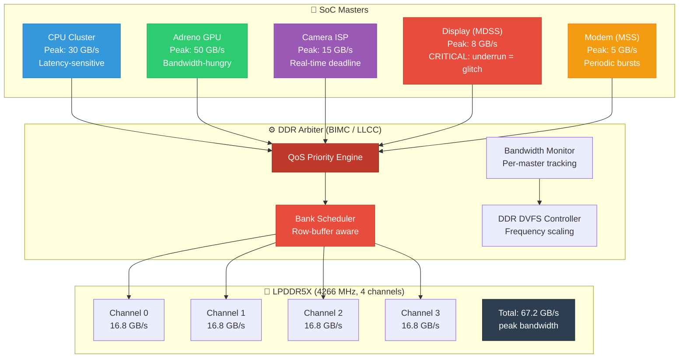
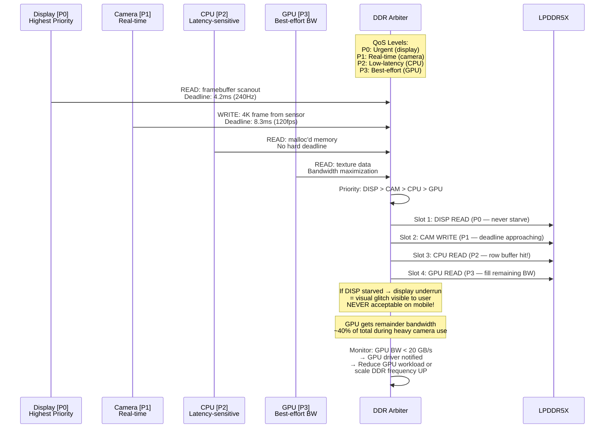
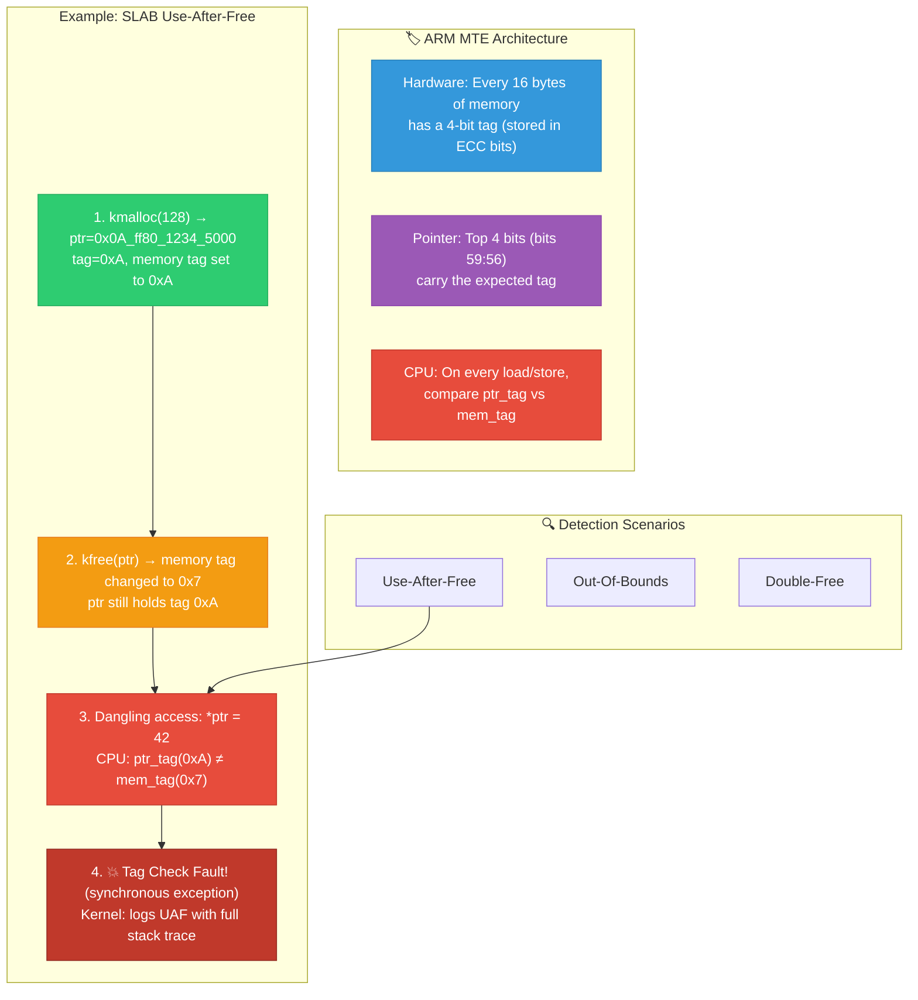
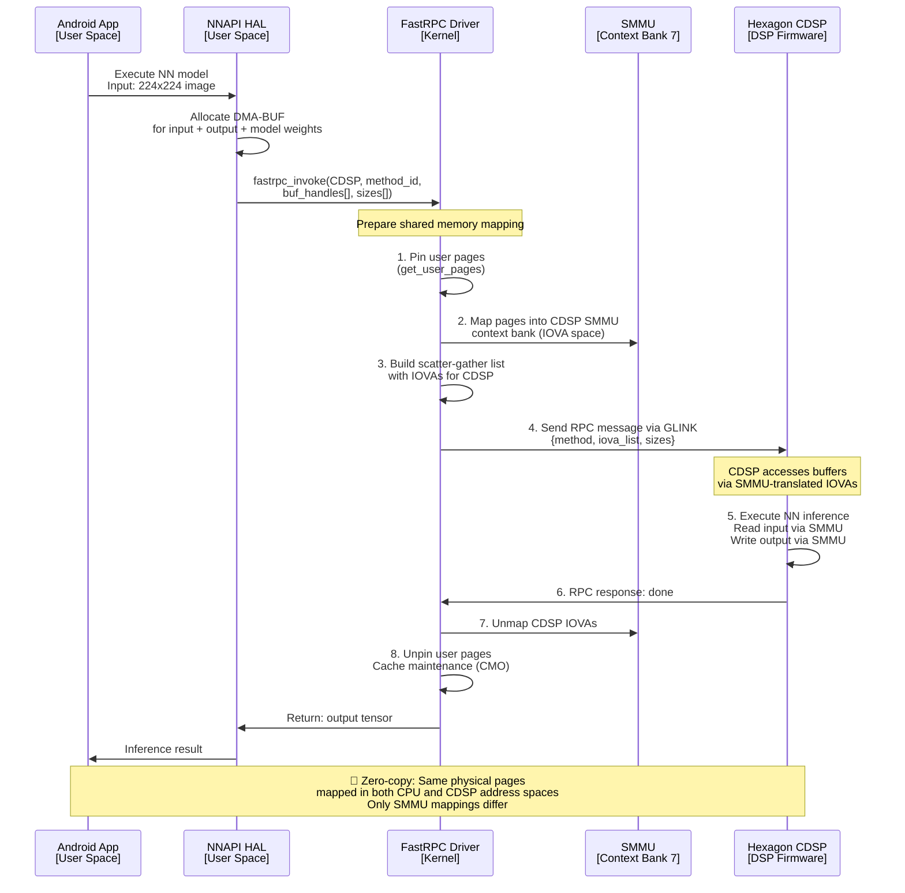
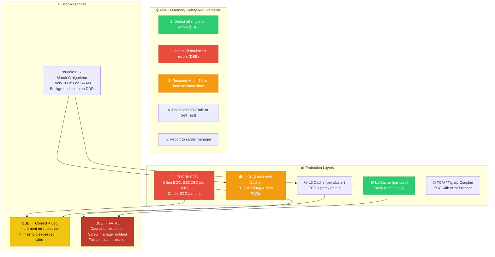
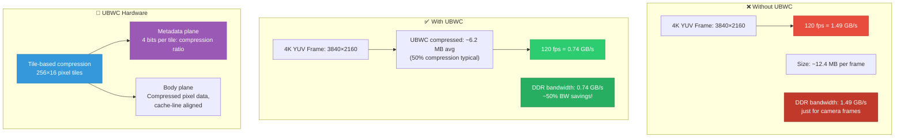

# 21 — Qualcomm: 15-Year Experience System Design Deep Interview — Memory Management

> **Target**: Principal/Staff Engineer interviews at Qualcomm (Snapdragon, Modem, Multimedia, Auto)
> **Level**: 15+ years — You are expected to architect SoC memory subsystems, design memory protection schemes, debug system-level memory corruption, and make silicon-level tradeoff decisions.

---

## 📌 Interview Focus Areas

| Domain | What Qualcomm Expects at 15yr Level |
|--------|--------------------------------------|
| **SMMU 3.x Deep Internals** | Multi-level page tables, stream ID mapping, nested translation, fault recovery |
| **SoC Memory Partitioning** | TrustZone + Hypervisor memory carve-outs, MPU/XPU programming, memory firewall |
| **Multi-subsystem Memory Isolation** | Modem, ADSP, CDSP, Camera — each with isolated memory and crash recovery |
| **DDR/LPDDR5 Controller Design** | Channel interleaving, bank scheduling, QoS arbitration, power states |
| **Shared Memory IPC Architecture** | SMEM, GLINK, shared DMA-BUF pools, reference counting across subsystems |
| **Memory Corruption Debugging at SoC Scale** | KASAN, HW memory tagging (MTE), XPU violation analysis, crash dump analysis |
| **Automotive Memory Safety** | ASIL-B/D requirements, lockstep, ECC, memory integrity monitoring |
| **UBWC (Universal Bandwidth Compression)** | Compression tile format, cache-line alignment, BW savings vs CPU penalty |

---

## 🎨 System Design 1: Design the Complete SoC Memory Partitioning for a Snapdragon 8 Gen 3

### Context

Snapdragon 8 Gen 3 has 10+ masters: CPU clusters (Cortex-X4 + A720 + A520), Adreno GPU, Spectra ISP, Hexagon DSP (CDSP, ADSP), modem (MSS), display (MDSS), video codec, NPU, and crypto engine. Each needs isolated memory with different trust levels.

### Architecture Diagram



### Memory Isolation Flow (Boot-Time Setup)



### Deep Q&A

---

#### ❓ Q1: You discover a memory corruption bug where the modem subsystem is overwriting Linux kernel memory. How do you debug and fix this at the SoC level?

**A:** This is a critical security bug — modem should NEVER be able to write to Linux memory.

**Debugging Approach:**



**Detailed debugging with crash dump:**
```bash
# 1. Analyze ramdump with Qualcomm crash tools
python ramparse.py --auto-dump vmlinux ddr_dump.bin

# 2. Find corruption in kernel memory
crash> rd ffffffc010000000 64
# Look for non-kernel data patterns (modem protocol headers)

# 3. Check SMMU fault log
crash> struct arm_smmu_device.faults 0xffffff8012345678
# Check: was there an SMMU context fault before crash?

# 4. Check XPU violation log (in shared IMEM)
crash> rd 0x146BF000 256
# XPU logs: violating master ID, address, permissions

# 5. Analyze modem DMA descriptors
# In modem ramdump section:
# Look at BAM (Bus Access Manager) descriptor rings
# Each descriptor has: PA, size, flags
# Find descriptor pointing to Linux PA range

# 6. SMMU context bank dump
crash> struct arm_smmu_cb_cfg 0xffffff8011234567
# Check input→output address mapping for modem stream
```

**Prevention Architecture:**
```c
/* Triple-layer protection for critical boundaries */

/* Layer 1: XPU (hardware MPU) — programmed by TrustZone */
struct xpu_config modem_region = {
    .base = 0x8B000000,
    .size = SZ_256M,
    .permissions = {
        [MASTER_MSS]     = XPU_RW,    /* Modem: full access */
        [MASTER_APPS_NS] = XPU_RO,    /* Linux: read-only */
        [MASTER_GPU]     = XPU_NONE,  /* GPU: no access */
    },
};

/* Layer 2: SMMU Stage-2 — programmed by hypervisor */
/* Hypervisor ensures modem SMMU cannot translate to Linux PA ranges */
hyp_smmu_s2_add_block(modem_cb, LINUX_PA_BASE, LINUX_PA_SIZE, 
                       HYP_PERM_NONE); /* Block all modem→Linux */

/* Layer 3: Guard pages in Linux */
/* Place unmapped guard pages at shared memory boundaries */
void *shared_start = ioremap(SHARED_MEM_PA, SHARED_MEM_SIZE);
/* Pages at shared_start-PAGE_SIZE and shared_start+SHARED_MEM_SIZE 
   are intentionally unmapped → fault on overflow */
```

---

#### ❓ Q2: Design the SMMU fault recovery mechanism for a camera ISP that processes 120fps 4K video. A transient SMMU fault should NOT cause frame drop.

**A:** Camera ISP at 120fps 4K means 8.3ms per frame. Any SMMU fault that takes longer than 8.3ms to recover → frame drop.



**Implementation:**

```c
/* Qualcomm camera SMMU fault handler */
static int cam_smmu_fault_handler(struct iommu_domain *domain,
                                   struct device *dev,
                                   unsigned long iova, int flags,
                                   void *token)
{
    struct cam_smmu_cb_entry *cb = token;
    struct cam_smmu_fault_info fault = {
        .iova = iova,
        .flags = flags,
        .timestamp = ktime_get(),
    };
    ktime_t deadline;
    int ret;
    
    /* Calculate remaining frame budget */
    deadline = ktime_add_us(cb->frame_start_time,
                            cb->frame_budget_us - 1000); /* 1ms margin */
    
    /* Attempt 1: Check if this is a lazy-mapped buffer */
    ret = cam_smmu_try_lazy_map(cb, iova);
    if (ret == 0) {
        /* Mapped successfully — resume DMA */
        cam_smmu_resume_stall(cb);
        atomic_inc(&cb->stats.faults_recovered);
        return 0;
    }
    
    /* Attempt 2: Check if buffer was recycled but TLB stale */
    if (cam_smmu_try_tlb_sync(cb, iova) == 0) {
        cam_smmu_resume_stall(cb);
        return 0;
    }
    
    /* Check deadline */
    if (ktime_after(ktime_get(), deadline)) {
        /* Too late — abort and drop frame */
        cam_smmu_abort_stall(cb);
        cam_smmu_notify_frame_drop(cb, &fault);
        atomic_inc(&cb->stats.frames_dropped);
        return -ETIMEDOUT;
    }
    
    /* Unrecoverable fault */
    dev_err(dev, "SMMU fault: IOVA=0x%lx flags=0x%x — unrecoverable\n",
            iova, flags);
    cam_smmu_dump_debug(cb);
    cam_smmu_abort_stall(cb);
    return -EIO;
}

/* Stall-and-resume based fault model */
static int cam_smmu_try_lazy_map(struct cam_smmu_cb_entry *cb, 
                                  unsigned long iova)
{
    struct cam_buf_mgr *mgr = cb->buf_mgr;
    struct cam_buffer *buf;
    
    /* Find buffer that contains this IOVA */
    buf = cam_buf_find_by_iova(mgr, iova);
    if (!buf)
        return -ENOENT;
    
    /* Buffer exists but physical pages not committed */
    if (buf->state == CAM_BUF_LAZY) {
        struct page *page = alloc_page(GFP_ATOMIC | __GFP_ZERO);
        if (!page)
            return -ENOMEM;
        
        /* Map into SMMU */
        iommu_map(cb->domain, iova, page_to_phys(page),
                  PAGE_SIZE, IOMMU_READ | IOMMU_WRITE);
        
        buf->state = CAM_BUF_COMMITTED;
        return 0;
    }
    
    return -EINVAL;
}
```

---

#### ❓ Q3: Design the LPDDR5X memory controller QoS arbitration for a mobile SoC where camera, GPU, and CPU compete for DDR bandwidth.

**A:**



**QoS Arbitration Sequence:**



**BIMC/LLCC QoS Configuration (Qualcomm-specific):**

```c
/* QoS port configuration for Qualcomm BIMC 
 * (Bus Integrated Memory Controller) */
struct bimc_qos_config {
    u32 master_id;
    u32 priority_level;       /* 0=Urgent, 1=RT, 2=Low-latency, 3=BE */
    u32 bw_limit_mbps;        /* Max bandwidth cap */
    u32 urgency_threshold;    /* FIFO fullness → raise priority */
    bool regulate;            /* Enable BW regulation */
};

static struct bimc_qos_config soc_qos[] = {
    /* Display: NEVER starve — P0 always */
    { .master_id = MSM_BUS_MASTER_MDP_PORT0,
      .priority_level = 0,
      .bw_limit_mbps = 0,           /* No limit */
      .urgency_threshold = 4,       /* Urgent when 4 entries in FIFO */
      .regulate = false },
    
    /* Camera ISP: Real-time with deadline */
    { .master_id = MSM_BUS_MASTER_VFE,
      .priority_level = 1,
      .bw_limit_mbps = 20000,       /* 20 GB/s max */
      .urgency_threshold = 8,
      .regulate = true },
    
    /* CPU: Low-latency but regulated */
    { .master_id = MSM_BUS_MASTER_APPSS_PROC,
      .priority_level = 2,
      .bw_limit_mbps = 35000,       /* 35 GB/s max */
      .urgency_threshold = 16,
      .regulate = true },
    
    /* GPU: Best-effort, gets remaining BW */
    { .master_id = MSM_BUS_MASTER_GFX3D,
      .priority_level = 3,
      .bw_limit_mbps = 50000,       /* 50 GB/s max */
      .urgency_threshold = 32,
      .regulate = true },
};

/* Runtime BW voting — Linux driver API */
int qcom_icc_set_bw(struct icc_path *path, u32 avg_bw, u32 peak_bw)
{
    /* Camera use case: 120fps 4K capture */
    /* avg = 10 GB/s, peak = 15 GB/s */
    icc_set_bw(cam_path, MBps_to_icc(10000), MBps_to_icc(15000));
    
    /* DDR DVFS: if total demand > current freq capacity → scale up */
    /* total_bw = sum(all master avg_bw) */
    /* if total_bw > ddr_current_capacity * 0.7 → next freq level */
}
```

---

#### ❓ Q4: Design the ARM Memory Tagging Extension (MTE) integration for detecting use-after-free bugs in a Qualcomm Android kernel.

**A:**



**KASAN + MTE Integration in Kernel (production):**

```c
/* SLAB allocator MTE integration — mm/slub.c */

/* On allocation: assign random tag */
static void *slab_alloc_with_mte(struct kmem_cache *s, gfp_t flags)
{
    void *object = slab_alloc_node(s, flags, NUMA_NO_NODE);
    if (!object)
        return NULL;
    
    /* Generate random 4-bit tag (0x1–0xF, avoid 0x0) */
    u8 tag = get_random_tag();
    
    /* Set memory tag for entire allocation */
    mte_set_mem_tag(object, s->object_size, tag);
    
    /* Return tagged pointer */
    return mte_set_ptr_tag(object, tag);
    /* Pointer: 0x0{tag}_xxxx_xxxx_xxxx */
}

/* On free: change memory tag to mismatch old pointers */
static void slab_free_with_mte(struct kmem_cache *s, void *object)
{
    /* Strip tag from pointer for internal use */
    void *untagged = mte_strip_tag(object);
    
    /* Set memory tag to new random value 
     * (different from allocation tag) */
    u8 free_tag;
    do {
        free_tag = get_random_tag();
    } while (free_tag == mte_get_ptr_tag(object));
    
    mte_set_mem_tag(untagged, s->object_size, free_tag);
    
    /* Now any dangling pointer with old tag → mismatch → fault */
    
    slab_free_node(s, untagged);
}

/* ARM MTE hardware instruction wrappers */
static inline void mte_set_mem_tag(void *addr, size_t size, u8 tag)
{
    /* STG: Store Allocation Tag */
    for (size_t i = 0; i < size; i += MTE_GRANULE_SIZE) {
        asm volatile("stg %0, [%0]" : : "r" (addr + i));
    }
}
```

**Qualcomm Android kernel MTE deployment considerations:**
- **Performance**: Synchronous MTE (sync) = ~3-5% overhead. Async MTE = < 1% overhead
- **Production mode**: Use `ASYNC` mode (deferred fault report) for performance
- **Debug mode**: Use `SYNC` mode for exact instruction-level reporting
- **Kernel boot**: `kasan.mode=mte kasan.mte_mode=async` for production

---

#### ❓ Q5: Design the shared memory IPC mechanism between Linux and the Hexagon CDSP for Neural Network inference offload.

**A:**



**Design decisions:**

```c
/* FastRPC shared memory design for CDSP offload */

struct fastrpc_buf {
    struct dma_buf *dmabuf;      /* DMA-BUF handle */
    void *virt;                   /* CPU virtual address */
    dma_addr_t iova;              /* CDSP SMMU IOVA */
    phys_addr_t phys;             /* Physical address */
    size_t size;
    enum {
        CACHE_WRITEBACK,          /* Normal: CPU caches active */
        CACHE_UNCACHED,           /* For DMA coherent access */
        CACHE_WRITETHROUGH,       /* When both CPU and CDSP access */
    } cache_policy;
};

/* Cache coherency management — the hardest part */
int fastrpc_invoke(struct fastrpc_channel *ch,
                    struct fastrpc_invoke_args *args)
{
    int i;
    
    for (i = 0; i < args->nbufs; i++) {
        struct fastrpc_buf *buf = args->bufs[i];
        
        /* CPU → CDSP: flush CPU caches to DDR */
        if (buf->direction == DMA_TO_DEVICE) {
            dma_sync_single_for_device(dev, buf->iova, buf->size,
                                        DMA_TO_DEVICE);
            /* ARM: DC CIVAC — Clean + Invalidate by VA to PoC */
        }
        
        /* Map in CDSP SMMU if not already mapped */
        if (!buf->cdsp_mapped) {
            iommu_map(cdsp_domain, buf->iova, buf->phys,
                      buf->size, IOMMU_READ | IOMMU_WRITE);
            buf->cdsp_mapped = true;
        }
    }
    
    /* Send RPC call to CDSP via GLINK */
    glink_tx(ch->glink_handle, &rpc_msg, sizeof(rpc_msg), 
             GLINK_TX_SINGLE_THREADED);
    
    /* Wait for CDSP response */
    wait_for_completion_timeout(&ch->rpc_done, 
                                 msecs_to_jiffies(5000));
    
    /* CDSP → CPU: invalidate CPU caches */
    for (i = 0; i < args->nbufs; i++) {
        if (args->bufs[i]->direction == DMA_FROM_DEVICE) {
            dma_sync_single_for_cpu(dev, args->bufs[i]->iova,
                                     args->bufs[i]->size,
                                     DMA_FROM_DEVICE);
        }
    }
    
    return 0;
}
```

**Critical tradeoffs:**
1. **Zero-copy vs safety**: Sharing physical pages saves bandwidth but modem/DSP bug can corrupt Linux memory → use SMMU Stage-2 to restrict writable ranges
2. **Cache coherence cost**: Non-coherent DSPs (Hexagon) require explicit cache maintenance → 100μs+ for large buffers
3. **Memory pinning**: Must pin pages during CDSP access → prevents Linux page migration, increases memory pressure
4. **ION/DMA-BUF pool sizing**: Pre-allocate pools for latency-critical paths (camera, audio). Avoid on-demand allocation in fast path.

---

#### ❓ Q6: A Qualcomm automotive SoC needs ASIL-B memory safety. Design the ECC and memory integrity monitoring system.

**A:**



**Memory scrubber implementation:**
```c
/* ECC scrubber for automotive ASIL-B compliance */
struct ecc_scrubber {
    struct task_struct *thread;
    u64 scrub_base;
    u64 scrub_size;
    u64 scrub_interval_ms;      /* 100ms for ASIL-B */
    atomic_t sbe_count;
    atomic_t dbe_count;
    struct safety_manager *sm;
};

/* Background DDR scrubbing thread */
static int ecc_scrub_thread(void *data)
{
    struct ecc_scrubber *scrubber = data;
    u64 offset = 0;
    u64 chunk_size = SZ_1M;  /* Scrub 1MB per iteration */
    
    while (!kthread_should_stop()) {
        void *vaddr = ioremap_cache(scrubber->scrub_base + offset,
                                     chunk_size);
        
        /* Read every cache line → triggers ECC check in DDR controller */
        for (u64 i = 0; i < chunk_size; i += 64) {
            volatile u64 dummy = *(volatile u64 *)(vaddr + i);
            (void)dummy;
        }
        
        iounmap(vaddr);
        
        offset += chunk_size;
        if (offset >= scrubber->scrub_size)
            offset = 0;  /* Wrap around */
        
        /* Yield to not impact real-time tasks */
        schedule_timeout_interruptible(
            msecs_to_jiffies(scrubber->scrub_interval_ms));
    }
    return 0;
}

/* ECC error interrupt handler */
static irqreturn_t ecc_error_handler(int irq, void *dev_id)
{
    struct ecc_scrubber *scrubber = dev_id;
    u32 status = readl(DDR_ECC_STATUS_REG);
    
    if (status & ECC_SBE_MASK) {
        atomic_inc(&scrubber->sbe_count);
        u64 addr = readl(DDR_ECC_SBE_ADDR_REG);
        
        /* Log correctable error */
        edac_mc_handle_error(HW_EVENT_ERR_CORRECTED, ...);
        
        /* Check threshold: > 10 SBEs in 1 hour → degraded state */
        if (atomic_read(&scrubber->sbe_count) > 10)
            safety_manager_report(scrubber->sm, 
                                   SAFETY_MEMORY_DEGRADED);
        
        /* Clear and continue */
        writel(ECC_SBE_MASK, DDR_ECC_CLEAR_REG);
    }
    
    if (status & ECC_DBE_MASK) {
        atomic_inc(&scrubber->dbe_count);
        u64 addr = readl(DDR_ECC_DBE_ADDR_REG);
        
        /* CRITICAL: Uncorrectable error — enter safe state */
        safety_manager_report(scrubber->sm, SAFETY_MEMORY_CRITICAL);
        
        /* Notify automotive safety manager → trigger failsafe */
        emergency_failsafe_transition();
        
        /* Do NOT continue — data integrity compromised */
        panic("ASIL-B: Uncorrectable DDR ECC error at 0x%llx", addr);
    }
    
    return IRQ_HANDLED;
}
```

---

#### ❓ Q7: Explain UBWC (Universal Bandwidth Compression) — how does it reduce DDR bandwidth for camera/display buffers?

**A:**



**How UBWC works internally:**
```
Traditional linear buffer:
┌──────────────────────────────────────────┐
│ Pixel  Pixel  Pixel  Pixel  Pixel  ...   │ Row 0
│ Pixel  Pixel  Pixel  Pixel  Pixel  ...   │ Row 1
│ ...                                       │
└──────────────────────────────────────────┘
Access: row-by-row → poor spatial locality for tiled HW

UBWC buffer:
┌──────────────┐ ┌──────────────┐
│ Metadata      │ │ Body (tiles)  │
│ plane         │ │ plane         │
│               │ │               │
│ 4 bits/tile:  │ │ Tile 0: 85B  │
│ compress info │ │ Tile 1: 120B │
│               │ │ Tile 2: 64B  │ ← Maximum compression
│               │ │ Tile 3: 192B │
│               │ │ ...           │
└──────────────┘ └──────────────┘
Each tile: 256×16 pixels (or variant)
Compressed using:
  - Constant-value compression (solid color → 1 byte)
  - Palette compression (few colors → index)
  - Delta compression (gradients → small deltas)
  - Bypass (random data → store as-is, 256B)
```

**Key tradeoffs:**
- **Saves 30-60% DDR bandwidth** for camera/display/video
- **CPU penalty**: CPU cannot directly access UBWC buffers → must be decompressed for CPU processing
- **Used by**: Camera ISP, Display (MDSS), Video codec, GPU — all have UBWC decode/encode HW
- **Not used by**: CPU, modem (no UBWC HW)

---

[← Previous: 20 — NVIDIA 15yr Deep](20_NVIDIA_15yr_System_Design_Deep_Interview.md) | [Next: 22 — Google 15yr Deep →](22_Google_15yr_System_Design_Deep_Interview.md)
