# 22 — Google: 15-Year Experience System Design Deep Interview — Memory Management

> **Target**: Staff/Principal/Distinguished Engineer interviews at Google (Linux Kernel, Infrastructure, ChromeOS, Android Platform, Cloud/GKE)
> **Level**: 15+ years — You are expected to design fleet-wide memory policies, optimize memory for warehouse-scale computing, and make Linux kernel mm subsystem changes that scale to millions of machines.

---

## 📌 Interview Focus Areas

| Domain | What Google Expects at 15yr Level |
|--------|----------------------------------|
| **cgroup v2 Memory Controller** | Memory limit, OOM handling, memory.high back-pressure, PSI (Pressure Stall Information) |
| **Huge Pages at Fleet Scale** | THP promotion/demotion, khugepaged, fragmentation vs performance, 1G pages |
| **NUMA Optimization** | Memory tiering (CXL), NUMA balancing, page migration, node reclaim |
| **Memory Overcommit & OOM** | Design OOM killer policy for heterogeneous workloads, oom_score_adj |
| **Page Reclaim Under Pressure** | kswapd, direct reclaim, writeback, LRU generations, MGLRU |
| **Memory Accounting at Scale** | RSS vs PSS vs USS, memory.stat, working set estimation |
| **Kernel Memory Allocator Tuning** | SLAB vs SLUB, per-CPU caches, slab merging, memory fragmentation |
| **Memory Safety** | KASAN, KMSAN, KFENCE in production, shadow memory overhead |

---

## 🎨 System Design 1: Design a Fleet-Wide Memory QoS System for Borg/Kubernetes

### Context
Google runs millions of containers on shared bare-metal machines. Each machine has 256GB–2TB RAM. Containers have diverse memory profiles: latency-sensitive (search), throughput (MapReduce), ML training (large working set). You must design the memory QoS system that ensures:
1. Latency-sensitive jobs never OOM or experience reclaim stalls
2. Batch jobs use leftover memory efficiently
3. Total memory utilization > 85% (efficiency target)

### Architecture Diagram

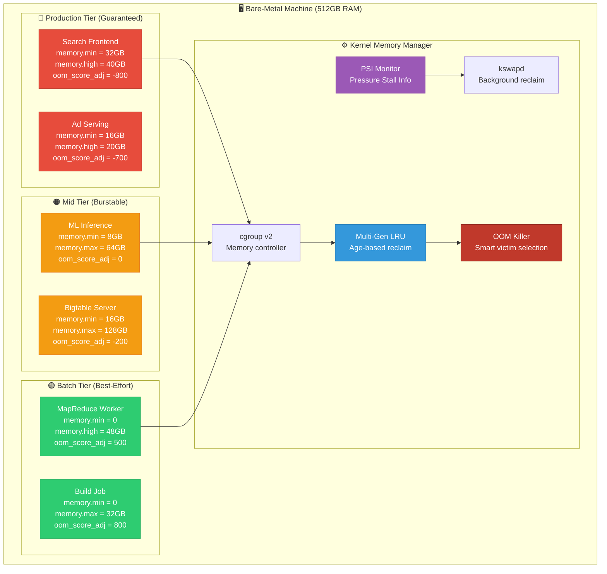

### Memory Pressure Response Sequence

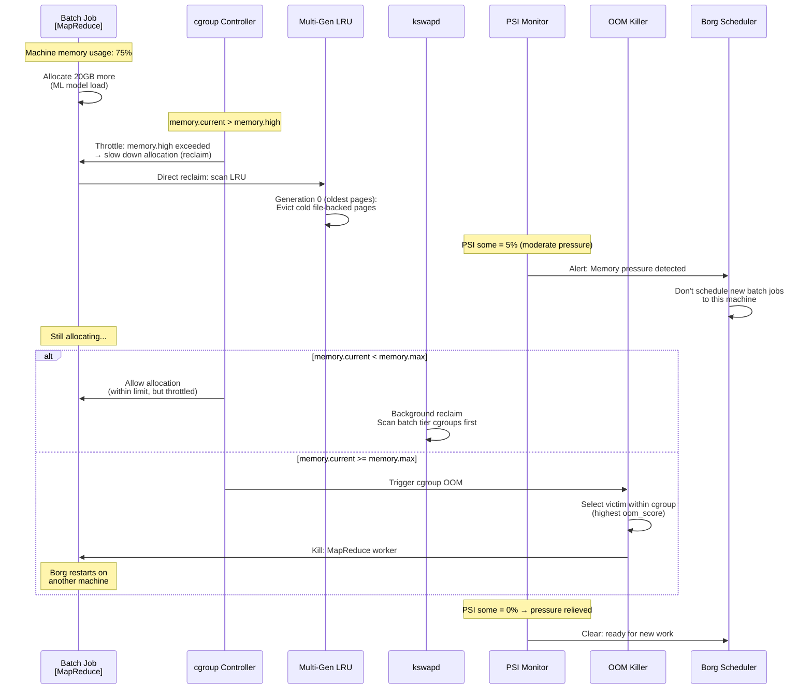

### Deep Q&A

---

#### ❓ Q1: Design the `memory.high` back-pressure mechanism. How does it throttle allocations without killing the process?

**A:** `memory.high` is the most important cgroup memory knob for QoS — it's a soft limit that applies **allocation throttling** instead of OOM killing.

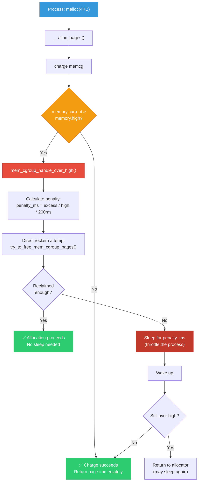

**Implementation details:**

```c
/* mm/memcontrol.c — memory.high throttling */

void mem_cgroup_handle_over_high(gfp_t gfp_mask)
{
    unsigned long usage = page_counter_read(&memcg->memory);
    unsigned long high = READ_ONCE(memcg->memory.high);
    unsigned long penalty_jiffies;
    
    if (usage <= high)
        return;  /* Below soft limit — no throttling */
    
    /* Calculate overage ratio */
    unsigned long overage = usage - high;
    unsigned long penalty_pct = overage * 100 / high;
    
    /* Grow penalty exponentially with overage */
    /* 10% over → 20ms sleep, 50% over → 100ms, 100% over → 200ms */
    penalty_jiffies = msecs_to_jiffies(min(penalty_pct * 2, 200UL));
    
    /* Try reclaiming first (cheaper than sleeping) */
    unsigned long nr_reclaimed = try_to_free_mem_cgroup_pages(
        memcg,
        max(overage >> PAGE_SHIFT, 1UL),  /* nr_pages to reclaim */
        gfp_mask,
        MEMCG_RECLAIM_MAY_SWAP
    );
    
    if (nr_reclaimed >= (overage >> PAGE_SHIFT))
        return;  /* Reclaimed enough — no sleep */
    
    /* Throttle: sleep to slow down allocation rate */
    set_current_state(TASK_KILLABLE);
    schedule_timeout(penalty_jiffies);
    
    /* Track for PSI accounting */
    psi_memstall_enter(&pflags);
    psi_memstall_leave(&pflags);
}
```

**Why `memory.high` matters at Google scale:**
- `memory.max` is a **hard wall** → OOM kill → job restart → wasted work
- `memory.high` is a **rubber wall** → gradual slowdown → job self-regulates
- For batch jobs: set `memory.high` at 80% of `memory.max` → gives 20% buffer before OOM
- For latency-sensitive: set `memory.high = memory.max` → never throttle, just OOM fast if needed

---

#### ❓ Q2: Design the Multi-Generation LRU (MGLRU) and explain why Google contributed it to the kernel upstream. What problem did it solve at fleet scale?

**A:** 

**The problem with traditional LRU:**
```
Classic 2-list LRU (active/inactive):
- One access → page goes to active list
- Clock algorithm to demote active → inactive
- Problem: All pages in active list are "equally hot"
- No age information: a page accessed 1 second ago and 
  one accessed 1 hour ago are in the same list
- Under memory pressure: kswapd scans HUGE lists blindly
- At Google scale: kswapd CPU overhead = 5-15% on some machines
```

**MGLRU Solution:**

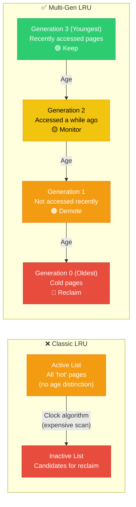

**MGLRU Page Aging Mechanism:**

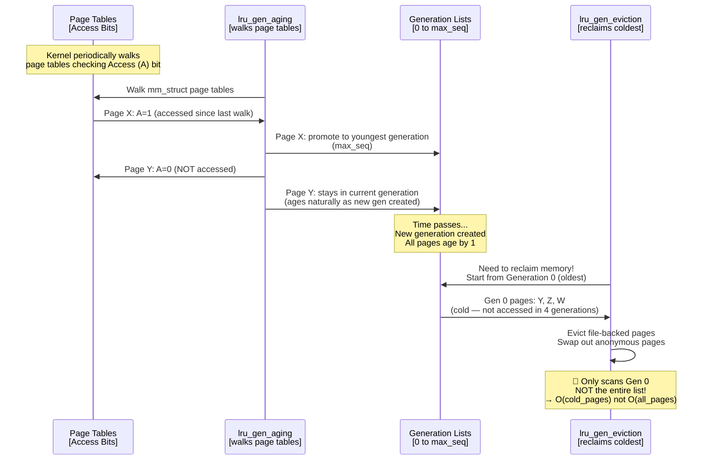

**Google's fleet-scale impact:**

```c
/* Performance comparison at Google fleet scale */

/*
 * Classic LRU (before MGLRU):
 * - kswapd scans active+inactive lists sequentially
 * - Cost: O(total_pages) per reclaim cycle
 * - 256GB machine with 64M pages → scans millions of pages
 * - kswapd CPU: 5-15% during memory pressure
 * - Latency: p99 allocation latency spikes to 100ms+
 * 
 * Multi-Gen LRU (MGLRU):
 * - Only scans coldest generation (Gen 0)
 * - Cost: O(cold_pages) — typically 1-5% of total
 * - Page table walk uses hardware Access bits — efficient
 * - kswapd CPU: < 1% during same pressure
 * - Latency: p99 allocation latency < 5ms
 * 
 * Fleet-wide results (Google internal measurements):
 * - 40% reduction in kswapd CPU overhead
 * - 26% improvement in memory efficiency (can pack more containers)
 * - Major p99 latency improvement for search frontend
 */

/* Enable MGLRU (Linux 6.1+) */
echo y > /sys/kernel/mm/lru_gen/enabled
echo 1000 > /sys/kernel/mm/lru_gen/min_ttl_ms
/* min_ttl_ms: minimum age before a generation can be evicted
 * Prevents premature eviction of recently-touched pages */
```

**Why Google upstreamed it:**
1. **Fleet-scale efficiency**: Even 1% improvement across millions of machines = enormous savings
2. **Reduced tail latency**: kswapd scanning spikes caused p99 search delays
3. **Better container isolation**: Classic LRU had global scanning → noisy neighbor effects between containers
4. **Upstream maintenance**: Maintaining out-of-tree patches across kernel versions was expensive

---

#### ❓ Q3: Design a CXL memory tiering system for a Google cloud server with 256GB DDR5 + 1TB CXL-attached memory. How does the kernel decide which pages go where?

**A:**

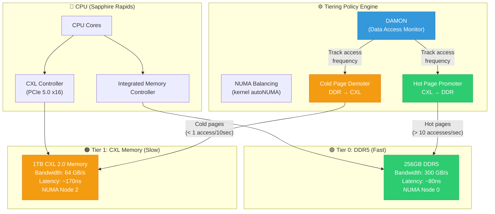

**Tiering Decision Sequence:**

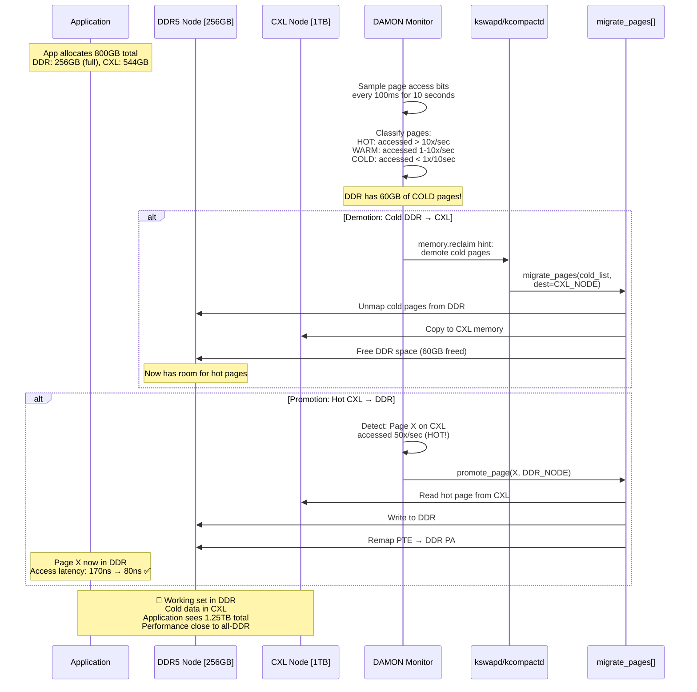

**DAMON-based tiering configuration:**

```bash
# Linux 6.x CXL memory tiering setup

# 1. Verify CXL memory detected as NUMA node
numactl -H
# Node 0: 256GB (DDR5)
# Node 2: 1024GB (CXL, interleaved)

# 2. Set up memory tiering
echo 2 > /sys/devices/system/node/node0/memtier
echo 1 > /sys/devices/system/node/node2/memtier
# Higher tier = faster. Demotion: tier 2 → tier 1

# 3. Enable NUMA balancing (promotion)
echo 2 > /proc/sys/kernel/numa_balancing
# 0=off, 1=classic, 2=tiered (promote + demote)

# 4. Configure DAMON for demotion policy
cd /sys/kernel/mm/damon/admin
echo "demotion" > kdamonds/0/contexts/0/schemes/0/action
echo "1000000" > kdamonds/0/contexts/0/schemes/0/access_pattern/sz/min
echo "0" > kdamonds/0/contexts/0/schemes/0/access_pattern/nr_accesses/max
echo "10000000" > kdamonds/0/contexts/0/schemes/0/access_pattern/age/min
# Demote pages > 1MB, 0 accesses, older than 10 seconds

# 5. Start monitoring
echo "on" > kdamonds/0/state
```

**Kernel implementation:**
```c
/* mm/memory-tiers.c — Memory tier management */

struct memory_tier {
    int tier_id;              /* Higher = faster */
    struct list_head nodes;   /* NUMA nodes in this tier */
    int demote_tier_id;       /* Where to demote cold pages */
};

/* Demotion path: called by kswapd when DDR node is under pressure */
int demote_folio(struct folio *folio, struct list_head *demote_folios)
{
    int target_nid = next_demotion_node(folio_nid(folio));
    
    if (target_nid == NUMA_NO_NODE)
        return -ENOSPC;  /* No lower tier available */
    
    /* Migrate folio to CXL node */
    return migrate_folio_to_node(folio, target_nid, 
                                  MIGRATE_ASYNC, MR_DEMOTION);
}

/* Promotion path: called by NUMA balancing when hot CXL page detected */
void numa_promote_preferred(struct task_struct *p, struct folio *folio)
{
    int src_nid = folio_nid(folio);
    int dst_nid = p->numa_preferred_nid;
    
    /* Only promote if destination is a higher tier */
    if (node_tier(dst_nid) <= node_tier(src_nid))
        return;
    
    /* Rate limit: don't overwhelm DDR migration bandwidth */
    if (p->numa_scan_period < MIN_PROMOTION_INTERVAL)
        return;
    
    migrate_misplaced_folio(folio, dst_nid);
}
```

**Design tradeoffs:**
| Decision | Option A | Option B | Google's Choice |
|----------|----------|----------|-----------------|
| Promotion trigger | Hardware PMU sampling | NUMA fault-based | **NUMA faults** (lower overhead) |
| Demotion trigger | Watermark (kswapd) | DAMON cold detection | **Both** (watermark for urgency, DAMON for proactive) |
| Migration granularity | 4KB pages | 2MB THP | **2MB** (amortize migration cost) |
| Hot threshold | Fixed (N accesses) | Adaptive (percentile) | **Adaptive** (varies by workload) |

---

#### ❓ Q4: An SRE reports that a Bigtable server process has RSS of 180GB but the working set is only 40GB. The remaining 140GB are stale cached data. How do you reclaim it without impacting latency?

**A:**

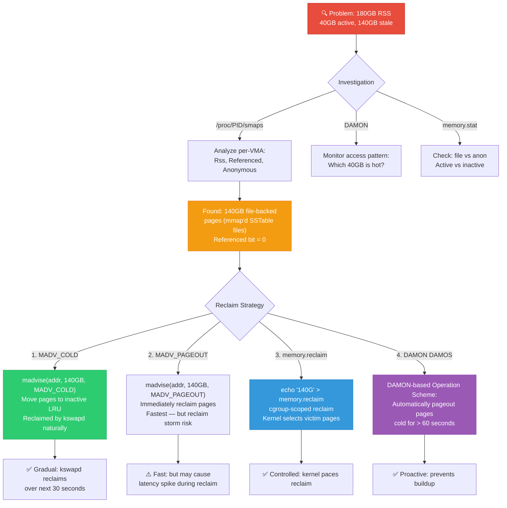

**Production solution — DAMON-based proactive reclaim:**

```c
/* Google's approach: Use DAMON to continuously identify and 
 * reclaim cold memory at a controlled rate */

/* DAMOS (DAMON-based Operation Schemes) configuration */
struct damos cold_reclaim_scheme = {
    /* Target: pages accessed 0 times in 60 seconds */
    .pattern = {
        .min_sz_region = PAGE_SIZE,
        .max_sz_region = ULONG_MAX,
        .min_nr_accesses = 0,       /* Zero accesses */
        .max_nr_accesses = 0,
        .min_age_region = 60,       /* Seconds cold */
        .max_age_region = UINT_MAX,
    },
    /* Action: page out to disk/swap */
    .action = DAMOS_PAGEOUT,
    
    /* Rate limiting: max 1GB/sec reclaim to avoid latency impact */
    .quota = {
        .sz = SZ_1G,
        .reset_interval = MSEC_PER_SEC,
    },
    
    /* Watermarks: only reclaim when memory pressure exists */
    .wmarks = {
        .metric = DAMOS_WMARK_FREE_MEM_RATE,
        .high = 20,    /* Start reclaiming when free < 20% */
        .mid = 15,     /* Target free = 15% */
        .low = 10,     /* Urgent reclaim below 10% */
    },
};
```

**The `memory.reclaim` interface (Linux 6.0+, Google contribution):**

```bash
# Proactive reclaim for a specific cgroup
echo "3G" > /sys/fs/cgroup/bigtable/memory.reclaim
# Kernel reclaims ~3GB from this cgroup
# Prefers file-backed pages, avoids hot anonymous pages
# Returns success when target is met, or partial reclaim amount

# Google's agent runs this periodically:
while true; do
    current=$(cat /sys/fs/cgroup/bigtable/memory.current)
    target=40G  # Known working set
    excess=$((current - target))
    if [ $excess -gt 0 ]; then
        echo "${excess}" > /sys/fs/cgroup/bigtable/memory.reclaim
    fi
    sleep 30
done
```

---

#### ❓ Q5: Design the OOM killer policy for a machine running search-serving (critical) and batch MapReduce (expendable). The default OOM killer is not suitable — why, and what do you replace it with?

**A:**

**Why default OOM killer fails:**

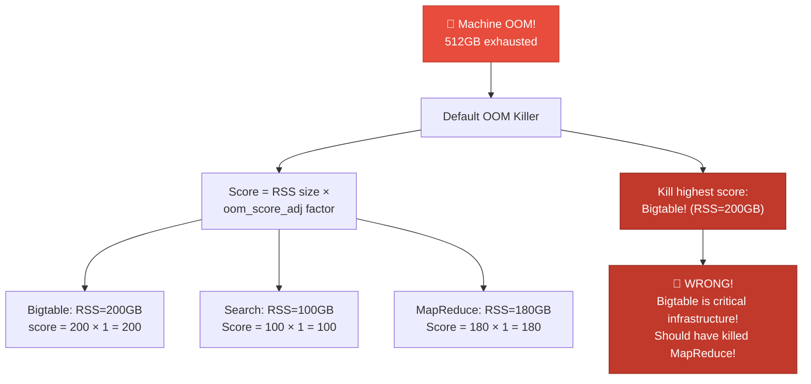

**Google's approach — User-space OOM killer with PSI:**

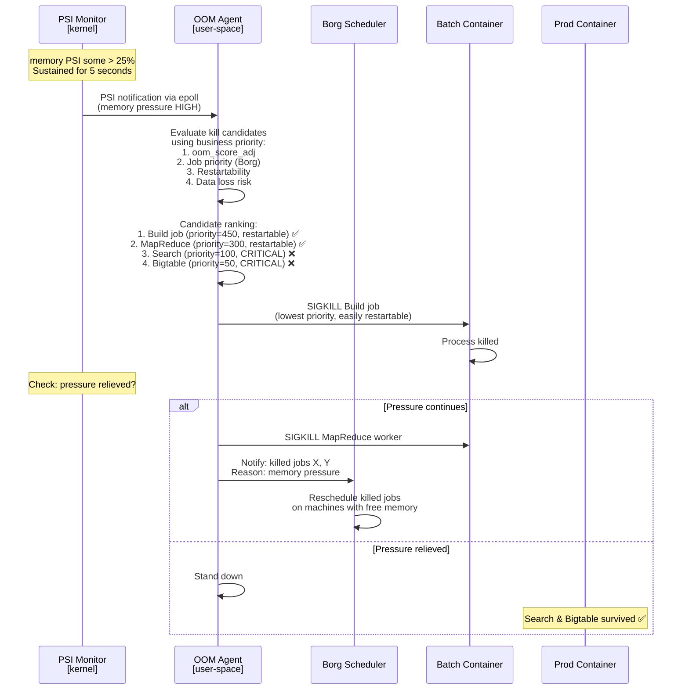

**Implementation — PSI-based OOM agent:**

```c
/* User-space OOM killer agent (simplified) */

#define PSI_THRESHOLD "some 250000 1000000"
/* Trigger when >25% of time in memory stall over 1-second window */

int main(void) 
{
    int fd = open("/proc/pressure/memory", O_RDWR | O_NONBLOCK);
    
    /* Register PSI trigger */
    write(fd, PSI_THRESHOLD, strlen(PSI_THRESHOLD));
    
    struct pollfd fds = { .fd = fd, .events = POLLPRI };
    
    while (1) {
        int ret = poll(&fds, 1, -1);
        if (ret > 0 && (fds.revents & POLLPRI)) {
            handle_memory_pressure();
        }
    }
}

void handle_memory_pressure(void)
{
    struct kill_candidate *candidates;
    int n = 0;
    
    /* Enumerate all cgroups */
    DIR *d = opendir("/sys/fs/cgroup");
    /* ... iterate cgroups ... */
    
    /* Score each container */
    for (each cgroup) {
        candidates[n].cgroup = cgroup;
        candidates[n].priority = read_borg_priority(cgroup);
        candidates[n].memory = read_file_u64(cgroup, "memory.current");
        candidates[n].restartable = is_restartable(cgroup);
        
        /* Composite score: lower = kill first */
        candidates[n].kill_score = 
            candidates[n].priority * 1000 +  /* Business priority dominates */
            (candidates[n].restartable ? 0 : 500) +
            (1000 - candidates[n].memory / SZ_1G);  /* Larger = more memory freed */
        n++;
    }
    
    /* Sort: lowest score = best kill candidate */
    qsort(candidates, n, sizeof(*candidates), compare_score);
    
    /* Kill from lowest score until pressure relieved */
    for (int i = 0; i < n; i++) {
        if (!check_psi_still_high())
            break;
        
        /* Kill entire cgroup */
        write_file(candidates[i].cgroup, "cgroup.kill", "1");
        
        syslog(LOG_WARNING, "OOM: killed cgroup %s (priority=%d, memory=%luGB)",
               candidates[i].cgroup, candidates[i].priority,
               candidates[i].memory / SZ_1G);
        
        /* Wait 500ms for memory to be freed */
        usleep(500000);
    }
}
```

---

#### ❓ Q6: How would you measure the true working set size (WSS) of a process at Google scale, and why is RSS not sufficient?

**A:**

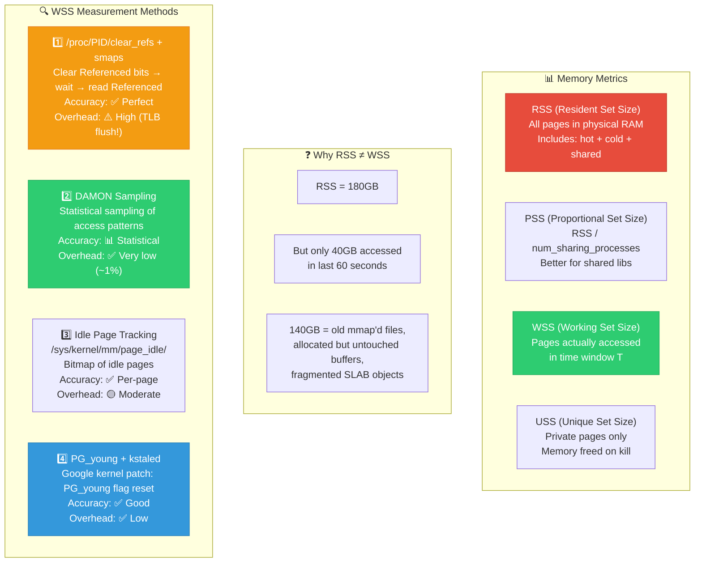

**Google's practical WSS measurement with idle page tracking:**

```c
/* Idle page tracking — /sys/kernel/mm/page_idle/ */

/*
 * Algorithm:
 * 1. Mark all pages as "idle"
 * 2. Wait T seconds (e.g., 60s)
 * 3. Scan pages: if still "idle" → not accessed → cold
 *    if NOT idle → accessed → part of WSS
 */

int measure_wss(pid_t pid, int window_seconds)
{
    size_t wss = 0;
    
    /* Step 1: Get page frame numbers from /proc/PID/pagemap */
    int pagemap_fd = open_fmt("/proc/%d/pagemap", pid);
    int idle_fd = open("/sys/kernel/mm/page_idle/bitmap", O_RDWR);
    
    /* Step 2: Mark all pages as idle */
    for (each vma in /proc/PID/maps) {
        for (each page in vma) {
            uint64_t pfn = read_pagemap(pagemap_fd, va);
            if (pfn == 0) continue;  /* Not resident */
            
            /* Set idle flag */
            uint64_t idle_offset = (pfn / 64) * 8;
            uint64_t idle_bit = 1ULL << (pfn % 64);
            
            uint64_t bits;
            pread(idle_fd, &bits, 8, idle_offset);
            bits |= idle_bit;
            pwrite(idle_fd, &bits, 8, idle_offset);
        }
    }
    
    /* Step 3: Wait for measurement window */
    sleep(window_seconds);
    
    /* Step 4: Read back — non-idle pages = working set */
    for (each page) {
        uint64_t pfn = read_pagemap(pagemap_fd, va);
        
        uint64_t bits;
        pread(idle_fd, &bits, 8, (pfn / 64) * 8);
        
        if (!(bits & (1ULL << (pfn % 64)))) {
            /* Page was accessed! (idle flag cleared by HW) */
            wss += PAGE_SIZE;
        }
    }
    
    return wss;
}
```

**At Google scale (practical):**
```bash
# Google's fleet WSS measurement tool (simplified)
# Runs on every machine, reports to Monarch monitoring

# DAMON-based (preferred — low overhead)
cd /sys/kernel/mm/damon/admin
# Configure DAMON for the target process
echo $PID > kdamonds/0/contexts/0/targets/0/pid_target
echo "on" > kdamonds/0/state

# Read working set estimate from DAMON
cat /sys/kernel/mm/damon/admin/kdamonds/0/contexts/0/schemes/tried_regions
# Output: regions classified by access frequency
# Sum of "hot" regions = WSS estimate

# Fleet-wide insight:
# Average machine: RSS utilization 85%, but WSS only 55%
# → 30% of "used" memory is actually reclaimable
# → This drives memory.high tuning decisions
```

---

#### ❓ Q7: Design a kernel memory fragmentation mitigation system for long-running servers. After 30 days uptime, huge page allocation fails 50% of the time.

**A:**

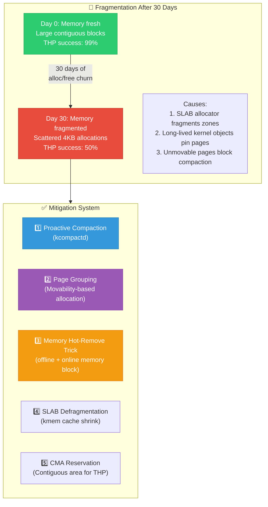

**Proactive Compaction Configuration:**

```bash
# Linux 5.9+: Proactive compaction (Google contribution)

# Enable proactive compaction
echo 20 > /proc/sys/vm/compaction_proactiveness
# Range: 0 (off) to 100 (aggressive)
# 20 = compact when fragmentation score > 20%

# Monitor fragmentation
cat /proc/buddyinfo
# Node 0, zone   Normal 1234  567  234   89   12    5    2    1    0    0    0
#                 4KB  8KB  16KB  32KB  ...                            4MB
# Want: right side (large blocks) should have entries

# Per-zone fragmentation index
cat /sys/kernel/debug/extfrag/extfrag_index
# Shows fragmentation severity per zone per order

# Compact all zones NOW (manual trigger)
echo 1 > /proc/sys/vm/compact_memory

# Monitor compaction effectiveness
cat /proc/vmstat | grep compact
# compact_stall         12345  (direct compaction attempts)
# compact_success       11000  (successful!)
# compact_fail          1345   (failed — unmovable pages)
# compact_migrate_scanned 5000000 (pages scanned for migration)
```

**Custom defragmentation daemon for Google servers:**

```c
/* Proactive defrag agent — runs during low-load periods */

void defrag_agent_main(void)
{
    while (1) {
        /* Only defrag during low-load periods */
        double load = getloadavg_1min();
        if (load > 0.5)
            goto sleep;
        
        /* Check fragmentation score */
        int frag_score = read_fragmentation_index(ZONE_NORMAL, 
                                                    PMD_ORDER);
        if (frag_score < 30)
            goto sleep;  /* Fragmentation acceptable */
        
        /* Strategy 1: Trigger compaction */
        write_file("/proc/sys/vm/compact_memory", "1");
        
        /* Strategy 2: Shrink SLAB caches */
        write_file("/proc/sys/vm/drop_caches", "2"); /* dentries+inodes */
        
        /* Strategy 3: SLAB-specific shrink */
        for (each slab in /sys/kernel/slab/) {
            int slabs = read_file_int(slab, "slabs");
            int partial = read_file_int(slab, "partial");
            
            /* Shrink highly fragmented caches */
            if (partial * 100 / slabs > 50) {
                write_file(slab, "shrink", "1");
            }
        }
        
        /* Strategy 4: If still fragmented → memory hot-remove trick */
        if (read_fragmentation_index(ZONE_NORMAL, PMD_ORDER) > 60) {
            /* Offline a memory block → forces migration of all pages */
            write_file("/sys/devices/system/memory/memoryN/state", 
                       "offline");
            usleep(100000);
            /* Online it again → fresh contiguous block */
            write_file("/sys/devices/system/memory/memoryN/state", 
                       "online");
        }
        
sleep:
        sleep(300);  /* Check every 5 minutes */
    }
}
```

**Key insights for Google's fleet:**
1. **THP promotion rate** is tracked fleet-wide via `/proc/vmstat` `thp_fault_alloc` vs `thp_fault_fallback`
2. **Compaction success rate** below 90% triggers automated investigation
3. **Memory hot-remove** is used as a last resort on machines with persistent fragmentation
4. **CMA reservation** of 512MB-2GB dedicated to THP allocation avoids fragmentation entirely for critical workloads
5. **SLAB merging** (`slub_merge=y`) reduces the number of distinct caches → reduces fragmentation sources

---

[← Previous: 21 — Qualcomm 15yr Deep](21_Qualcomm_15yr_System_Design_Deep_Interview.md) | [Back to Index →](../ReadMe.Md)
