# 23 — Page Table Walk: Complete Deep Dive from Scratch

> **Scope**: Everything about page table walks — virtual-to-physical address translation, multi-level page tables (x86_64 4-level, ARM64 4-level), TLB interaction, kernel `__handle_mm_fault` path, hardware vs software walks, huge page walks, and kernel page table APIs.
> **Level**: Beginner → Advanced → Interview-ready (15yr Staff/Principal)

---

## Table of Contents

1. [Why Page Tables Exist](#1-why-page-tables-exist)
2. [Single-Level Page Table (Concept)](#2-single-level-page-table)
3. [Multi-Level Page Tables](#3-multi-level-page-tables)
4. [x86_64 4-Level Page Table Walk](#4-x86_64-4-level-page-table-walk)
5. [ARM64 (AArch64) Page Table Walk](#5-arm64-page-table-walk)
6. [5-Level Page Tables (LA57)](#6-5-level-page-tables)
7. [TLB and Page Table Walk Interaction](#7-tlb-and-page-table-walk)
8. [Linux Kernel Page Table Walk Code](#8-linux-kernel-page-table-walk-code)
9. [Page Fault → Page Table Walk Flow](#9-page-fault-flow)
10. [Huge Pages and Page Table Walk](#10-huge-pages-and-page-table-walk)
11. [Kernel vs User Page Tables (KPTI)](#11-kpti)
12. [Deep Interview Q&A (25 Questions)](#12-deep-interview-qa)

---

## 1. Why Page Tables Exist

Every process thinks it has the entire address space to itself. The CPU must translate **virtual addresses** (what the process uses) to **physical addresses** (actual RAM locations). The **page table** is the data structure that holds this mapping.

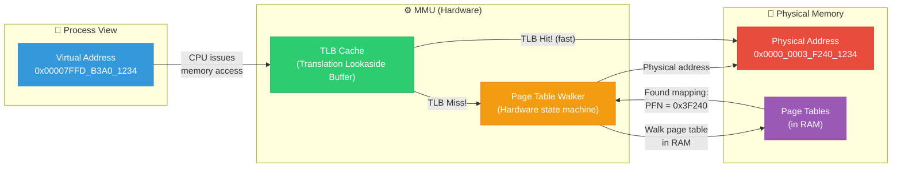

**Key Insight:** Without page tables, every process would need its own contiguous physical memory — impossible with multiple processes. Page tables provide the **indirection layer** that makes virtual memory work.

---

## 2. Single-Level Page Table (Concept)

The simplest page table: one flat array indexed by the virtual page number.

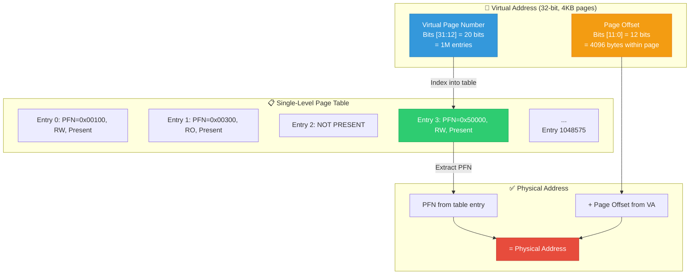

**Problem with single-level:**
```
32-bit address space, 4KB pages:
  Entries needed = 2^32 / 2^12 = 2^20 = 1,048,576 entries
  Each entry = 4 bytes
  Page table size = 4 MB PER PROCESS!

64-bit address space:
  Entries needed = 2^64 / 2^12 = 2^52 = 4,503,599,627,370,496 entries
  Page table size = 32 PB PER PROCESS! ← IMPOSSIBLE!
```

**Solution: Multi-level page tables** — only allocate page table pages for regions of the virtual address space that are actually used.

---

## 3. Multi-Level Page Tables

Instead of one giant flat table, we create a **tree** of smaller tables. Each level covers a portion of the virtual address bits.

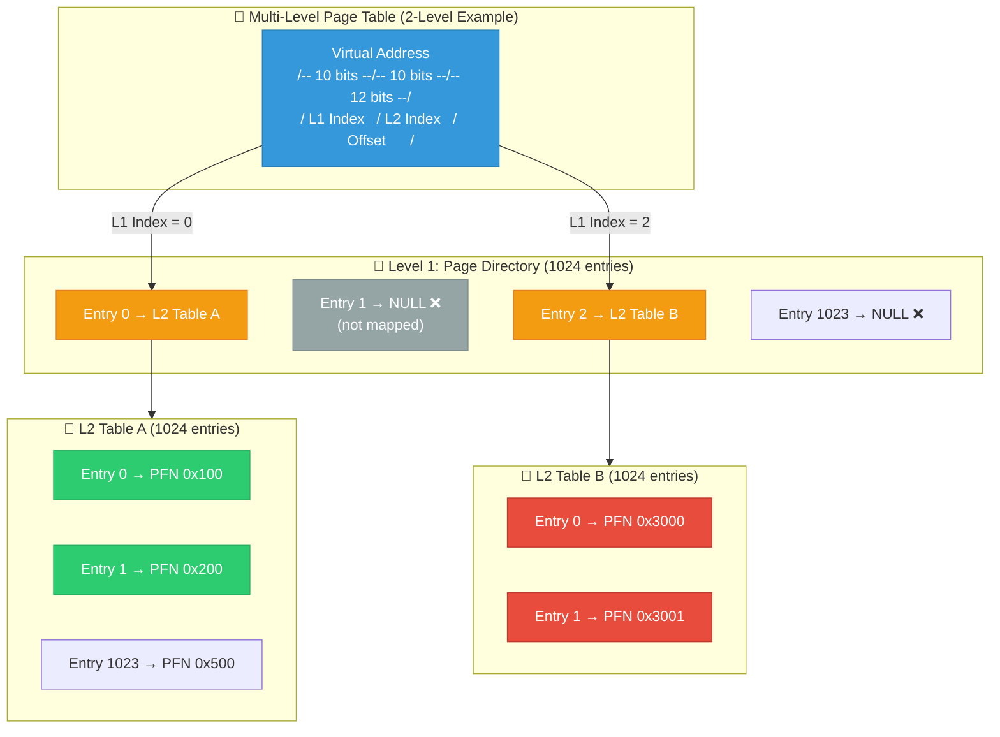

**Memory savings:**
```
Process uses only 2 regions of VAS (code + stack):
  Single-level: 4 MB (must allocate entire table)
  Two-level:    4 KB (L1) + 2 × 4 KB (L2) = 12 KB!
  
  Savings: 99.7%!
```

---

## 4. x86_64 4-Level Page Table Walk

Modern x86_64 uses **4 levels** with 48-bit virtual addresses:

### 4.1 Virtual Address Bit Layout

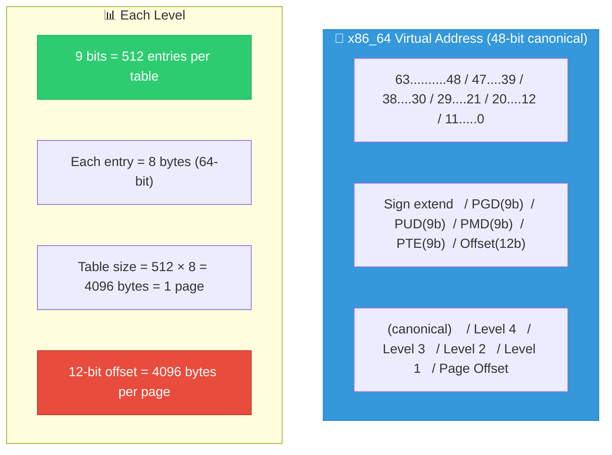

### 4.2 Complete x86_64 Page Table Walk

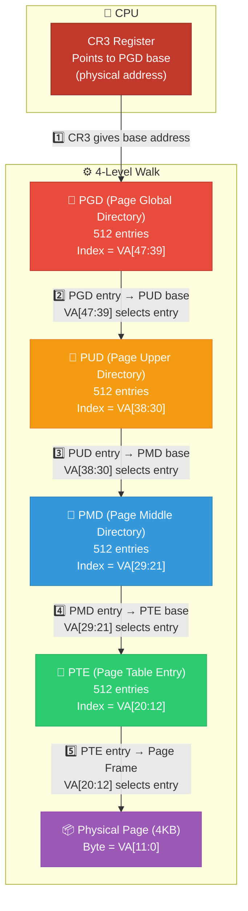

### 4.3 Page Table Entry Format (x86_64 PTE)

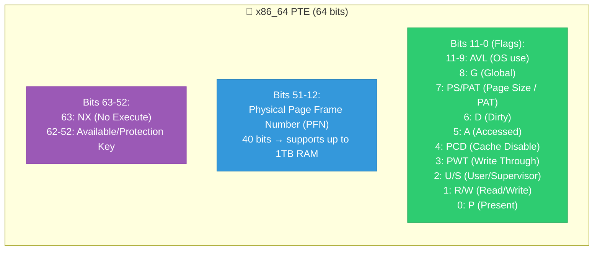

### 4.4 x86_64 Walk — Step-by-Step with Real Numbers

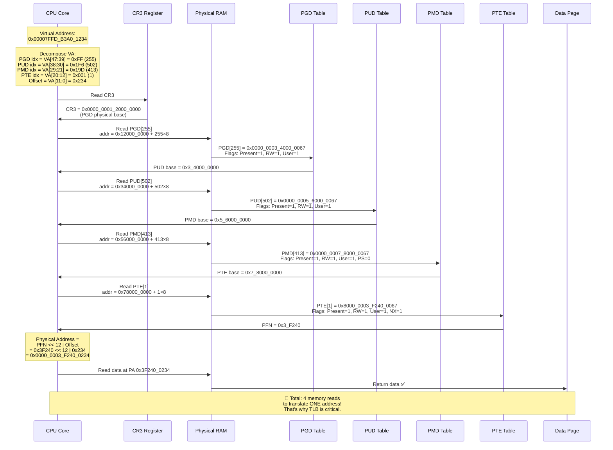

---

## 5. ARM64 (AArch64) Page Table Walk

ARM64 uses a similar 4-level scheme but with different register names.

```mermaid
flowchart TD
    subgraph ARM_Walk["🔵 ARM64 Page Table Walk (4KB granule, 48-bit VA)"]
        TTBR["TTBR0_EL1 (user) / TTBR1_EL1 (kernel)<br/>Translation Table Base Register"]
        
        L0["Level 0 Table<br/>Index = VA[47:39]<br/>512 entries"]
        L1["Level 1 Table<br/>Index = VA[38:30]<br/>512 entries"]
        L2["Level 2 Table<br/>Index = VA[29:21]<br/>512 entries"]
        L3["Level 3 Table<br/>Index = VA[20:12]<br/>512 entries"]
        DATA["Physical Page<br/>Offset = VA[11:0]"]
    end
    
    TTBR -->|"1️⃣"| L0
    L0 -->|"2️⃣ Table descriptor"| L1
    L1 -->|"3️⃣ Table descriptor<br/>OR 1GB block (huge)"| L2
    L2 -->|"4️⃣ Table descriptor<br/>OR 2MB block (huge)"| L3
    L3 -->|"5️⃣ Page descriptor<br/>→ 4KB page"| DATA

    style TTBR fill:#c0392b,stroke:#922b21,color:#fff
    style L0 fill:#e74c3c,stroke:#c0392b,color:#fff
    style L1 fill:#f39c12,stroke:#e67e22,color:#fff
    style L2 fill:#3498db,stroke:#2980b9,color:#fff
    style L3 fill:#2ecc71,stroke:#27ae60,color:#fff
    style DATA fill:#9b59b6,stroke:#8e44ad,color:#fff
```

### ARM64 vs x86_64 Comparison

| Feature | x86_64 | ARM64 (AArch64) |
|---------|--------|-----------------|
| **Base register** | CR3 | TTBR0_EL1 (user), TTBR1_EL1 (kernel) |
| **Levels** | 4 (PGD→PUD→PMD→PTE) | 4 (L0→L1→L2→L3) |
| **Level names (Linux)** | PGD, PUD, PMD, PTE | Same (Linux abstracts) |
| **Entry size** | 8 bytes | 8 bytes |
| **Entries/table** | 512 | 512 (4KB granule) |
| **Page sizes** | 4KB, 2MB, 1GB | 4KB, 2MB, 1GB (4KB granule) |
| **Granule options** | Only 4KB | 4KB, 16KB, 64KB |
| **NX bit** | Bit 63 | UXN/PXN (separate user/kernel) |
| **User/Kernel split** | Top bit of VA (canonical) | TTBR0 (lower) / TTBR1 (upper) |
| **ASID** | PCID (12-bit, in CR3) | ASID (8 or 16-bit, in TTBR) |
| **Walk hardware** | PMH (Page Miss Handler) | Table Walk Unit |

### ARM64 Descriptor Format

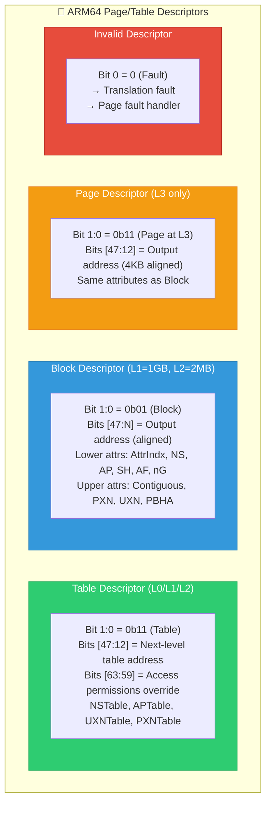

---

## 6. 5-Level Page Tables (LA57)

Intel introduced 5-level paging (LA57) to extend virtual address space from 48 bits to **57 bits**.

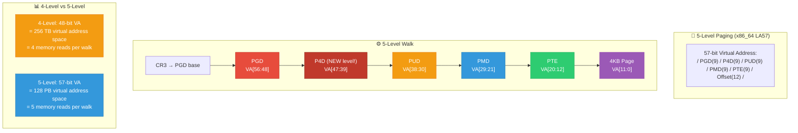

```c
/* Linux kernel: 5-level paging page table types */

/* CONFIG_PGTABLE_LEVELS = 5 */

typedef struct { pgdval_t pgd; } pgd_t;  /* Level 5 (top) */
typedef struct { p4dval_t p4d; } p4d_t;  /* Level 4 (NEW) */
typedef struct { pudval_t pud; } pud_t;  /* Level 3 */
typedef struct { pmdval_t pmd; } pmd_t;  /* Level 2 */
typedef struct { pteval_t pte; } pte_t;  /* Level 1 (bottom) */

/*
 * When 5-level is disabled (default for most systems):
 * p4d_t is "folded" — pgd_offset returns p4d directly
 * → transparent to all code, zero overhead.
 */
```

---

## 7. TLB and Page Table Walk Interaction

The TLB caches page table walk results. Without TLB, every memory access would require 4-5 extra memory reads!

### 7.1 TLB Lookup Flow

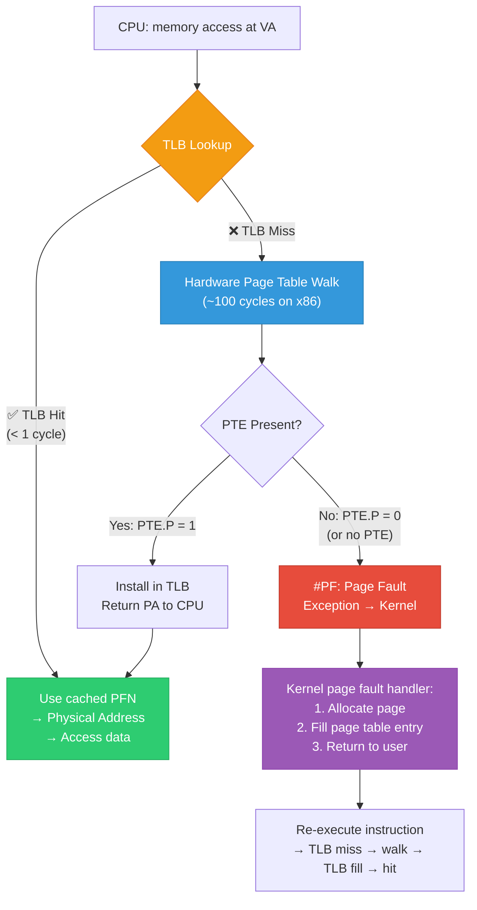

### 7.2 TLB Structure

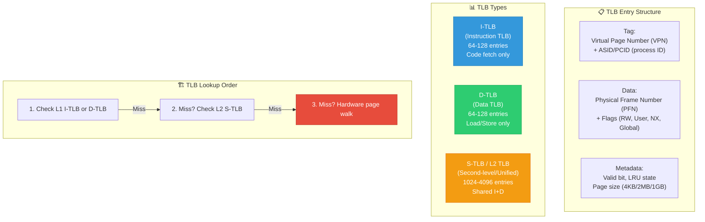

### 7.3 TLB Flush Scenarios

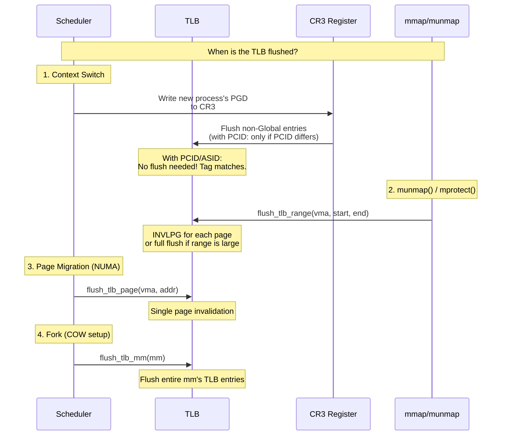

---

## 8. Linux Kernel Page Table Walk Code

### 8.1 Linux Page Table API Hierarchy

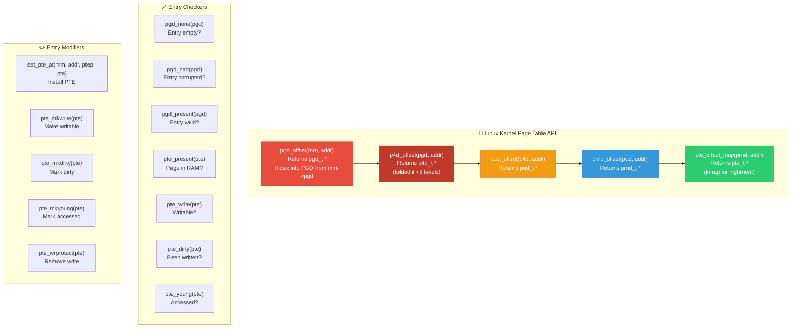

### 8.2 Complete Page Table Walk in Kernel Code

```c
/* How to walk page tables in the Linux kernel */

#include <linux/mm.h>
#include <linux/pagewalk.h>
#include <asm/pgtable.h>

/**
 * Manual page table walk — translate virtual address to physical
 * This is the fundamental operation that the MMU does in hardware.
 * The kernel uses this for page manipulation (COW, migration, etc.)
 */
phys_addr_t kernel_virt_to_phys_walk(struct mm_struct *mm, 
                                      unsigned long vaddr)
{
    pgd_t *pgd;
    p4d_t *p4d;
    pud_t *pud;
    pmd_t *pmd;
    pte_t *pte;
    struct page *page;
    phys_addr_t phys_addr;

    /* Step 1: Get PGD entry
     * pgd_offset() computes:  mm->pgd + pgd_index(vaddr)
     * pgd_index() extracts:   (vaddr >> PGDIR_SHIFT) & (PTRS_PER_PGD - 1)
     * PGDIR_SHIFT = 39 (for 4-level), PTRS_PER_PGD = 512
     */
    pgd = pgd_offset(mm, vaddr);
    if (pgd_none(*pgd) || pgd_bad(*pgd)) {
        pr_err("PGD: no mapping for VA 0x%lx\n", vaddr);
        return 0;
    }

    /* Step 2: Get P4D entry (folded on 4-level systems)
     * On 4-level: p4d_offset(pgd, addr) just returns (p4d_t *)pgd
     * On 5-level: real table walk
     */
    p4d = p4d_offset(pgd, vaddr);
    if (p4d_none(*p4d) || p4d_bad(*p4d)) {
        pr_err("P4D: no mapping for VA 0x%lx\n", vaddr);
        return 0;
    }

    /* Step 3: Get PUD entry
     * pud_offset() computes: (pud_t *)p4d_page_vaddr(*p4d) + pud_index(va)
     * pud_index() extracts:  (vaddr >> PUD_SHIFT) & (PTRS_PER_PUD - 1)
     * PUD_SHIFT = 30
     */
    pud = pud_offset(p4d, vaddr);
    if (pud_none(*pud) || pud_bad(*pud)) {
        pr_err("PUD: no mapping for VA 0x%lx\n", vaddr);
        return 0;
    }
    
    /* Check for 1GB huge page at PUD level */
    if (pud_large(*pud)) {
        /* 1GB huge page: PUD entry directly maps physical frame */
        phys_addr = (pud_pfn(*pud) << PAGE_SHIFT) | 
                    (vaddr & ~PUD_MASK);
        return phys_addr;
    }

    /* Step 4: Get PMD entry
     * PMD_SHIFT = 21
     */
    pmd = pmd_offset(pud, vaddr);
    if (pmd_none(*pmd) || pmd_bad(*pmd)) {
        pr_err("PMD: no mapping for VA 0x%lx\n", vaddr);
        return 0;
    }
    
    /* Check for 2MB huge page at PMD level */
    if (pmd_large(*pmd)) {
        /* 2MB huge page: PMD entry directly maps physical frame */
        phys_addr = (pmd_pfn(*pmd) << PAGE_SHIFT) | 
                    (vaddr & ~PMD_MASK);
        return phys_addr;
    }

    /* Step 5: Get PTE entry
     * pte_offset_map handles highmem (kmap on 32-bit)
     */
    pte = pte_offset_map(pmd, vaddr);
    if (!pte || pte_none(*pte)) {
        pr_err("PTE: no mapping for VA 0x%lx\n", vaddr);
        if (pte)
            pte_unmap(pte);
        return 0;
    }

    if (!pte_present(*pte)) {
        pr_err("PTE: page not present (swapped?) for VA 0x%lx\n", vaddr);
        pte_unmap(pte);
        return 0;
    }

    /* Step 6: Extract physical address */
    page = pte_page(*pte);
    phys_addr = (pte_pfn(*pte) << PAGE_SHIFT) | 
                (vaddr & ~PAGE_MASK);
    
    pr_info("VA 0x%lx → PA 0x%llx (PFN: 0x%lx, page flags: 0x%lx)\n",
            vaddr, phys_addr, pte_pfn(*pte), pte_flags(*pte));
    
    pte_unmap(pte);
    return phys_addr;
}
```

### 8.3 Walk Visualization with Code Mapping

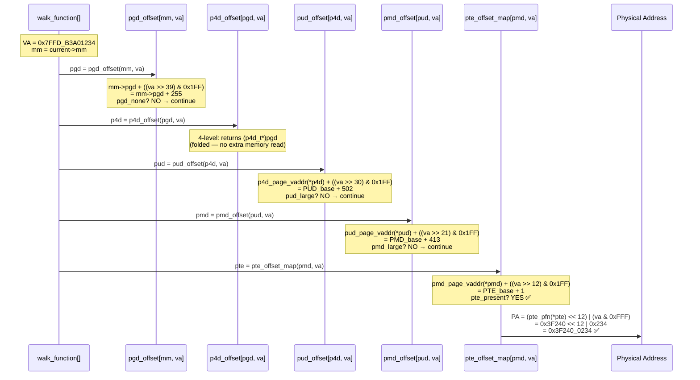

---

## 9. Page Fault → Page Table Walk Flow

When the hardware walker finds a missing or invalid entry, it triggers a **page fault**. The kernel then handles it.

### 9.1 Complete Page Fault Flow

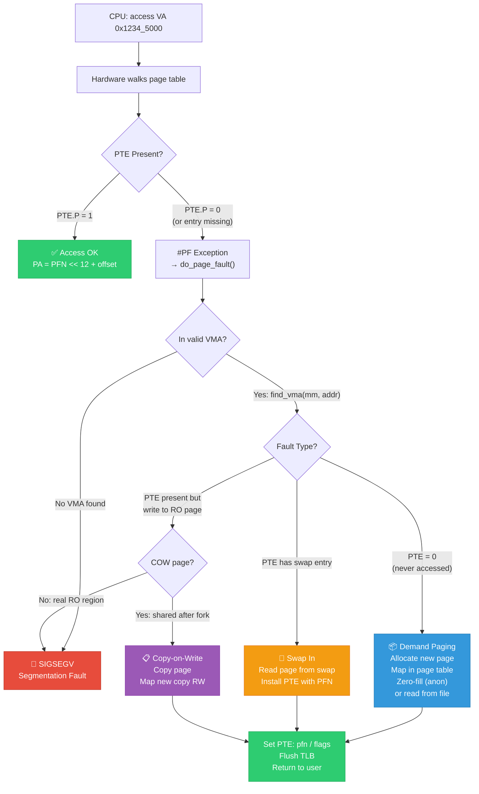

### 9.2 Kernel `__handle_mm_fault` Walk

```mermaid
sequenceDiagram
    participant EXC as Exception Handler<br/>[do_page_fault]
    participant HMF as handle_mm_fault[]
    participant PGD_A as __pgd_alloc[]
    participant PUD_A as __pud_alloc[]
    participant PMD_A as __pmd_alloc[]
    participant PTE_A as __pte_alloc[]
    participant DEMAND as handle_pte_fault[]

    Note over EXC: #PF: VA = 0x40_0000<br/>(process's first code page)

    EXC->>EXC: find_vma(mm, 0x40_0000)<br/>Found: VMA [0x400000-0x401000]<br/>flags: VM_READ | VM_EXEC

    EXC->>HMF: handle_mm_fault(vma, addr, flags)

    HMF->>HMF: pgd = pgd_offset(mm, addr)
    Note over HMF: PGD entry exists<br/>(PGD always allocated)

    HMF->>HMF: p4d = p4d_offset(pgd, addr)
    
    HMF->>HMF: pud = pud_alloc(mm, p4d, addr)
    alt PUD table doesn't exist
        HMF->>PUD_A: Allocate 4KB page for PUD table
        PUD_A->>HMF: New PUD table at PFN 0x5000
        HMF->>HMF: Set P4D entry → PUD table

    HMF->>HMF: pmd = pmd_alloc(mm, pud, addr)
    alt PMD table doesn't exist
        HMF->>PMD_A: Allocate 4KB page for PMD table
        PMD_A->>HMF: New PMD table at PFN 0x6000
        HMF->>HMF: Set PUD entry → PMD table

    HMF->>HMF: Check: THP opportunity?<br/>No → continue to PTE level

    HMF->>HMF: pte = pte_alloc(mm, pmd, addr)
    alt PTE table doesn't exist
        HMF->>PTE_A: Allocate 4KB page for PTE table
        PTE_A->>HMF: New PTE table at PFN 0x7000
        HMF->>HMF: Set PMD entry → PTE table

    HMF->>DEMAND: handle_pte_fault(vmf)
    
    Note over DEMAND: PTE = 0 (none)<br/>VMA is file-backed (ELF code)

    DEMAND->>DEMAND: do_fault(vmf)<br/>→ filemap_fault()<br/>→ Read page from disk
    DEMAND->>DEMAND: Allocate physical page
    DEMAND->>DEMAND: Copy file data to page
    DEMAND->>DEMAND: set_pte_at(mm, addr, pte,<br/>mk_pte(page, vma->vm_page_prot))

    Note over DEMAND: PTE now valid!<br/>PFN=0x8000, flags=PRESENT|USER|EXEC
    
    DEMAND->>EXC: Return VM_FAULT_NOPAGE ✅
    EXC->>EXC: iret → re-execute instruction
```

---

## 10. Huge Pages and Page Table Walk

Huge pages **short-circuit** the page table walk — they stop at an intermediate level.

### 10.1 4KB vs 2MB vs 1GB Walk Comparison

```mermaid
flowchart TD
    subgraph Walk_4KB["📄 4KB Page Walk (5 reads)"]
        CR3_4K["CR3"] --> PGD_4K["PGD"] --> PUD_4K["PUD"] --> PMD_4K["PMD"] --> PTE_4K["PTE"] --> P_4K["4KB Page"]
    end
    
    subgraph Walk_2MB["📦 2MB Huge Page Walk (4 reads)"]
        CR3_2M["CR3"] --> PGD_2M["PGD"] --> PUD_2M["PUD"] --> PMD_2M["PMD<br/>(PS=1: STOP!)"] --> P_2M["2MB Page<br/>offset = VA[20:0]"]
    end
    
    subgraph Walk_1GB["🏗️ 1GB Huge Page Walk (3 reads)"]
        CR3_1G["CR3"] --> PGD_1G["PGD"] --> PUD_1G["PUD<br/>(PS=1: STOP!)"] --> P_1G["1GB Page<br/>offset = VA[29:0]"]
    end

    style PTE_4K fill:#2ecc71,stroke:#27ae60,color:#fff
    style PMD_4K fill:#3498db,stroke:#2980b9,color:#fff
    style PMD_2M fill:#f39c12,stroke:#e67e22,color:#fff
    style P_2M fill:#f39c12,stroke:#e67e22,color:#fff
    style PUD_1G fill:#e74c3c,stroke:#c0392b,color:#fff
    style P_1G fill:#e74c3c,stroke:#c0392b,color:#fff
```

### 10.2 How Hardware Detects Huge Pages

```mermaid
sequenceDiagram
    participant CPU as CPU / MMU
    participant PGD as PGD Table
    participant PUD as PUD Table
    participant PMD as PMD Table

    CPU->>PGD: Walk: read PGD[idx]
    PGD->>CPU: Valid table entry → PUD base

    CPU->>PUD: Walk: read PUD[idx]
    
    alt PUD.PS = 1 (Page Size bit set)
        PUD->>CPU: 🏗️ 1GB HUGE PAGE!<br/>PFN from PUD entry<br/>Offset = VA[29:0] (30 offset bits)<br/>STOP WALKING HERE
        Note over CPU: PA = PFN(PUD) << 30 | VA[29:0]
    else PUD.PS = 0
        PUD->>CPU: Table entry → PMD base
        CPU->>PMD: Walk: read PMD[idx]
        
        alt PMD.PS = 1
            PMD->>CPU: 📦 2MB HUGE PAGE!<br/>PFN from PMD entry<br/>Offset = VA[20:0] (21 offset bits)<br/>STOP WALKING HERE
            Note over CPU: PA = PFN(PMD) << 21 | VA[20:0]
        else PMD.PS = 0
            PMD->>CPU: Table entry → PTE base<br/>Continue to PTE level...
```

### Key: How the PS bit changes the walk

```
Regular 4KB page (PMD.PS=0):
  PMD entry bits [51:12] = PTE table physical address
  Continue walk → read PTE → get page PFN

2MB huge page (PMD.PS=1):
  PMD entry bits [51:21] = 2MB page physical address (aligned!)
  bits [20:0] ignored (part of the 2MB page)
  STOP walk here. Offset = VA[20:0]

1GB huge page (PUD.PS=1):
  PUD entry bits [51:30] = 1GB page physical address (aligned!)
  STOP walk here. Offset = VA[29:0]
```

---

## 11. Kernel vs User Page Tables (KPTI)

After Meltdown (2018), Linux implements **Kernel Page Table Isolation (KPTI)**: user space and kernel have separate page table sets.

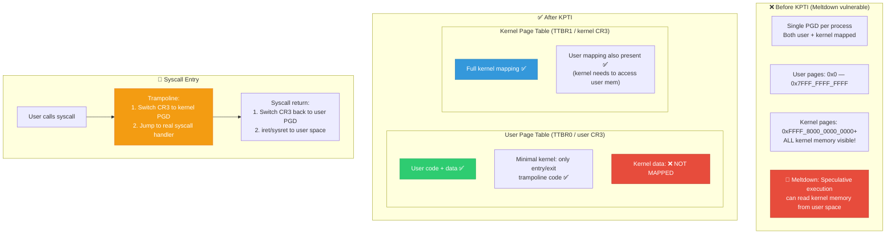

**KPTI and Page Table Walk:**

```mermaid
sequenceDiagram
    participant USER as User Process<br/>[running search]
    participant CR3_U as CR3 [User PGD]
    participant SYSCALL as syscall entry
    participant CR3_K as CR3 [Kernel PGD]
    participant KERNEL as Kernel Code
    participant CR3_U2 as CR3 [User PGD]

    Note over USER: Process running with<br/>User page tables in CR3

    USER->>SYSCALL: syscall instruction
    
    Note over SYSCALL: Entry trampoline<br/>(mapped in BOTH page tables)

    SYSCALL->>CR3_K: Switch CR3 to kernel PGD<br/>mov cr3, kernel_pgd
    Note over CR3_K: 🔑 This is the KPTI overhead:<br/>CR3 write flushes TLB!<br/>(mitigated by PCID)

    CR3_K->>KERNEL: Now kernel has full access<br/>to all kernel memory

    KERNEL->>KERNEL: Process syscall...
    
    KERNEL->>CR3_U2: Switch CR3 back to user PGD<br/>mov cr3, user_pgd
    
    CR3_U2->>USER: sysret → user space resumed
    Note over USER: Kernel memory no longer<br/>mapped → Meltdown impossible ✅
```

---

## 12. Deep Interview Q&A (25 Questions)

---

### ❓ Q1: How many memory accesses does a page table walk require on x86_64? What's the worst-case latency?

**A:**

```
4-level paging (standard x86_64):
  4 memory reads: PGD → PUD → PMD → PTE
  
5-level paging (LA57):
  5 memory reads: PGD → P4D → PUD → PMD → PTE

Worst-case latency:
  Each read = L2/L3 cache miss → ~100ns per read (DRAM access)
  4 reads × 100ns = 400ns worst case
  5 reads × 100ns = 500ns worst case
  
  Compare to TLB hit: < 1ns
  
  That's why TLB miss ratio is THE most critical performance metric!
  Even 1% TLB miss rate can dominate execution time.
```

---

### ❓ Q2: What happens if the PGD entry is empty during a page table walk?

**A:**
If hardware encounters a PGD entry with Present bit = 0, it **immediately generates a page fault** (#PF on x86, translation fault on ARM). The kernel then:

1. Calls `do_page_fault()` → `handle_mm_fault()`
2. `__pgd_alloc()` allocates a new page for the PUD table
3. Sets the PGD entry to point to the new PUD table
4. Continues allocating PMD, PTE tables as needed
5. Finally allocates the physical page and sets the PTE
6. Returns from exception → CPU re-executes the instruction → now the walk succeeds

---

### ❓ Q3: What is the `CR3` register and why does writing to it flush the TLB?

**A:**
CR3 holds the **physical address of the PGD (top-level page table)** for the current process. Writing a new value to CR3 means switching to an entirely different address space (different page tables). Previous TLB entries belong to the **old** page tables and are invalid.

**PCID optimization:** Intel added PCID (Process Context ID) — a 12-bit tag stored in CR3 bits [11:0]. TLB entries are tagged with the PCID, so a CR3 write with a different PCID doesn't need to flush entries belonging to other PCIDs. This **avoids TLB flush on context switch** in many cases.

```c
/* Linux CR3 management with PCID */
#define CR3_PCID_MASK    0xFFF            /* Low 12 bits = PCID */
#define X86_CR3_PCID_NOFLUSH  BIT(63)     /* Bit 63: don't flush TLB */

void switch_mm(struct mm_struct *prev, struct mm_struct *next)
{
    unsigned long cr3 = __pa(next->pgd) | next->context.ctx_id;
    
    if (prev != next)
        cr3 |= X86_CR3_PCID_NOFLUSH; /* Don't flush! PCID handles it */
    
    write_cr3(cr3);
}
```

---

### ❓ Q4: Explain the difference between hardware page table walk and software page table walk.

**A:**

| Aspect | Hardware Walk | Software Walk |
|--------|--------------|---------------|
| **Who does it?** | MMU hardware (Page Miss Handler) | Kernel code (`handle_mm_fault`) |
| **When?** | TLB miss → automatic | Page fault (#PF) exception |
| **Speed** | Very fast (~100-400ns) | Slow (1000ns+, involves exception handler) |
| **Can allocate pages?** | NO — just reads existing tables | YES — allocates tables and pages |
| **Can handle swap?** | NO — sees not-present → fault | YES — reads from swap device |
| **Architectures** | x86, ARM (hardware walkers) | MIPS, RISC-V (some), PA-RISC |

**On x86/ARM:** Hardware walks the table automatically on TLB miss. Only generates a fault if the entry is invalid/not-present. The kernel handles the fault → allocates pages → hardware re-walks and succeeds.

**On MIPS (software-walked TLB):** EVERY TLB miss generates a trap. The kernel manually searches its page table, constructs the TLB entry, and writes it using `TLBWI`/`TLBWR` instructions.

---

### ❓ Q5: What is "page table folding" in Linux? Why does `p4d_offset(pgd, addr)` just return `pgd` on most systems?

**A:**
Linux kernel supports 2, 3, 4, and 5-level page tables with the **same API**. On a 4-level system (no P4D), the P4D level is "folded" — compiled out:

```c
/* On 4-level system (CONFIG_PGTABLE_LEVELS=4): */

typedef struct { pgd_t pgd; } p4d_t;  /* P4D IS the PGD */

static inline p4d_t *p4d_offset(pgd_t *pgd, unsigned long addr)
{
    return (p4d_t *)pgd;  /* Just cast — no memory read! */
}

static inline int p4d_none(p4d_t p4d)
{
    return pgd_none(p4d.pgd);  /* Delegate to PGD check */
}

/* Similarly, on a 2-level system (like some embedded):
 * PUD and PMD are also folded into PGD.
 * pgd → pte directly (one level of page table).
 */
```

**Why?** Architectural independence. Driver code and core mm code use the same 5-level API regardless of the actual hardware. The compiler optimizes away the folded levels completely — zero overhead.

---

### ❓ Q6: How does Copy-on-Write (COW) interact with page table walks?

**A:**

```mermaid
sequenceDiagram
    participant PARENT as Parent Process
    participant CHILD as Child [after fork]
    participant MMU as MMU Hardware
    participant KERNEL as Kernel Fault Handler

    Note over PARENT: Page at VA 0x1000:<br/>PTE = PFN=0x500, RW=1

    PARENT->>CHILD: fork()
    Note over PARENT,CHILD: Kernel marks BOTH PTEs read-only:<br/>Parent PTE: PFN=0x500, RW=0<br/>Child PTE: PFN=0x500, RW=0<br/>Both share same physical page!

    CHILD->>MMU: Write to VA 0x1000
    MMU->>MMU: Walk page table:<br/>PTE found, Present=1, BUT RW=0
    MMU->>KERNEL: #PF: Write to read-only page

    KERNEL->>KERNEL: Check VMA: VM_WRITE is set<br/>→ This is a COW fault!
    KERNEL->>KERNEL: Allocate new page (PFN=0x800)
    KERNEL->>KERNEL: Copy data from 0x500 → 0x800
    KERNEL->>KERNEL: Child PTE: PFN=0x800, RW=1
    
    Note over PARENT: Parent PTE: PFN=0x500, RW=1<br/>(restored if refcount=1)
    Note over CHILD: Child PTE: PFN=0x800, RW=1<br/>(new private copy)
```

---

### ❓ Q7: What is the ASID/PCID and how does it relate to page table walks?

**A:**
ASID (ARM) or PCID (x86) is a **tag in TLB entries** that identifies which address space they belong to.

Without ASID/PCID: Every context switch flushes the entire TLB (because TLB entries from process A would incorrectly match addresses from process B).

With ASID/PCID: TLB entries are tagged → no flush needed on context switch → TLB entries from multiple processes coexist.

```
TLB entry without ASID:
  | VPN       | PFN       | Flags |
  | 0x7FFD000 | 0x3F240   | RW,U  |
  → Matches ANY process with that VPN! WRONG after context switch!

TLB entry WITH ASID:
  | ASID | VPN       | PFN       | Flags |
  | 42   | 0x7FFD000 | 0x3F240   | RW,U  |
  → Only matches process with ASID=42. Safe across context switches!
```

---

### ❓ Q8: What is a "page table page"? Why are page tables themselves stored in pages?

**A:**
Each level of the page table is stored in a **physical page** (4KB). This is because:

1. **Alignment**: Page table entries contain physical addresses that are page-aligned. Page tables themselves must be page-aligned.
2. **Memory management**: The kernel manages page table pages using the buddy allocator (same as data pages).
3. **Accounting**: `mm->pgtables_bytes` tracks total page table memory per process.

```c
/* Allocating a page table page */
pte_t *pte_alloc_one(struct mm_struct *mm)
{
    struct page *page;
    
    /* Allocate one 4KB page from buddy allocator */
    page = alloc_page(GFP_PGTABLE_USER);  /* GFP_PGTABLE_USER includes:
                                             * __GFP_ZERO (must be zeroed!)
                                             * __GFP_ACCOUNT (charge to cgroup)
                                             */
    if (!page)
        return NULL;
    
    /* Track for memory accounting */
    mm_inc_nr_ptes(mm);
    
    return (pte_t *)page_address(page);
}
```

---

### ❓ Q9: How does the kernel walk page tables safely in a multi-threaded environment?

**A:**
The `mm->mmap_lock` (rwsemaphore) protects the page table from concurrent modification. Rules:

```c
/* Read-side: multiple readers can walk simultaneously */
mmap_read_lock(mm);
    /* Walk page tables — safe from structure changes */
    pgd = pgd_offset(mm, addr);
    pte = pte_offset_map(pmd, addr);
    /* Read PTE value */
mmap_read_unlock(mm);

/* Write-side: exclusive — modifies page table structure */
mmap_write_lock(mm);
    /* Can modify PTEs, add/remove VMAs, allocate tables */
    set_pte_at(mm, addr, ptep, new_pte);
mmap_write_unlock(mm);
```

**Speculative page table walks (fast GUP):** Modern Linux also supports `get_user_pages_fast()` which walks page tables **without taking mmap_lock**, using RCU and atomic PTE reads for performance:

```c
int get_user_pages_fast(unsigned long start, int nr_pages,
                         unsigned int gup_flags, struct page **pages)
{
    /* Walks page tables locklessly using RCU
     * Only works for already-present PTEs
     * Falls back to slow path (with mmap_lock) on failure */
}
```

---

### ❓ Q10: What is a "page walk callback" in Linux? What is `walk_page_range()`?

**A:**
`walk_page_range()` is the kernel's generic page table walker — it walks a range of virtual addresses and calls your callback at each level:

```c
struct mm_walk_ops {
    /* Called for each PTE entry */
    int (*pte_entry)(pte_t *pte, unsigned long addr,
                      unsigned long next, struct mm_walk *walk);
    /* Called at each PMD level */
    int (*pmd_entry)(pmd_t *pmd, unsigned long addr,
                      unsigned long next, struct mm_walk *walk);
    /* Called at each PUD level */
    int (*pud_entry)(pud_t *pud, unsigned long addr,
                      unsigned long next, struct mm_walk *walk);
    /* Called for unmapped holes */
    int (*pte_hole)(unsigned long addr, unsigned long next,
                     int depth, struct mm_walk *walk);
};

/* Example: count all present pages in a range */
static int count_pte(pte_t *pte, unsigned long addr,
                      unsigned long next, struct mm_walk *walk)
{
    int *count = walk->private;
    if (pte_present(*pte))
        (*count)++;
    return 0;
}

int count_present_pages(struct mm_struct *mm,
                         unsigned long start, unsigned long end)
{
    int count = 0;
    struct mm_walk_ops ops = { .pte_entry = count_pte };
    
    mmap_read_lock(mm);
    walk_page_range(mm, start, end, &ops, &count);
    mmap_read_unlock(mm);
    
    return count;
}
```

Used by: `/proc/PID/smaps`, `mincore()`, DAMON, KSM, memory migration.

---

### ❓ Q11: What happens during a page table walk when a huge page (THP) is encountered?

**A:**
When the PMD entry has the **PS (Page Size) bit set**, the hardware walker stops at the PMD level. The PMD entry contains the PFN of a 2MB-aligned physical page. No PTE table exists for this region.

The kernel checks with `pmd_large()` or `pmd_trans_huge()`:

```c
pmd = pmd_offset(pud, addr);

if (pmd_trans_huge(*pmd)) {
    /* 2MB THP — no PTE table below this PMD! */
    unsigned long pfn = pmd_pfn(*pmd);
    unsigned long offset = addr & ~PMD_MASK;  /* Low 21 bits */
    phys_addr = (pfn << PAGE_SHIFT) + offset;
    /* Done — no PTE walk needed */
}
```

**Splitting a THP:** When the kernel needs PTEs (e.g., partial munmap), it "splits" the huge page:
1. Allocate a PTE page (512 entries)
2. Fill each PTE pointing to the corresponding 4KB sub-page of the THP
3. Replace the PMD huge-page entry with a table entry pointing to the new PTE page

---

### ❓ Q12: What are "page table protection bits" and how do they differ at each level?

**A:**
Flags at each level are **hierarchically ANDed** — a restriction at a higher level applies to all lower levels:

```
PGD entry: User=1, RW=1
  └─ PUD entry: User=1, RW=1
       └─ PMD entry: User=1, RW=0  ← Read-only at PMD!
            └─ PTE entry: User=1, RW=1  ← Doesn't matter!
            
Result: Page is READ-ONLY because PMD says RW=0
Even though PTE says RW=1, the PMD restriction wins.
```

**Critical flags at PTE level:**
| Flag | Bit | Meaning |
|------|-----|---------|
| P (Present) | 0 | Page in physical RAM |
| R/W | 1 | 1=writable, 0=read-only |
| U/S | 2 | 1=user accessible, 0=kernel only |
| PWT | 3 | Write-through caching |
| PCD | 4 | Cache disabled |
| A (Accessed) | 5 | Set by HW on any access |
| D (Dirty) | 6 | Set by HW on write |
| PS (Page Size) | 7 | 1=huge page (at PMD/PUD level) |
| G (Global) | 8 | Don't flush from TLB on CR3 write |
| NX (No Execute) | 63 | 1=cannot execute code from this page |

---

### ❓ Q13: How does the Accessed (A) bit work? Who sets it and who clears it?

**A:**
- **Set by:** Hardware MMU during page table walk. When the walker loads a PTE and the page is accessed, it **atomically** sets the A bit.
- **Cleared by:** The kernel (software), specifically the page reclaim code (kswapd / MGLRU).

```c
/* Kernel clears A bit to measure "hotness" of pages */
int referenced = pte_young(*pte);  /* Check A bit */
pte_t new_pte = pte_mkold(*pte);   /* Clear A bit */
set_pte_at(mm, addr, ptep, new_pte);

/* Next access by user → hardware re-sets A bit
 * If A bit still clear after some time → page is "cold"
 * → candidate for reclaim/swap */
```

This is the foundation of the **LRU/MGLRU page aging algorithm**.

---

### ❓ Q14: How does the Dirty (D) bit work with page table walks?

**A:**
The Dirty bit tracks whether a page has been **written to**:

1. Hardware sets D=1 atomically when the MMU performs a **write** through the PTE
2. Kernel checks D bit during page reclaim or msync()
3. If D=1 and page is file-backed → must write page back to disk before reclaiming
4. If D=1 and page is anonymous → must write to swap before reclaiming
5. Kernel clears D after writeback

```c
if (pte_dirty(*pte)) {
    /* Page was written — must writeback before reclaiming */
    set_page_dirty(page);  /* Mark struct page dirty */
    /* Later: writeback daemon writes to disk/swap */
}
```

---

### ❓ Q15: What is a "TLB shootdown" and why is it needed?

**A:**
In a multi-CPU system, each CPU has its own TLB. When the kernel modifies a page table entry (e.g., munmap, mprotect), it must:

1. Update the PTE in memory
2. Flush the TLB on the **local** CPU
3. Send an IPI (Inter-Processor Interrupt) to all other CPUs that might have cached this entry
4. Each remote CPU flushes the stale entry from its TLB

```mermaid
sequenceDiagram
    participant CPU0 as CPU 0<br/>[calls munmap]
    participant PTE as Page Table<br/>[in RAM]
    participant CPU1 as CPU 1<br/>[running same process]
    participant CPU2 as CPU 2<br/>[running same process]

    CPU0->>PTE: Clear PTE entry<br/>(munmap page)
    CPU0->>CPU0: INVLPG: flush local TLB

    par TLB Shootdown (IPI)
        CPU0->>CPU1: IPI: flush TLB for VA 0x1000
        CPU1->>CPU1: INVLPG: flush entry
        CPU1->>CPU0: ACK
    and
        CPU0->>CPU2: IPI: flush TLB for VA 0x1000
        CPU2->>CPU2: INVLPG: flush entry
        CPU2->>CPU0: ACK

    Note over CPU0: Wait for all ACKs<br/>before continuing
    Note over CPU0,CPU2: 🔑 TLB shootdown is EXPENSIVE<br/>~5-10µs per remote CPU<br/>Major scalability bottleneck<br/>on 100+ CPU systems
```

---

### ❓ Q16: What is the page table walk cost of `fork()`?

**A:**
`fork()` must **copy the entire page table tree** (but NOT the data pages):

```
Parent process has 1GB of mapped memory:
  PGD: 1 page (always)
  PUD: ~1 page
  PMD: ~2 pages
  PTE: ~256 pages (1GB / 4KB per entry × 8 bytes = 256 pages)
  
fork() copies:
  ~260 pages of page tables ≈ ~1MB
  
  PLUS: must walk all PTEs to:
  1. Set both parent + child PTEs to read-only (COW)
  2. Increment page reference counts
  3. Time: ~2-5ms for 1GB address space
```

That's why `vfork()` or `posix_spawn()` is preferred for `fork()+exec()` patterns — avoids the page table copy entirely.

---

### ❓ Q17: How does KPTI affect page table walk performance?

**A:**
KPTI doubles the page table walk cost for **every syscall**:

```
Without KPTI:
  syscall → no CR3 change → no TLB impact

With KPTI:
  syscall entry: write CR3 (user→kernel PGD) → TLB flush
  syscall exit:  write CR3 (kernel→user PGD) → TLB flush
  
  Cost: ~100-200ns per CR3 write
  Overhead: 2 × ~150ns = 300ns per syscall
  
  For syscall-heavy workload (100K syscalls/sec):
    Overhead = 100K × 300ns = 30ms/sec = 3% CPU
    
Mitigation: PCID
  With PCID, CR3 write sets NOFLUSH bit
  TLB entries tagged with PCID → no flush needed
  Reduced overhead: < 50ns per CR3 write
```

---

### ❓ Q18: What is a "nested page table" walk (for virtualization)?

**A:**
In a VM, there are **TWO levels** of page tables:

```mermaid
flowchart TD
    subgraph Guest["🔵 Guest Page Walk (4 reads)"]
        GVA["Guest Virtual Address"]
        G_PGD["Guest PGD"]
        G_PUD["Guest PUD"]
        G_PMD["Guest PMD"]
        G_PTE["Guest PTE"]
        GPA["Guest Physical Address"]
    end
    
    subgraph Host["🟠 Host Page Walk (4 reads EACH)"]
        H_WALK["Host walks EPT/NPT<br/>to translate EACH<br/>guest physical address<br/>encountered during<br/>guest walk"]
    end
    
    GVA --> G_PGD
    G_PGD -->|"GPA of PUD table<br/>→ EPT walk (4 reads)"| G_PUD
    G_PUD -->|"GPA of PMD table<br/>→ EPT walk (4 reads)"| G_PMD
    G_PMD -->|"GPA of PTE table<br/>→ EPT walk (4 reads)"| G_PTE
    G_PTE -->|"GPA of data page<br/>→ EPT walk (4 reads)"| GPA

    style GVA fill:#3498db,stroke:#2980b9,color:#fff
    style GPA fill:#e74c3c,stroke:#c0392b,color:#fff
    style H_WALK fill:#f39c12,stroke:#e67e22,color:#fff
```

**Total memory reads for nested walk:**
```
Guest walk: 4 levels, each level's physical address 
            must be translated by host EPT (4 reads each)

Total = 4 (guest levels) × 4 (host EPT reads each) + 4 (final data page EPT)
      = 4 × 4 + 4 = 20 memory reads!

Compare: bare-metal = 4 reads
Nested = 20 reads → 5× slower on TLB miss!

That's why VPID (Intel) / VMID (ARM) is critical for VMs.
```

---

### ❓ Q19: How do you debug page table corruption?

**A:**

```c
/* Debugging tools for page table issues */

/* 1. /proc/PID/pagemap — read page table from user space */
/* Each 8-byte entry at offset (VA/PAGE_SIZE * 8):
 * Bit 63: page present
 * Bit 62: page swapped
 * Bits 0-54: PFN (if present)
 */

/* 2. /proc/PID/smaps — readable page table summary */
/* Shows: Rss, Pss, Referenced, Anonymous, Swap per VMA */

/* 3. Kernel debug: dump page tables */
ptdump_walk(seq_file, mm);  /* CONFIG_PTDUMP_CORE=y */

/* 4. Check PTE flags manually */
void debug_pte(struct mm_struct *mm, unsigned long addr)
{
    pgd_t *pgd = pgd_offset(mm, addr);
    p4d_t *p4d = p4d_offset(pgd, addr);
    pud_t *pud = pud_offset(p4d, addr);
    pmd_t *pmd = pmd_offset(pud, addr);
    pte_t *pte = pte_offset_map(pmd, addr);
    
    pr_info("PGD: %016lx (present=%d)\n", pgd_val(*pgd), pgd_present(*pgd));
    pr_info("PUD: %016lx (present=%d, huge=%d)\n", 
            pud_val(*pud), pud_present(*pud), pud_large(*pud));
    pr_info("PMD: %016lx (present=%d, huge=%d)\n",
            pmd_val(*pmd), pmd_present(*pmd), pmd_large(*pmd));
    pr_info("PTE: %016lx (present=%d, dirty=%d, young=%d, write=%d)\n",
            pte_val(*pte), pte_present(*pte), pte_dirty(*pte),
            pte_young(*pte), pte_write(*pte));
    
    pte_unmap(pte);
}
```

---

### ❓ Q20: What is the memory overhead of page tables themselves?

**A:**

```
Process with 1GB of mapped memory (all 4KB pages):

  Pages mapped: 1GB / 4KB = 262,144 pages
  PTE entries:  262,144 (each in a PTE table page)
  PTE pages:    262,144 / 512 entries per page = 512 PTE pages
  PMD pages:    512 / 512 = 1 PMD page
  PUD pages:    1 / 512 = 1 PUD page  (always at least 1)
  PGD pages:    1 (always exactly 1)
  
  Total page table memory = (512 + 1 + 1 + 1) × 4KB 
                          = 515 × 4KB = 2,060 KB ≈ 2MB
  
  Overhead = 2MB / 1GB = 0.2%

With 2MB huge pages:
  Pages mapped: 1GB / 2MB = 512 pages
  PMD entries: 512 (→ BUT these are huge page entries, no PTE table!)
  PTE pages: 0 ← (huge pages eliminate PTE level)
  
  Total = (1 + 1 + 1) × 4KB = 12 KB
  
  Overhead = 12KB / 1GB = 0.001%
  
  → 170× less page table overhead with huge pages!
```

---

### ❓ Q21: How does the kernel handle a page table walk for a swapped-out page?

**A:**

```mermaid
flowchart TD
    A["Hardware walk: PTE.P = 0"] --> B["#PF exception"]
    B --> C["Kernel reads PTE value"]
    C --> D{PTE == 0?}
    
    D -->|"PTE = 0"| E["Never mapped<br/>→ Demand paging<br/>Allocate new page"]
    
    D -->|"PTE ≠ 0 but P=0"| F{Swap entry<br/>encoded in PTE?}
    
    F -->|"Yes: PTE = swap_entry"| G["Decode swap entry:<br/>swap_type (which swap device)<br/>swap_offset (page in device)"]
    G --> H["swapin_readahead():<br/>Read page from swap"]
    H --> I["Install page in page table<br/>PTE = new_pfn / flags / P=1"]
    I --> J["Add to LRU list<br/>Return to user ✅"]
    
    F -->|"Migration entry"| K["NUMA migration in progress<br/>Wait for completion"]
    F -->|"HWPoison entry"| L["Page has ECC error<br/>→ SIGBUS to process"]

    style E fill:#3498db,stroke:#2980b9,color:#fff
    style G fill:#f39c12,stroke:#e67e22,color:#fff
    style H fill:#9b59b6,stroke:#8e44ad,color:#fff
    style L fill:#e74c3c,stroke:#c0392b,color:#fff
```

Swap entry encoding in a not-present PTE:
```
x86_64 swap PTE format (when P=0):
  Bits [0]:    0 (not present)
  Bits [1]:    0 
  Bits [6:2]:  Swap type (0-31, which swap device)
  Bits [63:7]: Swap offset (page index in swap file)
```

---

### ❓ Q22: What is `pgd_offset_k()` and how does kernel page table differ from user page table?

**A:**
Kernel page tables are **shared across all processes.** Every process's PGD has the same kernel-space entries (upper half of the address space).

```c
/* User page table walk: starts from process's mm */
pgd = pgd_offset(current->mm, user_vaddr);

/* Kernel page table walk: starts from init_mm.pgd */
pgd = pgd_offset_k(kernel_vaddr);
/* Equivalent to: pgd_offset(&init_mm, kernel_vaddr) */

/*
 * Key difference:
 * - User PTEs: per-process, allocated on demand, freed on exit
 * - Kernel PTEs: global, allocated at boot, shared via PGD copying
 *
 * When a new process is created (fork), the kernel portion of the
 * PGD is copied from init_mm.pgd:
 *   memcpy(new_mm->pgd + USER_PTRS_PER_PGD,
 *          init_mm.pgd + USER_PTRS_PER_PGD,
 *          KERNEL_PTRS_PER_PGD * sizeof(pgd_t));
 */
```

---

### ❓ Q23: How do page table walks work with IOMMU/SMMU (for DMA)?

**A:**
IOMMUs have their **own page tables** — separate from CPU page tables. They translate between device-virtual addresses (IOVA) and physical addresses.

```mermaid
flowchart LR
    subgraph CPU_Path["CPU Path"]
        CPU["CPU"] -->|"VA → PA"| CPU_MMU["CPU MMU<br/>(CR3 page tables)"]
        CPU_MMU --> RAM_C["Physical RAM"]
    end
    
    subgraph DMA_Path["DMA Path"]
        DEV["PCIe Device<br/>(GPU, NIC)"] -->|"IOVA → PA"| IOMMU["IOMMU/SMMU<br/>(device page tables)"]
        IOMMU --> RAM_D["Physical RAM"]
    end

    style CPU_MMU fill:#3498db,stroke:#2980b9,color:#fff
    style IOMMU fill:#e74c3c,stroke:#c0392b,color:#fff
```

IOMMU page tables have the same multi-level structure but are managed by the IOMMU driver (`iommu_map()` / `iommu_unmap()`), not by mm subsystem.

---

### ❓ Q24: What is `pte_offset_map()` vs `pte_offset_kernel()`?

**A:**

```c
/* pte_offset_map(): For user page tables
 * On 32-bit with HIGHMEM: PTE pages might be in high memory
 * → need kmap() to access them
 * On 64-bit: just a direct pointer (no kmap needed)
 * Must be paired with pte_unmap()
 */
pte = pte_offset_map(pmd, addr);
/* ... use pte ... */
pte_unmap(pte);

/* pte_offset_kernel(): For kernel page tables
 * Kernel page table pages are always in direct-mapped memory
 * → never need kmap
 * → no pte_unmap needed
 */
pte = pte_offset_kernel(pmd, addr);
/* ... use pte ... */
/* No unmap needed */
```

---

### ❓ Q25: Design a system where you need to walk page tables of another process. What are the locking rules and security concerns?

**A:**

```c
/* Walking another process's page tables — used by:
 * - /proc/PID/maps, /proc/PID/pagemap
 * - process_vm_readv() / process_vm_writev()
 * - get_user_pages_remote()
 * - ptrace (debugger)
 */

int walk_remote_process_pages(pid_t target_pid, unsigned long addr)
{
    struct task_struct *task;
    struct mm_struct *mm;
    int ret = -ESRCH;
    
    /* Step 1: Find the target process (RCU protected) */
    rcu_read_lock();
    task = find_task_by_vpid(target_pid);
    if (task)
        get_task_struct(task);
    rcu_read_unlock();
    
    if (!task)
        return -ESRCH;
    
    /* Step 2: Security check — do we have permission? */
    /* ptrace_may_access checks:
     * - Same UID or CAP_SYS_PTRACE
     * - Yama LSM restrictions
     * - SELinux/AppArmor policies
     */
    if (!ptrace_may_access(task, PTRACE_MODE_READ_REALCREDS)) {
        ret = -EACCES;
        goto out_task;
    }
    
    /* Step 3: Get mm_struct (increases refcount) */
    mm = get_task_mm(task);
    if (!mm) {
        ret = -ESRCH;  /* Kernel thread — no mm */
        goto out_task;
    }
    
    /* Step 4: Take mmap_lock for reading */
    mmap_read_lock(mm);
    
    /* Step 5: Walk page tables */
    pgd_t *pgd = pgd_offset(mm, addr);
    /* ... full walk ... */
    
    /* Step 6: Release locks in reverse order */
    mmap_read_unlock(mm);
    mmput(mm);
    
out_task:
    put_task_struct(task);
    return ret;
}

/*
 * Locking rules summary:
 * 1. rcu_read_lock() to find task
 * 2. get_task_struct() to pin task
 * 3. ptrace_may_access() for security
 * 4. get_task_mm() + mmput() for mm lifecycle
 * 5. mmap_read_lock(mm) for page table stability
 * 6. pte_offset_map() + pte_unmap() for PTE access
 * 7. Release in REVERSE order
 */
```

---

## Summary: Page Table Walk Cheat Sheet

```mermaid
flowchart TD
    subgraph Summary["📋 Page Table Walk — Complete Summary"]
        direction TB
        S1["1️⃣ CPU issues memory access with Virtual Address"]
        S2["2️⃣ TLB checked first (< 1ns hit)"]
        S3["3️⃣ TLB miss → Hardware Page Table Walk (~100-400ns)"]
        S4["4️⃣ Walk: CR3→PGD→P4D→PUD→PMD→PTE→Page"]
        S5["5️⃣ Each level: index = 9 bits of VA, 512 entries/table"]
        S6["6️⃣ Huge pages: PS bit stops walk early (PMD=2MB, PUD=1GB)"]
        S7["7️⃣ Not present → #PF → Kernel allocates page → installs PTE"]
        S8["8️⃣ Result cached in TLB for next access"]
    end
    
    S1 --> S2 --> S3 --> S4 --> S5 --> S6 --> S7 --> S8

    style S1 fill:#3498db,stroke:#2980b9,color:#fff
    style S2 fill:#2ecc71,stroke:#27ae60,color:#fff
    style S3 fill:#f39c12,stroke:#e67e22,color:#fff
    style S4 fill:#e74c3c,stroke:#c0392b,color:#fff
    style S5 fill:#9b59b6,stroke:#8e44ad,color:#fff
    style S6 fill:#1abc9c,stroke:#16a085,color:#fff
    style S7 fill:#c0392b,stroke:#922b21,color:#fff
    style S8 fill:#2ecc71,stroke:#27ae60,color:#fff
```

---

[← Previous: 22 — Google 15yr Deep](22_Google_15yr_System_Design_Deep_Interview.md) | [Back to Index →](../ReadMe.Md)
