# 24 — Virtual-to-Physical Memory Translation & Mapping Through Page Walk

> **Goal**: Understand — step by step, bit by bit — how every memory access your program makes travels from a **virtual address** the CPU sees, through the MMU hardware, page tables, and TLB, and finally lands on a **physical DRAM cell**. Not just "what" but *exactly how the silicon does it*.

---

## Table of Contents

1. [The Big Picture — Why Translation Exists](#1-the-big-picture)
2. [Life of a Memory Access — End-to-End](#2-life-of-a-memory-access)
3. [Virtual Address Space Layout](#3-virtual-address-space-layout)
4. [How the CPU Splits a Virtual Address](#4-how-the-cpu-splits-a-virtual-address)
5. [The MMU — Translation Hardware Inside the CPU](#5-the-mmu)
6. [TLB — The Translation Cache](#6-tlb)
7. [Page Table Walk — The Full Journey](#7-page-table-walk)
8. [Page Table Entry (PTE) — Bit-by-Bit Anatomy](#8-pte-anatomy)
9. [How Mapping is Created — From mmap to PTE Installation](#9-how-mapping-is-created)
10. [Demand Paging — Lazy Physical Allocation](#10-demand-paging)
11. [How Physical Pages are Chosen](#11-physical-page-selection)
12. [The Return Path — Physical Address to DRAM](#12-physical-address-to-dram)
13. [Kernel Direct Mapping — The Shortcut](#13-kernel-direct-mapping)
14. [Real-World Scenario: malloc → Physical RAM](#14-malloc-to-ram)
15. [Real-World Scenario: File Read via mmap](#15-file-read-mmap)
16. [Multi-Process Sharing — Same Physical Page, Different VAs](#16-multi-process-sharing)
17. [What Happens When Things Go Wrong](#17-things-go-wrong)
18. [Performance: Translation Cost](#18-performance)
19. [Deep Q&A (20 Questions)](#19-deep-qa)

---

## 1. The Big Picture — Why Translation Exists

Every process believes it owns all of memory — addresses `0x0000_0000_0000_0000` to `0x0000_7FFF_FFFF_FFFF` (user space on x86_64). But physical RAM might only be 8 GB and dozens of processes run simultaneously. **Translation** is the mechanism that makes this illusion work.

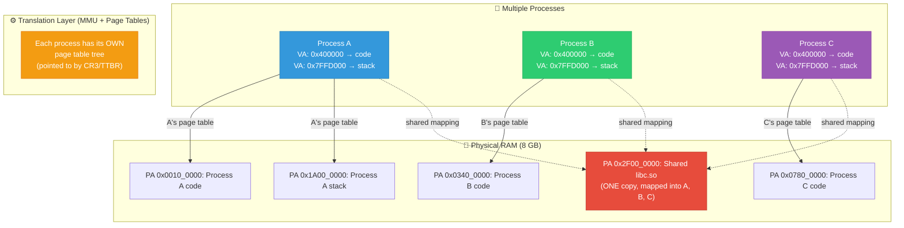

**Three guarantees from translation:**

| Guarantee | How |
|-----------|-----|
| **Isolation** | Each process has its own page table → cannot see other processes' memory |
| **Illusion of contiguity** | Scattered physical pages appear contiguous in virtual space |
| **Sharing** | Multiple virtual addresses (even in different processes) can map to the SAME physical page |

---

## 2. Life of a Memory Access — End-to-End

Every single `load` or `store` instruction goes through this pipeline:

```mermaid
sequenceDiagram
    participant APP as Application Code
    participant CPU as CPU Pipeline
    participant TLB as TLB [Translation Cache]
    participant PTW as Page Table Walker [HW]
    participant PT as Page Tables [in RAM]
    participant CACHE as L1/L2/L3 Cache
    participant MC as Memory Controller
    participant DRAM as DRAM Chip

    APP->>CPU: mov rax, [0x7FFD_B3A0_1234]<br/>(load from virtual address)
    
    CPU->>TLB: Lookup VA 0x7FFD_B3A0_1000<br/>(page-aligned, strip offset)
    
    alt TLB Hit (~1 cycle)
        TLB->>CPU: PFN = 0x3F240<br/>Permissions: RW, User ✅
        Note over CPU: PA = 0x3F240 << 12 | 0x234<br/>= 0x0003_F240_0234
    else TLB Miss
        CPU->>PTW: Walk page table for VA
        PTW->>PT: Read PGD[255] from RAM
        PT->>PTW: PUD base address
        PTW->>PT: Read PUD[502] from RAM
        PT->>PTW: PMD base address
        PTW->>PT: Read PMD[413] from RAM
        PT->>PTW: PTE base address
        PTW->>PT: Read PTE[1] from RAM
        PT->>PTW: PFN = 0x3F240, flags OK
        PTW->>TLB: Install TLB entry<br/>(VA page → PFN 0x3F240, RW, User)
        TLB->>CPU: PFN = 0x3F240 ✅
    
    CPU->>CACHE: Access PA 0x3F240_0234
    
    alt Cache Hit (~4ns L1, ~12ns L2, ~40ns L3)
        CACHE->>CPU: Data returned ✅
    else Cache Miss (~80-100ns)
        CACHE->>MC: Read PA 0x3F240_0234
        MC->>DRAM: Row/Column address decode
        DRAM->>MC: 64-byte cache line
        MC->>CACHE: Fill cache line
        CACHE->>CPU: Data returned ✅
    
    CPU->>APP: rax = value at that address
```

**Key insight:** Translation (VA→PA) and caching (PA→data) are **two separate lookups**. The TLB handles the first. The cache hierarchy handles the second. Both must succeed for a memory access to complete.

---

## 3. Virtual Address Space Layout

### x86_64 (48-bit Virtual Address)

```mermaid
flowchart TD
    subgraph VAS["📐 x86_64 Virtual Address Space (48-bit)"]
        direction TB
        
        TOP["0xFFFF_FFFF_FFFF_FFFF<br/>─── End of Kernel Space ───"]
        KTEXT["0xFFFF_FFFF_8000_0000<br/>Kernel Text (code)"]
        DMAP["0xFFFF_8880_0000_0000<br/>Direct Map (all physical RAM<br/>mapped linearly here)<br/>phys_to_virt(pa) = pa + PAGE_OFFSET"]
        VMALLOC["0xFFFF_C900_0000_0000<br/>vmalloc / ioremap area"]
        KHOLE["0xFFFF_8000_0000_0000<br/>─── Start of Kernel Space ───"]
        
        HOLE["────── Non-canonical hole ──────<br/>0x0000_8000_0000_0000 to<br/>0xFFFF_7FFF_FFFF_FFFF<br/>(addresses here cause #GP)"]
        
        USTACK["0x0000_7FFF_FFFF_FFFF<br/>User Stack (grows ↓)"]
        UMMAP["mmap region / shared libs"]
        UHEAP["Heap (brk, grows ↑)"]
        UBSS[".bss (uninitialized data)"]
        UDATA[".data (initialized data)"]
        UTEXT["0x0000_0000_0040_0000<br/>.text (code)"]
        UZERO["0x0000_0000_0000_0000<br/>NULL page (unmapped)"]
    end

    style TOP fill:#e74c3c,stroke:#c0392b,color:#fff
    style DMAP fill:#c0392b,stroke:#922b21,color:#fff
    style KHOLE fill:#e74c3c,stroke:#c0392b,color:#fff
    style HOLE fill:#7f8c8d,stroke:#95a5a6,color:#fff
    style USTACK fill:#3498db,stroke:#2980b9,color:#fff
    style UTEXT fill:#2ecc71,stroke:#27ae60,color:#fff
    style UZERO fill:#95a5a6,stroke:#7f8c8d,color:#fff
```

**Important:** The virtual address space is **sparse** — only small regions are actually mapped. The page table tree only has entries for mapped regions. Unmapped regions have no page table pages allocated.

---

## 4. How the CPU Splits a Virtual Address

When the CPU needs to translate a VA, it doesn't search — it **computes** the exact location in each page table level using bit fields:

### 4.1 x86_64 4-Level Bit Decomposition

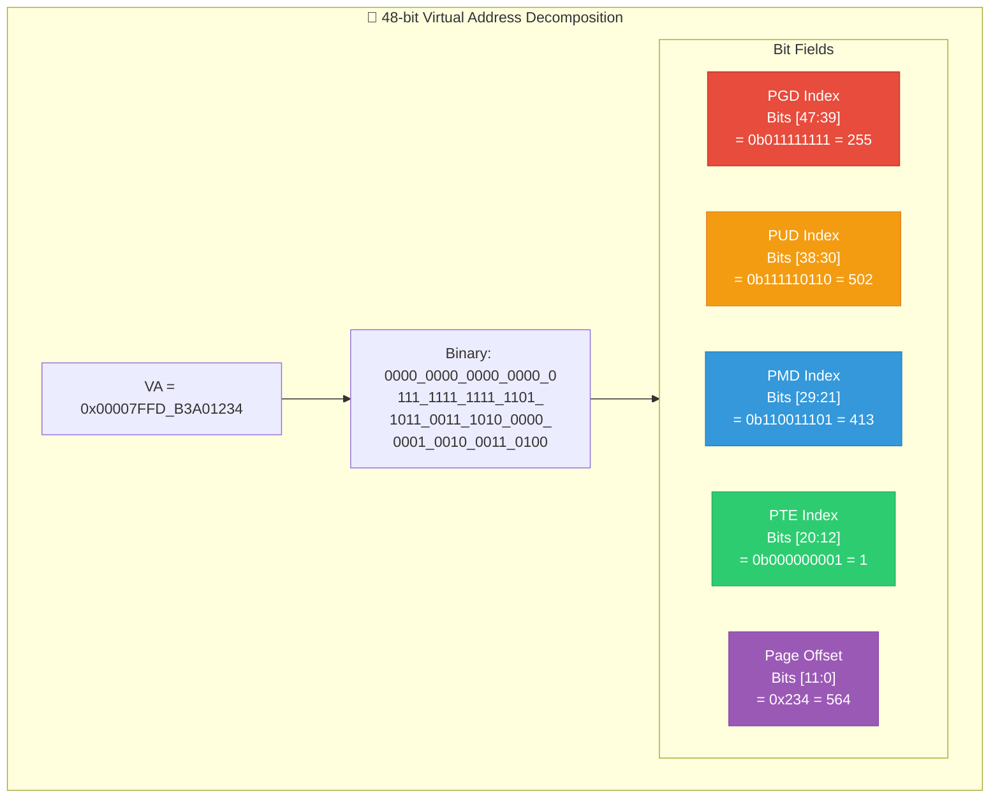

### How the CPU computes each index (in C terms):

```c
#define PAGE_SHIFT     12
#define PTRS_PER_PTE   512
#define PMD_SHIFT      21
#define PUD_SHIFT      30
#define PGDIR_SHIFT    39

/* The CPU hardware does exactly this in silicon: */

unsigned long va = 0x00007FFDB3A01234UL;

/* Extract each 9-bit index */
int pgd_idx = (va >> 39) & 0x1FF;   /* bits [47:39] = 255 */
int pud_idx = (va >> 30) & 0x1FF;   /* bits [38:30] = 502 */
int pmd_idx = (va >> 21) & 0x1FF;   /* bits [29:21] = 413 */
int pte_idx = (va >> 12) & 0x1FF;   /* bits [20:12] = 1   */
int offset  =  va        & 0xFFF;   /* bits [11:0]  = 0x234 */

/*
 * WHY 9 bits? Because:
 *   512 entries per table × 8 bytes per entry = 4096 bytes = 1 page
 *   2^9 = 512
 *   The table itself fits perfectly in one 4KB page!
 */
```

---

## 5. The MMU — Translation Hardware Inside the CPU

The **Memory Management Unit (MMU)** is silicon circuitry **inside the CPU** that performs translation on every memory access. It is NOT software.

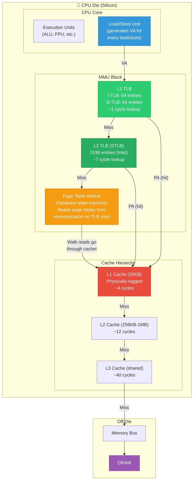

**Critical detail:** The page table walker's memory reads **go through the cache hierarchy**. Page table entries that are accessed frequently (like the PGD) often live in L1/L2 cache. This means:
- A TLB miss that has cached page table entries: ~20-50ns (4 L1 hits)
- A TLB miss with ALL page table entries in DRAM: ~400ns (4 DRAM reads)

---

## 6. TLB — The Translation Cache

### 6.1 What a TLB Entry Looks Like

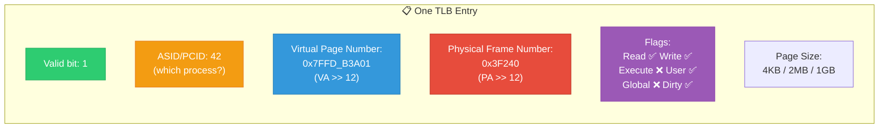

### 6.2 TLB Lookup Logic

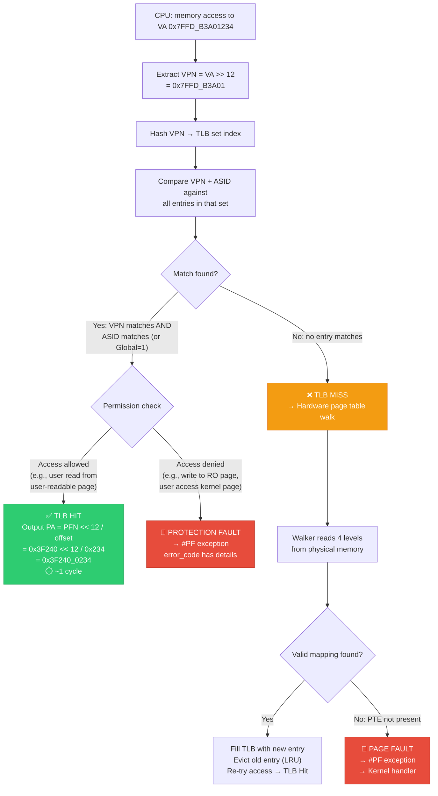

### 6.3 TLB Capacity and Miss Rates

```
Typical modern CPU TLB sizes (Intel Alder Lake / AMD Zen 4):

  L1 D-TLB:   64-96 entries (4KB pages)  +  32 entries (2MB pages)
  L1 I-TLB:   64-256 entries
  L2 STLB:    1536-2048 entries (unified, all page sizes)

Coverage with 4KB pages:
  64 L1 entries × 4KB   = 256 KB  ← very small!
  1536 L2 entries × 4KB = 6 MB    ← still limited

Coverage with 2MB pages:
  32 L1 entries × 2MB   = 64 MB
  1536 L2 entries × 2MB = 3 GB    ← much better!

That's why huge pages dramatically reduce TLB miss rates for
large-memory workloads (databases, VMs, ML training).
```

---

## 7. Page Table Walk — The Full Journey

This is the core of the document. Let's trace **every single step** the hardware takes.

### 7.1 The Walk as a Tree Traversal

```mermaid
flowchart TD
    subgraph Root["🏠 Starting Point"]
        CR3["CR3 Register<br/>Contains PHYSICAL address<br/>of PGD table<br/>= 0x0001_2345_6000"]
    end
    
    subgraph L4["Level 4: PGD (Page Global Directory)"]
        PGD_TABLE["PGD Table at PA 0x12345_6000<br/>512 entries, each 8 bytes<br/>Total = 4096 bytes = 1 page"]
        PGD_CALC["Address of entry:<br/>0x12345_6000 + (255 × 8)<br/>= 0x12345_67F8"]
        PGD_VAL["PGD[255] = 0x0000_0003_4567_8067<br/>Bits [51:12] = 0x3_4567_8 → PUD PA<br/>Bits [2:0] = 0b111 → Present, RW, User"]
    end
    
    subgraph L3["Level 3: PUD (Page Upper Directory)"]
        PUD_TABLE["PUD Table at PA 0x3_4567_8000<br/>512 entries"]
        PUD_CALC["Address of entry:<br/>0x3_4567_8000 + (502 × 8)<br/>= 0x3_4567_8FB0"]
        PUD_VAL["PUD[502] = 0x0000_0005_6789_A067<br/>→ PMD at PA 0x5_6789_A000<br/>Present=1, RW=1, User=1"]
    end
    
    subgraph L2["Level 2: PMD (Page Middle Directory)"]
        PMD_TABLE["PMD Table at PA 0x5_6789_A000<br/>512 entries"]
        PMD_CALC["Address of entry:<br/>0x5_6789_A000 + (413 × 8)<br/>= 0x5_6789_ACE8"]
        PMD_VAL["PMD[413] = 0x0000_0007_89AB_C067<br/>→ PTE at PA 0x7_89AB_C000<br/>Present=1, RW=1, User=1, PS=0"]
    end
    
    subgraph L1["Level 1: PTE (Page Table Entry)"]
        PTE_TABLE["PTE Table at PA 0x7_89AB_C000<br/>512 entries"]
        PTE_CALC["Address of entry:<br/>0x7_89AB_C000 + (1 × 8)<br/>= 0x7_89AB_C008"]
        PTE_VAL["PTE[1] = 0x8000_0003_F240_0067<br/>Bits [51:12] = 0x3_F240_0 → PFN<br/>Bit 63 = 1 → NX (no execute)<br/>Bit 6 = 1 → Dirty<br/>Bit 5 = 1 → Accessed<br/>Bit 0 = 1 → Present"]
    end
    
    subgraph Result["✅ Final Physical Address"]
        CALC["PA = (PFN << 12) / Offset<br/>= (0x3F240 << 12) / 0x234<br/>= 0x0000_0003_F240_0234"]
    end
    
    CR3 -->|"1️⃣ Read CR3"| PGD_TABLE
    PGD_TABLE --> PGD_CALC --> PGD_VAL
    PGD_VAL -->|"2️⃣ Extract PUD base"| PUD_TABLE
    PUD_TABLE --> PUD_CALC --> PUD_VAL
    PUD_VAL -->|"3️⃣ Extract PMD base"| PMD_TABLE
    PMD_TABLE --> PMD_CALC --> PMD_VAL
    PMD_VAL -->|"4️⃣ Extract PTE base"| PTE_TABLE
    PTE_TABLE --> PTE_CALC --> PTE_VAL
    PTE_VAL -->|"5️⃣ Extract PFN + offset"| CALC

    style CR3 fill:#c0392b,stroke:#922b21,color:#fff
    style PGD_VAL fill:#e74c3c,stroke:#c0392b,color:#fff
    style PUD_VAL fill:#f39c12,stroke:#e67e22,color:#fff
    style PMD_VAL fill:#3498db,stroke:#2980b9,color:#fff
    style PTE_VAL fill:#2ecc71,stroke:#27ae60,color:#fff
    style CALC fill:#9b59b6,stroke:#8e44ad,color:#fff
```

### 7.2 Walk as a Pointer Chase (C equivalent)

```c
/*
 * What the MMU hardware does on EVERY TLB miss.
 * This is the C equivalent of the circuit logic.
 */

/* Step 0: CPU reads CR3 to find PGD base */
uint64_t cr3 = read_cr3();
uint64_t *pgd_base = (uint64_t *)(cr3 & ~0xFFF); /* mask out PCID */

/* Step 1: Index into PGD */
int pgd_idx = (va >> 39) & 0x1FF;
uint64_t pgd_entry = pgd_base[pgd_idx];

if (!(pgd_entry & 0x1))  /* bit 0 = Present */
    trigger_page_fault(va, error_code);  /* #PF */

/* Step 2: Index into PUD */
uint64_t *pud_base = (uint64_t *)(pgd_entry & 0x000FFFFF_FFFFF000);
int pud_idx = (va >> 30) & 0x1FF;
uint64_t pud_entry = pud_base[pud_idx];

if (!(pud_entry & 0x1))
    trigger_page_fault(va, error_code);

/* Check 1GB huge page */
if (pud_entry & 0x80) {  /* bit 7 = PS (Page Size) */
    uint64_t pa = (pud_entry & 0x000FFFFF_C0000000) | (va & 0x3FFFFFFF);
    return pa;  /* 1GB page: done! */
}

/* Step 3: Index into PMD */
uint64_t *pmd_base = (uint64_t *)(pud_entry & 0x000FFFFF_FFFFF000);
int pmd_idx = (va >> 21) & 0x1FF;
uint64_t pmd_entry = pmd_base[pmd_idx];

if (!(pmd_entry & 0x1))
    trigger_page_fault(va, error_code);

/* Check 2MB huge page */
if (pmd_entry & 0x80) {  /* PS bit */
    uint64_t pa = (pmd_entry & 0x000FFFFF_FFE00000) | (va & 0x1FFFFF);
    return pa;  /* 2MB page: done! */
}

/* Step 4: Index into PTE */
uint64_t *pte_base = (uint64_t *)(pmd_entry & 0x000FFFFF_FFFFF000);
int pte_idx = (va >> 12) & 0x1FF;
uint64_t pte_entry = pte_base[pte_idx];

if (!(pte_entry & 0x1))
    trigger_page_fault(va, error_code);

/* Step 5: Compute physical address */
uint64_t pfn = (pte_entry & 0x000FFFFF_FFFFF000) >> 12;
uint64_t offset = va & 0xFFF;
uint64_t pa = (pfn << 12) | offset;

/* Step 6: Permission checks (hardware does these simultaneously) */
if ((pte_entry >> 63) & 1)  /* NX bit: no execute */
    if (access_type == EXECUTE)
        trigger_page_fault(va, error_code);

if (!((pte_entry >> 1) & 1))  /* R/W bit = 0: read-only */
    if (access_type == WRITE)
        trigger_page_fault(va, error_code);

/* Step 7: Set Accessed and Dirty bits (hardware write-back) */
pte_base[pte_idx] |= (1 << 5);  /* Accessed bit */
if (access_type == WRITE)
    pte_base[pte_idx] |= (1 << 6);  /* Dirty bit */

/* Step 8: Install in TLB */
tlb_install(va >> 12, pfn, flags_from(pte_entry));

return pa;
```

### 7.3 Walk Timing Diagram

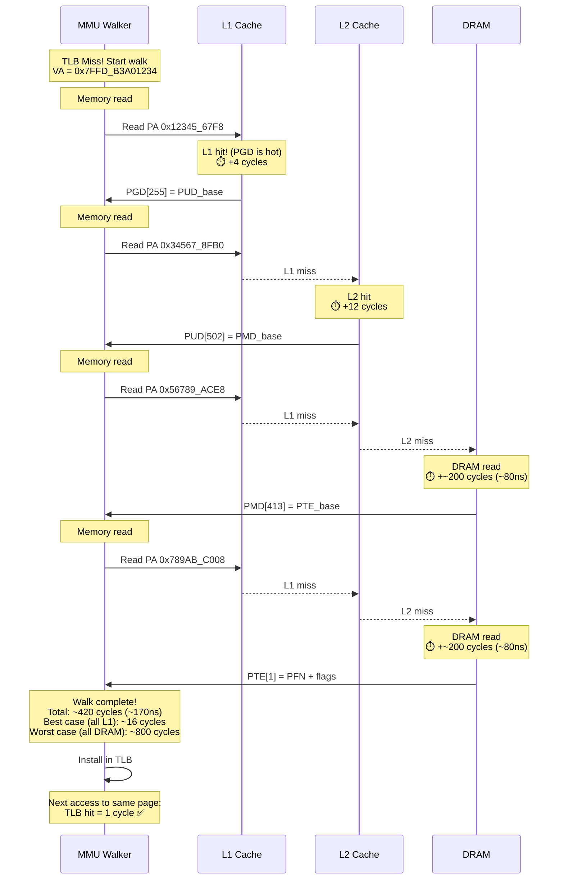

---

## 8. Page Table Entry (PTE) — Bit-by-Bit Anatomy

### 8.1 x86_64 PTE Format (64 bits)

```mermaid
flowchart TD
    subgraph PTE_Bits["📝 PTE — Every Single Bit"]
        direction TB
        B63["Bit 63: NX (No Execute)<br/>1 = cannot fetch instructions from this page<br/>0 = executable"]
        B62_59["Bits 62-59: Protection Key (4 bits)<br/>Index into PKRU register for<br/>user-space memory protection"]
        B58_52["Bits 58-52: Available to OS<br/>Linux uses: soft-dirty, devmap, etc."]
        B51_12["Bits 51-12: Physical Page Frame Number (PFN)<br/>40 bits → max 2^52 = 4PB physical address space"]
        B11_9["Bits 11-9: Available to OS<br/>Linux: _PAGE_BIT_SPECIAL, etc."]
        B8["Bit 8: G (Global)<br/>1 = don't flush this TLB entry<br/>on CR3 write (used for kernel)"]
        B7["Bit 7: PAT (Page Attribute Table)<br/>Controls memory type (WB/WC/UC)"]
        B6["Bit 6: D (Dirty)<br/>1 = page has been WRITTEN to<br/>Set by HARDWARE on write"]
        B5["Bit 5: A (Accessed)<br/>1 = page has been READ or WRITTEN<br/>Set by HARDWARE on any access"]
        B4["Bit 4: PCD (Page Cache Disable)<br/>1 = disable caching for this page<br/>(used for MMIO/device memory)"]
        B3["Bit 3: PWT (Page Write-Through)<br/>1 = write-through caching policy"]
        B2["Bit 2: U/S (User/Supervisor)<br/>1 = user-mode can access<br/>0 = kernel-only (ring 0)"]
        B1["Bit 1: R/W (Read/Write)<br/>1 = writable<br/>0 = read-only"]
        B0["Bit 0: P (Present)<br/>1 = valid mapping, page in RAM<br/>0 = not present → page fault on access"]
    end

    style B63 fill:#e74c3c,stroke:#c0392b,color:#fff
    style B51_12 fill:#3498db,stroke:#2980b9,color:#fff
    style B6 fill:#f39c12,stroke:#e67e22,color:#fff
    style B5 fill:#f39c12,stroke:#e67e22,color:#fff
    style B2 fill:#9b59b6,stroke:#8e44ad,color:#fff
    style B1 fill:#2ecc71,stroke:#27ae60,color:#fff
    style B0 fill:#2ecc71,stroke:#27ae60,color:#fff
```

### 8.2 What Non-Present PTE Values Mean

When P=0, the PTE is **not used by hardware** at all. The kernel encodes information in the remaining bits:

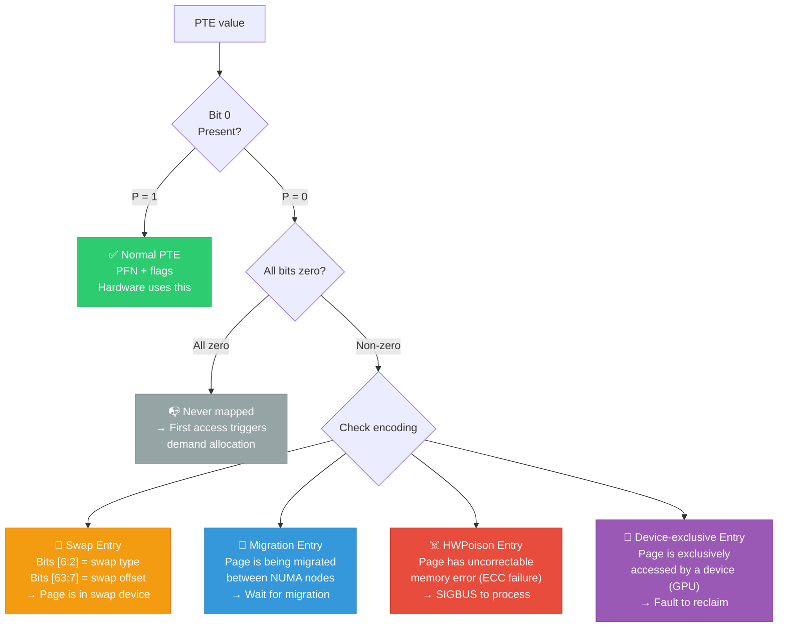

---

## 9. How Mapping is Created — From mmap to PTE Installation

A mapping exists in **two layers**: the VMA (virtual) and the page table (actual translation). They're created at different times.

### 9.1 mmap — Creating the Virtual Mapping

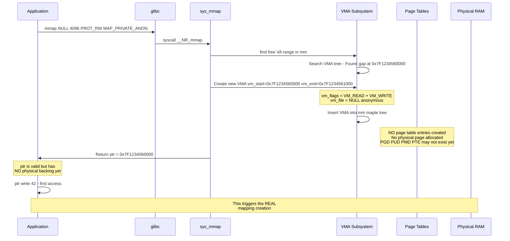

**Key insight:** `mmap()` only creates a **bookkeeping entry** (VMA). It does NOT create page table entries or allocate physical RAM. This is the "lazy" approach — allocation is deferred until first access.

### 9.2 First Access — Page Fault Creates the Real Mapping

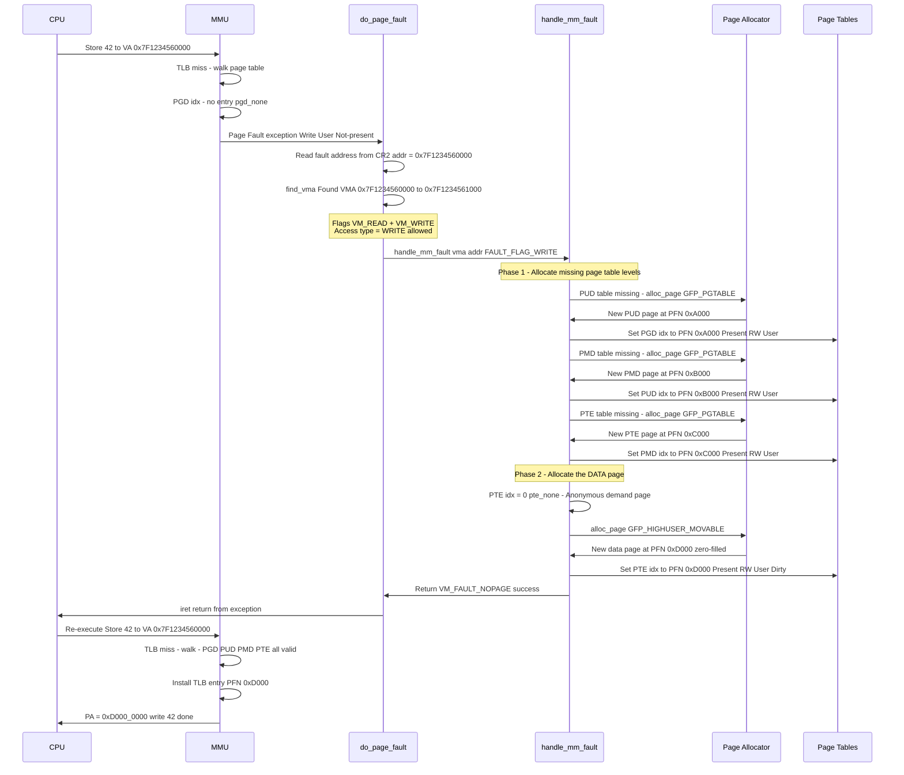

---

## 10. Demand Paging — Lazy Physical Allocation

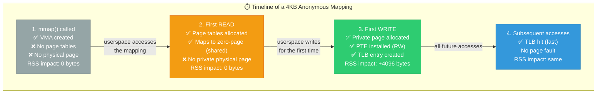

### The Zero Page Optimization

```c
/*
 * First READ to anonymous memory:
 * Instead of allocating a new zeroed page, Linux maps the
 * global zero_page (read-only). All processes share it.
 * Only on WRITE does COW trigger a private allocation.
 */

/* In handle_pte_fault → do_anonymous_page: */
static vm_fault_t do_anonymous_page(struct vm_fault *vmf)
{
    struct page *page;
    pte_t entry;

    if (!(vmf->flags & FAULT_FLAG_WRITE)) {
        /* READ fault: map the zero page (shared, read-only) */
        entry = pte_mkspecial(
                  pfn_pte(my_zero_pfn(vmf->address), 
                          vma->vm_page_prot));
        /* prot is READ-ONLY even if VMA allows write */
        
        vmf->pte = pte_offset_map_lock(mm, vmf->pmd, 
                                        vmf->address, &vmf->ptl);
        set_pte_at(mm, vmf->address, vmf->pte, entry);
        /* No RSS increase — zero page is shared */
        
    } else {
        /* WRITE fault: allocate private page */
        page = alloc_zeroed_user_highpage_movable(vma, vmf->address);
        /* This IS a real allocation → RSS increases */
        
        entry = mk_pte(page, vma->vm_page_prot);
        entry = pte_mkdirty(pte_mkwrite(entry));
        
        set_pte_at(mm, vmf->address, vmf->pte, entry);
        add_mm_counter(mm, MM_ANONPAGES, 1);
    }
    return 0;
}
```

---

## 11. How Physical Pages are Chosen

When the kernel needs a physical page (for the page table walk's end result), where does it come from?

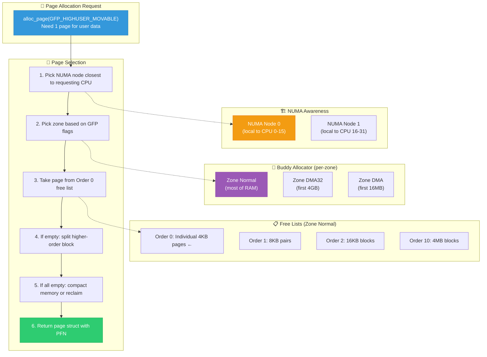

The PFN returned by the allocator is what gets stored in the PTE entry — completing the virtual-to-physical mapping.

---

## 12. The Return Path — Physical Address to DRAM

After translation, the physical address must reach the actual DRAM chip. Here's how:

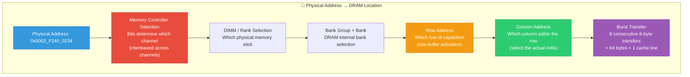

```
Physical Address breakdown (DDR4 example):

PA = 0x0003_F240_0234

Memory controller decodes:
  Channel:    PA[6]                         → Channel 0
  Rank:       PA[17]                        → Rank 0
  Bank Group: PA[8:7]                       → Bank Group 1
  Bank:       PA[16:15]                     → Bank 2
  Row:        PA[33:18]                     → Row 0xFC90
  Column:     PA[14:9] concat PA[5:3]       → Column 0x11A
  Byte:       PA[2:0]                       → Byte 4

Access sequence:
  1. ACTIVATE row 0xFC90 in Bank Group 1, Bank 2  (~13ns tRCD)
  2. READ column 0x11A with burst length 8         (~13ns CAS latency)
  3. Transfer 64 bytes (cache line) to CPU         (~3.2ns for 8 beats)
  
  Total: ~30ns from MC to data return
  Including MC queuing + bus latency: ~60-80ns total
```

---

## 13. Kernel Direct Mapping — The Shortcut

The kernel has a special optimization: **all physical RAM is linearly mapped** starting at `PAGE_OFFSET`.

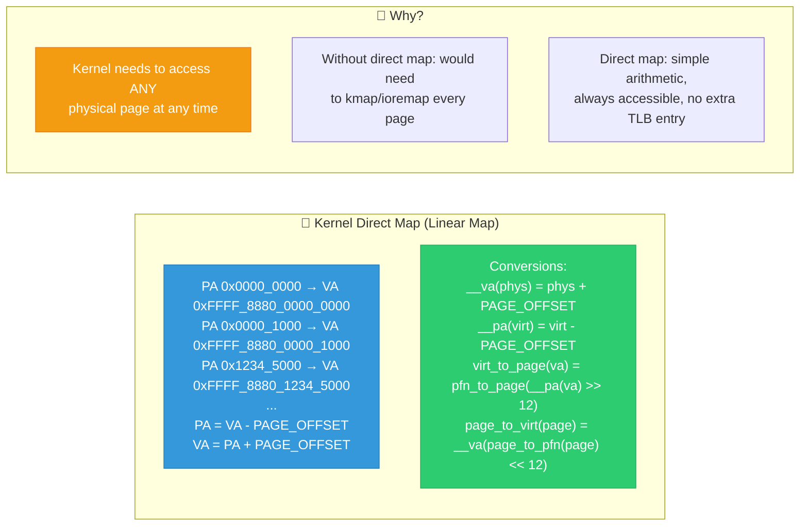

```c
/* These macros are the most common VA↔PA conversions in kernel code */

/* Physical → Virtual (kernel linear map) */
static inline void *__va(phys_addr_t pa)
{
    return (void *)(pa + PAGE_OFFSET);
    /* PAGE_OFFSET = 0xFFFF_8880_0000_0000 on x86_64 */
}

/* Virtual → Physical (only for direct-mapped addresses!) */
static inline phys_addr_t __pa(void *va)
{
    return (unsigned long)va - PAGE_OFFSET;
}

/* 
 * IMPORTANT: __pa() only works for kernel direct-map addresses!
 * For vmalloc, module, or user-space addresses, you MUST walk 
 * the page table to find the physical address.
 */
```

**The direct map has page table entries too** — they're set up at boot by the kernel. But the mapping is trivial: 1:1 linear. The kernel creates these mappings using 1GB huge pages (PUD level) for efficiency:

```
Kernel direct map page tables (1GB huge pages):
  PGD → PUD[0]: PA 0x0_0000_0000 (1GB huge, Present, RW, Global, NX)
  PGD → PUD[1]: PA 0x0_4000_0000 (1GB huge, ...)
  PGD → PUD[2]: PA 0x0_8000_0000 (1GB huge, ...)
  ...
  PGD → PUD[7]: PA 0x1_C000_0000 (1GB huge, ...)  ← for 8GB RAM

  Total page table overhead: 1 PGD + 1 PUD = 8 KB
  Maps: entire 8 GB of RAM
  TLB entries needed: 8 (one per 1GB page)
```

---

## 14. Real-World Scenario: malloc → Physical RAM

Let's trace `malloc(64)` from application to DRAM cell:

```mermaid
sequenceDiagram
    participant APP as Application
    participant GLIBC as glibc malloc
    participant KERNEL as Kernel
    participant PT as Page Tables
    participant HW as MMU Hardware
    participant DRAM as Physical DRAM

    Note over APP: char *p = malloc(64);

    APP->>GLIBC: malloc(64)
    Note over GLIBC: malloc checks its arena:<br/>Has a free 64-byte chunk<br/>in existing heap? YES<br/>(usually—heap grows lazily)
    GLIBC->>APP: Return p = 0x55A2_3400_1240<br/>(pointer within existing heap page)

    Note over APP: *p = 'A'; // first write

    APP->>HW: Store 'A' to VA 0x55A2_3400_1240
    
    HW->>HW: Check TLB for VPN 0x55A2_34001
    
    alt Page already faulted in (common case)
        HW->>HW: TLB hit → PA = 0x2E001240
        HW->>DRAM: Write 'A' to PA 0x2E001240 ✅
    else First access to this heap page
        HW->>HW: TLB miss → walk page table
        HW->>HW: Walk hits PTE with not-present
        HW->>KERNEL: #PF: VA 0x55A2_3400_1240, write
        
        KERNEL->>KERNEL: find_vma → heap VMA found<br/>[0x55A2_3400_0000 − 0x55A2_3402_1000]
        
        KERNEL->>KERNEL: Allocate page frame<br/>PFN = 0x2E001
        KERNEL->>KERNEL: Zero-fill page (security!)
        KERNEL->>PT: PTE = PFN 0x2E001 | Present | RW | User | Dirty
        
        KERNEL->>HW: iret → re-execute store
        HW->>HW: Walk succeeds → TLB filled
        HW->>DRAM: Write 'A' to PA 0x2E00_1240 ✅

    Note over DRAM: 'A' (0x41) is now stored<br/>at physical address 0x2E00_1240<br/>in DRAM row/column cell
```

### The Complete Address Flow:

```
1. malloc(64)
   └─ Returns VA: 0x55A2_3400_1240

2. CPU decomposes VA:
   └─ PGD index: (0x55A2_3400_1240 >> 39) & 0x1FF = 170
   └─ PUD index: (0x55A2_3400_1240 >> 30) & 0x1FF = 265
   └─ PMD index: (0x55A2_3400_1240 >> 21) & 0x1FF = 0
   └─ PTE index: (0x55A2_3400_1240 >> 12) & 0x1FF = 1
   └─ Offset:     0x55A2_3400_1240 & 0xFFF         = 0x240

3. Page table walk:
   CR3 → PGD base → PGD[170] → PUD base
   PUD base → PUD[265] → PMD base
   PMD base → PMD[0] → PTE base
   PTE base → PTE[1] → PFN = 0x2E001

4. Physical address:
   PA = (0x2E001 << 12) | 0x240 = 0x0000_0002_E001_0240

5. Memory controller:
   Decode 0x2E001_0240 → Channel 0, DIMM 0, Bank 3, Row 0x5C00, Col 0x009

6. DRAM:
   Activate row 0x5C00 → read/write column 0x009 → data 0x41 ('A')
```

---

## 15. Real-World Scenario: File Read via mmap

```mermaid
sequenceDiagram
    participant APP as Application
    participant SYS as Kernel [sys_mmap]
    participant MMU as MMU
    participant PF as Page Fault Handler
    participant FS as Filesystem [read_folio]
    participant BIO as Block I/O Layer
    participant DISK as Storage Device

    APP->>SYS: ptr = mmap(NULL, 4096, PROT_READ,<br/>MAP_PRIVATE, fd, 0)
    
    SYS->>SYS: Create VMA:<br/>vm_start = 0x7F5AB0001000<br/>vm_ops = ext4_file_vm_ops<br/>vm_file = fd's struct file
    SYS->>APP: ptr = 0x7F5AB0001000
    
    Note over APP: char c = *ptr; // read first byte
    
    APP->>MMU: Load from VA 0x7F5AB0001000
    MMU->>MMU: TLB miss → walk → PTE not present
    MMU->>PF: #PF (not present, read, user)
    
    PF->>PF: find_vma → file-backed VMA
    PF->>PF: handle_mm_fault → do_read_fault
    
    PF->>PF: Check page cache:<br/>page = find_get_page(mapping, 0)
    
    alt Page in page cache (warm read)
        PF->>PF: Page found in cache!<br/>Just install PTE
        PF->>PF: PTE = page_to_pfn(page) | Present | RO | User
        PF->>APP: Return — data available
    else Page NOT in cache (cold read)
        PF->>FS: filemap_fault → ext4_read_folio
        FS->>BIO: Submit bio for block read
        BIO->>DISK: Read LBA sector(s)
        DISK->>BIO: DMA data to page cache page
        BIO->>FS: I/O complete
        FS->>PF: Page now in page cache
        PF->>PF: PTE = page_to_pfn(page) | Present | RO | User
        PF->>APP: Return — data available
    
    Note over APP: c = 'H' (first byte of file)
    Note over APP: Future reads from same page:<br/>TLB hit → no fault → fast!
```

---

## 16. Multi-Process Sharing — Same Physical Page, Different VAs

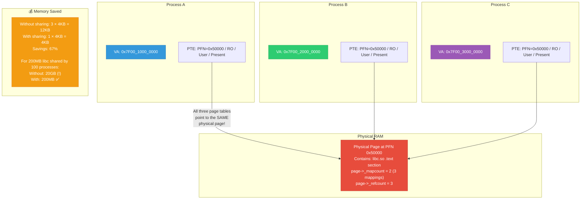

**How sharing is set up:**

```c
/* When Process B loads the same shared library as Process A: */

/* 1. mmap the .so file */
vma = mmap(NULL, size, PROT_READ|PROT_EXEC, MAP_PRIVATE, fd, 0);

/* 2. First access → page fault → filemap_fault() */
page = find_get_page(inode->i_mapping, offset);
/* find_get_page checks the PAGE CACHE — a per-inode cache.
 * If Process A already read this page, it's in the cache!
 * → Same struct page → same PFN → sharing happens automatically. */

/* 3. Set PTE pointing to the shared page */
pte = mk_pte(page, vma->vm_page_prot);  /* Same PFN! */
set_pte_at(mm, addr, ptep, pte);

/* 4. Increment page reference counts */
get_page(page);
page_dup_rmap(page, false);
```

---

## 17. What Happens When Things Go Wrong

### 17.1 Common Translation Failures

```mermaid
flowchart TD
    subgraph Faults["🔴 Translation Failure Scenarios"]
        F1["1. NULL Pointer Deref<br/>VA = 0x0000_0000_0000<br/>No VMA → SIGSEGV"]
        
        F2["2. Use After Free<br/>VA was in VMA, but<br/>munmap'd → no VMA<br/>→ SIGSEGV"]
        
        F3["3. Stack Overflow<br/>VA below stack VMA<br/>Can expand? YES → grow<br/>Beyond rlimit? → SIGSEGV"]
        
        F4["4. Write to .text<br/>PTE has RW=0, NX=0<br/>Write → permission fault<br/>VMA says VM_READ only<br/>→ SIGSEGV"]
        
        F5["5. Execute from stack<br/>PTE has NX=1<br/>Instruction fetch from<br/>no-execute page<br/>→ SIGSEGV"]
        
        F6["6. Kernel Oops<br/>Kernel accesses bad VA<br/>→ no VMA in kernel region<br/>→ kernel Oops / panic"]
    end

    style F1 fill:#e74c3c,stroke:#c0392b,color:#fff
    style F2 fill:#e74c3c,stroke:#c0392b,color:#fff
    style F3 fill:#f39c12,stroke:#e67e22,color:#fff
    style F4 fill:#c0392b,stroke:#922b21,color:#fff
    style F5 fill:#c0392b,stroke:#922b21,color:#fff
    style F6 fill:#7f0000,stroke:#5c0000,color:#fff
```

### 17.2 page fault error_code decode (x86_64)

```c
/*
 * x86_64 page fault error_code bits (in CR2/error_code):
 *
 * Bit 0 (P):     0 = not-present fault
 *                1 = protection violation (page exists but access denied)
 * Bit 1 (W/R):   0 = read access caused fault
 *                1 = write access caused fault
 * Bit 2 (U/S):   0 = fault in kernel mode
 *                1 = fault in user mode
 * Bit 3 (RSVD):  1 = reserved bit set in PTE (page table corruption!)
 * Bit 4 (I/D):   1 = instruction fetch caused fault (NX violation)
 * Bit 5 (PK):    1 = protection key violation
 * Bit 6 (SS):    1 = shadow stack access violation
 */

/* Kernel page fault handler decodes like this: */
static void __do_page_fault(struct pt_regs *regs, 
                             unsigned long error_code,
                             unsigned long address)
{
    if (error_code & PF_USER) {
        /* Fault from user space */
        if (error_code & PF_RSVD) {
            /* Reserved bit set → page table corruption! */
            force_sig_fault(SIGBUS, BUS_OBJERR, (void *)address);
            return;
        }
        /* ... find VMA, handle fault or send SIGSEGV ... */
    } else {
        /* Fault from kernel space — could be fixup or oops */
    }
}
```

---

## 18. Performance: Translation Cost

### 18.1 Cost Breakdown

```mermaid
flowchart TD
    subgraph Costs["⏱️ Translation Cost per Memory Access"]
        TLB_HIT["TLB L1 Hit<br/>~1 cycle (~0.3ns)<br/>99%+ of accesses"]
        TLB_L2["TLB L2 Hit<br/>~7 cycles (~2ns)<br/>~0.5% of accesses"]
        WALK_CACHED["Page Walk (cached)<br/>~20-50 cycles (~8-17ns)<br/>4 reads from L1/L2 cache"]
        WALK_DRAM["Page Walk (cold)<br/>~200-800 cycles (~70-280ns)<br/>4 reads from DRAM"]
        PF_MINOR["Minor Page Fault<br/>~3000-10000 cycles (~1-3µs)<br/>Page in cache, install PTE"]
        PF_MAJOR["Major Page Fault<br/>~10M+ cycles (~3-10ms)<br/>Read page from disk/swap"]
    end
    
    TLB_HIT --> TLB_L2 --> WALK_CACHED --> WALK_DRAM --> PF_MINOR --> PF_MAJOR
    
    subgraph Impact["📊 Real-World Impact"]
        I1["Database (1TB dataset):<br/>~5% TLB miss rate with 4KB pages<br/>~0.01% with 2MB huge pages<br/>→ 20% throughput improvement!"]
        I2["JVM (large heap):<br/>~2-3% TLB miss rate<br/>→ -XX:+UseTransparentHugePages<br/>→ 10-15% latency reduction"]
        I3["DPDK networking:<br/>Uses 1GB huge pages → <0.001% TLB miss<br/>→ Consistent 10Gbps line rate"]
    end

    style TLB_HIT fill:#2ecc71,stroke:#27ae60,color:#fff
    style TLB_L2 fill:#27ae60,stroke:#1e8449,color:#fff
    style WALK_CACHED fill:#f39c12,stroke:#e67e22,color:#fff
    style WALK_DRAM fill:#e67e22,stroke:#d35400,color:#fff
    style PF_MINOR fill:#e74c3c,stroke:#c0392b,color:#fff
    style PF_MAJOR fill:#7f0000,stroke:#5c0000,color:#fff
```

### 18.2 Performance Tools

```bash
# Measure TLB misses with perf
perf stat -e dTLB-load-misses,dTLB-loads,iTLB-load-misses,\
            dTLB-store-misses,page-faults ./my_application

# Example output:
#   25,103,847  dTLB-loads
#      147,291  dTLB-load-misses  # 0.59% of all dTLB loads
#       23,456  page-faults

# Profile page table walk cycles
perf stat -e dtlb_load_misses.walk_completed,\
            dtlb_load_misses.walk_active,\
            dtlb_load_misses.walk_pending ./my_application

# Check process page table sizes
grep -i "page" /proc/PID/status
#   VmPTE:      1024 kB    ← page table memory for PTEs
#   VmPMD:        12 kB    ← PMD page table memory

# Check THP usage
grep -i huge /proc/meminfo
#   AnonHugePages:  524288 kB
#   HugePages_Total: 0
```

---

## 19. Deep Q&A (20 Questions)

---

### ❓ Q1: Walk me through EXACTLY what happens at the silicon level when a CPU executes `mov rax, [rbx]` where rbx = 0x7FFD_B3A0_1234.

**A:**

```
Cycle 0:  Load-Store Unit (LSU) takes VA = 0x7FFD_B3A0_1234
          Compute VPN = 0x7FFD_B3A01

Cycle 0:  PARALLEL: TLB lookup begins
          Hash VPN → set index in L1 D-TLB
          Compare VPN + current PCID against all 8 ways in the set

Cycle 1:  TLB hit path:
          PFN found = 0x3F240, flags checked (User=1, RW=ok)
          PA = 0x3F240_0234
          → Send PA to L1 data cache (VIPT: Virtual Index, Physical Tag)
          
Cycle 1:  TLB miss path (if no match in L1 D-TLB):
          Check L2 STLB (~7 more cycles)
          If L2 miss: activate Page Table Walker hardware state machine

Walker:   Read PGD entry from cache/memory (PA from CR3 + offset)
          Wait for data → extract PUD base
          Read PUD entry
          Wait → extract PMD base
          Read PMD entry (check PS bit for 2MB page)
          Wait → extract PTE base
          Read PTE entry
          Wait → extract PFN, check permissions
          
          Install in TLB, replay the load instruction.

Cache:    PA 0x3F240_0234 sent to L1D tag array
          L1 hit: data to register in ~4 cycles total
          L1 miss → L2 → L3 → DRAM (~4/12/40/200 cycles)

Result:   rax = 8-byte value at physical address 0x3F240_0234
```

---

### ❓ Q2: Why must page table base addresses be page-aligned? Can a page table start at address 0x1001?

**A:**
No. Page table base addresses stored in PTE/PMD/PUD/PGD entries only store bits [51:12]. Bits [11:0] are used for flags. This means the base address has its bottom 12 bits forced to zero — it **must** be 4KB-aligned.

```
PGD entry value: 0x0000_0003_4567_8067
                         ^^^^^^^^^^^---- bits [51:12] = next table PA
                                   ^^^-- bits [11:0]  = FLAGS

Next table PA = 0x3_4567_8000   ← always ends in 000 (page-aligned)

If you tried PA 0x1001:
  bits [11:0] = 0x001 → that's the Present flag!
  bits [51:12] = 0x1 → PA of next table = 0x1000 (NOT 0x1001!)
  The bottom 12 bits are STOLEN for flags.
```

This is also why `alloc_page()` returns page-aligned memory — the buddy allocator only deals in complete pages.

---

### ❓ Q3: During a page table walk, can another CPU modify the page table entries being walked?

**A:**
Yes — this is a real race condition. The hardware walker and other CPUs can access the same PTE simultaneously. The architecture handles this:

**x86:** PTE updates are **atomic** at the 8-byte level (aligned qword writes). The A and D bits are updated atomically by hardware using locked bus cycles (or internal microarchitectural atomics). The kernel uses `cmpxchg` and `xchg` for PTE modifications.

**ARM:** Uses `STXR`/`LDXR` (store-exclusive/load-exclusive) for PTE updates. The hardware walker has priority, and there's an architectural requirement for software to use break-before-make for certain PTE changes (clear old entry → TLB invalidate → install new entry).

```c
/* Kernel PTE update — must be atomic */
static inline void set_pte(pte_t *ptep, pte_t pte)
{
    WRITE_ONCE(*ptep, pte);  /* Single 8-byte store (atomic on x86) */
}

/* Clearing a PTE — must be atomic and followed by TLB flush */
static inline pte_t ptep_get_and_clear(struct mm_struct *mm,
                                        unsigned long addr,
                                        pte_t *ptep)
{
    pte_t old = *ptep;
    /* On x86: uses XCHG which is implicitly locked */
    pte_t result = __pte(xchg(&ptep->pte, 0));
    return result;
    /* MUST flush TLB after this! */
}
```

---

### ❓ Q4: How does the kernel translate a user-space virtual address to a physical address from kernel context?

**A:**
The kernel cannot use `__pa()` for user addresses — `__pa()` only works for the kernel's direct map. Instead, the kernel must walk the user's page table, or use helper functions:

```c
/* Method 1: Walk the page table manually */
phys_addr_t user_va_to_pa(struct mm_struct *mm, unsigned long uva)
{
    pgd_t *pgd = pgd_offset(mm, uva);
    p4d_t *p4d = p4d_offset(pgd, uva);
    pud_t *pud = pud_offset(p4d, uva);
    pmd_t *pmd = pmd_offset(pud, uva);
    pte_t *pte = pte_offset_map(pmd, uva);
    
    phys_addr_t pa = (pte_pfn(*pte) << PAGE_SHIFT) | (uva & ~PAGE_MASK);
    pte_unmap(pte);
    return pa;
}

/* Method 2: Use GUP (Get User Pages) — preferred! */
struct page *page;
int ret = get_user_pages(uva, 1, FOLL_GET, &page);
if (ret == 1) {
    phys_addr_t pa = page_to_phys(page) + offset_in_page(uva);
    /* use pa ... */
    put_page(page);
}

/* Method 3: For current process, from kernel module */
unsigned long pa;
pgd_t *pgd = pgd_offset(current->mm, uva);
/* ... walk ... */
```

---

### ❓ Q5: What is the difference between `virt_to_phys()`, `__pa()`, `page_to_phys()`, and `slow_virt_to_phys()`?

**A:**

| Function | Input | Works For | How |
|----------|-------|-----------|-----|
| `__pa(va)` | kernel VA | Direct-map only | Subtract `PAGE_OFFSET` (arithmetic) |
| `virt_to_phys(va)` | kernel VA | Direct-map only | Same as `__pa()` |
| `page_to_phys(page)` | `struct page *` | Any page | `page_to_pfn(page) << PAGE_SHIFT` |
| `slow_virt_to_phys(va)` | kernel VA | **Any** kernel VA (vmalloc, modules) | Actually walks the page table! |

```c
/* slow_virt_to_phys is needed for vmalloc addresses */
void *vmalloc_addr = vmalloc(4096);  /* Not in direct map! */

/* WRONG: */
phys_addr_t bad = __pa(vmalloc_addr);  /* returns garbage! */

/* CORRECT: */
phys_addr_t good = slow_virt_to_phys(vmalloc_addr);  /* walks page table */
```

---

### ❓ Q6: What is "VIPT" cache and how does it interact with page table walks?

**A:**
**VIPT** = Virtually Indexed, Physically Tagged. Most modern L1 caches use this scheme:

```
Cache lookup happens in PARALLEL with TLB lookup:

Step 1 (parallel):
  TLB: VPN → PFN (computes PA tag)
  Cache: VA index bits → select cache set → read all tags + data

Step 2 (sequential):
  Compare PA tag from TLB with tags from cache set
  Match → cache hit → return data
  No match → cache miss → read from L2/L3/DRAM

WHY VIPT works for L1:
  L1 cache is typically 32KB, 8-way set associative, 64-byte lines
  Sets = 32768 / (8 × 64) = 64 sets
  Index bits = log2(64) = 6 bits (bits [11:6])
  
  Bits [11:6] are the SAME in VA and PA! (both are below PAGE_SHIFT=12)
  So virtual index == physical index for 4KB pages.
  → No aliasing problems with standard 32KB 8-way L1.
```

---

### ❓ Q7: Explain how CR3 switching during context switch relates to translation.

**A:**

```mermaid
sequenceDiagram
    participant SCHED as schedule[]
    participant CPU as CPU
    participant CR3 as CR3 Register
    participant TLB_R as TLB

    Note over SCHED: Context switch:<br/>Process A → Process B

    SCHED->>SCHED: switch_mm(A->mm, B->mm)
    
    SCHED->>CPU: Load B's PGD physical address
    Note over CPU: B->mm->pgd physical addr = 0x4567_8000
    
    alt Without PCID
        SCHED->>CR3: mov cr3, 0x4567_8000
        CR3->>TLB_R: Full TLB flush!<br/>All entries invalidated
        Note over TLB_R: Every VA now needs re-walk<br/>💥 Performance cliff!
    
    alt With PCID (modern)
        SCHED->>CR3: mov cr3, 0x4567_8000 | pcid_B | NOFLUSH
        Note over TLB_R: No flush! Old entries tagged<br/>with pcid_A still valid.<br/>New lookups use pcid_B.<br/>✅ Much faster!

    SCHED->>SCHED: switch_to(A, B)
    Note over SCHED: B's code now runs with<br/>B's page tables active.<br/>Same VA 0x400000 now<br/>maps to different PA!
```

**Without PCID:** Every context switch causes a TLB flush. If the OS switches 10,000 times/sec and each switch causes 100+ TLB misses at ~100ns each, that's 100µs of TLB refill per switch = 1 second per second in TLB walks. Catastrophic.

**With PCID:** TLB entries are tagged per-process. No flush needed. Only eviction when TLB runs out of space (natural LRU). Modern Linux uses PCID on all x86_64 CPUs since Westmere.

---

### ❓ Q8: How do `ioremap()` and MMIO interact with page table walks?

**A:**
`ioremap()` creates a page table mapping for a **physical device register region** (not RAM). The mapping needs special cache attributes:

```c
void __iomem *regs = ioremap(0xFE00_0000, 4096);
/* Creates mapping:
 * VA (somewhere in vmalloc range) →  PA 0xFE000000
 * PTE flags: Present=1, RW=1, PCD=1, PWT=1 (uncacheable!)
 *            User=0 (kernel only)
 *
 * PCD=1 (Page Cache Disable): Every read/write goes to the device!
 * If cacheable: CPU might read stale value from cache, not from device.
 *               CPU might buffer writes and never send to device.
 *               Device behavior would be completely wrong.
 */

/* Access flow: */
writel(0x1234, regs + 0x10);
/*
 * CPU: VA → PTE walk → PA 0xFE000010
 * PCD=1 → bypass cache entirely
 * Memory controller recognizes PA 0xFE000000 is NOT in DRAM range
 *   → Routes to PCIe root complex → PCIe bus → device
 * Device receives MMIO write at BAR offset 0x10, value 0x1234
 */
```

---

### ❓ Q9: What is the "split lock" / "split page table walk" problem?

**A:**
When a data access **crosses a page boundary** (e.g., a 4-byte read starting at offset 0xFFE of one page), the CPU must:

1. Walk page tables for **both** pages (two separate translations)
2. Read data from **two** physical pages
3. Combine the data

This is why alignment matters for performance — misaligned cross-page accesses cause double page table walks.

```
Address: 0x7FFD_0000_0FFE  (2 bytes before page end)
Size: 4 bytes (uint32_t)
Bytes needed: 
  0xFFE, 0xFFF from Page A (PFN 0x1000)
  0x000, 0x001 from Page B (PFN 0x2000)

CPU must:
  1. Walk page table for VA 0x7FFD_0000_0000 → PA 0x1000_0FFE
  2. Walk page table for VA 0x7FFD_0000_1000 → PA 0x2000_0000
  3. Read 2 bytes from each PA
  4. Combine into one 4-byte value

Cost: ~2× the TLB lookups, potential 2× cache misses
```

---

### ❓ Q10: How does the `mprotect()` syscall change translation behavior without changing the mapping?

**A:**
`mprotect()` only changes **flags** in existing PTEs, not the PFN. The VA→PA mapping stays the same, but the permissions change:

```c
/* User calls: mprotect(addr, 4096, PROT_READ); */
/* Changes page from RW to RO */

/* Kernel does: */
mprotect_fixup(vma, addr, addr + 4096, PROT_READ);
  ↓
change_protection(vma, addr, addr + 4096, new_pgprot)
  ↓
/* Walk page table, modify each PTE: */
for each PTE in range:
    old_pte = ptep_modify_prot_start(mm, addr, pte);
    /* old: PFN=0x3000, Present=1, RW=1, User=1 */
    
    new_pte = pte_modify(old_pte, new_pgprot);
    /* new: PFN=0x3000, Present=1, RW=0, User=1 */
    /*   ↑ unchanged!         ↑ changed!          */
    
    ptep_modify_prot_commit(mm, addr, pte, old_pte, new_pte);
    ↓
/* Then: flush TLB for this range */
flush_tlb_range(vma, addr, addr + 4096);
/* Must flush because old TLB entry has RW=1 */
```

---

### ❓ Q11: Explain the "page table page" lifecycle — allocation, use, and freeing.

**A:**

```mermaid
flowchart TD
    subgraph Lifecycle["🔄 Page Table Page Lifecycle"]
        ALLOC["1. ALLOCATION<br/>pte_alloc_one(mm) →<br/>alloc_page(GFP_PGTABLE_USER)<br/>→ __GFP_ZERO (must be zeroed!)<br/>→ __GFP_ACCOUNT (charged to cgroup)"]
        
        INIT["2. INITIALIZATION<br/>All 512 entries = 0 (pte_none)<br/>PMD entry set to point here"]
        
        FILL["3. FILLING<br/>Page faults fill entries one by one<br/>entry[0] = PFN_A / flags<br/>entry[1] = PFN_B / flags<br/>..."]
        
        PARTIAL["4. PARTIAL EMPTYING<br/>munmap removes some entries<br/>Some entries set back to 0"]
        
        EMPTY["5. FULLY EMPTY<br/>All 512 entries = 0<br/>→ Can be freed!"]
        
        FREE["6. FREE<br/>Clear parent (PMD) entry<br/>Flush TLB<br/>free_page(pte_page)<br/>mm_dec_nr_ptes(mm)"]
    end
    
    ALLOC --> INIT --> FILL --> PARTIAL --> EMPTY --> FREE

    style ALLOC fill:#2ecc71,stroke:#27ae60,color:#fff
    style FILL fill:#3498db,stroke:#2980b9,color:#fff
    style EMPTY fill:#f39c12,stroke:#e67e22,color:#fff
    style FREE fill:#e74c3c,stroke:#c0392b,color:#fff
```

**When process exits (`exit_mmap`):**
```c
/* Kernel frees ALL page table pages at once */
void free_pgtables(struct mmu_gather *tlb, ...)
{
    /* Walk entire page table tree */
    /* Free every PTE page, PMD page, PUD page */
    /* Finally: the PGD itself is freed by mm_free_pgd(mm) */
    
    /* This is why /proc/PID/status shows VmPTE dropping to 0 on exit */
}
```

---

### ❓ Q12: How is the mapping for the zero-page different from a normal mapping?

**A:**

```
Normal mapping:
  PTE → unique PFN (private physical page)
  refcount of page incremented
  Page can be dirtied, written back

Zero page mapping:
  PTE → ZERO_PFN (one global read-only page)
  PTE has SPECIAL bit set (_PAGE_SPECIAL)
  PTE is READ-ONLY even if VMA allows write
  
  On WRITE: COW fault → allocate real page → copy (nothing to copy,
    new page is already zeroed) → install private PTE with RW=1
  
  Benefits:
  - malloc(1GB) + read-only → uses ONE 4KB physical page!
  - All unwritten anonymous pages share the same zero page
  - RSS stays 0 until writes happen
```

---

### ❓ Q13: What happens to page table entries during `fork()`?

**A:**

```mermaid
sequenceDiagram
    participant PARENT as Parent [PID 100]
    participant FORK as fork[] / copy_page_range
    participant CHILD as Child [PID 101]

    Note over PARENT: Before fork:<br/>PTE at VA 0x1000:<br/>PFN=0x5000, RW=1, User=1<br/>One mapping, refcount=1

    PARENT->>FORK: fork()
    
    FORK->>FORK: Allocate new PGD for child
    FORK->>FORK: Walk parent's page tables

    loop For each present PTE in parent
        FORK->>FORK: Copy PTE value to child's page table
        FORK->>FORK: Make BOTH parent AND child PTEs READ-ONLY<br/>(clear R/W bit → COW setup)
        FORK->>FORK: Increment page refcount: 1 → 2
        FORK->>FORK: Increment page mapcount: 0 → 1

    Note over PARENT: After fork:<br/>Parent PTE: PFN=0x5000, RW=0<br/>Child PTE:  PFN=0x5000, RW=0<br/>Same page, mapcount=1, refcount=2
    
    Note over PARENT: Parent writes to VA 0x1000:
    PARENT->>PARENT: Write → PTE RW=0 → #PF<br/>COW: alloc new page 0x6000<br/>Copy 0x5000 → 0x6000<br/>Parent PTE: PFN=0x6000, RW=1

    Note over CHILD: Child still has:<br/>PTE: PFN=0x5000, RW=1 (restored<br/>because refcount dropped to 1)
```

---

### ❓ Q14: Explain the relationship between `struct page`, PFN, physical address, and PTE entry.

**A:**

```mermaid
flowchart TD
    subgraph Conversions["🔄 The Four Representations of a Physical Page"]
        PTE_E["PTE Entry Value<br/>0x8000_0003_F240_0067<br/>(stored in page table)"]
        
        PFN_V["Page Frame Number (PFN)<br/>0x3F240<br/>(index into physical memory)"]
        
        PA_V["Physical Address<br/>0x0003_F240_0000<br/>(actual bus address)"]
        
        SP["struct page *<br/>&mem_map[0x3F240]<br/>(kernel's page descriptor)"]
    end
    
    PTE_E -->|"pte_pfn(pte)<br/>= (pte >> 12) & MASK"| PFN_V
    PFN_V -->|"PFN << PAGE_SHIFT<br/>= 0x3F240 << 12"| PA_V
    PFN_V -->|"pfn_to_page(pfn)<br/>= vmemmap + pfn"| SP
    PA_V -->|"PA >> PAGE_SHIFT"| PFN_V
    SP -->|"page_to_pfn(page)<br/>= page - vmemmap"| PFN_V
    PA_V -->|"__va(pa)"| SP

    style PTE_E fill:#e74c3c,stroke:#c0392b,color:#fff
    style PFN_V fill:#f39c12,stroke:#e67e22,color:#fff
    style PA_V fill:#3498db,stroke:#2980b9,color:#fff
    style SP fill:#2ecc71,stroke:#27ae60,color:#fff
```

```c
/* Summary of all conversions: */

/* PTE → PFN */
unsigned long pfn = pte_pfn(pte_entry);

/* PFN → Physical Address */
phys_addr_t pa = (phys_addr_t)pfn << PAGE_SHIFT;

/* PFN → struct page */
struct page *page = pfn_to_page(pfn);

/* struct page → PFN */
unsigned long pfn = page_to_pfn(page); 

/* struct page → Physical Address */
phys_addr_t pa = page_to_phys(page);

/* Physical Address → struct page */
struct page *page = phys_to_page(pa);

/* Physical Address → Kernel Virtual Address (direct map only!) */
void *va = __va(pa);

/* Kernel Virtual Address → Physical Address (direct map only!) */
phys_addr_t pa = __pa(va);
```

---

### ❓ Q15: What is "reverse mapping" (rmap) and how does it relate to page table walks?

**A:**
Normal walk: VA → page table → PFN (find the physical page).
Reverse mapping: PFN → which PTEs map this page (find all mappers).

```
Why needed:
  - Page reclaim: to unmap a page, kernel must clear ALL PTEs pointing to it
  - Page migration: to move a page, kernel must update ALL PTEs
  - KSM (dedup): to merge identical pages, must update all mappings

How it works:
  struct page has an rmap tree (via page->mapping + anon_vma/address_space)
  
  For anonymous pages:
    page → anon_vma → list of VMAs → walk each VMA's page table
    to find the PTE that maps this page at the expected VA
  
  For file pages:
    page → address_space → i_mmap tree of VMAs → walk each VMA's
    page table to find PTEs
```

```mermaid
flowchart TD
    subgraph Forward["→ Forward Map (normal walk)"]
        VA_F["VA 0x7F000000"] --> PTE_F["PTE in Process A's table"] --> PFN_F["PFN 0x5000"]
    end
    
    subgraph Reverse["← Reverse Map (rmap)"]
        PFN_R["PFN 0x5000"]
        SP_R["struct page at PFN 0x5000<br/>page->mapping → anon_vma"]
        AV["anon_vma → linked list of<br/>anon_vma_chain entries"]
        VMA_A["VMA in Process A<br/>→ walk A's page table<br/>→ find PTE at expected VA"]
        VMA_B["VMA in Process B<br/>→ walk B's page table<br/>→ find PTE at expected VA"]
    end
    
    PFN_R --> SP_R --> AV
    AV --> VMA_A
    AV --> VMA_B

    style VA_F fill:#3498db,stroke:#2980b9,color:#fff
    style PFN_F fill:#e74c3c,stroke:#c0392b,color:#fff
    style PFN_R fill:#e74c3c,stroke:#c0392b,color:#fff
    style AV fill:#f39c12,stroke:#e67e22,color:#fff
```

---

### ❓ Q16: How are guard pages / stack guards implemented at the page table level?

**A:**

```
Stack guard: an unmapped page between the stack and other mappings.

Implementation:
  Stack VMA: [0x7FFD_FFE0_0000 — 0x7FFD_FFFF_F000] (128KB stack)
  Guard gap: [0x7FFD_FFDF_F000 — 0x7FFD_FFE0_0000] (4KB guard)
  
  Guard gap has NO VMA — it's intentionally unmapped.
  No page table entries exist for it.
  
  If stack overflows into guard:
  1. CPU accesses VA in guard range
  2. Page table walk → no PTE (or no PMD, etc.)
  3. #PF → do_page_fault
  4. find_vma → no VMA found for guard address
  5. → SIGSEGV → crash (or stack extension if allowed)
  
  Cost: zero! No physical memory, no page table entries.
  Just the absence of a mapping IS the guard.
```

---

### ❓ Q17: How does Address Space Layout Randomization (ASLR) affect page table layout?

**A:**
ASLR randomizes the base addresses of code, stack, heap, and mmap regions. This means:

1. **Different PGD/PUD/PMD indices** per process execution — attackers can't predict which page table entries are populated
2. **Different page table tree shapes** — the tree branches differently at each level
3. **No performance impact on translation** — the hardware walker doesn't care which indices; it always follows the tree

```
Without ASLR (deterministic):
  Program .text always at VA 0x0040_0000
  PGD[0] → PUD[0] → PMD[2] → PTE[0]

With ASLR (randomized):
  Run 1: .text at VA 0x5576_3400_0000
           PGD[170] → PUD[473] → PMD[0] → PTE[0]
  Run 2: .text at VA 0x55B2_1800_0000
           PGD[171] → PUD[200] → PMD[12] → PTE[0]
  Run 3: .text at VA 0x5621_9C00_0000
           PGD[172] → PUD[134] → PMD[224] → PTE[0]

Entropy: 28 bits for mmap base → 2^28 = 268M possible layouts
```

---

### ❓ Q18: What is "memory-mapped file I/O" and how does the page table make it work transparently?

**A:**

```
mmap() of a file creates a VMA that says:
  "VA range X → file Y at offset Z"

NO data is loaded. NO physical pages allocated. NO PTEs created.

When the process reads from that VA:
  1. TLB miss → walk → PTE not present → #PF
  2. Kernel: this VMA is file-backed → call filemap_fault()
  3. filemap_fault:
     a. Check page cache (radix tree indexed by offset)
     b. If NOT in cache: allocate page, submit read I/O, wait
     c. Page now in cache with file data
  4. Install PTE: PFN of cache page | Present | flags
  5. Return to user — process reads data without knowing disk I/O happened!

Write (MAP_SHARED):
  1. Write → PTE dirty bit set by hardware
  2. Kernel writeback daemon periodically scans dirty pages
  3. Writes dirty pages back to file on disk
  4. Process never calls write() — it just writes to memory!

This is how databases (PostgreSQL, MongoDB) do I/O — faster than 
read()/write() because it avoids kernel ↔ user buffer copies.
```

---

### ❓ Q19: How does the kernel ensure that page table modifications are visible to the hardware walker?

**A:**

```c
/*
 * The hardware page table walker reads from PHYSICAL memory 
 * (it bypasses the CPU cache on some architectures, or is 
 * cache-coherent on others).
 *
 * On x86: Walker is cache-coherent with CPU caches.
 *   → No explicit cache flush needed after PTE write.
 *   → But TLB must be flushed for stale entries!
 *
 * On ARM: Walker reads from cache-coherent memory (if inner-shareable).
 *   BUT: There are cases where DSB + ISB + TLBI are required.
 */

/* Correct PTE installation sequence: */
void install_new_pte(struct mm_struct *mm, pte_t *ptep,
                      unsigned long addr, pte_t new_pte)
{
    /* 1. Write new PTE to the page table page */
    set_pte_at(mm, addr, ptep, new_pte);
    /* set_pte_at internally does WRITE_ONCE for atomicity */
    
    /* 2. On ARM: DSB to ensure the store completes */
    /* (hidden inside set_pte_at on ARM) */
    
    /* 3. No TLB flush needed for NEW entries —
     *    walker will pick up the new PTE on next TLB miss.
     *    TLB flush is only needed when CHANGING or REMOVING
     *    an existing entry (because old TLB entry is stale). */
}

/* Correct PTE removal sequence: */
void remove_pte(struct mm_struct *mm, pte_t *ptep,
                 unsigned long addr)
{
    /* 1. Clear PTE atomically */
    pte_t old = ptep_get_and_clear(mm, addr, ptep);
    
    /* 2. MUST flush TLB! Old entry may be cached. */
    flush_tlb_page(find_vma(mm, addr), addr);
    
    /* Without step 2: CPU might use stale TLB entry
     * → access freed physical page → data corruption!
     * This is a SECURITY vulnerability (use-after-free). */
}
```

---

### ❓ Q20: Design question — if you had to implement virtual memory from scratch on a new CPU with NO hardware page table walker, how would you handle translation?

**A:**
This is the **software-managed TLB** approach (used by MIPS, older SPARC):

```mermaid
flowchart TD
    A["CPU accesses VA"] --> B{TLB Lookup}
    
    B -->|"Hit"| C["Use cached translation ✅"]
    
    B -->|"Miss"| D["TLB Miss TRAP<br/>(jumps to kernel handler<br/>at FIXED address, e.g., 0x80000000)"]
    
    D --> E["Kernel TLB miss handler:<br/>(runs without TLB for its own code —<br/>handler must be in unmapped/wired memory)"]
    
    E --> F["Walk page table in SOFTWARE:<br/>pgd = pgd_offset(mm, va)<br/>pte = pte_offset(pmd, va)"]
    
    F --> G{PTE valid?}
    
    G -->|"Yes"| H["Load PTE into TLB<br/>using privileged instruction:<br/>TLBWI (write indexed)<br/>TLBWR (write random)"]
    
    G -->|"No"| I["Call full page fault handler<br/>Allocate page, fill PTE<br/>Then load into TLB"]
    
    H --> J["Return from trap<br/>CPU re-executes instruction<br/>→ TLB hit ✅"]

    style D fill:#f39c12,stroke:#e67e22,color:#fff
    style E fill:#e74c3c,stroke:#c0392b,color:#fff
    style H fill:#2ecc71,stroke:#27ae60,color:#fff
```

**Key design decisions:**

```
1. TLB miss handler MUST be in wired/unmapped memory
   (it can't TLB-miss while handling a TLB miss!)

2. Page table format is entirely up to the OS
   (hardware doesn't walk it — kernel does!)
   → Can use hash tables, inverted page tables, etc.
   → MIPS Linux still uses hierarchical tables for simplicity

3. Performance tradeoff:
   - Hardware walker: ~20-100 cycle miss penalty (pipeline stall)
   - Software walker: ~100-500 cycle miss penalty (trap + handler)
   - But SW walker: kernel has full control, can optimize for workload

4. MIPS TLB miss handler is hand-optimized assembly:
   ONLY ~20 instructions, no function calls
   Goal: minimize cycles in the common path
```

---

## Summary — Complete Translation Flow Cheat Sheet

```mermaid
flowchart TD
    subgraph Full_Flow["📋 Complete VA → Physical DRAM Cell"]
        S1["1️⃣ CPU executes load/store<br/>with Virtual Address"]
        S2["2️⃣ TLB lookup: VPN + ASID/PCID<br/>~1 cycle if hit"]
        S3["3️⃣ TLB miss → HW page table walk<br/>CR3/TTBR → PGD → PUD → PMD → PTE<br/>4 memory reads, each ~4-200 cycles"]
        S4["4️⃣ PTE found: extract PFN + check flags<br/>PA = PFN << 12 / VA[11:0]"]
        S5["5️⃣ PTE not found → #PF → Kernel<br/>Allocate page, install PTE, retry"]
        S6["6️⃣ Install translation in TLB<br/>Future accesses: 1 cycle"]
        S7["7️⃣ Physical address sent to cache<br/>L1 → L2 → L3 → Memory Controller"]
        S8["8️⃣ Memory controller decodes PA<br/>→ Channel → DIMM → Bank → Row → Col"]
        S9["9️⃣ DRAM returns 64-byte cache line<br/>Fills cache hierarchy<br/>CPU gets the data ✅"]
    end
    
    S1 --> S2
    S2 -->|"Hit"| S7
    S2 -->|"Miss"| S3
    S3 -->|"Found"| S4 --> S6 --> S7
    S3 -->|"Not found"| S5 --> S6
    S7 --> S8 --> S9

    style S1 fill:#3498db,stroke:#2980b9,color:#fff
    style S2 fill:#2ecc71,stroke:#27ae60,color:#fff
    style S3 fill:#f39c12,stroke:#e67e22,color:#fff
    style S4 fill:#9b59b6,stroke:#8e44ad,color:#fff
    style S5 fill:#e74c3c,stroke:#c0392b,color:#fff
    style S6 fill:#1abc9c,stroke:#16a085,color:#fff
    style S7 fill:#3498db,stroke:#2980b9,color:#fff
    style S8 fill:#e67e22,stroke:#d35400,color:#fff
    style S9 fill:#2ecc71,stroke:#27ae60,color:#fff
```

---

[← Previous: 23 — Page Table Walk Deep Dive](23_Page_Table_Walk_Complete_Deep_Dive.md) | [Back to Index →](../ReadMe.Md)
