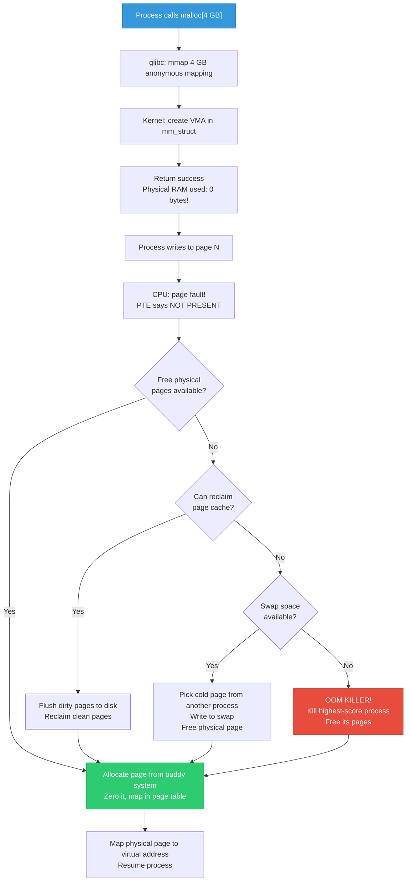

# 25 — Kernel/User Memory Split: 4GB System Deep Dive

## Table of Contents

1. [The Fundamental Question — 4GB RAM, Who Gets What?](#1-the-fundamental-question--4gb-ram-who-gets-what)
2. [Why Only 4GB? The 32-bit Address Space Limit](#2-why-only-4gb-the-32-bit-address-space-limit)
3. [The 3GB/1GB Split — How It Works](#3-the-3gb1gb-split--how-it-works)
4. [What Kernel Does With Its 1GB](#4-what-kernel-does-with-its-1gb)
5. [What User Space Gets With Its 3GB](#5-what-user-space-gets-with-its-3gb)
6. [What Happens When User Wants MORE Than 3GB Virtual Memory?](#6-what-happens-when-user-wants-more-than-3gb-virtual-memory)
7. [What Happens When System Needs MORE Than 4GB Physical RAM?](#7-what-happens-when-system-needs-more-than-4gb-physical-ram)
8. [The 64-bit Solution — No More Split Problem](#8-the-64-bit-solution--no-more-split-problem)
9. [Virtual Memory vs Physical Memory — The Key Confusion](#9-virtual-memory-vs-physical-memory--the-key-confusion)
10. [Overcommit — Linux Promises More Than It Has](#10-overcommit--linux-promises-more-than-it-has)
11. [Complete Memory Layout Diagrams](#11-complete-memory-layout-diagrams)
12. [Deep Interview Q&A — 25 Questions](#12-deep-interview-qa--25-questions)

---

## 1. The Fundamental Question — 4GB RAM, Who Gets What?

> **"I have 4GB of RAM. How much goes to kernel space and how much to user space?"**

The answer depends on whether you're asking about **virtual address space** or **physical RAM** — they are completely different things.

```
┌──────────────────────────────────────────────────────────────────┐
│              THE CRITICAL DISTINCTION                             │
│                                                                  │
│  VIRTUAL ADDRESS SPACE (fixed by architecture):                  │
│    32-bit CPU → 2^32 = 4 GB total virtual addresses              │
│    This 4GB is SPLIT between kernel and user:                    │
│      • User space:   3 GB  (0x00000000 – 0xBFFFFFFF)            │
│      • Kernel space:  1 GB  (0xC0000000 – 0xFFFFFFFF)            │
│                                                                  │
│  PHYSICAL RAM (whatever you installed):                          │
│    Could be 512MB, 1GB, 4GB, 8GB, 64GB...                       │
│    Kernel manages ALL physical RAM                               │
│    It allocates pages to kernel + user as needed                 │
│                                                                  │
│  KEY INSIGHT: The "split" is about VIRTUAL ADDRESSES,            │
│  NOT about physically partitioning your RAM sticks!              │
└──────────────────────────────────────────────────────────────────┘
```

---

## 2. Why Only 4GB? The 32-bit Address Space Limit

### The Math

```
A 32-bit CPU has 32 address lines:

    Address register: [31][30][29]...[2][1][0]
    
    Maximum value: 1111 1111 1111 1111 1111 1111 1111 1111 (binary)
                 = 0xFFFFFFFF (hex)
                 = 4,294,967,295 (decimal)
                 = 4 GB (bytes)

    So a 32-bit CPU can ADDRESS at most 4 GB of memory.
    Every byte of memory needs a unique address.
    32 bits can only produce 4 billion unique addresses = 4 GB.
```

### The Virtual Address Space

```
Every process thinks it has its own private 4 GB of memory:

    Process A sees:  0x00000000 ─────── 0xFFFFFFFF  (4 GB)
    Process B sees:  0x00000000 ─────── 0xFFFFFFFF  (4 GB)
    Process C sees:  0x00000000 ─────── 0xFFFFFFFF  (4 GB)
    
    These are VIRTUAL addresses.
    The MMU (hardware) translates them to PHYSICAL addresses.
    Multiple virtual addresses can map to the same physical page.
    Many virtual addresses map to NOTHING (not all 4 GB is used).
```

---

## 3. The 3GB/1GB Split — How It Works

### The Default Split (32-bit Linux)

```
    Virtual Address Space of EVERY Process (32-bit):
    
    0xFFFFFFFF ┌─────────────────────────┐
               │                         │
               │     KERNEL SPACE        │  1 GB
               │     (0xC0000000 -       │
               │      0xFFFFFFFF)        │
               │                         │
    0xC0000000 ├─────────────────────────┤ ← PAGE_OFFSET
               │                         │
               │                         │
               │     USER SPACE          │  3 GB
               │     (0x00000000 -       │
               │      0xBFFFFFFF)        │
               │                         │
               │                         │
    0x00000000 └─────────────────────────┘
    
    PAGE_OFFSET = 0xC0000000 (3 GB boundary)
    Defined in: arch/x86/include/asm/page_types.h
                arch/arm/include/asm/memory.h
```

### Why The Kernel Needs To Be In Every Process's Address Space

```
When a process makes a system call:

    User code:       printf("hello")
                         │
                         ▼
    Syscall:         write(1, "hello", 5)
                         │
                         ▼
    CPU:             Software interrupt / SVC instruction
                         │
                         ▼
    Mode switch:     User mode → Kernel mode
                         │
                         ▼
    SAME address space! No page table switch needed!
    The kernel code is already mapped at 0xC0000000+
    
    If kernel had a SEPARATE address space:
    → Every syscall would need a FULL page table switch
    → TLB flush on every syscall
    → Enormous performance penalty (thousands of ns per syscall)
    
    By mapping kernel into every process:
    → Syscall = just change privilege level (ring 3 → ring 0)
    → Same page tables, same TLB entries
    → Fast! (~100 ns per syscall)
```

### Kernel Space Is Protected From User Space

```
Even though kernel is mapped in user's address space:

    USER CODE:
        int *ptr = (int *)0xC0000000;    // Kernel address
        *ptr = 42;                        // TRY to write
        
    CPU:
        ┌──────────────────────────────────────┐
        │ Page table entry for 0xC0000000:     │
        │   Present: YES                        │
        │   User/Supervisor bit: SUPERVISOR     │ ← THE KEY!
        │   Current CPL: 3 (user mode)         │
        │                                      │
        │ CPL 3 accessing SUPERVISOR page?     │
        │ → PAGE FAULT! SEGFAULT!              │
        │ → Process killed with SIGSEGV        │
        └──────────────────────────────────────┘
    
    The MMU hardware enforces the protection.
    Kernel pages are marked "supervisor only" in page tables.
    User code (ring 3 / EL0) cannot access them.
```

### Alternative Splits

```
Linux supports different splits (compile-time config):

    CONFIG_VMSPLIT_3G     →  3G user / 1G kernel  (DEFAULT)
    CONFIG_VMSPLIT_2G     →  2G user / 2G kernel
    CONFIG_VMSPLIT_1G     →  1G user / 3G kernel

    ┌──────────┬──────────┬──────────┐
    │  3G/1G   │  2G/2G   │  1G/3G   │
    ├──────────┼──────────┼──────────┤
    │ K: 1 GB  │ K: 2 GB  │ K: 3 GB  │
    │          │          │          │
    │          │          │          │
    │ U: 3 GB  │ U: 2 GB  │ U: 1 GB  │
    │          │          │          │
    │          │          │          │
    └──────────┴──────────┴──────────┘
    
    More kernel space = can directly map more physical RAM
    More user space = larger programs possible
    
    Tradeoff: kernel vs user address space
```

---

## 4. What Kernel Does With Its 1GB

The kernel's 1 GB virtual address space is divided into several regions:

```
    Kernel Virtual Address Space (1 GB on 32-bit):
    
    0xFFFFFFFF ┌─────────────────────────┐
               │ Fixed mappings          │ ~4 MB
               │ (fixmap: early boot,    │
               │  local APIC, etc.)      │
    0xFFFFF000 ├─────────────────────────┤
               │                         │
               │ Temporary mappings      │ ~varies
               │ (kmap: highmem access)  │
               ├─────────────────────────┤
               │                         │
               │ vmalloc area            │ ~120 MB
               │ (non-contiguous pages,  │
               │  ioremap, module space) │
               │                         │
    VMALLOC_START├────────────────────────┤
               │ 8 MB gap (guard hole)   │
               ├─────────────────────────┤
               │                         │
               │ Direct mapping (lowmem) │ ~896 MB
               │ virt = phys + PAGE_OFFSET│
               │ (linear 1:1 mapping of  │
               │  physical RAM)          │
               │                         │
    0xC0000000 └─────────────────────────┘
               PAGE_OFFSET
```

### The Direct Mapping — Most Important Region

```
The first ~896 MB of kernel space is a DIRECT linear mapping
of physical RAM:

    Virtual Address          Physical Address
    ─────────────            ────────────────
    0xC0000000    ──────►    0x00000000
    0xC0000001    ──────►    0x00000001
    0xC0001000    ──────►    0x00001000
    ...
    0xF7FFFFFF    ──────►    0x37FFFFFF  (896 MB)
    
    Conversion is simple arithmetic:
    phys = virt - PAGE_OFFSET
    virt = phys + PAGE_OFFSET
    
    Macros:
    __pa(virt)  →  physical address
    __va(phys)  →  virtual address
    
    This is where kmalloc() memory comes from.
    This is where kernel data structures live.
    This is the FASTEST kernel memory access.
```

### Why Only 896 MB Out of 1 GB?

```
1 GB kernel space breakdown:
    - 896 MB: direct mapping (lowmem)
    -   8 MB: guard hole (unmapped, catches overflows)
    - ~120 MB: vmalloc area (for vmalloc, ioremap, modules)
    -  ~4 MB: fixmap + temporary mappings
    ─────────
    = ~1024 MB total

The 896 MB limit means:
    On a 4 GB RAM system with 3G/1G split:
    - Only 896 MB of physical RAM is directly mapped (lowmem)
    - The remaining ~3.1 GB is "highmem" — NOT directly mapped
    - Kernel must use kmap()/kmap_atomic() to temporarily access highmem
```

---

## 5. What User Space Gets With Its 3GB

### User Virtual Address Space Layout

```
    User Space (3 GB on 32-bit):
    
    0xBFFFFFFF ┌─────────────────────────┐
               │ Stack                   │ ↓ grows down
               │ (argv, envp, locals)    │   RLIMIT_STACK (~8 MB)
               ├─────────────────────────┤
               │         ↕               │
               │   Random gap (ASLR)     │
               │         ↕               │
               ├─────────────────────────┤
               │ Memory mapped files     │ ↓ grows down
               │ (shared libs, mmap)     │
               │ libc.so, libm.so, ...   │
               ├─────────────────────────┤
               │         ↕               │
               │   Unmapped space        │
               │         ↕               │
               ├─────────────────────────┤
               │ Heap                    │ ↑ grows up
               │ (malloc, brk)           │   via brk() or mmap()
               ├─────────────────────────┤
               │ BSS (uninitialized)     │
               │ Data (initialized)      │
               │ Text (code)             │
    0x08048000 └─────────────────────────┘
               │ Null page guard (4KB)   │
    0x00000000 └─────────────────────────┘
    
    A process does NOT use all 3 GB.
    Most of it is unmapped (page table entries not present).
    Only allocated portions have physical pages behind them.
```

### How Much Physical RAM Does a User Process Actually Use?

```
Example: A process with 3 GB virtual address space

    Virtual address range:    0x00000000 - 0xBFFFFFFF (3 GB)
    Actually mapped:          ~50 MB (text + data + heap + stack + libs)
    Physical pages used:      ~12,800 pages (50 MB / 4 KB)
    
    The other ~2.95 GB of virtual space?
    → Page table entries are marked "NOT PRESENT"
    → No physical RAM is wasted
    → Accessing unmapped address → SIGSEGV
    
    Virtual memory ≠ Physical memory usage!
```

---

## 6. What Happens When User Wants MORE Than 3GB Virtual Memory?

> **"What if my application needs more than 3 GB of memory on a 32-bit system?"**

### Scenario: Process Tries to Allocate 4 GB on 32-bit

```c
// 32-bit system, 3G/1G split
// Process tries to malloc(4GB)

#include <stdlib.h>
#include <stdio.h>

int main(void)
{
    /* Try to allocate 4 GB */
    void *ptr = malloc(4UL * 1024 * 1024 * 1024);
    
    if (ptr == NULL) {
        printf("FAILED! Cannot allocate 4 GB\n");
        printf("Reason: only 3 GB virtual address space available\n");
        return 1;
    }
    
    return 0;
}
```

### What Actually Happens — Step by Step

```
Step 1: malloc(4GB) called
    │
    ▼
Step 2: glibc calls mmap(NULL, 4GB, PROT_READ|PROT_WRITE, 
                          MAP_PRIVATE|MAP_ANONYMOUS, -1, 0)
    │
    ▼
Step 3: Kernel's do_mmap() checks:
    ┌──────────────────────────────────────────────┐
    │ Can we find 4 GB of contiguous virtual       │
    │ address space in the user range?             │
    │                                              │
    │ User range: 0x00000000 - 0xBFFFFFFF = 3 GB   │
    │ Requested:  4 GB                             │
    │                                              │
    │ 4 GB > 3 GB → IMPOSSIBLE!                    │
    │                                              │
    │ Return: -ENOMEM                              │
    └──────────────────────────────────────────────┘
    │
    ▼
Step 4: mmap returns MAP_FAILED
    │
    ▼
Step 5: malloc returns NULL

THE LIMIT IS THE VIRTUAL ADDRESS SPACE, NOT PHYSICAL RAM!
Even if you have 16 GB of physical RAM,
a 32-bit process can never address more than 3 GB.
```

### What If User Needs 3.5 GB? (Between 3GB and 4GB)

```
Options on 32-bit:

1. CHANGE THE SPLIT (recompile kernel):
   CONFIG_VMSPLIT_2G → gives user 2 GB (worse!)
   CONFIG_VMSPLIT_1G → gives user 1 GB (much worse!)
   
   There's no CONFIG_VMSPLIT_3_5G — you can't get more than 3 GB
   on standard 32-bit without tricks.

2. USE MULTIPLE PROCESSES:
   Process A uses 2 GB
   Process B uses 1.5 GB
   Each has its own 3 GB virtual address space
   Total physical RAM used: 3.5 GB (across both processes)

3. USE mmap() WINDOWING:
   Map 1 GB of a file → process, work on it
   Unmap → map NEXT 1 GB → work on it
   Like "scrolling" through a large dataset
   Total file can be much larger than 3 GB

4. SWITCH TO 64-BIT (the real solution):
   64-bit process gets 128 TB of virtual address space
   Problem solved permanently
```

### What If User Needs More Than Physical RAM?

```
Scenario: 4 GB physical RAM, process wants 3 GB

    Process calls malloc(3 GB):
    
    Step 1: malloc → mmap → kernel creates VMA (virtual)
            NO physical RAM allocated yet! (lazy allocation)
    
    Step 2: Process writes to first page:
            CPU → MMU → page fault! (not mapped yet)
            Kernel: allocate one 4 KB page → map it → resume
    
    Step 3: Process keeps writing pages...
            Each page fault → kernel allocates one physical page
    
    Step 4: Physical RAM runs low (say 3.5 GB in use):
            ┌─────────────────────────────────────────┐
            │ Kernel's memory reclaim kicks in:       │
            │                                         │
            │ 1. Flush dirty page cache to disk       │
            │ 2. Reclaim clean page cache pages        │
            │ 3. Swap out least-recently-used pages    │
            │    (write to swap partition/file)        │
            │ 4. Free'd physical pages → give to this │
            │    process                              │
            └─────────────────────────────────────────┘
    
    Step 5: If even swap is full:
            ┌─────────────────────────────────────────┐
            │ OOM KILLER activated!                    │
            │                                         │
            │ Kernel selects a process to kill:       │
            │ - Picks highest oom_score               │
            │ - Sends SIGKILL                         │
            │ - Frees that process's pages            │
            │ - Gives memory to the requesting process│
            └─────────────────────────────────────────┘
```

---

## 7. What Happens When System Needs MORE Than 4GB Physical RAM?

> **"My server has 8 GB of RAM but I'm running 32-bit Linux. What happens?"**

### The Problem

```
32-bit CPU address bus: 32 bits → can address 4 GB of physical memory
But modern systems have 8 GB, 16 GB, even 64 GB of RAM!

Without any extension:
    RAM installed:     8 GB
    CPU can address:   4 GB
    RAM wasted:        4 GB (completely invisible to CPU!)
```

### Solution 1: PAE (Physical Address Extension) — 32-bit Hack

```
Intel introduced PAE — extends the PHYSICAL address bus from 32 to 36 bits:

    Without PAE:    2^32 = 4 GB physical addressable
    With PAE:       2^36 = 64 GB physical addressable!

    CONFIG_HIGHMEM64G=y   (enables PAE in Linux)

    But here's the catch:
    ┌──────────────────────────────────────────────────────────┐
    │ VIRTUAL address space is STILL 32 bits = 4 GB            │
    │                                                          │
    │ Each process STILL sees only 3 GB user + 1 GB kernel     │
    │ A single process STILL can't use more than 3 GB          │
    │                                                          │
    │ BUT: the kernel can allocate different PHYSICAL pages     │
    │ from the full 64 GB to different processes                │
    │                                                          │
    │ Process A: 2 GB from physical RAM 0-2 GB                 │
    │ Process B: 2 GB from physical RAM 2-4 GB                 │
    │ Process C: 2 GB from physical RAM 4-6 GB                 │
    │ Process D: 2 GB from physical RAM 6-8 GB                 │
    │                                                          │
    │ Total: 8 GB physical used across 4 processes             │
    │ Each process sees only 3 GB virtual                      │
    └──────────────────────────────────────────────────────────┘
```

### How PAE Page Tables Work

```
Normal 32-bit page table (2-level):
    CR3 → Page Directory (1024 entries) → Page Table (1024 entries) → Page
    PDE: 20-bit physical address → 4 GB physical
    
PAE page table (3-level):
    CR3 → PDPT (4 entries) → Page Directory (512 entries) → 
          Page Table (512 entries) → Page
    PTE: 24-bit physical address → 64 GB physical!
    
    ┌──────────────────────────────────────┐
    │  PAE PTE format (64-bit entry):      │
    │                                      │
    │  [63]    NX (No Execute) bit         │
    │  [62:36] Reserved                    │
    │  [35:12] Physical page address       │ ← 24 bits = 64 GB
    │  [11:0]  Flags (present, RW, user)   │
    │                                      │
    │  Virtual address: still 32-bit       │
    │  Physical address: now 36-bit        │
    └──────────────────────────────────────┘
```

### Memory Zones With PAE — How Linux Manages It

```
Physical RAM layout with PAE (8 GB RAM, 32-bit kernel):

    Physical Address    Zone           Kernel Access
    ──────────────────  ─────────────  ──────────────────────────
    0x00000000 - 0x00FFFFFF   ZONE_DMA      (16 MB)  Direct mapped
    0x01000000 - 0x37FFFFFF   ZONE_NORMAL   (880 MB) Direct mapped
    0x38000000 - 0xFFFFFFFF   ZONE_HIGHMEM  (3.1 GB) kmap() needed
    0x100000000 - 0x1FFFFFFFF ZONE_HIGHMEM  (4 GB)   kmap() needed
    
    Direct mapped (lowmem): first 896 MB
    → Kernel accesses with simple virt = phys + 0xC0000000
    → kmalloc() memory comes from here
    
    Highmem: everything above 896 MB (in this case, ~7.1 GB)
    → Kernel CANNOT directly access!
    → Must use kmap() to create temporary mapping
    → map page, use it, unmap page (kmap window is tiny)
    
    This is why 32-bit + lots of RAM is painful.
    Most RAM is highmem = every access needs kmap overhead.
```

### Solution 2: Just Use 64-bit (The Real Answer)

```
64-bit completely eliminates the problem:

    Physical address bits:  48-52 bits → 256 TB - 4 PB
    Virtual address bits:   48 bits → 256 TB
    
    User space:    128 TB   (0x0000000000000000 - 0x00007FFFFFFFFFFF)
    Kernel space:  128 TB   (0xFFFF800000000000 - 0xFFFFFFFFFFFFFFFF)
    
    All physical RAM is directly mapped in kernel space.
    No highmem concept needed.
    No kmap() overhead.
    No PAE complexity.
    
    A single process can use up to 128 TB of virtual memory.
    Nobody is running out of address space anytime soon.
```

---

## 8. The 64-bit Solution — No More Split Problem

### 64-bit Virtual Address Space

```
    64-bit Virtual Address Space:
    
    0xFFFFFFFFFFFFFFFF ┌──────────────────────┐
                       │                      │
                       │   Kernel Space       │ 128 TB
                       │                      │
    0xFFFF800000000000 ├──────────────────────┤
                       │                      │
                       │   Canonical Hole     │ NOT addressable
                       │   (non-canonical     │ CPU faults if
                       │    addresses)        │ you try
                       │                      │
    0x00007FFFFFFFFFFF ├──────────────────────┤
                       │                      │
                       │   User Space         │ 128 TB
                       │                      │
    0x0000000000000000 └──────────────────────┘
    
    Comparison:
    ┌────────────────┬──────────────┬──────────────┐
    │                │   32-bit     │   64-bit     │
    ├────────────────┼──────────────┼──────────────┤
    │ User space     │   3 GB       │   128 TB     │
    │ Kernel space   │   1 GB       │   128 TB     │
    │ Physical max   │   4 GB (64GB │   256 TB+    │
    │                │   with PAE)  │              │
    │ Direct map     │   896 MB     │   ALL RAM    │
    │ Highmem needed │   YES        │   NO         │
    │ kmap overhead  │   YES        │   NO         │
    └────────────────┴──────────────┴──────────────┘
```

### 64-bit Kernel Direct Mapping

```
On 64-bit Linux, ALL physical RAM is directly mapped:

    Kernel virtual address:    0xFFFF888000000000 + physical_address
    (page_offset_base)
    
    Physical RAM: 256 GB?
    → All 256 GB directly mapped at 0xFFFF888000000000 - 0xFFFF88C000000000
    
    Physical RAM: 1 TB?  
    → All 1 TB directly mapped
    
    No highmem. No kmap. No windows. Just direct access.
    This is why 64-bit kernels are so much simpler and faster.
```

---

## 9. Virtual Memory vs Physical Memory — The Key Confusion

### The Illusion of Unlimited Memory

```
Consider a 64-bit system with only 2 GB of physical RAM:

    Process A: malloc(4 GB)  → SUCCESS! (virtual memory allocated)
    Process B: malloc(4 GB)  → SUCCESS! (virtual memory allocated)
    Process C: malloc(4 GB)  → SUCCESS! (virtual memory allocated)
    
    Total allocated: 12 GB virtual
    Physical RAM:    2 GB only!
    
    How?!
```

### The Three Key Mechanisms

```
1. LAZY ALLOCATION (Demand Paging):
   ┌─────────────────────────────────────────────────────┐
   │ malloc(4 GB) does NOT allocate 4 GB of physical RAM │
   │                                                     │
   │ It only creates a Virtual Memory Area (VMA):        │
   │   vm_start = 0x7F0000000000                        │
   │   vm_end   = 0x7F0100000000                        │
   │   vm_flags = VM_READ | VM_WRITE                    │
   │                                                     │
   │ Page table entries: all marked NOT PRESENT          │
   │ Physical pages allocated: ZERO                      │
   │                                                     │
   │ Only when you WRITE to a page:                     │
   │   CPU → page fault → kernel allocates ONE 4KB page │
   │   → maps it → process resumes                     │
   └─────────────────────────────────────────────────────┘

2. SWAP (Disk as Extension of RAM):
   ┌─────────────────────────────────────────────────────┐
   │ When physical RAM runs low:                         │
   │                                                     │
   │ Kernel picks "cold" pages (not recently accessed)   │
   │ → Writes them to swap partition/file on disk        │
   │ → Marks page table entry: NOT PRESENT + swap info  │
   │ → Physical page is FREE for reuse                  │
   │                                                     │
   │ When process accesses swapped page:                │
   │ → Page fault → kernel reads page back from disk    │
   │ → Maps it again → process resumes                 │
   │                                                     │
   │ VERY slow: disk I/O ~5ms vs RAM ~100ns (50,000x!)  │
   └─────────────────────────────────────────────────────┘

3. OVERCOMMIT (Promise now, deliver later... maybe):
   ┌─────────────────────────────────────────────────────┐
   │ Linux allows allocating MORE virtual memory than    │
   │ physical RAM + swap combined!                       │
   │                                                     │
   │ Why? Most programs allocate much more than they use │
   │                                                     │
   │ malloc(1 GB) → touches only 50 MB → only 50 MB     │
   │ of physical RAM actually used                       │
   │                                                     │
   │ But if everyone touches ALL their memory at once:   │
   │ → OOM Killer steps in → kills processes to free RAM │
   └─────────────────────────────────────────────────────┘
```

### The Complete Picture



---

## 10. Overcommit — Linux Promises More Than It Has

### Overcommit Modes

```c
// /proc/sys/vm/overcommit_memory

// Mode 0: HEURISTIC (default)
//   Kernel uses heuristic to decide if allocation is "too much"
//   Allows reasonable overcommit
//   Rejects obviously insane requests (e.g., malloc(1 PB))
//   Formula: deny if request > total_RAM + swap + page_cache * 0.5

// Mode 1: ALWAYS OVERCOMMIT
//   NEVER refuses any malloc/mmap request
//   Even malloc(1 PB) returns success
//   Used by: some database systems, scientific computing
//   Risk: OOM killer becomes more likely

// Mode 2: STRICT — NO OVERCOMMIT
//   Total committed memory cannot exceed:
//     CommitLimit = swap_size + (RAM * overcommit_ratio / 100)
//   Default overcommit_ratio: 50
//   Example: 4 GB RAM + 2 GB swap → limit = 2 + 4*0.5 = 4 GB
//   malloc(5 GB) → FAILS immediately with ENOMEM
//   Safest mode for critical systems
```

### What Happens at Each Level of Memory Pressure

```
Physical RAM: 4 GB      Swap: 2 GB      Total: 6 GB

Level 1: Comfortable (0-60% used)
    ┌────────────────────────────────────┐
    │ malloc → VMA created               │
    │ Page faults → pages from free list │
    │ Everything is fast and smooth      │
    └────────────────────────────────────┘

Level 2: Pressure starts (60-90% used)
    ┌────────────────────────────────────────────┐
    │ kswapd kernel thread wakes up              │
    │ Starts reclaiming page cache in background │
    │ Moves inactive pages to swap               │
    │ System slightly slower                     │
    └────────────────────────────────────────────┘

Level 3: High pressure (90-99% used)
    ┌────────────────────────────────────────────┐
    │ Direct reclaim: allocating process must    │
    │ help reclaim pages before it gets one      │
    │ System visibly slower                      │
    │ Swap I/O increases dramatically            │
    │ "Disk thrashing" — constant swap in/out    │
    └────────────────────────────────────────────┘

Level 4: Out of memory (100% used)
    ┌────────────────────────────────────────────┐
    │ OOM Killer activated!                      │
    │                                            │
    │ Selects victim process:                    │
    │   oom_score = memory_usage * oom_adj       │
    │   Highest score gets killed                │
    │                                            │
    │ Sends SIGKILL → process terminated         │
    │ Freed pages given to requesting process    │
    │                                            │
    │ dmesg: "Out of memory: Killed process      │
    │         1234 (my_app) total-vm:4194304kB"  │
    └────────────────────────────────────────────┘
```

---

## 11. Complete Memory Layout Diagrams

### 32-bit System: 4 GB RAM, 3G/1G Split

```
    VIRTUAL ADDRESS SPACE                PHYSICAL RAM
    (per process view)                   (single system-wide)
    
    0xFFFFFFFF ┌──────────────┐         ┌──────────────┐ 0xFFFFFFFF
               │ fixmap       │         │              │
               │ kmap         │         │              │
               │ vmalloc      │ ········│· HIGHMEM     │ 3.1 GB
               ├──────────────┤         │  (not direct │
               │              │         │   mapped)    │
               │ Direct Map   │ ═══════►│              │
               │ (lowmem)     │  1:1    ├──────────────┤ 0x38000000
               │ 896 MB       │  map    │ LOWMEM       │
    0xC0000000 ├══════════════┤ ═══════►│ 896 MB       │
               │              │         │ (direct map) │
               │              │         ├──────────────┤ 0x01000000
               │ USER SPACE   │         │ DMA zone     │ 16 MB
               │ 3 GB         │ ·······►│              │
               │              │  page   └──────────────┘ 0x00000000
               │              │  tables
    0x00000000 └──────────────┘  map virtual→physical
    
    USER pages: mapped via page tables (not direct)
    KERNEL lowmem: mapped via simple offset (virt = phys + 0xC0000000)
    KERNEL highmem: accessed via temporary kmap() windows
```

### 64-bit System: 16 GB RAM

```
    VIRTUAL ADDRESS SPACE                PHYSICAL RAM
    (per process view)                   (single system-wide)
    
    0xFFFFFFFFFFFFFFFF ┌────────────┐
                       │ Fixmap     │
                       │ vmalloc    │
                       │ vmemmap    │
                       ├────────────┤
                       │            │
                       │ Direct Map │ ═══════► ALL 16 GB
                       │ ALL RAM    │  1:1     directly mapped
                       │            │  map     No highmem!
                       │            │
    0xFFFF800000000000 ├════════════┤
                       │            │
                       │ Canonical  │   (Not addressable)
                       │   Hole     │
                       │            │
    0x00007FFFFFFFFFFF ├════════════┤
                       │            │
                       │ User Space │   128 TB
                       │            │
    0x0000000000000000 └────────────┘
    
    SIMPLE: All RAM is direct mapped. No zones complexity.
    All kernel memory ops are direct pointer access.
```

### What a Single Process Looks Like in Memory

```
32-bit process using 150 MB on a 4 GB system:

    Virtual Space (3 GB possible)     Physical RAM (4 GB total)
    ─────────────────────────         ──────────────────────────
    
    Stack:     8 MB virtual           Stack:      200 KB physical
               (8 MB reserved,        (only touched pages have
                most not touched)      physical pages)
    
    Heap:      500 MB virtual         Heap:       80 MB physical
               (allocated by malloc,   (only written pages have
                sparse usage)          physical pages)
    
    Shared     50 MB virtual          Shared      20 MB physical
    libs:      (libc, libm, etc.)     libs:       (shared with
                                                   other processes!)
    
    Code:      5 MB virtual           Code:       5 MB physical
               (.text section)                    (read-only,
                                                   may be shared)
    
    Total virtual: ~563 MB            Total physical: ~105 MB
    
    The rest of 3 GB? → NOT MAPPED (no page table entries)
    The rest of 4 GB? → Used by kernel + other processes + cache
```

---

## 12. Deep Interview Q&A — 25 Questions

### Q1: I have 4 GB RAM. How is it split between kernel and user space?

**A:** The 4 GB refers to **physical RAM**. The split is about **virtual address space**, not physical RAM.

On a **32-bit** system: each process gets a 4 GB virtual address space, split as:
- **3 GB** for user space (0x00000000 – 0xBFFFFFFF)
- **1 GB** for kernel space (0xC0000000 – 0xFFFFFFFF)

The kernel manages **all 4 GB of physical RAM** and allocates physical pages to kernel and user as needed. The split only determines how many virtual addresses are available for each.

On **64-bit**: user gets 128 TB virtual, kernel gets 128 TB virtual. The 4 GB physical RAM is fully accessible.

---

### Q2: Why can't a 32-bit process use all 4 GB?

**A:** Because the 4 GB virtual address space must be shared between the process AND the kernel. The kernel is mapped into every process's address space (upper 1 GB) so that system calls don't require a page table switch. This leaves only 3 GB for user space. The tradeoff is: less address space for user vs. fast syscalls.

---

### Q3: What is PAGE_OFFSET? Why is it important?

**A:** `PAGE_OFFSET` is the virtual address where kernel space begins. On 32-bit with 3G/1G split, `PAGE_OFFSET = 0xC0000000`. Everything below is user space, everything above is kernel space.

For the direct mapping region: `virtual_address = physical_address + PAGE_OFFSET`. This makes physical-to-virtual conversion trivial for kernel memory (lowmem). The macros `__pa()` and `__va()` use this offset.

---

### Q4: If I have 8 GB RAM on a 32-bit system, can the kernel use all of it?

**A:** Yes, but with significant overhead. Using **PAE** (Physical Address Extension), the 32-bit kernel can address up to 64 GB of physical RAM. However:
- Only 896 MB is **directly mapped** (lowmem)
- The remaining 7.1 GB is **highmem** — needs `kmap()` for temporary access
- Each `kmap()` creates a temporary mapping window, uses it, then unmaps
- Performance is worse than 64-bit because of constant kmap overhead
- A single process still can't use more than 3 GB — the virtual address limit remains

---

### Q5: What is the difference between lowmem and highmem?

**A:**

| Feature | Lowmem | Highmem |
|---------|--------|---------|
| Address range | First 896 MB of physical RAM | Everything above 896 MB |
| Kernel access | Direct mapping (virt = phys + PAGE_OFFSET) | Temporary mapping via kmap() |
| Zone | ZONE_DMA + ZONE_NORMAL | ZONE_HIGHMEM |
| kmalloc source | Yes — kmalloc comes from here | No — kmalloc cannot use highmem |
| Performance | Fast — direct pointer access | Slower — mapping overhead |
| User pages | Can be here | Usually allocated from here |
| Exists on 64-bit | All RAM is "lowmem" (direct mapped) | Concept doesn't exist |

---

### Q6: What happens when malloc() returns successfully but there's not enough physical RAM?

**A:** This is the **overcommit** situation. `malloc()` only reserves virtual address space (creates a VMA). Physical pages are allocated on demand (page faults). If physical RAM runs out when the process actually touches the memory:
1. Kernel tries to reclaim page cache
2. Kernel swaps out cold pages to disk
3. If even swap is full → **OOM killer** selects and kills a process to free memory
4. The requesting process may itself be killed

This is why `malloc()` succeeding doesn't guarantee the memory is actually available.

---

### Q7: What is the OOM killer? How does it choose which process to kill?

**A:** The OOM (Out Of Memory) killer is the kernel's last-resort mechanism when all memory (RAM + swap) is exhausted. It scores each process:

```
oom_score = (process_memory / total_memory) * 1000 + oom_score_adj
```

- Highest `oom_score` gets killed first
- `oom_score_adj` (–1000 to +1000): admin tunable per process
- `oom_score_adj = -1000`: process is unkillable (e.g., systemd)
- Kernel threads and init (PID 1) are never killed

View scores: `cat /proc/<pid>/oom_score`
Set adjustment: `echo -500 > /proc/<pid>/oom_score_adj`

---

### Q8: What is demand paging? Why doesn't malloc() allocate physical memory immediately?

**A:** Demand paging means physical pages are only allocated when first accessed (on page fault). `malloc()` creates a VMA but marks all page table entries as "not present."

**Why?**
1. Most programs allocate more than they use (sparse usage)
2. Allocating all at once would waste RAM on pages never touched
3. Allows more programs to run simultaneously (overcommit)
4. The kernel can make smart decisions about which physical pages to use

Example: `malloc(1 GB)` → touches 50 MB → only 50 MB physical. Without demand paging, 1 GB would be wasted.

---

### Q9: What happens when a process accesses a page that's been swapped out?

**A:** A **major page fault** occurs:
1. CPU translates virtual address → PTE says "not present" but has swap entry info
2. Page fault handler checks PTE → finds swap entry (file + offset)
3. Kernel allocates a free physical page
4. Reads the swapped-out data from disk/swap partition into the new page
5. Updates PTE to point to the new physical page (present = 1)
6. Process resumes — it has no idea this happened

Cost: ~5-15 ms (disk I/O latency) vs. ~100 ns for a normal RAM access = **50,000x slower**.

---

### Q10: Why does the kernel map itself into every process's address space?

**A:** Performance. If the kernel had its own separate address space:
- Every `syscall()` would require switching CR3 (page table base register)
- Every CR3 switch flushes the TLB (Translation Lookaside Buffer)
- TLB flush = all cached virtual-to-physical translations lost
- Next memory access requires a full page table walk (~100 ns penalty)
- With thousands of syscalls per second, this would be catastrophic

By sharing the address space, `syscall` = just change privilege level (CPL 3 → CPL 0). Same page tables, TLB stays warm. Cost: ~100 ns instead of ~1000+ ns.

**Note:** KPTI (Kernel Page Table Isolation, for Meltdown mitigation) partially undoes this — it unmaps most kernel pages from user-space page tables, trading performance for security.

---

### Q11: What is KPTI and how does it affect the kernel/user split?

**A:** KPTI (Kernel Page Table Isolation) was introduced to mitigate the **Meltdown** CPU vulnerability. It maintains **two sets of page tables** per process:
- **User page tables**: only user mappings + minimal kernel trampoline
- **Kernel page tables**: full user + kernel mappings

On **syscall entry**: switch from user tables → kernel tables
On **syscall exit**: switch from kernel tables → user tables

This means every syscall now has a TLB cost (~100-400 ns overhead). The kernel is no longer visible in the user's page tables, preventing Meltdown-style speculative access.

---

### Q12: Can two processes share physical memory?

**A:** Yes, through multiple mechanisms:

1. **Shared libraries**: libc.so is mapped read-only into hundreds of processes. Same physical pages, different virtual addresses.
2. **Copy-on-Write (COW)**: After `fork()`, parent and child share all pages (read-only). Physical copy only on write.
3. **Shared memory (`shmget`, `mmap MAP_SHARED`)**: Explicit sharing for IPC.
4. **Page cache**: File data is cached once; multiple processes reading the same file share the cache pages.

This is why `top` shows VSS (virtual) much larger than RSS (resident) — shared pages are counted once physically but multiple times virtually.

---

### Q13: What is the canonical hole in 64-bit address space?

**A:** Current 64-bit CPUs implement only 48 bits of virtual addressing (not full 64 bits). This creates a gap:

- User space: 0x0000000000000000 – 0x00007FFFFFFFFFFF (128 TB)
- **Canonical hole**: 0x0000800000000000 – 0xFFFF7FFFFFFFFFFF (**NOT addressable**)
- Kernel space: 0xFFFF800000000000 – 0xFFFFFFFFFFFFFFFF (128 TB)

Any address in the hole causes a **general protection fault**. The top bit (bit 47) must be "sign-extended" to bits 48-63 — hence either all zeros (user) or all ones (kernel). Future CPUs with 5-level paging extend this to 57 bits (128 PB each).

---

### Q14: What is virtual memory? Is it the same as swap?

**A:** No! Virtual memory and swap are different things:

- **Virtual memory**: The **address space abstraction** — each process thinks it has its own private contiguous memory. Implemented via page tables + MMU. Virtual addresses are translated to physical addresses.

- **Swap**: A **disk area** used as extension of physical RAM. When RAM is full, inactive pages are written to swap. It's ONE mechanism within the virtual memory system.

Virtual memory includes: demand paging, memory protection, shared memory, memory-mapped files, AND swap. Swap is just one tool of virtual memory.

---

### Q15: What is the difference between VSS, RSS, and PSS?

**A:**

| Metric | Full Name | Meaning | Example |
|--------|-----------|---------|---------|
| **VSS** | Virtual Set Size | Total virtual memory mapped | 4 GB (includes unmapped) |
| **RSS** | Resident Set Size | Physical pages currently in RAM | 150 MB |
| **PSS** | Proportional Set Size | RSS with shared pages divided by sharers | 80 MB |

Example: Process uses 100 MB private + shares libc (10 MB) with 9 other processes:
- VSS: 4 GB (full virtual space mapped)
- RSS: 110 MB (100 private + 10 shared)
- PSS: 101 MB (100 private + 10/10 shared)

PSS is the most accurate measure of a process's true memory cost.

---

### Q16: How does fork() work with respect to memory?

**A:** `fork()` uses **Copy-on-Write (COW)**:
1. Child gets a copy of parent's `mm_struct` and page tables
2. ALL pages in both parent and child are marked **read-only**
3. No physical pages are copied — both share the same frames
4. When either writes to a page → **page fault** → kernel copies just that page and makes it writable
5. Only modified pages get copied — unmodified pages stay shared forever

This makes `fork()` extremely cheap: O(page_tables) not O(memory_used). A 2 GB process can fork in microseconds.

---

### Q17: What is memory-mapped I/O (mmap)? How does it bypass the 3GB limit for files?

**A:** `mmap()` maps a file or device into the process's virtual address space. The file contents appear as if they're in memory — reads/writes to the mapping go to the file.

For files larger than 3 GB on 32-bit:
- You can't map the entire file at once (only 3 GB virtual space)
- Use **windowing**: map 1 GB region → process → unmap → map next 1 GB
- The file can be any size on disk; you only need enough virtual space for the current window

```c
// Map 1 GB window of a 10 GB file
void *window = mmap(NULL, 1*GB, PROT_READ, MAP_PRIVATE, fd, offset);
// Process data...
munmap(window, 1*GB);
// Map next window
window = mmap(NULL, 1*GB, PROT_READ, MAP_PRIVATE, fd, offset + 1*GB);
```

---

### Q18: What is CONFIG_VMSPLIT and when would you change it?

**A:** `CONFIG_VMSPLIT_*` is a kernel compile-time option that changes the kernel/user virtual address split on 32-bit:

| Config | User Space | Kernel Space | Use Case |
|--------|-----------|-------------|----------|
| VMSPLIT_3G | 3 GB | 1 GB | Default, most systems |
| VMSPLIT_2G | 2 GB | 2 GB | Kernel needs more direct map |
| VMSPLIT_1G | 1 GB | 3 GB | Server with lots of RAM, few user apps |

You'd change it when:
- Kernel can't directly map enough RAM (>896 MB needed for lowmem)
- Embedded systems with specific memory requirements
- Database servers where kernel buffer management needs more space

On 64-bit: this config doesn't exist (both get 128 TB).

---

### Q19: Can you explain vmalloc vs the direct mapping?

**A:**

| Feature | Direct Map (lowmem/kmalloc) | vmalloc |
|---------|----------------------------|---------|
| Physical pages | Contiguous | Non-contiguous |
| Virtual address | phys + PAGE_OFFSET | vmalloc region |
| Region | 0xC0000000 – ~0xF7FFFFFF | VMALLOC_START – VMALLOC_END |
| Size limit | 896 MB (32-bit) | ~120 MB (32-bit) |
| Speed | Fastest (no TLB miss for kernel) | Slightly slower (TLB reloads) |
| Use case | kmalloc, slab, page_alloc | Large non-contiguous allocs, ioremap |
| DMA capable | Yes (physically contiguous) | No |

vmalloc maps random physical pages to contiguous virtual addresses using page tables. This is useful when you need a large buffer but can't find contiguous physical pages.

---

### Q20: What is ZONE_DMA and why does it exist?

**A:** Legacy ISA DMA controllers can only address the first 16 MB of physical RAM (24-bit address bus). `ZONE_DMA` (0–16 MB) reserves pages for these old devices. Modern PCI devices use `ZONE_NORMAL` or any zone.

On 64-bit:
- `ZONE_DMA`: 0–16 MB (ISA legacy)
- `ZONE_DMA32`: 0–4 GB (for devices with 32-bit DMA limitation)
- `ZONE_NORMAL`: everything above (most of RAM)

GFP flags: `GFP_DMA` forces allocation from ZONE_DMA. Regular `GFP_KERNEL` uses ZONE_NORMAL (falls back to DMA zones if needed).

---

### Q21: What does `in_interrupt()` checking have to do with memory allocation?

**A:** `in_interrupt()` determines which GFP flags you must use:

- `in_interrupt() = true` → **GFP_ATOMIC** only (cannot sleep, uses emergency reserves)
- `in_interrupt() = false` → **GFP_KERNEL** preferred (can sleep for reclaim)

If you use `GFP_KERNEL` in interrupt context, the allocator might call `schedule()` to wait for memory reclaim (swapping pages, flushing cache). Since interrupt context can't sleep, this triggers: `BUG: scheduling while atomic`.

---

### Q22: How does the kernel allocate memory for itself vs for user processes?

**A:**

**Kernel memory allocation:**
- `kmalloc()` → slab allocator → buddy system → physical pages from lowmem
- Directly mapped: `virt = phys + PAGE_OFFSET`
- Always physically contiguous (within the allocation)
- Never swapped out (kernel pages are pinned)

**User memory allocation:**
- `malloc()` → `brk()` or `mmap()` → kernel creates VMA
- Pages allocated on demand (page faults)
- Page table maps virtual → physical (any physical page)
- CAN be swapped out when memory pressure occurs
- Physical pages need NOT be contiguous

---

### Q23: What is `/proc/meminfo` and what do the key fields mean?

**A:**

```
MemTotal:       4028396 kB    ← Total physical RAM (4 GB)
MemFree:         245892 kB    ← Completely unused pages
MemAvailable:   2856472 kB    ← Estimated available (free + reclaimable)
Buffers:          98304 kB    ← Block device metadata cache
Cached:         2512000 kB    ← Page cache (file data in RAM)
SwapTotal:      2097148 kB    ← Total swap space
SwapFree:       2097148 kB    ← Unused swap
Committed_AS:   5242880 kB    ← Total virtual memory committed (may > physical!)
VmallocTotal:    122880 kB    ← vmalloc address space available
VmallocUsed:      34816 kB    ← vmalloc space currently used
HighTotal:      3178496 kB    ← Highmem (32-bit only)
HighFree:         40960 kB    ← Free highmem pages
LowTotal:        849900 kB    ← Lowmem (32-bit only, ~896 MB)
LowFree:         204932 kB    ← Free lowmem pages
```

**Key insight:** `Committed_AS` (5.2 GB) > `MemTotal` (4 GB) — this is overcommit! The system has promised more memory than physically exists.

---

### Q24: In embedded systems (Qualcomm/NVIDIA SoCs), how is the memory split handled?

**A:** Modern SoCs are all 64-bit (ARM64/AArch64), so the 3G/1G split doesn't apply:

**Qualcomm (Snapdragon):**
- ARM64 with 48-bit VA → 256 TB total
- Kernel: `0xFFFF000000000000 – 0xFFFFFFFFFFFFFFFF`
- User: `0x0000000000000000 – 0x0000FFFFFFFFFFFF`
- Carve-outs: physical RAM regions reserved for modem, GPU, DSP, camera ISP
- These carve-outs reduce available RAM for Linux (e.g., 8 GB installed, ~6.5 GB available)

**NVIDIA (Tegra/Orin):**
- ARM64 with SMMU for GPU isolation
- GPU has its own virtual address space managed by NVIDIA driver
- Physical RAM shared between CPU and GPU via carve-outs or SMMU mappings
- `nvidia-smi` shows GPU-dedicated memory separately

---

### Q25: Summary — What happens in each scenario?

**A:**

```
┌───────────────────────────────────────────────────────────────────────┐
│ SCENARIO                              │ WHAT HAPPENS                 │
├───────────────────────────────────────┼──────────────────────────────┤
│ 32-bit, process wants 2 GB           │ ✅ Works fine (within 3 GB)  │
│ 32-bit, process wants 4 GB           │ ❌ ENOMEM (only 3 GB avail) │
│ 32-bit, total procs want 6 GB phys   │ ⚠ Swap + OOM if exceeded    │
│ 32-bit, 8 GB RAM installed           │ ⚠ Works with PAE + highmem │
│ 64-bit, process wants 4 GB           │ ✅ Trivial (128 TB avail)   │
│ 64-bit, process wants 200 GB         │ ✅ Virtual OK, needs phys   │
│ 64-bit, total procs want 200 GB phys │ ⚠ OOM if no swap/reclaim   │
│ Any, more committed than physical     │ ⚠ Overcommit → OOM risk    │
│ Any, process touches unallocated page │ Page fault → allocate       │
│ Any, process touches swapped page     │ Major fault → read from disk│
└───────────────────────────────────────┴──────────────────────────────┘

THE GOLDEN RULES:
1. Virtual address space limit ≠ physical RAM limit
2. 32-bit bottleneck is virtual addresses (4 GB), not physical RAM
3. Physical RAM limit is managed by swap + reclaim + OOM killer
4. 64-bit solves the virtual address space problem permanently
5. malloc() success ≠ physical memory guarantee (overcommit)
```

---

*This guide covers the complete kernel/user memory split — from 32-bit 3G/1G to 64-bit 128TB/128TB, with PAE, highmem, demand paging, overcommit, OOM killer, and real SoC examples.*
