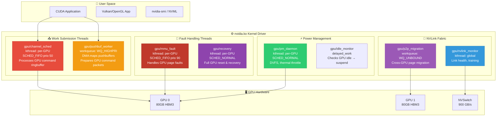
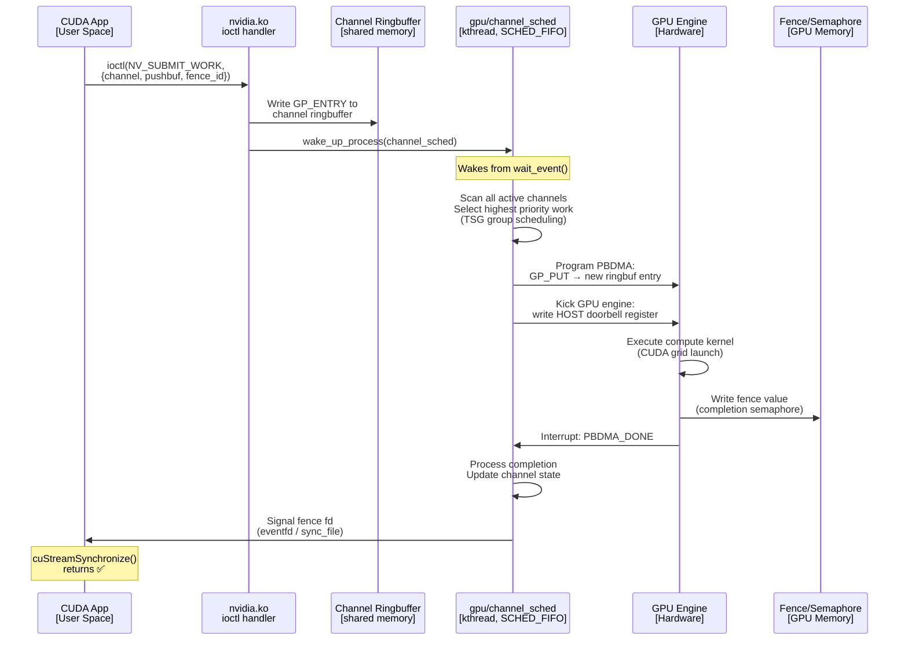
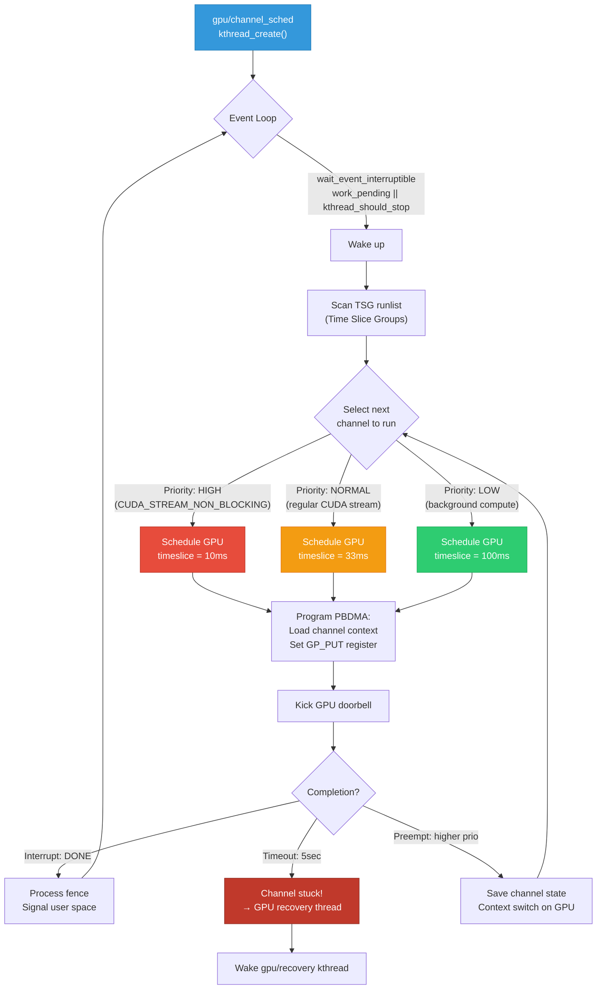
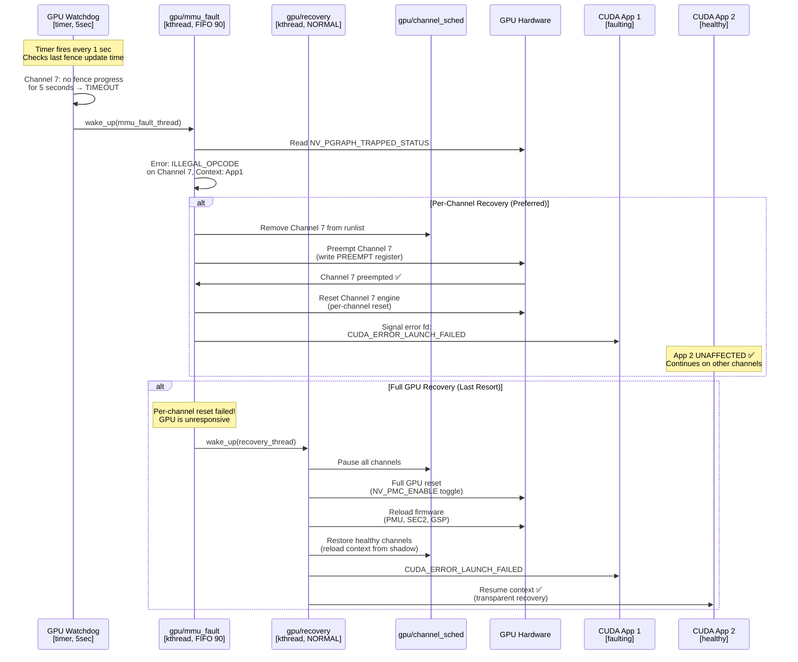
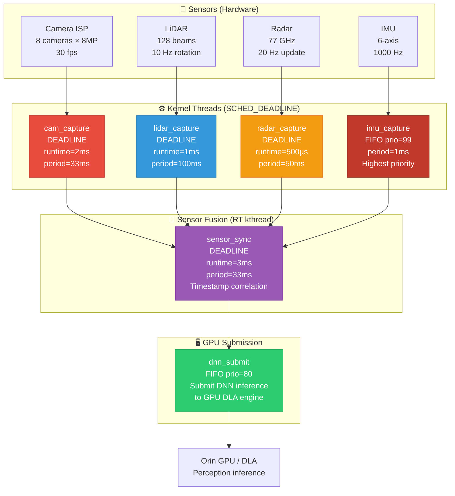
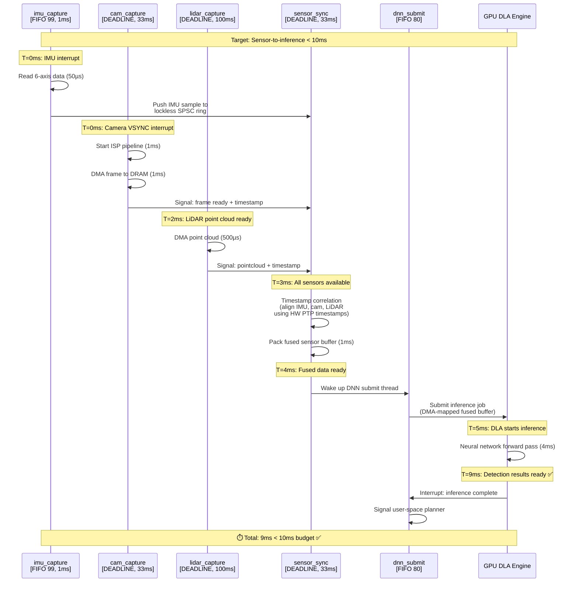
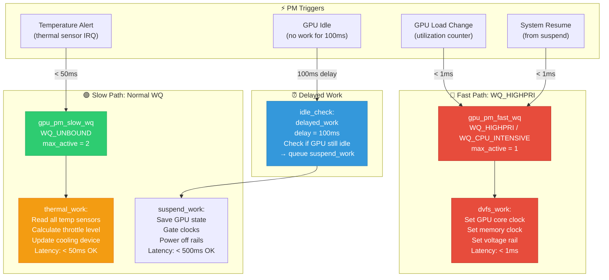
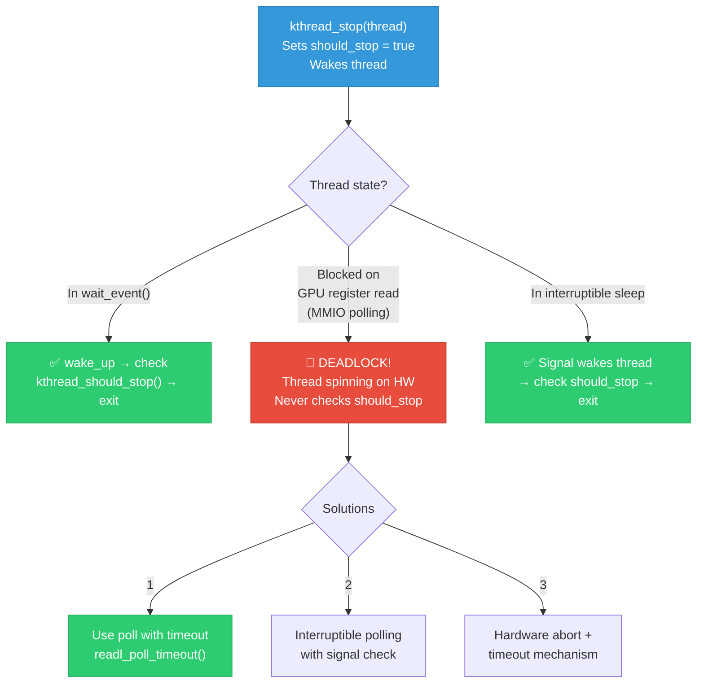
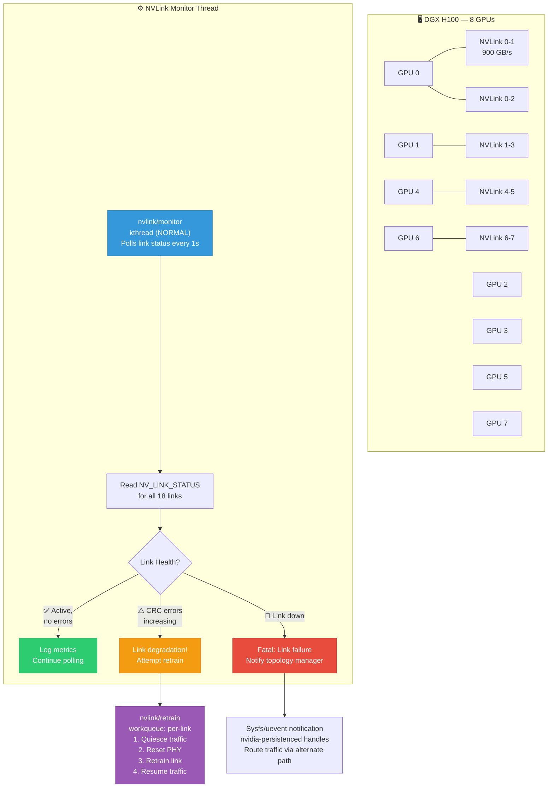
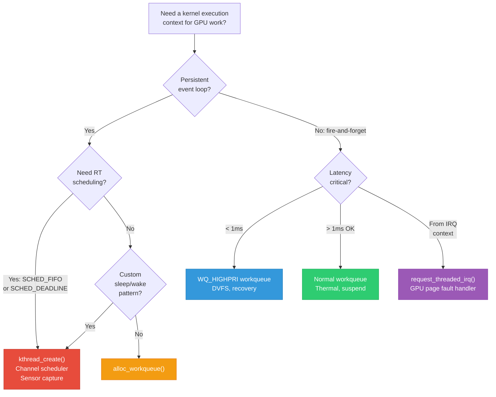

# 01 — NVIDIA: 15-Year Experience System Design Deep Interview — Kernel Threads

> **Target**: Principal/Staff/Distinguished Engineer interviews at NVIDIA (GPU Driver, CUDA Runtime, Tegra BSP, Autonomous Vehicles, DGX Infrastructure)
> **Level**: 15+ years — You are expected to design kernel threading architectures for GPU driver stacks, CUDA kernel submission, real-time scheduling for autonomous driving, and multi-GPU coordination across NVLink fabric.

---

## 📌 Interview Focus Areas

| Domain | What NVIDIA Expects at 15yr Level |
|--------|----------------------------------|
| **GPU Driver kthreads** | GPU channel scheduler, fault recovery threads, power management daemons |
| **Work Queues vs kthreads** | When to use `kthread_create` vs `alloc_workqueue` vs `tasklet` for GPU work |
| **Real-Time Scheduling** | SCHED_FIFO/SCHED_DEADLINE for autonomous driving sensor fusion pipelines |
| **Multi-GPU Coordination** | Cross-GPU synchronization threads, NVLink fabric monitoring |
| **Kernel Thread Lifecycle** | `kthread_create`, `kthread_stop`, `kthread_should_stop`, clean shutdown |
| **CPU Affinity & Isolation** | Pinning GPU interrupt threads, `isolcpus`, CPU shielding for latency |
| **RCU & Per-CPU kthreads** | RCU callback offloading, softirq threads, ksoftirqd tuning |

---

## 🎨 System Design 1: Design the GPU Driver Kernel Thread Architecture

### Context
NVIDIA's GPU driver (nvidia.ko / nouveau) manages multiple kernel threads for different responsibilities — channel scheduling, fault handling, power management, and GPU-to-GPU communication. At 15 years, you must design this entire threading architecture.

### GPU Driver Thread Architecture



### GPU Channel Scheduling Sequence



### Deep Q&A

---

#### ❓ Q1: Design the `gpu/channel_sched` kernel thread. What scheduling policy, why per-GPU, and how do you handle priority inversion between CUDA streams?

**A:**



**Implementation:**

```c
/* GPU channel scheduler kthread */

struct gpu_channel_sched {
    struct task_struct *thread;
    struct gpu_device *gpu;
    spinlock_t runlist_lock;
    struct list_head runlist[GPU_SCHED_PRIORITY_COUNT]; /* HIGH, NORMAL, LOW */
    wait_queue_head_t work_wq;
    bool work_pending;
};

static int gpu_channel_sched_fn(void *data)
{
    struct gpu_channel_sched *sched = data;
    struct sched_param param = { .sched_priority = 50 };
    
    /* SCHED_FIFO: Must not be preempted by normal tasks.
     * GPU submission latency directly impacts CUDA kernel launch time.
     * Priority 50: above normal kthreads, below fault handling (90). */
    sched_setscheduler(current, SCHED_FIFO, &param);
    
    /* Pin to CPU next to GPU's NUMA node for cache locality */
    set_cpus_allowed_ptr(current, 
                         cpumask_of_node(dev_to_node(&sched->gpu->pdev->dev)));
    
    while (!kthread_should_stop()) {
        wait_event_interruptible(sched->work_wq,
                                 sched->work_pending || 
                                 kthread_should_stop());
        
        if (kthread_should_stop())
            break;
        
        spin_lock(&sched->runlist_lock);
        sched->work_pending = false;
        
        /* Priority scheduling: scan HIGH first */
        for (int prio = GPU_SCHED_HIGH; prio <= GPU_SCHED_LOW; prio++) {
            struct gpu_channel *chan;
            list_for_each_entry(chan, &sched->runlist[prio], link) {
                if (chan->has_pending_work) {
                    spin_unlock(&sched->runlist_lock);
                    gpu_submit_channel(sched->gpu, chan);
                    goto next_cycle;
                }
            }
        }
        spin_unlock(&sched->runlist_lock);
next_cycle:
        ;
    }
    
    return 0;
}

/* Priority inversion mitigation */
void gpu_handle_priority_inversion(struct gpu_channel_sched *sched,
                                    struct gpu_channel *blocked_high,
                                    struct gpu_channel *blocking_low)
{
    /*
     * Problem: High-priority CUDA stream waits for a semaphore
     * that will be released by a low-priority stream, but a
     * medium-priority stream keeps preempting the low-priority one.
     *
     * Solution: Priority inheritance on GPU channels
     */
    
    /* Temporarily boost blocking channel to HIGH priority */
    int orig_prio = blocking_low->sched_priority;
    
    spin_lock(&sched->runlist_lock);
    list_move(&blocking_low->link, &sched->runlist[GPU_SCHED_HIGH]);
    blocking_low->sched_priority = GPU_SCHED_HIGH;
    blocking_low->inherited_from = blocked_high;
    spin_unlock(&sched->runlist_lock);
    
    /* When low channel releases semaphore, restore original priority */
    blocking_low->on_semaphore_release = restore_priority_callback;
    blocking_low->orig_priority = orig_prio;
}
```

**Key design decisions:**
| Decision | Choice | Reasoning |
|----------|--------|-----------|
| Per-GPU vs global thread | **Per-GPU** | Avoid contention between GPUs; each GPU has independent engines |
| SCHED_FIFO vs SCHED_DEADLINE | **SCHED_FIFO** | GPU submission is event-driven, not periodic — DEADLINE needs known period |
| Priority 50 | **Mid-FIFO range** | Above normal kthreads, below fault handler (90), below watchdog (99) |
| CPU affinity | **NUMA-local** | Minimizes PCIe/NVLink submission latency (cache-warm) |

---

#### ❓ Q2: The GPU hangs during a CUDA kernel execution. Design the fault recovery thread architecture — how do you detect, isolate, and recover without affecting other GPU contexts?

**A:**



**Fault recovery implementation:**

```c
/* GPU fault recovery thread */

static int gpu_mmu_fault_thread(void *data)
{
    struct gpu_device *gpu = data;
    struct sched_param param = { .sched_priority = 90 };
    
    /* Highest priority kthread — must respond instantly to GPU faults */
    sched_setscheduler(current, SCHED_FIFO, &param);
    
    while (!kthread_should_stop()) {
        wait_event_interruptible(gpu->fault_wq,
                                 gpu->fault_pending || 
                                 kthread_should_stop());
        if (kthread_should_stop())
            break;
        
        gpu->fault_pending = false;
        
        /* Read fault info from GPU registers */
        u32 fault_status = gpu_read(gpu, NV_PGRAPH_FECS_FAULT_STATUS);
        u32 fault_addr = gpu_read(gpu, NV_PGRAPH_FECS_FAULT_ADDR);
        int channel_id = FIELD_GET(FAULT_CHANNEL_MASK, fault_status);
        
        struct gpu_channel *chan = &gpu->channels[channel_id];
        
        dev_err(gpu->dev, "GPU fault: ch=%d addr=0x%08x type=%s\n",
                channel_id, fault_addr,
                gpu_fault_type_str(fault_status));
        
        /* Attempt per-channel recovery first */
        int ret = gpu_try_channel_recovery(gpu, chan);
        if (ret == 0) {
            /* Channel recovered — signal error to user */
            gpu_channel_signal_error(chan, GPU_ERROR_LAUNCH_FAILED);
            continue;
        }
        
        /* Per-channel failed → escalate to full GPU recovery */
        dev_err(gpu->dev, "Channel recovery failed, full GPU reset\n");
        wake_up_process(gpu->recovery_thread);
    }
    
    return 0;
}

static int gpu_try_channel_recovery(struct gpu_device *gpu,
                                     struct gpu_channel *chan)
{
    /* Step 1: Remove channel from scheduling runlist */
    gpu_sched_remove_channel(gpu->sched, chan);
    
    /* Step 2: Preempt the channel on GPU */  
    gpu_write(gpu, NV_PBDMA_PREEMPT(chan->pbdma), chan->id);
    
    /* Step 3: Wait for preemption (max 100ms) */
    int ret = gpu_wait_preempt(gpu, chan, msecs_to_jiffies(100));
    if (ret == -ETIMEDOUT)
        return -EIO;  /* GPU stuck → need full reset */
    
    /* Step 4: Per-engine reset */
    u32 engine_mask = chan->bound_engines;
    gpu_write(gpu, NV_PMC_ENGINE_RESET, engine_mask);
    udelay(10);
    gpu_write(gpu, NV_PMC_ENGINE_RESET, 0);
    
    /* Step 5: Channel is now clean for re-use (but user must re-submit) */
    chan->state = GPU_CHANNEL_ERROR;
    return 0;
}
```

---

#### ❓ Q3: Design the kernel threading model for NVIDIA DRIVE (autonomous vehicles). You have camera, LiDAR, radar, and IMU sensors feeding into a perception pipeline. What kthread architecture guarantees < 10ms sensor-to-inference latency?

**A:**



**Timing analysis diagram:**



**SCHED_DEADLINE setup:**

```c
/* NVIDIA DRIVE: Real-time sensor capture threads */

struct sensor_capture_thread {
    struct task_struct *thread;
    struct sensor_device *sensor;
    ktime_t period;
    ktime_t runtime;
    ktime_t deadline;
};

static struct sensor_capture_thread *create_rt_sensor_thread(
    const char *name,
    int (*fn)(void *),
    void *data,
    u64 runtime_ns,
    u64 deadline_ns,
    u64 period_ns,
    int cpu)
{
    struct sensor_capture_thread *st;
    struct task_struct *t;
    
    st = kzalloc(sizeof(*st), GFP_KERNEL);
    
    t = kthread_create(fn, data, "drive/%s", name);
    if (IS_ERR(t))
        return ERR_CAST(t);
    
    /* Pin to specific CPU — sensor threads must not migrate */
    kthread_bind(t, cpu);
    
    /* Configure SCHED_DEADLINE for guaranteed CPU time */
    struct sched_attr attr = {
        .size = sizeof(attr),
        .sched_policy = SCHED_DEADLINE,
        .sched_runtime  = runtime_ns,   /* Max CPU time per period */
        .sched_deadline = deadline_ns,  /* Must finish by this */
        .sched_period   = period_ns,    /* Repetition period */
        .sched_flags    = SCHED_FLAG_RECLAIM, /* Donate unused time */
    };
    sched_setattr(t, &attr);
    
    wake_up_process(t);
    
    st->thread = t;
    return st;
}

/* Init all sensor threads for DRIVE Orin platform */
int drive_init_sensor_threads(struct drive_platform *plat)
{
    int isolated_cpus[] = {4, 5, 6, 7}; /* isolcpus=4-7 in cmdline */
    
    /* Camera: 2ms runtime, 33ms period (30 fps) */
    plat->cam_thread = create_rt_sensor_thread(
        "cam_capture", cam_capture_fn, plat->cam,
        2 * NSEC_PER_MSEC,   /* runtime */
        5 * NSEC_PER_MSEC,   /* deadline (some slack) */
        33 * NSEC_PER_MSEC,  /* period */
        isolated_cpus[0]);
    
    /* LiDAR: 1ms runtime, 100ms period (10 Hz) */
    plat->lidar_thread = create_rt_sensor_thread(
        "lidar_capture", lidar_capture_fn, plat->lidar,
        1 * NSEC_PER_MSEC,
        3 * NSEC_PER_MSEC,
        100 * NSEC_PER_MSEC,
        isolated_cpus[1]);
    
    /* Sensor fusion: 3ms runtime, 33ms period */
    plat->sync_thread = create_rt_sensor_thread(
        "sensor_sync", sensor_sync_fn, plat->fuser,
        3 * NSEC_PER_MSEC,
        8 * NSEC_PER_MSEC,
        33 * NSEC_PER_MSEC,
        isolated_cpus[2]);
    
    /* IMU: SCHED_FIFO (not DEADLINE — 1KHz is too fast for EDF) */
    plat->imu_thread = kthread_create(imu_capture_fn, plat->imu,
                                       "drive/imu_capture");
    kthread_bind(plat->imu_thread, isolated_cpus[3]);
    struct sched_param imu_param = { .sched_priority = 99 };
    sched_setscheduler(plat->imu_thread, SCHED_FIFO, &imu_param);
    wake_up_process(plat->imu_thread);
    
    return 0;
}
```

**CPU isolation for deterministic latency:**

```bash
# Kernel cmdline for NVIDIA DRIVE Orin
isolcpus=4-7                    # Reserve CPUs 4-7 for RT threads
nohz_full=4-7                   # Disable timer ticks on isolated CPUs
rcu_nocbs=4-7                   # Offload RCU callbacks from RT CPUs
irqaffinity=0-3                 # All IRQs on CPUs 0-3
nosoftlockup                    # Disable softlockup detector on RT CPUs
processor.max_cstate=1          # Disable deep C-states (latency)
```

---

#### ❓ Q4: Design a workqueue architecture for GPU power management. The GPU DVFS (Dynamic Voltage and Frequency Scaling) must respond within 1ms to load changes, but thermal throttling can be slower. How do you structure the work items?

**A:**



**Implementation:**

```c
/* GPU Power Management workqueue architecture */

struct gpu_pm {
    struct gpu_device *gpu;
    
    /* Fast path: DVFS (latency-critical) */
    struct workqueue_struct *fast_wq;
    struct work_struct dvfs_work;
    
    /* Slow path: thermal, suspend (latency-tolerant) */
    struct workqueue_struct *slow_wq;
    struct work_struct thermal_work;
    struct work_struct suspend_work;
    
    /* Delayed: idle detection */
    struct delayed_work idle_check_work;
    
    /* State */
    atomic_t current_perf_level;
    int target_freq_mhz;
    int current_temp_c;
    bool idle;
};

int gpu_pm_init(struct gpu_pm *pm, struct gpu_device *gpu)
{
    pm->gpu = gpu;
    
    /*
     * Fast WQ: WQ_HIGHPRI ensures PM work runs before normal kworkers.
     * max_active=1: serialize DVFS transitions (voltage sequencing).
     * WQ_CPU_INTENSIVE: tells scheduler this work may use a lot of CPU. 
     */
    pm->fast_wq = alloc_workqueue("gpu_pm_fast",
                                   WQ_HIGHPRI | WQ_CPU_INTENSIVE,
                                   1 /* max_active */);
    
    /*
     * Slow WQ: WQ_UNBOUND for thermal — no need for CPU locality,
     * and we don't want to interfere with latency-sensitive CPUs.
     * max_active=2: thermal + suspend can run simultaneously.
     */
    pm->slow_wq = alloc_workqueue("gpu_pm_slow",
                                   WQ_UNBOUND | WQ_FREEZABLE,
                                   2 /* max_active */);
    
    INIT_WORK(&pm->dvfs_work, gpu_dvfs_work_fn);
    INIT_WORK(&pm->thermal_work, gpu_thermal_work_fn);
    INIT_WORK(&pm->suspend_work, gpu_suspend_work_fn);
    INIT_DELAYED_WORK(&pm->idle_check_work, gpu_idle_check_fn);
    
    return 0;
}

/* Fast path: GPU load changed → update clocks immediately */
static void gpu_dvfs_work_fn(struct work_struct *work)
{
    struct gpu_pm *pm = container_of(work, struct gpu_pm, dvfs_work);
    int target = pm->target_freq_mhz;
    int current = gpu_get_clock(pm->gpu, GPU_CLK_CORE);
    
    if (target == current)
        return;
    
    /* Voltage must be raised BEFORE frequency (or GPU may crash) */
    if (target > current) {
        int voltage = dvfs_table_get_voltage(target);
        regulator_set_voltage(pm->gpu->vdd_gpu, voltage, voltage);
        udelay(50); /* Voltage settling time */
    }
    
    clk_set_rate(pm->gpu->core_clk, target * 1000000UL);
    clk_set_rate(pm->gpu->mem_clk, 
                 dvfs_table_get_memclk(target) * 1000000UL);
    
    /* Voltage can be lowered AFTER frequency */
    if (target < current) {
        int voltage = dvfs_table_get_voltage(target);
        regulator_set_voltage(pm->gpu->vdd_gpu, voltage, voltage);
    }
    
    atomic_set(&pm->current_perf_level, target);
    trace_gpu_dvfs(pm->gpu->id, current, target); /* ftrace event */
}

/* Usage from GPU interrupt handler */
irqreturn_t gpu_utilization_irq(int irq, void *data)
{
    struct gpu_pm *pm = data;
    int util = gpu_read_utilization(pm->gpu); /* 0-100% */
    
    /* Simple governor: map utilization to frequency */
    if (util > 85)
        pm->target_freq_mhz = GPU_MAX_FREQ;
    else if (util > 50)
        pm->target_freq_mhz = GPU_MID_FREQ;
    else
        pm->target_freq_mhz = GPU_MIN_FREQ;
    
    /* Queue on HIGH priority workqueue — runs within 1ms */
    queue_work(pm->fast_wq, &pm->dvfs_work);
    
    return IRQ_HANDLED;
}
```

---

#### ❓ Q5: How do you safely stop a kthread that might be blocked on a GPU hardware register read? `kthread_stop()` can deadlock if the thread never checks `kthread_should_stop()`.

**A:**



**Safe kthread with hardware timeout:**

```c
/* WRONG: Can deadlock on kthread_stop() */
static int gpu_monitor_bad(void *data)
{
    struct gpu_device *gpu = data;
    
    while (!kthread_should_stop()) {
        /* This can spin forever if GPU is hung! */
        u32 val;
        do {
            val = readl(gpu->mmio + GPU_STATUS_REG);
        } while (!(val & STATUS_READY));  /* ← DEADLOCK RISK */
        
        process_gpu_status(val);
    }
    return 0;
}

/* CORRECT: Safe kthread with bounded waits */
static int gpu_monitor_good(void *data)
{
    struct gpu_device *gpu = data;
    
    while (!kthread_should_stop()) {
        u32 val;
        int ret;
        
        /* Solution 1: readl_poll_timeout — bounded MMIO poll */
        ret = readl_poll_timeout(gpu->mmio + GPU_STATUS_REG,
                                  val,
                                  val & STATUS_READY,
                                  100,        /* 100µs between polls */
                                  5000000);   /* 5 sec total timeout */
        
        if (ret == -ETIMEDOUT) {
            dev_warn(gpu->dev, "GPU status timeout — checking stop\n");
            /* Loop back → kthread_should_stop() checked */
            continue;
        }
        
        if (kthread_should_stop())
            break;
        
        process_gpu_status(val);
        
        /* Solution 2: Use wait_event with timeout for non-MMIO waits */
        ret = wait_event_interruptible_timeout(
            gpu->status_wq,
            gpu->status_updated || kthread_should_stop(),
            msecs_to_jiffies(1000));
        
        if (kthread_should_stop())
            break;
    }
    
    /* Clean shutdown: release any resources held */
    gpu_channel_cleanup(gpu);
    return 0;
}

/* Safe kthread_stop wrapper with fallback */
void gpu_kthread_safe_stop(struct task_struct **thread_ptr)
{
    struct task_struct *t = *thread_ptr;
    if (!t)
        return;
    
    /* First: try normal stop */
    int ret = kthread_stop(t);
    if (ret == -EINTR) {
        /* Thread might be stuck — force it */
        dev_warn(gpu->dev, "kthread didn't stop cleanly\n");
        /*
         * Don't force-kill kernel threads!
         * Fix the root cause: ensure all waits are bounded.
         */
    }
    
    *thread_ptr = NULL;
}
```

---

#### ❓ Q6: Design the NVLink fabric monitoring thread architecture for a DGX system with 8 GPUs. How do you detect link degradation, handle retraining, and report to user space without disrupting active GPU-to-GPU transfers?

**A:**



**NVLink retraining sequence:**

```mermaid
sequenceDiagram
    participant MON as nvlink/monitor<br/>[kthread]
    participant WQ as nvlink/retrain<br/>[workqueue]
    participant GPU_A as GPU 0<br/>[Local]
    participant LINK as NVLink PHY<br/>[Hardware]
    participant GPU_B as GPU 1<br/>[Remote]
    participant SCHED as Channel Scheduler

    MON->>LINK: Read NV_LINK_STATUS
    LINK->>MON: CRC error count: 1000/sec<br/>(threshold: 100/sec)
    
    Note over MON: ⚠️ Link degrading!
    MON->>WQ: queue_work(retrain_work)
    
    WQ->>SCHED: Pause P2P channels<br/>using links 0-1
    SCHED->>GPU_A: Drain pending P2P DMA
    GPU_A->>SCHED: DMA queue drained ✅
    
    WQ->>LINK: Write NV_LINK_CTRL = SAFE_MODE
    Note over LINK: Link enters low-speed mode
    
    WQ->>LINK: Write NV_LINK_PHY_RESET = 1
    Note over LINK: PHY retraining...<br/>(takes ~50ms)
    
    WQ->>LINK: Poll NV_LINK_STATUS<br/>for ACTIVE state
    
    alt Retrain Success
        LINK->>WQ: Status: ACTIVE ✅<br/>Speed: NVLink4.0 full
        WQ->>SCHED: Resume P2P channels
        WQ->>MON: Link recovered
        Note over GPU_A,GPU_B: Transfers resume<br/>Transparently ✅
    else Retrain Failed (3 attempts)
        LINK->>WQ: Status: FAULT ❌
        WQ->>MON: Link permanently down
        MON->>MON: Update topology:<br/>Route via alternate links
        MON->>MON: kobject_uevent(KOBJ_CHANGE)<br/>→ nvidia-smi shows degraded
    end
```

```c
/* NVLink fabric monitor kthread */

struct nvlink_monitor {
    struct task_struct *thread;
    struct gpu_device *gpus[8];
    struct nvlink_status links[18]; /* NVSwitch connected */
    struct workqueue_struct *retrain_wq;
    struct work_struct retrain_work[18];
};

static int nvlink_monitor_thread(void *data)
{
    struct nvlink_monitor *mon = data;
    
    while (!kthread_should_stop()) {
        /* Poll all links every 1 second */
        for (int i = 0; i < mon->num_links; i++) {
            u32 status = nvlink_read_status(mon, i);
            u32 crc_errors = nvlink_read_crc_count(mon, i);
            u32 replay_count = nvlink_read_replay_count(mon, i);
            
            /* Export to sysfs for nvidia-smi */
            mon->links[i].error_rate = crc_errors;
            mon->links[i].replays = replay_count;
            
            /* Check degradation thresholds */
            if (crc_errors > NVLINK_CRC_THRESHOLD) {
                dev_warn(mon->gpus[0]->dev,
                         "NVLink %d: CRC rate %u/sec (threshold=%u)\n",
                         i, crc_errors, NVLINK_CRC_THRESHOLD);
                
                mon->retrain_link_id = i;
                queue_work(mon->retrain_wq, &mon->retrain_work[i]);
            }
        }
        
        /* Interruptible sleep — responds to kthread_stop() */
        if (wait_event_interruptible_timeout(
                mon->poll_wq,
                kthread_should_stop(),
                msecs_to_jiffies(1000)) != 0) {
            if (kthread_should_stop())
                break;
        }
    }
    return 0;
}
```

---

#### ❓ Q7: Compare `kthread_create` vs `alloc_workqueue` vs `create_singlethread_workqueue` for GPU driver design. When do you pick each?

**A:**

| Aspect | `kthread_create` | `alloc_workqueue` (CMWQ) | Threaded IRQ |
|--------|-----------------|--------------------------|--------------|
| **Use case** | Persistent daemon, custom event loop | Fire-and-forget work items | Bottom-half of interrupt |
| **Scheduling control** | Full: SCHED_FIFO, SCHED_DEADLINE, affinity | Limited: WQ_HIGHPRI for priority | SCHED_FIFO (kernel-managed) |
| **Lifecycle** | Manual: create → run → stop | Automatic: queue → run → done | IRQ handler lifecycle |
| **GPU example** | Channel scheduler, NVLink monitor | DVFS, thermal throttle | GPU page fault, completion |
| **Concurrency** | One thread, your code manages | Configurable `max_active` | One per IRQ line |
| **CPU affinity** | `kthread_bind()` / `set_cpus_allowed` | `WQ_UNBOUND` or CPU-bound | Per-IRQ affinity |
| **Pros** | Maximum control, custom scheduling | Simple, automatic thread pooling | Low latency from IRQ |
| **Cons** | Must manage thread lifecycle, sync | Less control over scheduling | Limited to interrupt context work |



---

[Next: 02 — Qualcomm 15yr Deep →](02_Qualcomm_15yr_Kernel_Thread_Deep_Interview.md) | [Back to Index →](../ReadMe.Md)
