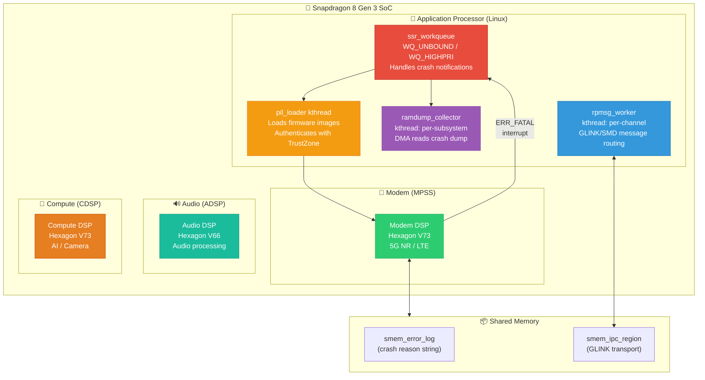
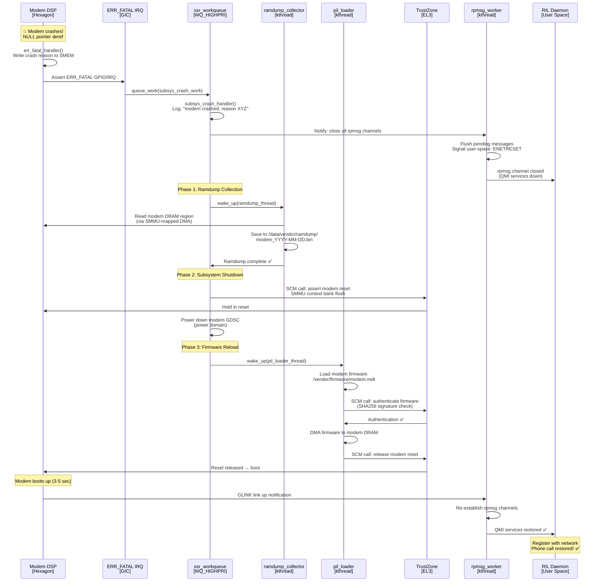
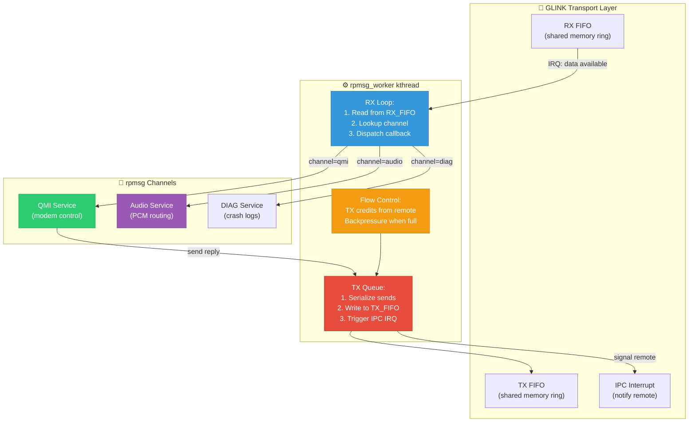
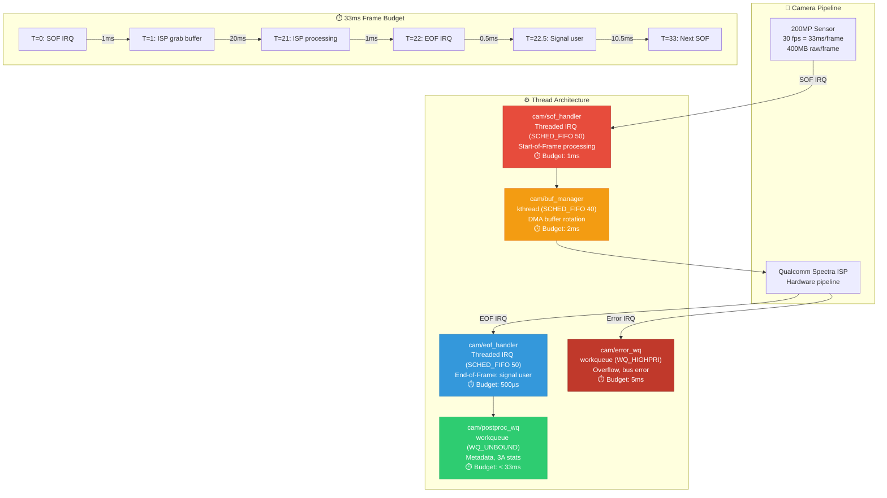
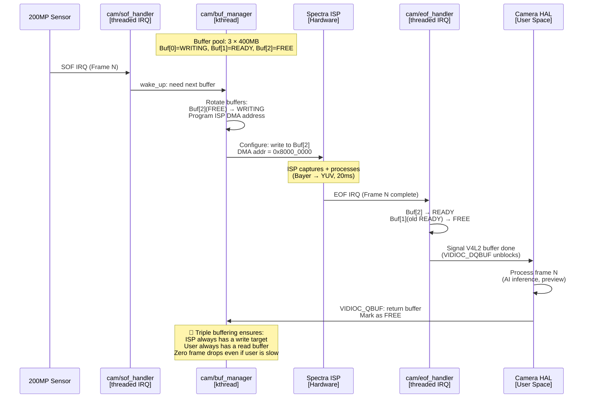
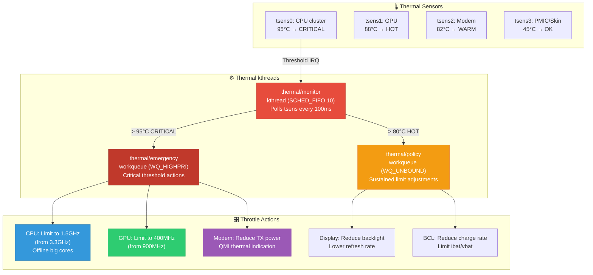
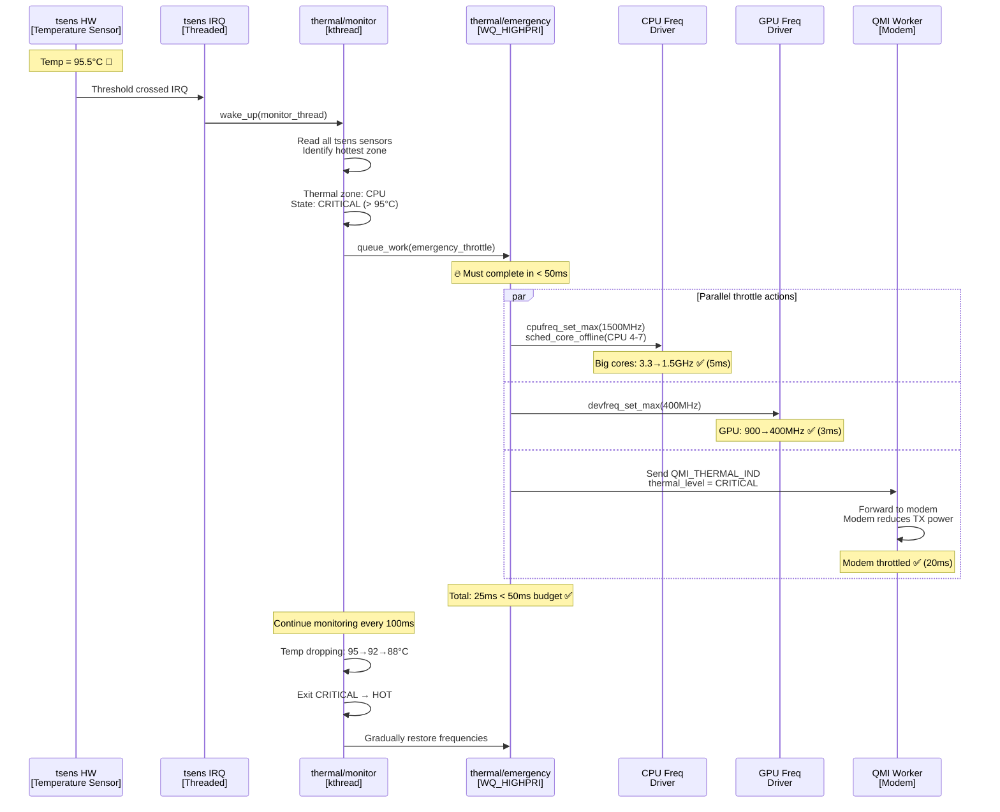
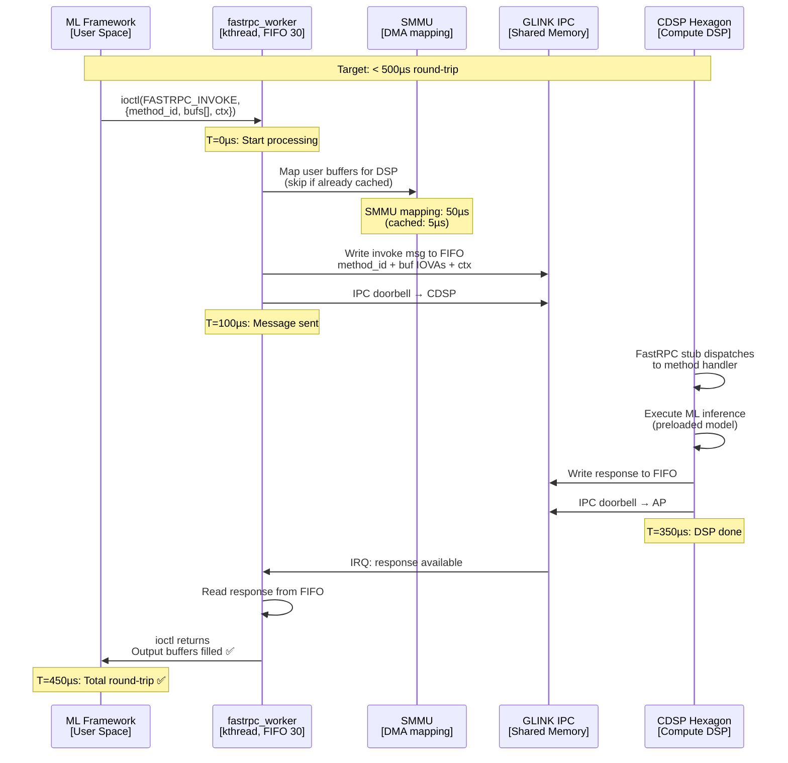
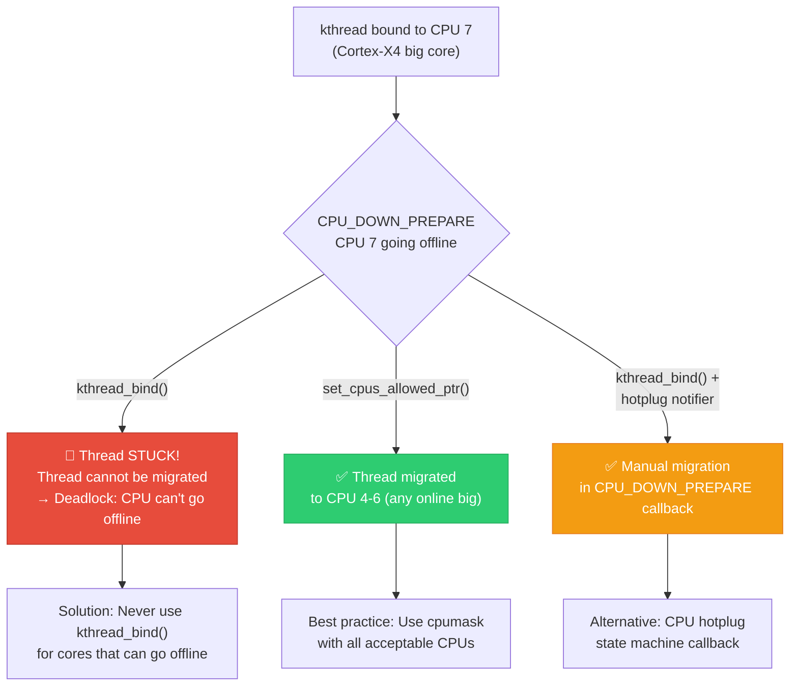

# 02 — Qualcomm: 15-Year Experience System Design Deep Interview — Kernel Threads

> **Target**: Principal/Staff/Distinguished Engineer interviews at Qualcomm (SoC BSP, Modem Firmware, ADSP/CDSP, Camera/Display, Automotive)
> **Level**: 15+ years — You are expected to design multi-subsystem kthread architectures for Snapdragon SoCs, coordinate threads across ARM big.LITTLE cores, manage real-time constraints for DSP offload, and architect thread-safe firmware communication channels.

---

## 📌 Interview Focus Areas

| Domain | What Qualcomm Expects at 15yr Level |
|--------|-------------------------------------|
| **Remoteproc/rpmsg kthreads** | Thread architecture for communication with modem, ADSP, CDSP, SLPI subsystems |
| **big.LITTLE Thread Affinity** | Scheduling latency-sensitive threads on big cores, power-efficient threads on LITTLE |
| **Thermal/Power kthreads** | Thermal mitigation daemon, bcl (battery current limiting), CPR (core power reduction) |
| **Camera Pipeline Threads** | ISP capture, real-time frame processing, V4L2 buffer management threads |
| **QMI/IPC Threads** | Kernel-side QMI service workers for modem communication |
| **Runtime PM & kthreads** | Subsystem suspend/resume sequencing, inter-subsystem dependency ordering |
| **Watchdog & Recovery** | Subsystem restart (SSR) threads, PIL loader kthreads, crash dump collection |

---

## 🎨 System Design 1: Design the Subsystem Restart (SSR) Thread Architecture for Snapdragon

### Context
Qualcomm SoCs have multiple independent processors: Application Processor (AP, Linux), Modem DSP (MPSS), Audio DSP (ADSP), Compute DSP (CDSP), Sensor Low-Power Island (SLPI). When one subsystem crashes, the SSR framework must detect the crash, collect logs, restart the subsystem, and restore communication — all without rebooting the entire phone. This is a complex multi-threaded operation.

### SSR Architecture Overview



### SSR Crash Recovery Sequence



### Deep Q&A

---

#### ❓ Q1: Design the `rpmsg_worker` kthread that handles message routing between Linux and multiple DSP subsystems. How do you handle message ordering, flow control, and thread safety?

**A:**



**Implementation:**

```c
/* Qualcomm GLINK rpmsg worker thread */

struct rpmsg_worker {
    struct task_struct *thread;
    struct glink_transport *xprt;
    wait_queue_head_t rx_wq;
    bool rx_pending;
    
    /* TX flow control */
    atomic_t tx_credits;     /* Credits granted by remote */
    wait_queue_head_t tx_wq; /* Wait when out of credits */
    spinlock_t tx_lock;      /* Serialize TX FIFO writes */
    
    /* Channel table */
    struct rpmsg_channel *channels[GLINK_MAX_CHANNELS];
    struct rw_semaphore channels_lock; /* RCU for read, write lock for add/remove */
};

static int rpmsg_worker_fn(void *data)
{
    struct rpmsg_worker *worker = data;
    struct sched_param param = { .sched_priority = 1 };
    
    /* SCHED_FIFO priority 1: above normal tasks, ensures message
     * processing doesn't get starved by user-space. Low priority
     * within FIFO range because correctness > latency here. */
    sched_setscheduler(current, SCHED_FIFO, &param);
    
    while (!kthread_should_stop()) {
        /* Wait for RX interrupt or kthread_stop */
        wait_event_interruptible(worker->rx_wq,
                                 worker->rx_pending || 
                                 kthread_should_stop());
        
        if (kthread_should_stop())
            break;
        
        worker->rx_pending = false;
        
        /* Process all available messages from RX FIFO */
        while (glink_rx_avail(worker->xprt) > 0) {
            struct glink_msg msg;
            int ret = glink_rx_read(worker->xprt, &msg);
            if (ret < 0)
                break;
            
            /* Dispatch to appropriate channel callback */
            rcu_read_lock();
            struct rpmsg_channel *ch = 
                rcu_dereference(worker->channels[msg.channel_id]);
            if (ch && ch->cb) {
                /* Call channel's registered callback 
                 * (e.g., QMI service handler) */
                ch->cb(ch, msg.data, msg.len, ch->priv);
            }
            rcu_read_unlock();
            
            /* Send RX_DONE (credit return to remote) */
            glink_send_rx_done(worker->xprt, msg.channel_id);
        }
    }
    
    return 0;
}

/* TX path: send message with flow control */
int rpmsg_send_with_flow_control(struct rpmsg_worker *worker,
                                  int channel_id,
                                  void *data, int len)
{
    /* Wait for TX credit from remote subsystem */
    int ret = wait_event_interruptible_timeout(
        worker->tx_wq,
        atomic_read(&worker->tx_credits) > 0 || 
        kthread_should_stop(),
        msecs_to_jiffies(5000)); /* 5 sec timeout */
    
    if (ret == 0)
        return -ETIMEDOUT; /* Remote subsystem not consuming */
    if (kthread_should_stop())
        return -ESHUTDOWN;
    
    /* Consume one credit */
    atomic_dec(&worker->tx_credits);
    
    /* Serialize TX FIFO writes (multiple callers) */
    spin_lock(&worker->tx_lock);
    
    struct glink_msg msg = {
        .channel_id = channel_id,
        .len = len,
    };
    glink_tx_write(worker->xprt, &msg, data, len);
    
    /* Signal remote: new data in TX FIFO */
    glink_send_ipc_irq(worker->xprt);
    
    spin_unlock(&worker->tx_lock);
    
    return 0;
}

/* IRQ handler: wakes the rpmsg worker */
irqreturn_t glink_rx_irq_handler(int irq, void *data)
{
    struct rpmsg_worker *worker = data;
    worker->rx_pending = true;
    wake_up_interruptible(&worker->rx_wq);
    return IRQ_HANDLED;
}
```

---

#### ❓ Q2: Design the camera ISP capture pipeline using kthreads and workqueues. You have a 200MP sensor at 30fps — each frame is 400MB. How do you ensure zero frame drops while keeping CPU/power overhead minimal?

**A:**



**Triple-buffer rotation sequence:**



**Implementation:**

```c
/* Camera buffer manager kthread — zero frame drop design */

struct cam_buf_manager {
    struct task_struct *thread;
    struct cam_device *cam;
    
    /* Triple buffer pool */
    struct cam_buffer bufs[3];
    int writing_idx;  /* ISP currently writing here */
    int ready_idx;    /* Last completed frame (for user) */
    int free_idx;     /* Available for next frame */
    
    spinlock_t buf_lock;
    wait_queue_head_t buf_wq;
    bool need_buffer;
    
    /* Statistics */
    atomic_t frames_captured;
    atomic_t frames_dropped;
};

static int cam_buf_manager_fn(void *data)
{
    struct cam_buf_manager *mgr = data;
    struct sched_param param = { .sched_priority = 40 };
    
    /* SCHED_FIFO 40: Must complete buffer setup within 1ms of SOF,
     * before ISP starts DMA. Below SOF handler (50) since SOF wakes us. */
    sched_setscheduler(current, SCHED_FIFO, &param);
    
    /* Pin to big core: buffer management involves cache-heavy ops */
    cpumask_t big_cores;
    cpumask_clear(&big_cores);
    cpumask_set_cpu(4, &big_cores); /* CPU 4-7 = Cortex-X4 big cores */
    cpumask_set_cpu(5, &big_cores);
    set_cpus_allowed_ptr(current, &big_cores);
    
    while (!kthread_should_stop()) {
        wait_event_interruptible(mgr->buf_wq,
                                 mgr->need_buffer || 
                                 kthread_should_stop());
        if (kthread_should_stop())
            break;
        
        mgr->need_buffer = false;
        
        spin_lock(&mgr->buf_lock);
        
        /* Check if free buffer is available */
        if (mgr->bufs[mgr->free_idx].state != BUF_FREE) {
            /* No free buffer! User-space is too slow.
             * Reuse the READY buffer (overwrite last frame) */
            dev_warn_ratelimited(mgr->cam->dev,
                                 "Frame drop: user not consuming fast enough\n");
            mgr->bufs[mgr->ready_idx].state = BUF_FREE;
            mgr->free_idx = mgr->ready_idx;
            atomic_inc(&mgr->frames_dropped);
        }
        
        /* Rotate: free → writing */
        int next_write = mgr->free_idx;
        mgr->bufs[next_write].state = BUF_WRITING;
        
        /* Program ISP DMA target */
        cam_isp_set_output_addr(mgr->cam->isp,
                                 mgr->bufs[next_write].dma_addr);
        
        /* Previous writing → ready (completed frame) */
        mgr->bufs[mgr->writing_idx].state = BUF_READY;
        int old_ready = mgr->ready_idx;
        mgr->ready_idx = mgr->writing_idx;
        mgr->writing_idx = next_write;
        
        /* Old ready → free (for next cycle) */
        if (old_ready != next_write) {
            mgr->bufs[old_ready].state = BUF_FREE;
            mgr->free_idx = old_ready;
        }
        
        spin_unlock(&mgr->buf_lock);
        
        /* Signal V4L2: ready buffer available for DQBUF */
        wake_up_interruptible(&mgr->cam->vb2_queue.done_wq);
        
        atomic_inc(&mgr->frames_captured);
    }
    
    return 0;
}
```

---

#### ❓ Q3: Design the thermal mitigation kthread for a Snapdragon SoC. When the SoC reaches 95°C, you must throttle CPU, GPU, modem, and display within 50ms to prevent thermal shutdown. How do you coordinate across subsystems?

**A:**



**Emergency throttle sequence:**



**Implementation:**

```c
/* Qualcomm thermal mitigation kthread */

struct qcom_thermal {
    struct task_struct *monitor_thread;
    struct workqueue_struct *emergency_wq;
    struct workqueue_struct *policy_wq;
    
    struct tsens_device *tsens;
    int num_sensors;
    
    /* Thermal zones and thresholds */
    struct thermal_zone {
        int sensor_id;
        int warm_threshold;    /* 80°C: start throttling */
        int hot_threshold;     /* 90°C: aggressive throttle */
        int critical_threshold;/* 95°C: emergency throttle */
        int shutdown_threshold;/* 115°C: hardware shutdown */
    } zones[TSENS_MAX_SENSORS];
    
    /* Emergency work */
    struct work_struct emergency_work;
    int emergency_level;
    
    wait_queue_head_t monitor_wq;
    bool threshold_crossed;
};

static int thermal_monitor_fn(void *data)
{
    struct qcom_thermal *thermal = data;
    struct sched_param param = { .sched_priority = 10 };
    
    /* SCHED_FIFO 10: Must respond to thermal events promptly,
     * but lower than camera/sensor threads since thermal
     * response budget is 50ms (not 1ms). */
    sched_setscheduler(current, SCHED_FIFO, &param);
    
    while (!kthread_should_stop()) {
        /* Wait for threshold IRQ or periodic poll (100ms) */
        wait_event_interruptible_timeout(
            thermal->monitor_wq,
            thermal->threshold_crossed || kthread_should_stop(),
            msecs_to_jiffies(100));
        
        if (kthread_should_stop())
            break;
        
        thermal->threshold_crossed = false;
        
        /* Read all sensors */
        int max_temp = 0;
        int hottest_zone = -1;
        
        for (int i = 0; i < thermal->num_sensors; i++) {
            int temp;
            tsens_get_temp(thermal->tsens, i, &temp);
            
            if (temp > max_temp) {
                max_temp = temp;
                hottest_zone = i;
            }
        }
        
        /* Determine action based on temperature */
        if (max_temp >= thermal->zones[hottest_zone].critical_threshold) {
            thermal->emergency_level = THERMAL_CRITICAL;
            queue_work(thermal->emergency_wq, &thermal->emergency_work);
        } else if (max_temp >= thermal->zones[hottest_zone].hot_threshold) {
            thermal->emergency_level = THERMAL_HOT;
            queue_work(thermal->policy_wq, &thermal->policy_work);
        }
    }
    
    return 0;
}

/* Emergency throttle — runs on WQ_HIGHPRI */
static void thermal_emergency_fn(struct work_struct *work)
{
    struct qcom_thermal *thermal = 
        container_of(work, struct qcom_thermal, emergency_work);
    
    /* All actions must complete < 50ms total */
    ktime_t start = ktime_get();
    
    /* 1. CPU: Max freq cap + offline big cores */
    freq_qos_update_request(&thermal->cpu_freq_req,
                             CPU_CRITICAL_MAX_FREQ_KHZ);
    for (int cpu = 4; cpu < 8; cpu++) {
        if (cpu_online(cpu))
            cpu_down(cpu); /* Offline big cores */
    }
    
    /* 2. GPU: Force lowest performance mode */
    dev_pm_qos_update_request(&thermal->gpu_freq_req,
                               GPU_CRITICAL_MAX_FREQ_KHZ);
    
    /* 3. Modem: Send thermal indication via QMI */
    qmi_send_thermal_ind(thermal->qmi_handle, QMI_THERMAL_CRITICAL);
    
    /* 4. Charging: Reduce battery charge current */
    power_supply_set_property(thermal->battery,
                              POWER_SUPPLY_PROP_CHARGE_CONTROL_LIMIT,
                              &(union power_supply_propval){
                                  .intval = BCL_CRITICAL_IBAT_MA
                              });
    
    ktime_t elapsed = ktime_sub(ktime_get(), start);
    pr_info("thermal: emergency throttle completed in %lld ms\n",
            ktime_to_ms(elapsed));
}
```

---

#### ❓ Q4: You need to communicate between Linux and the CDSP (Compute DSP) for ML inference. The FastRPC IPC mechanism uses a dedicated kthread. Design this thread architecture for < 500µs round-trip latency.

**A:**



```c
/* FastRPC worker kthread — ultra-low latency IPC */

struct fastrpc_worker {
    struct task_struct *thread;
    struct fastrpc_device *fdev;
    
    /* Pre-allocated context pool (avoid kmalloc in hot path) */
    struct fastrpc_ctx ctx_pool[64];
    DECLARE_BITMAP(ctx_bitmap, 64);
    spinlock_t ctx_lock;
    
    /* SMMU mapping cache (avoid repeated SMMU calls) */
    struct fastrpc_map_cache map_cache;
    
    wait_queue_head_t resp_wq;
    bool response_ready;
};

static int fastrpc_worker_fn(void *data)
{
    struct fastrpc_worker *worker = data;
    struct sched_param param = { .sched_priority = 30 };
    
    /* SCHED_FIFO 30: Must process DSP responses immediately.
     * DSP inference is time-critical for camera/sensor fusion.
     * Priority 30: below camera (40-50) but above normal tasks. */
    sched_setscheduler(current, SCHED_FIFO, &param);
    
    /* Pin to LITTLE core — FastRPC is IPC-bound, not compute-bound.
     * Save big cores for actual workloads. */
    set_cpus_allowed_ptr(current, &littlecores_mask);
    
    while (!kthread_should_stop()) {
        wait_event_interruptible(worker->resp_wq,
                                 worker->response_ready || 
                                 kthread_should_stop());
        if (kthread_should_stop())
            break;
        
        worker->response_ready = false;
        
        /* Process all pending responses */
        while (glink_rx_avail(worker->fdev->glink)) {
            struct fastrpc_response resp;
            glink_rx_read(worker->fdev->glink, &resp, sizeof(resp));
            
            /* Lookup context — O(1) via bitmap index */
            struct fastrpc_ctx *ctx = &worker->ctx_pool[resp.ctx_id];
            
            ctx->result = resp.result;
            ctx->completed = true;
            
            /* Wake up the user-space thread waiting on ioctl */
            wake_up_interruptible(&ctx->wait);
        }
    }
    return 0;
}

/* Optimized invoke path — minimize latency */
long fastrpc_invoke(struct fastrpc_worker *worker,
                    struct fastrpc_invoke_args *args)
{
    /* Allocate context from pool (no kmalloc!) */
    int ctx_id;
    spin_lock(&worker->ctx_lock);
    ctx_id = find_first_zero_bit(worker->ctx_bitmap, 64);
    if (ctx_id >= 64) {
        spin_unlock(&worker->ctx_lock);
        return -EBUSY;
    }
    set_bit(ctx_id, worker->ctx_bitmap);
    spin_unlock(&worker->ctx_lock);
    
    struct fastrpc_ctx *ctx = &worker->ctx_pool[ctx_id];
    ctx->completed = false;
    init_waitqueue_head(&ctx->wait);
    
    /* Map user buffers — use cache to avoid repeated SMMU ops */
    for (int i = 0; i < args->num_bufs; i++) {
        ctx->iovas[i] = fastrpc_map_cached(worker, 
                                            args->bufs[i].va,
                                            args->bufs[i].len);
    }
    
    /* Send invoke to DSP */
    struct fastrpc_msg msg = {
        .method_id = args->method_id,
        .ctx_id = ctx_id,
        .num_bufs = args->num_bufs,
    };
    memcpy(msg.iovas, ctx->iovas, sizeof(msg.iovas));
    
    glink_tx_write(worker->fdev->glink, &msg, sizeof(msg));
    glink_send_doorbell(worker->fdev->glink);
    
    /* Wait for DSP response (< 500µs expected) */
    int ret = wait_event_interruptible_timeout(
        ctx->wait,
        ctx->completed,
        msecs_to_jiffies(5000)); /* 5sec safety timeout */
    
    long result = (ret == 0) ? -ETIMEDOUT : ctx->result;
    
    /* Return context to pool */
    spin_lock(&worker->ctx_lock);
    clear_bit(ctx_id, worker->ctx_bitmap);
    spin_unlock(&worker->ctx_lock);
    
    return result;
}
```

**Latency optimization summary:**
| Optimization | Time Saved | Technique |
|-------------|-----------|-----------|
| Context pool (pre-alloc) | ~20µs | Avoid `kmalloc` in hot path |
| SMMU map cache | ~45µs | Skip `iommu_map` for cached buffers |
| SCHED_FIFO for worker | ~100µs | Response processed immediately, no CFS delay |
| GLINK doorbell (not polling) | ~50µs | IPC interrupt instead of periodic poll |
| Pin to LITTLE core | ~10µs | Avoid migration overhead |

---

#### ❓ Q5: How do you handle the case where a kthread pinned to a specific CPU core encounters a CPU hotplug event (core goes offline)? This is critical on Qualcomm big.LITTLE SoCs where big cores are frequently power-gated.

**A:**



```c
/* Handling CPU hotplug for kthreads on Qualcomm big.LITTLE */

struct sensor_thread {
    struct task_struct *thread;
    cpumask_t preferred_cpus;     /* big cores: 4-7 */
    cpumask_t fallback_cpus;      /* LITTLE cores: 0-3 */
    enum cpuhp_state hp_state;    /* Hotplug callback state */
};

/* CPU hotplug callback: called when a big core goes offline */
static int sensor_thread_cpu_offline(unsigned int cpu, 
                                      struct hlist_node *node)
{
    struct sensor_thread *st = 
        hlist_entry_safe(node, struct sensor_thread, cpuhp_node);
    
    /* Check if our thread was on this CPU */
    if (!cpumask_test_cpu(cpu, &st->thread->cpus_mask))
        return 0; /* Not our CPU, ignore */
    
    /* Find another online big core */
    cpumask_t online_big;
    cpumask_and(&online_big, &st->preferred_cpus, cpu_online_mask);
    cpumask_clear_cpu(cpu, &online_big); /* Exclude the dying CPU */
    
    if (!cpumask_empty(&online_big)) {
        /* Migrate to another big core */
        set_cpus_allowed_ptr(st->thread, &online_big);
        pr_info("sensor_thread: migrated from CPU%d to big core\n", cpu);
    } else {
        /* All big cores offline → fall back to LITTLE cores */
        set_cpus_allowed_ptr(st->thread, &st->fallback_cpus);
        pr_warn("sensor_thread: all big cores offline, "
                "migrated to LITTLE (performance degraded)\n");
    }
    
    return 0;
}

/* CPU comes back online → migrate back to big core */
static int sensor_thread_cpu_online(unsigned int cpu,
                                     struct hlist_node *node)
{
    struct sensor_thread *st = 
        hlist_entry_safe(node, struct sensor_thread, cpuhp_node);
    
    if (!cpumask_test_cpu(cpu, &st->preferred_cpus))
        return 0; /* Not a big core, ignore */
    
    /* Migrate back to preferred big cores */
    cpumask_t online_big;
    cpumask_and(&online_big, &st->preferred_cpus, cpu_online_mask);
    set_cpus_allowed_ptr(st->thread, &online_big);
    
    pr_info("sensor_thread: big core CPU%d online, migrated back\n", cpu);
    return 0;
}

/* Registration */
int sensor_thread_init(struct sensor_thread *st)
{
    /* Define preferred CPU sets */
    cpumask_clear(&st->preferred_cpus);
    cpumask_set_cpu(4, &st->preferred_cpus);
    cpumask_set_cpu(5, &st->preferred_cpus);
    cpumask_set_cpu(6, &st->preferred_cpus);
    cpumask_set_cpu(7, &st->preferred_cpus);
    
    cpumask_clear(&st->fallback_cpus);
    cpumask_set_cpu(0, &st->fallback_cpus);
    cpumask_set_cpu(1, &st->fallback_cpus);
    cpumask_set_cpu(2, &st->fallback_cpus);
    cpumask_set_cpu(3, &st->fallback_cpus);
    
    /* Use set_cpus_allowed (NOT kthread_bind!) */
    st->thread = kthread_create(sensor_fn, st, "sensor_thread");
    set_cpus_allowed_ptr(st->thread, &st->preferred_cpus);
    wake_up_process(st->thread);
    
    /* Register CPU hotplug callbacks */
    cpuhp_state_add_instance(CPUHP_AP_ONLINE_DYN,
                             &st->cpuhp_node);
    
    return 0;
}
```

**Key rules for Qualcomm big.LITTLE kthreads:**
| Rule | Why |
|------|-----|
| Never `kthread_bind()` to a big core | Big cores go offline during thermal throttling |
| Use `set_cpus_allowed_ptr()` with a cpumask | Allows automatic migration when core goes offline |
| Register `cpuhp` callbacks | Explicit control over migration target |
| Always have a fallback cpumask | Handle all-big-cores-offline scenario |
| Use `sched_setattr()` with `SCHED_DEADLINE` for strict guarantees | EDF ensures CPU time even after migration |

---

[← Previous: 01 — NVIDIA 15yr Deep](01_NVIDIA_15yr_Kernel_Thread_Deep_Interview.md) | [Next: 03 — Google 15yr Deep →](03_Google_15yr_Kernel_Thread_Deep_Interview.md) | [Back to Index →](../ReadMe.Md)
