# 03 — Google: 15-Year Experience System Design Deep Interview — Kernel Threads

> **Target**: Staff/Principal/Distinguished Engineer interviews at Google (Linux Kernel, Infrastructure/Borg, ChromeOS, Android Platform, Cloud/GKE, Networking)
> **Level**: 15+ years — You are expected to design kernel threading architectures for warehouse-scale computing, optimize scheduler behavior across millions of machines, understand RCU internals, and architect kthread-based subsystems that scale to 100+ CPU cores.

---

## 📌 Interview Focus Areas

| Domain | What Google Expects at 15yr Level |
|--------|----------------------------------|
| **CFS / EEVDF Scheduler Internals** | vruntime, task groups, cgroup CPU controller, bandwidth throttling |
| **RCU Internals** | rcuop/N kthreads, grace period detection, RCU callback offloading, Tree RCU |
| **Per-CPU kthreads** | ksoftirqd, kworker, rcuop, migration — understanding all per-CPU threads |
| **kthread vs User Thread** | When to use kthreads vs user-space threads with io_uring |
| **Workqueue Internals (CMWQ)** | Concurrency-Managed Work Queues, rescue workers, pool management |
| **CPU Isolation & Shielding** | nohz_full, rcu_nocbs, CPU partitioning for latency-sensitive workloads |
| **Scheduler Debugging at Scale** | ftrace, schedstat, PSI, detecting priority inversion across fleet |
| **Thread Scalability** | Lock-free patterns, per-CPU data, avoiding thundering herd in kthreads |

---

## 🎨 System Design 1: Map All Per-CPU Kernel Threads and Their Interactions

### Context
On a Google server with 224 cores (dual-socket Sapphire Rapids), there are hundreds of per-CPU kernel threads. An SRE notices high `ksoftirqd` CPU usage on cores handling network interrupts, causing latency spikes for a latency-sensitive search frontend. You must understand the entire per-CPU kthread ecosystem.

### Per-CPU Kernel Thread Architecture

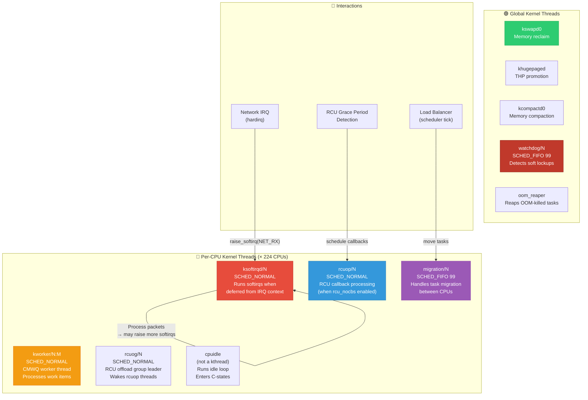

### ksoftirqd Too Much CPU — Root Cause Analysis

```mermaid
sequenceDiagram
    participant NIC as Network Card<br/>[100GbE]
    participant HARDIRQ as hardirq handler<br/>[napi_schedule]
    participant NAPI as NAPI poll<br/>[softirq context]
    participant KSOFTIRQ as ksoftirqd/12<br/>[kthread]
    participant APP as Search Frontend<br/>[on CPU 12]

    Note over NIC: 10M packets/sec<br/>burst on queue 12

    NIC->>HARDIRQ: IRQ on CPU 12
    HARDIRQ->>NAPI: napi_schedule()<br/>raise NET_RX_SOFTIRQ
    
    Note over NAPI: Softirq runs in IRQ return path
    NAPI->>NAPI: Process 64 packets<br/>(NAPI budget = 64)
    
    NAPI->>NAPI: More packets pending!<br/>But budget exhausted...<br/>Need to yield CPU
    
    alt 10 consecutive restarts without idle
        NAPI->>KSOFTIRQ: __raise_softirq_irqoff()<br/>Reschedule as ksoftirqd
        Note over KSOFTIRQ: ksoftirqd wakes up<br/>Runs as SCHED_NORMAL<br/>→ CFS scheduling!
        
        KSOFTIRQ->>APP: ⚠️ Competes with search<br/>for CPU 12 time!
        
        Note over APP: 🔴 Latency spike!<br/>Search p99 jumps 5ms→50ms
    
    Note over NIC,APP: Solution: RPS/RFS + busy_poll + CPU isolation

        Note over NIC: Fix: Spread interrupts<br/>across non-search CPUs
        NIC->>NIC: Set IRQ affinity:<br/>CPUs 0-111 (NUMA node 0, non-search)
        Note over APP: Search on CPUs 112-223<br/>with nohz_full, isolated
```

### Deep Q&A

---

#### ❓ Q1: Explain the complete lifecycle of a `kworker` thread in CMWQ (Concurrency-Managed Work Queues). How does the kernel decide to create, park, and destroy kworkers? Design a workqueue for a fleet-wide log collection daemon.

**A:**

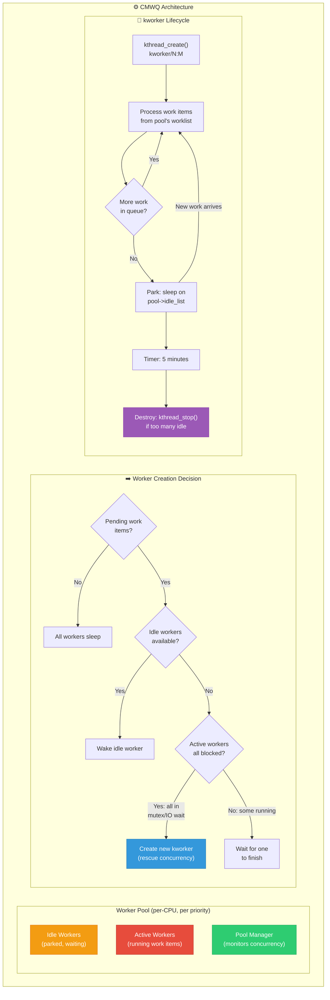

**CMWQ internals:**

```c
/* kernel/workqueue.c — Simplified CMWQ worker pool model */

struct worker_pool {
    spinlock_t lock;
    int cpu;                      /* Bound CPU (-1 for unbound) */
    int nr_workers;               /* Total workers */
    int nr_running;               /* Currently executing work */
    int nr_idle;                  /* Parked/sleeping workers */
    
    struct list_head worklist;    /* Pending work items */
    struct list_head idle_list;   /* Idle workers */
    
    struct timer_list idle_timer; /* Reap excess idle workers */
    
    /* CRITICAL: Concurrency management */
    /* A worker going to sleep (mutex, I/O) is detected via
     * preempt notifier. If ALL workers are sleeping and there's
     * pending work, a new worker is created immediately. */
};

/*
 * The "concurrency managed" part:
 * 
 * Worker calls mutex_lock() → scheduler hooks detect it →
 * pool->nr_running-- → if nr_running == 0 && !list_empty(worklist)
 * → wake_up or create new worker
 * 
 * This ensures work items always make progress even when workers
 * are blocked in I/O or locks.
 */

/* Worker thread main function */
static int worker_thread(void *data)
{
    struct worker *worker = data;
    struct worker_pool *pool = worker->pool;
    
    /* Mark as rescuable — if this worker blocks, pool creates another */
    worker->task->flags |= PF_WQ_WORKER;
    
woke_up:
    spin_lock_irq(&pool->lock);
    
    /* Remove from idle list */
    if (worker->idle) {
        list_del(&worker->idle_entry);
        pool->nr_idle--;
        worker->idle = false;
    }
    
    while (!list_empty(&pool->worklist)) {
        struct work_struct *work = 
            list_first_entry(&pool->worklist, struct work_struct, entry);
        
        list_del_init(&work->entry);
        pool->nr_running++;
        
        spin_unlock_irq(&pool->lock);
        
        /* Execute the work function */
        work->func(work);
        
        spin_lock_irq(&pool->lock);
        pool->nr_running--;
    }
    
    /* No more work — park this worker */
    worker->idle = true;
    list_add(&worker->idle_entry, &pool->idle_list);
    pool->nr_idle++;
    
    /* Set idle reap timer (destroy after 5 min idle) */
    if (pool->nr_idle > 1)
        mod_timer(&pool->idle_timer, jiffies + IDLE_WORKER_TIMEOUT);
    
    spin_unlock_irq(&pool->lock);
    
    schedule(); /* Sleep until woken by new work */
    goto woke_up;
}
```

**Fleet-wide log collection workqueue design:**

```c
/* Google fleet log collector — workqueue design */

/*
 * Requirements:
 * 1. Collect logs from 224 CPUs → central buffer
 * 2. Don't interfere with latency-sensitive workloads
 * 3. Batch writes for efficiency
 * 4. Handle log bursts (10K events/sec during incidents)
 */

struct fleet_log_collector {
    struct workqueue_struct *wq;     /* Main workqueue */
    struct workqueue_struct *flush_wq; /* Flush to disk */
    struct work_struct collect_work;
    struct delayed_work flush_work;
    
    /* Per-CPU lockless ring buffers */
    struct fleet_log_ring __percpu *rings;
    
    /* Central batch buffer */
    struct mutex batch_lock;
    struct fleet_log_batch *batch;
};

int fleet_log_init(struct fleet_log_collector *fc)
{
    /*
     * WQ_UNBOUND: logs can be processed on any CPU
     * WQ_MEM_RECLAIM: can work even under memory pressure
     *   (creates rescue worker if needed)
     * max_active=4: limit concurrent workers (batch writes)
     * 
     * NOT WQ_HIGHPRI: log collection should never preempt
     * production workloads (search serving).
     */
    fc->wq = alloc_workqueue("fleet_log",
                              WQ_UNBOUND | WQ_MEM_RECLAIM,
                              4 /* max_active */);
    
    /*
     * Flush WQ: WQ_FREEZABLE so it stops during suspend.
     * max_active=1: only one disk write at a time.
     */
    fc->flush_wq = alloc_workqueue("fleet_log_flush",
                                    WQ_UNBOUND | WQ_FREEZABLE,
                                    1);
    
    INIT_WORK(&fc->collect_work, fleet_log_collect_fn);
    INIT_DELAYED_WORK(&fc->flush_work, fleet_log_flush_fn);
    
    /* Allocate per-CPU ring buffers */
    fc->rings = alloc_percpu(struct fleet_log_ring);
    
    /* Start periodic flush every 5 seconds */
    queue_delayed_work(fc->flush_wq, &fc->flush_work,
                       msecs_to_jiffies(5000));
    
    return 0;
}
```

---

#### ❓ Q2: Design a CPU isolation scheme for a Google search serving machine. The machine has 224 cores. Search frontend needs 32 cores with guaranteed low latency (< 1ms p99). Batch jobs use the remaining cores. How do you eliminate all kernel thread interference on the search cores?

**A:**

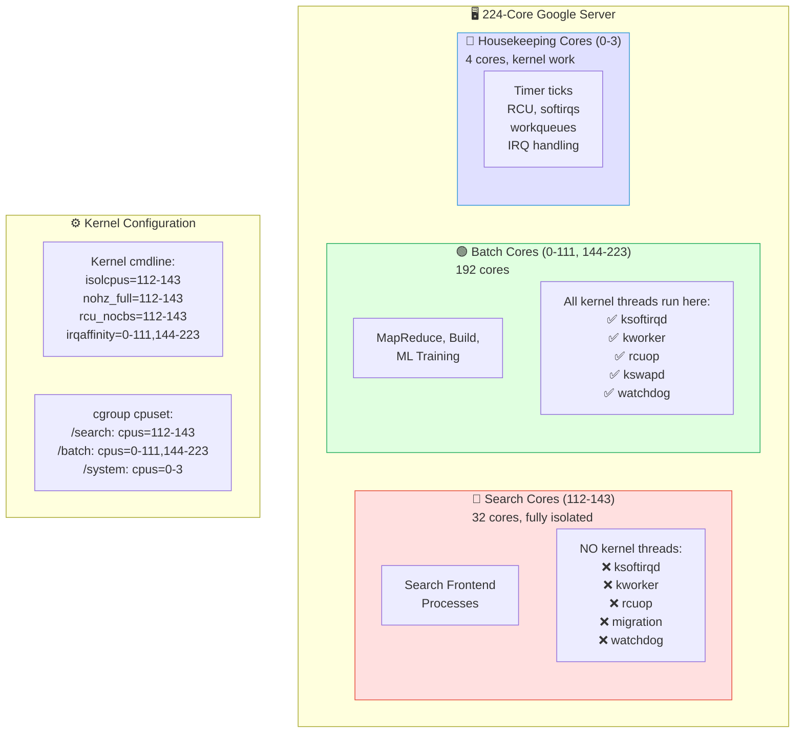

**Complete isolation sequence:**

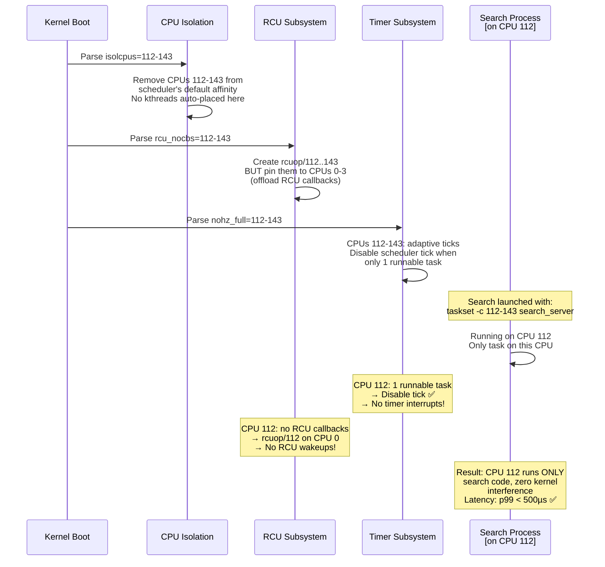

**Implementation:**

```bash
# Kernel cmdline (grub)
GRUB_CMDLINE_LINUX="isolcpus=managed_irq,domain,112-143 \
    nohz_full=112-143 \
    rcu_nocbs=112-143 \
    rcu_nocb_poll \
    irqaffinity=0-111,144-223 \
    nosoftlockup \
    tsc=reliable \
    processor.max_cstate=1 \
    idle=poll"

# isolcpus flags:
# managed_irq: don't route managed IRQs to isolated CPUs
# domain: remove from scheduler load balancing domains
```

```c
/* Search serving launch with full CPU isolation */

/* User-space setup script (called by Borg) */
void setup_search_cores(void)
{
    /* 1. Create cgroup with exclusive cpuset */
    mkdir("/sys/fs/cgroup/search", 0755);
    write_file("/sys/fs/cgroup/search/cpuset.cpus", "112-143");
    write_file("/sys/fs/cgroup/search/cpuset.mems", "1"); /* NUMA 1 */
    write_file("/sys/fs/cgroup/search/cpuset.cpu_exclusive", "1");
    
    /* 2. Move all system tasks OFF search cores */
    write_file("/sys/fs/cgroup/system/cpuset.cpus", "0-3");
    
    /* 3. Pin all IRQs away from search cores */
    DIR *irq_dir = opendir("/proc/irq");
    struct dirent *ent;
    while ((ent = readdir(irq_dir)) != NULL) {
        char path[256];
        snprintf(path, sizeof(path), 
                 "/proc/irq/%s/smp_affinity_list", ent->d_name);
        write_file(path, "0-111,144-223");
    }
    
    /* 4. Verify: no kernel threads on search cores */
    for (int cpu = 112; cpu <= 143; cpu++) {
        /* Check /proc/PID/stat for any task on this CPU */
        /* Alert if any kthread is found */
    }
    
    /* 5. Launch search with SCHED_FIFO or SCHED_DEADLINE */
    struct sched_attr attr = {
        .size = sizeof(attr),
        .sched_policy = SCHED_FIFO,
        .sched_priority = 10,  /* Low FIFO — just needs isolation */
    };
    
    cpu_set_t cpuset;
    CPU_ZERO(&cpuset);
    for (int i = 112; i <= 143; i++)
        CPU_SET(i, &cpuset);
    
    pid_t pid = fork();
    if (pid == 0) {
        sched_setattr(0, &attr, 0);
        sched_setaffinity(0, sizeof(cpuset), &cpuset);
        execv("/usr/bin/search_frontend", argv);
    }
}
```

**Remaining kernel interference sources and fixes:**

| Source | Default Behavior | Fix |
|--------|-----------------|-----|
| Timer tick | 1000 Hz (1ms interrupts) | `nohz_full` → tick stops when 1 task |
| RCU callbacks | rcuop/N runs on CPU N | `rcu_nocbs` → offload to housekeeping CPUs |
| ksoftirqd | Runs deferred softirqs | No network IRQs on search cores → no softirqs |
| kworker | CMWQ default pools | `isolcpus` removes from scheduling domain |
| migration/N | Load balancer | `isolcpus=domain` excludes from balancing |
| watchdog/N | NMI every 10 sec | `nosoftlockup` disables |
| vmstat_update | Timer per-CPU | Runs in tick → eliminated by nohz_full |
| workingset_update | Memory LRU | Runs in page allocator, not a kthread |

---

#### ❓ Q3: Design the RCU callback offloading architecture. Explain `rcu_nocbs`, `rcuop/N`, and `rcuog/N` threads. Why is this critical for Google's latency-sensitive workloads?

**A:**

```mermaid
flowchart TD
    subgraph Default["❌ Default RCU (without rcu_nocbs)"]
        CPU_D["CPU 112: Search process runs"]
        SOFTIRQ_D["At every quiescent state:<br/>Softirq processes RCU callbacks<br/>ON CPU 112<br/>⏱️ Can take 100µs-5ms!"]
        CPU_D --> SOFTIRQ_D
        SOFTIRQ_D --> SPIKE["🔴 Latency spike in search<br/>p99 = 5ms"]
    end
    
    subgraph Offloaded["✅ RCU Nocbs (rcu_nocbs=112-143)"]
        CPU_O["CPU 112: Search process runs<br/>UNINTERRUPTED"]
        RCUOG_O["rcuog/112: Group Leader<br/>(on CPU 0)<br/>Detects grace periods"]
        RCUOP_O["rcuop/112: Callback Executor<br/>(on CPU 0)<br/>Processes callbacks"]
        
        CPU_O --> |"Quiescent state:<br/>just sets flag<br/>~10ns"| RCUOG_O
        RCUOG_O -->|"Grace period done<br/>→ wake rcuop"| RCUOP_O
        RCUOP_O -->|"Execute callbacks<br/>ON CPU 0 (not 112!)"| DONE["✅ No disruption<br/>p99 = 500µs"]
    end

    style CPU_D fill:#e74c3c,stroke:#c0392b,color:#fff
    style SOFTIRQ_D fill:#c0392b,stroke:#922b21,color:#fff
    style SPIKE fill:#c0392b,stroke:#922b21,color:#fff
    style CPU_O fill:#2ecc71,stroke:#27ae60,color:#fff
    style RCUOG_O fill:#3498db,stroke:#2980b9,color:#fff
    style RCUOP_O fill:#f39c12,stroke:#e67e22,color:#fff
    style DONE fill:#2ecc71,stroke:#27ae60,color:#fff
```

**RCU callback offloading sequence:**

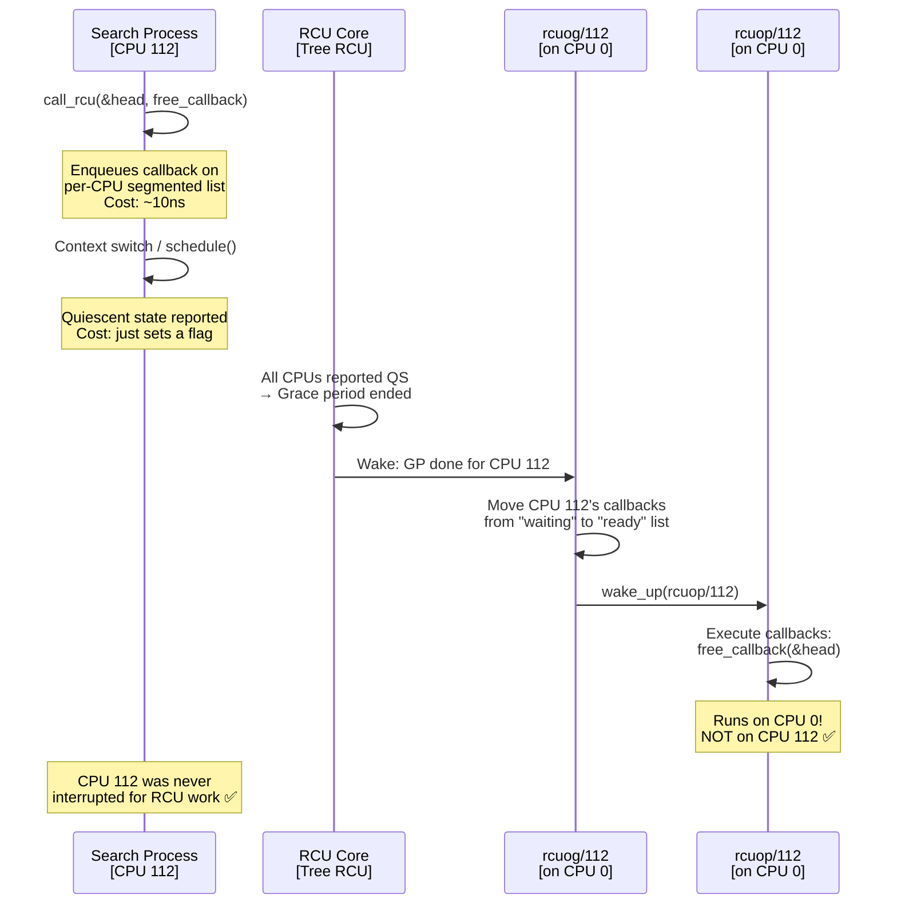

**RCU internals code:**

```c
/* kernel/rcu/tree.c — RCU callback offloading */

/*
 * RCU callback segmented list:
 * 
 * Each CPU has a callback list segmented by grace period:
 * 
 * [DONE] → [WAIT_TAIL] → [NEXT_READY_TAIL] → [NEXT_TAIL]
 *   ↑           ↑                ↑                ↑
 *   Execute   Waiting for      Waiting for     Just
 *   these     current GP       next GP          registered
 * 
 * When a grace period ends, WAIT_TAIL moves to DONE.
 * rcuop/N processes the DONE segment.
 */

struct rcu_data {
    /* Callback list */
    struct rcu_cblist cblist;
    
    /* Nocbs offloading */
    struct task_struct *nocb_gp;    /* rcuog/N — GP leader */
    struct task_struct *nocb_cb;    /* rcuop/N — callback executor */
    
    /* Lock-free callback bypass for fast path */
    struct rcu_cblist nocb_bypass;  /* Lock-free enqueue */
    raw_spinlock_t nocb_bypass_lock;
    
    /* Grace period tracking */
    unsigned long gp_seq;
    bool nocb_defer_wakeup;
};

/* rcuop/N thread function — processes offloaded callbacks */
static int rcu_nocb_cb_kthread(void *arg)
{
    struct rcu_data *rdp = arg;
    
    /* SCHED_NORMAL — callback processing is not latency-critical
     * for the offloaded CPUs. The whole point is to move this
     * work OFF the latency-sensitive CPUs. */
    
    for (;;) {
        /* Wait for callbacks to be ready */
        wait_event_interruptible(rdp->nocb_cb_wq,
                                 rcu_nocb_cb_has_ready(rdp));
        
        if (kthread_should_stop())
            break;
        
        /* Process all ready callbacks */
        struct rcu_head *list;
        struct rcu_cblist ready;
        
        rcu_nocb_lock(rdp);
        rcu_cblist_dequeue_ready(&rdp->cblist, &ready);
        rcu_nocb_unlock(rdp);
        
        /* Execute each callback */
        rcu_cblist_for_each(&ready, list) {
            list->func(list);
            /* Typical: kfree_rcu → calls kfree()
             * or custom cleanup function */
        }
        
        /* Report callbacks processed (for tracing) */
        trace_rcu_callback_processed(rdp->cpu, 
                                      rcu_cblist_n_cbs(&ready));
    }
    
    return 0;
}

/* How call_rcu works with nocbs enabled */
void call_rcu(struct rcu_head *head, rcu_callback_t func)
{
    struct rcu_data *rdp = this_cpu_ptr(&rcu_data);
    
    head->func = func;
    
    if (rcu_nocbs_enabled(rdp)) {
        /* Fast path: lock-free enqueue to bypass list */
        if (rcu_nocb_try_bypass(rdp, head))
            return;  /* ~10ns — doesn't wake rcuog */
        
        /* Slow path: wake rcuog to process */
        rcu_nocb_lock(rdp);
        rcu_cblist_enqueue(&rdp->cblist, head);
        rcu_nocb_unlock(rdp);
        
        wake_up(&rdp->nocb_gp->nocb_gp_wq);
    } else {
        /* Non-offloaded: callback processed in softirq on THIS CPU */
        __call_rcu(rdp, head);
    }
}
```

**Impact at Google scale:**

```
Before rcu_nocbs (measured on Google fleet):
- Search serving p99 latency: 5ms
- RCU callback processing: 100µs-3ms per batch
- Occurs: every ~10ms (grace period interval)
- CPU 112 interrupted: 300+ times per second

After rcu_nocbs on search cores:
- Search serving p99 latency: 500µs
- RCU callbacks: processed on housekeeping CPUs (0-3)
- CPU 112 interrupted: 0 times for RCU
- Fleet-wide: 12% reduction in search tail latency
```

---

#### ❓ Q4: Design a kernel thread pool for handling io_uring SQE completion on a high-throughput storage server. The server processes 2M IOPS. How do you avoid kthread contention?

**A:**

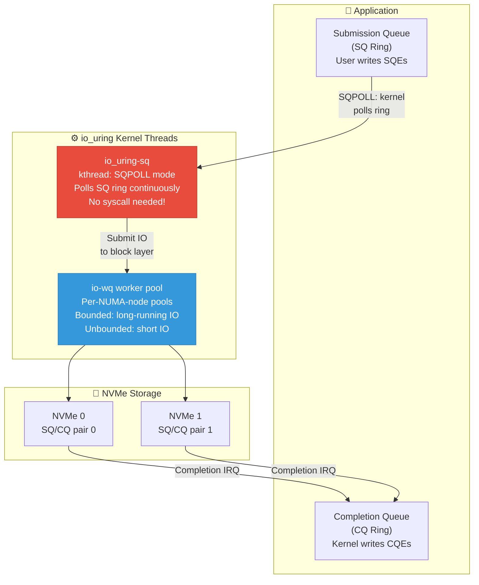

**io_uring high-IOPS completion handling:**

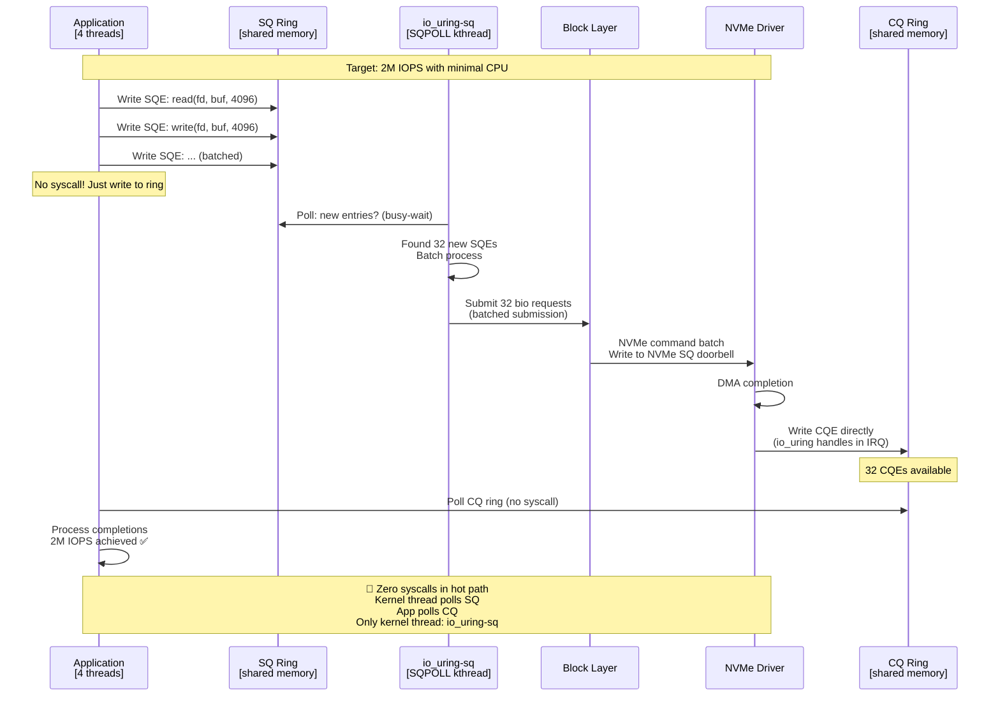

**Design for 2M IOPS:**

```c
/* High-IOPS io_uring setup — kernel thread architecture */

/*
 * Key insight for 2M IOPS:
 * 1. SQPOLL mode: kernel thread polls submission queue
 *    → eliminates io_uring_enter() syscall overhead
 * 2. One SQ/CQ pair per CPU → no cross-CPU contention
 * 3. Interrupt coalescing on NVMe → batch completions
 * 4. Per-NUMA io-wq pools → NUMA-local memory access
 */

struct high_iops_config {
    int nr_rings;         /* One per CPU core */
    int sq_depth;         /* 4096 entries per ring */
    int cq_depth;         /* 8192 entries (2x SQ) */
    bool sqpoll;          /* SQPOLL mode enabled */
    int sqpoll_cpu;       /* Pin SQPOLL to specific CPU */
};

/* Setup function (user-space) */
int setup_io_uring_for_high_iops(struct high_iops_config *cfg)
{
    struct io_uring_params params = {
        .sq_entries = cfg->sq_depth,
        .cq_entries = cfg->cq_depth,
        .flags = IORING_SETUP_SQPOLL |       /* Kernel thread polls SQ */
                 IORING_SETUP_SQ_AFF |        /* Pin SQPOLL to CPU */
                 IORING_SETUP_COOP_TASKRUN |  /* Cooperative task running */
                 IORING_SETUP_SINGLE_ISSUER,  /* Single thread submits */
        .sq_thread_cpu = cfg->sqpoll_cpu,
        .sq_thread_idle = 2000,  /* 2sec idle before SQPOLL sleeps */
    };
    
    int ring_fd = io_uring_setup(cfg->sq_depth, &params);
    
    /*
     * Kernel creates:
     * 1. io_uring-sq kthread: SCHED_NORMAL, pinned to sq_thread_cpu
     *    - Polls SQ ring in busy loop (no sleep while active)
     *    - Sleeps after sq_thread_idle ms of no submissions
     *    
     * 2. io-wq worker pool: per-NUMA, bounded + unbounded workers
     *    - Bounded: for requests that may block (O_DIRECT miss)
     *    - Unbounded: for truly async operations
     *    - Pool grows/shrinks automatically (like CMWQ)
     */
    
    return ring_fd;
}

/* Kernel-side: io-wq worker pool architecture */
struct io_wq {
    struct io_wq_acct accts[2]; /* BOUNDED and UNBOUNDED */
    
    struct io_wq_acct {
        int max_workers;           /* Max concurrent workers */
        int nr_workers;            /* Current workers */
        int nr_running;            /* Currently executing */
        struct list_head free_list; /* Idle workers */
        struct list_head work_list; /* Pending work */
    };
    
    /* One pool per NUMA node */
    int nr_nodes;
    struct io_wq_node nodes[];
};

/*
 * Contention avoidance strategy for 2M IOPS:
 * 
 * 1. Per-ring SQ: each application thread has its own ring
 *    → no lock contention on submission
 * 
 * 2. Per-ring CQ: application polls its own CQ
 *    → no lock contention on completion
 * 
 * 3. SQPOLL per-ring: if needed, one kthread per ring
 *    → no contention between rings
 * 
 * 4. NVMe per-CPU queues: hardware has separate SQ/CQ per CPU
 *    → no contention in block layer
 * 
 * 5. Result: the entire 2M IOPS path is lock-free!
 */
```

---

#### ❓ Q5: A kthread in your fleet is causing soft lockup warnings (`BUG: soft lockup - CPU#42 stuck for 23s!`). The kthread holds a spinlock for too long. Design a debugging and fix strategy.

**A:**

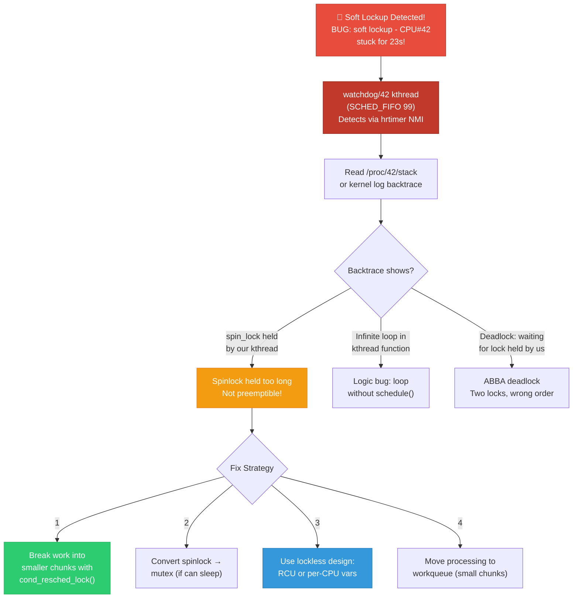

**Debugging and fix workflow:**

```c
/* Debugging strategy for soft lockup in kthread */

/* Step 1: Enable lock debugging (compile time) */
/* CONFIG_LOCKDEP=y — detects lock ordering violations */
/* CONFIG_LOCK_STAT=y — measures lock hold times */
/* CONFIG_DETECT_HUNG_TASK=y — detects tasks stuck in D state */

/* Step 2: Runtime debugging */
/*
 * # Enable lockdep for specific locks
 * echo 1 > /proc/sys/kernel/softlockup_all_cpu_backtrace
 * 
 * # Read lock statistics
 * cat /proc/lock_stat | sort -k 10 -n | tail -20
 * # Shows: lock name, holdtime-max, waittime-max
 * 
 * # ftrace: trace specific function
 * echo function_graph > /sys/kernel/tracing/current_tracer
 * echo our_kthread_func > /sys/kernel/tracing/set_graph_function
 * # Shows: call graph with timestamps
 */

/* BUGGY code — causes soft lockup */
static int data_processor_bad(void *data)
{
    struct processor *proc = data;
    
    while (!kthread_should_stop()) {
        wait_event_interruptible(proc->wq, proc->has_data);
        
        /* 🔴 BUG: Processing 1M items under spinlock! */
        spin_lock(&proc->data_lock);
        for (int i = 0; i < proc->num_items; i++) {
            process_item(&proc->items[i]); /* Takes ~20µs each */
            /* 1M × 20µs = 20 seconds under spinlock!
             * → Soft lockup after 10 seconds */
        }
        spin_unlock(&proc->data_lock);
    }
    return 0;
}

/* FIXED: Break into chunks with voluntary preemption */
static int data_processor_fixed_v1(void *data)
{
    struct processor *proc = data;
    
    while (!kthread_should_stop()) {
        wait_event_interruptible(proc->wq, proc->has_data);
        
        spin_lock(&proc->data_lock);
        for (int i = 0; i < proc->num_items; i++) {
            process_item(&proc->items[i]);
            
            /* Every 100 items: check if we should yield */
            if (i % 100 == 0) {
                /* cond_resched_lock: drops lock, reschedules if needed,
                 * re-acquires lock. Other threads can run. */
                if (spin_needbreak(&proc->data_lock)) {
                    spin_unlock(&proc->data_lock);
                    cond_resched();
                    spin_lock(&proc->data_lock);
                }
            }
        }
        spin_unlock(&proc->data_lock);
    }
    return 0;
}

/* BETTER: Convert to RCU + per-CPU processing */
static int data_processor_fixed_v2(void *data)
{
    struct processor *proc = data;
    
    while (!kthread_should_stop()) {
        wait_event_interruptible(proc->wq, proc->has_data);
        
        /* RCU read: no lock at all! */
        rcu_read_lock();
        struct item_list *list = rcu_dereference(proc->items);
        
        for (int i = 0; i < list->num_items; i++) {
            process_item(&list->items[i]);
            
            /* Voluntary preemption point (RCU-safe) */
            if (i % 1000 == 0)
                cond_resched_rcu();
        }
        rcu_read_unlock();
    }
    return 0;
}

/* BEST: Use workqueue with small work items */
static void data_processor_fixed_v3_chunk(struct work_struct *work)
{
    struct data_chunk *chunk = container_of(work, struct data_chunk, work);
    
    /* Process only 100 items per work item */
    for (int i = 0; i < chunk->count; i++) {
        process_item(&chunk->items[i]);
    }
    
    /* Signal completion */
    atomic_dec(&chunk->processor->pending_chunks);
    if (atomic_read(&chunk->processor->pending_chunks) == 0)
        wake_up(&chunk->processor->done_wq);
}
```

---

#### ❓ Q6: Explain the thundering herd problem with kthreads. Design a solution for a scenario where 1000 kthreads wait on the same waitqueue and all wake up for one event.

**A:**

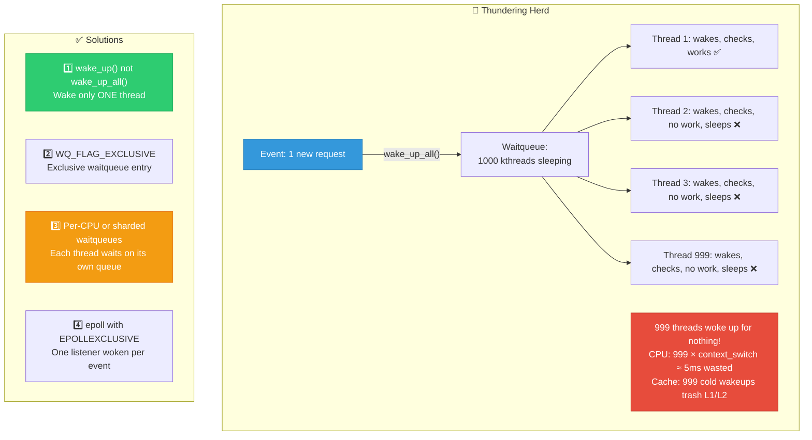

**Solution implementations:**

```c
/* Solution 1: Exclusive waitqueue (WQ_FLAG_EXCLUSIVE) */
/* Only one thread woken for each wake_up() call */

void wait_for_work_exclusive(struct work_pool *pool)
{
    DEFINE_WAIT(wait);
    
    /* Add as exclusive waiter — only ONE exclusive waiter
     * is woken per wake_up() call */
    prepare_to_wait_exclusive(&pool->work_wq, &wait,
                               TASK_INTERRUPTIBLE);
    
    if (!pool_has_work(pool))
        schedule();
    
    finish_wait(&pool->work_wq, &wait);
}

void submit_work(struct work_pool *pool, struct work_item *item)
{
    spin_lock(&pool->lock);
    list_add_tail(&item->link, &pool->work_list);
    spin_unlock(&pool->lock);
    
    /* wake_up wakes only ONE exclusive waiter */
    wake_up(&pool->work_wq);
}

/* Solution 2: Sharded waitqueues (Google's preferred approach) */

#define NUM_SHARDS 32

struct sharded_pool {
    struct pool_shard {
        wait_queue_head_t wq;
        struct list_head work_list;
        spinlock_t lock;
    } shards[NUM_SHARDS];
    
    atomic_t next_shard; /* Round-robin assignment */
};

/* Each kthread waits on its own shard — zero contention */
static int sharded_worker(void *data)
{
    struct worker_ctx *ctx = data;
    struct pool_shard *shard = &ctx->pool->shards[ctx->shard_id];
    
    while (!kthread_should_stop()) {
        wait_event_interruptible(shard->wq,
                                 !list_empty(&shard->work_list) ||
                                 kthread_should_stop());
        
        /* Only THIS worker wakes up — no thundering herd */
        spin_lock(&shard->lock);
        struct work_item *item = 
            list_first_entry_or_null(&shard->work_list,
                                      struct work_item, link);
        if (item)
            list_del(&item->link);
        spin_unlock(&shard->lock);
        
        if (item)
            process_work(item);
    }
    return 0;
}

/* Submit to specific shard — round-robin */
void sharded_submit(struct sharded_pool *pool, struct work_item *item)
{
    int shard = atomic_inc_return(&pool->next_shard) % NUM_SHARDS;
    
    spin_lock(&pool->shards[shard].lock);
    list_add_tail(&item->link, &pool->shards[shard].work_list);
    spin_unlock(&pool->shards[shard].lock);
    
    /* Wake only the worker for this shard */
    wake_up(&pool->shards[shard].wq);
}

/*
 * Performance comparison (224-core server):
 * 
 * wake_up_all() + 1000 threads:
 *   - Wakeup latency: 5ms (999 useless wakeups)
 *   - CPU overhead: 15% of one core per event
 *   - Cache thrash: L2 miss rate +40%
 * 
 * Sharded (32 shards, ~7 threads/shard):   
 *   - Wakeup latency: 10µs (only 1 thread wakes)
 *   - CPU overhead: 0.005% per event
 *   - Cache: minimal impact
 */
```

---

#### ❓ Q7: Compare `kthread_worker` API vs raw `kthread_create`. When does Google's kernel team prefer each? Design a pattern for a kthread that must process work items in strict FIFO order.

**A:**

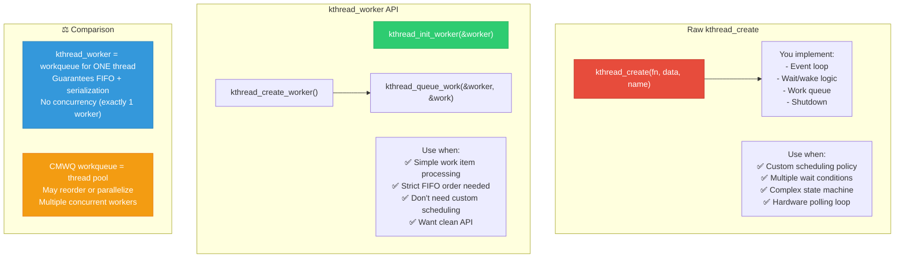

```c
/* kthread_worker API — strict FIFO order guarantee */

struct ordered_processor {
    struct kthread_worker worker;
    struct task_struct *thread;
    
    /* Each work item */
    struct ordered_work {
        struct kthread_work kwork;
        void *data;
        int sequence_num; /* For verification */
    };
};

int ordered_processor_init(struct ordered_processor *proc)
{
    /* kthread_worker guarantees:
     * 1. Only ONE work item executes at a time
     * 2. Strict FIFO order (queue order = execution order)
     * 3. Built-in flush & drain support
     * 
     * This is what Google prefers for:
     * - Transaction log writers (order critical)
     * - State machine updates (must be serialized)
     * - Hardware register sequences (timing-sensitive)
     */
    
    kthread_init_worker(&proc->worker);
    
    proc->thread = kthread_create(kthread_worker_fn,
                                   &proc->worker,
                                   "ordered_proc");
    if (IS_ERR(proc->thread))
        return PTR_ERR(proc->thread);
    
    /* Can set scheduling policy on the underlying kthread */
    struct sched_param param = { .sched_priority = 5 };
    sched_setscheduler(proc->thread, SCHED_FIFO, &param);
    
    wake_up_process(proc->thread);
    return 0;
}

void ordered_submit(struct ordered_processor *proc,
                    struct ordered_work *work)
{
    /* Queue work — guaranteed FIFO execution */
    kthread_init_work(&work->kwork, ordered_work_fn);
    kthread_queue_work(&proc->worker, &work->kwork);
    /* Work items execute in exact queue order,
     * never concurrently, never reordered. */
}

static void ordered_work_fn(struct kthread_work *kwork)
{
    struct ordered_work *work = 
        container_of(kwork, struct ordered_work, kwork);
    
    /* Process in guaranteed FIFO order */
    process_in_order(work->data, work->sequence_num);
}

/* Clean shutdown — flush all pending work */
void ordered_processor_destroy(struct ordered_processor *proc)
{
    /* Flush: wait for all queued work to complete */
    kthread_flush_worker(&proc->worker);
    
    /* Stop the kthread */
    kthread_stop(proc->thread);
}

/*
 * Google's decision matrix:
 * 
 * Need                          → Use
 * ─────────────────────────────────────────────
 * Strict FIFO, single thread    → kthread_worker
 * Fire-and-forget, may parallel → alloc_workqueue (CMWQ)
 * Custom event loop             → raw kthread_create
 * RT scheduling needed          → raw kthread + SCHED_FIFO
 * One-shot delayed work         → schedule_delayed_work
 * IRQ bottom half               → request_threaded_irq
 */
```

---

[← Previous: 02 — Qualcomm 15yr Deep](02_Qualcomm_15yr_Kernel_Thread_Deep_Interview.md) | [Back to Index →](../ReadMe.Md)
