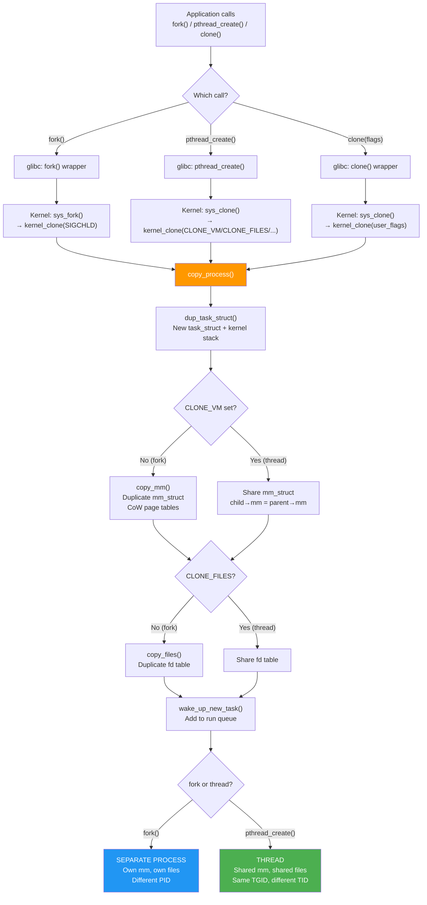
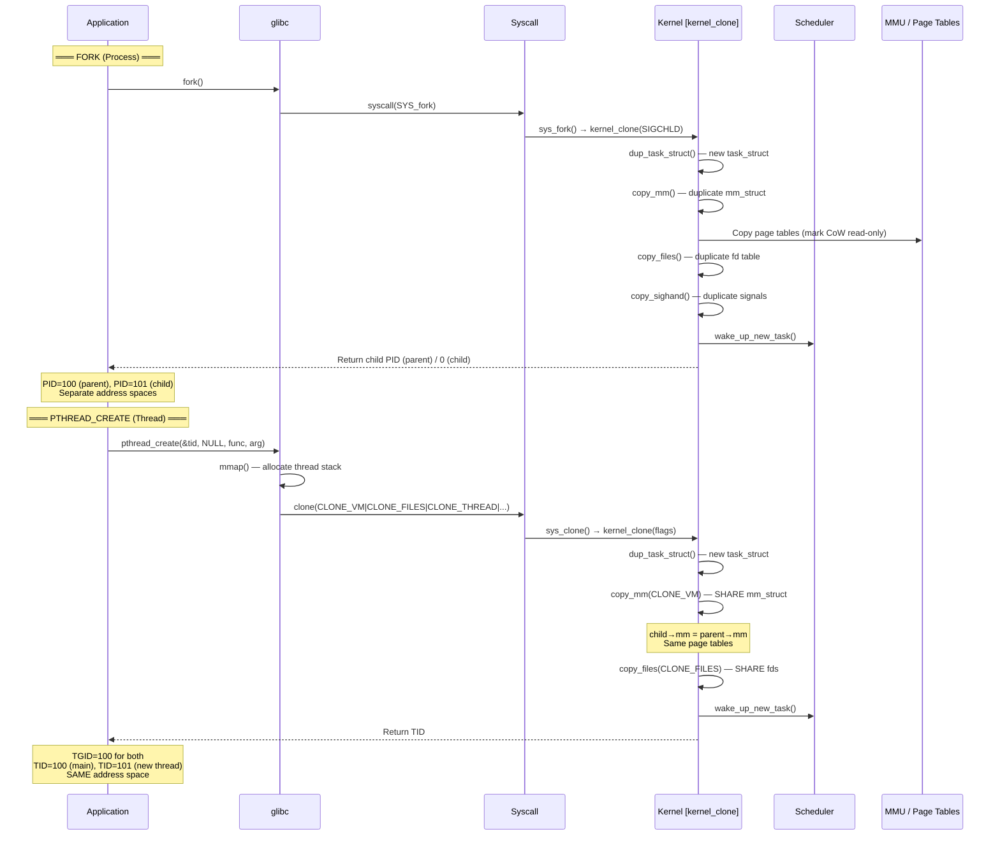
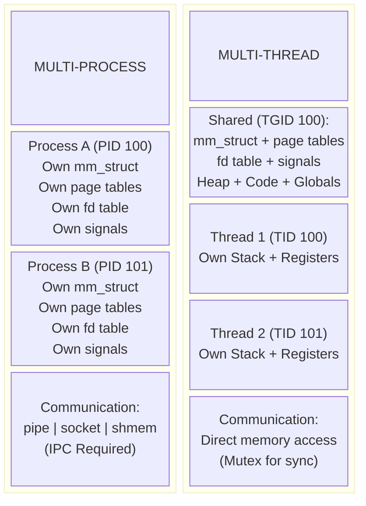

# Linux Process vs Thread — Complete Guide with 10 Practical Examples

## Table of Contents

1. [What Is a Process?](#what-is-a-process)
2. [What Is a Thread?](#what-is-a-thread)
3. [Process vs Thread — Key Differences](#process-vs-thread--key-differences)
4. [How Linux Implements Both — task_struct](#how-linux-implements-both--task_struct)
5. [System Calls — fork, exec, clone, pthread_create](#system-calls--fork-exec-clone-pthread_create)
6. [Memory Layout — Process vs Thread](#memory-layout--process-vs-thread)
7. [10 Practical Examples](#10-practical-examples)
   - [Example 1: fork — Creating a Child Process](#example-1-fork--creating-a-child-process)
   - [Example 2: fork + exec — Process Replacement](#example-2-fork--exec--process-replacement)
   - [Example 3: Basic Thread Creation with pthread](#example-3-basic-thread-creation-with-pthread)
   - [Example 4: Thread Shared Memory — No IPC Needed](#example-4-thread-shared-memory--no-ipc-needed)
   - [Example 5: Process Isolation — Child Crash Doesn't Kill Parent](#example-5-process-isolation--child-crash-doesnt-kill-parent)
   - [Example 6: Thread Crash Kills Entire Process](#example-6-thread-crash-kills-entire-process)
   - [Example 7: Multi-Process Server (Apache-style)](#example-7-multi-process-server-apache-style)
   - [Example 8: Multi-Thread Server (Nginx-style)](#example-8-multi-thread-server-nginx-style)
   - [Example 9: Copy-on-Write with fork](#example-9-copy-on-write-with-fork)
   - [Example 10: Kernel Threads — kthread](#example-10-kernel-threads--kthread)
8. [When to Use Process vs Thread](#when-to-use-process-vs-thread)
9. [Flow Diagram — fork vs clone vs pthread_create](#flow-diagram--fork-vs-clone-vs-pthread_create)
10. [Sequence Diagram — Process and Thread Creation](#sequence-diagram--process-and-thread-creation)
11. [Block Diagram — Architecture](#block-diagram--architecture)
12. [Key Data Structures](#key-data-structures)
13. [Common Pitfalls](#common-pitfalls)
14. [Interview Q&A](#interview-qa)
15. [Summary](#summary)

---

## What Is a Process?

A **process** is an **independent instance of a running program**. It is the fundamental unit of resource allocation in Linux.

### A Process Has:

| Resource | Description |
|----------|-------------|
| **PID** | Unique process ID |
| **Own address space** | Separate virtual memory (code, data, heap, stack) |
| **Own page tables** | Independent virtual → physical address mapping |
| **Own file descriptors** | Independent set of open files |
| **Own signal handlers** | Independent signal disposition |
| **Own credentials** | UID, GID, capabilities |
| **Own resource limits** | RLIMIT_NOFILE, RLIMIT_STACK, etc. |

### Process Lifecycle

```
fork()              exec()              exit()
  │                   │                   │
  ▼                   ▼                   ▼
┌──────┐  fork()  ┌──────┐  exec()  ┌──────┐  exit()  ┌──────┐
│PARENT│ ───────► │CHILD │ ───────► │ NEW  │ ───────► │ZOMBIE│
│      │          │(copy)│          │BINARY│          │      │
└──────┘          └──────┘          └──────┘          └──┬───┘
                                                         │ wait()
                                                         ▼
                                                      REAPED
```

### Process States

```c
TASK_RUNNING          /* Running or ready to run */
TASK_INTERRUPTIBLE    /* Sleeping — can be woken by signals */
TASK_UNINTERRUPTIBLE  /* Sleeping — cannot be woken (D state) */
TASK_STOPPED          /* Stopped by signal (SIGSTOP) */
TASK_ZOMBIE           /* Exited but parent hasn't called wait() */
EXIT_DEAD             /* Being removed from system */
```

---

## What Is a Thread?

A **thread** is a **lightweight execution unit within a process**. Threads within the same process share the same address space and resources.

### In Linux: Threads ARE Processes (Internally)

Linux does **not** have a separate "thread" data structure. Both processes and threads are represented by **`task_struct`**. The difference is what they **share**:

| Resource | Process (fork) | Thread (clone/pthread) |
|----------|---------------|----------------------|
| Address space (mm_struct) | **Separate copy** (CoW) | **Shared** |
| File descriptors | **Separate copy** | **Shared** |
| Signal handlers | **Separate copy** | **Shared** |
| PID | **Different** | **Different TID, same TGID** |
| Stack | **Separate** | **Separate** (each thread has own stack) |
| Registers / PC | **Separate** | **Separate** |

### Thread Group

```
Process (TGID = 100)
├── Main Thread   (TID = 100, TGID = 100)  ← getpid() returns 100
├── Thread 1      (TID = 101, TGID = 100)  ← getpid() returns 100
├── Thread 2      (TID = 102, TGID = 100)  ← getpid() returns 100
└── Thread 3      (TID = 103, TGID = 100)  ← getpid() returns 100

                   All share same address space (mm_struct)
                   All share open files (files_struct)
                   All share signal handlers (sighand_struct)
                   Each has its own stack and registers
```

---

## Process vs Thread — Key Differences

| Aspect | Process | Thread |
|--------|---------|--------|
| **Creation** | `fork()` | `clone()` with shared flags / `pthread_create()` |
| **Address space** | Independent (CoW copy) | Shared with parent |
| **Memory overhead** | High (duplicate page tables, VMA) | Low (shares page tables) |
| **Creation time** | Slower (~100μs) | Faster (~10μs) |
| **Context switch** | Slower (TLB flush, page table switch) | Faster (no TLB flush if same mm) |
| **Communication** | IPC needed (pipe, socket, shmem) | Direct memory access (shared heap) |
| **Isolation** | Strong — crash in child doesn't affect parent | Weak — crash in one thread kills all |
| **File descriptors** | Independent set | Shared set |
| **Signal handling** | Independent | Shared handlers, per-thread masks |
| **Security** | Strong (separate address space) | Weak (any thread can access all memory) |
| **Debugging** | Easier (isolated state) | Harder (race conditions, shared state) |
| **Scalability** | Limited by IPC overhead | Better for shared-data workloads |
| **System call** | `fork()` → `clone(SIGCHLD, 0)` | `pthread_create()` → `clone(CLONE_VM\|CLONE_FS\|CLONE_FILES\|...)` |
| **Kernel repr.** | `task_struct` with **own** `mm_struct` | `task_struct` **sharing** parent's `mm_struct` |
| **getpid()** | Returns own PID | Returns TGID (same as parent's PID) |
| **gettid()** | PID == TID | TID is unique, different from TGID |

---

## How Linux Implements Both — task_struct

Both processes and threads are `task_struct`. The `clone()` system call controls what is shared vs copied:

```c
/* fork() is actually: */
clone(SIGCHLD, 0);
/* → New task_struct, COPIES mm_struct, files_struct, signal_struct */

/* pthread_create() is actually: */
clone(CLONE_VM | CLONE_FS | CLONE_FILES | CLONE_SIGHAND |
      CLONE_THREAD | CLONE_SYSVSEM | CLONE_SETTLS |
      CLONE_PARENT_SETTID | CLONE_CHILD_CLEARTID,
      child_stack);
/* → New task_struct, SHARES mm_struct, files_struct, signal_struct */
```

### Clone Flags

| Flag | Effect | fork | pthread |
|------|--------|------|---------|
| `CLONE_VM` | Share address space (mm_struct) | ❌ | ✅ |
| `CLONE_FS` | Share filesystem info (cwd, root, umask) | ❌ | ✅ |
| `CLONE_FILES` | Share file descriptor table | ❌ | ✅ |
| `CLONE_SIGHAND` | Share signal handlers | ❌ | ✅ |
| `CLONE_THREAD` | Same thread group (same PID to userspace) | ❌ | ✅ |
| `CLONE_PARENT` | Share parent | ❌ | ❌ |
| `CLONE_NEWPID` | New PID namespace (containers) | ❌ | ❌ |

---

## System Calls — fork, exec, clone, pthread_create

```
Userspace                              Kernel
─────────                              ──────

fork()  ─────────► sys_fork()
                      └──► kernel_clone(SIGCHLD)
                              └──► copy_process()
                                     ├── dup_task_struct()      ← New task_struct
                                     ├── copy_mm()              ← COPY mm_struct (CoW)
                                     ├── copy_files()           ← COPY file descriptors
                                     ├── copy_sighand()         ← COPY signal handlers
                                     └── copy_thread()          ← Setup registers/stack

pthread_create() ─► clone()
                      └──► kernel_clone(CLONE_VM|CLONE_FILES|...)
                              └──► copy_process()
                                     ├── dup_task_struct()      ← New task_struct
                                     ├── copy_mm()              ← SHARE mm (same pointer)
                                     ├── copy_files()           ← SHARE file descriptors
                                     ├── copy_sighand()         ← SHARE signal handlers
                                     └── copy_thread()          ← Setup registers/stack

exec() ──────────► sys_execve()
                      └──► do_execveat_common()
                              └──► exec_binprm()
                                     ├── flush_old_exec()       ← Discard old mm
                                     ├── setup_new_exec()       ← New mm_struct
                                     ├── load_elf_binary()      ← Load new program
                                     └── start_thread()         ← Set new entry point
```

---

## Memory Layout — Process vs Thread

### Two Separate Processes (after fork)

```
Process A (PID 100)                   Process B (PID 101)
┌─────────────────────┐               ┌─────────────────────┐
│ Stack       ↓       │               │ Stack       ↓       │
│ [local vars A]      │               │ [local vars B]      │
├─────────────────────┤               ├─────────────────────┤
│                     │               │                     │
├─────────────────────┤               ├─────────────────────┤
│ Heap        ↑       │               │ Heap        ↑       │
│ [malloc'd data A]   │               │ [malloc'd data B]   │
├─────────────────────┤               ├─────────────────────┤
│ Data (global vars)  │               │ Data (global vars)  │
├─────────────────────┤               ├─────────────────────┤
│ Text (code)         │               │ Text (code)         │
└─────────────────────┘               └─────────────────────┘
     mm_struct A                           mm_struct B
     Page Tables A                         Page Tables B
     (Copy-on-Write until modified)

     ❌ A cannot see B's memory
     Need IPC (pipes, shmem, sockets) to communicate
```

### Two Threads in Same Process

```
Process (PID 100, 2 threads)
┌─────────────────────────────────────────────┐
│                                             │
│  Thread 1 Stack ↓    Thread 2 Stack ↓       │
│  [local vars T1]     [local vars T2]        │
│  (TID 100)           (TID 101)              │
│                                             │
├─────────────────────────────────────────────┤
│  SHARED Heap  ↑                             │
│  [malloc'd data — visible to BOTH threads]  │
├─────────────────────────────────────────────┤
│  SHARED Data (global variables)             │
│  [global_counter — visible to BOTH]         │
├─────────────────────────────────────────────┤
│  SHARED Text (code)                         │
└─────────────────────────────────────────────┘
     ONE mm_struct (shared)
     ONE set of Page Tables

     ✅ Thread 1 can directly read/write Thread 2's heap/globals
     ⚠️ Needs synchronization (mutex, spinlock) to avoid races
```

---

## 10 Practical Examples

### Example 1: fork — Creating a Child Process

```c
#include <stdio.h>
#include <stdlib.h>
#include <unistd.h>
#include <sys/wait.h>

/*
 * fork() creates a SEPARATE process.
 * Child gets a COPY of parent's memory (CoW).
 * Changes in child do NOT affect parent.
 */
int main(void)
{
    int shared_var = 100;

    printf("Parent PID=%d, shared_var=%d\n", getpid(), shared_var);

    pid_t pid = fork();

    if (pid < 0) {
        perror("fork failed");
        exit(1);
    }

    if (pid == 0) {
        /* ── CHILD PROCESS ── */
        shared_var = 999;  /* Modifies child's COPY — parent unaffected */
        printf("Child  PID=%d, shared_var=%d (modified)\n",
               getpid(), shared_var);
        exit(0);
    }

    /* ── PARENT PROCESS ── */
    wait(NULL);
    printf("Parent PID=%d, shared_var=%d (unchanged!)\n",
           getpid(), shared_var);

    return 0;
}
/*
 * Compile: gcc -o ex1_fork ex1_fork.c
 *
 * Output:
 *   Parent PID=1000, shared_var=100
 *   Child  PID=1001, shared_var=999 (modified)
 *   Parent PID=1000, shared_var=100 (unchanged!)
 *
 * KEY: fork() copies memory. Child's changes invisible to parent.
 */
```

---

### Example 2: fork + exec — Process Replacement

```c
#include <stdio.h>
#include <stdlib.h>
#include <unistd.h>
#include <sys/wait.h>

/*
 * fork() + exec() pattern — how shells launch commands.
 * fork() creates child, exec() replaces its code with new program.
 */
int main(void)
{
    pid_t pid = fork();

    if (pid < 0) { perror("fork"); exit(1); }

    if (pid == 0) {
        /* ── CHILD: Replace with "ls -la" ── */
        printf("Child PID=%d — about to exec 'ls'\n", getpid());
        execlp("ls", "ls", "-la", "/tmp", NULL);
        perror("exec failed");  /* Only reached if exec fails */
        exit(1);
    }

    /* ── PARENT: Wait for child ── */
    int status;
    waitpid(pid, &status, 0);
    if (WIFEXITED(status))
        printf("Parent: child exited with code %d\n", WEXITSTATUS(status));

    return 0;
}
/*
 * Compile: gcc -o ex2_exec ex2_exec.c
 *
 * KEY: exec() replaces entire process image.
 *      Old code, data, heap, stack → gone.
 *      PID stays the same.
 */
```

---

### Example 3: Basic Thread Creation with pthread

```c
#include <stdio.h>
#include <pthread.h>
#include <unistd.h>

/*
 * pthread_create() creates a THREAD in the SAME address space.
 * Shares global variables. Each thread has own stack.
 */

int global_counter = 0;  /* Shared between all threads */

void *thread_func(void *arg)
{
    int thread_id = *(int *)arg;
    int local_var = thread_id * 100;  /* Private to this thread's stack */

    printf("Thread %d: PID=%d, TID=%ld, local=%d, global=%d\n",
           thread_id, getpid(), (long)pthread_self(),
           local_var, global_counter);

    global_counter += 10;  /* Modifies SHARED memory */

    printf("Thread %d: global_counter now = %d\n",
           thread_id, global_counter);
    return NULL;
}

int main(void)
{
    pthread_t t1, t2;
    int id1 = 1, id2 = 2;

    printf("Main: PID=%d, global_counter=%d\n", getpid(), global_counter);

    pthread_create(&t1, NULL, thread_func, &id1);
    pthread_create(&t2, NULL, thread_func, &id2);

    pthread_join(t1, NULL);
    pthread_join(t2, NULL);

    printf("Main: global_counter=%d (modified by threads!)\n",
           global_counter);
    return 0;
}
/*
 * Compile: gcc -o ex3_thread ex3_thread.c -lpthread
 *
 * Output (order may vary):
 *   Main: PID=1000, global_counter=0
 *   Thread 1: PID=1000, ..., global=0
 *   Thread 1: global_counter now = 10
 *   Thread 2: PID=1000, ..., global=10
 *   Thread 2: global_counter now = 20
 *   Main: global_counter=20 (modified by threads!)
 *
 * KEY: Threads share globals/heap. PID is SAME for all threads.
 */
```

---

### Example 4: Thread Shared Memory — No IPC Needed

```c
#include <stdio.h>
#include <stdlib.h>
#include <pthread.h>

/*
 * Producer-Consumer with threads — direct shared memory.
 * No pipes, sockets, or shmem IPC needed.
 * Does need mutex + condition variable for synchronization.
 */

#define BUFFER_SIZE 5

struct shared_data {
    int buffer[BUFFER_SIZE];
    int count, in, out;
    pthread_mutex_t mutex;
    pthread_cond_t not_empty;
    pthread_cond_t not_full;
};

static struct shared_data data = {
    .count = 0, .in = 0, .out = 0,
    .mutex = PTHREAD_MUTEX_INITIALIZER,
    .not_empty = PTHREAD_COND_INITIALIZER,
    .not_full = PTHREAD_COND_INITIALIZER,
};

void *producer(void *arg)
{
    for (int i = 0; i < 10; i++) {
        pthread_mutex_lock(&data.mutex);
        while (data.count == BUFFER_SIZE)
            pthread_cond_wait(&data.not_full, &data.mutex);

        data.buffer[data.in] = i;
        data.in = (data.in + 1) % BUFFER_SIZE;
        data.count++;
        printf("Produced: %d (count=%d)\n", i, data.count);

        pthread_cond_signal(&data.not_empty);
        pthread_mutex_unlock(&data.mutex);
    }
    return NULL;
}

void *consumer(void *arg)
{
    for (int i = 0; i < 10; i++) {
        pthread_mutex_lock(&data.mutex);
        while (data.count == 0)
            pthread_cond_wait(&data.not_empty, &data.mutex);

        int val = data.buffer[data.out];
        data.out = (data.out + 1) % BUFFER_SIZE;
        data.count--;
        printf("Consumed: %d (count=%d)\n", val, data.count);

        pthread_cond_signal(&data.not_full);
        pthread_mutex_unlock(&data.mutex);
    }
    return NULL;
}

int main(void)
{
    pthread_t prod, cons;
    pthread_create(&prod, NULL, producer, NULL);
    pthread_create(&cons, NULL, consumer, NULL);
    pthread_join(prod, NULL);
    pthread_join(cons, NULL);
    printf("Done — producer/consumer with shared memory!\n");
    return 0;
}
/*
 * Compile: gcc -o ex4_prodcons ex4_prodcons.c -lpthread
 *
 * KEY: Both threads directly access 'data' struct.
 *      If these were processes, you'd need pipe() or shmget().
 */
```

---

### Example 5: Process Isolation — Child Crash Doesn't Kill Parent

```c
#include <stdio.h>
#include <stdlib.h>
#include <unistd.h>
#include <sys/wait.h>
#include <signal.h>

/*
 * Process ISOLATION demo.
 * Child crashes (segfault). Parent survives.
 * This is why Chrome/Firefox use multi-process.
 */
int main(void)
{
    printf("Parent PID=%d starting\n", getpid());

    pid_t pid = fork();

    if (pid == 0) {
        /* ── CHILD: Deliberately crash ── */
        printf("Child PID=%d — about to crash!\n", getpid());
        int *ptr = NULL;
        *ptr = 42;   /* SEGFAULT */
        exit(0);
    }

    /* ── PARENT: Still alive! ── */
    int status;
    waitpid(pid, &status, 0);

    if (WIFSIGNALED(status))
        printf("Parent: child killed by signal %d (%s)\n",
               WTERMSIG(status),
               WTERMSIG(status) == SIGSEGV ? "SIGSEGV" : "other");

    printf("Parent PID=%d — still running perfectly!\n", getpid());
    return 0;
}
/*
 * Compile: gcc -o ex5_isolation ex5_isolation.c
 *
 * Output:
 *   Parent PID=1000 starting
 *   Child PID=1001 — about to crash!
 *   Parent: child killed by signal 11 (SIGSEGV)
 *   Parent PID=1000 — still running perfectly!
 *
 * KEY: Process isolation protects parent from child crashes.
 */
```

---

### Example 6: Thread Crash Kills Entire Process

```c
#include <stdio.h>
#include <stdlib.h>
#include <pthread.h>
#include <unistd.h>

/*
 * Thread crash kills ALL threads in the process.
 * No isolation between threads.
 */

void *crashing_thread(void *arg)
{
    printf("Thread 2: About to crash...\n");
    sleep(1);
    int *ptr = NULL;
    *ptr = 42;   /* SEGFAULT — kills ENTIRE process */
    return NULL;
}

void *working_thread(void *arg)
{
    for (int i = 0; i < 5; i++) {
        printf("Thread 1: Working... iteration %d\n", i);
        sleep(1);
    }
    printf("Thread 1: Finished (THIS NEVER PRINTS)\n");
    return NULL;
}

int main(void)
{
    pthread_t t1, t2;
    printf("Main: Starting threads\n");
    pthread_create(&t1, NULL, working_thread, NULL);
    pthread_create(&t2, NULL, crashing_thread, NULL);
    pthread_join(t1, NULL);
    pthread_join(t2, NULL);
    printf("Main: Done (THIS NEVER PRINTS)\n");
    return 0;
}
/*
 * Compile: gcc -o ex6_crash ex6_crash.c -lpthread
 *
 * Output:
 *   Main: Starting threads
 *   Thread 1: Working... iteration 0
 *   Thread 2: About to crash...
 *   Thread 1: Working... iteration 1
 *   Segmentation fault (core dumped)
 *
 * KEY: ALL threads die when ONE thread crashes. No isolation.
 */
```

---

### Example 7: Multi-Process Server (Apache-style)

```c
#include <stdio.h>
#include <stdlib.h>
#include <unistd.h>
#include <sys/wait.h>

/*
 * Multi-PROCESS server — pre-fork model.
 * Used by: Apache (prefork MPM), PostgreSQL, Redis (before threads).
 * Pros: Isolation, stability.  Cons: Higher memory, expensive IPC.
 */

#define NUM_WORKERS 4

void worker_process(int worker_id)
{
    printf("Worker %d (PID=%d): Ready\n", worker_id, getpid());
    for (int i = 0; i < 3; i++) {
        printf("Worker %d: Handling request %d\n", worker_id, i);
        usleep(100000);
    }
    printf("Worker %d: Done\n", worker_id);
    exit(0);
}

int main(void)
{
    pid_t workers[NUM_WORKERS];
    printf("Master (PID=%d): Forking %d workers\n", getpid(), NUM_WORKERS);

    for (int i = 0; i < NUM_WORKERS; i++) {
        workers[i] = fork();
        if (workers[i] == 0)
            worker_process(i);
        printf("Master: Forked worker %d (PID=%d)\n", i, workers[i]);
    }

    for (int i = 0; i < NUM_WORKERS; i++) {
        int status;
        waitpid(workers[i], &status, 0);
        if (WIFSIGNALED(status))
            printf("Master: Worker %d crashed! Could respawn.\n", i);
        else
            printf("Master: Worker %d exited normally\n", i);
    }

    printf("Master: All workers done\n");
    return 0;
}
/*
 * Compile: gcc -o ex7_multiprocess ex7_multiprocess.c
 *
 * KEY: Each worker is isolated. Crash in worker 2
 *      doesn't affect workers 0, 1, 3 or master.
 */
```

---

### Example 8: Multi-Thread Server (Nginx-style)

```c
#include <stdio.h>
#include <stdlib.h>
#include <pthread.h>
#include <unistd.h>

/*
 * Multi-THREAD server — thread pool model.
 * Used by: Java (Tomcat), MySQL, Node.js worker threads.
 * Pros: Shared caches, low memory.  Cons: No isolation, need sync.
 */

#define NUM_THREADS 4
#define REQS_PER_THREAD 3

struct server_stats {
    int total_requests;
    pthread_mutex_t lock;
} stats = { .total_requests = 0, .lock = PTHREAD_MUTEX_INITIALIZER };

void *worker_thread(void *arg)
{
    int id = *(int *)arg;
    printf("Thread %d (TID=%ld): Ready\n", id, (long)pthread_self());

    for (int i = 0; i < REQS_PER_THREAD; i++) {
        usleep(50000);
        pthread_mutex_lock(&stats.lock);
        stats.total_requests++;
        printf("Thread %d: request %d (total=%d)\n",
               id, i, stats.total_requests);
        pthread_mutex_unlock(&stats.lock);
    }
    return NULL;
}

int main(void)
{
    pthread_t threads[NUM_THREADS];
    int ids[NUM_THREADS];

    printf("Server: Starting %d threads\n", NUM_THREADS);
    for (int i = 0; i < NUM_THREADS; i++) {
        ids[i] = i;
        pthread_create(&threads[i], NULL, worker_thread, &ids[i]);
    }
    for (int i = 0; i < NUM_THREADS; i++)
        pthread_join(threads[i], NULL);

    printf("Server: Total requests = %d (shared counter, no IPC!)\n",
           stats.total_requests);
    return 0;
}
/*
 * Compile: gcc -o ex8_multithread ex8_multithread.c -lpthread
 *
 * KEY: All threads share 'stats' directly — no pipes or shmem.
 *      Mutex prevents race conditions.
 */
```

---

### Example 9: Copy-on-Write with fork

```c
#include <stdio.h>
#include <stdlib.h>
#include <unistd.h>
#include <sys/wait.h>
#include <string.h>

/*
 * Copy-on-Write (CoW) optimization.
 * After fork(), parent and child share SAME physical pages.
 * Pages copied only on first write — makes fork() fast.
 */
int main(void)
{
    size_t size = 100 * 1024 * 1024;  /* 100 MB */
    char *buffer = malloc(size);
    if (!buffer) { perror("malloc"); exit(1); }

    memset(buffer, 'A', size);  /* Touch all pages */
    printf("Parent: Allocated 100 MB, buffer[0]='%c'\n", buffer[0]);

    pid_t pid = fork();
    /* NOW: Both share the SAME physical pages (CoW) */
    /* Physical memory: still ~100 MB, NOT 200 MB */

    if (pid == 0) {
        printf("Child: buffer[0]='%c' (shared, no copy yet)\n", buffer[0]);
        buffer[0] = 'B';  /* THIS triggers CoW — copies ONE 4KB page */
        printf("Child: buffer[0]='%c' (CoW copied 1 page)\n", buffer[0]);
        free(buffer);
        exit(0);
    }

    wait(NULL);
    printf("Parent: buffer[0]='%c' (still 'A' — CoW kept it)\n", buffer[0]);

    /*
     * Memory timeline:
     *   Before fork:       100 MB physical
     *   After fork:        100 MB physical (shared CoW)
     *   After child write: 100 MB + 4 KB  (one CoW page)
     *   NOT 200 MB!
     */

    free(buffer);
    return 0;
}
/*
 * Compile: gcc -o ex9_cow ex9_cow.c
 *
 * KEY: fork() is fast because of CoW.
 *      Only modified pages are actually copied.
 */
```

---

### Example 10: Kernel Threads — kthread

```c
#include <linux/module.h>
#include <linux/kthread.h>
#include <linux/delay.h>
#include <linux/sched.h>

/*
 * KERNEL THREADS run entirely in kernel space.
 * No userspace address space (mm_struct is NULL).
 * Examples: ksoftirqd, kworker, kswapd, jbd2.
 * Visible in: ps aux | grep '\[.*\]'
 */

static struct task_struct *my_thread1;
static struct task_struct *my_thread2;
static int shared_counter = 0;

static int incrementer_fn(void *data)
{
    char *name = (char *)data;
    printk(KERN_INFO "%s: Started (PID=%d)\n", name, current->pid);

    while (!kthread_should_stop()) {
        shared_counter++;
        printk(KERN_INFO "%s: counter=%d\n", name, shared_counter);
        msleep_interruptible(1000);
        if (shared_counter >= 10)
            break;
    }

    printk(KERN_INFO "%s: Exiting\n", name);
    return 0;
}

static int monitor_fn(void *data)
{
    char *name = (char *)data;
    printk(KERN_INFO "%s: Started (PID=%d)\n", name, current->pid);

    while (!kthread_should_stop()) {
        printk(KERN_INFO "%s: counter=%d, mm=%p\n",
               name, shared_counter, current->mm);
        /* current->mm is NULL for kernel threads! */
        msleep_interruptible(2000);
    }
    return 0;
}

static int __init kthread_demo_init(void)
{
    my_thread1 = kthread_run(incrementer_fn, "Incrementer", "my_inc_kthread");
    if (IS_ERR(my_thread1))
        return PTR_ERR(my_thread1);

    my_thread2 = kthread_run(monitor_fn, "Monitor", "my_mon_kthread");
    if (IS_ERR(my_thread2)) {
        kthread_stop(my_thread1);
        return PTR_ERR(my_thread2);
    }
    return 0;
}

static void __exit kthread_demo_exit(void)
{
    if (my_thread1) kthread_stop(my_thread1);
    if (my_thread2) kthread_stop(my_thread2);
    printk(KERN_INFO "kthread_demo: unloaded, counter=%d\n", shared_counter);
}

module_init(kthread_demo_init);
module_exit(kthread_demo_exit);
MODULE_LICENSE("GPL");
MODULE_DESCRIPTION("Kernel thread demo");
```

```bash
# Build and test:
make                              # Needs Makefile with obj-m
sudo insmod ex10_kthread.ko
dmesg -w                          # Watch output
ps aux | grep my_                 # See [my_inc_kthread] [my_mon_kthread]
sudo rmmod ex10_kthread
```

---

## When to Use Process vs Thread

### Decision Flowchart

```
Need concurrent execution?
│
├── Tasks need to share memory HEAVILY?
│   │
│   ├── YES ──► Need fault isolation too?
│   │           │
│   │           ├── YES ──► PROCESSES + shared memory (shmem/mmap)
│   │           │
│   │           └── NO ──►  THREADS (simplest, fastest)
│   │
│   └── NO ──►  Security-sensitive?
│               │
│               ├── YES ──► PROCESSES (sandbox isolation)
│               │
│               └── NO ──►  Can one task crash affect others?
│                           │
│                           ├── Unacceptable ──► PROCESSES
│                           │
│                           └── Acceptable ──►  THREADS
```

### When to Use What

| Scenario | Use | Why |
|----------|-----|-----|
| **Web browser tabs** | Processes | Tab crash shouldn't kill browser |
| **Web server requests** | Threads (or async) | Share caches, connection pools |
| **Database connections** | Processes (PostgreSQL) / Threads (MySQL) | Isolation vs performance |
| **Parallel matrix math** | Threads | Share input/output arrays directly |
| **Running shell commands** | Process (fork + exec) | Need different program |
| **GUI background I/O** | Thread | Share UI state without IPC |
| **Plugin system** | Processes | Plugin crash can't kill host |
| **Real-time data pipeline** | Threads | Low-latency shared buffers |
| **Sandboxed execution** | Processes + namespaces | Security isolation |
| **Kernel background work** | Kernel threads (kthread) | No userspace needed |

### Real-World Architectures

| Application | Model | Why |
|-------------|-------|-----|
| **Chrome** | Multi-process | Tab isolation — crash safety |
| **Firefox** | Multi-process (Electrolysis) | Same as Chrome |
| **Apache** (prefork) | Multi-process | Simple, robust, isolated |
| **Apache** (worker) | Hybrid (process + threads) | Balance |
| **Nginx** | Multi-process + event-driven | Workers + async I/O |
| **PostgreSQL** | Multi-process | Connection isolation |
| **MySQL** | Multi-thread | Shared buffer pool |
| **Node.js** | Single + worker threads | Event loop + CPU threads |
| **Redis** | Single-threaded (mostly) | No lock contention |
| **Java (Tomcat)** | Multi-thread | Thread per request |

---

## Flow Diagram — fork vs clone vs pthread_create



---

## Sequence Diagram — Process and Thread Creation



---

## Block Diagram — Architecture



---

## Key Data Structures

### `task_struct` — Both Processes and Threads

```c
struct task_struct {
    /* ── Identity ── */
    pid_t pid;                     /* Unique thread ID */
    pid_t tgid;                    /* Thread Group ID = getpid() */

    /* ── Address space ── */
    struct mm_struct *mm;           /* SHARED for threads, COPIED for fork */
                                    /* NULL for kernel threads */

    /* ── Files ── */
    struct files_struct *files;     /* SHARED for threads, COPIED for fork */

    /* ── Signals ── */
    struct sighand_struct *sighand; /* SHARED for threads */
    struct signal_struct *signal;

    /* ── Scheduling ── */
    int prio;
    unsigned int policy;            /* SCHED_NORMAL, SCHED_FIFO, etc. */
    struct sched_entity se;

    /* ── Hierarchy ── */
    struct task_struct *parent;
    struct list_head children;

    /* ── State ── */
    volatile long state;            /* TASK_RUNNING, etc. */
    int exit_code;
    void *stack;                    /* Kernel stack (8-16 KB) */
    char comm[TASK_COMM_LEN];       /* Name */
};
```

### PID vs TID vs TGID

```
Process with 3 threads:

                    task_struct A      task_struct B      task_struct C
                    ─────────────      ─────────────      ─────────────
                    pid = 100          pid = 101          pid = 102
                    tgid = 100         tgid = 100         tgid = 100
                    mm = 0xABCD        mm = 0xABCD        mm = 0xABCD
                    (SAME pointer)     (SAME pointer)     (SAME pointer)

getpid() →          100                100                100
gettid() →          100                101                102
                    ▲ main thread      ▲ thread 1         ▲ thread 2

/proc/100/task/100
/proc/100/task/101
/proc/100/task/102
```

---

## Common Pitfalls

### 1. Race Condition (Threads)

```c
/* ❌ BUG: No synchronization */
int counter = 0;
void *func(void *arg) {
    for (int i = 0; i < 1000000; i++)
        counter++;    /* Read-modify-write race! */
    return NULL;
}
/* Expected: 2000000. Actual: random < 2000000 */

/* ✅ FIX: Use mutex or atomic */
pthread_mutex_t lock = PTHREAD_MUTEX_INITIALIZER;
void *func_fixed(void *arg) {
    for (int i = 0; i < 1000000; i++) {
        pthread_mutex_lock(&lock);
        counter++;
        pthread_mutex_unlock(&lock);
    }
    return NULL;
}
```

### 2. Zombie Processes

```c
/* ❌ Parent never calls wait() — child becomes zombie */
pid_t pid = fork();
if (pid == 0) { exit(0); }
/* Parent runs forever — child stuck as <defunct> */

/* ✅ FIX: */
signal(SIGCHLD, SIG_IGN);   /* Auto-reap */
/* OR */
waitpid(pid, NULL, 0);       /* Explicit wait */
```

### 3. fork() in Multi-Threaded Program

```c
/* ⚠️ DANGEROUS: fork() in threaded program */
/* Child only has the calling thread. Others are gone.
 * If another thread held a mutex → child deadlocks! */

/* ✅ FIX: Use posix_spawn() or pthread_atfork() */
```

### 4. Thread-Local Storage Confusion

```c
/* Global var shared by all threads — usually NOT what you want */
int request_id;  /* ❌ Race condition */

/* ✅ Thread-local variable — each thread gets its own copy */
__thread int request_id;  /* ✅ Per-thread copy */
/* OR */
pthread_key_t key;
pthread_key_create(&key, NULL);
pthread_setspecific(key, value);
```

---

## Interview Q&A

### Q1: What is the difference between a process and a thread?
**A:** A process has its own address space, file descriptors, and signals. A thread shares these with its parent. In Linux, both are `task_struct` — the difference is `clone()` flags. fork copies resources, pthread_create shares them.

### Q2: How does Linux implement threads?
**A:** 1:1 model. `pthread_create()` calls `clone(CLONE_VM|CLONE_FILES|CLONE_SIGHAND|CLONE_THREAD)`, creating a new `task_struct` that **shares** the parent's `mm_struct` instead of copying.

### Q3: What is Copy-on-Write?
**A:** After `fork()`, parent and child share physical pages marked read-only. On first write, the kernel copies just that page. This makes `fork()` fast — ~100μs regardless of process size.

### Q4: What happens when one thread crashes?
**A:** The entire process dies — all threads are killed. The signal (SIGSEGV) is delivered to the thread group. This is the biggest downside of threads vs processes.

### Q5: What is TGID?
**A:** Thread Group ID. All threads in a process share the same TGID = main thread's PID. `getpid()` returns TGID. `gettid()` returns actual per-thread ID.

### Q6: When would you choose processes over threads?
**A:** (1) Fault isolation (browser tabs). (2) Security sandboxing. (3) Running different programs (fork+exec). (4) When simplicity beats performance — no shared-state bugs.

### Q7: What is a kernel thread?
**A:** A `task_struct` with `mm = NULL` — runs only in kernel space. Created via `kthread_run()`. Examples: `ksoftirqd`, `kworker`, `kswapd`. Shown in brackets in `ps` output.

### Q8: Can threads have different priorities?
**A:** Yes. Each thread is a separate `task_struct` with independent scheduling. Use `pthread_setschedparam()` to set per-thread priority.

### Q9: What is the overhead of context switching between threads vs processes?
**A:** Thread switches within the same process skip TLB flush (same `mm_struct`). Process switches require loading a new `cr3` register (page table base), flushing TLB, and switching address spaces — typically 2-5x slower.

### Q10: What happens if main thread calls exit()?
**A:** `exit()` terminates the entire process — all threads die. To exit only the main thread while letting others continue, use `pthread_exit()`.

---

## Summary

| Aspect | Process | Thread | Kernel Thread |
|--------|---------|--------|---------------|
| **Created by** | `fork()` | `pthread_create()` | `kthread_run()` |
| **Address space** | Own (CoW copy) | Shared | None (`mm=NULL`) |
| **Communication** | IPC | Direct memory | Direct memory |
| **Isolation** | Strong | None | N/A |
| **Crash effect** | Only self | All threads die | Can panic kernel |
| **Overhead** | High | Low | Lowest |
| **Use case** | Isolation, security | Shared-data parallelism | Kernel background |

### Key Takeaways

1. **Linux: threads = processes internally** — both are `task_struct`, difference is clone flags.
2. **fork() copies, pthread_create() shares** — mm_struct, files, signals.
3. **Threads are faster** (creation, switching). **Processes are safer** (isolation).
4. **Use threads** for shared caches, buffers, connection pools.
5. **Use processes** for browser tabs, plugins, sandboxing.
6. **CoW makes fork() cheap** — only copies pages on write.
7. **Kernel threads** have `mm = NULL` — ksoftirqd, kworker, kswapd.

---

*Document prepared for Linux kernel interview preparation.*
*Covers: process vs thread internals, fork/clone/pthread_create, CoW, 10 practical C examples, kernel threads, real-world architectures.*
