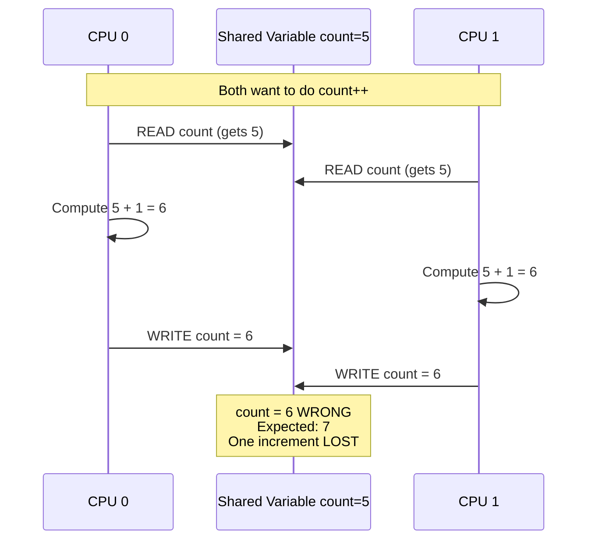
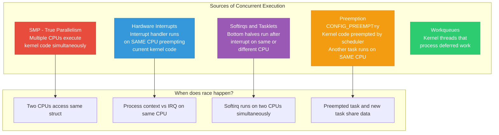
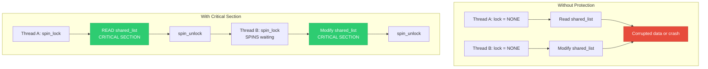
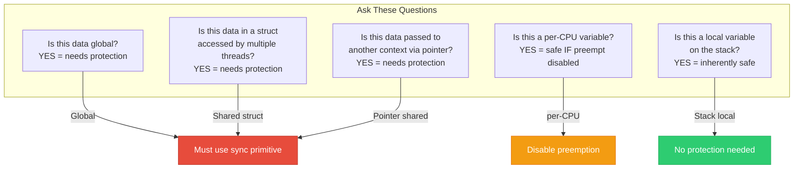
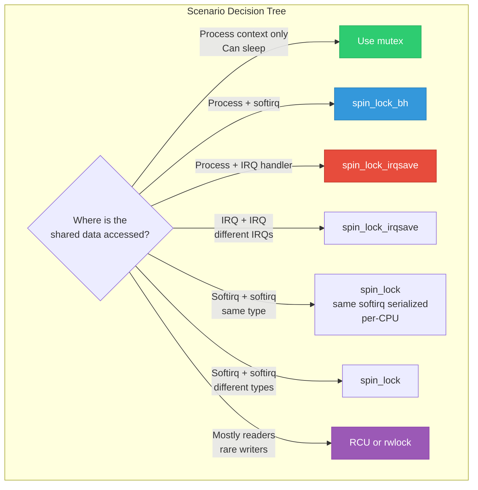

# 01 — Race Conditions and Critical Sections

> **Scope**: What races are, why they happen in the kernel, how critical sections protect shared data, and every source of concurrency in Linux.

---

## 1. What is a Race Condition?

A race condition occurs when two or more execution contexts access **shared data concurrently** and at least one of them **writes**, producing results that depend on the unpredictable order of execution.



---

## 2. Sources of Concurrency in the Linux Kernel



---

## 3. What is a Critical Section?

A critical section is a region of code that accesses shared resources and must **not** be executed by more than one thread of execution at a time.



---

## 4. Classic Race Condition Examples in the Kernel

### 4.1 Linked List Race

```c
/* BROKEN: No locking around list manipulation */
struct my_device {
    struct list_head list;
    int data;
};

/* CPU 0: add to list */
void add_device(struct my_device *dev)
{
    list_add(&dev->list, &device_list);  /* NOT SAFE */
}

/* CPU 1: iterate and read */
void scan_devices(void)
{
    struct my_device *dev;
    list_for_each_entry(dev, &device_list, list) {
        process(dev->data);  /* may read half-updated pointers */
    }
}

/* FIXED: Protect with spinlock */
static DEFINE_SPINLOCK(dev_lock);

void add_device_safe(struct my_device *dev)
{
    spin_lock(&dev_lock);
    list_add(&dev->list, &device_list);
    spin_unlock(&dev_lock);
}

void scan_devices_safe(void)
{
    struct my_device *dev;
    spin_lock(&dev_lock);
    list_for_each_entry(dev, &device_list, list) {
        process(dev->data);
    }
    spin_unlock(&dev_lock);
}
```

### 4.2 Check-Then-Act Race (TOCTOU)

```c
/* BROKEN: Time-of-check-to-time-of-use race */
if (resource_available) {       /* CHECK */
    /* Another CPU sets resource_available = false HERE */
    use_resource();              /* ACT — resource no longer available! */
    resource_available = false;
}

/* FIXED: Atomic check-and-act */
spin_lock(&res_lock);
if (resource_available) {
    resource_available = false;  /* check + act is atomic now */
    spin_unlock(&res_lock);
    use_resource();
} else {
    spin_unlock(&res_lock);
}
```

---

## 5. Identifying Shared Data



---

## 6. Critical Section Rules in the Linux Kernel

| Rule | Reason |
|------|--------|
| Keep critical sections SHORT | Reduces contention, latency |
| Never sleep while holding a spinlock | Spinlock disables preemption, sleeping = deadlock |
| Always use the SAME lock for the same data | Two different locks = no protection |
| Lock ordering must be consistent | Prevents deadlock: always lock A before B |
| Minimize nested locks | Each nesting level increases deadlock risk |
| Use the lightest primitive that works | atomic > spinlock > mutex > semaphore |

---

## 7. Concurrency Scenarios and Required Protection



---

## 8. Deep Q&A

### Q1: What is a data race vs a race condition?

**A:** A **data race** is a specific type: two threads access the same memory location concurrently, at least one writes, and there is no synchronization. A **race condition** is the broader concept — the behavior depends on timing. You can have a race condition without a data race (e.g., TOCTOU with atomics) and a data race that is benign (e.g., statistics counter).

### Q2: Can a race condition occur on a single-CPU system?

**A:** Yes, if `CONFIG_PREEMPT=y`. A kernel task reading shared data can be preempted, another task scheduled on the SAME CPU modifies the data, then the first task resumes with stale values. Also, interrupt handlers on the same CPU create races.

### Q3: Why is `i++` not safe in the kernel?

**A:** On most architectures, `i++` compiles to: `load i → increment → store i` (three separate operations). Between load and store, another CPU or interrupt can modify `i`. Use `atomic_inc()` or protect with a lock.

### Q4: What is the difference between mutual exclusion and serialization?

**A:** Mutual exclusion means only ONE thread in the critical section at a time. Serialization means enforcing a specific ORDER of operations. Locks provide mutual exclusion. Memory barriers and completion mechanisms provide serialization. Both are forms of synchronization.

---

[Next: 02 — Atomic Operations →](02_Atomic_Operations.md)
