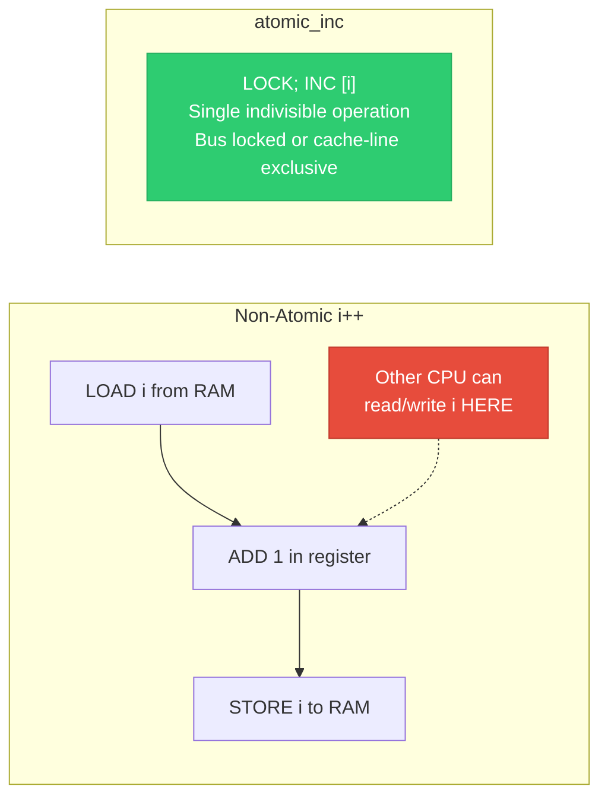
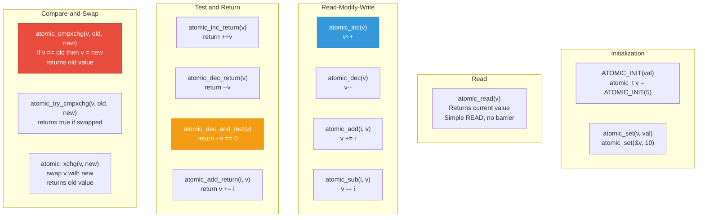
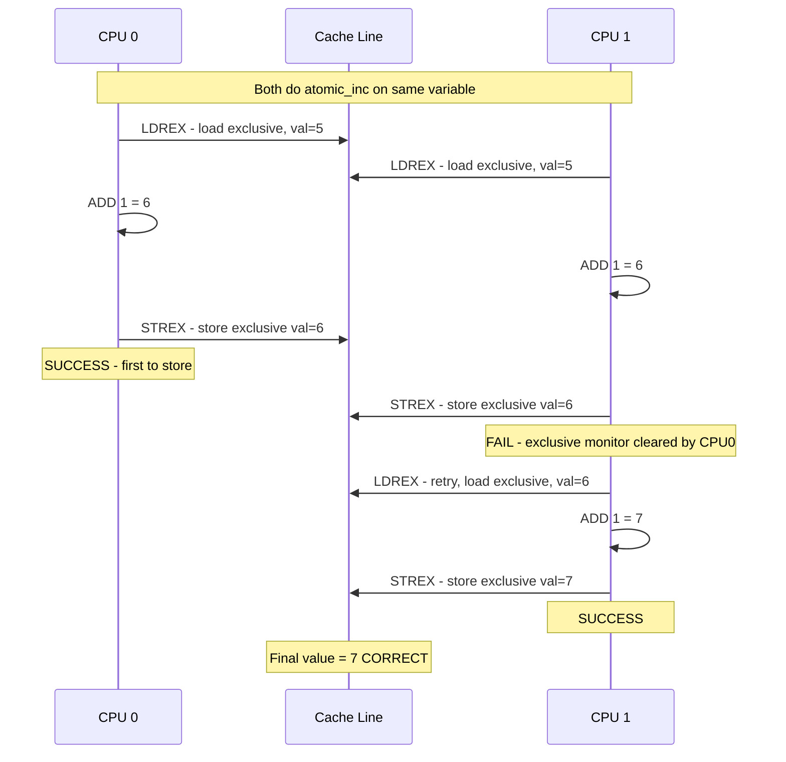
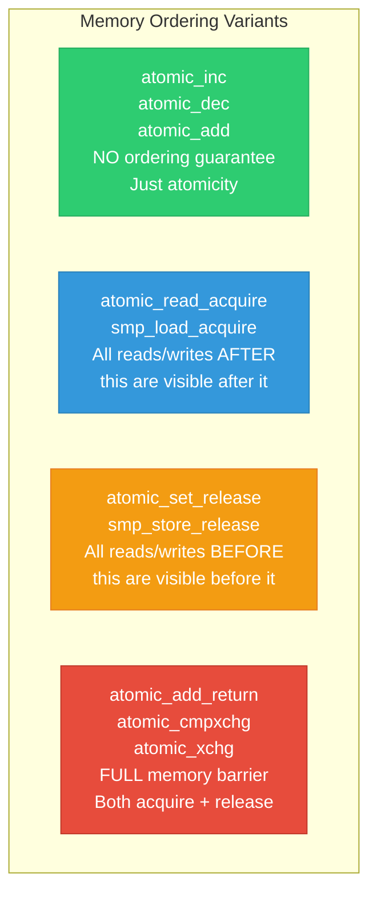
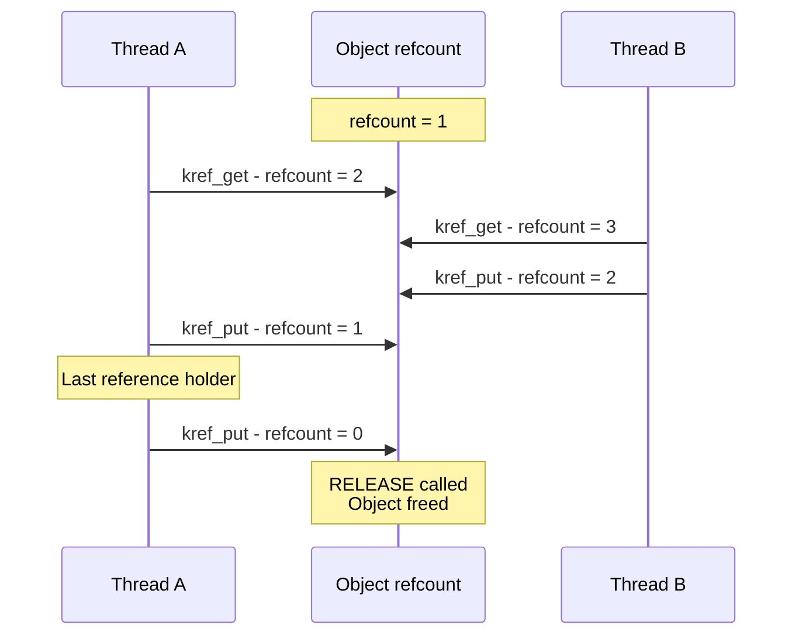
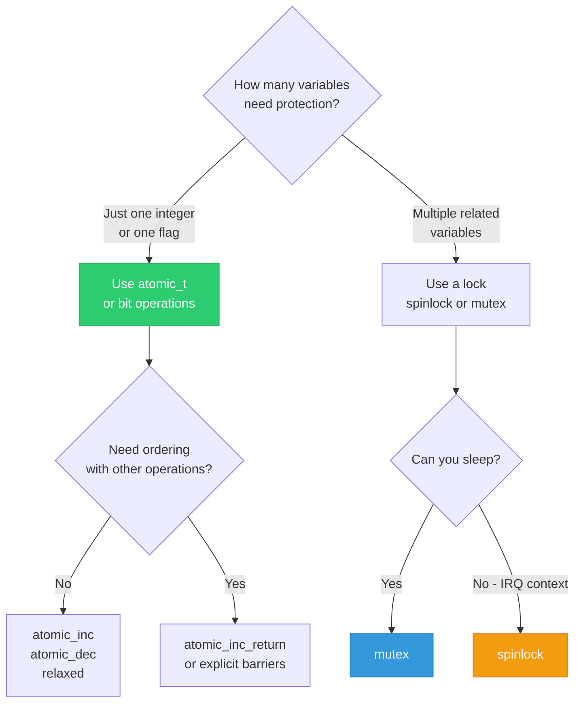

# 02 — Atomic Operations in the Linux Kernel

> **Scope**: atomic_t, atomic64_t, bitwise atomics, atomic operations on ARM and x86, memory ordering with atomics, and when to use them vs locks.

---

## 1. What are Atomic Operations?

An atomic operation is **indivisible** — it completes entirely or not at all. No other CPU or interrupt can observe an intermediate state.



---

## 2. Kernel Atomic Types

```c
/* include/linux/types.h */
typedef struct {
    int counter;
} atomic_t;

typedef struct {
    s64 counter;
} atomic64_t;

/* The struct wrapping prevents accidental direct access.
 * Forces use of atomic_*() API. */
```

---

## 3. Core Atomic API



---

## 4. How Atomics Work on x86 vs ARM

### 4.1 x86: LOCK Prefix

```c
/* x86 atomic_inc implementation (simplified): */
static inline void atomic_inc(atomic_t *v)
{
    asm volatile("lock; incl %0"
                 : "+m" (v->counter));
}

/*
 * The LOCK prefix:
 * 1. Acquires exclusive ownership of the cache line (MESI E/M state)
 * 2. Prevents other CPUs from accessing that cache line
 * 3. Performs the increment
 * 4. Releases cache line
 * 
 * On modern CPUs: NOT a bus lock (slow).
 * Instead: cache-line lock via MESI protocol.
 * Cost: ~10-20 cycles (vs ~1 cycle for non-atomic)
 */
```

### 4.2 ARM: LDREX/STREX (LL/SC)

```c
/* ARM atomic_inc implementation (simplified ARMv7): */
static inline void atomic_inc(atomic_t *v)
{
    unsigned long tmp;
    int result;

    asm volatile(
        "1: ldrex   %0, [%3]       \n"  /* Load-Exclusive: read v->counter */
        "   add     %0, %0, #1     \n"  /* Increment */
        "   strex   %1, %0, [%3]   \n"  /* Store-Exclusive: try write back */
        "   teq     %1, #0         \n"  /* Did STREX succeed? */
        "   bne     1b             \n"  /* No? Retry from LDREX */
        : "=&r" (result), "=&r" (tmp), "+Qo" (v->counter)
        : "r" (&v->counter)
        : "cc");
}

/*
 * LL/SC (Load-Link / Store-Conditional):
 * - LDREX marks the cache line as "exclusive monitor"
 * - STREX succeeds ONLY if no other CPU touched that line
 * - If another CPU wrote to it, STREX fails → retry
 * - No bus lock needed! More scalable than x86 LOCK.
 * 
 * ARMv8.1+: Uses LSE (Large System Extensions)
 *   LDADD, STADD — single-instruction atomics
 *   Much faster than LL/SC loop
 */
```



---

## 5. Bitwise Atomic Operations

```c
/* Operate on individual bits atomically */

/* Set bit N in the word pointed to by addr */
void set_bit(int nr, volatile unsigned long *addr);

/* Clear bit N */
void clear_bit(int nr, volatile unsigned long *addr);

/* Toggle bit N */
void change_bit(int nr, volatile unsigned long *addr);

/* Test and set: returns OLD value of bit N */
int test_and_set_bit(int nr, volatile unsigned long *addr);

/* Test and clear */
int test_and_clear_bit(int nr, volatile unsigned long *addr);

/* Non-atomic versions (for use under lock): */
void __set_bit(int nr, volatile unsigned long *addr);
void __clear_bit(int nr, volatile unsigned long *addr);

/* Usage example: device status flags */
#define DEV_RUNNING    0
#define DEV_SUSPENDED  1
#define DEV_ERROR      2

unsigned long dev_flags;

/* ISR sets error flag atomically */
set_bit(DEV_ERROR, &dev_flags);

/* Process context checks and clears */
if (test_and_clear_bit(DEV_ERROR, &dev_flags)) {
    handle_error();
}
```

---

## 6. Memory Ordering with Atomics



```c
/* Relaxed: just atomic, no ordering */
atomic_inc(&counter);  /* other CPUs may see this out of order */

/* With ordering: */
atomic_inc_return(&counter);  /* implies full barrier */

/* Explicit barrier variants: */
smp_store_release(&flag, 1);   /* everything before is visible first */
val = smp_load_acquire(&flag); /* everything after sees the store */
```

---

## 7. Reference Counting with Atomics

```c
/* The most common use of atomics: reference counting */
struct kref {
    refcount_t refcount;  /* wraps atomic_t with overflow protection */
};

/* refcount_t is like atomic_t BUT:
 * - WARNS on increment from 0 (use-after-free)
 * - SATURATES instead of wrapping on overflow
 * - Detects decrement below 0
 */

struct my_object {
    struct kref ref;
    char *name;
};

struct my_object *obj_get(struct my_object *obj)
{
    kref_get(&obj->ref);  /* atomic_inc_not_zero internally */
    return obj;
}

void obj_release(struct kref *kref)
{
    struct my_object *obj = container_of(kref, struct my_object, ref);
    kfree(obj->name);
    kfree(obj);
}

void obj_put(struct my_object *obj)
{
    kref_put(&obj->ref, obj_release);
    /* atomic_dec_and_test: if refcount hits 0, call obj_release */
}
```



---

## 8. When to Use Atomics vs Locks

| Scenario | Use | Why |
|----------|-----|-----|
| Simple counter (stats) | `atomic_t` | No relationship with other data |
| Reference count | `refcount_t` | Overflow protection built in |
| Single flag check | `atomic_t` or bit ops | Lightweight, no contention |
| Counter + linked list update | Spinlock/mutex | Multiple operations must be atomic together |
| Read-modify of a struct | Lock | Cannot atomically update multiple fields |
| Increment from interrupt + process | `atomic_t` | No need to disable IRQ for single op |



---

## 9. Deep Q&A

### Q1: Why does Linux have both atomic_t and refcount_t?

**A:** `atomic_t` has no overflow/underflow protection — incrementing from `INT_MAX` wraps to negative, decrementing from 0 wraps to `INT_MAX`. Attackers can exploit this. `refcount_t` saturates at `REFCOUNT_SATURATED` instead of wrapping, and warns on inc-from-zero. Since 4.11, all reference counting should use `refcount_t`.

### Q2: Is atomic_read() truly atomic?

**A:** On most architectures, a naturally-aligned word-sized read is already atomic at the hardware level. `atomic_read()` is essentially `READ_ONCE(v->counter)` — it prevents compiler optimizations (reordering, caching in register) but doesn't use any special instruction. It does NOT imply a memory barrier.

### Q3: Can atomic operations starve on ARM with LL/SC?

**A:** Theoretically yes — if other CPUs constantly invalidate the cache line between LDREX and STREX, the loop retries indefinitely. In practice, ARM's exclusive monitor has fairness mechanisms, and the window is tiny. ARMv8.1 LSE instructions (LDADD, STADD) eliminate this entirely.

### Q4: What is the cost of an atomic operation?

**A:** On x86 with LOCK prefix: ~10-20 cycles if cache line is local, ~40-100 cycles if cache line must be fetched from another CPU's cache (MESI invalidation). Compare: simple register increment = 1 cycle. Atomics are cheap vs locks but still 10-100x costlier than non-atomic ops.

---

[← Previous: 01 — Race Conditions](01_Race_Conditions_and_Critical_Sections.md) | [Next: 03 — Spinlocks →](03_Spinlocks.md)
