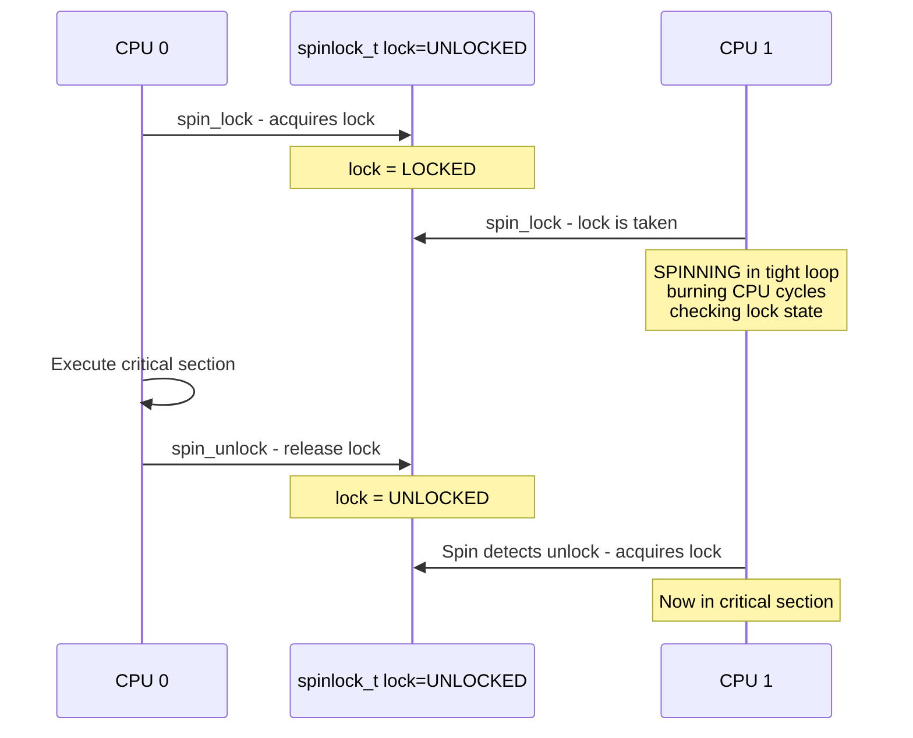
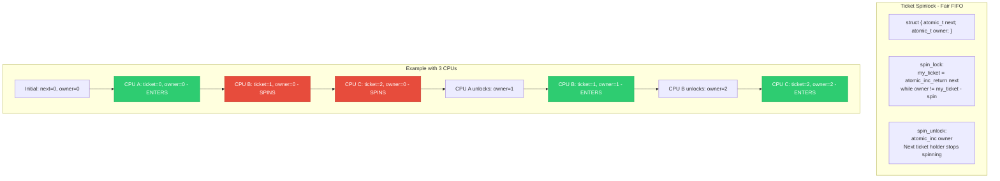
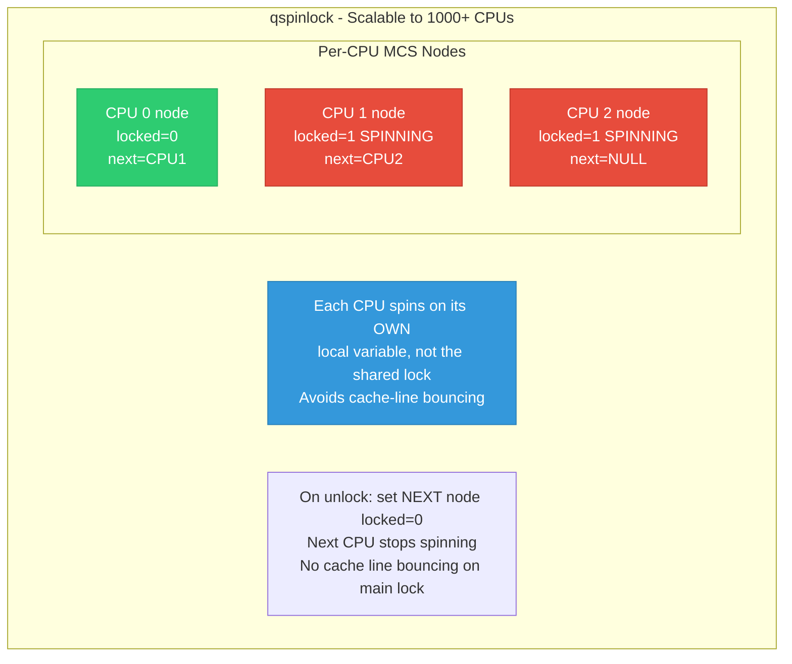
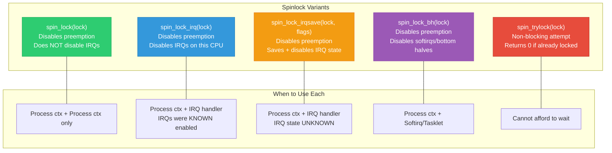
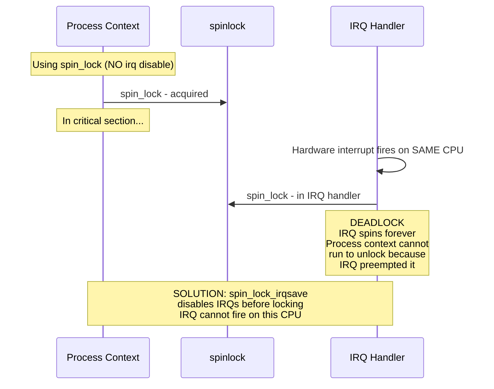

# 03 — Spinlocks in the Linux Kernel

> **Scope**: spinlock_t internals, ticket spinlocks, MCS/qspinlock, spin_lock vs spin_lock_irq vs spin_lock_irqsave, spinlock on UP vs SMP, and when to use which variant.

---

## 1. What is a Spinlock?

A spinlock is a **busy-wait** lock — the CPU loops ("spins") checking the lock until it becomes available. It does NOT put the thread to sleep.



---

## 2. Spinlock Internals - Evolution

### 2.1 Simple Test-and-Set (obsolete)

```c
/* Naive implementation — has fairness problems */
typedef struct {
    volatile int locked;
} spinlock_t;

void spin_lock(spinlock_t *lock) {
    while (test_and_set(&lock->locked))
        cpu_relax();  /* hint to CPU: spinning */
}

void spin_unlock(spinlock_t *lock) {
    lock->locked = 0;
}

/* Problem: unfair! CPU closest to the cache line wins.
 * A CPU can starve indefinitely. */
```

### 2.2 Ticket Spinlock



### 2.3 MCS / Queued Spinlock (qspinlock) — Current Linux



```c
/* Modern Linux qspinlock (simplified concept): */
struct qspinlock {
    union {
        atomic_t val;
        struct {
            u8 locked;    /* 1 = locked */
            u8 pending;   /* 1 = someone waiting (fast path) */
            u16 tail;     /* index into per-CPU MCS node array */
        };
    };
};

/* Fast path: uncontended acquisition */
void queued_spin_lock(struct qspinlock *lock)
{
    if (atomic_try_cmpxchg_acquire(&lock->val, 0, _Q_LOCKED_VAL))
        return;  /* Got it! No contention */
    
    queued_spin_lock_slowpath(lock);  /* Contended: queue up */
}

/* Slow path: join the MCS queue, spin on local node */
void queued_spin_lock_slowpath(struct qspinlock *lock)
{
    struct mcs_spinlock *node = this_cpu_ptr(&mcs_nodes);
    node->locked = 0;
    node->next = NULL;
    
    /* Add ourselves to the tail of the queue */
    prev = xchg(&lock->tail, encode(node));
    if (prev) {
        prev->next = node;
        /* Spin on OUR node's locked field — local cache line! */
        while (READ_ONCE(node->locked))
            cpu_relax();
    }
    /* We're at the head — acquire the lock */
}
```

---

## 3. Spinlock API Variants



### Why spin_lock_irqsave is needed:



---

## 4. Spinlock on Uniprocessor (UP)

```c
/* On UP (single CPU), spinlocks compile to: */
#ifdef CONFIG_SMP
    /* Real spinlock: atomic test-and-set + spin */
    #define spin_lock(l)  __spin_lock(l)
#else
    /* UP: just disable preemption, no actual spin needed!
     * Only one CPU → no other CPU can contend.
     * Preemption is the only concurrency source. */
    #define spin_lock(l)  preempt_disable()
    #define spin_unlock(l) preempt_enable()
#endif

/* spin_lock_irqsave on UP: */
#define spin_lock_irqsave(l, f)  local_irq_save(f)
#define spin_unlock_irqrestore(l, f) local_irq_restore(f)
/* No actual lock — just save/disable IRQs */
```

---

## 5. Spinlock Rules

| Rule | Why |
|------|-----|
| NEVER sleep while holding a spinlock | Preemption is disabled, sleeping deadlocks |
| NEVER call kmalloc(GFP_KERNEL) under spinlock | GFP_KERNEL can sleep |
| NEVER call copy_from_user under spinlock | Can page fault and sleep |
| Keep critical section SHORT | Other CPUs burn cycles spinning |
| Use spin_lock_irqsave if shared with IRQ | Prevents self-deadlock on same CPU |
| Use spin_lock_bh if shared with softirq | Prevents softirq from interrupting |
| NEVER recurse (take same lock twice) | Instant deadlock |

---

## 6. Spinlock Data Structure in Linux

```c
/* arch/x86/include/asm/spinlock_types.h (simplified) */
typedef struct {
    struct qspinlock raw_lock;
#ifdef CONFIG_DEBUG_LOCK_ALLOC
    struct lockdep_map dep_map;  /* lockdep tracking */
#endif
} spinlock_t;

/* DEFINE_SPINLOCK creates a statically-initialized spinlock */
DEFINE_SPINLOCK(my_lock);

/* Dynamic initialization */
spinlock_t my_lock;
spin_lock_init(&my_lock);
```

---

## 7. Real Driver Example

```c
struct my_driver {
    spinlock_t lock;
    struct list_head cmd_queue;
    u32 hw_status;
    int irq;
};

/* Process context: submit command */
int submit_command(struct my_driver *drv, struct cmd *cmd)
{
    unsigned long flags;
    
    /* Use irqsave because IRQ handler also takes this lock */
    spin_lock_irqsave(&drv->lock, flags);
    list_add_tail(&cmd->list, &drv->cmd_queue);
    /* Poke hardware to start processing */
    writel(CMD_START, drv->mmio + CMD_REG);
    spin_unlock_irqrestore(&drv->lock, flags);
    
    return 0;
}

/* IRQ handler: process hardware completion */
irqreturn_t my_irq_handler(int irq, void *data)
{
    struct my_driver *drv = data;
    struct cmd *cmd;
    
    spin_lock(&drv->lock);  /* IRQs already disabled in IRQ context */
    drv->hw_status = readl(drv->mmio + STATUS_REG);
    if (!list_empty(&drv->cmd_queue)) {
        cmd = list_first_entry(&drv->cmd_queue, struct cmd, list);
        list_del(&cmd->list);
        complete(&cmd->done);
    }
    spin_unlock(&drv->lock);
    
    return IRQ_HANDLED;
}
```

---

## 8. Deep Q&A

### Q1: Why does spin_lock disable preemption?

**A:** If preemption were allowed: Thread A takes spinlock, gets preempted, Thread B runs on same CPU and tries the same spinlock = deadlock. Disabling preemption ensures the lock holder runs to completion on that CPU.

### Q2: What is the performance difference between ticket and qspinlock?

**A:** Ticket: all waiters spin on the SAME cache line (owner field) → massive cache-line bouncing on NUMA systems with 100+ CPUs. qspinlock: each waiter spins on its OWN per-CPU variable → local cache hits only. On 4-8 CPU systems: similar. On 64+ CPUs: qspinlock is 2-10x better.

### Q3: Can spin_trylock be used in IRQ context?

**A:** Yes. `spin_trylock()` never blocks — it either acquires the lock and returns true, or fails immediately and returns false. This makes it safe anywhere. Useful when you want best-effort in an IRQ handler:
```c
if (spin_trylock(&lock)) { process(); spin_unlock(&lock); }
```

### Q4: Why does Linux have raw_spinlock_t separate from spinlock_t?

**A:** `spinlock_t` becomes a sleeping lock under PREEMPT_RT (RT kernel patch). For code that MUST NEVER sleep (hardirq handlers, scheduler), `raw_spinlock_t` is used — it always spins, even under PREEMPT_RT. Only a few dozen raw_spinlocks exist in the kernel: scheduler runqueue, timer, printk.

### Q5: What happens if you hold two spinlocks in different order on different CPUs?

**A:** Deadlock. CPU 0: lock A then lock B. CPU 1: lock B then lock A. Both block waiting for each other. The lockdep validator catches this at runtime by tracking lock ordering.

---

[← Previous: 02 — Atomic Operations](02_Atomic_Operations.md) | [Next: 04 — Mutexes →](04_Mutexes.md)
