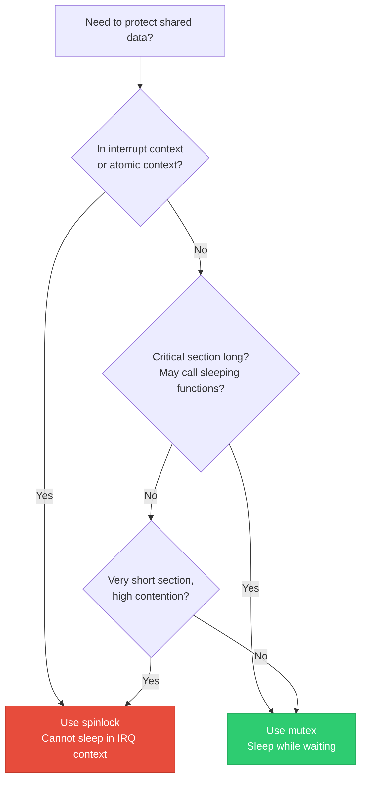
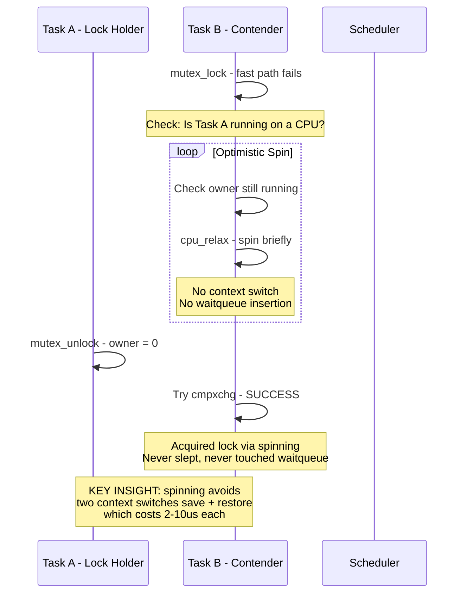
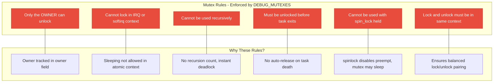

# 04 — Mutexes in the Linux Kernel

> **Scope**: struct mutex internals, adaptive spinning, wait/wake mechanism, mutex vs spinlock, mutex debugging, and real-world usage patterns.

---

## 1. What is a Mutex?

A **mutex** (mutual exclusion) is a **sleeping lock**. When a thread cannot acquire the mutex, it is put to sleep and added to a wait queue, freeing the CPU for other work.

```c
#include <linux/mutex.h>

/* Static initialization */
DEFINE_MUTEX(my_mutex);

/* Dynamic initialization */
struct mutex my_mutex;
mutex_init(&my_mutex);

/* Usage */
mutex_lock(&my_mutex);
/* ... critical section — CAN SLEEP here ... */
mutex_unlock(&my_mutex);
```

---

## 2. Mutex vs Spinlock Decision



| Feature | Spinlock | Mutex |
|---------|----------|-------|
| Wait behavior | Busy-wait (spin) | Sleep (schedule out) |
| Context | Process + IRQ/softirq | Process context ONLY |
| Can sleep while held? | NO | YES |
| Overhead (uncontended) | Very low | Low |
| Overhead (contended) | Burns CPU | Context switch cost |
| Owner tracking | No | Yes |
| Recursive locking | Deadlock | Deadlock (use re-entrant variant) |
| Best for | Very short critical sections | Longer critical sections |

---

## 3. Mutex Internal Structure

```c
struct mutex {
    atomic_long_t owner;         /* Owner task + flags */
    raw_spinlock_t wait_lock;    /* Protects wait_list */
    struct list_head wait_list;  /* Sleeping waiters */
#ifdef CONFIG_DEBUG_MUTEXES
    struct task_struct *owner_task;
    const char *name;
    struct lock_class_key *key;
#endif
};

/* owner field encodes:
 * bits [2..N] = pointer to owning task_struct
 * bit 0 = MUTEX_FLAG_WAITERS (waiters exist)
 * bit 1 = MUTEX_FLAG_HANDOFF (handoff to first waiter)
 * bit 2 = MUTEX_FLAG_PICKUP (waiter should pick up) */
```

---

## 4. Mutex Lock/Unlock Flow — Three Paths


### Adaptive Spinning Sequence:



---

## 5. Mutex Unlock Path

```c
void mutex_unlock(struct mutex *lock)
{
    /* Fast path: no waiters */
    if (atomic_long_try_cmpxchg_release(&lock->owner,
                                         current, 0))
        return;  /* Nobody waiting, just clear owner */
    
    /* Slow path: waiters exist */
    __mutex_unlock_slowpath(lock);
}

void __mutex_unlock_slowpath(struct mutex *lock)
{
    raw_spin_lock(&lock->wait_lock);
    
    if (!list_empty(&lock->wait_list)) {
        struct mutex_waiter *waiter;
        waiter = list_first_entry(&lock->wait_list,
                                  struct mutex_waiter, list);
        /* 
         * Set HANDOFF flag: tells the waiter 
         * to pick up the lock directly.
         * Prevents starvation from spinners.
         */
        wake_up_process(waiter->task);
    }
    
    raw_spin_unlock(&lock->wait_lock);
}
```

---

## 6. Mutex API Reference

```c
/* Blocking lock — can sleep */
void mutex_lock(struct mutex *lock);

/* Blocking with signal interruption */
int mutex_lock_interruptible(struct mutex *lock);
/* Returns 0 on success, -EINTR on signal */

/* Blocking with fatal signal only */
int mutex_lock_killable(struct mutex *lock);
/* Returns 0 on success, -EINTR on SIGKILL */

/* Non-blocking try */
int mutex_trylock(struct mutex *lock);
/* Returns 1 if acquired, 0 if not */

/* Unlock */
void mutex_unlock(struct mutex *lock);

/* Check if locked (for assertions, not synchronization!) */
bool mutex_is_locked(struct mutex *lock);
```

---

## 7. Mutex Rules and Constraints



---

## 8. Real-World: Device Driver Mutex Usage

```c
struct my_device {
    struct mutex config_lock;
    struct i2c_client *client;
    u8 config_regs[16];
};

int my_dev_read_config(struct my_device *dev, u8 reg, u8 *val)
{
    int ret;
    
    mutex_lock(&dev->config_lock);
    
    /* I2C transaction can sleep! Perfect for mutex. */
    ret = i2c_smbus_read_byte_data(dev->client, reg);
    if (ret < 0)
        goto out;
    
    *val = ret;
    dev->config_regs[reg] = ret;
    ret = 0;
    
out:
    mutex_unlock(&dev->config_lock);
    return ret;
}

/* Userspace access with interruptible variant */
ssize_t my_dev_write(struct file *file, const char __user *buf,
                     size_t count, loff_t *ppos)
{
    struct my_device *dev = file->private_data;
    int ret;
    
    /* Interruptible: user can Ctrl+C */
    ret = mutex_lock_interruptible(&dev->config_lock);
    if (ret)
        return -ERESTARTSYS;
    
    /* copy_from_user can sleep — fine under mutex */
    if (copy_from_user(dev->config_regs, buf, count)) {
        ret = -EFAULT;
        goto out;
    }
    
    ret = count;
out:
    mutex_unlock(&dev->config_lock);
    return ret;
}
```

---

## 9. Deep Q&A

### Q1: What is adaptive spinning and why does it matter?

**A:** When a mutex is contended, instead of immediately sleeping, the kernel checks if the owner is currently running on another CPU. If yes, it spins briefly (without disabling preemption, so it can be preempted itself). The rationale: if the owner is running, it will likely release the lock very soon, and spinning avoids two expensive context switches (sleep + wake). This was a major improvement — workloads with short critical sections saw 30-50% throughput gains.

### Q2: Why can't you use mutex in interrupt context?

**A:** `mutex_lock()` may call `schedule()` to sleep. Sleeping in interrupt context is forbidden because:
1. There's no `task_struct` to put to sleep (IRQ is not a schedulable entity)
2. Other interrupts might be blocked
3. The scheduler assumes process context
Using mutex in IRQ context triggers a BUG() with `might_sleep()` debugging.

### Q3: Explain the HANDOFF mechanism.

**A:** Without handoff, optimistic spinners can starve sleeping waiters. A spinner arriving just as the lock is released can grab it before the sleeping waiter is even woken up. The HANDOFF flag tells the unlock path: "Give the lock directly to the first sleeping waiter, don't let spinners steal it." This ensures fairness — a sleeping waiter gets priority after waiting long enough.

### Q4: When should you use mutex_lock_interruptible vs mutex_lock?

**A:** Use `mutex_lock_interruptible()` in system call paths where the user might Ctrl+C (send a signal). It returns -EINTR on signal, and you return -ERESTARTSYS to userspace. Use plain `mutex_lock()` in kernel-internal paths where you must complete regardless of signals. Use `mutex_lock_killable()` for operations that should only abort on fatal signals (SIGKILL).

---

[← Previous: 03 — Spinlocks](03_Spinlocks.md) | [Next: 05 — Semaphores →](05_Semaphores.md)
