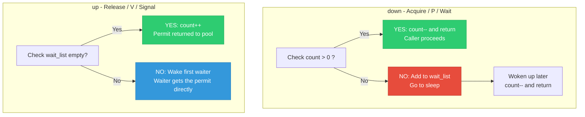
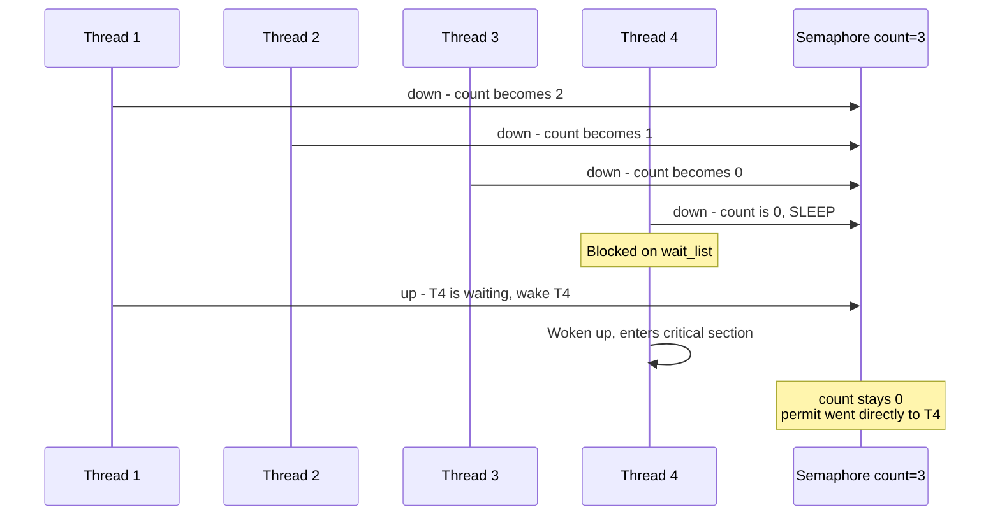
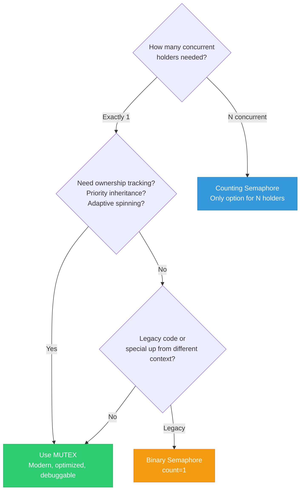
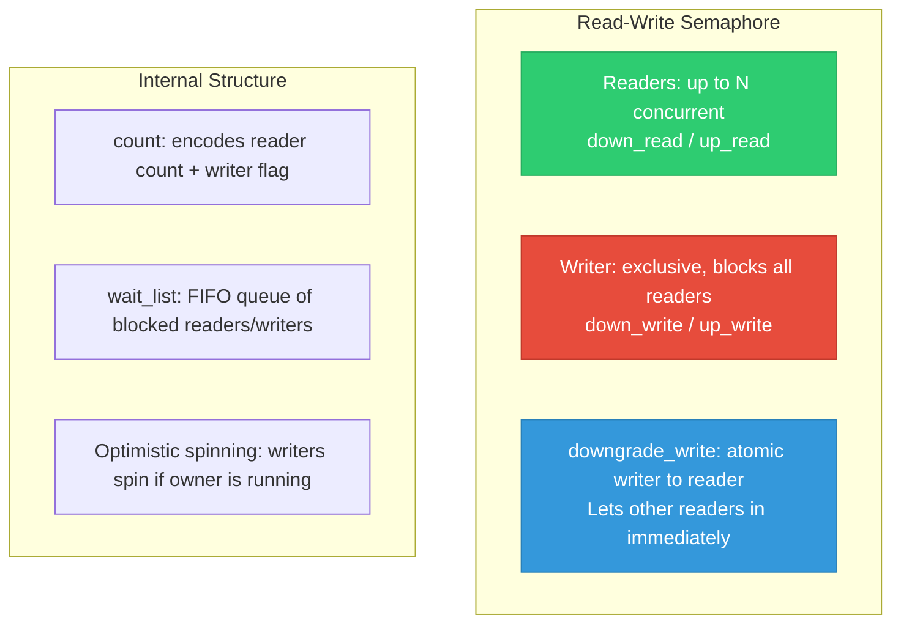

# 05 — Semaphores in the Linux Kernel

> **Scope**: Counting semaphores, binary semaphores, struct semaphore internals, up/down operations, semaphore vs mutex, and when to actually use semaphores in modern Linux.

---

## 1. What is a Semaphore?

A **semaphore** is a sleeping synchronization primitive with a **count**. It allows up to N concurrent holders (counting semaphore) or exactly 1 (binary semaphore).

```c
#include <linux/semaphore.h>

struct semaphore {
    raw_spinlock_t lock;       /* Protects count and wait_list */
    unsigned int count;        /* Available permits */
    struct list_head wait_list; /* Sleeping waiters */
};

/* Initialize with count N */
DEFINE_SEMAPHORE(name, n);     /* Static: N permits (kernel 6.x+) */

struct semaphore sem;
sema_init(&sem, 5);            /* Dynamic: 5 permits */
```

---

## 2. Semaphore Operations



---

## 3. Counting Semaphore Example



---

## 4. Semaphore API

```c
/* Blocking acquire — can sleep, uninterruptible */
void down(struct semaphore *sem);

/* Interruptible — returns -EINTR on signal */
int down_interruptible(struct semaphore *sem);

/* Killable — returns -EINTR on fatal signal */
int down_killable(struct semaphore *sem);

/* Non-blocking try — returns 0 on success, 1 on failure */
int down_trylock(struct semaphore *sem);

/* Timeout — returns -ETIME on timeout */
int down_timeout(struct semaphore *sem, long timeout);

/* Release — always succeeds, never sleeps */
void up(struct semaphore *sem);
```

---

## 5. Semaphore vs Mutex



| Feature | Mutex | Semaphore |
|---------|-------|-----------|
| Count | Always 1 | Any N |
| Owner tracking | YES | NO |
| Who can release? | Only owner | Anyone |
| Adaptive spinning | YES | NO |
| Priority inheritance | YES (RT) | NO |
| Lockdep support | Full | Limited |
| Modern recommendation | Preferred | Only when N>1 or non-owner unlock needed |
| Performance | Optimized fast path | Always slow path |

---

## 6. Internal Implementation

```c
/* kernel/locking/semaphore.c (simplified) */

void down(struct semaphore *sem)
{
    unsigned long flags;
    
    raw_spin_lock_irqsave(&sem->lock, flags);
    if (likely(sem->count > 0)) {
        sem->count--;  /* Fast path: permit available */
    } else {
        __down(sem);   /* Slow path: sleep */
    }
    raw_spin_unlock_irqrestore(&sem->lock, flags);
}

static void __down(struct semaphore *sem)
{
    struct semaphore_waiter waiter;
    
    list_add_tail(&waiter.list, &sem->wait_list);
    waiter.task = current;
    waiter.up = false;
    
    for (;;) {
        set_current_state(TASK_UNINTERRUPTIBLE);
        raw_spin_unlock_irq(&sem->lock);
        
        schedule();  /* Sleep until woken */
        
        raw_spin_lock_irq(&sem->lock);
        if (waiter.up)  /* up() set this for us */
            return;
    }
}

void up(struct semaphore *sem)
{
    unsigned long flags;
    
    raw_spin_lock_irqsave(&sem->lock, flags);
    if (likely(list_empty(&sem->wait_list))) {
        sem->count++;  /* No waiters: return permit to pool */
    } else {
        __up(sem);     /* Wake first waiter */
    }
    raw_spin_unlock_irqrestore(&sem->lock, flags);
}

static void __up(struct semaphore *sem)
{
    struct semaphore_waiter *waiter;
    
    waiter = list_first_entry(&sem->wait_list,
                              struct semaphore_waiter, list);
    list_del(&waiter->list);
    waiter->up = true;
    wake_up_process(waiter->task);
}
```

---

## 7. Real-World: Resource Pool with Counting Semaphore

```c
#define MAX_DMA_CHANNELS 4

struct dma_pool {
    struct semaphore available;  /* count = MAX_DMA_CHANNELS */
    spinlock_t lock;
    unsigned long channel_map;  /* bitmap of free channels */
};

void dma_pool_init(struct dma_pool *pool)
{
    sema_init(&pool->available, MAX_DMA_CHANNELS);
    spin_lock_init(&pool->lock);
    pool->channel_map = GENMASK(MAX_DMA_CHANNELS - 1, 0);
}

int dma_alloc_channel(struct dma_pool *pool)
{
    int ch;
    
    /* Block until a channel is available (count > 0) */
    if (down_interruptible(&pool->available))
        return -ERESTARTSYS;
    
    spin_lock(&pool->lock);
    ch = __ffs(pool->channel_map);  /* Find first set bit */
    clear_bit(ch, &pool->channel_map);
    spin_unlock(&pool->lock);
    
    return ch;
}

void dma_free_channel(struct dma_pool *pool, int ch)
{
    spin_lock(&pool->lock);
    set_bit(ch, &pool->channel_map);
    spin_unlock(&pool->lock);
    
    up(&pool->available);  /* Wake one waiter if any */
}
```

---

## 8. Read-Write Semaphores

```c
#include <linux/rwsem.h>

struct rw_semaphore rw_sem;
init_rwsem(&rw_sem);

/* Multiple readers concurrently */
down_read(&rw_sem);
/* ... read shared data ... */
up_read(&rw_sem);

/* Exclusive writer */
down_write(&rw_sem);
/* ... modify shared data ... */
up_write(&rw_sem);

/* Downgrade: writer becomes reader without releasing */
downgrade_write(&rw_sem);
/* Now holding as reader — other readers can enter */
up_read(&rw_sem);
```



---

## 9. Deep Q&A

### Q1: Why are semaphores mostly deprecated in modern Linux?

**A:** Mutexes are superior for binary locking because they have:
- Owner tracking (prevents accidental unlock by wrong thread)
- Adaptive spinning (avoids unnecessary sleeps)
- Priority inheritance (under PREEMPT_RT)
- Better lockdep integration
The kernel coding style guide says: "Please use mutexes instead of semaphores for mutual exclusion." Semaphores remain useful ONLY when you need count > 1 or non-owner release.

### Q2: Can `up()` be called from interrupt context?

**A:** Yes! `up()` never sleeps — it just increments the count or wakes a waiter. This is one reason semaphores still exist: you can `down()` in process context and `up()` from an IRQ handler. Mutexes cannot do this because only the owner can unlock.

### Q3: What is the difference between binary semaphore and completion?

**A:** Both can signal one-shot events, but completions are purpose-built for it:
- Completion handles multiple completers and waiters correctly
- Completion has `complete_all()` for broadcast
- Completion does not "leak" — calling `up()` before `down()` on a semaphore increments the count, which may not be intended
- Use completions for "wait until done" patterns.

### Q4: Explain a deadlock scenario with semaphores that cannot happen with mutexes.

**A:** Thread A does `down(&sem)`, then Thread B accidentally does `up(&sem)` thinking it holds it. Now count is back to 1 and a third thread enters — two threads are in the critical section simultaneously. This CANNOT happen with a mutex because `mutex_unlock()` checks the owner and BUG()s if the wrong thread unlocks.

---

[← Previous: 04 — Mutexes](04_Mutexes.md) | [Next: 06 — RWLocks and SeqLocks →](06_RWLocks_and_SeqLocks.md)
