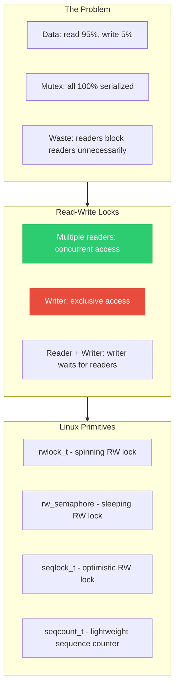
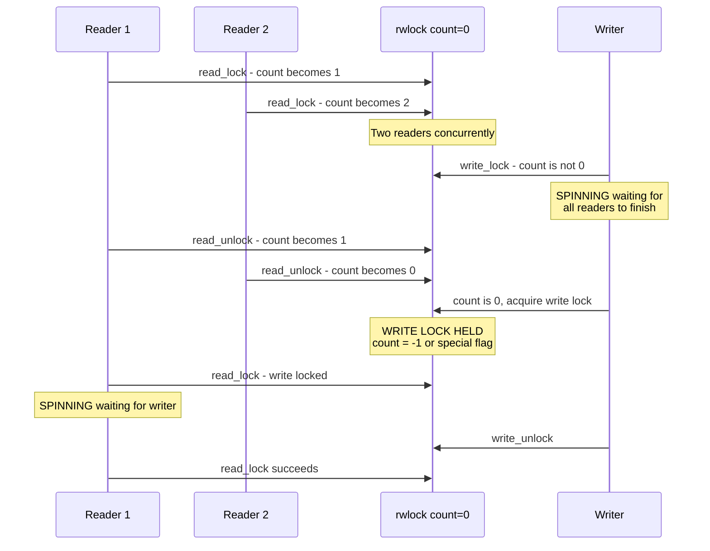
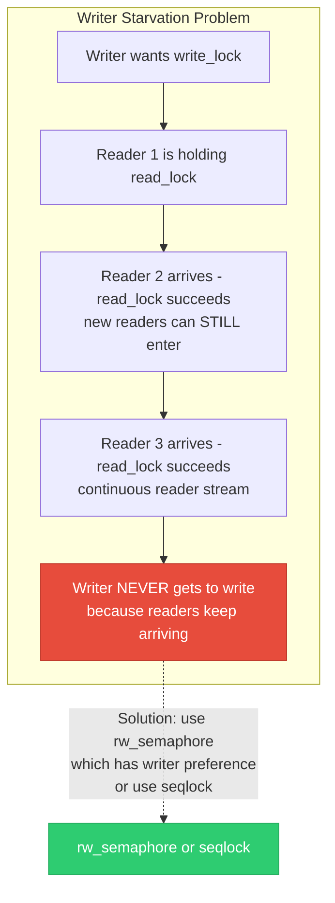
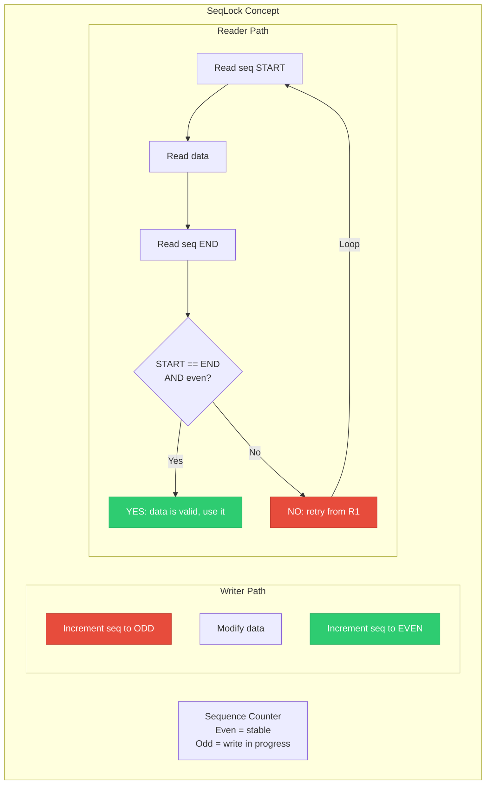
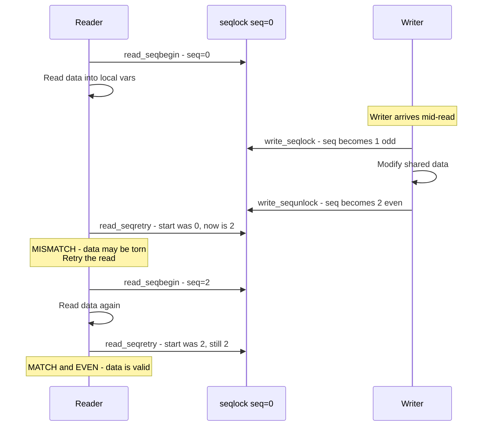
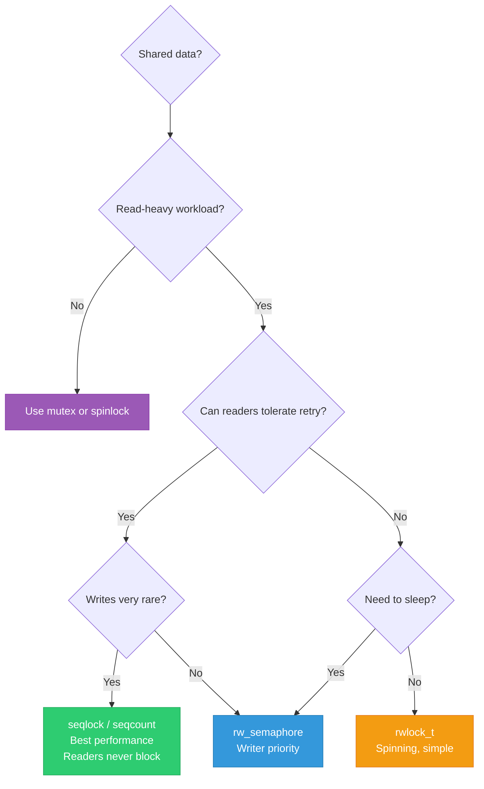

# 06 — Read-Write Locks and SeqLocks

> **Scope**: rwlock_t, rwlock vs rwsem, seqlock, seqcount, reader-writer fairness, writer starvation, and choosing the right read-write primitive.

---

## 1. Read-Write Problem Overview

Many data structures are read far more often than written. A single mutex serializes all access — even readers blocking other readers. Read-write locks solve this.



---

## 2. rwlock_t — Spinning Read-Write Lock

```c
#include <linux/rwlock.h>

rwlock_t my_rwlock;
rwlock_init(&my_rwlock);

/* OR static initialization */
DEFINE_RWLOCK(my_rwlock);

/* Reader (shared) — multiple concurrent */
read_lock(&my_rwlock);
/* ... read shared data ... */
read_unlock(&my_rwlock);

/* Writer (exclusive) — blocks all readers and writers */
write_lock(&my_rwlock);
/* ... modify shared data ... */
write_unlock(&my_rwlock);
```

### Variants:

```c
/* With IRQ save */
read_lock_irqsave(&rwlock, flags);
read_unlock_irqrestore(&rwlock, flags);

write_lock_irqsave(&rwlock, flags);
write_unlock_irqrestore(&rwlock, flags);

/* With bottom-half disable */
read_lock_bh(&rwlock);
write_lock_bh(&rwlock);

/* Non-blocking try */
if (read_trylock(&rwlock)) { /* ... */ read_unlock(&rwlock); }
if (write_trylock(&rwlock)) { /* ... */ write_unlock(&rwlock); }
```

---

## 3. rwlock_t Internal Mechanism



---

## 4. rwlock_t Problems — Writer Starvation



---

## 5. SeqLock — Optimistic Reader Lock

SeqLock is designed for data that is **read very frequently** and **written very rarely**. Readers NEVER block writers. Writers NEVER block readers. Readers just retry if they read during a write.



---

## 6. SeqLock API

```c
#include <linux/seqlock.h>

/* Full seqlock (spinlock + seqcount) */
seqlock_t my_seqlock;
seqlock_init(&my_seqlock);

/* Writer: exclusive, takes a spinlock */
write_seqlock(&my_seqlock);
/* ... modify data ... */
write_sequnlock(&my_seqlock);

/* Reader: optimistic, NEVER blocks */
unsigned int seq;
do {
    seq = read_seqbegin(&my_seqlock);
    /* ... read data into local variables ... */
} while (read_seqretry(&my_seqlock, seq));
```

### Sequence Diagram:



---

## 7. seqcount_t — Lightweight Variant

```c
/* seqcount_t: sequence counter WITHOUT embedded spinlock.
 * You provide your own serialization for writers. */

seqcount_t my_seq;
seqcount_init(&my_seq);

/* Writer: serialize yourself (e.g., with existing spinlock) */
spin_lock(&my_lock);
write_seqcount_begin(&my_seq);
/* ... modify data ... */
write_seqcount_end(&my_seq);
spin_unlock(&my_lock);

/* Reader: same as seqlock */
unsigned int seq;
do {
    seq = read_seqcount_begin(&my_seq);
    /* ... read data ... */
} while (read_seqcount_retry(&my_seq, seq));
```

### Typed seqcount (Linux 5.10+):

```c
/* seqcount associated with specific lock type */
seqcount_spinlock_t my_seq;
seqcount_rwlock_t   my_seq2;
seqcount_mutex_t    my_seq3;
/* Lockdep validates you hold the correct lock when writing */
```

---

## 8. Real-World: jiffies and xtime

```c
/* The most famous seqlock in Linux: jiffies/xtime update */

/* kernel/time/timekeeping.c */
static seqcount_raw_spinlock_t tk_core_seq;

/* Writer: timer interrupt updates time (very rare) */
void timekeeping_advance(void)
{
    raw_spin_lock(&tk_core.lock);
    write_seqcount_begin(&tk_core_seq);
    
    /* Update nanosecond clock, jiffies, etc. */
    tk->tkr_mono.cycle_last = cycle_now;
    tk->xtime_sec += seconds;
    
    write_seqcount_end(&tk_core_seq);
    raw_spin_unlock(&tk_core.lock);
}

/* Reader: ktime_get() called MILLIONS of times per second */
ktime_t ktime_get(void)
{
    unsigned int seq;
    s64 secs, nsecs;
    
    do {
        seq = read_seqcount_begin(&tk_core_seq);
        secs = tk->xtime_sec;
        nsecs = timekeeping_get_ns();
    } while (read_seqcount_retry(&tk_core_seq, seq));
    
    return ktime_set(secs, nsecs);
}
/* Readers NEVER block — perfect for hot-path time queries */
```

---

## 9. Comparison Matrix



| Feature | rwlock_t | rw_semaphore | seqlock_t |
|---------|----------|--------------|-----------|
| Wait behavior | Spin | Sleep | Reader: retry, Writer: spin |
| Reader concurrency | Yes | Yes | Yes (optimistic) |
| Writer starvation risk | HIGH | Low (writer pref) | None |
| Reader starvation risk | No | Yes (writers block new readers) | No |
| Reader blocks writer? | Yes | Yes | NO |
| Writer blocks reader? | Yes | Yes | NO (reader retries) |
| Usable in IRQ? | Yes | No | Reader: Yes, Writer: depends |
| Pointers in data? | Yes | Yes | CAREFUL (may read torn pointer) |
| Best use case | Moderate R:W ratio | Long critical sections | Extreme read-heavy (jiffies) |

---

## 10. SeqLock Limitation — Pointer Data

```c
/* DANGER: seqlock with pointers */
struct data {
    char *name;    /* pointer */
    int value;
};

/* Reader reads torn pointer (half old, half new) →
 * dereferences garbage → CRASH
 * 
 * SeqLock readers re-read data, but if you USE a pointer
 * between read_seqbegin and read_seqretry, you may
 * dereference a garbage half-updated pointer.
 * 
 * RULE: seqlock data should contain ONLY scalar values
 *       (integers, timestamps, counters).
 *       For pointer-based data → use RCU instead. */
```

---

## 11. Deep Q&A

### Q1: When would you choose rwlock_t over rw_semaphore?

**A:** Use `rwlock_t` when: (1) you need RW locking in IRQ/softirq context (rwsem cannot sleep there), (2) critical section is very short and spinning is acceptable, (3) writer starvation is not a concern. Use `rw_semaphore` when: (1) critical section may sleep, (2) writer starvation must be prevented, (3) process context only.

### Q2: Why can't seqlock protect pointer-based data?

**A:** Seqlock readers read the data, then check if a write happened. If the data contains a pointer and a writer changes it mid-read, the reader gets a partially-updated pointer. It might dereference this garbage pointer BEFORE `read_seqretry()` detects the inconsistency. With scalar data, a torn read just means a wrong number — detected and retried. With a pointer, a torn read causes an immediate crash or memory corruption.

### Q3: How does rw_semaphore prevent writer starvation?

**A:** When a writer is waiting, new readers are blocked from entering. The implementation queues all waiters (readers and writers) in FIFO order. When the current readers finish, the waiting writer goes first, then subsequent queued readers can enter. This is called "writer preference" or "fair" scheduling.

### Q4: Can you convert a write lock to a read lock atomically?

**A:** Yes, with `rw_semaphore`: `downgrade_write(&rwsem)` converts a write lock to a read lock without releasing and reacquiring. This is useful when you modify data and then want to continue reading while letting other readers in. `rwlock_t` does NOT have this feature.

---

[← Previous: 05 — Semaphores](05_Semaphores.md) | [Next: 07 — RCU →](07_RCU.md)
