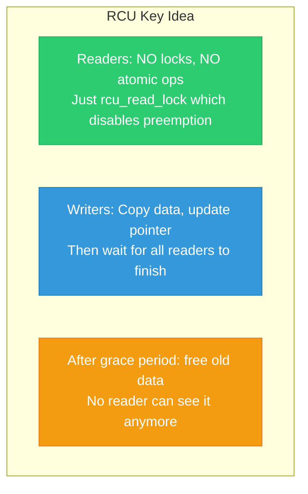
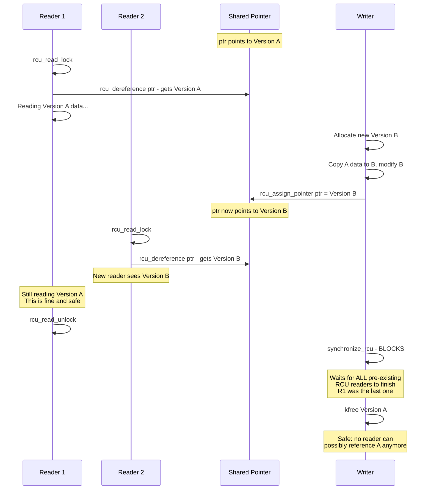
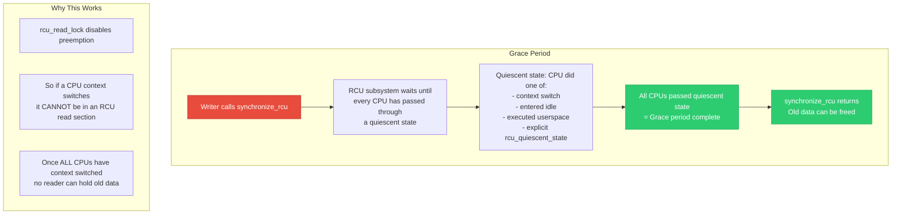
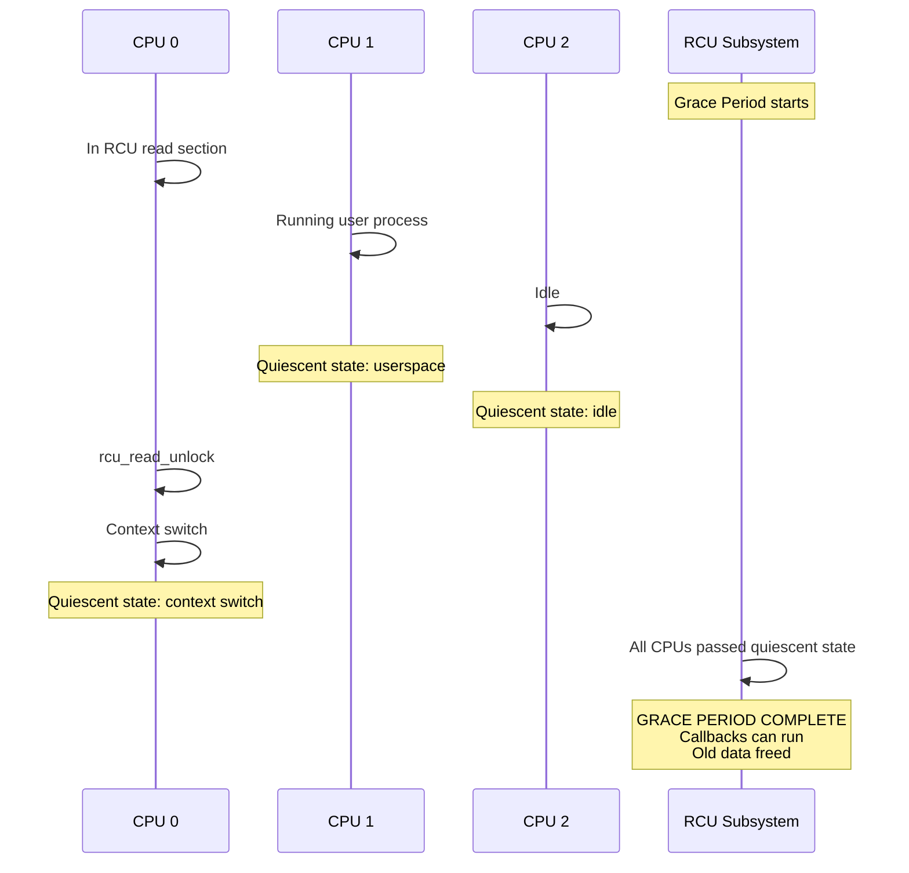
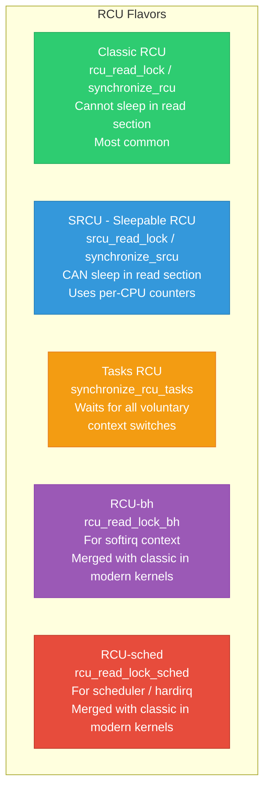
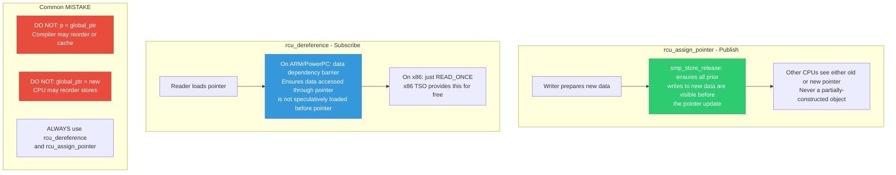

# 07 — RCU (Read-Copy-Update)

> **Scope**: RCU concepts, grace periods, rcu_read_lock/synchronize_rcu/call_rcu, RCU flavors (classic, SRCU, Tasks), RCU-protected data structures, rcu_dereference/rcu_assign_pointer, and internals.

---

## 1. RCU Core Concept

RCU allows **lock-free reads** and **deferred destruction** of shared data. Readers pay almost zero cost. Writers create a new version and wait for all pre-existing readers to finish before freeing the old version.



---

## 2. RCU Read-Copy-Update Sequence



---

## 3. RCU API

```c
#include <linux/rcupdate.h>

/* --- Reader Side --- */
rcu_read_lock();
/* Marks entry to RCU read-side critical section.
 * On non-preemptible kernel: just preempt_disable()
 * On preemptible kernel: increments per-task nesting counter
 * FAST: ~1 instruction on non-PREEMPT kernels */

p = rcu_dereference(global_ptr);
/* Read the pointer with proper memory barrier.
 * On x86: just READ_ONCE() (no barrier needed, TSO)
 * On ARM: includes smp_read_barrier_depends() / consume */

/* ... use p to read data ... */

rcu_read_unlock();
/* FAST: just preempt_enable() or decrement counter */

/* --- Writer Side --- */
new = kmalloc(sizeof(*new), GFP_KERNEL);
*new = *old;          /* Copy old data */
new->field = value;    /* Modify */

rcu_assign_pointer(global_ptr, new);
/* Publish new version with write barrier.
 * smp_store_release(&global_ptr, new) */

synchronize_rcu();
/* BLOCK until all pre-existing RCU readers complete.
 * After this returns, no CPU can see old data. */

kfree(old);
/* Safely free old version */

/* --- Async freeing (callback after grace period) --- */
call_rcu(&old->rcu_head, my_rcu_callback);
/* Non-blocking. Callback invoked after grace period. */

void my_rcu_callback(struct rcu_head *head)
{
    struct my_data *old = container_of(head, struct my_data, rcu_head);
    kfree(old);
}

/* --- Convenience: kfree after grace period --- */
kfree_rcu(old, rcu_head);
/* Equivalent to call_rcu + kfree, less boilerplate */
```

---

## 4. Grace Period Explained





---

## 5. RCU-Protected Linked List

```c
#include <linux/rculist.h>

struct my_entry {
    struct list_head list;
    struct rcu_head rcu;
    int key;
    char data[64];
};

static LIST_HEAD(my_list);
static DEFINE_SPINLOCK(list_lock); /* Protects writes */

/* Reader: lock-free traversal */
struct my_entry *find_entry(int key)
{
    struct my_entry *entry;
    
    rcu_read_lock();
    list_for_each_entry_rcu(entry, &my_list, list) {
        if (entry->key == key) {
            rcu_read_unlock();
            return entry;
        }
    }
    rcu_read_unlock();
    return NULL;
}

/* Writer: add entry */
void add_entry(struct my_entry *new)
{
    spin_lock(&list_lock);
    list_add_rcu(&new->list, &my_list);
    spin_unlock(&list_lock);
}

/* Writer: remove and free entry */
void remove_entry(struct my_entry *entry)
{
    spin_lock(&list_lock);
    list_del_rcu(&entry->list);
    spin_unlock(&list_lock);
    
    /* Wait for all readers traversing the list */
    synchronize_rcu();
    /* OR async: kfree_rcu(entry, rcu); */
    kfree(entry);
}

/* Writer: update entry (read-copy-update pattern) */
void update_entry(int key, const char *new_data)
{
    struct my_entry *old, *new;
    
    new = kmalloc(sizeof(*new), GFP_KERNEL);
    
    spin_lock(&list_lock);
    list_for_each_entry(old, &my_list, list) {
        if (old->key == key) {
            *new = *old;  /* Copy */
            strscpy(new->data, new_data, sizeof(new->data));
            list_replace_rcu(&old->list, &new->list);
            spin_unlock(&list_lock);
            kfree_rcu(old, rcu);
            return;
        }
    }
    spin_unlock(&list_lock);
    kfree(new);
}
```

---

## 6. RCU Flavors



### SRCU Example:

```c
#include <linux/srcu.h>

DEFINE_SRCU(my_srcu);

/* Reader — CAN SLEEP */
int idx = srcu_read_lock(&my_srcu);
/* ... may call sleeping functions ... */
srcu_read_unlock(&my_srcu, idx);

/* Writer */
synchronize_srcu(&my_srcu);
/* Waits for all SRCU readers of this domain */
```

---

## 7. rcu_dereference / rcu_assign_pointer Internals



---

## 8. synchronize_rcu vs call_rcu

```c
/* synchronize_rcu: BLOCKING */
void update_and_free(struct my_data *old, struct my_data *new)
{
    rcu_assign_pointer(global_ptr, new);
    synchronize_rcu();  /* Blocks for milliseconds */
    kfree(old);
    /* Simple but may cause latency spikes */
}

/* call_rcu: ASYNCHRONOUS */
void update_and_free_async(struct my_data *old, struct my_data *new)
{
    rcu_assign_pointer(global_ptr, new);
    call_rcu(&old->rcu_head, my_free_callback);
    /* Returns immediately. Callback runs after grace period. */
}

/* kfree_rcu: shorthand for call_rcu + kfree */
void update_and_free_easy(struct my_data *old, struct my_data *new)
{
    rcu_assign_pointer(global_ptr, new);
    kfree_rcu(old, rcu_head);
    /* Returns immediately. old freed after grace period. */
}
```

| | synchronize_rcu | call_rcu | kfree_rcu |
|--|-----------------|----------|-----------|
| Blocking? | YES | NO | NO |
| Latency | High (ms) | Very low | Very low |
| Memory | Immediate free | Deferred free | Deferred free |
| Callback needed? | No | Yes | No |
| Use when | Infrequent updates | Frequent updates | Just need kfree |

---

## 9. RCU in the Real Kernel

| Subsystem | RCU Usage |
|-----------|-----------|
| Networking | Route table lookup, socket hash tables, netfilter rules |
| VFS | Dentry cache (dcache) lookup, mount table |
| Scheduler | CPU hotplug, task list traversal |
| Device model | Driver list traversal, device list iteration |
| Security | SELinux policy lookup, credentials |
| Memory | VMAs in mmap_lock changes (5.19+ maple tree) |

---

## 10. Deep Q&A

### Q1: Why is RCU so much faster than rwlock for readers?

**A:** `rcu_read_lock()` on non-PREEMPT kernels is literally `preempt_disable()` — a single per-CPU counter increment, no atomic operations, no cache-line bouncing between CPUs. `rwlock_t` requires an atomic read-modify-write on a shared cache line, causing cache coherency traffic (MESI) across all CPUs. On a 64-core system, rwlock reader acquisition can be 100x slower than RCU.

### Q2: What happens if rcu_read_lock is held too long?

**A:** Grace periods cannot complete until all readers finish. Long readers delay `synchronize_rcu()` and the freeing of old data, causing memory accumulation. The kernel has `CONFIG_RCU_CPU_STALL_TIMEOUT` (default 21 seconds) — if a CPU hasn't passed a quiescent state for that long, a warning is printed. Extremely long readers can trigger OOM because callbacks pile up.

### Q3: Can you nest rcu_read_lock?

**A:** Yes, nesting is fully supported. `rcu_read_lock()` increments a counter and `rcu_read_unlock()` decrements it. The critical section ends only when the outermost unlock runs and the counter reaches zero. This is critical because helper functions may use `rcu_read_lock()` internally, and callers may also hold it.

### Q4: How does PREEMPT_RCU differ from classic RCU?

**A:** Classic RCU (non-preemptible): `rcu_read_lock()` disables preemption, so a context switch implies no RCU reader. PREEMPT_RCU (CONFIG_PREEMPT): readers CAN be preempted. The RCU subsystem tracks per-task nesting and uses a boosting mechanism to ensure grace periods complete. PREEMPT_RCU is more complex but necessary for low-latency RT kernels.

### Q5: Explain the difference between list_for_each_entry and list_for_each_entry_rcu.

**A:** `list_for_each_entry_rcu()` wraps the pointer load with `rcu_dereference()`, which inserts necessary memory barriers so the CPU reads the node data AFTER reading the pointer to the node. `list_for_each_entry()` uses plain pointer loads — safe under locks but not under RCU because of potential reordering on weakly-ordered architectures (ARM, PowerPC).

---

[← Previous: 06 — RWLocks and SeqLocks](06_RWLocks_and_SeqLocks.md) | [Next: 08 — Completions →](08_Completions.md)
