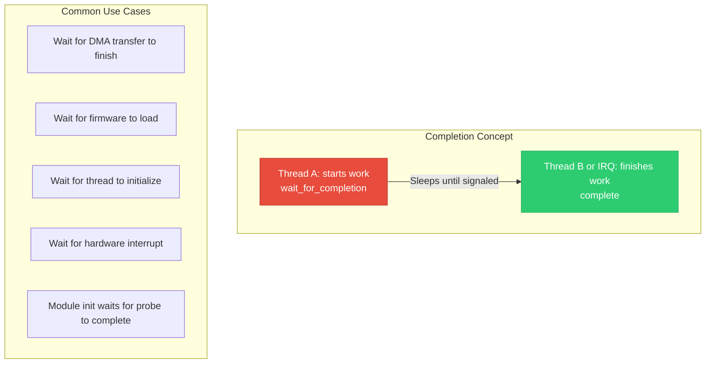
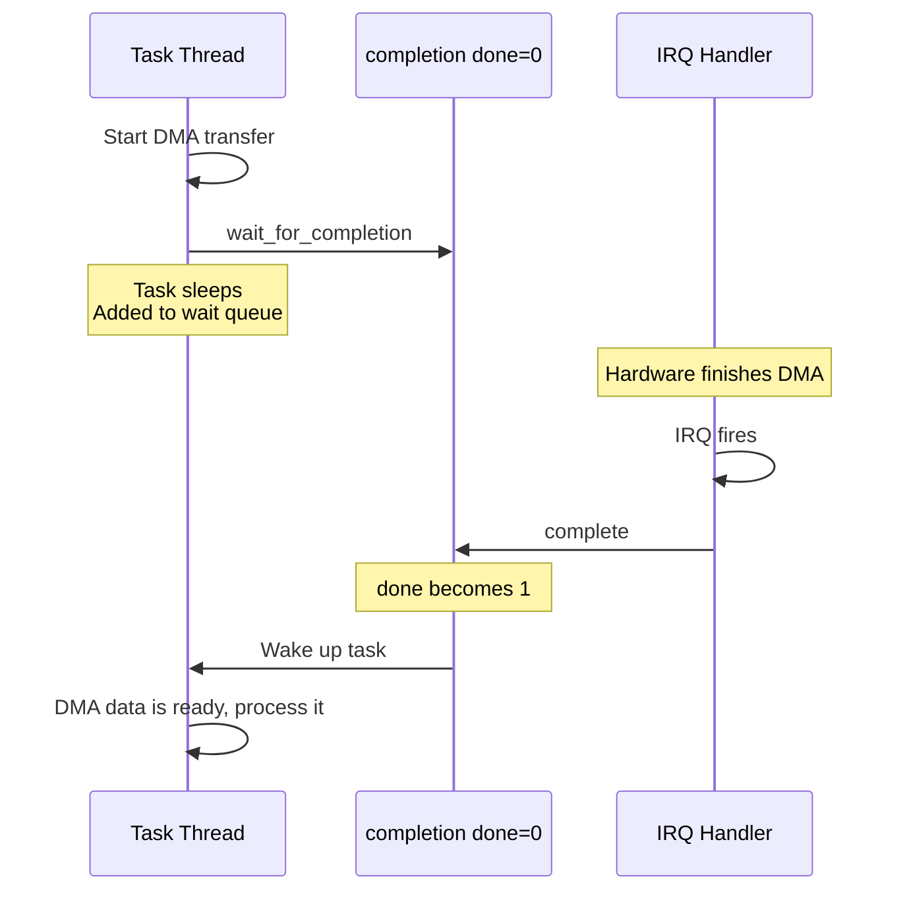
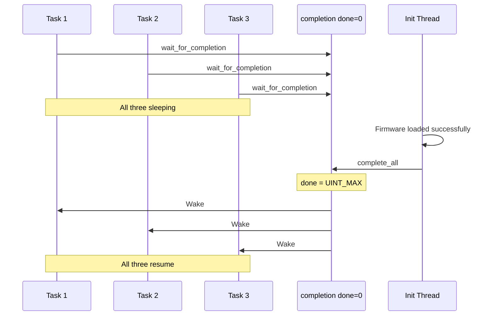
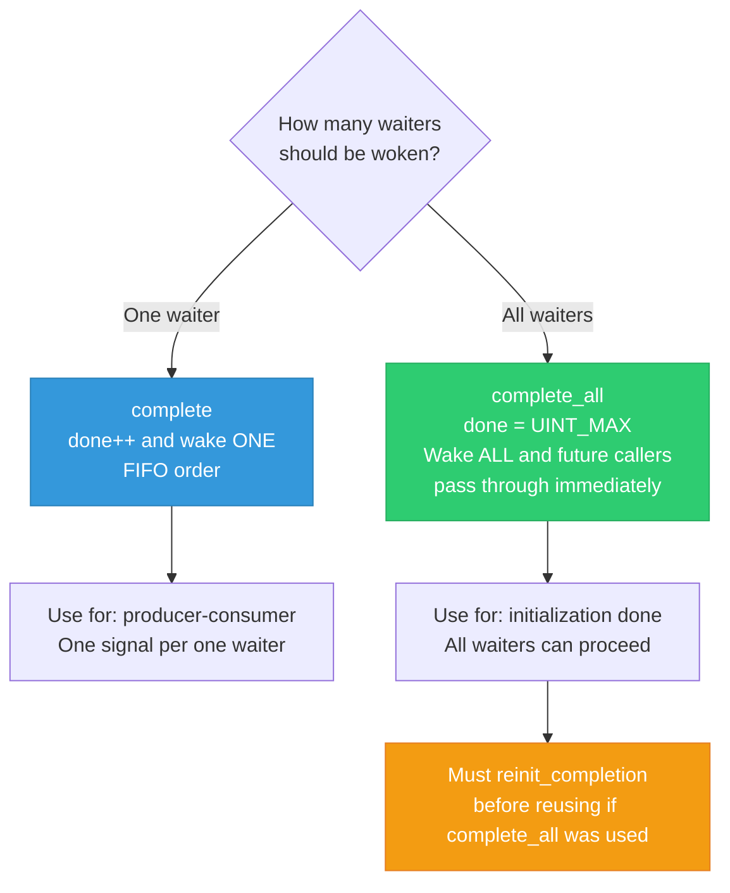

# 08 — Completions

> **Scope**: struct completion, init_completion, wait_for_completion, complete/complete_all, timeout variants, and real driver usage patterns.

---

## 1. What is a Completion?

A **completion** is a lightweight synchronization mechanism for **one-shot events**: "wait until something is done." One thread waits, another thread signals when work is finished.



---

## 2. Completion API

```c
#include <linux/completion.h>

struct completion {
    unsigned int done;         /* 0 = not done, >0 = done count */
    struct swait_queue_head wait; /* Waiters */
};

/* Initialization */
DECLARE_COMPLETION(my_comp);         /* Static */
struct completion my_comp;
init_completion(&my_comp);           /* Dynamic */
reinit_completion(&my_comp);         /* Reset for reuse */

/* Waiting — blocks until complete() is called */
void wait_for_completion(struct completion *c);

/* Waiting with timeout */
unsigned long wait_for_completion_timeout(
    struct completion *c, unsigned long timeout);
/* Returns 0 on timeout, remaining jiffies on success */

/* Interruptible (user can Ctrl+C) */
int wait_for_completion_interruptible(struct completion *c);
/* Returns -ERESTARTSYS on signal, 0 on completion */

/* Killable (only SIGKILL interrupts) */
int wait_for_completion_killable(struct completion *c);

/* Signaling */
void complete(struct completion *c);     /* Wake ONE waiter */
void complete_all(struct completion *c);  /* Wake ALL waiters */

/* Non-blocking test */
bool try_wait_for_completion(struct completion *c);
bool completion_done(struct completion *c);
```

---

## 3. Completion Flow



### complete_all Broadcast:



---

## 4. complete vs complete_all



---

## 5. Completion vs Semaphore vs Waitqueue

| Feature | Completion | Binary Semaphore | Waitqueue |
|---------|------------|------------------|-----------|
| Purpose | One-shot event signaling | Mutual exclusion / counting | General wait/wake |
| complete_all | YES — wake all waiters | NO | wake_up_all exists |
| Reuse | reinit_completion | Automatic | Automatic |
| Signal before wait | Works correctly (done>0) | Works (count>0) | Signal lost |
| API complexity | Simple (4-5 calls) | Simple | Complex (conditions) |
| IRQ safe signaling | YES (complete from IRQ) | YES (up from IRQ) | YES (wake_up from IRQ) |
| Best for | Wait-for-done patterns | Resource limiting | Complex conditions |

---

## 6. Real-World Driver Examples

### I2C Transaction with Timeout:

```c
struct my_i2c_dev {
    struct completion xfer_done;
    struct i2c_adapter adapter;
    void __iomem *regs;
    int xfer_result;
};

int my_i2c_xfer(struct i2c_adapter *adap, struct i2c_msg *msgs, int num)
{
    struct my_i2c_dev *dev = i2c_get_adapdata(adap);
    unsigned long timeout;
    
    reinit_completion(&dev->xfer_done);
    
    /* Program hardware with I2C message */
    writel(msgs[0].addr, dev->regs + I2C_ADDR_REG);
    writel(msgs[0].len, dev->regs + I2C_LEN_REG);
    writel(I2C_START, dev->regs + I2C_CTRL_REG);
    
    /* Wait for IRQ to signal completion */
    timeout = wait_for_completion_timeout(&dev->xfer_done,
                                          msecs_to_jiffies(1000));
    if (!timeout) {
        dev_err(&adap->dev, "I2C transfer timed out\n");
        return -ETIMEDOUT;
    }
    
    return dev->xfer_result;
}

irqreturn_t my_i2c_irq(int irq, void *data)
{
    struct my_i2c_dev *dev = data;
    u32 status = readl(dev->regs + I2C_STATUS_REG);
    
    if (status & I2C_DONE) {
        dev->xfer_result = (status & I2C_ERROR) ? -EIO : 0;
        complete(&dev->xfer_done);
    }
    
    return IRQ_HANDLED;
}
```

### Kernel Thread Startup Synchronization:

```c
struct my_service {
    struct completion thread_started;
    struct task_struct *thread;
    bool should_stop;
};

int start_service(struct my_service *svc)
{
    init_completion(&svc->thread_started);
    
    svc->thread = kthread_run(service_thread_fn, svc, "my_svc");
    if (IS_ERR(svc->thread))
        return PTR_ERR(svc->thread);
    
    /* Wait until the thread has initialized its state */
    wait_for_completion(&svc->thread_started);
    pr_info("Service thread is ready\n");
    
    return 0;
}

int service_thread_fn(void *data)
{
    struct my_service *svc = data;
    
    /* Initialize thread-local state */
    /* ... setup work ... */
    
    /* Signal that initialization is complete */
    complete(&svc->thread_started);
    
    while (!svc->should_stop) {
        /* ... do work ... */
        schedule();
    }
    
    return 0;
}
```

---

## 7. Internal Implementation

```c
/* kernel/sched/completion.c (simplified) */

void complete(struct completion *x)
{
    unsigned long flags;
    
    raw_spin_lock_irqsave(&x->wait.lock, flags);
    
    if (x->done != UINT_MAX)
        x->done++;
    
    swake_up_locked(&x->wait);  /* Wake one waiter */
    
    raw_spin_unlock_irqrestore(&x->wait.lock, flags);
}

void complete_all(struct completion *x)
{
    unsigned long flags;
    
    raw_spin_lock_irqsave(&x->wait.lock, flags);
    
    x->done = UINT_MAX;  /* All future waiters pass through */
    swake_up_all_locked(&x->wait);
    
    raw_spin_unlock_irqrestore(&x->wait.lock, flags);
}

void wait_for_completion(struct completion *x)
{
    unsigned long flags;
    
    raw_spin_lock_irqsave(&x->wait.lock, flags);
    
    if (!x->done) {
        DECLARE_SWAITQUEUE(wait);
        
        do {
            __prepare_to_swait(&x->wait, &wait);
            raw_spin_unlock_irqrestore(&x->wait.lock, flags);
            
            schedule();  /* Sleep */
            
            raw_spin_lock_irqsave(&x->wait.lock, flags);
        } while (!x->done);
        
        __finish_swait(&x->wait, &wait);
    }
    
    if (x->done != UINT_MAX)
        x->done--;
    
    raw_spin_unlock_irqrestore(&x->wait.lock, flags);
}
```

---

## 8. Deep Q&A

### Q1: What happens if complete() is called before wait_for_completion()?

**A:** It works correctly. `complete()` increments `done` to 1. When `wait_for_completion()` is called later, it sees `done > 0`, decrements it, and returns immediately without sleeping. This is a key advantage over bare waitqueues, where a wake-up before the wait is lost.

### Q2: Why does Linux use swait (simple waitqueue) for completions instead of regular waitqueues?

**A:** Simple waitqueues (`swait_queue_head`) are more lightweight: they use a single linked list instead of a double-linked list, and don't support exclusive/non-exclusive wake semantics. Completions don't need the full waitqueue feature set, so swait saves memory and reduces overhead. This also makes completions safe for use under PREEMPT_RT.

### Q3: When should you use reinit_completion vs init_completion?

**A:** Use `init_completion()` only once during object creation. Use `reinit_completion()` to reset a completion for reuse — it only resets `done = 0` without touching the wait queue. If you use `init_completion()` on an active completion, you corrupt the wait queue and may lose sleeping waiters. Always `reinit_completion()` for reuse.

### Q4: Can completion replace a binary semaphore?

**A:** For producer-consumer "signal once" patterns: yes, and completion is preferred. But completions lack re-entrancy counting — if `complete()` is called 3 times before any wait, `done` becomes 3, and three waiters will pass. If that's your intent, fine. If you want simple "at most 1 in critical section" semantics, use mutex. Completions are best for "notify event done" — not for exclusion.

---

[← Previous: 07 — RCU](07_RCU.md) | [Next: 09 — Memory Barriers →](09_Memory_Barriers.md)
