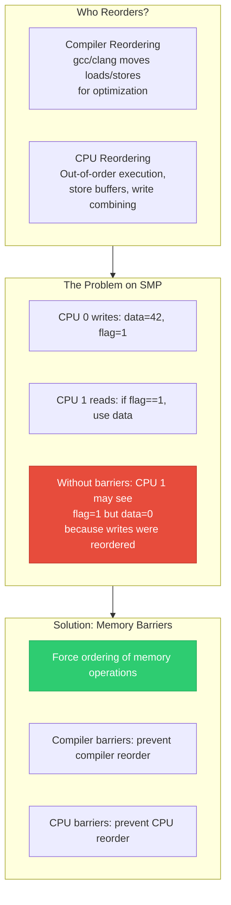
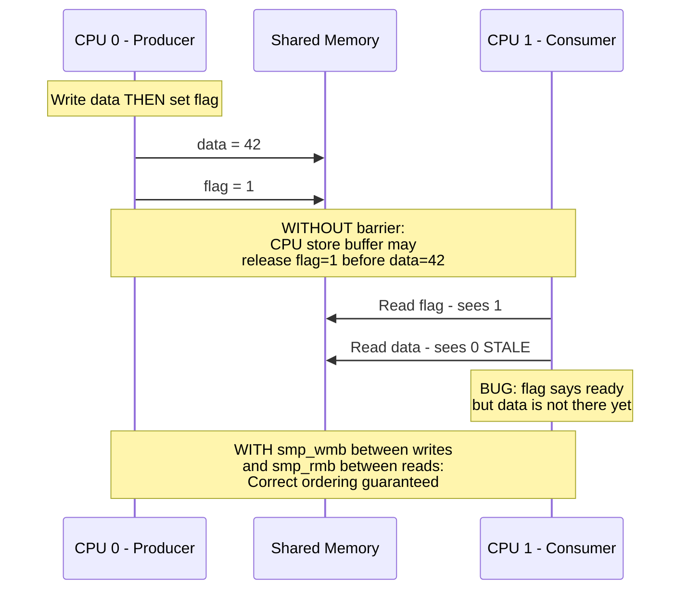
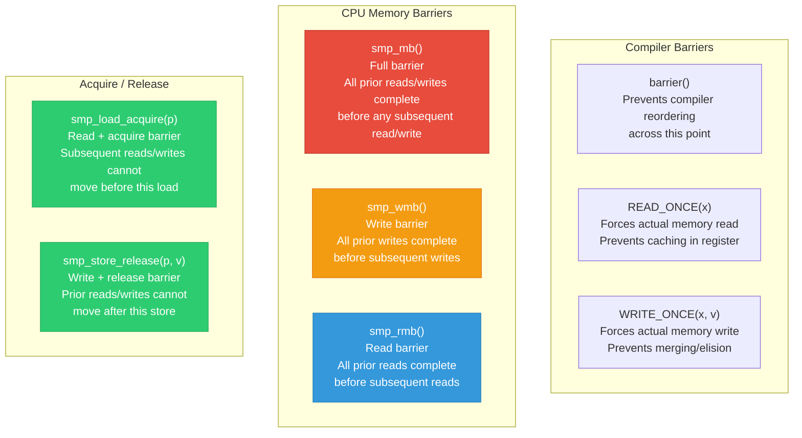
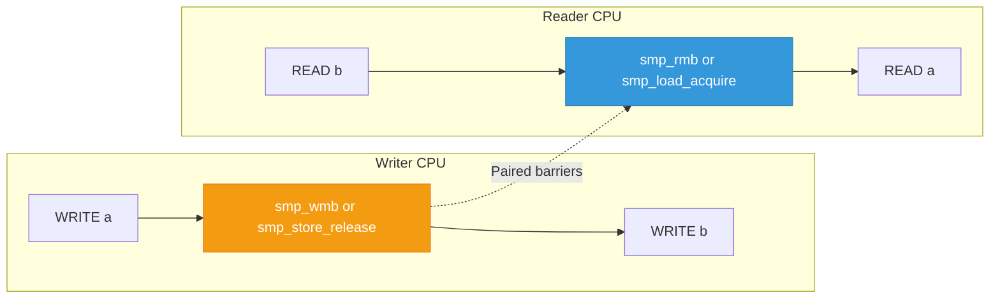
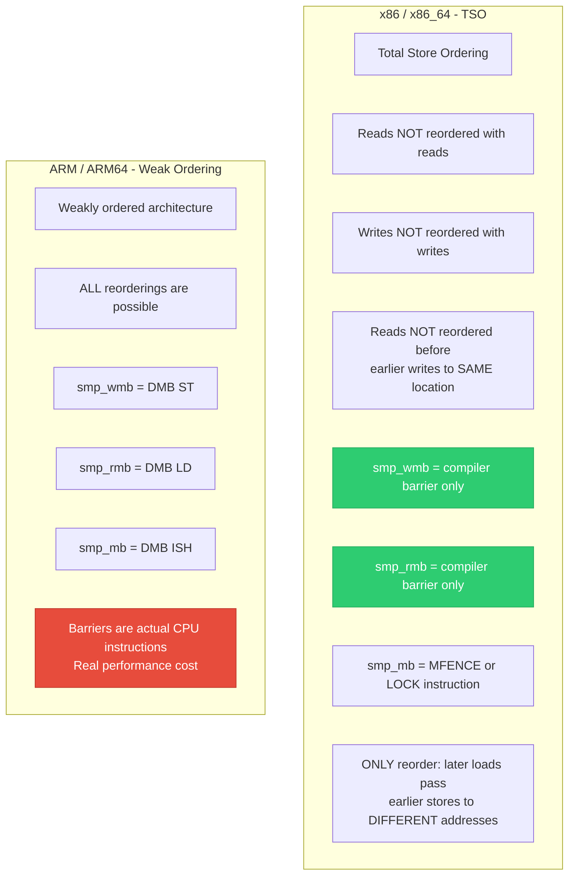
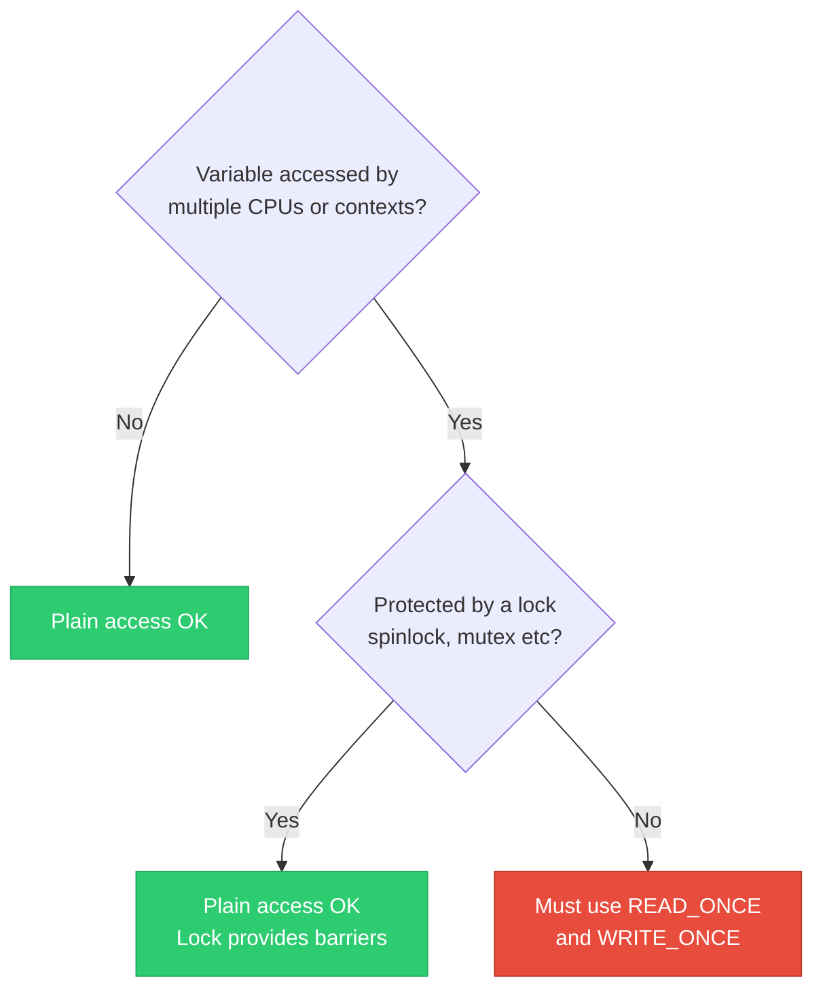
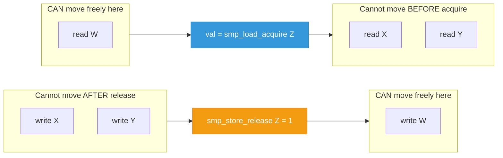

# 09 — Memory Barriers

> **Scope**: Why memory barriers exist, compiler barriers, CPU barriers (smp_mb, smp_wmb, smp_rmb), READ_ONCE/WRITE_ONCE, acquire/release semantics, barrier pairing, and architecture-specific behavior (x86 TSO vs ARM weak ordering).

---

## 1. Why Memory Barriers?

Both the **compiler** and the **CPU** can reorder memory accesses for performance. On a single CPU this is invisible, but on SMP systems it creates bugs.



---

## 2. Classic Problem: Flag-Based Communication



```c
/* BROKEN: no barriers */
/* CPU 0 */                 /* CPU 1 */
data = 42;                  if (flag == 1)
flag = 1;                       use(data); /* may see 0! */

/* CORRECT: with barriers */
/* CPU 0 */                 /* CPU 1 */
data = 42;                  if (READ_ONCE(flag) == 1) {
smp_wmb();  /* write       smp_rmb();  /* read
               barrier */                  barrier */
WRITE_ONCE(flag, 1);           use(data); /* guaranteed 42 */
                            }
```

---

## 3. Barrier Types in Linux



---

## 4. Barrier Pairing Rules

**Every barrier on the writer side must be matched with a barrier on the reader side.**

```c
/* Write side                Read side */
WRITE_ONCE(a, 1);           r1 = READ_ONCE(b);
smp_wmb();        <----->   smp_rmb();
WRITE_ONCE(b, 1);           r2 = READ_ONCE(a);
/* If r1 == 1, then r2 is guaranteed == 1 */

/* Acquire/Release (preferred modern style) */
WRITE_ONCE(a, 1);           r1 = smp_load_acquire(&b);
smp_store_release(&b, 1);   r2 = READ_ONCE(a);
/* Same guarantee, cleaner API */
```



---

## 5. Architecture Differences



| Reorder Type | x86 | ARM | PowerPC |
|-------------|-----|-----|---------|
| Load-Load | NO | YES | YES |
| Load-Store | NO | YES | YES |
| Store-Store | NO | YES | YES |
| Store-Load | **YES** | YES | YES |

---

## 6. READ_ONCE / WRITE_ONCE

```c
/* Problem: compiler can optimize away or merge accesses */
while (flag == 0) { }  
/* Compiler may load flag ONCE and loop forever
 * because it proves flag doesn't change in THIS function */

/* Solution: READ_ONCE forces a genuine memory load each time */
while (READ_ONCE(flag) == 0) { }

/* WRITE_ONCE prevents write tearing and elision */
WRITE_ONCE(flag, 1);
/* Prevents: compiler combining with other writes,
 * invented writes, partial writes on non-atomic types */
```

### When to use:



---

## 7. Acquire / Release Semantics

```c
/* Modern preferred pattern — replaces explicit barriers */

/* Release: all prior memory ops are visible before this store */
smp_store_release(&published, data_ptr);
/* Equivalent to: smp_wmb(); WRITE_ONCE(published, data_ptr); */

/* Acquire: all subsequent memory ops happen after this load */
p = smp_load_acquire(&published);
/* Equivalent to: p = READ_ONCE(published); smp_rmb(); */

/* KEY ADVANTAGE:
 * Acquire/release are one-directional barriers.
 * smp_mb() is two-directional (stronger, slower).
 * Acquire/release give the CPU more freedom to optimize
 * while still providing the guarantee you actually need. */
```



---

## 8. Barriers Inside Lock Operations

```c
/* You DON'T need explicit barriers when using locks:
 * spin_lock/spin_unlock include barriers internally */

spin_lock(&lock);     /* includes ACQUIRE barrier */
/* Everything here is ordered after the lock */
shared_data = 42;
spin_unlock(&lock);   /* includes RELEASE barrier */
/* Everything above is ordered before the unlock */

/* mutex_lock/mutex_unlock: same implicit barriers */

/* atomic operations with _acquire/_release:
 * atomic_read_acquire(), atomic_set_release()
 * include the appropriate one-directional barrier */
```

---

## 9. Real Kernel Example: Ring Buffer

```c
/* Classic lock-free producer-consumer ring buffer */
struct ring {
    void *buffer[RING_SIZE];
    unsigned int head;  /* Producer writes here */
    unsigned int tail;  /* Consumer reads here */
};

/* Producer: */
void ring_produce(struct ring *r, void *item)
{
    unsigned int h = READ_ONCE(r->head);
    
    r->buffer[h % RING_SIZE] = item;
    
    /* Write barrier: ensure buffer write visible 
     * before head update */
    smp_store_release(&r->head, h + 1);
}

/* Consumer: */
void *ring_consume(struct ring *r)
{
    unsigned int t = r->tail;
    unsigned int h;
    void *item;
    
    /* Acquire: ensure we see producer's buffer write
     * if we see the head update */
    h = smp_load_acquire(&r->head);
    
    if (t == h)
        return NULL;  /* Empty */
    
    item = r->buffer[t % RING_SIZE];
    WRITE_ONCE(r->tail, t + 1);
    
    return item;
}
```

---

## 10. Deep Q&A

### Q1: Why is smp_mb needed on x86 when x86 has TSO?

**A:** TSO prevents load-load, store-store, and load-store reordering, but allows **store-load** reordering: a later load can pass an earlier store (because of the store buffer). `smp_mb()` on x86 uses MFENCE or a LOCK prefix to flush the store buffer and prevent this. This matters in algorithms like Dekker's mutual exclusion or seqlock readers.

### Q2: What is the difference between barrier() and smp_mb()?

**A:** `barrier()` is a compiler-only barrier: prevents the compiler from moving C statements across it, but the CPU can still reorder at runtime. `smp_mb()` is both compiler + CPU barrier: prevents both compiler and hardware reordering. On UP, `smp_mb()` degrades to just `barrier()` because there's only one CPU.

### Q3: Can READ_ONCE/WRITE_ONCE replace memory barriers?

**A:** No. READ_ONCE/WRITE_ONCE prevent the compiler from optimizing away or merging accesses, but they do NOT prevent CPU reordering. You need `smp_wmb()`, `smp_rmb()`, or acquire/release semantics to order operations across CPUs. Think of READ_ONCE/WRITE_ONCE as "compiler barriers for individual accesses" and smp_* as "CPU ordering guarantees."

### Q4: Why are acquire/release preferred over smp_wmb/smp_rmb?

**A:** Three reasons: (1) Intent: acquire/release express the pattern "publish data" clearly. (2) Performance: they are one-directional barriers, giving the CPU more optimization room than a full `smp_mb()`. (3) Correctness: they are associated with a specific variable access, so the reader-writer pairing is explicit and harder to get wrong. The kernel documentation recommends acquire/release for new code.

---

[← Previous: 08 — Completions](08_Completions.md) | [Next: 10 — Per-CPU Variables →](10_Per_CPU_Variables.md)
