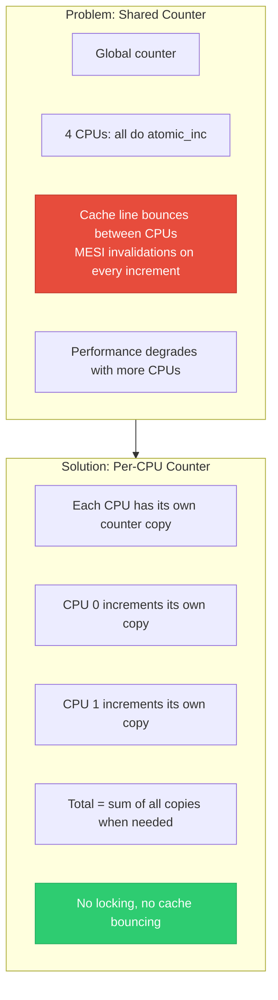
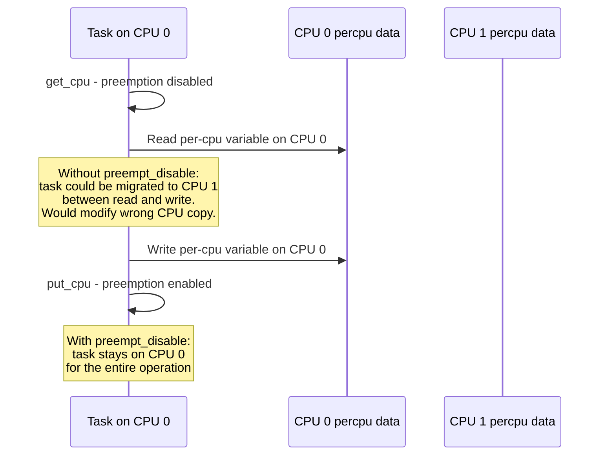
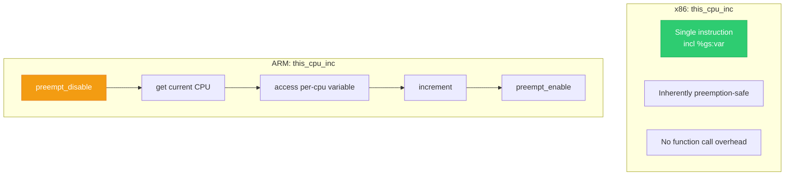
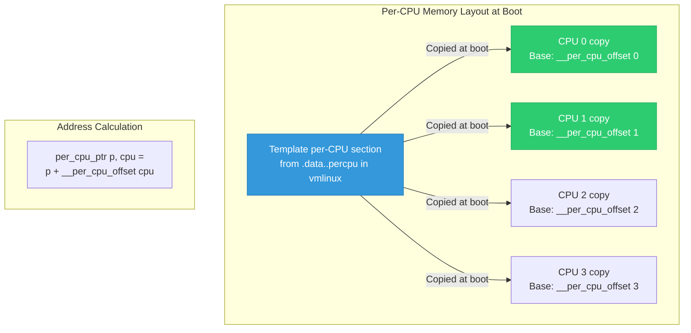

# 10 — Per-CPU Variables

> **Scope**: DEFINE_PER_CPU, get_cpu_var/put_cpu_var, this_cpu_ptr, per-CPU allocator, per-CPU counters, and how per-CPU variables avoid locking entirely.

---

## 1. Why Per-CPU Variables?

Per-CPU variables give each CPU its own private copy of data. Since only one CPU accesses its copy, **no locks, no atomics, no cache-line bouncing** are needed.



---

## 2. Per-CPU API

```c
#include <linux/percpu.h>

/* --- Static Allocation --- */
DEFINE_PER_CPU(int, my_counter);
DEFINE_PER_CPU(struct stats, cpu_stats);

/* Access with preemption disabled */
get_cpu_var(my_counter)++;    /* Disables preemption + returns lvalue */
put_cpu_var(my_counter);      /* Re-enables preemption */

/* OR: get CPU ID explicitly */
int cpu = get_cpu();          /* Disables preemption, returns CPU id */
per_cpu(my_counter, cpu)++;
put_cpu();                    /* Re-enables preemption */

/* Fastest: this_cpu operations (single instruction on x86) */
this_cpu_inc(my_counter);     /* preempt-safe on x86 via segment prefix */
this_cpu_add(my_counter, 5);
this_cpu_read(my_counter);
this_cpu_write(my_counter, 0);

/* Read any CPU's copy (for aggregation) */
int val = per_cpu(my_counter, target_cpu);

/* --- Dynamic Allocation --- */
int __percpu *dyn_counter;
dyn_counter = alloc_percpu(int);
/* Or: alloc_percpu_gfp(type, gfp_flags) */

*per_cpu_ptr(dyn_counter, cpu) = 42;  /* Access specific CPU */
this_cpu_write(*dyn_counter, 42);     /* Access current CPU */

free_percpu(dyn_counter);
```

---

## 3. Why Disable Preemption?



---

## 4. this_cpu Operations — Zero-Cost on x86

```c
/* x86 magic: this_cpu_inc compiles to a SINGLE instruction */
this_cpu_inc(my_counter);

/* Compiles to:
 *   incl %gs:my_counter
 * 
 * The %gs segment register points to per-CPU data area.
 * ONE instruction = inherently atomic vs preemption.
 * No preempt_disable/enable needed!
 * 
 * On ARM: this_cpu_* requires preempt_disable internally */
```



---

## 5. Per-CPU Memory Layout



---

## 6. Per-CPU Statistics Pattern

```c
/* Common pattern: per-CPU stats aggregated when read */
struct net_device_stats {
    DEFINE_PER_CPU(struct pcpu_sw_netstats, stats);
};

/* Hot path: update stats on packet receive (fast, no lock) */
void rx_packet(struct net_device *dev, int bytes)
{
    struct pcpu_sw_netstats *stats = this_cpu_ptr(&dev->stats);
    
    u64_stats_update_begin(&stats->syncp);
    stats->rx_packets++;
    stats->rx_bytes += bytes;
    u64_stats_update_end(&stats->syncp);
}

/* Cold path: aggregate all CPUs when /proc/net/dev is read */
void get_stats(struct net_device *dev, struct rtnl_link_stats64 *total)
{
    int cpu;
    
    memset(total, 0, sizeof(*total));
    
    for_each_possible_cpu(cpu) {
        struct pcpu_sw_netstats *stats = per_cpu_ptr(&dev->stats, cpu);
        unsigned int start;
        u64 rx_packets, rx_bytes;
        
        do {
            start = u64_stats_fetch_begin(&stats->syncp);
            rx_packets = stats->rx_packets;
            rx_bytes = stats->rx_bytes;
        } while (u64_stats_fetch_retry(&stats->syncp, start));
        
        total->rx_packets += rx_packets;
        total->rx_bytes += rx_bytes;
    }
}
```

---

## 7. Per-CPU vs Other Approaches

| Approach | Cache Behavior | Lock Needed? | Aggregation Cost |
|----------|---------------|--------------|-----------------|
| Global + spinlock | One cache line, bouncing | Yes | Zero |
| Global + atomic | One cache line, bouncing | No | Zero |
| Per-CPU variable | Each CPU local, no bouncing | No (preempt only) | Sum over NR_CPUs |
| Per-CPU + local_t | Same as per-CPU | No | Sum over NR_CPUs |

---

## 8. Per-CPU and IRQ Context

```c
/* Per-CPU variables are safe in IRQ context IF:
 * - IRQ handler only accesses its own CPU's copy
 * - Process context uses this_cpu_* which is atomic
 * 
 * But if IRQ can interrupt a get_cpu_var/put_cpu_var block
 * and modify the same per-CPU variable, you need irqsave: */

/* Option 1: this_cpu_* (safe on x86, single instruction) */
this_cpu_inc(my_counter);  /* Safe vs IRQ on x86 */

/* Option 2: explicit IRQ disable for multi-step operations */
unsigned long flags;
local_irq_save(flags);
struct my_data *p = this_cpu_ptr(&my_percpu_data);
p->field1++;
p->field2 += p->field1;  /* Multi-step: need IRQ disabled */
local_irq_restore(flags);
```

---

## 9. Deep Q&A

### Q1: When would you NOT use per-CPU variables?

**A:** (1) When you need a globally consistent value — per-CPU requires aggregation which is expensive and not atomic. (2) When data is naturally per-object, not per-CPU (e.g., per-inode counters). (3) When memory is tight — per-CPU allocates NR_CPUs copies even on systems with few online CPUs. (4) When access from other CPUs is frequent — defeats the purpose.

### Q2: How does for_each_possible_cpu differ from for_each_online_cpu?

**A:** `for_each_possible_cpu()` iterates over all CPUs that COULD exist (from kernel config), including hot-pluggable ones not yet online. `for_each_online_cpu()` iterates only currently running CPUs. For per-CPU aggregation, use `for_each_possible_cpu()` because a CPU might have been online, updated its data, then gone offline. Using `for_each_online_cpu()` would miss that data.

### Q3: What is local_t and how does it relate to per-CPU?

**A:** `local_t` is a per-CPU atomic type that uses CPU-local atomic operations (no LOCK prefix on x86). It's optimized for counters that are only modified by the local CPU but read by other CPUs. `local_inc(&my_local)` compiles to `incl` (not `lock incl`) because only the local CPU writes. Other CPUs can read it without locks. It combines atomic safety with per-CPU performance.

### Q4: How are per-CPU variables allocated for dynamically hot-plugged CPUs?

**A:** The per-CPU allocator pre-allocates copies for all possible CPUs at boot time (up to `NR_CPUS`). When a new CPU comes online via CPU hotplug, its per-CPU area already exists — it just needs initialization. The `cpuhp_setup_state()` callback mechanism lets subsystems initialize their per-CPU data when a CPU comes online.

---

[← Previous: 09 — Memory Barriers](09_Memory_Barriers.md) | [Next: 11 — Preemption Control →](11_Preemption_Control.md)
