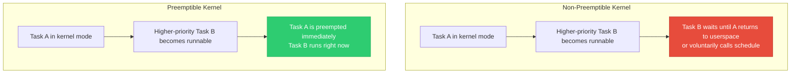
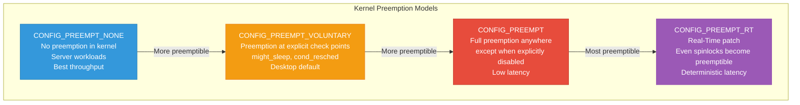
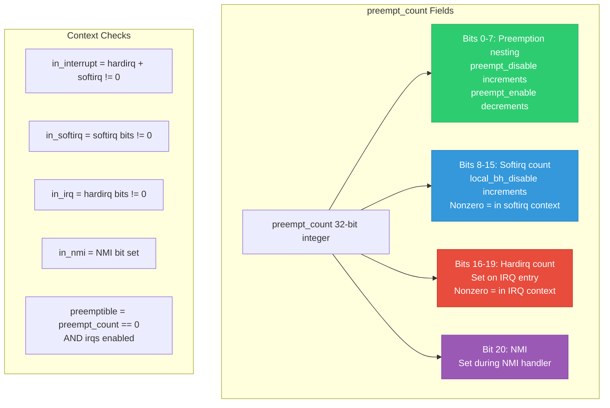
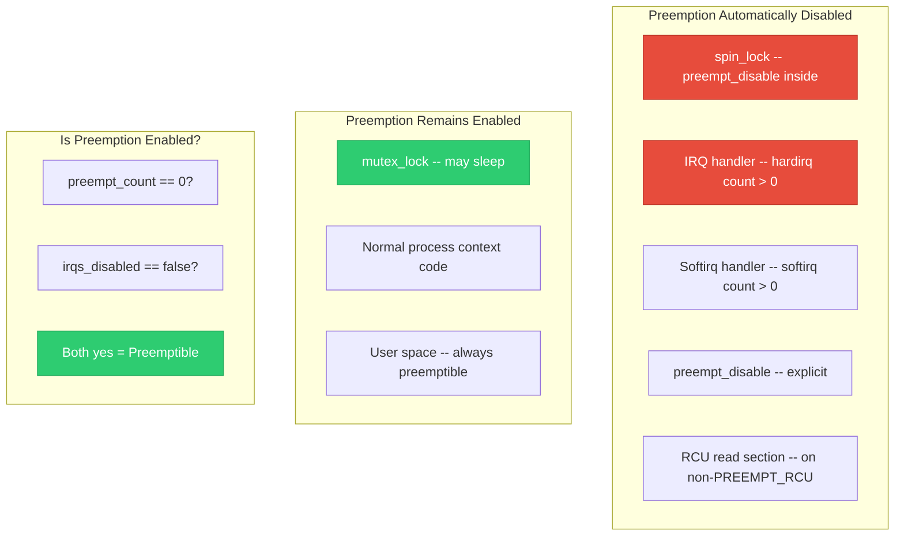
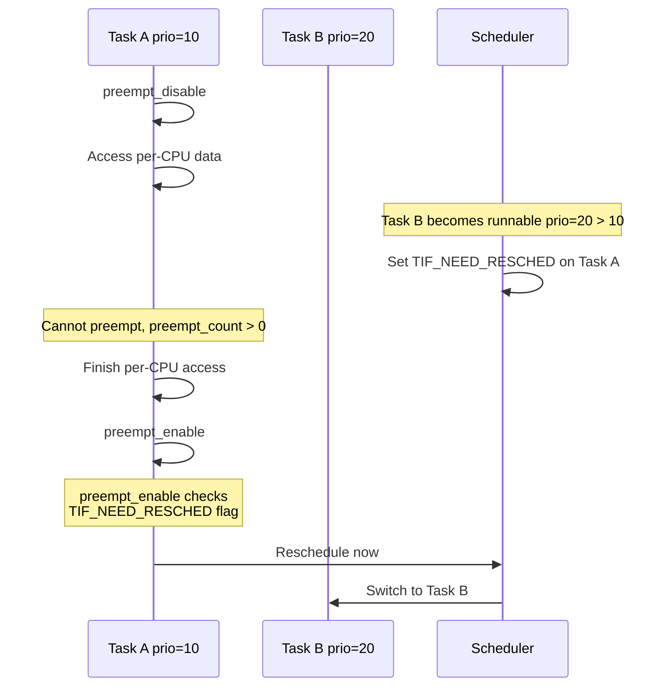
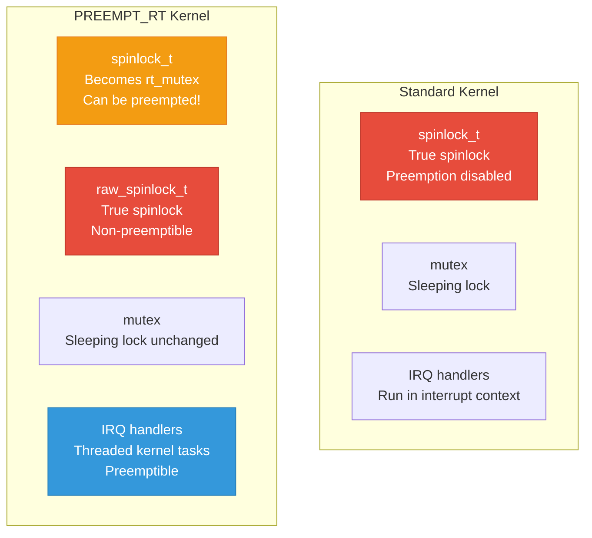

# 11 — Preemption Control

> **Scope**: preempt_disable/enable, preempt_count, CONFIG_PREEMPT variants, preemption and synchronization interactions, preemptible vs non-preemptible kernels, and PREEMPT_RT.

---

## 1. What is Kernel Preemption?

Kernel preemption means a higher-priority task can **interrupt** a currently running kernel-mode task and take over the CPU, even in the middle of kernel code.



---

## 2. CONFIG_PREEMPT Variants



| Model | Preemption Points | Latency | Throughput | Use Case |
|-------|-------------------|---------|------------|----------|
| PREEMPT_NONE | Return to userspace only | High (ms) | Best | Servers, HPC |
| PREEMPT_VOLUNTARY | cond_resched + return | Medium | Good | Desktop |
| PREEMPT | Everywhere except atomic | Low (us) | Good | Embedded, audio |
| PREEMPT_RT | Even spinlock holders | Very low (us) | Lower | Industrial RT |

---

## 3. preempt_count — The Master Counter

```c
/* preempt_count is per-task, stored in thread_info */
/* It encodes MULTIPLE nesting counters in one integer: */

/*  Bits:
 *  [0:7]   = preemption count (preempt_disable nesting)
 *  [8:15]  = softirq count (in_softirq nesting)
 *  [16:19] = hardirq count (in_interrupt nesting)
 *  [20]    = NMI flag
 *  [21]    = PREEMPT_NEED_RESCHED
 */

/* Preemption is DISABLED when preempt_count != 0 
 * i.e., in any of: disabled, softirq, hardirq, NMI */
```



---

## 4. preempt_disable / preempt_enable API

```c
#include <linux/preempt.h>

preempt_disable();    /* Increment preempt_count */
/* Critical section: task stays on THIS CPU */
preempt_enable();     /* Decrement; may reschedule if needed */

/* Nestable: */
preempt_disable();       /* count = 1 */
  preempt_disable();     /* count = 2 */
  preempt_enable();      /* count = 1, still disabled */
preempt_enable();        /* count = 0, preemption re-enabled */

/* No-reschedule variant (used inside lock implementations) */
preempt_enable_no_resched();  /* Decrement but don't check TIF_NEED_RESCHED */

/* Conditional reschedule for long loops */
cond_resched();  /* If preempt_count==0 and reschedule pending, yield CPU */
/* Use in long loops to keep system responsive */
```

---

## 5. When is Preemption Disabled?



---

## 6. Preemption and Synchronization Interaction



---

## 7. preempt_disable as a Synchronization Primitive

```c
/* preempt_disable creates a "soft" critical section:
 * - Task stays on current CPU
 * - Other tasks on THIS CPU cannot run
 * - But IRQs and softirqs CAN still fire!
 * - Other CPUs are NOT affected at all */

/* Use case: accessing per-CPU data safely */
preempt_disable();
struct my_data *p = this_cpu_ptr(&my_percpu);
p->counter++;
p->timestamp = ktime_get();
preempt_enable();

/* NOT sufficient for: */
/* - Protection against IRQ access (need local_irq_save) */
/* - SMP protection (need spinlock) */
/* - Protection against softirq (need local_bh_disable) */
```

---

## 8. PREEMPT_RT Impact on Synchronization

```c
/* Under PREEMPT_RT, many locking primitives change: */

/* spinlock_t → becomes a sleeping rt_mutex internally
 * Can be preempted while "spinning"
 * Supports priority inheritance */

/* raw_spinlock_t → remains a true spinlock
 * Only used in scheduler, timer, printk
 * Very few in the kernel (~30) */

/* local_irq_disable → only prevents IRQs, not preemption
 * Under PREEMPT_RT, IRQ handlers are threaded (run as tasks)
 * So disabling IRQs is less meaningful */

/* Implications: 
 * - spin_lock critical sections CAN sleep under RT
 * - Must use raw_spin_lock for truly non-preemptible sections
 * - All IRQ handlers are preemptible kernel threads */
```



---

## 9. Deep Q&A

### Q1: Why doesn't preempt_disable protect against SMP races?

**A:** `preempt_disable()` only affects the LOCAL CPU — it prevents rescheduling of the current task. Other CPUs run independently and can access shared data concurrently. For SMP protection, you need actual locks (spinlock/mutex) or atomic operations. `preempt_disable()` is only sufficient for per-CPU data where each CPU accesses its own copy.

### Q2: What happens if you call schedule() with preemption disabled?

**A:** The kernel detects this and prints a BUG: "scheduling while atomic" with a stack trace. The `preempt_count` is non-zero, meaning you're in an atomic context (spinlock held, IRQ disabled, etc.). Sleeping here would mean the lock is never released (or IRQs never re-enabled), leading to deadlocks. This check is in `schedule()` → `__schedule()` → `schedule_debug()`.

### Q3: How does cond_resched() work and when should you use it?

**A:** `cond_resched()` checks if a reschedule is pending (TIF_NEED_RESCHED set) AND preemption is not disabled (preempt_count == 0). If both are true, it calls `schedule()`. Use it in long kernel loops that don't disable preemption: file system operations, memory reclaim, driver initialization. Without it, on a PREEMPT_NONE kernel, these loops would run for hundreds of milliseconds without letting higher-priority tasks run.

### Q4: Explain the preempt_enable → reschedule path.

**A:** `preempt_enable()` decrements `preempt_count`. If it reaches 0, it checks `TIF_NEED_RESCHED` flag (set by the scheduler when a higher-priority task became runnable during the critical section). If the flag is set, `preempt_enable()` calls `preempt_schedule()` → `__schedule()` to switch to the higher-priority task. This is how preemption is "deferred" — the reschedule happens at the exact moment it becomes safe.

---

[← Previous: 10 — Per-CPU Variables](10_Per_CPU_Variables.md) | [Next: 12 — Waitqueues →](12_Waitqueues.md)
